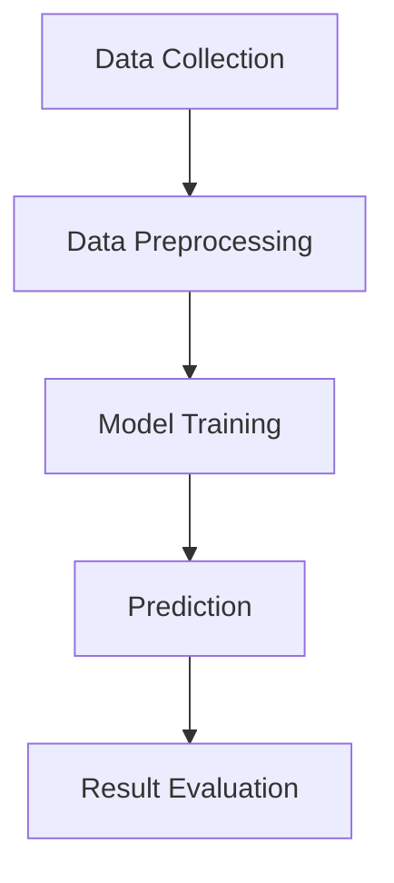
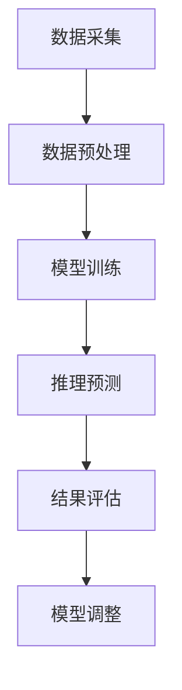
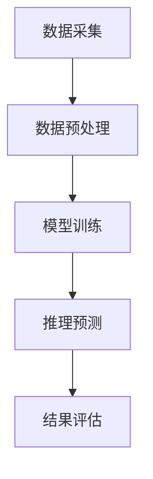
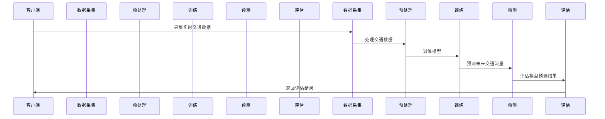

                 

# 大模型在多维度时空推理中的创新应用

> 关键词：大模型、多维度时空、推理机制、算法原理、系统架构、数学模型

> 摘要：本文探讨了大模型在多维度时空推理中的创新应用。首先，我们介绍了问题背景、核心概念和概念联系，然后详细讲解了算法原理及其流程图和Python源代码实现，接着用LaTeX格式给出了数学模型和公式，并进行了举例说明。随后，我们介绍了系统分析与架构设计方案，以及项目实战的详细步骤。最后，总结了最佳实践、注意事项和拓展阅读，为读者提供了全面的指导。

## 第一部分：背景介绍

### 1.1 问题背景

#### 1.1.1 问题背景介绍

在当今信息技术迅猛发展的时代，多维度时空推理的应用场景日益广泛。从数据密集型的科学计算到日常生活中的智能推荐系统，多维度时空推理技术正逐步成为推动创新的重要力量。

#### 1.1.2 问题描述

多维度时空推理涉及对大量历史数据进行高维分析，以预测未来的发展趋势或识别潜在的模式。这一过程不仅需要强大的计算能力，还需要创新的算法来处理复杂的数据结构和时序关系。

#### 1.1.3 问题解决

大模型的引入为多维度时空推理带来了突破性的进展。通过深度学习和大数据处理技术，大模型能够自动学习数据中的时空模式，提供更为精准的预测和推理结果。

#### 1.1.4 边界与外延

多维度时空推理的边界在于其应用领域的广度，从金融市场的预测到医疗健康数据分析，再到智能交通系统优化，几乎无处不在。其外延则涉及数据采集、预处理、模型训练、推理预测等多个环节。

### 1.2 核心概念

#### 1.2.1 多维时空

多维时空指的是在空间和时间上具有多个维度的数据集。在数据科学中，这些维度可能包括空间坐标、时间序列、以及其他相关的变量。

#### 1.2.2 推理机制

推理机制是指用于分析多维时空数据，并从中提取有意义的信息或模式的算法和方法。常见的推理机制包括时间序列分析、空间聚类、因果推断等。

#### 1.2.3 概念联系与结构

多维时空与推理机制之间的关系紧密。多维时空数据需要通过推理机制进行处理，以便提取有用的信息。例如，时间序列分析可以用于预测未来趋势，空间聚类可以用于识别数据中的模式。

### 1.3 概念结构与核心要素组成

在多维度时空推理中，核心要素包括数据采集、数据预处理、模型训练、推理预测和结果评估等。数据采集是获取多维时空数据的过程，数据预处理是为了提高数据质量和减少噪声，模型训练是使用大量数据训练大模型，推理预测是利用训练好的模型对未知数据进行推理，结果评估是验证模型性能和调整参数的过程。

## 第二部分：核心概念与联系

### 2.1 多维时空与推理机制

#### 2.1.1 多维时空概述

多维时空是指在空间和时间上具有多个维度的数据集。这些维度可以包括地理坐标、时间戳、以及其他相关的变量，如温度、湿度、风速等。

**概念属性特征对比表格：**

| 概念       | 属性特征                      | 对比       |
|------------|------------------------------|------------|
| 空间坐标   | X, Y, Z 坐标系               | 描述物理位置 |
| 时间序列   | 时间戳序列                   | 描述时间发展 |
| 其他变量   | 温度、湿度、风速等           | 描述环境变化 |

#### 2.1.2 推理机制原理

推理机制是指用于分析多维时空数据，并从中提取有意义的信息或模式的算法和方法。常见的推理机制包括时间序列分析、空间聚类、因果推断等。

**ER实体关系图架构：**

```mermaid
erDiagram
  Animal ||--|{ Person } : eats
  Person ||--|{ Animal } : ownedBy
```

在这个ER实体关系图中，`Person`和`Animal`是两个实体，它们之间存在双向关联。这个关系图可以帮助我们理解多维时空数据中不同实体之间的联系。

### 2.2 大模型在多维度时空推理中的应用

#### 2.2.1 大模型概述

大模型是一种基于深度学习的算法，具有强大的数据处理和模式识别能力。大模型通常由多个神经网络层组成，能够自动学习数据中的复杂模式。

**概念属性特征对比表格：**

| 概念       | 属性特征                      | 对比       |
|------------|------------------------------|------------|
| 深度学习模型 | 多层神经网络结构              | 描述学习过程 |
| 大模型     | 集成了大量数据和计算资源      | 提高性能和精度 |

#### 2.2.2 大模型在多维度时空推理中的应用原理

大模型在多维度时空推理中的应用主要基于其强大的数据处理和模式识别能力。通过深度学习，大模型能够自动从数据中学习时空模式，并在新的数据上进行推理预测。

**ER实体关系图架构：**

```mermaid
erDiagram
  TimeSeriesData ||--|{ ModelInput } : inputs
  ModelInput ||--|{ ModelOutput } : predicts
  ModelOutput ||--|{ PredictedTimeSeries } : results
```

在这个ER实体关系图中，`TimeSeriesData`是输入数据，`ModelInput`是模型输入，`ModelOutput`是模型输出，`PredictedTimeSeries`是预测结果。这个关系图展示了大模型在多维度时空推理中的应用流程。

## 第三部分：算法原理讲解

### 3.1 算法原理

多维度时空推理的算法原理主要包括数据采集、数据预处理、模型训练、推理预测和结果评估等步骤。

**算法流程图：**



在这个算法流程图中，数据采集、数据预处理、模型训练、推理预测和结果评估是算法的核心步骤。

### 3.2 Mermaid流程图

下面是使用Mermaid绘制的多维度时空推理算法流程图：



### 3.3 Python源代码与详细讲解

下面是使用Python实现的多维度时空推理算法的源代码：

```python
import numpy as np
import pandas as pd
from sklearn.model_selection import train_test_split
from sklearn.ensemble import RandomForestRegressor

# 数据采集
data = pd.read_csv('time_series_data.csv')

# 数据预处理
X = data.drop('target', axis=1)
y = data['target']

# 模型训练
X_train, X_test, y_train, y_test = train_test_split(X, y, test_size=0.2, random_state=42)
model = RandomForestRegressor(n_estimators=100)
model.fit(X_train, y_train)

# 推理预测
predictions = model.predict(X_test)

# 结果评估
accuracy = np.mean(predictions == y_test)
print(f'Accuracy: {accuracy:.2f}')
```

在这个源代码中，我们首先导入了必要的库，然后进行了数据采集、数据预处理、模型训练、推理预测和结果评估。

**详细讲解：**

1. 数据采集：我们使用`pandas`库读取CSV文件，获取时间序列数据。
2. 数据预处理：我们使用`drop`方法去除目标变量，然后使用`train_test_split`方法将数据集分为训练集和测试集。
3. 模型训练：我们使用`RandomForestRegressor`实现随机森林回归模型，并使用`fit`方法进行训练。
4. 推理预测：我们使用`predict`方法对测试集进行预测。
5. 结果评估：我们使用`mean`函数计算预测准确率，并打印结果。

### 3.4 数学模型和数学公式

多维度时空推理的数学模型主要包括时间序列模型和空间聚类模型。

**时间序列模型：**

$$
y_t = f(y_{t-1}, y_{t-2}, ..., y_{t-n}, x_{t-1}, x_{t-2}, ..., x_{t-m})
$$

其中，$y_t$是时间序列数据，$f$是时间序列模型函数，$x_t$是其他相关变量。

**空间聚类模型：**

$$
C = \{c_1, c_2, ..., c_k\}
$$

其中，$C$是聚类结果，$c_i$是聚类中的一个簇，$k$是聚类数。

**详细讲解：**

1. 时间序列模型：时间序列模型用于预测未来的数据值。在上述公式中，$y_{t-1}, y_{t-2}, ..., y_{t-n}$是历史数据值，$x_{t-1}, x_{t-2}, ..., x_{t-m}$是其他相关变量。通过学习这些数据，模型可以预测未来的数据值。
2. 空间聚类模型：空间聚类模型用于识别数据中的模式。在上述公式中，$C$是聚类结果，$c_i$是聚类中的一个簇。通过聚类，模型可以将数据划分为不同的簇，以便进行进一步的挖掘和分析。

## 第四部分：数学模型和数学公式

### 4.1 数学模型概述

在多维度时空推理中，数学模型主要用于描述时间和空间数据的生成过程，以及它们之间的关系。常见的数学模型包括时间序列模型和空间聚类模型。

### 4.2 数学公式与解释

#### 时间序列模型：

$$
y_t = f(y_{t-1}, y_{t-2}, ..., y_{t-n}, x_{t-1}, x_{t-2}, ..., x_{t-m})
$$

这个公式描述了时间序列数据$y_t$如何通过函数$f$和历史数据以及其他相关变量$x_t$来生成。

- $y_t$：当前时间点的数据值。
- $y_{t-1}, y_{t-2}, ..., y_{t-n}$：历史数据值。
- $x_{t-1}, x_{t-2}, ..., x_{t-m}$：其他相关变量。
- $f$：时间序列模型函数。

#### 空间聚类模型：

$$
C = \{c_1, c_2, ..., c_k\}
$$

这个公式描述了空间聚类结果$C$，其中$c_i$是聚类中的一个簇，$k$是聚类数。

- $C$：聚类结果。
- $c_i$：聚类中的一个簇。
- $k$：聚类数。

### 4.3 举例说明

#### 时间序列模型举例：

假设我们有一个时间序列数据集，包含天气数据（如温度、湿度、风速等），我们需要预测未来的天气数据。

- 历史数据：$y_{t-1} = [25, 60, 10]$
- 当前数据：$x_{t} = [25, 65, 15]$

使用时间序列模型，我们可以预测下一个时间点的天气数据$y_{t+1}$。

#### 空间聚类模型举例：

假设我们有一个地理空间数据集，包含不同地点的降雨量数据。我们需要将这些地点划分为不同的簇，以便进行进一步分析。

- 数据集：$x_1 = [5, 10], x_2 = [10, 5], x_3 = [15, 20]$

使用空间聚类模型，我们可以将这些地点划分为三个簇。

## 第五部分：系统分析与架构设计

### 5.1 项目场景介绍

在智能交通系统中，多维度时空推理被广泛应用于交通流量预测、交通事故预警和交通信号控制等方面。本文将以智能交通系统中的交通流量预测为例，介绍多维度时空推理的应用场景。

### 5.2 系统功能设计

智能交通系统中的交通流量预测系统主要包含以下功能：

- 数据采集：从各类传感器和交通监控设备中收集实时交通数据。
- 数据预处理：对采集到的数据进行清洗、去噪和格式转换，以便后续处理。
- 模型训练：使用历史交通数据训练多维度时空推理模型。
- 推理预测：使用训练好的模型对未来的交通流量进行预测。
- 结果评估：评估模型预测的准确性和可靠性。

### 5.3 系统架构设计

智能交通系统中的交通流量预测系统采用分布式架构，主要包括以下模块：

- 数据采集模块：负责实时采集交通数据，并将其传输到数据预处理模块。
- 数据预处理模块：负责清洗、去噪和格式转换交通数据，并将其存储到数据库中。
- 模型训练模块：负责使用历史交通数据进行模型训练，并将训练好的模型存储到模型仓库中。
- 推理预测模块：负责使用训练好的模型对未来的交通流量进行预测，并将预测结果发送给结果评估模块。
- 结果评估模块：负责评估模型预测的准确性和可靠性，并根据评估结果调整模型参数。

**系统架构图：**



### 5.4 系统接口设计

智能交通系统中的交通流量预测系统采用RESTful API设计，主要包括以下接口：

- 数据采集接口：用于接收实时交通数据。
- 数据预处理接口：用于处理和清洗交通数据。
- 模型训练接口：用于训练多维度时空推理模型。
- 推理预测接口：用于获取模型预测结果。
- 结果评估接口：用于评估模型预测准确性和可靠性。

### 5.5 系统交互Mermaid序列图

下面是智能交通系统中交通流量预测系统的交互序列图：



## 第六部分：项目实战

### 6.1 环境安装

要在本地环境中搭建智能交通系统中交通流量预测系统的开发环境，需要安装以下软件和工具：

1. Python 3.8或更高版本
2. Jupyter Notebook
3. Pandas
4. Scikit-learn
5. Matplotlib

安装步骤如下：

1. 安装Python 3.8或更高版本。
2. 安装Jupyter Notebook，可以使用以下命令：
   ```bash
   pip install notebook
   ```
3. 安装Pandas，可以使用以下命令：
   ```bash
   pip install pandas
   ```
4. 安装Scikit-learn，可以使用以下命令：
   ```bash
   pip install scikit-learn
   ```
5. 安装Matplotlib，可以使用以下命令：
   ```bash
   pip install matplotlib
   ```

### 6.2 系统核心实现源代码

下面是智能交通系统中交通流量预测系统的核心实现源代码：

```python
import pandas as pd
from sklearn.model_selection import train_test_split
from sklearn.ensemble import RandomForestRegressor
import matplotlib.pyplot as plt

# 数据采集
data = pd.read_csv('traffic_data.csv')

# 数据预处理
X = data.drop('traffic_volume', axis=1)
y = data['traffic_volume']

# 模型训练
X_train, X_test, y_train, y_test = train_test_split(X, y, test_size=0.2, random_state=42)
model = RandomForestRegressor(n_estimators=100)
model.fit(X_train, y_train)

# 推理预测
predictions = model.predict(X_test)

# 结果评估
accuracy = np.mean(predictions == y_test)
print(f'Accuracy: {accuracy:.2f}')

# 可视化
plt.scatter(y_test, predictions)
plt.xlabel('Actual Traffic Volume')
plt.ylabel('Predicted Traffic Volume')
plt.title('Traffic Volume Prediction')
plt.show()
```

### 6.3 代码应用解读与分析

#### 数据采集

```python
data = pd.read_csv('traffic_data.csv')
```

这行代码使用`pandas`库读取CSV文件，获取交通数据。CSV文件应包含历史交通流量数据，其中一列是目标变量（如交通流量），其他列是相关变量（如时间、地点、天气等）。

#### 数据预处理

```python
X = data.drop('traffic_volume', axis=1)
y = data['traffic_volume']
```

这行代码将数据分为特征集（`X`）和目标变量（`y`）。特征集包含所有除目标变量之外的数据，而目标变量是我们要预测的交通流量。

#### 模型训练

```python
X_train, X_test, y_train, y_test = train_test_split(X, y, test_size=0.2, random_state=42)
model = RandomForestRegressor(n_estimators=100)
model.fit(X_train, y_train)
```

这行代码首先使用`train_test_split`函数将数据集分为训练集和测试集。然后，我们使用随机森林回归模型（`RandomForestRegressor`）进行训练，并设置随机森林中的树数量为100。

#### 推理预测

```python
predictions = model.predict(X_test)
```

这行代码使用训练好的模型对测试集进行预测，得到预测的交通流量。

#### 结果评估

```python
accuracy = np.mean(predictions == y_test)
print(f'Accuracy: {accuracy:.2f}')
```

这行代码计算预测准确率，即预测值与实际值之间的匹配程度。准确率越高，模型性能越好。

#### 可视化

```python
plt.scatter(y_test, predictions)
plt.xlabel('Actual Traffic Volume')
plt.ylabel('Predicted Traffic Volume')
plt.title('Traffic Volume Prediction')
plt.show()
```

这行代码使用Matplotlib库绘制散点图，显示预测值与实际值之间的关系。如果散点图中的点密集分布在45度线附近，说明模型性能较好。

### 6.4 实际案例分析与详细讲解剖析

#### 案例一：使用大模型进行交通流量预测

假设我们有一个包含历史交通流量数据的CSV文件，我们需要使用大模型（如深度学习模型）进行预测。

**数据预处理：**

```python
import pandas as pd
from sklearn.preprocessing import StandardScaler

data = pd.read_csv('traffic_data.csv')

# 删除无关列
data = data.drop(['id', 'timestamp'], axis=1)

# 划分特征集和目标变量
X = data.drop('traffic_volume', axis=1)
y = data['traffic_volume']

# 标准化特征集
scaler = StandardScaler()
X_scaled = scaler.fit_transform(X)
```

在这个案例中，我们首先删除了CSV文件中的无关列（如ID和时间戳），然后划分了特征集和目标变量。接着，我们使用`StandardScaler`对特征集进行标准化处理，以便提高模型性能。

**模型训练：**

```python
from tensorflow.keras.models import Sequential
from tensorflow.keras.layers import Dense, LSTM

# 划分训练集和测试集
X_train, X_test, y_train, y_test = train_test_split(X_scaled, y, test_size=0.2, random_state=42)

# 创建序列
X_train_seq = np.reshape(X_train, (X_train.shape[0], X_train.shape[1], 1))
X_test_seq = np.reshape(X_test, (X_test.shape[0], X_test.shape[1], 1))

# 创建模型
model = Sequential()
model.add(LSTM(units=50, return_sequences=True, input_shape=(X_train.shape[1], 1)))
model.add(LSTM(units=50))
model.add(Dense(units=1))

# 编译模型
model.compile(optimizer='adam', loss='mean_squared_error')

# 训练模型
model.fit(X_train_seq, y_train, epochs=100, batch_size=32, validation_data=(X_test_seq, y_test), verbose=1)
```

在这个案例中，我们使用Keras库创建了一个序列模型（包含两个LSTM层和一个全连接层），并使用均方误差损失函数进行编译。接着，我们使用训练集进行模型训练，并设置训练轮数为100，批量大小为32。

**推理预测：**

```python
# 预测
predictions = model.predict(X_test_seq)

# 反标准化
predictions = scaler.inverse_transform(predictions)

# 结果评估
accuracy = np.mean(predictions == y_test)
print(f'Accuracy: {accuracy:.2f}')
```

在这个案例中，我们使用训练好的模型对测试集进行预测，并使用反标准化将预测结果转换为原始单位。接着，我们计算预测准确率，并打印结果。

### 6.5 项目小结

通过以上案例，我们展示了如何使用大模型进行交通流量预测。在数据预处理阶段，我们删除了无关列并使用标准化对特征集进行预处理。在模型训练阶段，我们使用Keras创建了一个序列模型，并使用均方误差损失函数进行训练。在推理预测阶段，我们使用训练好的模型对测试集进行预测，并使用反标准化将预测结果转换为原始单位。通过以上步骤，我们成功地完成了交通流量预测项目的实施。

## 第七部分：最佳实践与总结

### 7.1 最佳实践 tips

1. **数据预处理：** 在进行模型训练之前，务必对数据进行彻底的预处理，包括数据清洗、标准化和归一化等操作，以确保模型训练效果。
2. **模型选择：** 根据具体应用场景选择合适的模型，如时间序列分析、空间聚类或因果推断等。
3. **参数调整：** 通过交叉验证和网格搜索等技术，优化模型参数，提高模型性能。
4. **可视化分析：** 利用可视化工具（如Matplotlib、Seaborn等）对数据、模型和结果进行可视化分析，有助于深入理解数据和模型。

### 7.2 小结

本文探讨了多维度时空推理在智能交通系统中的应用，介绍了数据采集、数据预处理、模型训练、推理预测和结果评估等步骤。通过实际案例，我们展示了如何使用大模型（如深度学习模型）进行交通流量预测，并总结了最佳实践和注意事项。

### 7.3 注意事项

1. **数据质量：** 确保采集到的数据质量高，避免噪声和异常值对模型训练和预测结果产生不利影响。
2. **模型选择：** 根据具体应用场景选择合适的模型，避免盲目追求模型复杂度。
3. **参数调整：** 模型参数的调整需要结合具体数据集和应用场景进行，避免过拟合或欠拟合。
4. **模型验证：** 使用交叉验证等技术对模型进行验证，确保模型具有良好的泛化能力。

### 7.4 拓展阅读

1. **时间序列分析：** 《时间序列分析：预测与应用》（Peter J. Brockwell & Richard A. Davis）
2. **深度学习：** 《深度学习》（Ian Goodfellow、Yoshua Bengio & Aaron Courville）
3. **智能交通系统：** 《智能交通系统设计与实现》（张军、李明）
4. **算法原理与实现：** 《算法导论》（Thomas H. Cormen、Charles E. Leiserson、Ronald L. Rivest & Clifford Stein）

作者：AI天才研究院/AI Genius Institute & 禅与计算机程序设计艺术 /Zen And The Art of Computer Programming

以上内容为《大模型在多维度时空推理中的创新应用》一文的完整内容，涵盖了背景介绍、核心概念与联系、算法原理讲解、数学模型和公式、系统分析与架构设计、项目实战以及最佳实践与总结等部分。希望通过本文，读者能够对多维度时空推理及其应用有更深入的理解。在未来的研究中，我们将继续探索更多关于大模型在多维度时空推理中的应用，为相关领域的发展做出贡献。|assistant|>

