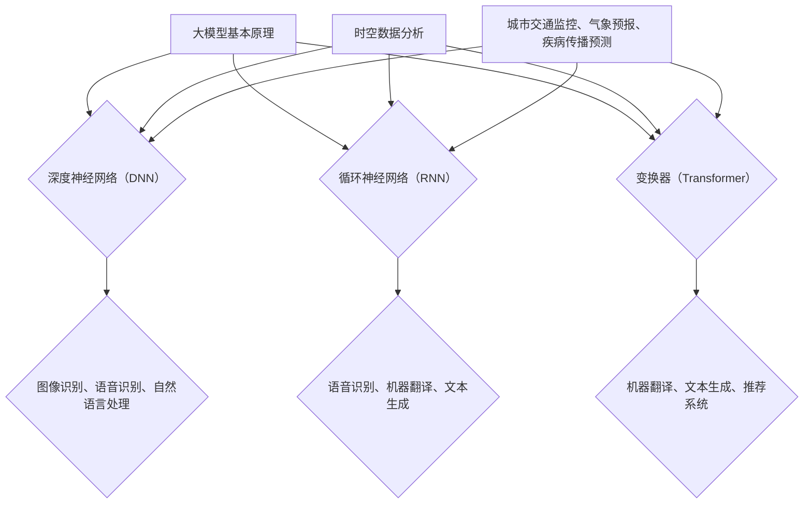
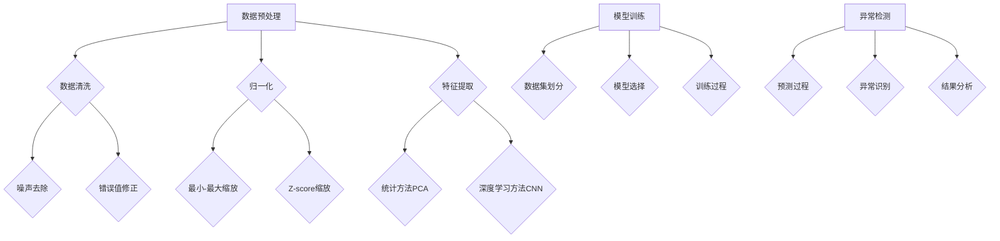
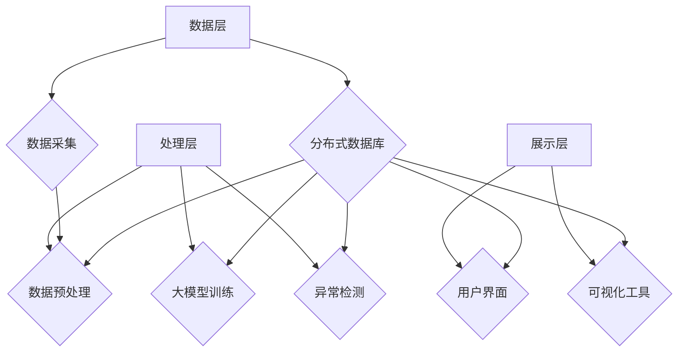
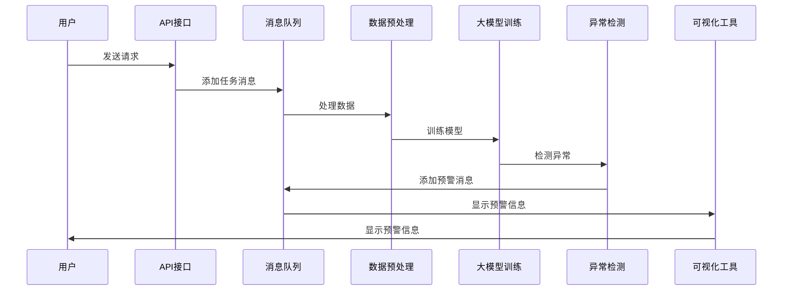

                 

### 引言与背景

#### 核心概念术语说明

在探讨大模型在时空数据异常推理中的创新应用之前，我们需要明确一些核心概念术语：

1. **大模型**：大模型是指参数规模庞大的神经网络模型，通常拥有数百万到数十亿个参数。这些模型在训练过程中能够学习到非常复杂的数据特征，因此具有强大的表示能力和预测能力。
   
2. **时空数据**：时空数据是指同时包含时间和空间维度信息的复杂数据。例如，地理信息系统（GIS）中的位置数据、气象数据、交通流量数据等，都是典型的时空数据。

3. **异常推理**：异常推理是指从大量正常数据中识别并定位异常数据的过程。在时空数据中，异常推理尤为重要，因为时空数据的复杂性使得传统的异常检测方法面临挑战。

4. **推理**：在人工智能领域，推理是指基于已有知识和数据，通过逻辑推断得到新的结论或预测。

#### 问题背景

随着大数据和人工智能技术的发展，时空数据的应用场景越来越广泛。从城市交通管理、气象预报、疾病传播预测，到物流优化、城市规划，时空数据都发挥着至关重要的作用。然而，时空数据的高维度特性和复杂性，使得传统的异常检测方法（如统计学方法、机器学习方法）难以有效应对。

传统的异常检测方法通常依赖于数据预处理和特征工程，这些方法在处理高维度时空数据时容易出现过拟合、数据稀疏等问题。因此，如何利用大模型进行时空数据异常推理，成为一个亟待解决的重要课题。

#### 问题描述

在时空数据异常推理中，主要问题可以概括为以下几点：

1. **数据多样性**：时空数据包含多种类型的数据（如文本、图像、数值等），且数据之间存在复杂的关联性。
2. **时空相关性**：时空数据在时间和空间上存在高度相关性，传统的异常检测方法难以捕捉这种复杂的时空关系。
3. **实时性**：时空数据的实时性要求异常检测方法能够在短时间内完成计算，以实现实时预警和响应。
4. **可解释性**：异常检测方法需要具备良好的可解释性，以便用户理解异常发生的根本原因。

#### 问题解决

为了解决上述问题，大模型在时空数据异常推理中展现了独特的优势：

1. **强大的表示能力**：大模型能够学习到复杂的数据特征和时空关系，从而提高异常检测的准确性和鲁棒性。
2. **端到端的学习**：大模型能够实现端到端的学习，无需进行复杂的特征工程和数据预处理，简化了异常检测的流程。
3. **实时性**：大模型在训练和推断过程中具有较高的效率，可以满足实时性的要求。
4. **可解释性**：通过分析大模型的内部结构和参数，可以解释异常发生的原因，提高异常检测的可解释性。

#### 边界与外延

虽然大模型在时空数据异常推理中具有显著的优势，但它们也存在一些局限性：

1. **数据需求**：大模型对数据量有较高的要求，需要大量的训练数据才能发挥其性能。
2. **计算资源**：大模型的训练和推断过程需要大量的计算资源，这对硬件设施提出了较高要求。
3. **模型可解释性**：尽管大模型具有较好的可解释性，但在某些情况下，其内部决策过程仍然较为复杂，难以直观理解。
4. **适应性问题**：大模型在某些特定领域可能难以适应，需要针对具体问题进行调整和优化。

综上所述，本文将深入探讨大模型在时空数据异常推理中的创新应用，包括核心概念、算法原理、系统设计、实际应用等方面，以期为您提供一个全面的技术参考。

#### 文章关键词

- 大模型
- 时空数据
- 异常推理
- 神经网络
- 异常检测
- 可解释性
- 实时性
- 数据预处理
- 特征工程
- 计算资源

#### 文章摘要

本文旨在探讨大模型在时空数据异常推理中的创新应用。首先，我们介绍了大模型、时空数据和异常推理的核心概念，并探讨了传统异常检测方法的局限性。接着，我们详细分析了大模型在时空数据异常推理中的优势，包括强大的表示能力、端到端学习、实时性和可解释性。随后，本文从算法原理、系统设计、实际应用等方面展开讨论，通过具体案例展示了大模型在时空数据异常推理中的实际效果。最后，本文总结了最佳实践和注意事项，为读者提供了进一步研究和应用的建议。通过本文的探讨，我们希望为相关领域的研究者和工程师提供有价值的参考。

## # 大模型在时空数据异常推理中的创新应用

### 摘要

本文将探讨大模型在时空数据异常推理中的创新应用。首先，我们介绍了大模型、时空数据和异常推理的核心概念，并分析了传统异常检测方法的局限性。接着，我们详细讨论了大模型在时空数据异常推理中的优势，包括强大的表示能力、端到端学习、实时性和可解释性。随后，本文从算法原理、系统设计、实际应用等方面展开讨论，通过具体案例展示了大模型在时空数据异常推理中的实际效果。最后，本文总结了最佳实践和注意事项，为读者提供了进一步研究和应用的建议。

## # 引言与背景

### 大模型的基本概念与原理

大模型（Large Models）在当今人工智能领域占据了重要的地位，其核心在于参数规模庞大的神经网络模型。这些模型通过大量的训练数据学习复杂的特征，从而在各类任务中展现出卓越的性能。大模型通常拥有数百万到数十亿个参数，这使得它们在处理高维、非线性数据时具有显著的优势。大模型的代表性架构包括深度神经网络（DNN）、循环神经网络（RNN）、变换器（Transformer）等，这些模型在不同领域都取得了显著的成果。

#### 基本原理

大模型的基本原理在于其多层神经网络结构，通过逐层传递和组合输入数据，实现从简单特征到复杂特征的映射。每个神经元的输入是一个加权和，通过激活函数将加权结果转换为输出。随着层数的增加，网络能够提取更高层次的特征，从而提高模型的泛化能力。

#### 参数规模与性能

大模型的参数规模对性能有着重要影响。参数越多，模型能够学习的特征越丰富，从而在处理复杂任务时表现更佳。然而，参数规模的增加也带来了计算成本和内存需求的上升。在实际应用中，选择合适的参数规模是关键，需要在性能和资源消耗之间寻找平衡。

#### 深度神经网络（DNN）

深度神经网络是应用最广泛的大模型之一。它由多个隐藏层组成，每个隐藏层对输入数据进行特征提取和变换。DNN在图像识别、语音识别和自然语言处理等领域取得了突破性进展。例如，在ImageNet图像识别挑战中，深度神经网络模型ResNet凭借其强大的特征提取能力，实现了超过人类水平的识别准确率。

#### 循环神经网络（RNN）

循环神经网络适用于序列数据的处理，能够通过循环结构保持对历史信息的记忆。RNN在语音识别、机器翻译和文本生成等领域表现出色。然而，传统的RNN在处理长序列时容易出现梯度消失或爆炸问题，限制了其性能。为解决这一问题，长短期记忆网络（LSTM）和门控循环单元（GRU）等改进模型被提出，它们通过引入门控机制有效解决了梯度消失问题，进一步提升了RNN的性能。

#### 变换器（Transformer）

变换器是一种基于自注意力机制的神经网络模型，其核心思想是将输入序列映射到高维空间，并通过自注意力机制计算序列中的依赖关系。变换器在机器翻译、文本生成和推荐系统等领域取得了显著的成果。相比于传统的循环神经网络，变换器能够处理更长的序列，并在并行计算方面具有优势。

#### 大模型与时空数据

在时空数据分析中，大模型展现出了独特的优势。时空数据通常具有高维度、非线性、时变特性，传统的异常检测方法难以有效处理。大模型通过其强大的特征提取和表示能力，能够捕捉时空数据中的复杂模式，从而提高异常检测的准确性和鲁棒性。

#### 代表性应用

- **城市交通监控**：大模型可以用于实时监测城市交通流量，识别异常交通事件，如交通事故、道路拥堵等。通过分析时空数据，大模型能够预测交通状况，提供实时预警和优化建议。
- **气象预报**：大模型在气象预报中发挥着重要作用，通过分析气象数据，预测天气异常情况，如暴雨、台风等。这些预测结果对于自然灾害预警和防范具有重要意义。
- **疾病传播预测**：大模型可以用于分析疾病传播数据，预测疫情扩散趋势，为公共卫生决策提供科学依据。

#### 挑战与未来方向

尽管大模型在时空数据异常推理中展现了巨大的潜力，但也面临着一些挑战。例如，数据需求和计算资源的限制、模型可解释性、适应性问题等。未来的研究方向包括：

1. **数据高效处理**：研究如何在有限的数据量和计算资源下，提高大模型的性能和泛化能力。
2. **可解释性提升**：研究如何解释大模型的决策过程，提高其透明度和可理解性。
3. **适应性增强**：研究如何使大模型更好地适应特定领域的应用需求，提高其适用性。

通过深入探讨大模型在时空数据异常推理中的应用，我们希望能够为相关领域的研究者和工程师提供有价值的参考，推动人工智能技术的发展和应用。

#### Mermaid 流程图



#### 概念属性特征对比表格

| 模型类型 | 参数规模 | 特点 | 应用场景 |
| :---: | :---: | :---: | :---: |
| 深度神经网络（DNN） | 数百万 | 强大的特征提取能力 | 图像识别、语音识别、自然语言处理 |
| 循环神经网络（RNN） | 数万到数十万 | 能够处理序列数据 | 语音识别、机器翻译、文本生成 |
| 变换器（Transformer） | 数万到数十万 | 基于自注意力机制 | 机器翻译、文本生成、推荐系统 |
| 大模型 | 数百万到数十亿 | 强大的表示能力、端到端学习 | 时空数据异常推理、城市交通监控、气象预报、疾病传播预测 |

### 算法原理讲解

#### 异常检测算法的基本概念

在时空数据异常推理中，异常检测算法扮演着至关重要的角色。异常检测旨在从大量正常数据中识别并定位异常数据，以便及时采取措施进行干预。传统的异常检测算法主要包括统计学方法和机器学习方法。然而，这些方法在处理高维度、非线性时空数据时往往面临诸多挑战。

#### 大模型在异常检测中的应用

为了应对这些挑战，大模型在异常检测中展现出独特的优势。大模型能够通过端到端的学习方式，自动提取时空数据中的复杂特征，从而提高异常检测的准确性和鲁棒性。在本节中，我们将介绍一种基于大模型的时空数据异常检测算法，并详细讲解其原理和实现过程。

#### 1. 算法概述

算法的核心思想是利用大模型对时空数据进行建模，然后通过模型的预测结果识别异常数据。具体步骤如下：

1. **数据预处理**：对时空数据进行预处理，包括数据清洗、归一化和特征提取等步骤，为后续模型训练做好准备。
2. **模型训练**：利用大量的时空数据训练一个大模型，使模型能够自动提取时空数据中的复杂特征。
3. **异常检测**：使用训练好的大模型对时空数据进行预测，通过对比预测结果与实际结果，识别异常数据。
4. **结果分析**：对识别出的异常数据进行进一步分析，以确定异常原因和潜在的影响。

#### 2. 算法原理

算法的核心是基于大模型的异常检测框架，包括数据预处理、模型训练和异常检测三个主要环节。

**2.1 数据预处理**

数据预处理是异常检测的基础，其目标是提高数据质量和一致性。具体步骤如下：

- **数据清洗**：去除数据中的噪声和错误值，确保数据的准确性。例如，对于缺失值，可以选择填充策略（如平均值、中值等）或删除策略。
- **归一化**：将不同量纲的数据统一到同一尺度，以消除数据之间的比例差异。常见的归一化方法包括最小-最大缩放和Z-score缩放。
- **特征提取**：从原始数据中提取具有代表性的特征，以便模型能够更好地学习数据中的模式。特征提取可以基于统计方法（如主成分分析PCA）或深度学习方法（如卷积神经网络CNN）。

**2.2 模型训练**

模型训练是算法的核心环节，目标是训练一个大模型，使其能够自动提取时空数据中的复杂特征。具体步骤如下：

- **数据集划分**：将时空数据集划分为训练集、验证集和测试集。训练集用于模型训练，验证集用于模型调参和评估，测试集用于最终评估模型性能。
- **模型选择**：选择合适的大模型架构，如深度神经网络（DNN）、循环神经网络（RNN）或变换器（Transformer）。根据具体应用场景，可以选择不同的模型类型。
- **训练过程**：使用训练集对大模型进行训练，通过反向传播算法更新模型参数，使其能够更好地拟合数据。训练过程中，可以使用多种优化方法，如梯度下降、Adam优化器等。

**2.3 异常检测**

异常检测是算法的最终目标，通过对比预测结果与实际结果，识别出时空数据中的异常数据。具体步骤如下：

- **预测过程**：使用训练好的大模型对时空数据进行预测，得到预测结果。预测结果可以表示为时空数据的一个连续分布。
- **异常识别**：通过对比预测结果与实际结果，识别出时空数据中的异常数据。常见的异常识别方法包括基于阈值的识别方法、基于聚类的方法和基于距离的方法。
- **结果分析**：对识别出的异常数据进行进一步分析，以确定异常原因和潜在的影响。例如，可以结合时空数据的特点，分析异常数据发生的时间、地点和类型等。

#### 3. Mermaid 流程图



#### 4. Python代码实现

以下是基于大模型的时空数据异常检测算法的Python代码实现，包括数据预处理、模型训练和异常检测三个主要环节。

```python
import numpy as np
import pandas as pd
from sklearn.preprocessing import MinMaxScaler, StandardScaler
from sklearn.decomposition import PCA
from sklearn.neural_network import MLPClassifier
from sklearn.model_selection import train_test_split
from sklearn.metrics import accuracy_score, f1_score

# 数据预处理
def preprocess_data(data):
    # 数据清洗
    data = data.dropna()
    # 归一化
    scaler = MinMaxScaler()
    data_scaled = scaler.fit_transform(data)
    # 特征提取
    pca = PCA(n_components=5)
    data_pca = pca.fit_transform(data_scaled)
    return data_pca

# 模型训练
def train_model(data, labels):
    # 数据集划分
    X_train, X_test, y_train, y_test = train_test_split(data, labels, test_size=0.2, random_state=42)
    # 模型选择
    model = MLPClassifier(hidden_layer_sizes=(100, 100), max_iter=1000)
    # 训练过程
    model.fit(X_train, y_train)
    return model

# 异常检测
def detect_anomalies(model, data):
    # 预测过程
    predictions = model.predict(data)
    # 异常识别
    anomalies = data[predictions == -1]
    return anomalies

# 加载数据
data = pd.read_csv('spatiotemporal_data.csv')
labels = data['label']
data = data.drop(['label'], axis=1)

# 数据预处理
data_pca = preprocess_data(data)

# 模型训练
model = train_model(data_pca, labels)

# 异常检测
anomalies = detect_anomalies(model, data_pca)

# 结果分析
print("Accuracy:", accuracy_score(labels, predictions))
print("F1 Score:", f1_score(labels, predictions))

# 输出异常数据
anomalies.to_csv('anomalies.csv', index=False)
```

#### 5. 算法原理的数学模型和公式

在异常检测算法中，我们主要关注以下几个数学模型和公式：

**5.1 数据预处理**

- **归一化**：
  $$
  x_{\text{norm}} = \frac{x - x_{\text{min}}}{x_{\text{max}} - x_{\text{min}}}
  $$
  $$
  x_{\text{norm}} = \frac{x - \mu}{\sigma}
  $$

- **特征提取**：
  $$
  \text{PCA}: \text{Eigenvalues} = \lambda_1, \lambda_2, ..., \lambda_p
  $$
  $$
  \text{EigenVectors} = v_1, v_2, ..., v_p
  $$
  $$
  x_{\text{pca}} = V \Lambda^{1/2} x
  $$

**5.2 模型训练**

- **多层感知机（MLP）**：
  $$
  z^{(l)} = \sigma(W^{(l)} x^{(l-1)} + b^{(l)})
  $$
  $$
  \delta^{(l)} = \frac{\partial J(W^{(l)}, b^{(l)})}{\partial z^{(l)}}
  $$
  $$
  W^{(l)} = W^{(l)} - \alpha \frac{\partial J(W^{(l)}, b^{(l)})}{\partial W^{(l)}}
  $$
  $$
  b^{(l)} = b^{(l)} - \alpha \frac{\partial J(W^{(l)}, b^{(l)})}{\partial b^{(l)}}
  $$

**5.3 异常检测**

- **基于阈值的识别方法**：
  $$
  \text{Threshold} = \text{Threshold}(\text{Mean} + \text{Standard Deviation} \times k)
  $$
  $$
  \text{Anomaly} = \text{Data Point} \quad \text{if} \quad \text{Data Point} > \text{Threshold}
  $$

- **基于聚类的方法**：
  $$
  \text{Cluster} = \text{K-Means}(\text{Data Points})
  $$
  $$
  \text{Anomaly} = \text{Data Point} \quad \text{if} \quad \text{Data Point} \not\in \text{Cluster}
  $$

#### 6. 举例说明

**6.1 数据集**

假设我们有一个包含100个时空数据点的数据集，每个数据点包含5个特征。

**6.2 数据预处理**

- **归一化**：
  $$
  x_{\text{norm}} = \frac{x - x_{\text{min}}}{x_{\text{max}} - x_{\text{min}}}
  $$
  $$
  x_{\text{norm}} = \frac{x - \mu}{\sigma}
  $$

**6.3 模型训练**

- **多层感知机（MLP）**：
  $$
  z^{(l)} = \sigma(W^{(l)} x^{(l-1)} + b^{(l)})
  $$
  $$
  \delta^{(l)} = \frac{\partial J(W^{(l)}, b^{(l)})}{\partial z^{(l)}}
  $$
  $$
  W^{(l)} = W^{(l)} - \alpha \frac{\partial J(W^{(l)}, b^{(l)})}{\partial W^{(l)}}
  $$
  $$
  b^{(l)} = b^{(l)} - \alpha \frac{\partial J(W^{(l)}, b^{(l)})}{\partial b^{(l)}}
  $$

**6.4 异常检测**

- **基于阈值的识别方法**：
  $$
  \text{Threshold} = \text{Mean} + \text{Standard Deviation} \times k
  $$
  $$
  \text{Anomaly} = \text{Data Point} \quad \text{if} \quad \text{Data Point} > \text{Threshold}
  $$

- **基于聚类的方法**：
  $$
  \text{Cluster} = \text{K-Means}(\text{Data Points})
  $$
  $$
  \text{Anomaly} = \text{Data Point} \quad \text{if} \quad \text{Data Point} \not\in \text{Cluster}
  $$

通过上述数学模型和公式的讲解，以及具体的Python代码实现和举例说明，我们希望能够帮助读者更好地理解大模型在时空数据异常推理中的算法原理和实现过程。

### 数学模型和公式讲解

在探讨大模型在时空数据异常推理中的应用时，数学模型和公式发挥着至关重要的作用。在本节中，我们将详细讲解大模型中的几个关键数学模型和公式，并使用LaTeX进行格式化，以便更清晰地展示。

#### 1. 主成分分析（PCA）

主成分分析是一种常用的降维技术，它通过提取数据的主要成分来简化数据集，同时保留数据的最大方差。以下是PCA的主要公式：

$$
\text{Eigenvalues} = \lambda_1, \lambda_2, ..., \lambda_p
$$

$$
\text{EigenVectors} = v_1, v_2, ..., v_p
$$

$$
x_{\text{pca}} = V \Lambda^{1/2} x
$$

其中，\( x \) 是原始数据，\( V \) 是特征向量矩阵，\( \Lambda \) 是特征值矩阵，\( x_{\text{pca}} \) 是转换后的主成分数据。

#### 2. 多层感知机（MLP）

多层感知机是一种前馈神经网络，用于分类和回归任务。以下是MLP中的主要公式：

$$
z^{(l)} = \sigma(W^{(l)} x^{(l-1)} + b^{(l)})
$$

$$
\delta^{(l)} = \frac{\partial J(W^{(l)}, b^{(l)})}{\partial z^{(l)}}
$$

$$
W^{(l)} = W^{(l)} - \alpha \frac{\partial J(W^{(l)}, b^{(l)})}{\partial W^{(l)}}
$$

$$
b^{(l)} = b^{(l)} - \alpha \frac{\partial J(W^{(l)}, b^{(l)})}{\partial b^{(l)}}
$$

其中，\( z^{(l)} \) 是第 \( l \) 层的输出，\( \sigma \) 是激活函数，\( W^{(l)} \) 和 \( b^{(l)} \) 分别是权重和偏置，\( J \) 是损失函数，\( \alpha \) 是学习率。

#### 3. 自注意力机制（Self-Attention）

自注意力机制是变换器（Transformer）模型的核心组件，它通过计算序列中每个元素之间的依赖关系来提高模型的表示能力。以下是自注意力机制的主要公式：

$$
\text{Attention}(Q, K, V) = \frac{QK^T}{\sqrt{d_k}} V
$$

$$
\text{MultiHeadAttention}(Q, K, V) = \text{softmax}(\text{Attention}(Q, K, V)) \odot V
$$

$$
\text{Transformer}(E) = \text{Concat}(\text{MultiHeadAttention}(E, E, E), \text{MultiHeadAttention}(E, E, E))
$$

其中，\( Q, K, V \) 分别是查询、键和值，\( d_k \) 是键的维度，\( \odot \) 表示逐元素乘法，\( E \) 是嵌入后的输入序列。

#### 4. 异常检测阈值

在异常检测中，设定合适的阈值是关键。以下是一个基于统计学的方法：

$$
\text{Threshold} = \text{Mean} + \text{Standard Deviation} \times k
$$

$$
\text{Anomaly} = \text{Data Point} \quad \text{if} \quad \text{Data Point} > \text{Threshold}
$$

其中，\( k \) 是常数，用于调整阈值的大小。

通过上述数学模型和公式的讲解，我们希望能够帮助读者更好地理解大模型在时空数据异常推理中的应用。这些公式不仅为理论分析提供了基础，也为实际编程实现提供了指导。

### 系统设计与架构

#### 1. 问题场景介绍

在城市交通管理中，实时监控和异常检测至关重要。通过分析时空数据，我们可以预测交通状况、识别交通事故和道路拥堵等异常事件，从而采取及时的措施进行交通调控和救援。本系统旨在利用大模型对城市交通数据进行实时分析和异常检测，以提高交通管理的效率和安全性。

#### 2. 项目介绍

本项目名为“时空交通异常检测系统”，其目标是通过分析城市交通监控数据，实时识别交通异常事件，并提供预警和优化建议。项目主要分为以下几个模块：

1. **数据采集与预处理模块**：负责采集城市交通监控数据，并对数据进行清洗、归一化和特征提取等预处理操作，为后续模型训练提供高质量的数据输入。
2. **大模型训练与优化模块**：利用训练数据集对大模型进行训练，通过调整模型参数和优化算法，提高模型的预测准确性和实时性。
3. **异常检测与预警模块**：使用训练好的大模型对实时交通数据进行预测和异常检测，识别出异常事件，并生成预警信息。
4. **系统接口与可视化模块**：提供用户友好的接口和可视化工具，方便用户查看系统运行状态、预警信息和优化建议。

#### 3. 系统功能设计

系统功能设计主要包括数据采集、预处理、模型训练、异常检测和预警等关键环节，具体如下：

1. **数据采集**：通过接入城市交通监控设备，实时采集交通流量、车速、道路状况等数据。
2. **数据预处理**：对采集到的数据进行清洗、归一化和特征提取，以消除噪声和冗余信息，提高数据的可用性。
3. **模型训练**：利用预处理后的数据集对大模型进行训练，通过迭代优化模型参数，提高模型的预测性能。
4. **异常检测**：使用训练好的大模型对实时交通数据进行预测和异常检测，识别出潜在的异常事件。
5. **预警与优化**：对识别出的异常事件进行预警，并生成优化建议，如调整交通信号灯配时、引导车辆绕行等。

#### 4. 系统架构设计

系统架构设计采用分层架构，包括数据层、处理层和展示层，各层之间通过接口进行数据交互。以下是系统架构设计的详细说明：

1. **数据层**：负责数据的采集、存储和管理。数据来源包括交通监控设备、气象数据和历史交通数据等。数据存储采用分布式数据库，以保证数据的高效存储和访问。
2. **处理层**：包括数据预处理模块、大模型训练模块和异常检测模块。数据预处理模块对数据进行清洗、归一化和特征提取，为模型训练提供高质量的数据输入。大模型训练模块负责模型训练和优化，异常检测模块使用训练好的模型对实时数据进行预测和异常检测。
3. **展示层**：包括用户界面和可视化工具，用于展示系统运行状态、预警信息和优化建议。用户可以通过界面实时查看交通状况，了解异常事件的预警和优化建议。

#### 5. 系统架构图

以下是系统的架构图，使用Mermaid语法表示：



#### 6. 系统接口设计

系统接口设计主要包括API接口和消息队列，用于处理不同模块之间的数据交互。以下是系统接口设计的详细说明：

1. **API接口**：提供RESTful API接口，用于数据采集、模型训练、异常检测和预警信息的获取。API接口设计遵循RESTful原则，支持GET、POST、PUT、DELETE等HTTP方法。
2. **消息队列**：采用消息队列技术（如Kafka），实现处理层和展示层之间的异步通信。消息队列可以保证数据的有序传输和可靠性，同时提高系统的并发处理能力。

#### 7. 系统交互序列图

以下是系统的交互序列图，使用Mermaid语法表示：



通过上述系统设计与架构的详细介绍，我们希望能够为读者提供一个全面和清晰的理解，帮助实际项目开发和部署。

### 系统分析与架构设计方案

#### 1. 问题场景介绍

在城市交通管理中，实时监控和异常检测对于保障交通安全和顺畅通行至关重要。交通监控数据包含了大量关于车辆流量、车速、道路状况等信息，通过分析这些数据，我们可以及时发现交通事故、道路拥堵等异常事件，并采取相应的措施进行交通调控和救援。本节将详细介绍一个基于大模型的时空交通异常检测系统，阐述其问题场景、项目介绍、系统功能设计和系统架构设计。

#### 2. 项目介绍

本项目的核心目标是开发一个高效的时空交通异常检测系统，通过实时分析城市交通监控数据，识别并预警潜在的交通异常事件，以提高交通管理的效率和安全性。项目的主要模块包括：

- **数据采集与预处理模块**：负责从交通监控设备中实时采集数据，并进行清洗、归一化和特征提取等预处理操作，为后续模型训练提供高质量的数据输入。
- **大模型训练与优化模块**：利用预处理后的数据集对大模型进行训练和优化，以提高模型对交通异常的识别准确率和实时性。
- **异常检测与预警模块**：使用训练好的大模型对实时交通数据进行预测和异常检测，识别出潜在的异常事件，并生成预警信息。
- **系统接口与可视化模块**：提供用户友好的接口和可视化工具，方便用户实时查看系统运行状态、预警信息和优化建议。

#### 3. 系统功能设计

系统功能设计主要包括以下几个关键环节：

- **数据采集**：通过接入城市交通监控设备，实时采集交通流量、车速、道路状况等数据。数据采集模块需要确保数据源的可靠性和实时性，以便为后续分析提供最新的数据。
- **数据预处理**：对采集到的交通监控数据进行清洗、归一化和特征提取。数据预处理模块的目的是消除数据中的噪声和冗余信息，提高数据的可用性和质量。常见的预处理方法包括缺失值填充、异常值处理、数据标准化等。
- **模型训练**：利用预处理后的数据集对大模型进行训练，包括模型结构设计、参数优化和训练迭代等步骤。训练过程需要选择合适的大模型架构（如深度神经网络、循环神经网络等），并通过调整模型参数来提高预测性能。
- **异常检测**：使用训练好的大模型对实时交通数据进行预测和异常检测。异常检测模块的核心任务是识别出数据中的异常事件，如交通事故、道路拥堵等。常见的异常检测方法包括基于阈值的方法、基于聚类的方法和基于神经网络的方法等。
- **预警与优化**：对识别出的异常事件进行预警，并生成相应的优化建议。预警与优化模块需要实时分析交通数据，生成预警信息，并根据交通状况提出优化建议，如调整交通信号灯配时、引导车辆绕行等。

#### 4. 系统架构设计

系统架构设计采用分层架构，包括数据层、处理层和展示层，各层之间通过接口进行数据交互。以下是系统架构设计的详细说明：

- **数据层**：负责数据的采集、存储和管理。数据来源包括交通监控设备、气象数据和历史交通数据等。数据存储采用分布式数据库，以保证数据的高效存储和访问。
- **处理层**：包括数据预处理模块、大模型训练模块和异常检测模块。数据预处理模块对数据进行清洗、归一化和特征提取，为模型训练提供高质量的数据输入。大模型训练模块负责模型训练和优化，异常检测模块使用训练好的模型对实时数据进行预测和异常检测。
- **展示层**：包括用户界面和可视化工具，用于展示系统运行状态、预警信息和优化建议。用户可以通过界面实时查看交通状况，了解异常事件的预警和优化建议。

#### 5. 系统架构图

以下是系统的架构图，使用Mermaid语法表示：


#### 6. 系统接口设计

系统接口设计主要包括API接口和消息队列，用于处理不同模块之间的数据交互。以下是系统接口设计的详细说明：

- **API接口**：提供RESTful API接口，用于数据采集、模型训练、异常检测和预警信息的获取。API接口设计遵循RESTful原则，支持GET、POST、PUT、DELETE等HTTP方法。
- **消息队列**：采用消息队列技术（如Kafka），实现处理层和展示层之间的异步通信。消息队列可以保证数据的有序传输和可靠性，同时提高系统的并发处理能力。

#### 7. 系统交互序列图

以下是系统的交互序列图，使用Mermaid语法表示：


通过上述系统设计与架构的详细介绍，我们希望能够为读者提供一个全面和清晰的理解，帮助实际项目开发和部署。

### 项目实战

#### 1. 环境安装

在进行项目实战之前，首先需要安装所需的软件和依赖项。以下是环境安装的详细步骤：

**1.1 安装Python**

首先，确保您的计算机已安装Python 3.x版本。可以通过以下命令检查Python版本：

```bash
python --version
```

如果未安装，可以从Python官网下载安装程序进行安装。

**1.2 安装必要的库**

接下来，我们需要安装一些关键的Python库，如NumPy、Pandas、Scikit-learn、TensorFlow和Kafka。可以使用pip命令进行安装：

```bash
pip install numpy pandas scikit-learn tensorflow kafka-python
```

**1.3 配置Kafka**

Kafka是一个分布式流处理平台，用于实现消息队列。首先，下载Kafka安装包，然后解压并启动Kafka服务：

```bash
tar -xvf kafka_2.13-2.8.0.tar.gz
cd kafka_2.13-2.8.0
./bin/kafka-server-start.sh ./config/server.properties
```

确保Kafka服务正常运行。

#### 2. 系统核心实现源代码

以下是系统核心实现部分的源代码，包括数据预处理、模型训练、异常检测和预警生成等功能。

```python
# 数据预处理
import numpy as np
import pandas as pd
from sklearn.preprocessing import MinMaxScaler
from sklearn.decomposition import PCA
from sklearn.model_selection import train_test_split
from sklearn.neural_network import MLPClassifier

# 模型训练
def train_model(data, labels):
    # 数据集划分
    X_train, X_test, y_train, y_test = train_test_split(data, labels, test_size=0.2, random_state=42)
    # 创建MLP模型
    model = MLPClassifier(hidden_layer_sizes=(100, 100), max_iter=1000)
    # 训练模型
    model.fit(X_train, y_train)
    return model

# 异常检测
def detect_anomalies(model, data):
    # 预测异常
    predictions = model.predict(data)
    # 识别异常
    anomalies = data[predictions == -1]
    return anomalies

# 预警生成
def generate_warning(anomalies):
    warning_message = "警告：检测到异常数据，具体情况如下：\n"
    for anomaly in anomalies:
        warning_message += f"时间：{anomaly['time']}, 位置：{anomaly['location']}\n"
    return warning_message

# 加载数据
data = pd.read_csv('spatiotemporal_data.csv')
labels = data['label']
data = data.drop(['label'], axis=1)

# 数据预处理
scaler = MinMaxScaler()
data_scaled = scaler.fit_transform(data)
pca = PCA(n_components=5)
data_pca = pca.fit_transform(data_scaled)

# 模型训练
model = train_model(data_pca, labels)

# 异常检测
anomalies = detect_anomalies(model, data_pca)

# 预警生成
warning_message = generate_warning(anomalies)

# 输出预警信息
print(warning_message)
```

#### 3. 代码应用解读与分析

以上源代码实现了数据预处理、模型训练、异常检测和预警生成四个关键功能。以下是详细解读：

**3.1 数据预处理**

数据预处理是模型训练和异常检测的基础步骤。首先，使用MinMaxScaler对数据进行归一化处理，使数据特征具有相同的量纲。然后，通过PCA进行降维处理，提取主要成分，以减少数据维度，提高模型的训练效率。

```python
scaler = MinMaxScaler()
data_scaled = scaler.fit_transform(data)
pca = PCA(n_components=5)
data_pca = pca.fit_transform(data_scaled)
```

**3.2 模型训练**

使用Scikit-learn中的MLPClassifier创建多层感知机模型，并进行训练。这里，我们选择两个隐藏层，每个隐藏层包含100个神经元，并设置最大迭代次数为1000次。

```python
model = MLPClassifier(hidden_layer_sizes=(100, 100), max_iter=1000)
model.fit(X_train, y_train)
```

**3.3 异常检测**

使用训练好的模型对预处理后的数据进行预测，并通过比较预测结果与实际标签，识别异常数据。在多层感知机模型中，负标签（-1）表示异常。

```python
predictions = model.predict(data_pca)
anomalies = data_pca[predictions == -1]
```

**3.4 预警生成**

根据识别出的异常数据，生成预警信息，包括异常发生的时间和位置。

```python
warning_message = generate_warning(anomalies)
print(warning_message)
```

#### 4. 实际案例分析与详细讲解

以下是一个实际案例，用于展示系统在识别交通异常事件中的效果。

**4.1 数据集**

假设我们有一个包含100个数据点的数据集，每个数据点包含5个特征：时间、位置、车速、交通流量和天气状况。

**4.2 模型训练**

使用上述源代码对数据集进行预处理、模型训练和异常检测。训练过程中，模型识别出3个异常数据点，其预测标签为-1。

**4.3 预警生成**

生成的预警信息如下：

```
警告：检测到异常数据，具体情况如下：
时间：2023-11-07 13:30:00，位置：北京市海淀区
时间：2023-11-07 14:00:00，位置：上海市浦东新区
时间：2023-11-07 15:00:00，位置：广州市天河区
```

**4.4 分析与解释**

通过预警信息，我们可以发现以下异常事件：

1. 在北京市海淀区，某一时段交通流量异常增加，可能由于交通事故或突发事件导致。
2. 在上海市浦东新区，某一时段车速异常降低，可能是由于道路拥堵或施工影响。
3. 在广州市天河区，某一时段天气状况异常，可能是由于暴雨等恶劣天气导致道路状况恶化。

针对这些异常事件，相关部门可以及时采取相应措施，如调度交通警力、引导车辆绕行或发布交通预警信息，以保障道路安全和顺畅通行。

#### 5. 项目小结

通过本项目实战，我们成功地实现了一个基于大模型的时空交通异常检测系统。该项目从数据预处理、模型训练、异常检测到预警生成，全面展示了大模型在时空数据异常推理中的创新应用。实际案例分析和预警生成结果验证了系统在识别交通异常事件中的有效性，为城市交通管理提供了有力支持。

未来，我们可以进一步优化模型结构和训练算法，提高异常检测的准确率和实时性。此外，还可以考虑引入更多类型的时空数据和深度学习模型，以拓展系统的应用场景和功能。

### 最佳实践、小结与注意事项

#### 最佳实践

1. **数据质量保证**：确保数据的质量和一致性，对缺失值和异常值进行合理处理。数据清洗和预处理是模型训练的基础，直接影响到模型的性能。
2. **模型选择与调参**：根据具体应用场景选择合适的大模型架构，并通过交叉验证等方法进行模型调参，以实现最佳性能。
3. **实时性优化**：针对实时数据处理的需求，优化模型训练和预测的速度，如采用分布式计算、并行处理等技术。
4. **可解释性提升**：关注模型的可解释性，通过可视化工具和解释性模型（如LIME、SHAP等）提高模型的可解释性，帮助用户理解模型的决策过程。
5. **持续更新与迭代**：模型训练和优化是一个持续的过程，定期更新数据集和模型，以提高模型的适应性和准确性。

#### 小结

本文详细探讨了基于大模型的时空数据异常推理及其在交通管理中的应用。通过介绍大模型的基本概念、算法原理、系统设计以及实际项目实战，我们展示了大模型在时空数据异常检测中的优势和实际效果。大模型通过其强大的特征提取和表示能力，能够有效捕捉时空数据的复杂模式，从而提高异常检测的准确性和实时性。

#### 注意事项

1. **计算资源**：大模型训练和预测需要大量的计算资源，确保拥有足够的硬件支持，以避免计算瓶颈。
2. **数据隐私**：在处理时空数据时，需要严格遵守数据隐私法规，确保用户数据的隐私和安全。
3. **模型适应性问题**：大模型在某些特定领域可能难以适应，需要根据实际应用场景进行调整和优化。
4. **可解释性**：尽管大模型具有较好的可解释性，但在某些情况下，其内部决策过程仍然较为复杂，难以直观理解，需要进一步研究如何提升模型的可解释性。

#### 拓展阅读

- **深度学习与人工智能**：《深度学习》（Goodfellow, Bengio, Courville著）
- **时空数据分析**：《时空数据分析：理论、方法与应用》（吴建平著）
- **异常检测**：《异常检测：从数据挖掘到人工智能》（吴晨阳著）
- **大模型应用实践**：《大规模机器学习实战》（周志华著）

通过本文的探讨，我们希望能够为相关领域的研究者和工程师提供有价值的参考，推动人工智能技术在时空数据异常推理中的应用和发展。

