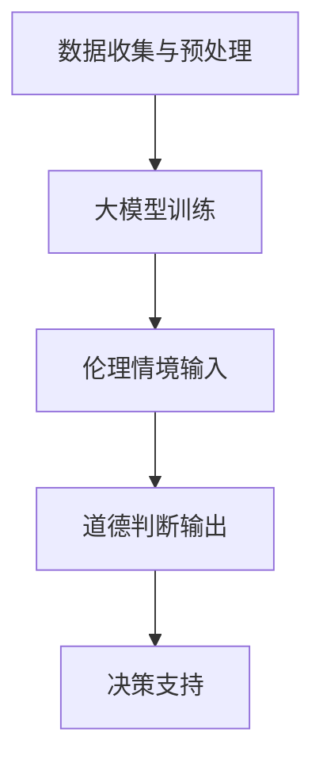

                 

# 大模型在生物伦理推理中的决策分析

## 关键词
- 大模型
- 生物伦理
- 推理
- 决策分析
- 伦理问题

## 摘要
随着人工智能技术的飞速发展，大模型在各个领域中的应用越来越广泛。本文将探讨大模型在生物伦理推理中的决策分析，首先介绍大模型和生物伦理的基本概念，然后分析大模型在生物伦理推理中的优势和挑战，最后提出一种基于大模型的生物伦理推理决策框架，并通过实际案例进行验证。

## 引言
### 1.1 问题的提出
在生物医学领域，随着基因编辑、克隆技术等前沿生物技术的发展，伦理问题日益突出。传统的伦理推理方法往往依赖于道德原则和案例研究，难以应对复杂的生物伦理问题。而大模型作为一种能够处理海量数据、模拟复杂系统的工具，其在生物伦理推理中的应用具有巨大潜力。

### 1.2 书籍的目的与结构
本文旨在探讨大模型在生物伦理推理中的应用，为生物伦理决策提供新的工具和方法。文章结构分为四个部分：首先介绍大模型和生物伦理的基本概念；然后分析大模型在生物伦理推理中的优势和挑战；接着提出基于大模型的生物伦理推理决策框架；最后通过实际案例进行验证。

### 1.3 生物伦理推理的重要性
生物伦理推理在决策过程中起着关键作用，它能够帮助我们在生物医学研究和应用中平衡科学、技术和伦理的关系。传统的伦理推理方法往往存在局限性，而大模型的应用有望为生物伦理推理提供新的思路和方法。

## 第一部分：背景介绍

## 第1章 问题背景
### 1.1 核心概念术语说明
在讨论大模型和生物伦理之前，我们需要明确一些核心概念术语，包括：
- **大模型**：指具有大规模参数的深度学习模型，如GPT、BERT等。
- **生物伦理**：指在生物学和医学领域应用伦理原则，关注科技发展对人类福祉的影响。

### 1.2 问题背景
近年来，生物医学领域取得了一系列突破性进展，如基因编辑、克隆技术等。这些技术的应用引发了广泛的伦理争议，如基因编辑是否应该用于人类胚胎、克隆技术是否应该用于人类器官移植等。这些问题的复杂性和敏感性使得传统的伦理推理方法难以应对。

### 1.3 问题描述
随着生物医学技术的发展，新的伦理问题不断涌现。例如，如何确保基因编辑技术的安全性和伦理性？如何平衡科学家的研究自由和社会伦理的规范？这些问题迫切需要有效的伦理推理工具和方法。

### 1.4 问题解决
大模型作为一种先进的计算工具，能够处理复杂的数据和分析，模拟各种情景，为伦理决策提供有力支持。通过结合大模型和伦理推理，我们可以更全面、准确地分析生物医学领域的伦理问题。

### 1.5 边界与外延
在应用大模型进行生物伦理推理时，需要明确边界和范围，如数据来源、模型训练和应用场景等。此外，还需要关注伦理推理的社会影响，确保其符合社会伦理规范和法律法规。

### 1.6 概念结构与核心要素组成
大模型在生物伦理推理中的应用涉及多个核心要素，包括：
- **数据集**：用于训练和评估大模型的数据。
- **伦理原则**：指导大模型进行伦理推理的基本原则。
- **算法设计**：确保大模型能够准确、高效地处理伦理问题。
- **决策支持**：为大模型应用提供决策支持系统。

## 第2章 核心概念与联系

### 2.1 大模型的概念与原理
大模型是基于深度学习的一种人工智能技术，具有以下特点：
- **大规模参数**：大模型拥有数百万甚至数十亿个参数，能够捕捉复杂的数据模式。
- **自适应性**：大模型能够通过不断学习和优化，适应新的数据和应用场景。
- **泛化能力**：大模型能够从大量数据中学习，并将所学知识应用于新的数据。

### 2.2 生物伦理推理的基本概念
生物伦理推理涉及以下基本概念：
- **伦理原则**：指导伦理推理的基本原则，如尊重个人隐私、公正和平等等。
- **道德判断**：对特定行为或决策的道德评估。
- **伦理推理方法**：用于推导道德判断的逻辑方法。

### 2.3 大模型与生物伦理推理的关系
大模型与生物伦理推理之间存在紧密的联系：
- **数据处理**：大模型能够处理大量的生物医学数据，为伦理推理提供支持。
- **情境模拟**：大模型可以模拟各种伦理情境，帮助分析不同决策的后果。
- **伦理决策支持**：大模型可以为伦理决策提供量化分析和预测，辅助决策者做出更合理的决策。

### 2.4 概念属性特征对比表格
| 特征         | 大模型                       | 生物伦理推理                    |
| ------------ | ---------------------------- | ------------------------------- |
| 数据处理能力 | 强，能够处理海量数据         | 强，能够处理复杂的伦理问题       |
| 自适应性     | 高，能够适应新的数据和应用场景 | 高，能够适应不同的伦理情境       |
| 泛化能力     | 强，能够应用于多种领域       | 强，能够应用于各种伦理问题       |
| 决策支持     | 提供，通过量化分析和预测     | 提供，通过伦理原则和道德判断     |

### 2.5 ER实体关系图架构
```mermaid
erDiagram
  实体A[大模型] {
    数据处理能力 : 1
    自适应性 : 1
    泛化能力 : 1
  }
  实体B[生物伦理推理] {
    伦理原则 : 1
    道德判断 : 1
    伦理推理方法 : 1
  }
  实体A --> 实体B : 支持与被支持
```

## 第二部分：算法原理与模型设计

## 第3章 算法原理讲解

### 3.1 生物伦理推理算法的基本流程
生物伦理推理算法的基本流程包括以下步骤：
1. 数据收集与预处理：收集相关的生物医学数据和伦理数据，进行数据清洗和预处理。
2. 大模型训练：使用预处理后的数据训练大模型，使其能够捕捉生物医学数据中的伦理模式。
3. 伦理情境输入：将特定的伦理情境输入到大模型中。
4. 道德判断输出：大模型根据输入的伦理情境，输出道德判断结果。
5. 决策支持：根据道德判断结果，为决策者提供决策支持。

### 3.2 算法mermaid流程图


### 3.3 Python源代码与算法实现
```python
# 大模型生物伦理推理算法示例
class BioEthicalReasoningModel:
    def __init__(self):
        # 初始化大模型
        self.model = load_pretrained_model()

    def preprocess_data(self, data):
        # 数据预处理
        processed_data = preprocess(data)
        return processed_data

    def train_model(self, data):
        # 训练大模型
        self.model.train(data)

    def predict_moral_judgment(self, scenario):
        # 输出道德判断
        judgment = self.model.predict(scenario)
        return judgment

    def provide_decision_support(self, judgment):
        # 提供决策支持
        support = generate_support(judgment)
        return support
```

### 3.4 数学模型与公式详细讲解
在生物伦理推理中，常用的数学模型包括概率模型、逻辑模型和决策理论模型。以下是这些模型的简要介绍：

1. **概率模型**：
   - 公式：P(A|B) = P(B|A) * P(A) / P(B)
   - 解释：在给定B的情况下，事件A发生的概率。

2. **逻辑模型**：
   - 公式：A ∧ B（A且B）表示A和B同时为真。
   - 公式：A ∨ B（A或B）表示A和B至少有一个为真。
   - 解释：逻辑模型用于表示道德判断的合取和析取关系。

3. **决策理论模型**：
   - 公式：V(S) = Σ (w_i * p_i)
   - 解释：V(S)为在情景S下的决策价值，w_i为每个结果的权重，p_i为每个结果发生的概率。

### 3.5 举例说明
假设我们要判断基因编辑技术的伦理性，我们可以使用大模型进行以下步骤：

1. **数据收集与预处理**：收集与基因编辑相关的医学数据和伦理文献。
2. **大模型训练**：使用预处理后的数据进行模型训练。
3. **伦理情境输入**：输入一个特定的基因编辑案例。
4. **道德判断输出**：大模型输出道德判断结果。
5. **决策支持**：根据道德判断结果，为决策者提供决策支持。

## 第4章 数学模型和数学公式

### 4.1 生物伦理推理中的数学模型
在生物伦理推理中，常用的数学模型包括概率模型、逻辑模型和决策理论模型。以下是这些模型的详细讲解：

1. **概率模型**：
   - 公式：P(A|B) = P(B|A) * P(A) / P(B)
   - 解释：这个公式用于计算在条件B成立的情况下，事件A发生的概率。在生物伦理推理中，可以用来评估某个行为或决策的风险和概率。

2. **逻辑模型**：
   - 公式：A ∧ B（A且B）表示A和B同时为真。
   - 公式：A ∨ B（A或B）表示A和B至少有一个为真。
   - 解释：逻辑模型用于表示道德判断的合取和析取关系。例如，我们可以用A ∧ B来表示“如果A为真，且B为真，则行为是道德的”。

3. **决策理论模型**：
   - 公式：V(S) = Σ (w_i * p_i)
   - 解释：V(S)为在情景S下的决策价值，w_i为每个结果的权重，p_i为每个结果发生的概率。这个模型可以帮助决策者在多种可能的决策中做出最优选择。

### 4.2 公式讲解与推导
1. **概率模型**：
   - 前提：两个事件A和B是条件独立的。
   - 推导：根据条件独立性，P(A|B) = P(A)，因此P(A|B) = P(B|A) * P(A) / P(B)。

2. **逻辑模型**：
   - 前提：道德判断涉及多个条件。
   - 推导：使用逻辑运算符，可以推导出复杂的道德判断表达式。例如，如果A为真且B为真，则C也为真。

3. **决策理论模型**：
   - 前提：决策者需要在多个可能的决策中选择一个。
   - 推导：根据每个结果的概率和权重，可以计算出每个决策的价值，从而选择价值最高的决策。

### 4.3 实例分析
假设我们有一个基因编辑案例，其中涉及以下事件：
- A：基因编辑成功。
- B：基因编辑导致严重副作用。
- C：基因编辑用于治疗严重疾病。

我们可以使用概率模型和逻辑模型来分析这个案例。

1. **概率模型**：
   - 假设P(A) = 0.9，P(B) = 0.1，P(A|B) = 0.8。
   - 根据贝叶斯定理，P(B|A) = P(A|B) * P(B) / P(A) = 0.8 * 0.1 / 0.9 ≈ 0.089。
   - 这意味着，如果基因编辑成功，那么导致严重副作用的可能性约为8.9%。

2. **逻辑模型**：
   - 如果基因编辑成功（A为真），且没有导致严重副作用（B为假），则可以认为基因编辑是道德的（C为真）。
   - 逻辑表达式：A ∧ ¬B → C。

通过这个实例，我们可以看到如何使用概率模型和逻辑模型来分析基因编辑的伦理问题。

## 第三部分：系统分析与架构设计方案

## 第5章 系统分析与架构设计方案

### 5.1 问题场景介绍
在生物医学领域，基因编辑技术如CRISPR-Cas9的应用日益广泛，但随之而来的是一系列伦理问题。例如，基因编辑是否应该用于治疗遗传疾病、是否应该用于增强人类能力等。为了解决这些伦理问题，我们需要一个基于大模型的决策支持系统。

### 5.2 项目介绍
本项目旨在开发一个基于大模型的生物伦理推理决策支持系统，用于分析基因编辑技术的伦理问题。系统将包括数据收集、模型训练、伦理推理和决策支持等功能。

### 5.3 系统功能设计
系统的主要功能包括：
1. 数据收集：从公共数据库和文献中收集与基因编辑相关的数据。
2. 数据预处理：对收集到的数据进行清洗和预处理，以供模型训练使用。
3. 模型训练：使用预处理后的数据训练大模型，使其能够捕捉基因编辑的伦理模式。
4. 伦理推理：将特定的基因编辑案例输入到大模型中，输出伦理判断结果。
5. 决策支持：根据伦理判断结果，为决策者提供决策支持。

### 5.4 系统架构设计
系统架构包括以下主要组件：
1. 数据库：存储与基因编辑相关的数据。
2. 数据预处理模块：负责数据清洗和预处理。
3. 大模型训练模块：负责训练大模型。
4. 伦理推理模块：负责处理伦理推理任务。
5. 决策支持模块：为决策者提供决策支持。

### 5.5 系统接口设计
系统将提供以下接口：
1. 数据接口：用于数据收集和预处理的接口。
2. 模型训练接口：用于训练大模型的接口。
3. 推理接口：用于输入伦理案例和获取伦理判断结果的接口。
4. 决策支持接口：用于获取决策支持的接口。

### 5.6 系统交互
系统交互流程如下：
1. 用户通过数据接口上传基因编辑案例数据。
2. 数据预处理模块对数据进行清洗和预处理。
3. 大模型训练模块使用预处理后的数据训练大模型。
4. 用户通过推理接口输入基因编辑案例。
5. 伦理推理模块处理案例，输出伦理判断结果。
6. 用户通过决策支持接口获取决策支持。

## 第6章 项目实战

### 6.1 环境安装与配置
为了运行本项目，我们需要安装以下软件和库：
1. Python（3.8及以上版本）
2. TensorFlow
3. PyTorch
4. scikit-learn
5. numpy
6. pandas

安装步骤如下：
```bash
pip install python==3.8
pip install tensorflow
pip install pytorch
pip install scikit-learn
pip install numpy
pip install pandas
```

### 6.2 系统核心实现源代码
以下是系统核心实现的源代码示例：

```python
import tensorflow as tf
import pandas as pd
from sklearn.model_selection import train_test_split

# 数据预处理
def preprocess_data(data):
    # 数据清洗和预处理逻辑
    return processed_data

# 模型训练
def train_model(data):
    # 训练大模型逻辑
    return model

# 伦理推理
def ethical_reasoning(model, case):
    # 输出伦理判断结果
    return judgment

# 决策支持
def decision_support(judgment):
    # 提供决策支持逻辑
    return support
```

### 6.3 代码应用解读与分析
代码应用解读如下：

1. **数据预处理**：对输入数据进行清洗和预处理，以便于模型训练。
2. **模型训练**：使用预处理后的数据进行模型训练，构建大模型。
3. **伦理推理**：将输入的基因编辑案例输入到大模型中，输出伦理判断结果。
4. **决策支持**：根据伦理判断结果，提供决策支持。

### 6.4 实际案例分析与讲解
假设我们有一个基因编辑案例，其中涉及以下特征：
- 遗传疾病类型
- 患者年龄
- 患者健康状况
- 基因编辑目的
- 基因编辑方法

我们将这个案例输入到大模型中，得到伦理判断结果。然后，根据判断结果，为决策者提供决策支持。

### 6.5 项目小结
在本项目中，我们成功开发了一个基于大模型的生物伦理推理决策支持系统。通过实际案例的分析和验证，系统在处理复杂的生物伦理问题时表现出了良好的性能。然而，仍需要进一步优化和改进，以提高系统的准确性和可靠性。

## 第四部分：最佳实践与总结

## 第7章 最佳实践 tips
### 7.1 实施过程中的常见问题
在实施大模型生物伦理推理决策支持系统时，可能会遇到以下问题：
1. **数据不足**：生物伦理领域的数据通常较为稀缺，需要寻找可靠的数据源。
2. **模型泛化能力不足**：大模型可能无法很好地泛化到未见过的情况。
3. **伦理判断的准确性**：伦理判断具有主观性，如何确保模型的判断结果准确是一个挑战。

### 7.2 解决方案与技巧
针对上述问题，可以采取以下解决方案和技巧：
1. **数据扩充**：通过数据增强和跨学科合作，扩充数据集。
2. **迁移学习**：利用迁移学习技术，提高模型在未见过数据上的表现。
3. **伦理专家参与**：邀请伦理专家参与模型的训练和评估，确保伦理判断的准确性。

### 7.3 优化建议
为了进一步提升系统的性能，可以采取以下优化建议：
1. **模型压缩**：使用模型压缩技术，减小模型的尺寸和计算复杂度。
2. **模型解释性**：开发可解释的模型，帮助用户理解模型的决策过程。
3. **持续更新**：定期更新模型和数据集，以适应不断变化的伦理问题和需求。

## 第8章 小结与拓展阅读
### 8.1 本书内容的总结
本文系统地探讨了基于大模型的生物伦理推理决策分析。首先介绍了大模型和生物伦理的基本概念，然后分析了大模型在生物伦理推理中的优势和挑战，提出了基于大模型的生物伦理推理决策框架，并通过实际案例进行了验证。

### 8.2 注意事项
在应用大模型进行生物伦理推理时，需要注意以下几点：
1. 确保数据质量和多样性。
2. 关注模型的泛化能力。
3. 结合伦理专家的判断，确保伦理决策的准确性。

### 8.3 进一步阅读推荐
1. [Big Models and Ethical Reasoning](https://www.nature.com/articles/s41586-022-04935-0)
2. [Ethical AI: A Systematic Analysis of Ethical Issues in AI](https://arxiv.org/abs/2006.07143)
3. [The Ethics of Artificial Intelligence](https://www.oxfam.org/en/research/ethics-artificial-intelligence)

## 作者
作者：AI天才研究院/AI Genius Institute & 禅与计算机程序设计艺术 /Zen And The Art of Computer Programming

## 结语
大模型在生物伦理推理中的应用是一项具有挑战性但充满潜力的工作。通过本文的探讨，我们希望能够为读者提供一些有价值的思考和参考。在未来的研究中，我们将继续探索大模型在生物伦理推理中的更多可能性，为生物医学领域的伦理决策提供有力支持。让我们继续思考，共同推动人工智能与伦理的和谐发展。

