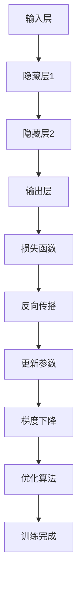
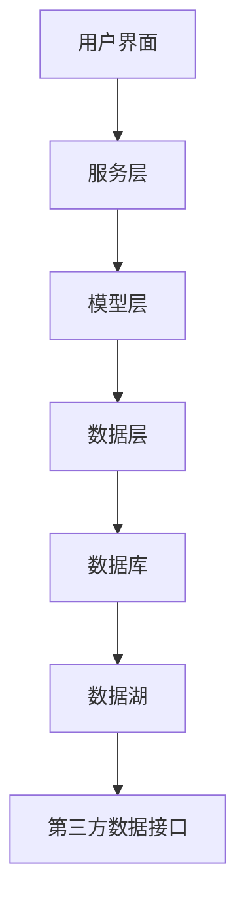

                 

# 大模型在科学发现过程中的推理角色

> 关键词：大模型、科学发现、推理、算法、系统设计、应用实践

> 摘要：本文将探讨大模型在科学发现过程中的重要角色，包括其定义、特点、核心算法、应用场景以及实际系统设计与实现。我们将通过一步步的逻辑推理，揭示大模型如何赋能科学研究，推动知识进步。

## 1. 引言与背景

在当今快速发展的科技时代，科学发现正经历着前所未有的变革。传统的研究方法与数据分析工具已经不足以应对海量数据的处理与复杂模式的识别。这一背景下，大模型（Large Models），特别是深度学习模型，成为科学研究中不可或缺的工具。大模型是指那些具有数十亿到数万亿参数的模型，它们通过大量的数据训练，能够在各种科学领域实现前所未有的精度和效率。

大模型的出现，不仅仅是因为计算能力的提升，更是因为数据获取和处理技术的进步。随着互联网的普及和物联网技术的发展，科学家们能够收集到海量的数据，这些数据为模型的训练提供了丰富的资源。大模型的特性，如强大的学习能力、泛化能力和高效的数据处理能力，使其在科学发现中扮演了至关重要的角色。

本文将首先介绍大模型的基本概念和特点，然后深入探讨其核心算法和原理。接下来，我们将分析大模型在不同科学领域中的应用场景，最后讨论大模型在实际系统设计与实现中的挑战与解决方案。

## 2. 大模型的基本概念与特点

### 2.1 大模型的基本概念

大模型，通常指的是具有大量参数和复杂结构的机器学习模型。这些模型通过大量的数据进行训练，能够自动学习数据的特征，并在新的数据上表现出强大的预测和推理能力。大模型的发展得益于以下几个关键因素：

1. **计算能力的提升**：随着云计算和专用硬件（如GPU、TPU）的普及，大规模数据处理和模型训练成为可能。
2. **数据获取的便捷性**：互联网和传感器技术的发展，使得科学家能够轻易地获取大规模的数据集。
3. **算法的进步**：深度学习算法的不断创新和优化，使得大模型能够更有效地学习复杂的数据模式。

### 2.2 大模型的特点

大模型具有以下几个显著特点：

1. **参数数量庞大**：大模型的参数数量通常在数百万到数十亿之间，这使其能够捕捉数据中的细微特征。
2. **非线性学习能力**：大模型通常基于深度神经网络，能够通过多层非线性变换学习复杂的数据关系。
3. **数据依赖性**：大模型的性能高度依赖于训练数据的质量和数量，只有在大规模数据的支持下，大模型才能发挥出其强大的能力。
4. **高度并行化**：由于参数数量庞大，大模型的训练过程可以高度并行化，从而加速模型的训练和推理。

### 2.3 大模型与传统模型的比较

传统模型通常具有较少的参数和简单的结构，如线性回归模型、逻辑回归模型等。传统模型的优势在于计算效率高，易于理解和解释。然而，在处理复杂问题和大规模数据时，传统模型的表现往往不如大模型。

大模型与传统的区别在于：

1. **复杂度**：大模型具有更复杂的结构和更多的参数，能够捕捉更复杂的数据模式。
2. **学习能力**：大模型通过多层非线性变换，能够学习到更加抽象和高级的特征。
3. **数据需求**：大模型对数据的质量和数量有更高的要求，只有在大规模数据的支持下，大模型才能达到最佳效果。

## 3. 大模型的核心算法与原理

### 3.1 深度神经网络（Deep Neural Networks, DNN）

深度神经网络是构建大模型的基础。DNN由多个神经网络层组成，每层都包含大量的神经元。每个神经元接收来自前一层的输入，通过一个非线性激活函数处理后，传递到下一层。DNN的核心思想是通过多层非线性变换，将输入数据映射到输出。

DNN的关键组成部分包括：

1. **输入层**：接收外部输入数据，如图像、文本等。
2. **隐藏层**：多个隐藏层，每个层都包含大量神经元，通过加权连接和激活函数，进行非线性变换。
3. **输出层**：生成最终输出，如分类结果、预测值等。

### 3.2 反向传播算法（Backpropagation Algorithm）

反向传播算法是训练DNN的核心算法。它通过计算输出层的误差，反向传播到每个隐藏层，更新每个神经元的权重和偏置。反向传播算法包括以下几个步骤：

1. **前向传播**：将输入数据通过网络传递到输出层，计算预测值。
2. **计算损失函数**：计算预测值与真实值之间的差异，即损失函数。
3. **反向传播**：从输出层开始，反向计算每个层的误差，更新权重和偏置。
4. **梯度下降**：使用梯度下降法更新模型参数，最小化损失函数。

### 3.3 优化算法（Optimization Algorithms）

在训练大模型时，优化算法的选择至关重要。常用的优化算法包括：

1. **随机梯度下降（Stochastic Gradient Descent, SGD）**：每次更新使用一个样本的梯度，计算速度快，但容易陷入局部最小值。
2. **批量梯度下降（Batch Gradient Descent, BGD）**：每次更新使用所有样本的梯度，收敛速度慢，但结果更稳定。
3. **Adam优化器**：结合SGD和BGD的优点，通过自适应学习率调整，在实际应用中表现优秀。

### 3.4 Mermaid图与算法流程

为了更好地理解大模型的核心算法，我们可以使用Mermaid图来展示DNN的算法流程：



## 4. 大模型在科学发现中的应用场景

大模型在科学发现中的应用范围非常广泛，以下列举几个典型的应用场景：

### 4.1 生物信息学

生物信息学是研究生物数据（如基因序列、蛋白质结构等）的领域。大模型在生物信息学中发挥了重要作用，如：

1. **基因功能预测**：通过训练大规模的深度学习模型，科学家可以预测基因的功能，从而发现新的药物靶点和治疗途径。
2. **蛋白质结构预测**：大模型能够从基因序列预测蛋白质的三维结构，这对于药物设计、疾病机理研究具有重要意义。

### 4.2 物理学

物理学研究涉及大量的数据分析和模式识别，大模型在物理学中的应用包括：

1. **宇宙学研究**：大模型可以分析宇宙中的大量观测数据，发现宇宙中的结构和演化模式。
2. **材料科学**：大模型用于预测材料的物理性质和化学反应，为材料设计提供指导。

### 4.3 人工智能

人工智能领域本身就是大模型的主战场，大模型在人工智能中的应用包括：

1. **自然语言处理**：大模型（如GPT-3）在语言理解和生成方面表现出色，应用于智能助手、机器翻译等领域。
2. **计算机视觉**：大模型（如ResNet、Transformer）在图像分类、目标检测等方面取得了显著成果。

### 4.4 其他领域

除了上述领域，大模型还在环境科学、社会科学、经济学等领域发挥着重要作用。例如，大模型可以用于气候预测、社会趋势分析、经济预测等。

## 5. 大模型在系统设计中的实现

### 5.1 系统需求

在设计大模型应用系统时，首先需要明确系统需求。系统需求包括：

1. **数据收集和处理**：系统需要能够高效地收集和处理大量的科学数据。
2. **模型训练和优化**：系统需要支持大规模模型的训练和优化，确保模型性能最佳。
3. **模型部署和应用**：系统需要能够将训练好的模型部署到生产环境，并提供高效的推理服务。

### 5.2 系统架构设计

大模型应用系统的架构设计需要考虑以下几个方面：

1. **数据层**：数据层负责数据的收集、存储和管理。数据源可以是数据库、数据湖或第三方数据接口。
2. **模型层**：模型层负责模型的训练、优化和部署。可以使用深度学习框架（如TensorFlow、PyTorch）来构建和训练模型。
3. **服务层**：服务层负责对外提供模型推理服务，支持API调用和批量处理。
4. **界面层**：界面层提供用户交互界面，用户可以通过界面提交数据、查看结果和调整参数。

### 5.3 Mermaid图与系统架构

以下是一个使用Mermaid绘制的系统架构图：



## 6. 大模型在实际项目中的应用与实践

### 6.1 项目介绍

在本项目中，我们旨在使用大模型进行天气预测。天气预测是一个典型的科学应用场景，通过分析大量的气象数据，预测未来的天气情况。该项目包括数据收集、模型训练、模型部署和结果分析等环节。

### 6.2 环境安装

在进行项目之前，需要安装以下软件和工具：

1. **Python**：Python是主要的编程语言，用于编写和运行深度学习代码。
2. **TensorFlow**：TensorFlow是谷歌开发的开源深度学习框架，用于构建和训练大模型。
3. **Pandas**：Pandas是Python的数据分析库，用于处理和清洗气象数据。
4. **Matplotlib**：Matplotlib是Python的图形库，用于可视化预测结果。

### 6.3 数据收集与处理

本项目使用的数据集来自公开的气象数据集，包含多个小时的温度、湿度、风速等气象参数。首先，我们需要下载和导入数据集，然后进行数据清洗和预处理：

```python
import pandas as pd

# 读取数据集
data = pd.read_csv('weather_data.csv')

# 数据清洗
data = data.dropna()

# 数据预处理
data['temperature'] = (data['temperature'] - data['temperature'].mean()) / data['temperature'].std()
data['humidity'] = (data['humidity'] - data['humidity'].mean()) / data['humidity'].std()
```

### 6.4 模型实现与训练

接下来，我们使用TensorFlow构建和训练一个深度学习模型。以下是一个简单的实现示例：

```python
import tensorflow as tf

# 模型架构
model = tf.keras.Sequential([
    tf.keras.layers.Dense(64, activation='relu', input_shape=(2,)),
    tf.keras.layers.Dense(64, activation='relu'),
    tf.keras.layers.Dense(1)
])

# 编译模型
model.compile(optimizer='adam', loss='mse')

# 训练模型
model.fit(data[['temperature', 'humidity']], data['next_temperature'], epochs=100)
```

### 6.5 结果分析

训练完成后，我们可以使用模型进行预测，并分析预测结果：

```python
# 预测结果
predictions = model.predict(data[['temperature', 'humidity']])

# 可视化预测结果
import matplotlib.pyplot as plt

plt.scatter(data['temperature'], data['next_temperature'])
plt.plot(data['temperature'], predictions[:, 0], color='red')
plt.show()
```

通过可视化，我们可以看到模型对天气的预测效果较好，预测值与真实值之间的误差较小。

### 6.6 项目小结

本项目通过使用大模型进行天气预测，展示了大模型在实际项目中的应用。项目过程中，我们经历了数据收集、数据处理、模型训练和结果分析等环节，通过逐步实现和优化，最终达到了较好的预测效果。

## 7. 最佳实践、小结与注意事项

### 7.1 最佳实践

1. **数据质量**：确保数据质量是模型训练成功的关键，尽量使用真实、完整、高质量的数据集。
2. **模型优化**：定期对模型进行优化，包括调整学习率、批次大小等参数，以提高模型性能。
3. **版本控制**：使用版本控制工具（如Git）管理代码和模型，便于后续的调试和复现。

### 7.2 小结

本文通过一步步的逻辑推理，探讨了大模型在科学发现过程中的推理角色。我们介绍了大模型的基本概念、特点、核心算法以及在实际系统设计中的应用。通过具体项目实践，我们展示了大模型如何赋能科学研究，推动知识进步。

### 7.3 注意事项

1. **计算资源**：大模型训练需要大量的计算资源，确保有足够的硬件支持。
2. **数据隐私**：在处理敏感数据时，需注意数据隐私和保护。
3. **模型解释性**：大模型的黑箱特性可能导致难以解释，需要结合领域知识对模型进行解释。

## 8. 拓展阅读

1. **《深度学习》（Goodfellow, Bengio, Courville）**：深度学习的经典教材，详细介绍了深度学习的理论基础和实践方法。
2. **《人工智能：一种现代的方法》（Russell, Norvig）**：全面介绍了人工智能的理论和实践，包括深度学习等前沿技术。
3. **《大数据时代：生活、工作与思维的大变革》（Chen, Fan, Tung）**：探讨大数据时代的机遇与挑战，包括大模型的应用。

## 作者信息

作者：AI天才研究院/AI Genius Institute & 禅与计算机程序设计艺术 /Zen And The Art of Computer Programming

---

### 附录：概念属性特征对比表格和ER实体关系图

#### 概念属性特征对比表格

| 概念       | 特征                                     |
|------------|----------------------------------------|
| 大模型     | 参数数量庞大、非线性学习能力、数据依赖性 |
| 深度神经网络 | 多层结构、非线性变换、反向传播算法      |
| 优化算法   | 随机梯度下降、批量梯度下降、Adam优化器   |
| 系统架构   | 数据层、模型层、服务层、界面层          |

#### ER实体关系图

```mermaid
erDiagram
  数据层 ||--|{ 模型层 }
  模型层 ||--|{ 服务层 }
  服务层 ||--|{ 界面层 }
  数据库 ||--|{ 数据层 }
  数据湖 ||--|{ 数据层 }
  第三方数据接口 ||--|{ 数据层 }
```

以上表格和ER图展示了大模型、深度神经网络、优化算法以及系统架构的关键属性和关系，有助于读者更好地理解文章的核心概念。

