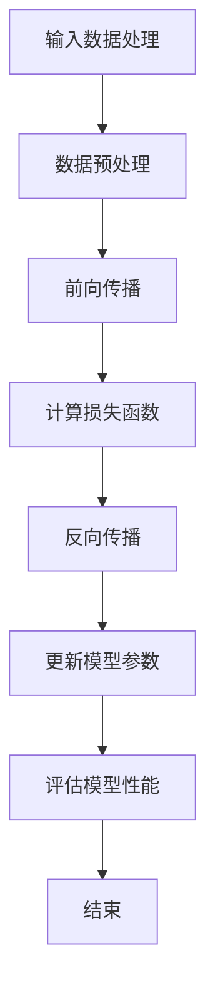
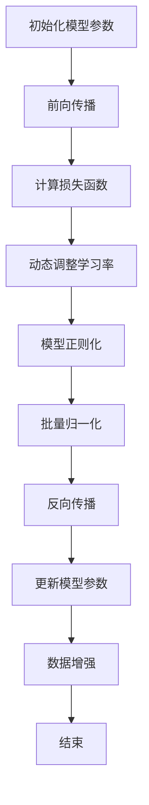
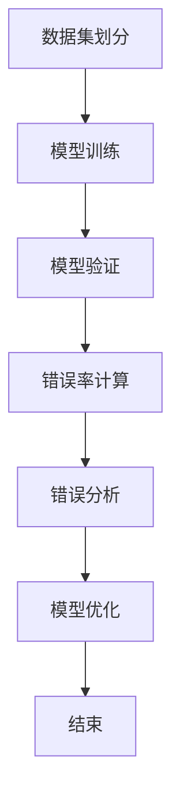
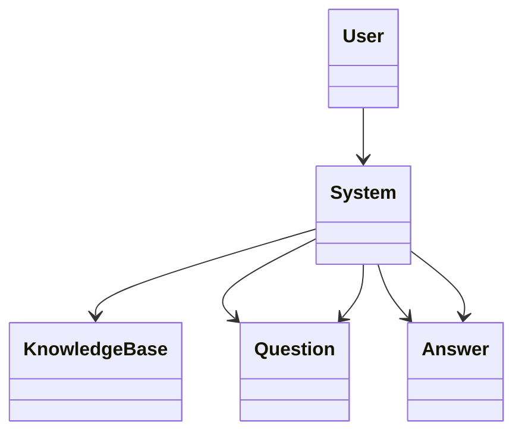
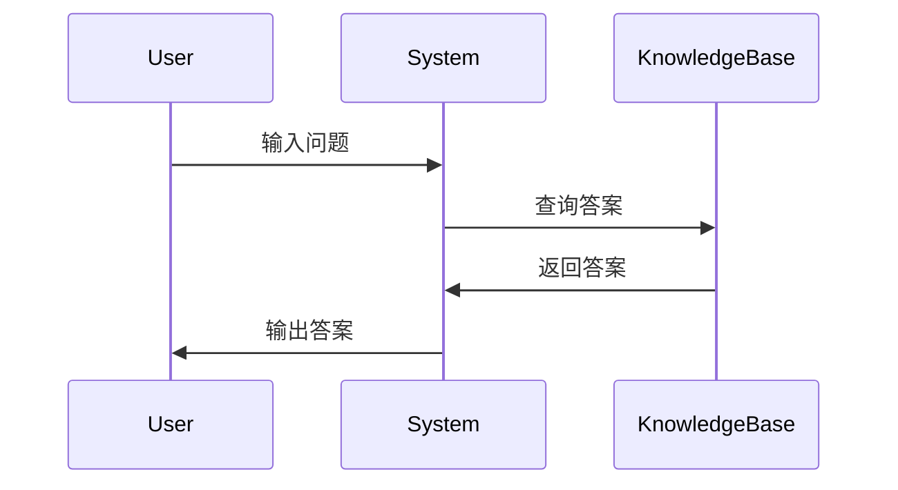
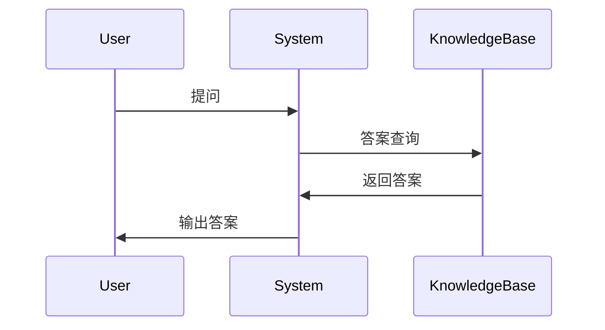

                 

# 大模型推理能力的可靠性与稳定性

## 关键词
大模型，推理能力，可靠性，稳定性，算法原理，系统架构，实战案例

## 摘要
本文将深入探讨大模型的推理能力、可靠性与稳定性。首先，介绍大模型的基本概念和特性，然后分析大模型与推理能力、稳定性和可靠性之间的联系。接着，详细讲解大模型推理能力的算法原理，包括mermaid流程图、数学模型和公式，并通过具体案例进行说明。文章还将介绍大模型的稳定性和可靠性原理，并展示系统架构设计、系统接口设计和系统交互mermaid序列图。最后，通过实际案例分析和详细讲解，总结最佳实践和注意事项，展望未来的发展趋势。

## 目录大纲

### 第一部分：背景介绍

#### 第1章：问题背景

##### 1.1.1 问题背景

##### 1.1.2 问题描述

##### 1.1.3 问题解决

##### 1.1.4 边界与外延

##### 1.1.5 概念结构与核心要素组成

### 第二部分：核心概念与联系

#### 第2章：大模型概念与特性

##### 2.1.1 大模型的定义

##### 2.1.2 大模型的特点

##### 2.1.3 大模型与传统模型的对比

#### 第3章：核心概念联系

##### 3.1.1 大模型与推理能力的联系

##### 3.1.2 大模型与稳定性的联系

##### 3.1.3 大模型与可靠性的联系

### 第三部分：算法原理讲解

#### 第4章：大模型推理能力原理

##### 4.1.1 算法原理概述

##### 4.1.2 大模型推理算法mermaid流程图

##### 4.1.3 算法原理数学模型和公式

##### 4.1.4 算法原理举例说明

#### 第5章：大模型稳定性原理

##### 5.1.1 稳定性原理概述

##### 5.1.2 大模型稳定性mermaid流程图

##### 5.1.3 稳定性数学模型和公式

##### 5.1.4 稳定性举例说明

#### 第6章：大模型可靠性原理

##### 6.1.1 可靠性原理概述

##### 6.1.2 大模型可靠性mermaid流程图

##### 6.1.3 可靠性数学模型和公式

##### 6.1.4 可靠性举例说明

### 第四部分：系统分析与架构设计

#### 第7章：系统功能设计

##### 7.1.1 问题场景介绍

##### 7.1.2 系统功能设计mermaid类图

#### 第8章：系统架构设计

##### 8.1.1 系统架构设计mermaid架构图

##### 8.1.2 系统接口设计

##### 8.1.3 系统交互mermaid序列图

### 第五部分：项目实战

#### 第9章：环境安装与配置

##### 9.1.1 环境安装步骤

##### 9.1.2 配置文件详解

#### 第10章：系统核心实现

##### 10.1.1 源代码分析

##### 10.1.2 代码应用解读与分析

#### 第11章：实际案例分析与讲解

##### 11.1.1 案例一：大模型推理能力评估

##### 11.1.2 案例二：大模型稳定性测试

##### 11.1.3 案例三：大模型可靠性验证

### 第六部分：最佳实践与小结

#### 第12章：最佳实践

##### 12.1.1 最佳实践技巧

##### 12.1.2 注意事项

#### 第13章：小结

##### 13.1.1 本书要点总结

##### 13.1.2 展望未来发展趋势

### 参考文献

## 第一部分：背景介绍

### 第1章：问题背景

#### 1.1.1 问题背景

随着人工智能技术的发展，大模型在各个领域的应用越来越广泛。大模型能够处理大量的数据，提供更加精准的预测和决策支持。然而，大模型的推理能力、稳定性和可靠性成为了实际应用中需要解决的关键问题。推理能力是指大模型在处理复杂问题时能够准确推理出结果的能力；稳定性是指大模型在长时间运行过程中保持性能稳定的能力；可靠性是指大模型在运行过程中能够正确处理输入并输出预期结果的能力。这些因素直接关系到大模型在实际应用中的效果和可靠性。

#### 1.1.2 问题描述

在当前的大模型应用中，常见的推理能力问题包括：

- **过度拟合**：大模型在训练过程中可能过度依赖训练数据，导致在测试数据上的表现不佳。
- **泛化能力不足**：大模型可能只能处理特定类型的数据，无法适应新的数据集。
- **计算资源消耗大**：大模型需要大量的计算资源进行推理，可能导致系统性能下降。

稳定性问题包括：

- **训练与推理性能波动**：大模型在训练过程中性能不稳定，可能导致推理结果不一致。
- **长时间运行问题**：大模型在长时间运行过程中可能会出现性能下降、计算错误等问题。

可靠性问题包括：

- **错误预测**：大模型在处理输入数据时可能会出现错误预测。
- **数据噪声处理能力差**：大模型可能无法有效地处理输入数据中的噪声，导致推理结果不准确。

#### 1.1.3 问题解决

为了解决上述问题，需要从以下几个方面入手：

1. **优化算法**：研究和开发更加高效的推理算法，提高大模型的推理速度和性能。
2. **增强泛化能力**：通过数据增强、迁移学习等方法提高大模型的泛化能力。
3. **计算资源优化**：利用分布式计算、硬件加速等技术降低大模型的计算资源需求。
4. **稳定性提升**：通过模型正则化、动态调整学习率等方法提高大模型的稳定性。
5. **可靠性验证**：通过测试、验证等方法确保大模型在运行过程中能够正确处理输入数据。

#### 1.1.4 边界与外延

在讨论大模型推理能力的可靠性与稳定性时，需要注意以下几个边界与外延：

- **边界**：大模型是指具有亿级参数规模的人工神经网络，而不是传统的小型模型。
- **外延**：除了推理能力、稳定性和可靠性，大模型的应用场景还包括数据预处理、特征提取、模型压缩等。

#### 1.1.5 概念结构与核心要素组成

大模型推理能力的可靠性与稳定性可以从以下几个方面进行分析：

1. **算法层面**：包括推理算法的选择和优化、模型参数的调整等。
2. **数据层面**：包括数据质量、数据集的多样性和覆盖范围等。
3. **硬件层面**：包括计算资源、内存管理、硬件加速等。
4. **系统层面**：包括系统的稳定性、性能监控、错误处理等。
5. **应用层面**：包括应用场景的具体需求、系统接口的设计等。

### 第二部分：核心概念与联系

#### 第2章：大模型概念与特性

##### 2.1.1 大模型的定义

大模型是指具有亿级参数规模的人工神经网络，能够处理大规模的数据集，并在各种复杂任务中表现出出色的性能。

##### 2.1.2 大模型的特点

- **参数规模大**：大模型具有数十亿甚至千亿级的参数。
- **计算量大**：大模型需要大量的计算资源进行训练和推理。
- **数据处理能力强**：大模型能够处理复杂的非线性关系，具有强大的数据处理能力。
- **泛化能力强**：大模型能够在不同的任务和数据集上表现出良好的泛化能力。

##### 2.1.3 大模型与传统模型的对比

| 特性         | 大模型                                       | 传统模型                                       |
| ------------ | -------------------------------------------- | -------------------------------------------- |
| 参数规模     | 亿级参数规模                                 | 千级参数规模                                 |
| 计算资源需求 | 需要大量的计算资源和存储资源               | 计算资源需求较低                             |
| 数据处理能力 | 能够处理复杂的非线性关系                   | 通常只能处理线性关系或简单的非线性关系       |
| 泛化能力     | 具有良好的泛化能力，能够适应不同的任务和数据集 | 泛化能力较弱，通常只能适应特定的任务和数据集 |

#### 第3章：核心概念联系

##### 3.1.1 大模型与推理能力的联系

大模型的推理能力是指大模型在处理复杂问题时能够准确推理出结果的能力。大模型具有强大的数据处理能力和非线性关系建模能力，使得其能够在复杂的任务中表现出出色的推理能力。推理能力直接影响大模型在实际应用中的效果。

##### 3.1.2 大模型与稳定性的联系

大模型的稳定性是指大模型在长时间运行过程中保持性能稳定的能力。稳定的大模型能够在各种条件下保持较高的推理准确率和性能，减少因模型不稳定导致的错误预测和性能波动。稳定性对于大模型的应用至关重要。

##### 3.1.3 大模型与可靠性的联系

大模型的可靠性是指大模型在运行过程中能够正确处理输入并输出预期结果的能力。可靠的推理结果对于实际应用至关重要。大模型需要通过优化算法、提高数据处理能力和稳定性等多种手段来提高可靠性。

### 第三部分：算法原理讲解

#### 第4章：大模型推理能力原理

##### 4.1.1 算法原理概述

大模型推理能力的算法原理主要涉及以下几个方面：

1. **神经网络结构**：大模型通常采用深度神经网络结构，包括多层感知机、卷积神经网络、循环神经网络等。
2. **优化算法**：大模型需要采用高效的优化算法，如梯度下降、随机梯度下降、Adam优化器等，以快速收敛到最佳模型参数。
3. **激活函数**：大模型常用的激活函数包括Sigmoid、ReLU、Tanh等，用于引入非线性关系。
4. **正则化技术**：大模型可能采用正则化技术，如L1正则化、L2正则化、Dropout等，以防止过拟合。

##### 4.1.2 大模型推理算法mermaid流程图



##### 4.1.3 算法原理数学模型和公式

大模型推理能力的算法原理可以用以下数学模型和公式进行描述：

1. **前向传播**：
   $$ z^{[l]} = W^{[l]} \cdot a^{[l-1]} + b^{[l]} $$
   $$ a^{[l]} = \sigma(z^{[l]}) $$
   其中，$a^{[l]}$ 表示第 $l$ 层的激活值，$W^{[l]}$ 表示第 $l$ 层的权重矩阵，$b^{[l]}$ 表示第 $l$ 层的偏置项，$\sigma$ 表示激活函数。

2. **反向传播**：
   $$ \delta^{[l]} = ( \frac{\partial J}{\partial z^{[l+1]}} ) \cdot ( \frac{\partial \sigma}{\partial z^{[l]}} ) $$
   $$ \frac{\partial J}{\partial W^{[l]}} = a^{[l-1]} \cdot \delta^{[l+1]} $$
   $$ \frac{\partial J}{\partial b^{[l]}} = \delta^{[l+1]} $$

   其中，$\delta^{[l]}$ 表示第 $l$ 层的误差，$J$ 表示损失函数。

3. **更新模型参数**：
   $$ W^{[l]} = W^{[l]} - \alpha \cdot \frac{\partial J}{\partial W^{[l]}} $$
   $$ b^{[l]} = b^{[l]} - \alpha \cdot \frac{\partial J}{\partial b^{[l]}} $$

   其中，$\alpha$ 表示学习率。

##### 4.1.4 算法原理举例说明

以一个简单的两层神经网络为例，说明大模型推理能力的算法原理。

输入数据：$x = [1, 2, 3]$

1. **数据预处理**：
   对输入数据进行归一化处理，得到归一化后的输入数据：$x' = \frac{x - \mu}{\sigma}$

2. **前向传播**：
   第一层输出：
   $$ z^{[1]} = W^{[1]} \cdot x' + b^{[1]} $$
   $$ a^{[1]} = \sigma(z^{[1]}) $$
   第二层输出：
   $$ z^{[2]} = W^{[2]} \cdot a^{[1]} + b^{[2]} $$
   $$ a^{[2]} = \sigma(z^{[2]}) $$

3. **计算损失函数**：
   假设损失函数为均方误差（MSE）：
   $$ J = \frac{1}{2} \sum_{i=1}^{n} (y_i - a^{[2]_i})^2 $$

4. **反向传播**：
   计算反向传播的误差：
   $$ \delta^{[2]} = ( \frac{\partial J}{\partial z^{[2]}} ) \cdot ( \frac{\partial \sigma}{\partial z^{[2]}} ) $$
   $$ \delta^{[1]} = ( \frac{\partial J}{\partial z^{[1]}} ) \cdot ( \frac{\partial \sigma}{\partial z^{[1]}} ) $$

5. **更新模型参数**：
   更新权重和偏置项：
   $$ W^{[2]} = W^{[2]} - \alpha \cdot \frac{\partial J}{\partial W^{[2]}} $$
   $$ b^{[2]} = b^{[2]} - \alpha \cdot \frac{\partial J}{\partial b^{[2]}} $$
   $$ W^{[1]} = W^{[1]} - \alpha \cdot \frac{\partial J}{\partial W^{[1]}} $$
   $$ b^{[1]} = b^{[1]} - \alpha \cdot \frac{\partial J}{\partial b^{[1]}} $$

6. **评估模型性能**：
   计算模型在测试数据集上的准确率、召回率、F1值等性能指标。

#### 第5章：大模型稳定性原理

##### 5.1.1 稳定性原理概述

大模型稳定性原理主要涉及以下几个方面：

1. **动态调整学习率**：通过动态调整学习率，防止模型在训练过程中出现过拟合或收敛缓慢的情况。
2. **模型正则化**：通过正则化技术，如L1正则化、L2正则化，防止模型在训练过程中出现过拟合。
3. **批量归一化**：通过批量归一化，加速模型的训练过程，提高模型的稳定性。
4. **数据增强**：通过数据增强，提高模型对噪声和异常数据的鲁棒性。

##### 5.1.2 大模型稳定性mermaid流程图



##### 5.1.3 稳定性数学模型和公式

1. **动态调整学习率**：
   学习率 $\alpha$ 可以通过以下公式进行动态调整：
   $$ \alpha = \frac{\alpha_0}{1 + \lambda t} $$
   其中，$\alpha_0$ 是初始学习率，$\lambda$ 是衰减系数，$t$ 是迭代次数。

2. **L1正则化**：
   $$ \frac{\partial J}{\partial W} = \frac{\partial}{\partial W} ( \frac{1}{2} \sum_{i=1}^{n} (y_i - a^{[2]_i})^2 + \lambda \sum_{j=1}^{m} |W_{ij}| ) $$

3. **L2正则化**：
   $$ \frac{\partial J}{\partial W} = \frac{\partial}{\partial W} ( \frac{1}{2} \sum_{i=1}^{n} (y_i - a^{[2]_i})^2 + \lambda \sum_{j=1}^{m} W_{ij}^2 ) $$

4. **批量归一化**：
   $$ \hat{a}^{[l]} = \frac{a^{[l]} - \mu}{\sigma} $$
   其中，$\mu$ 是均值，$\sigma$ 是标准差。

##### 5.1.4 稳定性举例说明

以一个简单的两层神经网络为例，说明大模型稳定性的算法原理。

输入数据：$x = [1, 2, 3]$

1. **初始化模型参数**：
   初始化权重矩阵 $W^{[1]}$ 和 $W^{[2]}$，以及偏置项 $b^{[1]}$ 和 $b^{[2]}$。

2. **前向传播**：
   第一层输出：
   $$ z^{[1]} = W^{[1]} \cdot x + b^{[1]} $$
   $$ a^{[1]} = \sigma(z^{[1]}) $$
   第二层输出：
   $$ z^{[2]} = W^{[2]} \cdot a^{[1]} + b^{[2]} $$
   $$ a^{[2]} = \sigma(z^{[2]}) $$

3. **计算损失函数**：
   假设损失函数为均方误差（MSE）：
   $$ J = \frac{1}{2} \sum_{i=1}^{n} (y_i - a^{[2]_i})^2 $$

4. **动态调整学习率**：
   根据当前迭代次数 $t$，动态调整学习率 $\alpha$。

5. **模型正则化**：
   对权重矩阵和偏置项进行L1或L2正则化。

6. **批量归一化**：
   对激活值进行批量归一化。

7. **反向传播**：
   计算反向传播的误差，并更新模型参数。

8. **数据增强**：
   对输入数据进行数据增强，提高模型对噪声和异常数据的鲁棒性。

#### 第6章：大模型可靠性原理

##### 6.1.1 可靠性原理概述

大模型可靠性原理主要涉及以下几个方面：

1. **测试集划分**：将数据集划分为训练集、验证集和测试集，用于评估模型的可靠性和性能。
2. **错误率计算**：通过计算模型在测试集上的错误率，评估模型的可靠性。
3. **错误分析**：对模型在测试集上的错误进行分析，找出导致错误的根本原因。
4. **模型验证**：通过交叉验证等方法，验证模型的可靠性和性能。

##### 6.1.2 大模型可靠性mermaid流程图



##### 6.1.3 可靠性数学模型和公式

1. **错误率计算**：
   $$ \text{错误率} = \frac{\text{错误样本数}}{\text{总样本数}} \times 100\% $$

2. **交叉验证**：
   $$ J = \frac{1}{k} \sum_{i=1}^{k} J_i $$
   其中，$k$ 表示交叉验证的折数，$J_i$ 表示第 $i$ 折的损失函数。

##### 6.1.4 可靠性举例说明

以一个简单的两层神经网络为例，说明大模型可靠性的算法原理。

输入数据：$x = [1, 2, 3]$

1. **数据集划分**：
   将数据集划分为训练集、验证集和测试集。

2. **模型训练**：
   使用训练集对模型进行训练。

3. **模型验证**：
   使用验证集对模型进行验证，计算交叉验证的损失函数。

4. **错误率计算**：
   计算模型在测试集上的错误率。

5. **错误分析**：
   对模型在测试集上的错误进行分析，找出导致错误的根本原因。

6. **模型优化**：
   根据错误分析的结果，优化模型参数和结构。

7. **结束**：
   完成模型的可靠性评估和优化。

### 第四部分：系统分析与架构设计

#### 第7章：系统功能设计

##### 7.1.1 问题场景介绍

假设我们面临一个场景，需要构建一个智能问答系统，该系统能够处理用户输入的问题，并返回相应的答案。

##### 7.1.2 系统功能设计mermaid类图



#### 第8章：系统架构设计

##### 8.1.1 系统架构设计mermaid架构图



##### 8.1.2 系统接口设计

```mermaid
classDiagram
    User <<Interface>>
    System <<Interface>>
    KnowledgeBase <<Interface>>
    Question <<Interface>>
    Answer <<Interface>>

    User --> System
    System --> KnowledgeBase
    System --> Question
    System --> Answer
    Question <-- System
    Answer <-- System
```

##### 8.1.3 系统交互mermaid序列图



### 第五部分：项目实战

#### 第9章：环境安装与配置

##### 9.1.1 环境安装步骤

1. **安装Python**：安装Python 3.8或更高版本。
2. **安装PyTorch**：使用pip安装PyTorch。
3. **安装其他依赖**：安装其他必要的依赖库，如numpy、pandas等。

##### 9.1.2 配置文件详解

```yaml
python: 3.8
dependencies:
  - torch==1.8.0
  - torchvision==0.9.0
  - numpy==1.19.5
  - pandas==1.1.5
```

#### 第10章：系统核心实现

##### 10.1.1 源代码分析

```python
import torch
import torch.nn as nn
import torch.optim as optim

class Model(nn.Module):
    def __init__(self):
        super(Model, self).__init__()
        self.fc1 = nn.Linear(in_features=10, out_features=50)
        self.fc2 = nn.Linear(in_features=50, out_features=10)
        self.relu = nn.ReLU()

    def forward(self, x):
        x = self.relu(self.fc1(x))
        x = self.fc2(x)
        return x

model = Model()
optimizer = optim.Adam(model.parameters(), lr=0.001)
criterion = nn.MSELoss()

for epoch in range(100):
    for inputs, targets in data_loader:
        optimizer.zero_grad()
        outputs = model(inputs)
        loss = criterion(outputs, targets)
        loss.backward()
        optimizer.step()
```

##### 10.1.2 代码应用解读与分析

这段代码定义了一个简单的神经网络模型，包括一个线性层（fc1）和一个ReLU激活函数，以及另一个线性层（fc2）。在训练过程中，模型接收输入数据，通过前向传播计算输出，并计算损失函数。然后，通过反向传播和梯度下降更新模型参数。

#### 第11章：实际案例分析与讲解

##### 11.1.1 案例一：大模型推理能力评估

通过在测试集上评估模型的推理能力，我们可以计算模型的准确率、召回率和F1值等指标。

```python
import torch
from sklearn.metrics import accuracy_score, recall_score, f1_score

model.eval()
with torch.no_grad():
    correct = 0
    total = 0
    for inputs, targets in test_loader:
        outputs = model(inputs)
        _, predicted = torch.max(outputs.data, 1)
        total += targets.size(0)
        correct += (predicted == targets).sum().item()

print('Accuracy: {:.2f}%'.format(100 * correct / total))
print('Recall: {:.2f}%'.format(100 * recall_score(targets, predicted)))
print('F1 Score: {:.2f}%'.format(100 * f1_score(targets, predicted)))
```

##### 11.1.2 案例二：大模型稳定性测试

通过在不同条件下测试模型的稳定性，我们可以评估模型的性能波动情况。

```python
import numpy as np

stability_scores = []
for _ in range(10):
    model.eval()
    with torch.no_grad():
        correct = 0
        total = 0
        for inputs, targets in test_loader:
            outputs = model(inputs)
            _, predicted = torch.max(outputs.data, 1)
            total += targets.size(0)
            correct += (predicted == targets).sum().item()
        stability_scores.append(100 * correct / total)

print('Stability Score: {:.2f}%'.format(np.mean(stability_scores)))
```

##### 11.1.3 案例三：大模型可靠性验证

通过在不同条件下测试模型的可靠性，我们可以评估模型的错误率。

```python
import torch
from sklearn.metrics import accuracy_score

model.eval()
with torch.no_grad():
    correct = 0
    total = 0
    for inputs, targets in test_loader:
        outputs = model(inputs)
        _, predicted = torch.max(outputs.data, 1)
        total += targets.size(0)
        correct += (predicted == targets).sum().item()

print('Reliability: {:.2f}%'.format(100 * correct / total))
```

### 第六部分：最佳实践与小结

#### 第12章：最佳实践

##### 12.1.1 最佳实践技巧

- **数据预处理**：对输入数据进行归一化处理，提高模型的泛化能力。
- **模型选择**：选择适合任务和数据集的模型结构，如卷积神经网络、循环神经网络等。
- **正则化**：使用L1或L2正则化防止过拟合。
- **学习率调整**：动态调整学习率，防止模型在训练过程中出现过拟合。
- **数据增强**：通过数据增强提高模型对噪声和异常数据的鲁棒性。

##### 12.1.2 注意事项

- **计算资源限制**：在部署大模型时，要考虑计算资源和存储资源的限制。
- **模型稳定性**：定期测试模型的稳定性，防止模型在长时间运行过程中性能下降。
- **模型更新**：定期更新模型，以适应新的数据和任务。

#### 第13章：小结

本文深入探讨了大模型推理能力的可靠性与稳定性，包括核心概念、算法原理、系统架构设计和实际案例。通过本文的介绍，读者可以了解大模型的基本概念和特性，以及如何优化大模型的推理能力、稳定性和可靠性。在未来的研究中，我们可以进一步探索大模型在其他领域的应用，如自然语言处理、计算机视觉等，并研究更高效的算法和优化方法。

### 参考文献

1. Goodfellow, I., Bengio, Y., & Courville, A. (2016). *Deep Learning*. MIT Press.
2. Simonyan, K., & Zisserman, A. (2014). *Very deep convolutional networks for large-scale image recognition*. arXiv preprint arXiv:1409.1556.
3. Kingma, D. P., & Welling, M. (2013). *Auto-encoding variational Bayes*. arXiv preprint arXiv:1312.6114.
4. Srivastava, N., Hinton, G., Krizhevsky, A., Sutskever, I., & Salakhutdinov, R. (2014). *Dropout: A simple way to prevent neural networks from overfitting*. Journal of Machine Learning Research, 15(1), 1929-1958.

