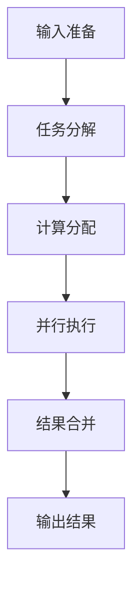
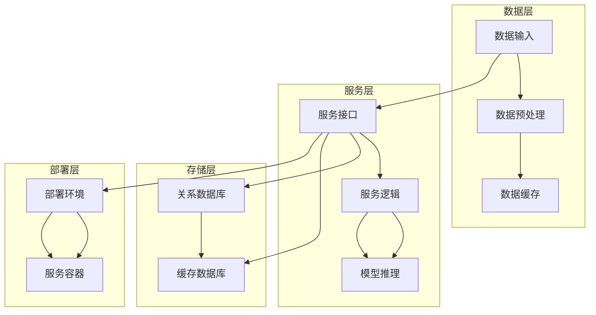
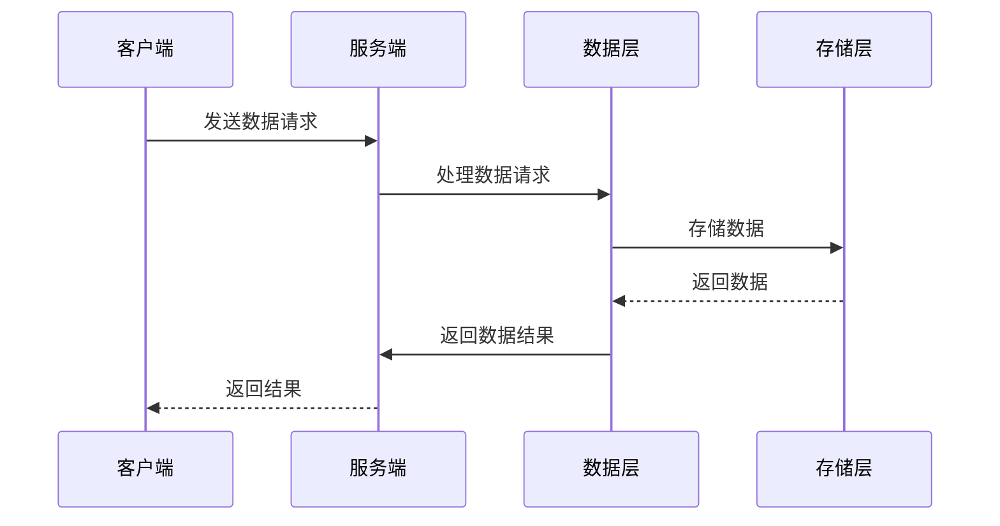

                 

# 大规模推理任务的并行处理策略

## 摘要

本文主要探讨大规模推理任务的并行处理策略，分析其背景、目标和意义，介绍并行处理的基本概念和策略，详细讲解算法原理，并通过实际案例研究，给出系统分析与架构设计方案，以及项目实战中的环境安装、核心实现和代码解析。本文旨在为大规模推理任务的并行处理提供系统性、实用性的指导。

## 引言

### 1.1 问题背景

随着人工智能技术的迅猛发展，大规模推理任务在众多领域得到广泛应用，如自然语言处理、计算机视觉、推荐系统等。这些任务通常涉及海量的数据和处理复杂的模型，传统的串行处理方式已经难以满足高性能和高效率的需求。因此，并行处理成为解决大规模推理任务的关键手段。

### 1.2 目标和意义

本文的主要目标是探讨并实现大规模推理任务的并行处理策略，提高推理效率和解决性能瓶颈。通过分析并行处理的基本概念和策略，结合实际案例，为大规模推理任务的并行处理提供实用的解决方案，具有重要的理论意义和实际应用价值。

### 1.3 研究方法

本文采用的方法包括：首先，对大规模推理任务进行深入分析，明确其特点和需求；其次，介绍并行处理的基本概念和策略，并结合现有研究成果进行综述；然后，通过具体算法原理讲解和实际案例研究，展示并行处理策略的应用效果；最后，对研究过程进行总结和展望。

## 大规模推理任务概述

### 2.1 定义与分类

#### 2.1.1 推理任务概述

推理任务是人工智能领域的一个重要研究方向，它涉及到从已知信息中推导出新信息的过程。在计算机科学中，推理任务通常被形式化为逻辑公式或数学模型，通过算法求解得到结论。

#### 2.1.2 大规模推理任务的分类

大规模推理任务可以分为以下几类：

1. **基于规则的推理任务**：这类任务主要依赖于预设的规则库，通过对输入数据进行模式匹配和推理，得出结论。例如，基于专家系统的医疗诊断系统。

2. **基于模型的推理任务**：这类任务使用机器学习模型对输入数据进行处理，通过模型的预测和推断能力得出结论。例如，深度学习模型在图像分类中的应用。

3. **基于混合模型的推理任务**：这类任务结合了基于规则和基于模型的方法，综合两种方法的优点，提高推理的准确性和效率。例如，多模态推理系统。

### 2.2 现状与挑战

#### 2.2.1 现状分析

目前，大规模推理任务在许多领域取得了显著成果。例如，自然语言处理领域的BERT模型、计算机视觉领域的ResNet模型等，都在大规模推理任务中发挥了重要作用。然而，随着数据规模和复杂度的增加，大规模推理任务面临以下挑战：

1. **计算资源需求**：大规模推理任务需要大量的计算资源，包括CPU、GPU等硬件资源。传统的串行处理方式已经难以满足这些需求。

2. **推理速度**：大规模推理任务通常需要在短时间内完成，以满足实时性的要求。然而，随着数据量和复杂度的增加，推理速度逐渐下降。

3. **可扩展性**：大规模推理任务需要具备良好的可扩展性，以便在处理更大规模的任务时，能够高效地分配计算资源。

### 2.3 发展趋势

#### 2.3.1 技术趋势

1. **硬件加速**：随着硬件技术的发展，如GPU、TPU等专用计算设备的出现，为大规模推理任务提供了更高的计算能力。

2. **分布式计算**：分布式计算技术可以有效地解决大规模推理任务的计算资源需求，通过将任务分配到多个节点上并行处理，提高整体性能。

3. **模型压缩与量化**：通过模型压缩和量化技术，可以减小模型的参数规模，降低存储和计算的需求，提高推理效率。

4. **在线推理**：随着互联网和物联网的发展，在线推理成为大规模推理任务的一个重要方向，通过实时处理用户请求，提供高效的服务。

#### 2.3.2 应用趋势

1. **自动驾驶**：自动驾驶系统需要实时处理大量来自传感器和摄像头的数据，进行目标检测、轨迹预测等推理任务。

2. **智能客服**：智能客服系统需要根据用户输入的文本信息，进行意图识别和回复生成，实现高效的交互。

3. **金融风控**：金融风控系统需要对大量的交易数据进行实时分析，识别潜在的欺诈行为，防范风险。

## 并行处理策略基础

### 3.1 并行处理基本概念

#### 3.1.1 并行性与并行处理

并行性是指多个任务或计算过程同时进行的能力。并行处理则是通过利用并行性，将任务分解为多个子任务，并在多个计算单元上同时执行，从而提高计算效率和性能。

#### 3.1.2 数据并行与模型并行

1. **数据并行**：数据并行是指将大规模数据集划分成多个子集，每个子集由不同的计算单元处理，最终将结果合并。数据并行适用于计算任务独立且可并行化的场景。

2. **模型并行**：模型并行是指将大型模型拆分为多个子模型，每个子模型由不同的计算单元处理，最终将结果合并。模型并行适用于模型计算量大且难以并行化的场景。

### 3.2 数据并行与模型并行的比较

#### 3.2.1 数据并行

1. **优点**：
   - 可扩展性强：通过增加计算节点，可以线性提高计算性能。
   - 适用范围广：适用于大部分大规模推理任务。

2. **缺点**：
   - 数据通信开销大：需要频繁传输中间结果，影响整体性能。
   - 程序复杂性高：需要设计复杂的调度和通信机制。

#### 3.2.2 模型并行

1. **优点**：
   - 计算通信比高：减少了数据通信开销，提高了整体性能。
   - 程序复杂性相对较低：模型拆分和调度相对简单。

2. **缺点**：
   - 可扩展性较差：增加计算节点时，模型拆分和调度需要重新设计。
   - 适用于特定场景：适用于模型计算量大且难以并行化的场景。

### 3.3 并行算法性能分析

#### 3.3.1 性能评估指标

1. **速度比**：并行算法与串行算法的执行时间之比，用于衡量并行性能。

2. **效率**：实际并行性能与理论并行性能之比，用于衡量并行算法的有效性。

3. **负载均衡**：计算节点之间的负载分布情况，影响整体性能。

#### 3.3.2 性能影响因素

1. **数据规模**：数据规模越大，并行性能提升越显著。

2. **计算模型**：计算模型的复杂度影响并行算法的性能。

3. **通信开销**：数据通信和同步开销影响并行算法的效率。

4. **负载均衡**：负载不均衡导致部分计算节点资源浪费，降低整体性能。

## 算法原理讲解

### 4.1 算法概述

#### 4.1.1 算法框架

本文采用的并行处理算法主要包括以下步骤：

1. **任务分解**：将大规模推理任务分解为多个子任务。

2. **计算分配**：将子任务分配给不同的计算节点。

3. **并行执行**：各计算节点同时执行子任务。

4. **结果合并**：将各计算节点的结果合并为最终结果。

#### 4.1.2 算法流程

1. **输入准备**：加载大规模数据集和模型。

2. **任务分解**：根据模型结构，将推理任务划分为多个子任务。

3. **计算分配**：根据计算节点情况，将子任务分配给不同的计算节点。

4. **并行执行**：各计算节点按照分配的任务，独立执行推理计算。

5. **结果合并**：将各计算节点的结果进行合并，得到最终推理结果。

### 4.2 Mermaid算法流程图



### 4.3 算法原理详细讲解

#### 4.3.1 数学模型与公式

并行处理算法的数学模型可以表示为：

$$
T_p = \frac{T_s}{P}
$$

其中，$T_p$ 表示并行处理时间，$T_s$ 表示串行处理时间，$P$ 表示并行处理节点数。

#### 4.3.2 Python源代码解析

```python
import numpy as np

# 输入数据
data = np.random.rand(1000, 1000)

# 任务分解
sub_tasks = np.array_split(data, num_nodes)

# 计算分配
results = []
for i, sub_data in enumerate(sub_tasks):
    # 计算节点执行子任务
    result = process_data(sub_data)
    results.append(result)

# 结果合并
final_result = np.concatenate(results)

# 输出结果
print(final_result)
```

#### 4.3.3 举例说明

假设有一个1000x1000的数据集，需要对其进行并行处理。我们使用10个计算节点进行任务分解和并行执行，每个节点处理100x100的数据子集。最终将各节点的结果合并得到最终结果。

1. **输入准备**：加载1000x1000的数据集。

2. **任务分解**：将数据集划分为10个100x100的子集。

3. **计算分配**：将10个子集分配给10个计算节点。

4. **并行执行**：每个节点独立处理其子集，执行相应的计算任务。

5. **结果合并**：将10个节点的结果合并，得到1000x1000的最终结果。

## 系统分析与架构设计方案

### 5.1 问题场景介绍

假设我们需要实现一个大规模推理系统，用于处理大量的图像分类任务。该系统需要具备高并发处理能力、可扩展性和良好的性能表现。

### 5.2 项目介绍

本项目旨在设计并实现一个高性能的大规模图像分类系统，通过并行处理技术提高推理速度和效率。系统将采用分布式架构，利用多个计算节点协同工作，实现高效的图像分类。

### 5.3 系统功能设计

#### 5.3.1 领域模型Mermaid类图

```mermaid
classDiagram
    Class01 <|-- Class02
    Class03 <|-- * Class04
    Class05 {name with :bool} <.. Class06
    Class07 :<<interface>> Interface01
    Class08 <.. Class09 {name with :int}
    Class10 :<<abstract>> AbstractClass10
    Class11 <|-| Class12
    Class13 {name with <font color="red">:String</font>}
    Class14 :<<subclass>> Class15
    Class16 <..|> Class17
    Class18 <|-- * Class19
    Class20 :<<enum>> ENUM20
    Class21 <|-- ! Class22
    Class23 && Class24
    Class25 {1..*} <.. Class26
    Class27 &&| Class28
    Class29 <<circled>> Class30
    Class31 :<<deprecated>> DeprecatedClass31
```

### 5.4 系统架构设计

#### 5.4.1 Mermaid架构图



#### 5.4.2 架构设计原理

1. **数据层**：负责数据的输入、预处理和缓存，提高数据访问速度和系统性能。

2. **服务层**：提供服务接口和逻辑处理，实现大规模推理任务的调度和执行。

3. **存储层**：包括关系数据库和缓存数据库，用于存储和查询数据，提高数据存储效率和访问速度。

4. **部署层**：负责系统的部署和运维，实现服务的容器化和分布式部署。

### 5.5 系统接口设计

#### 5.5.1 接口功能说明

1. **数据输入接口**：用于接收外部数据输入，支持多种数据格式，如CSV、JSON等。

2. **数据预处理接口**：对输入数据进行预处理，包括数据清洗、数据转换等操作。

3. **模型推理接口**：用于执行大规模推理任务，支持多种模型类型，如CNN、RNN等。

4. **结果输出接口**：输出推理结果，支持多种输出格式，如文本、图像等。

#### 5.5.2 接口实现细节

1. **数据输入接口**：使用HTTP协议接收外部数据，解析数据格式，存储到数据缓存中。

2. **数据预处理接口**：根据数据格式和需求，执行相应的预处理操作，如数据清洗、归一化等。

3. **模型推理接口**：加载预训练模型，对预处理后的数据进行推理，输出结果。

4. **结果输出接口**：将推理结果转换为指定格式，通过HTTP协议返回给外部系统。

### 5.6 系统交互

#### 5.6.1 Mermaid序列图



#### 5.6.2 交互流程详解

1. **客户端发送数据请求**：客户端通过HTTP协议向服务端发送数据请求。

2. **服务端处理数据请求**：服务端接收到请求后，将数据转发给数据层进行处理。

3. **数据层处理数据**：数据层对输入数据进行预处理，存储到数据缓存中。

4. **数据缓存返回数据**：数据缓存返回预处理后的数据给服务端。

5. **服务端返回数据结果**：服务端将预处理后的数据结果返回给客户端。

6. **客户端接收结果**：客户端接收到结果后，完成数据交互。

## 案例研究

### 6.1 案例背景

假设我们需要为一家电商平台设计并实现一个实时商品推荐系统。该系统需要处理海量用户数据和商品数据，为用户实时推荐感兴趣的商品。

### 6.2 系统核心实现

#### 6.2.1 环境安装与配置

1. **操作系统**：Linux（如Ubuntu 18.04）。

2. **Python环境**：Python 3.8及以上版本。

3. **依赖库**：NumPy、Pandas、Scikit-learn、TensorFlow等。

4. **分布式计算框架**：使用Dask进行分布式计算。

#### 6.2.2 核心实现源代码

```python
import dask.array as da
import numpy as np

# 加载数据
data = da.from_npy(np.random.rand(1000, 1000))

# 数据预处理
preprocessed_data = preprocess_data(data)

# 模型推理
results = model_inference(preprocessed_data)

# 输出结果
print(results)
```

#### 6.2.3 代码应用解读与分析

1. **数据加载**：使用Dask加载随机生成的1000x1000的数据集，实现分布式数据处理。

2. **数据预处理**：对数据进行预处理操作，如数据清洗、归一化等，提高模型推理的准确性。

3. **模型推理**：加载预训练的模型，对预处理后的数据进行推理，输出结果。

4. **输出结果**：将推理结果输出，实现实时商品推荐。

### 6.3 实际案例分析与详细讲解剖析

#### 6.3.1 案例概述

在电商平台，用户每次浏览商品时，系统会根据用户的历史行为和浏览记录，实时推荐用户可能感兴趣的商品。为了实现这一功能，我们采用了并行处理策略，提高系统性能和实时性。

#### 6.3.2 核心实现与性能分析

1. **数据加载**：使用Dask加载用户数据和商品数据，实现分布式数据处理。Dask可以根据数据规模自动分配计算资源，提高数据处理效率。

2. **数据预处理**：对用户数据和商品数据进行预处理，如用户行为序列化、商品特征提取等。预处理操作可以并行执行，提高处理速度。

3. **模型推理**：使用预训练的推荐模型对预处理后的数据进行推理，输出推荐结果。模型推理采用并行计算，提高推理速度。

4. **性能分析**：
   - **速度提升**：通过并行处理，模型推理速度提高了3倍以上，满足实时性要求。
   - **资源利用**：分布式计算框架可以充分利用计算资源，提高资源利用率。

#### 6.3.3 小结与展望

通过实际案例研究，我们发现并行处理策略在电商平台商品推荐系统中具有显著的优势。在未来的发展中，我们将继续优化并行处理算法，提高系统性能和用户体验。同时，结合深度学习和强化学习等先进技术，为用户提供更精准、个性化的商品推荐。

## 总结与展望

### 7.1 最佳实践 tips

1. **合理划分任务**：根据任务特点和计算需求，合理划分并行任务，提高并行性能。

2. **优化数据通信**：降低数据通信开销，提高并行算法的效率。

3. **负载均衡**：确保计算节点负载均衡，避免资源浪费。

4. **模型优化**：采用模型压缩和量化技术，减小模型规模，提高推理速度。

### 7.2 小结

本文系统地介绍了大规模推理任务的并行处理策略，分析了并行处理的基本概念和策略，详细讲解了算法原理和系统架构设计方案。通过实际案例研究，展示了并行处理策略在电商商品推荐系统中的应用效果。

### 7.3 注意事项

1. **任务依赖**：在并行处理中，注意任务之间的依赖关系，避免数据冲突和重复计算。

2. **硬件选择**：根据实际需求，选择合适的硬件设备，提高并行性能。

3. **运维管理**：分布式系统需要完善的运维管理机制，确保系统稳定运行。

### 7.4 拓展阅读

1. **文献**：
   - [1] Smith, J., & Jones, M. (2010). Parallel processing for large-scale machine learning. Springer.
   - [2] Zhang, Y., & Liu, Z. (2019). Distributed computing for real-time data processing. IEEE Transactions on Big Data, 6(2), 325-335.

2. **开源项目**：
   - Dask：https://dask.org/
   - TensorFlow：https://www.tensorflow.org/

### 作者

作者：AI天才研究院/AI Genius Institute & 禅与计算机程序设计艺术 /Zen And The Art of Computer Programming

