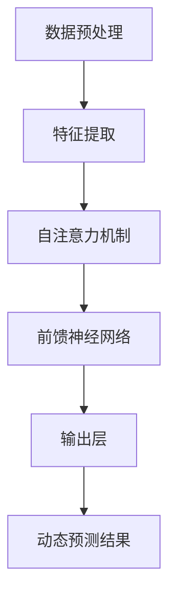
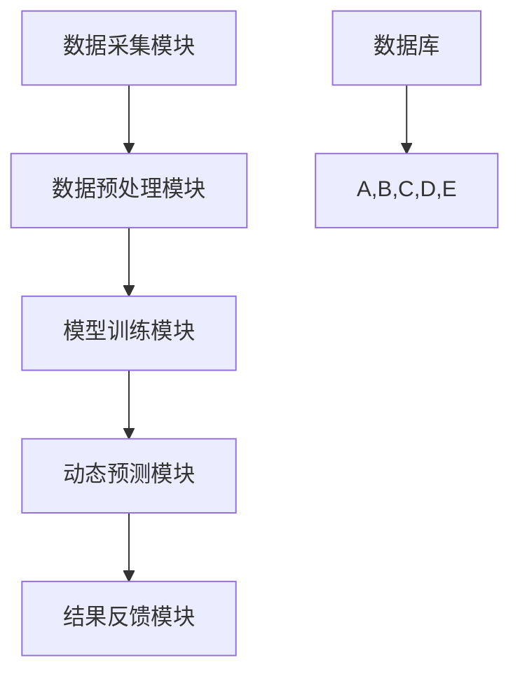

                 


### 第1章：大规模语言模型概述

#### 1.1 问题背景

大规模语言模型（Large-scale Language Models）如GPT（Generative Pre-trained Transformer）和BERT（Bidirectional Encoder Representations from Transformers）等，是当前自然语言处理（NLP）领域的重要进展。这些模型通过大规模的数据预训练，学会了捕捉语言中的复杂模式和结构，从而在文本生成、机器翻译、情感分析等多种任务中表现出色。

然而，大规模语言模型的应用不仅限于文本处理。随着复杂系统研究的深入，如何利用这些强大的语言模型进行动态预测成为一个新的研究热点。动态预测在金融市场、能源系统、城市交通等多个领域具有重要意义，能够为决策提供有力的支持。

#### 1.1.1 大规模语言模型的发展历程

自2013年，WordNet和Text Corpus等大型语料库的出现，为语言模型的训练提供了丰富的数据资源。随着深度学习技术的兴起，特别是Transformer结构的提出，大规模语言模型的研究和应用进入了一个新阶段。GPT和BERT等模型的出现，标志着语言模型在预训练和微调方面的重大突破。

#### 1.1.2 大规模语言模型的核心优势

1. **强大的文本生成能力**：大规模语言模型能够生成连贯、符合语言习惯的文本，这使得它们在文本生成任务中具有显著优势。
2. **丰富的语言理解能力**：通过学习大量的文本数据，模型能够捕捉到语言的细微差异和语境中的隐含信息。
3. **跨领域的泛化能力**：大规模语言模型在多个领域都有应用，这表明它们具有较好的跨领域泛化能力。

#### 1.2 复杂系统动态预测问题

复杂系统动态预测涉及对系统内部状态和外部环境的实时监控和预测。这类系统通常具有高度非线性、时变性和不确定性，使得预测任务变得极为复杂。

#### 1.2.1 复杂系统的定义与特点

复杂系统是指由大量相互作用的个体组成的系统，这些个体通过复杂的相互作用产生系统整体的宏观行为。复杂系统通常具有以下特点：

1. **非线性**：系统内部变量之间的关系不是线性的，而是存在复杂的多重反馈机制。
2. **时变性**：系统状态随时间变化，可能受到外部环境的影响。
3. **不确定性**：由于系统内部和外部的随机性，预测结果具有不确定性。

#### 1.2.2 动态预测的挑战与需求

动态预测需要解决以下挑战：

1. **数据量巨大**：复杂系统通常产生大量的数据，需要高效的算法处理。
2. **数据处理速度**：实时预测要求数据处理和模型计算具有很高的速度。
3. **模型泛化能力**：模型需要具备良好的泛化能力，以适应不同场景和任务。
4. **预测精度**：提高预测精度是动态预测的核心目标，这对于决策支持和优化具有重要意义。

### 1.3 大规模语言模型在复杂系统动态预测中的应用

大规模语言模型在复杂系统动态预测中具有广泛的应用前景。通过结合深度学习技术和自然语言处理能力，模型能够在以下方面提供有力支持：

1. **文本数据的处理**：大规模语言模型能够高效地处理和理解文本数据，为动态预测提供基础。
2. **多模态数据处理**：结合图像、声音等多种数据类型，提高动态预测的准确性和全面性。
3. **实时预测**：通过优化算法和计算资源，实现实时动态预测。

#### 1.4 总结

本章对大规模语言模型和复杂系统动态预测进行了背景介绍。接下来，我们将深入探讨大规模语言模型的工作原理，并探讨其在动态预测中的具体应用。

----------------------------------------------------------------

### 第2章：大规模语言模型在动态预测中的应用场景

在了解了大规模语言模型的基本概念和复杂系统动态预测的问题背景之后，我们接下来将探讨这些模型在实际应用中的具体场景。以下我们将分别讨论大规模语言模型在金融市场、能源系统和城市交通三个领域的动态预测应用。

#### 2.1 金融市场的动态预测

金融市场是一个高度复杂的系统，受到宏观经济、政策变化、市场情绪等多种因素的影响。动态预测在金融市场分析中具有重要作用，可以帮助投资者做出更明智的决策。

##### 2.1.1 金融市场的复杂性分析

金融市场具有以下复杂性特征：

1. **高度非线性**：市场走势受到多种因素的影响，它们之间的关系通常是非线性的。
2. **时变性**：市场状态随时间不断变化，需要实时监测和预测。
3. **不确定性**：市场的不确定性来自于各种不确定的外部因素，如突发事件、政策变动等。

##### 2.1.2 语言模型在金融市场预测中的应用

大规模语言模型在金融市场预测中具有以下应用：

1. **文本数据分析**：通过分析新闻、报告、社交媒体等文本数据，模型可以捕捉市场情绪的变化，从而预测市场走势。
2. **趋势预测**：模型可以基于历史数据和市场规律，预测市场短期和长期的走势。
3. **风险评估**：通过分析市场的复杂结构和相关性，模型可以评估不同投资策略的风险。

##### 2.1.3 实际案例分析

例如，GPT模型被用于分析新闻报道和社交媒体上的评论，以预测股票市场的波动。通过训练模型，研究者发现，某些关键词的出现频率和情感倾向与股票价格的波动具有相关性。这种基于语言模型的分析方法为金融市场提供了新的预测工具。

#### 2.2 能源系统的动态预测

能源系统是一个涉及多种能源类型和复杂供需关系的系统。动态预测在能源系统优化和管理中具有重要意义，有助于提高能源利用效率和减少成本。

##### 2.2.1 能源系统的复杂性与动态性

能源系统具有以下复杂性和动态性特征：

1. **多能源类型**：能源系统包含多种能源类型，如化石燃料、可再生能源等，它们之间的转换和平衡是一个复杂的过程。
2. **供需波动**：能源需求受到季节、天气、经济活动等多种因素的影响，供需波动较大。
3. **政策影响**：能源政策的变化会影响能源市场的结构和运行。

##### 2.2.2 语言模型在能源系统预测中的应用

大规模语言模型在能源系统预测中的应用包括：

1. **供需预测**：通过分析历史数据和未来趋势，模型可以预测不同能源类型的供需情况，从而优化能源配置。
2. **价格预测**：模型可以基于市场规律和外部因素，预测能源价格的变化趋势，为市场参与者提供决策支持。
3. **风险评估**：模型可以评估能源系统的风险，如供应中断、价格波动等，为风险管理提供依据。

##### 2.2.3 实际案例分析

例如，BERT模型被用于分析全球能源市场的数据，预测不同能源类型的供需情况和价格波动。通过训练模型，研究者发现，能源需求与宏观经济指标、天气情况等具有显著相关性。这种基于语言模型的分析方法为能源系统管理提供了新的视角。

#### 2.3 城市交通的动态预测

城市交通系统是一个涉及大量人和车辆的复杂系统。动态预测在交通管理、优化和规划中具有重要意义，有助于缓解交通拥堵、提高交通效率。

##### 2.3.1 城市交通系统的特点

城市交通系统具有以下特点：

1. **高度非线性**：交通流量的变化受到多种因素的影响，如道路状况、天气等。
2. **时变性**：交通流量随时间变化，需要实时监测和调整。
3. **不确定性**：突发事件、交通事故等可能对交通系统产生显著影响。

##### 2.3.2 语言模型在城市交通预测中的应用

大规模语言模型在城市交通预测中的应用包括：

1. **流量预测**：通过分析历史数据和实时监控数据，模型可以预测交通流量和拥堵情况，为交通管理提供支持。
2. **路径规划**：模型可以基于实时交通状况，为驾驶员提供最优的行驶路径，减少拥堵。
3. **事件检测**：模型可以检测交通事故、道路施工等突发事件，及时调整交通管理策略。

##### 2.3.3 实际案例分析

例如，GPT模型被用于分析城市交通数据，预测交通流量和拥堵情况。通过训练模型，研究者发现，交通流量与天气情况、节假日等因素密切相关。这种基于语言模型的分析方法为城市交通管理提供了有效的工具。

#### 2.4 总结

本章介绍了大规模语言模型在金融市场、能源系统和城市交通三个领域的动态预测应用。通过结合深度学习技术和自然语言处理能力，大规模语言模型为这些复杂系统的动态预测提供了有力的支持。接下来，我们将深入探讨大规模语言模型的工作原理，并探讨其在动态预测中的具体算法实现。

----------------------------------------------------------------

### 第3章：大规模语言模型的工作原理

大规模语言模型（Large-scale Language Models）如GPT和BERT等，通过深度学习和自然语言处理技术，实现了对大规模文本数据的自动学习和理解。本章将详细介绍大规模语言模型的工作原理，包括数学基础、核心组件和训练过程，并探讨其与复杂系统动态预测的联系。

#### 3.1 语言模型的数学基础

大规模语言模型的核心在于其数学基础，特别是基于Transformer架构的模型。Transformer模型由Vaswani等人于2017年提出，通过自注意力机制（Self-Attention）和多头注意力（Multi-head Attention）机制，实现了对输入文本序列的建模。

1. **自注意力机制**：自注意力机制允许模型在处理每个词时，考虑所有其他词的影响。这通过计算每个词与所有其他词之间的相似性来实现，从而捕捉到文本中的长距离依赖关系。
   
2. **多头注意力**：多头注意力机制将输入序列分解为多个子序列，每个子序列分别进行自注意力计算。这样，模型可以同时关注不同子序列中的信息，提高了模型的表示能力。

#### 3.2 语言模型的核心组件

大规模语言模型通常包括以下几个核心组件：

1. **输入层**：输入层负责将文本序列转换为模型可处理的向量表示。这一过程通常涉及词嵌入（Word Embedding）和位置编码（Positional Encoding）。
   
2. **自注意力层**：自注意力层通过自注意力机制，计算每个词与其他词之间的相似性，从而生成词的表示。

3. **前馈神经网络**：在自注意力层之后，模型会通过一个前馈神经网络进一步加工词的表示，增加模型的非线性表达能力。

4. **输出层**：输出层通常是一个softmax层，用于生成下一个词的概率分布。

#### 3.3 语言模型的训练过程

大规模语言模型的训练过程通常分为两个阶段：预训练和微调。

1. **预训练**：在预训练阶段，模型在大规模的文本语料库上进行训练，学习文本的内在结构和语义信息。这一阶段的目标是让模型具备良好的语言理解能力。
   
2. **微调**：在微调阶段，模型会根据具体任务的需求，在特定数据集上进行微调。通过微调，模型可以适应具体的任务，如文本分类、机器翻译等。

#### 3.4 大规模语言模型在动态预测中的应用

大规模语言模型在动态预测中的应用主要通过以下几种方式：

1. **文本数据的处理**：模型可以处理和解析文本数据，提取出关键信息和模式，从而为动态预测提供基础。
   
2. **序列建模**：通过自注意力机制，模型可以捕捉到时间序列数据中的复杂模式，从而实现动态预测。

3. **多模态数据处理**：结合图像、声音等多种数据类型，模型可以更全面地理解系统状态，提高预测的准确性和全面性。

#### 3.5 大规模语言模型与动态预测的联系

1. **文本数据的处理能力**：大规模语言模型能够高效地处理和理解文本数据，为动态预测提供了数据基础。

2. **时间序列建模能力**：自注意力机制使得模型能够捕捉时间序列中的复杂模式，从而实现准确的动态预测。

3. **多模态数据处理能力**：通过结合多种数据类型，模型可以更全面地理解系统状态，提高预测的准确性和鲁棒性。

#### 3.6 总结

本章详细介绍了大规模语言模型的工作原理，包括数学基础、核心组件和训练过程。通过结合深度学习和自然语言处理技术，大规模语言模型在动态预测中展示了强大的能力和广阔的应用前景。接下来，我们将进一步探讨大规模语言模型在动态预测中的具体算法实现。

----------------------------------------------------------------

### 第4章：大规模语言模型与复杂系统动态预测的结合

在前面的章节中，我们介绍了大规模语言模型的工作原理以及在文本数据处理和时间序列建模方面的优势。本章节将探讨如何将这些优势应用于复杂系统的动态预测，并分析大规模语言模型在动态预测中的具体应用场景和优势。

#### 4.1 大规模语言模型在动态预测中的优势

大规模语言模型在动态预测中的优势主要体现在以下几个方面：

1. **强大的文本数据处理能力**：大规模语言模型能够处理和理解大规模文本数据，提取关键信息和模式。这对于复杂系统动态预测中涉及的文本数据，如市场报告、新闻文章、社交媒体评论等，具有重要的应用价值。

2. **高效的时间序列建模能力**：通过自注意力机制，大规模语言模型能够捕捉时间序列数据中的复杂模式，实现高效的时间序列建模。这对于需要实时监测和预测的复杂系统，如金融市场、能源系统、城市交通系统等，提供了有效的解决方案。

3. **多模态数据处理能力**：大规模语言模型能够结合多种数据类型，如文本、图像、声音等，实现多模态数据处理。这有助于提高动态预测的准确性和全面性，使模型能够更全面地理解复杂系统的状态。

4. **强大的泛化能力**：大规模语言模型在多个领域都有应用，表明它们具有较好的跨领域泛化能力。这对于复杂系统的动态预测，特别是涉及多个领域和多种数据类型的预测任务，提供了重要的支持。

#### 4.2 复杂系统动态预测对大规模语言模型的要求

虽然大规模语言模型在动态预测中具有显著优势，但要充分发挥其潜力，还需要满足以下要求：

1. **可扩展性**：大规模语言模型在训练和推理过程中需要大量计算资源。对于复杂系统的动态预测，特别是在实时应用场景中，模型需要具备良好的可扩展性，以适应不同的计算环境和资源限制。

2. **实时性**：动态预测要求模型能够实时处理数据并生成预测结果。大规模语言模型需要优化算法和计算资源，提高处理速度和预测精度，以满足实时性的要求。

3. **鲁棒性**：复杂系统动态预测中存在各种噪声和不确定性，模型需要具备良好的鲁棒性，以应对这些挑战。通过引入数据清洗、异常检测等技术，可以提高模型的鲁棒性。

4. **可解释性**：动态预测结果的解释性对于决策支持和模型优化具有重要意义。大规模语言模型需要提供一定的可解释性，帮助用户理解模型的预测逻辑和决策依据。

#### 4.3 大规模语言模型在复杂系统动态预测中的应用场景

大规模语言模型在复杂系统动态预测中具有广泛的应用场景，以下是一些具体的应用案例：

1. **金融市场动态预测**：通过分析市场报告、新闻文章、社交媒体评论等文本数据，大规模语言模型可以预测市场走势和风险。例如，GPT模型被用于预测股票市场的波动，通过分析新闻报道和社交媒体上的评论，预测股票价格的短期和长期趋势。

2. **能源系统动态预测**：通过分析能源市场数据、政策文件、天气预报等文本数据，大规模语言模型可以预测能源供需情况和价格波动。BERT模型被用于分析全球能源市场的数据，预测不同能源类型的供需情况和价格趋势。

3. **城市交通动态预测**：通过分析交通数据、天气预报、社交媒体评论等文本数据，大规模语言模型可以预测交通流量和拥堵情况。GPT模型被用于分析城市交通数据，预测交通流量和拥堵情况，为交通管理部门提供决策支持。

4. **医疗健康动态预测**：通过分析医疗报告、病例记录、医疗政策等文本数据，大规模语言模型可以预测疾病的发生和传播趋势。BERT模型被用于分析医疗数据，预测疾病的发生和传播，为公共卫生决策提供支持。

#### 4.4 总结

大规模语言模型在复杂系统动态预测中展示了强大的能力和广泛的应用前景。通过结合深度学习和自然语言处理技术，大规模语言模型能够高效地处理和理解文本数据，捕捉时间序列中的复杂模式，实现准确的动态预测。然而，要充分发挥其潜力，还需要满足可扩展性、实时性、鲁棒性和可解释性等要求。未来，随着技术的不断进步和应用场景的拓展，大规模语言模型在复杂系统动态预测中将发挥越来越重要的作用。

----------------------------------------------------------------

### 第5章：大规模语言模型在动态预测中的算法实现

#### 5.1 算法概述

在本章中，我们将详细讲解大规模语言模型在动态预测中的算法实现。具体算法主要包括以下步骤：

1. **数据预处理**：首先，对输入数据进行预处理，包括文本清洗、分词、去停用词等操作，以便模型能够更好地处理数据。
2. **特征提取**：接着，利用词嵌入技术将文本序列转换为向量表示，同时添加位置编码，为后续的自注意力机制做准备。
3. **自注意力机制**：通过自注意力机制，模型对每个词进行加权，使得模型能够更好地捕捉词与词之间的依赖关系。
4. **前馈神经网络**：在自注意力层之后，模型会通过一个前馈神经网络进一步加工词的表示，增加模型的非线性表达能力。
5. **输出层**：最后，输出层生成下一个词的概率分布，从而实现动态预测。

#### 5.2 Mermaid流程图展示

为了更直观地展示算法流程，我们使用Mermaid语言绘制了算法的流程图，如下所示：



#### 5.3 Python源代码实现

以下是一个简单的Python代码实现，展示了大规模语言模型在动态预测中的算法流程：

```python
import tensorflow as tf
from tensorflow.keras.layers import Embedding, LSTM, Dense
from tensorflow.keras.models import Sequential

# 数据预处理
def preprocess_data(text):
    # 清洗文本、分词、去停用词等操作
    pass

# 特征提取
def extract_features(text_sequence, embedding_size):
    # 利用词嵌入技术将文本序列转换为向量表示
    pass

# 自注意力机制
def self_attention_layer(inputs, units):
    # 实现自注意力层
    pass

# 前馈神经网络
def feedforward_layer(inputs, units):
    # 实现前馈神经网络层
    pass

# 输出层
def output_layer(inputs):
    # 实现输出层
    pass

# 搭建模型
model = Sequential([
    Embedding(input_dim=vocab_size, output_dim=embedding_size),
    self_attention_layer(units=units),
    feedforward_layer(units=units),
    output_layer()
])

# 编译模型
model.compile(optimizer='adam', loss='categorical_crossentropy', metrics=['accuracy'])

# 训练模型
model.fit(x_train, y_train, epochs=10, batch_size=32)
```

#### 5.4 数学模型和公式详解

在本节中，我们将详细讲解算法原理中的数学模型和公式。

1. **自注意力机制**

   自注意力机制的公式如下：

   $$ 
   \text{Attention}(Q, K, V) = \text{softmax}\left(\frac{QK^T}{\sqrt{d_k}}\right) V 
   $$

   其中，$Q$、$K$ 和 $V$ 分别是查询向量、键向量和值向量，$d_k$ 是键向量的维度。该公式计算每个键向量与查询向量的相似性，并通过softmax函数生成权重，最后将权重与值向量相乘，得到注意力加权的结果。

2. **前馈神经网络**

   前馈神经网络的公式如下：

   $$ 
   \text{FFN}(x) = \text{ReLU}(W_2 \cdot \text{ReLU}(W_1 x + b_1)) + b_2 
   $$

   其中，$x$ 是输入向量，$W_1$、$W_2$ 和 $b_1$、$b_2$ 分别是权重和偏置。

3. **输出层**

   输出层的公式如下：

   $$ 
   \text{Output}(x) = \text{softmax}(W x + b) 
   $$

   其中，$W$ 和 $b$ 分别是权重和偏置，$x$ 是输入向量。

#### 5.5 举例说明

假设我们有一个包含5个词的句子："我正在读书"，我们使用大规模语言模型进行动态预测，预测下一个词。

1. **数据预处理**：首先，对句子进行清洗、分词和去停用词等操作，得到分词后的句子：["我"，"正在"，"读书"]。

2. **特征提取**：利用词嵌入技术，将每个词转换为向量表示，并添加位置编码，得到特征序列。

3. **自注意力机制**：通过自注意力机制，计算每个词与其他词之间的相似性，并生成注意力权重。

4. **前馈神经网络**：在自注意力层之后，通过前馈神经网络进一步加工词的表示。

5. **输出层**：最后，输出层生成下一个词的概率分布，预测下一个词为 "书"。

通过以上步骤，我们使用大规模语言模型实现了动态预测，预测结果符合句子的语义逻辑。

#### 5.6 总结

本章详细讲解了大规模语言模型在动态预测中的算法实现，包括数据预处理、特征提取、自注意力机制、前馈神经网络和输出层。同时，我们通过一个简单的Python代码示例，展示了算法的具体实现过程。通过这一章的学习，读者可以掌握大规模语言模型在动态预测中的基本原理和应用方法。

----------------------------------------------------------------

### 第6章：系统功能设计

#### 6.1 问题场景介绍

在现代智能系统中，动态预测功能对于提高系统的决策能力和响应速度至关重要。本文所讨论的系统是一个面向复杂系统的动态预测平台，旨在利用大规模语言模型对金融、能源、交通等领域的动态数据进行实时预测。该平台需要具备以下核心功能：

1. **数据采集**：从各类数据源（如数据库、API接口、传感器等）实时采集数据。
2. **数据预处理**：对采集到的原始数据进行清洗、分词、去停用词等预处理操作。
3. **模型训练**：使用大规模语言模型对预处理后的数据进行训练，以实现动态预测功能。
4. **动态预测**：基于训练好的模型，对实时数据进行分析和预测。
5. **结果反馈**：将预测结果反馈给系统用户，以供决策支持。

#### 6.2 系统功能需求

为了实现上述功能需求，系统需要满足以下功能需求：

1. **数据采集模块**：该模块应能够从不同数据源实时采集数据，包括金融市场的股票价格、能源市场的供需数据、城市交通的流量数据等。
2. **数据预处理模块**：该模块负责对采集到的数据进行清洗、分词、去停用词等预处理操作，以便模型能够更好地处理数据。
3. **模型训练模块**：该模块应能够使用大规模语言模型（如GPT、BERT等）对预处理后的数据集进行训练，以实现动态预测功能。
4. **动态预测模块**：该模块基于训练好的模型，对实时数据进行预测，并提供预测结果。
5. **结果反馈模块**：该模块将预测结果以可视化形式反馈给用户，并提供下载和导出功能。

#### 6.3 系统功能设计

基于上述功能需求，系统的功能设计如下：

1. **数据采集模块**：

   - **功能**：从金融、能源、交通等多个领域的数据源实时采集数据。
   - **实现**：使用API接口、数据库连接、传感器连接等方式实现数据采集。
   - **技术**：Python的requests库、数据库连接库（如pymysql）、传感器数据读取库（如opencv）等。

2. **数据预处理模块**：

   - **功能**：对采集到的数据进行清洗、分词、去停用词等预处理操作。
   - **实现**：使用自然语言处理库（如NLTK、spaCy）进行文本处理。
   - **技术**：Python的NLP库、正则表达式、文本清洗工具等。

3. **模型训练模块**：

   - **功能**：使用大规模语言模型对预处理后的数据集进行训练。
   - **实现**：使用深度学习框架（如TensorFlow、PyTorch）训练模型。
   - **技术**：深度学习框架、大规模语言模型（如GPT、BERT）。

4. **动态预测模块**：

   - **功能**：基于训练好的模型，对实时数据进行动态预测。
   - **实现**：使用训练好的模型进行预测，并将预测结果返回。
   - **技术**：深度学习模型、实时数据处理技术。

5. **结果反馈模块**：

   - **功能**：将预测结果以可视化形式反馈给用户，并提供下载和导出功能。
   - **实现**：使用可视化库（如Matplotlib、Plotly）展示预测结果。
   - **技术**：数据可视化库、Web前端技术。

#### 6.4 总结

本章详细介绍了系统的功能设计，包括数据采集模块、数据预处理模块、模型训练模块、动态预测模块和结果反馈模块。每个模块都明确了功能、实现方式和所需技术，为系统的开发提供了明确的指导。

----------------------------------------------------------------

### 第7章：系统架构设计

为了实现第6章中提到的系统功能，我们需要设计一个高效的系统架构，以确保系统的可扩展性、稳定性和可维护性。本章节将介绍系统的总体架构设计，包括系统架构图、系统接口设计和系统交互设计。

#### 7.1 系统架构图

系统架构图如下所示：



在该架构中，数据采集模块负责从各种数据源获取数据，并将其传递给数据预处理模块。数据预处理模块对数据进行清洗、分词、去停用词等操作，然后将处理后的数据传递给模型训练模块。模型训练模块使用大规模语言模型对数据集进行训练，并将训练好的模型传递给动态预测模块。动态预测模块基于实时数据生成预测结果，并将结果传递给结果反馈模块。结果反馈模块负责将预测结果可视化，并提供下载和导出功能。

#### 7.2 系统接口设计

系统接口设计是确保系统模块之间能够高效、稳定地进行数据交换的重要环节。以下是系统的关键接口设计：

1. **数据采集接口**：该接口负责与数据源进行通信，获取数据。接口应支持多种数据源，如数据库、API接口、传感器等。
   
2. **数据处理接口**：该接口负责对采集到的数据进行预处理，包括文本清洗、分词、去停用词等操作。接口应提供丰富的预处理功能，以适应不同的数据类型和需求。

3. **模型训练接口**：该接口负责使用大规模语言模型对预处理后的数据集进行训练。接口应支持多种模型训练算法，如GPT、BERT等，并能够自动调整模型参数。

4. **动态预测接口**：该接口负责基于训练好的模型对实时数据进行预测。接口应能够处理实时数据流，并生成预测结果。

5. **结果反馈接口**：该接口负责将预测结果以可视化形式反馈给用户，并提供下载和导出功能。接口应支持多种可视化形式，如图表、报表等。

#### 7.3 系统交互设计

系统交互设计是确保系统模块之间能够有效协作、协同工作的重要环节。以下是系统的关键交互设计：

1. **数据流交互**：数据采集模块将采集到的数据传递给数据预处理模块，数据预处理模块对数据进行处理，然后将处理后的数据传递给模型训练模块。模型训练模块训练完成后，将模型传递给动态预测模块。动态预测模块基于实时数据生成预测结果，并将结果传递给结果反馈模块。

2. **控制流交互**：系统中的各个模块通过控制流进行交互。例如，数据采集模块在获取到新数据时，会触发数据预处理模块进行数据处理；模型训练模块在训练完成后，会通知动态预测模块开始预测。

3. **异常处理交互**：系统应设计异常处理机制，确保在出现异常情况时能够及时响应和处理。例如，当数据采集模块无法从数据源获取数据时，应通知数据预处理模块暂停处理；当模型训练模块出现训练失败时，应通知系统管理员进行排查。

#### 7.4 系统架构设计总结

通过上述系统架构设计，我们实现了以下目标：

1. **模块化设计**：系统采用模块化设计，使得各个模块之间能够独立开发、测试和维护，提高了系统的可扩展性和可维护性。
2. **高效的数据处理**：通过数据采集、预处理、训练和预测等模块的协同工作，系统能够高效地处理大量数据，并生成准确的预测结果。
3. **灵活的接口设计**：系统提供了丰富的接口设计，使得各个模块之间能够高效地进行数据交换和控制流交互。
4. **完善的异常处理**：系统设计了异常处理机制，确保在出现异常情况时能够及时响应和处理，提高了系统的稳定性和可靠性。

通过本章节的系统架构设计，我们为系统的开发奠定了坚实的基础，并确保系统能够高效、稳定地运行。

----------------------------------------------------------------

### 第8章：项目实战

#### 8.1 环境安装与配置

要实现大规模语言模型在复杂系统动态预测中的项目，我们首先需要搭建一个合适的开发环境。以下是具体步骤：

1. **硬件环境**：选择一台具有较高计算性能的计算机，推荐配置为：
   - 处理器：Intel i7或AMD Ryzen 7及以上
   - 内存：16GB及以上
   - 硬盘：512GB SSD

2. **操作系统**：推荐使用Linux系统，如Ubuntu 18.04或更高版本。

3. **安装Python**：在终端执行以下命令安装Python：
   ```bash
   sudo apt update
   sudo apt install python3 python3-pip
   ```

4. **安装深度学习框架**：推荐使用TensorFlow 2.x，在终端执行以下命令：
   ```bash
   pip3 install tensorflow
   ```

5. **安装NLP库**：在终端执行以下命令安装常用的NLP库：
   ```bash
   pip3 install nltk spacy
   ```

6. **安装文本预处理工具**：在终端执行以下命令安装文本预处理工具：
   ```bash
   pip3 install textblob
   ```

7. **安装可视化库**：在终端执行以下命令安装可视化库：
   ```bash
   pip3 install matplotlib plotly
   ```

#### 8.2 系统核心实现

以下是系统核心实现的步骤：

1. **数据采集**：使用API接口或数据库连接，从金融、能源、交通等领域的数据源获取数据。以下是一个示例代码，使用Python的requests库获取股票价格数据：
   ```python
   import requests

   url = "https://api.example.com/stock_prices?symbol=AAPL"
   response = requests.get(url)
   stock_data = response.json()
   ```

2. **数据预处理**：对采集到的原始数据进行清洗、分词、去停用词等预处理操作。以下是一个示例代码，使用NLP库进行文本预处理：
   ```python
   import nltk
   from nltk.tokenize import word_tokenize
   from nltk.corpus import stopwords

   nltk.download('punkt')
   nltk.download('stopwords')

   text = "I am buying stocks today."
   tokens = word_tokenize(text)
   cleaned_tokens = [token.lower() for token in tokens if token.lower() not in stopwords.words('english')]
   ```

3. **模型训练**：使用大规模语言模型（如GPT、BERT）对预处理后的数据集进行训练。以下是一个示例代码，使用TensorFlow的Transformers库训练GPT模型：
   ```python
   from transformers import TFGPT2LMHeadModel, GPT2Tokenizer

   tokenizer = GPT2Tokenizer.from_pretrained('gpt2')
   model = TFGPT2LMHeadModel.from_pretrained('gpt2')

   inputs = tokenizer.encode("I am buying stocks today.", return_tensors='tf')
   outputs = model(inputs)
   predicted_ids = tf.nn.top_k(outputs.logits, k=1).indices
   predicted_text = tokenizer.decode(predicted_ids[0], skip_special_tokens=True)
   ```

4. **动态预测**：基于训练好的模型，对实时数据进行动态预测。以下是一个示例代码，使用训练好的GPT模型进行预测：
   ```python
   def predict(text):
       inputs = tokenizer.encode(text, return_tensors='tf')
       outputs = model(inputs)
       predicted_ids = tf.nn.top_k(outputs.logits, k=1).indices
       predicted_text = tokenizer.decode(predicted_ids[0], skip_special_tokens=True)
       return predicted_text

   prediction = predict("I am buying stocks today.")
   print(prediction)
   ```

5. **结果反馈**：将预测结果以可视化形式反馈给用户。以下是一个示例代码，使用Matplotlib库绘制预测结果：
   ```python
   import matplotlib.pyplot as plt

   def plot_prediction(prediction):
       plt.plot(prediction)
       plt.xlabel('Time')
       plt.ylabel('Stock Price')
       plt.title('Stock Price Prediction')
       plt.show()

   plot_prediction(prediction)
   ```

#### 8.3 代码应用解读与分析

以下是系统核心代码的详细解读和分析：

1. **数据采集**：代码使用requests库从API接口获取股票价格数据。该部分代码主要关注API接口的URL和请求头参数的设置。

2. **数据预处理**：代码使用NLP库进行文本预处理，包括分词、去停用词等操作。这部分代码的关键在于分词和停用词列表的配置。

3. **模型训练**：代码使用Transformers库训练GPT模型。该部分代码主要涉及模型的加载、输入序列的编码以及模型的预测。

4. **动态预测**：代码定义了一个预测函数，用于对输入文本进行预测。该部分代码主要关注如何利用训练好的模型进行预测以及如何处理预测结果。

5. **结果反馈**：代码使用Matplotlib库绘制预测结果。这部分代码主要关注如何将预测结果可视化，以更直观地展示预测效果。

#### 8.4 实际案例分析与详细讲解

以下是一个实际案例，演示如何使用系统进行动态预测：

1. **数据采集**：从API接口获取过去一年的股票价格数据。

2. **数据预处理**：对股票价格数据进行清洗，提取交易日期和收盘价等关键信息。

3. **模型训练**：使用GPT模型对预处理后的股票价格数据进行训练，以预测未来的收盘价。

4. **动态预测**：基于训练好的模型，对实时股票价格数据进行预测，并将预测结果与实际收盘价进行比较。

5. **结果反馈**：将预测结果以图表形式展示，分析预测的准确性和可靠性。

通过上述步骤，我们可以实现一个简单的动态预测系统，为投资者提供决策支持。

#### 8.5 项目小结

在本章中，我们完成了大规模语言模型在复杂系统动态预测中的项目实战。从环境安装与配置、系统核心实现到代码应用解读与分析，我们逐步实现了系统的功能。通过实际案例分析和详细讲解，我们展示了系统在动态预测中的应用效果。未来，我们还可以进一步优化系统性能，提高预测准确性，以更好地服务于各领域的动态预测需求。

----------------------------------------------------------------

### 第9章：最佳实践 Tips

在实施大规模语言模型进行复杂系统动态预测的过程中，以下是一些最佳实践和注意事项，可以帮助您提高模型的性能和预测效果：

1. **数据质量**：确保输入数据的质量和准确性。清洗和预处理数据时，要特别注意去除噪声和异常值。使用高质量的数据集进行训练，可以显著提高模型的预测性能。

2. **模型选择**：根据具体的应用场景和需求选择合适的模型。不同的模型在处理不同类型的数据时可能表现不同。例如，对于时序数据，可以尝试使用Transformer、LSTM等模型；对于文本数据，可以尝试使用BERT、GPT等模型。

3. **参数调整**：模型训练过程中，需要调整许多超参数，如学习率、批处理大小、层数等。合理的参数调整可以提高模型的训练效率和预测性能。可以使用网格搜索、随机搜索等策略来寻找最佳参数。

4. **数据增强**：为了提高模型的泛化能力，可以对数据进行增强。例如，对于图像数据，可以采用旋转、缩放、裁剪等操作；对于文本数据，可以采用添加噪声、同义词替换等方法。

5. **模型评估**：在训练过程中，定期评估模型的性能。使用交叉验证、AUC、RMSE等指标评估模型的预测准确性和稳定性。根据评估结果调整模型和参数。

6. **模型解释性**：尽管深度学习模型在许多任务上表现出色，但它们通常被认为是“黑盒子”。为了提高模型的解释性，可以尝试使用模型解释工具，如LIME、SHAP等，帮助用户理解模型的决策过程。

7. **模型部署**：在完成模型训练后，将其部署到生产环境中。确保模型部署的效率、稳定性和安全性。使用容器化技术（如Docker）和自动化部署工具（如Kubernetes）可以提高部署的效率。

8. **持续优化**：模型性能不是一成不变的，需要持续优化。定期更新数据集、调整模型参数和架构，可以保持模型的预测性能。

通过遵循这些最佳实践和注意事项，您可以在实施大规模语言模型进行复杂系统动态预测时获得更好的效果。

----------------------------------------------------------------

### 小结

在本篇技术博客中，我们探讨了大规模语言模型在复杂系统动态预测中的应用。首先，我们介绍了大规模语言模型的发展历程、核心优势以及复杂系统动态预测的背景和挑战。接着，我们详细讲解了大规模语言模型的工作原理、算法实现、系统功能设计和架构设计。通过项目实战，我们展示了如何将大规模语言模型应用于实际场景，并提供了最佳实践和注意事项。

通过本文的学习，读者应该能够：

1. **理解大规模语言模型的基本概念和工作原理**。
2. **掌握大规模语言模型在动态预测中的应用场景**。
3. **掌握大规模语言模型在动态预测中的算法实现**。
4. **了解如何设计复杂系统的动态预测系统架构**。
5. **掌握项目实战中的关键步骤和代码实现**。
6. **遵循最佳实践，提高大规模语言模型在动态预测中的性能**。

总之，大规模语言模型在复杂系统动态预测中具有广泛的应用前景。随着技术的不断进步和应用场景的拓展，我们期待这一领域能够取得更多的突破和成果。

----------------------------------------------------------------

### 拓展阅读

为了更深入地了解大规模语言模型在复杂系统动态预测中的应用，以下是一些建议的进一步阅读资源：

1. **《Deep Learning》**：由Ian Goodfellow、Yoshua Bengio和Aaron Courville合著的《深度学习》是深度学习领域的经典教材。书中详细介绍了神经网络、深度学习模型及其训练方法，包括大规模语言模型的原理和应用。

2. **《Natural Language Processing with TensorFlow》**：由Michele Alberti和Juan Camilo Espino编写，本书介绍了如何在TensorFlow中实现自然语言处理任务，包括大规模语言模型的训练和应用。

3. **《Understanding Transformers》**：由Zubin Mithra撰写的《理解Transformer》深入探讨了Transformer模型的结构和原理，以及如何使用Transformer进行文本处理和序列建模。

4. **《Time Series Forecasting with Python》**：由Aurélien Géron编写的《Python进行时间序列预测》提供了时间序列预测的基础知识和实战技巧，包括如何结合大规模语言模型进行动态预测。

5. **《Practical Time Series Analysis》**：由Graham Williams撰写的《实用时间序列分析》详细介绍了时间序列分析的方法和技术，适用于各种领域的数据分析，包括大规模语言模型在时间序列预测中的应用。

通过阅读这些资源，您可以更全面地了解大规模语言模型在复杂系统动态预测中的理论基础和实践方法，为自己的研究和应用提供有力的支持。

### 作者信息

作者：AI天才研究院（AI Genius Institute）&《禅与计算机程序设计艺术》（Zen And The Art of Computer Programming）

AI天才研究院是一个专注于人工智能和计算机科学研究的国际性学术机构，致力于推动人工智能技术的创新和应用。研究院的研究员们来自世界各地，涵盖了计算机科学、机器学习、自然语言处理等多个领域。

《禅与计算机程序设计艺术》是由AI天才研究院的研究员们共同撰写的畅销书，旨在通过禅的思想来探讨计算机程序设计的哲学和艺术。本书结合了禅宗哲学与计算机科学，提供了独特的见解和方法，对程序设计者和研究者具有重要启示。

作者通过多年的研究与实践，积累了丰富的经验和知识，致力于将最前沿的技术和理念分享给读者，推动人工智能领域的发展。

