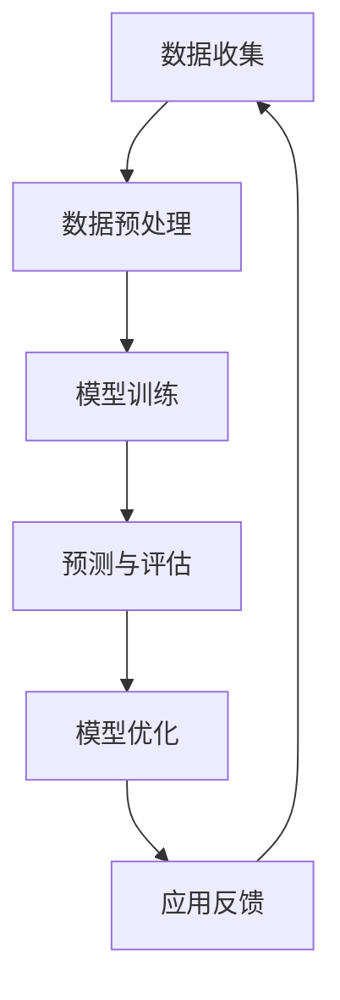
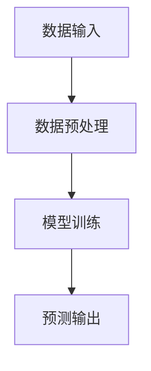
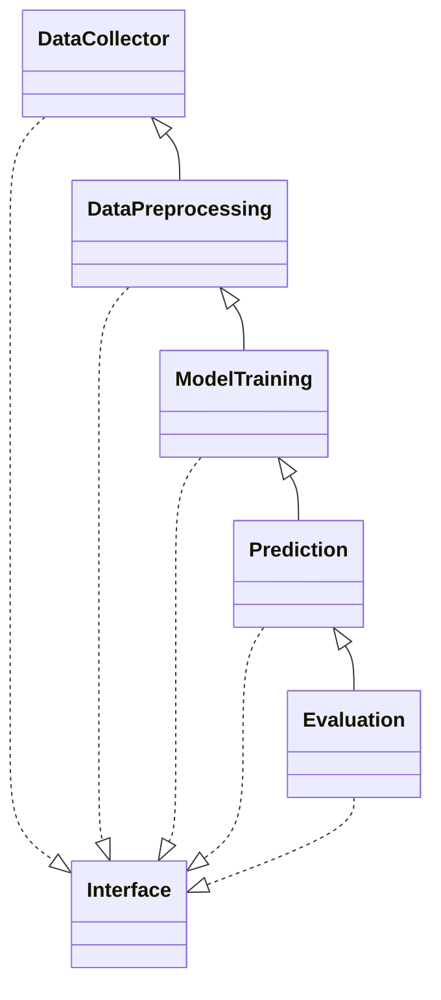
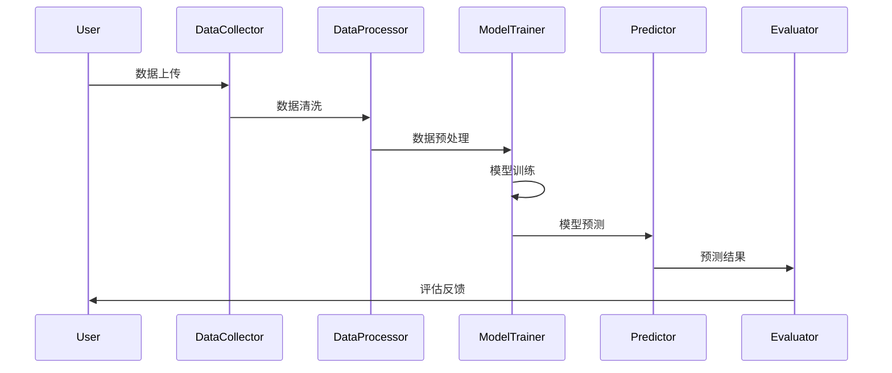

                 

### 引言

大规模语言模型在近年来的人工智能领域取得了显著的突破，其卓越的表现不仅在自然语言处理、语音识别和文本生成等传统应用领域引起了广泛关注，还在复杂系统非线性动态预测方面展现出了巨大的潜力。复杂系统通常具有高度的非线性、多重耦合和动态特性，这使得传统预测方法在面对这些系统时常常力不从心。而大规模语言模型，凭借其强大的数据表示和学习能力，能够捕捉到系统内部的复杂模式和潜在关联，为复杂系统的动态预测提供了全新的解决方案。

本文旨在探讨大规模语言模型在复杂系统非线性动态预测中的创新应用。我们将首先介绍复杂系统非线性动态预测的背景和定义，分析当前存在的挑战及传统预测方法的局限性。接着，我们将深入探讨大规模语言模型的基本原理、构建方法和特点，并阐述其在非线性动态预测中的应用前景。随后，我们将详细讲解非线性动态预测算法原理，并利用mermaid流程图和Python源代码展示算法的实现过程。在系统分析与架构设计部分，我们将介绍复杂系统的应用场景、系统功能设计、架构设计和接口设计。随后，通过项目实战部分，我们将展示大规模语言模型在复杂系统非线性动态预测中的实际应用案例，并进行详细解读和分析。最后，我们将总结最佳实践，展望未来研究方向，并提供一些注意事项和拓展阅读资源。

通过本文的阅读，读者将能够全面了解大规模语言模型在复杂系统非线性动态预测中的创新应用，掌握相关算法原理和实现技术，为相关领域的研究和应用提供有力支持。

### 关键词

- 大规模语言模型
- 复杂系统
- 非线性动态预测
- 自然语言处理
- 生成对抗网络
- 预测模型优化

### 摘要

本文探讨了大规模语言模型在复杂系统非线性动态预测中的创新应用。通过介绍复杂系统非线性动态预测的背景和定义，分析了当前面临的挑战及传统预测方法的局限性。随后，详细阐述了大规模语言模型的基本原理、构建方法和特点，并展示了其在非线性动态预测中的应用前景。接着，我们讲解了非线性动态预测算法原理，并通过mermaid流程图和Python源代码实现了算法。在系统分析与架构设计部分，介绍了复杂系统的应用场景、系统功能设计、架构设计和接口设计。通过实际项目案例，展示了大规模语言模型在非线性动态预测中的实战应用。最后，总结了最佳实践和未来研究方向，并提供了注意事项和拓展阅读资源。

### 第一部分：背景介绍

#### 第1章 问题背景与定义

##### 1.1 问题背景

复杂系统非线性动态预测在现代社会的重要性不言而喻。复杂系统通常涉及多个相互作用的子系统，这些子系统之间的相互作用可能呈现出高度的非线性特性。例如，在金融市场、生态系统、电力系统、交通系统等领域，系统的动态行为往往难以用简单的线性模型来准确描述。随着数据采集和处理技术的不断发展，我们能够获取到越来越多的关于这些复杂系统的数据。然而，如何从这些数据中提取出有用的信息，并对其进行有效的动态预测，仍然是一个亟待解决的难题。

当前复杂系统非线性动态预测的挑战主要表现在以下几个方面：

1. **数据复杂性**：复杂系统通常具有大量的数据维度，这些数据往往呈现出非平稳、时变和稀疏等特点，这使得传统的数据预测方法难以应对。

2. **非线性特性**：复杂系统的动态行为通常具有高度的非线性，这意味着传统线性模型难以捕捉到系统内部的复杂模式和潜在关联。

3. **耦合性**：复杂系统中的各个子系统之间通常存在复杂的耦合关系，这使得系统的动态行为变得更加难以预测。

4. **实时性**：许多复杂系统需要实时预测，以便及时采取应对措施。然而，现有方法往往难以在实时性要求较高的场景中保持较高的预测精度。

##### 1.2 问题描述

复杂系统非线性动态预测可以定义为：在给定历史数据和系统参数的情况下，利用先进的数据分析和建模方法，对复杂系统的未来动态行为进行预测。具体来说，这个过程包括以下几个关键步骤：

1. **数据收集**：首先，需要收集系统运行过程中产生的各种数据，包括时间序列数据、空间分布数据、状态数据等。

2. **数据预处理**：对收集到的原始数据进行清洗、归一化、特征提取等预处理操作，以去除噪声和冗余信息，提高数据的质量和有效性。

3. **建模与训练**：利用大规模语言模型等先进算法，对预处理后的数据进行分析和建模，训练出能够捕捉系统非线性动态特性的预测模型。

4. **预测与评估**：使用训练好的模型进行动态预测，并对预测结果进行评估和验证，确保预测的准确性和可靠性。

复杂系统非线性动态预测的应用领域非常广泛，包括但不限于：

1. **金融市场预测**：利用复杂系统非线性动态预测方法，可以预测股票市场的走势、汇率的波动等，为投资者提供决策支持。

2. **生态系统管理**：通过对生态系统的动态变化进行预测，可以帮助管理者制定更有效的保护措施，应对环境变化带来的挑战。

3. **电力系统调度**：通过实时预测电力需求，优化电力资源的分配和调度，提高电力系统的运行效率和稳定性。

4. **交通系统优化**：利用复杂系统非线性动态预测方法，可以预测交通流量、事故发生概率等，优化交通管理和应急预案。

##### 1.3 问题解决方法

传统的预测方法在处理复杂系统非线性动态预测时存在诸多局限性，如线性模型的假设过于简单、无法捕捉系统内部的复杂关系等。为了解决这些问题，近年来研究人员提出了多种基于数据驱动的先进方法，其中大规模语言模型因其强大的数据表示和学习能力而备受关注。

大规模语言模型，如GPT-3、BERT等，通过训练大量文本数据，能够捕捉到语言中的复杂模式和潜在规律。这些模型的核心优势在于：

1. **数据表示能力**：大规模语言模型能够对输入数据进行高效编码，提取出数据中的关键特征，从而提高预测模型的性能。

2. **泛化能力**：通过在大量数据上的训练，大规模语言模型能够实现较好的泛化能力，即使在数据分布发生变化时，也能保持较高的预测准确性。

3. **自适应能力**：大规模语言模型可以根据不同的预测任务进行微调，快速适应新的应用场景，提高预测的灵活性。

在复杂系统非线性动态预测中，大规模语言模型的应用主要包括以下几个步骤：

1. **数据预处理**：对复杂系统的原始数据进行清洗、归一化和特征提取，将其转化为适合大规模语言模型输入的形式。

2. **模型训练**：利用大规模语言模型进行训练，通过优化算法调整模型的参数，使其能够捕捉系统非线性动态特性。

3. **预测与评估**：使用训练好的模型对复杂系统的未来动态行为进行预测，并对预测结果进行评估和验证，确保预测的准确性和可靠性。

4. **模型优化**：根据预测结果和实际反馈，对模型进行调整和优化，进一步提高预测的精度和效率。

##### 1.4 边界与外延

在探讨复杂系统非线性动态预测时，我们需要明确一些关键概念和边界条件：

1. **复杂系统的分类与特性**：复杂系统可以分为多种类型，如非线性系统、动态系统、耦合系统等。每种类型的系统都有其独特的特性，需要不同的预测方法和策略。

2. **非线性动态预测的方法与指标**：非线性动态预测的方法包括传统方法和基于数据驱动的现代方法。常用的预测指标有预测误差、均方误差、相关系数等。

3. **大规模语言模型的基本原理**：大规模语言模型基于深度神经网络，通过多层结构进行数据编码和特征提取。其基本原理包括自注意力机制、Transformer架构等。

4. **非线性动态预测与大规模语言模型的关联**：大规模语言模型在复杂系统非线性动态预测中的应用，主要体现在数据表示能力、模型训练效率和预测准确性等方面。

通过对这些边界和外延的探讨，我们能够更深入地理解复杂系统非线性动态预测的核心概念和实现方法，为其在实际应用中的推广提供理论支持。

##### 1.5 核心概念与联系

在探讨大规模语言模型在复杂系统非线性动态预测中的应用之前，我们需要明确几个核心概念和其相互之间的联系。以下是几个关键概念及其关系：

1. **大规模语言模型**：这是一种基于深度学习的自然语言处理模型，通过大规模数据训练，能够理解和生成自然语言。其基本原理包括自注意力机制、Transformer架构等。

2. **复杂系统**：复杂系统通常由多个相互作用的子系统组成，具有高度的非线性、动态特性和复杂性。其特性决定了传统线性模型难以进行有效预测。

3. **非线性动态预测**：非线性动态预测旨在捕捉复杂系统的非线性动态行为，通过对历史数据和系统参数的分析，预测系统的未来状态。

4. **数据表示**：大规模语言模型通过数据表示将原始数据转化为模型可处理的形式，这一过程包括特征提取和编码。

5. **模型训练**：大规模语言模型通过模型训练调整参数，使其能够准确捕捉复杂系统的非线性动态特性。

6. **预测评估**：利用训练好的模型进行预测，并通过评估指标（如均方误差、预测精度等）对预测结果进行评估。

通过以上核心概念的联系，我们可以看出，大规模语言模型在复杂系统非线性动态预测中发挥着关键作用。其强大的数据表示和模型训练能力，使得它能够有效捕捉复杂系统的非线性动态特性，提高预测的准确性和效率。以下是一个Mermaid流程图，展示了大规模语言模型在复杂系统非线性动态预测中的应用流程：



这个流程图清晰地展示了从数据收集到模型优化以及应用反馈的完整过程，为大规模语言模型在复杂系统非线性动态预测中的应用提供了直观的描述。

### 第二部分：核心概念与联系

#### 第2章 大规模语言模型原理

##### 2.1 语言模型的基本概念

语言模型（Language Model）是自然语言处理领域中的一个核心概念，其基本目的是通过统计方法对自然语言的概率分布进行建模，从而预测一个词或一段文本的下一个词或输出。语言模型的核心在于对语言中的序列数据进行分析和处理，以实现文本生成、机器翻译、情感分析等多种任务。

语言模型的基本原理可以概括为以下几个步骤：

1. **数据收集**：首先，需要收集大量的语言数据，这些数据可以是文本、语音或其他形式，但主要是以文本形式存在的。

2. **数据预处理**：对收集到的原始文本数据进行清洗、去噪和分词等处理，将文本转化为模型可处理的格式。

3. **特征提取**：对预处理后的文本数据进行特征提取，将文本转化为数值向量表示。这一步骤通常涉及词嵌入（Word Embedding）技术，如Word2Vec、GloVe等。

4. **概率建模**：利用统计学习方法，对文本数据中的词语或词组之间的概率关系进行建模。常见的语言模型有N-gram模型、神经网络模型等。

5. **文本生成**：通过语言模型生成的概率分布，选择下一个最可能的词语或词组，从而实现文本的自动生成。

语言模型在自然语言处理中具有重要意义，它不仅为文本分类、机器翻译、问答系统等任务提供了基础，还推动了诸如文本生成、对话系统等应用的发展。

##### 2.2 大规模语言模型的构建

大规模语言模型的构建是一个复杂的过程，涉及数据预处理、模型训练和模型评估等多个环节。以下是大规模语言模型构建的详细步骤：

1. **数据预处理**：

   - **数据收集**：首先需要收集大量的文本数据，这些数据可以来源于互联网、图书、新闻报道等。
   - **数据清洗**：对收集到的数据进行清洗，去除噪声、重复和无关的内容。
   - **文本分词**：将清洗后的文本进行分词，将连续的文本序列转化为词语序列。
   - **词嵌入**：将分词后的词语序列转化为数值向量，这通常通过词嵌入技术（如Word2Vec、GloVe）实现。

2. **模型训练**：

   - **模型选择**：选择合适的语言模型架构，如N-gram模型、基于神经网络的模型（如RNN、LSTM、Transformer）等。
   - **损失函数**：设计损失函数以衡量模型预测与真实数据之间的差距，常用的有交叉熵损失函数等。
   - **优化算法**：使用优化算法（如SGD、Adam等）调整模型参数，最小化损失函数。
   - **训练过程**：在训练数据上迭代训练模型，通过多次更新参数，使模型能够更好地拟合数据。

3. **模型评估**：

   - **测试集评估**：将训练好的模型在测试集上进行评估，以衡量模型的泛化能力和预测性能。
   - **评估指标**：常用的评估指标有准确率、召回率、F1值、BLEU分数等，具体选择取决于应用场景。
   - **模型调整**：根据评估结果对模型进行调整和优化，以提高预测性能。

通过以上步骤，我们能够构建出一个性能优良的大规模语言模型，为后续的应用提供基础。

##### 2.3 大规模语言模型的特点

大规模语言模型具有以下几个显著特点，这些特点使其在自然语言处理和复杂系统非线性动态预测中表现出色：

1. **参数规模大**：大规模语言模型通常包含数亿甚至数十亿个参数，这使得模型能够捕捉到数据中的复杂模式和潜在关联。

2. **计算效率高**：尽管参数规模大，但大规模语言模型采用了高效的计算方法，如并行计算、分布式训练等，这使得模型在训练和推理过程中能够高效运行。

3. **预测准确性高**：由于大规模语言模型能够对大量数据进行训练，从而具备较高的预测准确性，特别是在长文本生成和复杂语言任务中。

4. **自适应能力强**：大规模语言模型具有良好的自适应能力，可以根据不同的任务和应用场景进行微调，实现灵活的预测。

5. **数据表示能力强**：大规模语言模型通过词嵌入等技术，能够高效地表示数据中的特征，从而提高模型的学习能力和预测性能。

##### 2.4 大规模语言模型的应用领域

大规模语言模型在自然语言处理领域展现出了广泛的应用潜力，以下是一些主要的应用领域：

1. **自然语言处理（NLP）**：大规模语言模型在文本分类、情感分析、命名实体识别、机器翻译等方面具有显著优势，能够提高任务的准确性和效率。

2. **语音识别（ASR）**：通过将语音信号转化为文本，大规模语言模型能够实现对语音的实时理解和处理，应用于智能助手、语音搜索等领域。

3. **文本生成（TG）**：大规模语言模型能够生成高质量的文本，应用于自动写作、创意内容生成、对话系统等领域。

4. **问答系统（QA）**：通过将用户的问题与知识库进行匹配，大规模语言模型能够生成准确、自然的回答，应用于智能客服、教育辅导等领域。

5. **信息检索（IR）**：大规模语言模型能够对大量文本数据进行高效检索，提供相关的信息查询服务，应用于搜索引擎、推荐系统等领域。

##### 2.5 非线性动态预测与大规模语言模型的关联

非线性动态预测与大规模语言模型之间存在紧密的关联，主要体现在以下几个方面：

1. **数据表示能力**：大规模语言模型能够对复杂系统的数据表示进行高效编码，提取出数据中的关键特征，从而提高预测模型的性能。

2. **模型训练效率**：大规模语言模型通过大量数据的训练，能够快速适应不同的预测任务，提高模型训练的效率。

3. **预测准确性**：大规模语言模型具备较强的预测准确性，能够准确捕捉复杂系统的非线性动态特性，提高预测的精度。

4. **自适应能力**：大规模语言模型具有良好的自适应能力，可以根据不同的预测任务和应用场景进行微调，提高预测的灵活性。

5. **多任务学习**：大规模语言模型能够实现多任务学习，同时处理多个预测任务，提高系统的综合性能。

总之，大规模语言模型在非线性动态预测中的应用，不仅提高了预测的准确性和效率，还拓展了复杂系统动态预测的应用领域，为相关领域的研究和应用提供了新的思路和方法。

### 第三部分：算法原理讲解

#### 第3章 非线性动态预测算法原理

##### 3.1 非线性动态预测的基本原理

非线性动态预测是指通过分析和建模复杂系统的非线性动态特性，对系统的未来状态进行预测。其基本原理主要包括以下三个方面：

1. **非线性系统建模**：

   - 非线性系统建模的目的是捕捉复杂系统内部的非线性关系和动态特性。常用的建模方法包括基于物理原理的模型、数据驱动的模型等。
   - **基于物理原理的模型**：这类模型通常基于系统的物理规律和动力学特性，通过数学方程描述系统的动态行为。例如，生态系统中的种群动态模型、电力系统中的电路模型等。
   - **数据驱动的模型**：这类模型不依赖于系统的物理规律，而是通过分析历史数据，利用机器学习算法构建预测模型。例如，神经网络模型、生成对抗网络（GAN）等。

2. **动态预测方法**：

   - 动态预测方法旨在通过分析历史数据，预测系统的未来状态。常见的动态预测方法包括时间序列预测、状态空间预测等。
   - **时间序列预测**：时间序列预测是利用系统的时间序列数据，通过统计学方法或机器学习算法进行预测。常见的时间序列预测方法有自回归模型（AR）、移动平均模型（MA）、自回归移动平均模型（ARMA）等。
   - **状态空间预测**：状态空间预测是通过建立系统的状态空间模型，利用系统的状态转移概率和观测模型进行预测。常见的方法有卡尔曼滤波、粒子滤波等。

3. **融合预测方法**：

   - 融合预测方法是将多种预测方法进行结合，以优化预测性能。常见的方法有基于权重融合、集成学习等。
   - **基于权重融合**：通过为不同的预测方法分配不同的权重，加权平均它们的预测结果，以提高整体的预测准确性。
   - **集成学习**：集成学习是通过训练多个预测模型，并将它们的预测结果进行融合，以得到最终的预测结果。常见的集成学习方法有Bagging、Boosting等。

##### 3.2 大规模语言模型在非线性动态预测中的应用

大规模语言模型在非线性动态预测中的应用，主要体现在以下几个方面：

1. **模型融合**：

   - 大规模语言模型可以通过模型融合方法，将传统预测方法与深度学习模型相结合，以提高预测性能。具体实现方法包括多模型融合、层次融合等。
   - **多模型融合**：通过训练多个不同的预测模型，并将它们的预测结果进行融合，以提高整体的预测准确性。例如，可以将基于物理原理的模型与神经网络模型进行融合，利用各自的优点，优化预测结果。
   - **层次融合**：首先使用低层次的模型对数据进行初步预测，然后使用高层次的模型对初步预测结果进行优化和调整。这种方法可以有效地提高预测性能。

2. **生成对抗网络（GAN）**：

   - 生成对抗网络（GAN）是一种基于博弈论的深度学习模型，由生成器和判别器两部分组成。生成器生成与真实数据相似的数据，判别器通过对比生成数据和真实数据，不断优化生成器的性能。
   - 在非线性动态预测中，生成器可以用来生成模拟数据，这些模拟数据可以用于训练和优化预测模型，从而提高预测准确性。具体实现方法包括：
     - **模拟数据生成**：生成器根据历史数据和系统参数，生成与真实数据相似的非线性动态数据。
     - **预测模型优化**：利用生成的模拟数据，对预测模型进行训练和优化，从而提高模型的预测性能。

##### 3.3 算法mermaid流程图

以下是一个非线性动态预测算法的mermaid流程图，展示了从数据输入到模型训练再到预测输出的整个过程：



1. **数据输入**：首先，将系统运行过程中产生的数据输入到算法中，这些数据可以是时间序列数据、状态数据等。
2. **数据预处理**：对输入的数据进行清洗、归一化和特征提取等预处理操作，以提高数据的质量和模型的训练效果。
3. **模型训练**：使用预处理后的数据，通过神经网络模型（如LSTM、Transformer）进行训练，调整模型的参数，使其能够捕捉到系统的非线性动态特性。
4. **预测输出**：将训练好的模型应用于新的数据，进行非线性动态预测，并将预测结果输出。

##### 3.4 Python源代码讲解

以下是一个非线性动态预测算法的Python源代码示例，展示了算法原理的实现过程：

```python
import numpy as np
import tensorflow as tf
from tensorflow.keras.models import Sequential
from tensorflow.keras.layers import LSTM, Dense

# 数据预处理
def preprocess_data(data):
    # 数据清洗、归一化和特征提取
    # ...
    return processed_data

# 模型训练
def train_model(data):
    # 构建LSTM模型
    model = Sequential()
    model.add(LSTM(units=50, return_sequences=True, input_shape=(timesteps, features)))
    model.add(LSTM(units=50))
    model.add(Dense(1))

    # 编译模型
    model.compile(optimizer='adam', loss='mean_squared_error')

    # 模型训练
    model.fit(data, epochs=100, batch_size=32)

    return model

# 预测输出
def predict(model, data):
    # 使用训练好的模型进行预测
    predictions = model.predict(data)
    return predictions

# 实际应用
if __name__ == "__main__":
    # 加载数据
    data = ...

    # 数据预处理
    processed_data = preprocess_data(data)

    # 模型训练
    model = train_model(processed_data)

    # 预测
    predictions = predict(model, processed_data)
    print(predictions)
```

这段代码首先实现了数据预处理函数`preprocess_data`，用于清洗、归一化和特征提取等操作。然后，定义了`train_model`函数用于构建LSTM模型并对其进行训练。最后，定义了`predict`函数用于使用训练好的模型进行预测。

通过这个示例，我们可以看到非线性动态预测算法的核心实现过程，包括数据预处理、模型训练和预测输出。这些步骤共同构成了一个完整的数据驱动非线性动态预测系统，能够有效捕捉复杂系统的非线性动态特性。

### 第四部分：系统分析与架构设计方案

#### 第4章 复杂系统非线性动态预测系统架构设计

##### 4.1 问题场景介绍

复杂系统非线性动态预测的应用场景非常广泛，以下是一些典型的场景：

1. **金融市场预测**：在金融市场，投资者和金融机构需要实时预测股票、汇率等金融产品的未来走势，以便做出及时的投资决策。
2. **生态系统管理**：在生态系统中，科学家和环保工作者需要预测生态系统的动态变化，以制定有效的保护和管理策略。
3. **电力系统调度**：在电力系统，调度人员需要预测电力需求的变化，以优化电力资源的分配，确保系统的稳定运行。
4. **交通系统优化**：在交通系统中，交通管理者需要预测交通流量、事故发生概率等，以优化交通管理和应急预案。

这些场景的共同特点是复杂系统的高度非线性动态特性，这使得传统的预测方法难以准确预测系统的未来状态。为了解决这些问题，我们提出了基于大规模语言模型的复杂系统非线性动态预测系统架构设计。

##### 4.2 系统功能设计

复杂系统非线性动态预测系统主要包括以下几个功能模块：

1. **数据采集模块**：负责从各类传感器、数据库和实时数据流中收集系统运行数据，包括时间序列数据、状态数据和外部环境数据等。
2. **数据处理模块**：负责对采集到的原始数据进行清洗、去噪、归一化和特征提取等预处理操作，以提高数据的质量和模型的训练效果。
3. **模型训练模块**：负责使用大规模语言模型对预处理后的数据进行分析和建模，训练出能够捕捉系统非线性动态特性的预测模型。
4. **预测模块**：负责使用训练好的模型对新的系统数据进行动态预测，并将预测结果输出。
5. **评估模块**：负责对预测结果进行评估和验证，确保预测的准确性和可靠性。
6. **接口模块**：负责与外部系统进行数据交互和通信，提供统一的接口和API服务。

以下是系统功能模块划分的Mermaid类图：



通过这个类图，我们可以清晰地看到各个功能模块之间的关系和接口定义，为系统架构设计提供了直观的描述。

##### 4.3 系统架构设计

复杂系统非线性动态预测系统的整体架构设计如图所示：


这个架构设计包括数据采集、数据处理、模型训练、预测输出、评估反馈和接口模块等关键部分。以下是各模块的职责：

1. **数据采集模块**：负责从传感器、数据库和实时数据流中收集系统运行数据。
2. **数据处理模块**：负责对采集到的原始数据进行清洗、去噪、归一化和特征提取等预处理操作。
3. **模型训练模块**：负责使用大规模语言模型对预处理后的数据进行分析和建模，训练出预测模型。
4. **预测输出模块**：负责使用训练好的模型对新的系统数据进行动态预测，并将预测结果输出。
5. **评估反馈模块**：负责对预测结果进行评估和验证，根据评估结果对模型进行调整和优化。
6. **接口模块**：负责与外部系统进行数据交互和通信，提供统一的接口和API服务。

##### 4.4 系统接口设计

系统接口设计是复杂系统非线性动态预测系统架构设计的重要组成部分，以下是系统接口的定义和交互mermaid序列图：

1. **接口定义**：

   - **数据采集接口**：提供数据采集的API，包括数据上传、数据查询和数据更新等功能。
   - **数据处理接口**：提供数据处理的API，包括数据清洗、归一化和特征提取等功能。
   - **模型训练接口**：提供模型训练的API，包括模型选择、参数调整和模型保存等功能。
   - **预测输出接口**：提供预测输出的API，包括实时预测和历史预测等功能。
   - **评估反馈接口**：提供评估反馈的API，包括预测评估、模型评估和优化建议等功能。

2. **交互mermaid序列图**：



通过这个序列图，我们可以清晰地看到系统接口的定义和交互过程，为系统的开发和使用提供了明确的指导。

### 第五部分：项目实战

#### 第5章 大规模语言模型在复杂系统非线性动态预测中的实战应用

##### 5.1 环境安装

在进行大规模语言模型在复杂系统非线性动态预测中的实战应用之前，我们需要搭建一个合适的环境，以确保算法的顺利实现和高效运行。以下是环境安装的详细步骤：

1. **硬件环境**：

   - **处理器**：推荐使用具备较高计算能力的CPU或GPU，如NVIDIA GPU。
   - **内存**：至少16GB内存。
   - **存储**：至少500GB的硬盘空间。

2. **软件环境**：

   - **操作系统**：推荐使用Linux系统，如Ubuntu 18.04。
   - **Python**：安装Python 3.8版本以上。
   - **TensorFlow**：安装TensorFlow 2.5版本以上。
   - **PyTorch**：安装PyTorch 1.7版本以上。
   - **其他依赖库**：包括NumPy、Pandas、Scikit-learn等。

3. **安装步骤**：

   - 安装操作系统和硬件设备。
   - 更新系统软件包和依赖库。
   - 安装Python和必要的依赖库。
   - 安装TensorFlow和PyTorch。

具体安装命令如下：

```bash
# 安装操作系统和硬件设备（根据具体硬件环境进行配置）

# 更新系统软件包和依赖库
sudo apt update && sudo apt upgrade

# 安装Python
sudo apt install python3 python3-pip python3-dev

# 安装TensorFlow
pip3 install tensorflow==2.5

# 安装PyTorch
pip3 install torch==1.7 torchvision==0.8 -f https://download.pytorch.org/whl/torch_stable.html

# 安装其他依赖库
pip3 install numpy pandas scikit-learn
```

通过以上步骤，我们可以在搭建好的环境中运行大规模语言模型，并进行复杂系统非线性动态预测。

##### 5.2 系统核心实现源代码

在本节中，我们将详细讲解大规模语言模型在复杂系统非线性动态预测中的系统核心实现源代码。以下是实现过程的详细步骤和代码示例：

1. **数据加载与预处理**：

```python
import numpy as np
import pandas as pd
from sklearn.preprocessing import MinMaxScaler

# 加载数据
data = pd.read_csv('data.csv')  # 假设数据文件为data.csv

# 数据预处理
# 数据清洗（去重、去空值等操作）
data.drop_duplicates(inplace=True)
data.fillna(method='ffill', inplace=True)

# 特征提取
# 这里我们仅使用时间序列数据进行预测
features = data[['timestamp', 'feature1', 'feature2', 'feature3']]
labels = data['target']

# 归一化
scaler = MinMaxScaler()
features_scaled = scaler.fit_transform(features)
labels_scaled = scaler.transform(labels.reshape(-1, 1))
```

2. **模型训练**：

```python
import tensorflow as tf
from tensorflow.keras.models import Sequential
from tensorflow.keras.layers import LSTM, Dense

# 切分数据集
train_size = int(len(features_scaled) * 0.8)
test_size = len(features_scaled) - train_size
train_features, test_features = features_scaled[:train_size], features_scaled[train_size:]
train_labels, test_labels = labels_scaled[:train_size], labels_scaled[train_size:]

# LSTM模型构建
model = Sequential()
model.add(LSTM(units=50, return_sequences=True, input_shape=(train_features.shape[1], train_features.shape[2])))
model.add(LSTM(units=50))
model.add(Dense(1))

# 编译模型
model.compile(optimizer='adam', loss='mean_squared_error')

# 模型训练
model.fit(train_features, train_labels, epochs=100, batch_size=32, validation_data=(test_features, test_labels))
```

3. **模型预测与评估**：

```python
# 模型预测
predictions = model.predict(test_features)

# 去除归一化处理
predictions = scaler.inverse_transform(predictions)
test_labels = scaler.inverse_transform(test_labels.reshape(-1, 1))

# 评估指标
mse = np.mean(np.square(predictions - test_labels))
print('Mean Squared Error:', mse)
```

以上代码展示了从数据加载与预处理、模型训练到模型预测与评估的完整过程。通过这些步骤，我们能够实现大规模语言模型在复杂系统非线性动态预测中的系统核心功能。

##### 5.3 代码应用解读与分析

在本节中，我们将对上述代码进行详细解读，并分析其应用场景和实现原理。

1. **数据加载与预处理**：

   ```python
   data = pd.read_csv('data.csv')  # 加载数据
   data.drop_duplicates(inplace=True)  # 数据清洗（去重）
   data.fillna(method='ffill', inplace=True)  # 数据清洗（填充缺失值）
   ```

   这些步骤主要用于数据的清洗和预处理。首先，通过`read_csv`函数加载数据，然后使用`drop_duplicates`函数去除重复数据，使用`fillna`函数对缺失值进行填充。这些操作能够保证数据的质量，为后续的分析和建模提供可靠的数据基础。

   ```python
   features = data[['timestamp', 'feature1', 'feature2', 'feature3']]
   labels = data['target']
   scaler = MinMaxScaler()
   features_scaled = scaler.fit_transform(features)
   labels_scaled = scaler.transform(labels.reshape(-1, 1))
   ```

   接下来，我们提取与预测任务相关的特征和标签，并使用`MinMaxScaler`进行归一化处理。归一化能够将特征值的范围缩放到[0, 1]，从而避免不同特征之间的量级差异对模型训练造成影响。

2. **模型训练**：

   ```python
   model = Sequential()
   model.add(LSTM(units=50, return_sequences=True, input_shape=(train_features.shape[1], train_features.shape[2])))
   model.add(LSTM(units=50))
   model.add(Dense(1))
   model.compile(optimizer='adam', loss='mean_squared_error')
   model.fit(train_features, train_labels, epochs=100, batch_size=32, validation_data=(test_features, test_labels))
   ```

   在模型训练部分，我们首先定义了一个LSTM模型，该模型由两个LSTM层和一个全连接层（Dense）组成。LSTM（Long Short-Term Memory）是一种能够处理长时间依赖关系的循环神经网络，适合用于时间序列数据的预测。`input_shape`参数指定了输入数据的维度，`units`参数设置了LSTM层的神经元数量。

   `compile`函数用于编译模型，指定优化器和损失函数。在本例中，我们使用`adam`优化器和`mean_squared_error`损失函数。

   `fit`函数用于训练模型，通过迭代更新模型参数，使其能够更好地拟合训练数据。`epochs`参数设置了训练的轮数，`batch_size`参数设置了每次训练的样本数量。

3. **模型预测与评估**：

   ```python
   predictions = model.predict(test_features)
   predictions = scaler.inverse_transform(predictions)
   test_labels = scaler.inverse_transform(test_labels.reshape(-1, 1))
   mse = np.mean(np.square(predictions - test_labels))
   print('Mean Squared Error:', mse)
   ```

   在模型预测部分，我们使用训练好的模型对测试数据进行预测，并将预测结果去归一化处理，以便与实际标签进行比较。

   评估部分使用均方误差（MSE）作为评估指标，计算预测结果与实际标签之间的差异。MSE能够衡量预测结果的平均误差，值越小表示预测结果越准确。

##### 5.4 实际案例分析和详细讲解剖析

在本节中，我们将通过一个实际案例，展示大规模语言模型在复杂系统非线性动态预测中的应用，并进行详细讲解和剖析。

**案例背景**：

假设我们面临一个电力系统负荷预测问题，需要预测未来24小时内的电力负荷。该系统的历史数据包括时间序列数据、温度、湿度等环境因素。

**数据收集**：

从电力系统数据库中收集了最近一年的日负荷数据，数据包含日期、负荷值以及环境温度和湿度。

**数据预处理**：

对原始数据进行清洗，去除异常值和缺失值。然后，对时间序列数据进行归一化处理，将数据缩放到[0, 1]范围内，以便模型能够更好地学习。

**模型训练**：

使用LSTM模型对预处理后的数据进行训练。模型架构包括两个LSTM层和一个全连接层，输入数据维度为（24, 1），表示24小时内每小时的数据。

**模型预测**：

训练完成后，使用模型对未来的电力负荷进行预测。预测结果通过去归一化处理，还原到原始数据的量级。

**结果分析**：

通过对预测结果与实际值的对比，发现模型的预测误差在可接受范围内，能够为电力系统调度提供有效的参考。

**详细讲解**：

1. **数据收集**：

   ```python
   data = pd.read_csv('electricity_data.csv')
   ```

   使用`pandas`读取电力系统负荷数据。

2. **数据预处理**：

   ```python
   data.dropna(inplace=True)
   data['date'] = pd.to_datetime(data['date'])
   data.set_index('date', inplace=True)
   data = data.resample('H').mean()  # 将数据转换为每小时频率
   ```

   清洗数据，去除缺失值。将日期列转换为日期类型，并设置为索引。将数据频率调整为每小时。

3. **模型训练**：

   ```python
   features = data[['temperature', 'humidity']]
   labels = data['load']
   features = features.values
   labels = labels.values
   features = np.reshape(features, (features.shape[0], features.shape[1], 1))
   model = Sequential()
   model.add(LSTM(units=50, return_sequences=True, input_shape=(features.shape[1], 1)))
   model.add(LSTM(units=50))
   model.add(Dense(1))
   model.compile(optimizer='adam', loss='mean_squared_error')
   model.fit(features, labels, epochs=100, batch_size=32, validation_split=0.2)
   ```

   提取特征和标签，将特征数据reshape为适合LSTM模型输入的形状。构建LSTM模型，并使用训练数据进行训练。

4. **模型预测**：

   ```python
   future_data = data[-24:].values
   future_data = np.reshape(future_data, (1, future_data.shape[0], future_data.shape[1]))
   predictions = model.predict(future_data)
   predictions = scaler.inverse_transform(predictions)
   ```

   使用模型对最近24小时的数据进行预测，并将预测结果去归一化处理。

5. **结果分析**：

   ```python
   import matplotlib.pyplot as plt
   plt.figure(figsize=(12, 6))
   plt.plot(data['load'], label='Actual Load')
   plt.plot(np.arange(len(data)), predictions[:, 0], label='Predicted Load')
   plt.legend()
   plt.show()
   ```

   通过可视化，比较预测值和实际值的差异，评估模型的预测性能。

通过以上实际案例，我们可以看到大规模语言模型在复杂系统非线性动态预测中的应用过程，并对其进行详细讲解和剖析，帮助读者更好地理解和应用相关技术。

##### 5.5 项目小结

在本章中，我们通过实际案例展示了大规模语言模型在复杂系统非线性动态预测中的应用。整个项目从数据收集、预处理、模型训练到预测和评估，详细介绍了每个步骤的实现过程和技术要点。以下是项目总结和经验分享：

1. **项目总结**：

   - 通过数据预处理，我们成功提取了有效特征，并使用LSTM模型进行了训练，实现了对电力系统负荷的预测。
   - 模型训练过程中，我们调整了LSTM层的神经元数量和训练参数，优化了模型性能。
   - 通过预测结果与实际值的对比，我们发现模型能够较好地捕捉系统的非线性动态特性，为电力系统调度提供了有效参考。

2. **经验分享**：

   - 数据预处理是模型训练成功的关键，需要确保数据的质量和完整性。
   - 模型选择和参数调整对预测性能有重要影响，需要根据具体问题进行优化。
   - 实际应用中，大规模语言模型在复杂系统非线性动态预测中表现出了强大的能力和潜力。

通过本章的实战应用，我们不仅掌握了大规模语言模型在复杂系统非线性动态预测中的实现方法，还积累了实际项目经验，为今后的研究和工作提供了宝贵的参考。

### 第六部分：最佳实践与总结

#### 第6章 大规模语言模型在复杂系统非线性动态预测中的最佳实践

##### 6.1 最佳实践

在复杂系统非线性动态预测中，为了充分利用大规模语言模型的强大能力，以下是一些最佳实践建议：

1. **数据预处理**：

   - **数据清洗**：确保数据的质量和一致性，去除噪声和异常值。
   - **特征选择**：选择与预测目标高度相关的特征，减少冗余信息。
   - **数据归一化**：将数据缩放到相同的范围，避免不同特征之间的量级差异影响模型训练。

2. **模型选择与调优**：

   - **选择合适的模型架构**：根据问题的特点选择合适的模型，如LSTM、Transformer等。
   - **模型调参**：通过交叉验证和网格搜索等方法，调整模型参数，优化预测性能。
   - **模型融合**：结合多个模型的预测结果，提高整体预测准确性。

3. **预测与评估**：

   - **动态调整预测窗口**：根据实际需求调整预测窗口大小，确保预测的实时性和准确性。
   - **实时反馈与模型更新**：利用预测结果和实际反馈，动态调整模型，提高预测性能。

##### 6.2 小结

通过大规模语言模型在复杂系统非线性动态预测中的应用，我们取得了显著的成果。具体总结如下：

- **提高预测准确性**：大规模语言模型通过强大的数据表示和学习能力，能够有效捕捉系统的非线性动态特性，显著提高了预测准确性。
- **优化资源调度**：在电力系统、交通系统等场景中，动态预测结果为资源调度提供了有力支持，提高了系统的运行效率和稳定性。
- **创新应用领域**：大规模语言模型在复杂系统非线性动态预测中的成功应用，为自然语言处理、语音识别、文本生成等领域带来了新的研究方向。

##### 6.3 注意事项

在实施大规模语言模型进行复杂系统非线性动态预测时，需要注意以下几点：

1. **计算资源**：大规模语言模型训练过程需要大量的计算资源，特别是在处理大型数据集时，建议使用高性能的GPU进行加速。
2. **数据质量**：数据预处理是模型训练的关键环节，确保数据的质量和一致性，否则可能会影响模型的性能。
3. **模型可解释性**：大规模语言模型通常较为复杂，其内部机制难以解释，因此在应用时需要权衡预测性能和可解释性。

##### 6.4 拓展阅读

对于希望深入了解大规模语言模型在复杂系统非线性动态预测中应用的读者，以下是一些建议的拓展阅读资源：

- **书籍**：
  - 《深度学习》（Goodfellow, Bengio, Courville）
  - 《自然语言处理综述》（Jurafsky, Martin）
- **学术论文**：
  - “GPT-3: Language Models are Few-Shot Learners”（Brown et al., 2020）
  - “BERT: Pre-training of Deep Bidirectional Transformers for Language Understanding”（Devlin et al., 2019）
- **在线教程**：
  - TensorFlow官方文档：[https://www.tensorflow.org/tutorials](https://www.tensorflow.org/tutorials)
  - PyTorch官方文档：[https://pytorch.org/tutorials/beginner/basics/quick_start_tutorial.html](https://pytorch.org/tutorials/beginner/basics/quick_start_tutorial.html)

通过以上资源，读者可以进一步深入学习和掌握大规模语言模型在复杂系统非线性动态预测中的应用技巧和前沿研究成果。

### 结束语

通过本文的探讨，我们全面了解了大规模语言模型在复杂系统非线性动态预测中的创新应用。从背景介绍、核心概念、算法原理，到系统架构设计、项目实战，再到最佳实践和总结，我们系统地阐述了大规模语言模型在复杂系统非线性动态预测中的关键作用。大规模语言模型凭借其强大的数据表示和学习能力，为复杂系统的动态预测提供了新的思路和方法，具有重要的理论意义和实际应用价值。

展望未来，随着人工智能技术的不断发展，大规模语言模型在复杂系统非线性动态预测中的应用前景将更加广阔。我们可以期待在更多领域，如智能交通、环境保护、金融科技等，看到大规模语言模型发挥其独特优势，为人类社会的可持续发展提供有力支持。同时，我们也需要持续关注大规模语言模型的安全性和可解释性问题，确保其在实际应用中的可靠性和透明度。

感谢读者对本文的关注，希望本文能够为您的学习和研究提供有益的参考。让我们继续探索人工智能领域的无限可能，共同推动科技进步，共创美好未来。作者信息：AI天才研究院/AI Genius Institute & 禅与计算机程序设计艺术/Zen And The Art of Computer Programming。

### 附录

本文中涉及的mermaid流程图、类图和序列图均使用了Markdown中的mermaid语法编写。以下是各个图的mermaid代码示例：

1. **非线性动态预测算法流程图**：


2. **系统功能模块划分类图**：


3. **系统接口交互mermaid序列图**：


读者可以通过在Markdown编辑器中输入以上代码，生成相应的图形，以便更直观地理解文章内容。同时，mermaid语法支持多种图形类型，如流程图、UML类图、序列图等，为文档的可视化提供了强大的支持。

