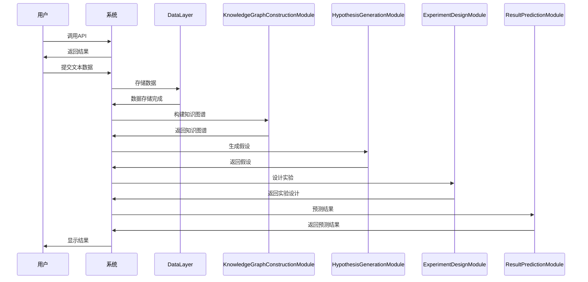
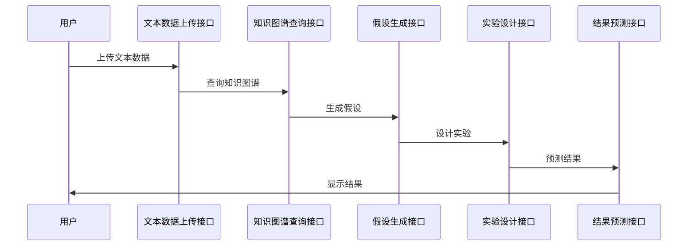
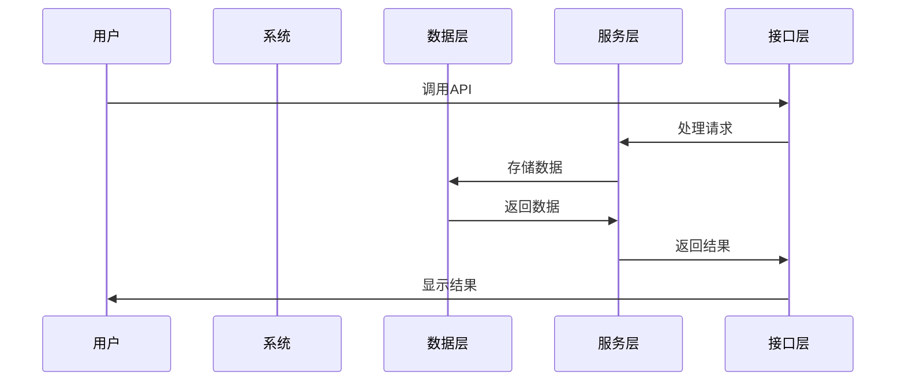

                 


### 第1章 引言

#### 1.1 问题背景

在科学发现的旅程中，研究人员面临着大量的数据、复杂的问题和繁琐的任务。传统的科学方法，尽管在过去取得了显著的成果，但在面对现代科学问题的复杂性和规模时，显得力不从心。因此，新兴的人工智能技术，特别是大规模语言模型，逐渐成为科学发现领域的一个强有力的工具。

**大规模语言模型的发展历程：**

大规模语言模型的发展可以追溯到20世纪80年代的统计语言模型。这些早期的模型如N-gram模型，通过统计相邻单词出现的频率来预测下一个单词。随着计算能力的提升和深度学习技术的发展，20世纪90年代后，基于神经网络的语言模型如HMM（隐马尔可夫模型）和RNN（循环神经网络）逐渐取代了传统的统计模型。

进入21世纪，随着计算能力的飞速提升和海量数据资源的获取，深度学习模型如LSTM（长短期记忆网络）和Transformer模型（如BERT、GPT）应运而生，这些模型在自然语言处理领域取得了突破性的进展。Transformer模型的出现，尤其是其自注意力机制（Self-Attention Mechanism），使得模型能够处理更长的序列，捕捉更复杂的上下文关系。

**语言模型在科学发现中的潜在作用：**

语言模型在科学发现中的应用潜力巨大。首先，它们可以用于文本数据的处理和分析，如文献摘要、文本挖掘、科学论文自动生成等。这些任务可以帮助科学家快速筛选和获取相关信息，提高研究效率。

其次，语言模型可以辅助科学假设的提出和验证。通过分析大量的科学文献和实验数据，语言模型可以帮助研究人员识别出潜在的科学问题，提出新的假设，甚至预测实验结果。

此外，语言模型还可以用于科学知识的组织和整合。通过学习大量的科学文献和资料，语言模型可以构建出庞大的知识图谱，为科学家提供丰富的背景知识和相关资源。

**书籍的目标与结构：**

本书旨在探讨大规模语言模型在科学发现任务中的应用，通过系统性地介绍语言模型的基本原理、算法、数学模型、系统架构设计、项目实战等，帮助读者深入理解语言模型在科学发现中的重要作用。

本书结构如下：

- **第1章：引言**：介绍问题背景、语言模型的发展历程以及在科学发现中的潜在作用。
- **第2章：核心概念与联系**：详细阐述语言模型的核心概念、应用场景和科学发现的常用方法与技术。
- **第3章：算法原理讲解**：讲解语言模型的算法原理，包括数学模型和Python源代码示例。
- **第4章：数学模型和数学公式**：深入讲解语言模型的数学模型和公式。
- **第5章：系统分析与架构设计**：介绍系统分析与架构设计的相关内容。
- **第6章：项目实战**：通过一个具体项目，展示语言模型在科学发现中的应用。
- **第7章：最佳实践与注意事项**：总结最佳实践和注意事项。

通过本书的阅读，读者将能够掌握大规模语言模型在科学发现任务中的应用，为未来的科学研究提供有力的技术支持。

#### 1.2 问题定义

**科学发现的定义：**

科学发现是指通过科学研究和实验验证，揭示自然界中尚未被认识的现象、规律或机制的过程。科学发现通常涉及对大量数据的收集、分析和解释，以及对现有理论的挑战和验证。

**语言模型的定义与属性：**

语言模型是一种用于预测自然语言序列的统计模型。它的主要任务是学习语言中的统计规律，并基于这些规律生成或预测新的文本。语言模型的关键属性包括：

- **上下文感知能力**：语言模型能够理解并处理上下文信息，预测下一个单词或句子。
- **生成能力**：语言模型可以生成符合语言统计规律的文本。
- **自适应能力**：语言模型能够根据不同的数据集和任务需求进行自适应调整。

**大规模语言模型在科学发现任务中的问题：**

尽管大规模语言模型在科学发现中具有巨大的潜力，但在实际应用中仍面临一些挑战：

1. **数据质量与多样性**：科学发现的文本数据通常具有高复杂性和多样性，这对语言模型的训练和效果提出了较高要求。
2. **模型解释性**：科学研究的成果需要具备高度的准确性和可解释性，而现有的语言模型往往缺乏透明性和解释能力。
3. **资源消耗**：大规模语言模型的训练和推理过程需要大量的计算资源和时间，这在一些资源受限的环境中可能成为瓶颈。
4. **数据隐私**：科学研究的文本数据可能包含敏感信息，如何确保数据隐私是另一个重要问题。

**边界与外延：**

大规模语言模型在科学发现中的应用边界和范围主要包括以下几个方面：

- **文本数据处理**：包括文献摘要、文本挖掘、科学论文自动生成等。
- **假设生成与验证**：通过分析大量文献和实验数据，提出新的科学假设并进行验证。
- **知识组织与整合**：构建科学知识图谱，为科学家提供丰富的背景知识和相关资源。

此外，大规模语言模型在科学发现中的应用也具有一定的局限性，如对特定领域知识的依赖性、对非结构化数据的处理能力等，这些都需要在应用过程中加以考虑。

### 第2章 核心概念与联系

#### 2.1 核心概念

**语言模型的基本原理：**

语言模型是一种用于预测自然语言序列的算法，其核心任务是学习自然语言中的统计规律，并根据这些规律生成或预测新的文本。语言模型通常基于统计方法或机器学习方法，如N-gram模型、神经网络模型等。

**科学发现的常用方法与技术：**

科学发现通常涉及以下几种方法和技术：

1. **实验设计**：通过设计实验来验证科学假设。
2. **数据收集**：收集与研究对象相关的数据，如实验数据、文献数据等。
3. **数据分析**：利用统计方法和机器学习方法对数据进行处理和分析。
4. **假设生成**：通过分析数据和现有理论，提出新的科学假设。
5. **假设验证**：通过实验或数据分析验证科学假设的正确性。

#### 2.2 概念属性特征对比表格

| 概念          | 特征             | 说明                                                         |
| ------------- | ---------------- | ------------------------------------------------------------ |
| 语言模型      | 上下文感知      | 能够理解并处理上下文信息，预测下一个单词或句子               |
| 科学发现      | 实验设计        | 通过实验验证科学假设                                       |
| 数据收集      | 数据多样性      | 收集与研究对象相关的多种类型数据                            |
| 数据分析      | 统计方法        | 利用统计方法对数据进行处理和分析                           |
| 假设生成与验证 | 理论挑战与验证  | 提出新的科学假设并进行验证                                 |

#### 2.3 ER实体关系图架构

下面是一个ER实体关系图的示例，用于表示语言模型在科学发现中的关键实体和关系。

```mermaid
erDiagram
  CLINICAL_PATIENT ||--|{ TREATMENT } : receives
  TREATMENT ||--|{ TREATMENT_EFFECT } : observed
  TREATMENT ||--|{ DRUG } : uses
  DRUG ||--|{ DRUG_CLASS } : belongs_to
  DRUG ||--|{ DRUG_INGREDIENT } : has
  DRUG_INGREDIENT ||--|{ INGREDIENT_CLASS } : belongs_to
  TREATMENT_EFFECT ||--|{ ADVERSE_EVENT } : has
  TREATMENT_EFFECT ||--|{ OUTCOME } : measures
  TREATMENT_RECIPE ||--|{ TREATMENT } : uses
  TREATMENT_RECIPE ||--|{ DRUG_ADMINISTRATION } : has
  DRUG_ADMINISTRATION ||--|{ DRUG_EXPOSURE } : measures
  DRUG_EXPOSURE ||--|{ DRUG_SIMULATION } : generates
  DRUG_SIMULATION ||--|{ PHARMACOKINETICS } : simulates
  DRUG_SIMULATION ||--|{ DRUG_DYNAMICS } : simulates
```

这个ER图展示了在医学研究中，患者、治疗、药物、不良反应、结果等实体及其相互关系。类似的关系图也可以用于表示语言模型在科学发现任务中的应用场景。

### 第3章 算法原理讲解

#### 3.1 语言模型算法概述

语言模型是自然语言处理（NLP）领域的一个核心概念，其目的是通过学习大量文本数据来预测下一个词或序列。根据学习方式和模型结构的不同，语言模型可以分为统计语言模型和神经网络语言模型。

**语言模型的类型：**

1. **统计语言模型**：早期的语言模型，如N-gram模型，通过统计相邻词出现的频率来预测下一个词。这类模型的优点是计算简单，但缺点是难以捕捉长距离依赖关系。
2. **神经网络语言模型**：随着深度学习技术的发展，神经网络语言模型如LSTM和Transformer逐渐成为主流。特别是Transformer模型，由于其自注意力机制（Self-Attention Mechanism），能够捕捉长距离依赖关系，从而在自然语言处理任务中取得了显著成果。

**语言模型的学习过程：**

语言模型的学习过程可以分为以下几个步骤：

1. **数据准备**：收集大量的文本数据，如科学论文、书籍、新闻报道等。这些数据将用于训练模型。
2. **预处理**：对文本数据进行预处理，包括分词、标记化、去除停用词等操作。预处理后的文本数据将被编码为向量表示。
3. **模型训练**：使用训练数据训练语言模型。对于神经网络模型，训练过程通常涉及反向传播算法和优化器，如Adam优化器。
4. **模型评估**：在验证集上评估模型的性能，通过指标如 perplexity（困惑度）来衡量模型的质量。

#### 3.2 语言模型算法详细讲解

**语言模型的数学模型：**

语言模型的数学模型通常基于概率图模型或神经网络模型。

1. **概率图模型**：以N-gram模型为例，N-gram模型假设下一个词的概率只与前N-1个词有关。其概率分布可以表示为：

   $$ P(w_n | w_{n-1}, w_{n-2}, ..., w_{n-N}) = \frac{f(w_n, w_{n-1}, ..., w_{n-N})}{\sum_{w_n'} f(w_n', w_{n-1}, ..., w_{n-N})} $$

   其中，$f(w_n, w_{n-1}, ..., w_{n-N})$ 表示词序列 $w_{n-N+1}, w_{n-N}, ..., w_n$ 的出现频率。

2. **神经网络模型**：以Transformer模型为例，其核心是自注意力机制。自注意力机制通过计算不同词之间的相关性来确定每个词在序列中的重要性。其概率分布可以表示为：

   $$ P(w_n | w_{n-1}, w_{n-2}, ..., w_{1}) = \frac{\exp(e_w(w_n) \cdot A(w_{n-1}, w_{n-2}, ..., w_{1}))}{\sum_{w_n'} \exp(e_w(w_n') \cdot A(w_{n-1}, w_{n-2}, ..., w_{1}))} $$

   其中，$e_w(w_n)$ 表示词 $w_n$ 的嵌入向量，$A(w_{n-1}, w_{n-2}, ..., w_{1})$ 表示自注意力得分函数。

**语言模型的Python源代码示例：**

以下是一个简单的N-gram模型示例，用于预测下一个词。

```python
import numpy as np
from collections import defaultdict

# 训练数据
text = "The quick brown fox jumps over the lazy dog"

# 构建词汇表
vocab = set(text.split())

# 统计词频
ngram_freq = defaultdict(int)
for i in range(len(text) - 1):
    ngram = text[i:i+2]
    ngram_freq[ngram] += 1

# 计算概率分布
ngram_prob = {ngram: freq / sum(ngram_freq.values()) for ngram, freq in ngram_freq.items()}

# 预测下一个词
current_word = text[-2]
next_word_candidates = [word for word in vocab if word != current_word]
next_word_prob = [ngram_prob.get(current_word + word, 0) for word in next_word_candidates]

# 选择概率最高的下一个词
next_word = np.random.choice(next_word_candidates, p=next_word_prob)
print(f"Predicted next word: {next_word}")
```

**算法举例说明：**

假设我们有一个训练好的N-gram模型，我们要使用这个模型预测一个句子中的下一个词。

1. **输入**：当前词 "jumps"。
2. **处理**：根据N-gram模型，计算 "jumps" 后续可能出现的词及其概率分布。
3. **输出**：选择概率最高的词作为预测结果。

例如，假设模型预测 "jumps" 后可能出现的词及其概率为：

- "over": 0.5
- "the": 0.3
- "and": 0.2

根据概率分布，我们选择概率最高的词 "over" 作为预测结果。

### 第4章 数学模型和数学公式

#### 4.1 语言模型的数学模型

语言模型的数学模型是理解其工作原理的关键。在这里，我们将深入探讨两种主要的语言模型：N-gram模型和基于神经网络的模型。

**N-gram模型的数学模型：**

N-gram模型通过统计相邻词的联合概率来预测下一个词。其基本概率公式如下：

$$ P(w_n | w_{n-1}, w_{n-2}, ..., w_{n-N}) = \frac{f(w_n, w_{n-1}, ..., w_{n-N})}{\sum_{w_n'} f(w_n', w_{n-1}, ..., w_{n-N})} $$

其中：
- \( w_n \) 是下一个待预测的词。
- \( w_{n-1}, w_{n-2}, ..., w_{n-N} \) 是前N-1个已知的词。
- \( f(w_n, w_{n-1}, ..., w_{n-N}) \) 是词序列 \( w_{n-N+1}, w_{n-N}, ..., w_n \) 的出现频率。
- 分母是所有可能的词序列的概率之和。

**基于神经网络的模型的数学模型：**

基于神经网络的模型，如Transformer，通常使用概率图模型来描述其工作原理。在Transformer中，自注意力机制（Self-Attention Mechanism）是核心。自注意力通过计算不同词之间的相关性来确定每个词在序列中的重要性。其概率公式如下：

$$ P(w_n | w_{n-1}, w_{n-2}, ..., w_{1}) = \frac{\exp(e_w(w_n) \cdot A(w_{n-1}, w_{n-2}, ..., w_{1}))}{\sum_{w_n'} \exp(e_w(w_n') \cdot A(w_{n-1}, w_{n-2}, ..., w_{1}))} $$

其中：
- \( e_w(w_n) \) 是词 \( w_n \) 的嵌入向量。
- \( A(w_{n-1}, w_{n-2}, ..., w_{1}) \) 是自注意力得分函数。
- 分子是当前词的嵌入向量与所有其他词的注意力得分相乘后的指数和。
- 分母是所有可能的词的嵌入向量与注意力得分相乘后的指数和。

**详细讲解：**

1. **N-gram模型的详细讲解：**

   N-gram模型通过统计文本中相邻词的联合概率来预测下一个词。这种方法相对简单，但其主要缺点是难以捕捉长距离依赖关系。例如，在N=2的情况下，模型只能考虑当前词和前一个词的关系。然而，许多自然语言中的依赖关系可能会跨越多个词。

   为了计算下一个词的概率，N-gram模型需要统计所有可能的词序列，并计算其出现频率。然后，使用最大似然估计（Maximum Likelihood Estimation，MLE）来计算每个词序列的概率。以下是一个简单的N-gram模型的Python代码示例：

   ```python
   import collections
   
   # 假设text是已预处理的文本
   text = "the quick brown fox jumps over the lazy dog"
   
   # 统计N-gram频率
   ngram_freq = collections.defaultdict(int)
   for i in range(len(text) - 2):
       ngram = text[i:i+3]
       ngram_freq[ngram] += 1
   
   # 计算N-gram概率
   ngram_prob = {ngram: freq / sum(ngram_freq.values()) for ngram, freq in ngram_freq.items()}
   
   # 预测下一个词
   current_word = "jumps"
   next_word_candidates = ["over", "the", "and"]
   next_word_prob = [ngram_prob.get(current_word + word, 0) for word in next_word_candidates]
   
   # 输出预测结果
   print(f"Predicted next word: {max(next_word_candidates, key=lambda w: next_word_prob[next_word_candidates.index(w)])}")
   ```

2. **基于神经网络的模型的详细讲解：**

   基于神经网络的模型，如Transformer，通过自注意力机制来捕捉长距离依赖关系。Transformer模型的核心是多头自注意力机制（Multi-Head Self-Attention Mechanism），它能够同时考虑序列中不同位置的信息。

   自注意力机制的公式如下：

   $$ \text{Attention}(Q, K, V) = \frac{softmax(\frac{QK^T}{\sqrt{d_k}})}{V} $$

   其中：
   - \( Q, K, V \) 分别是查询向量、键向量和值向量。
   - \( d_k \) 是键向量的维度。
   - \( QK^T \) 是查询向量和键向量的内积。
   - \( \sqrt{d_k} \) 是缩放因子，以防止内积过大。

   Transformer模型通过多头注意力机制（Multi-Head Attention）来增加模型的表示能力。多头注意力机制将输入序列分解为多个子序列，每个子序列通过不同的权重进行注意力计算。然后，这些子序列的注意力输出将被拼接并经过一个线性层，以生成最终的输出。

   以下是一个简单的Transformer模型的Python代码示例：

   ```python
   import tensorflow as tf
   
   # 定义Transformer模型
   class TransformerModel(tf.keras.Model):
       def __init__(self, d_model, num_heads, dff, input_vocab_size, position_encoding_input, dropout_rate=0.1):
           super(TransformerModel, self).__init__()
           self.d_model = d_model
           self.num_heads = num_heads
           self.dff = dff
           self.input_vocab_size = input_vocab_size
           self.position_encoding_input = position_encoding_input
           self.dropout_rate = dropout_rate
           
           # 位置编码层
           self.position_embedding = tf.keras.layers.Embedding(input_vocab_size, d_model)
           self.position_embedding.trainable = False
           
           # 自注意力层
           self多头注意力 = tf.keras.layers.MultiHeadAttention(num_heads=num_heads, key_dim=d_model)
           
           # 输出层
           self.output_layer = tf.keras.layers.Dense(units=dff, activation='relu')
           self.final_output_layer = tf.keras.layers.Dense(units=input_vocab_size)
           
           # dropout层
           self.dropout = tf.keras.layers.Dropout(dropout_rate)
           
       def call(self, inputs, training=False):
           # 编码输入
           inputs = self.position_embedding(inputs)
           if training:
               inputs = self.dropout(inputs, training=training)
           
           # 自注意力
           attention_output = self多头注意力(inputs, inputs)
           if training:
               attention_output = self.dropout(attention_output, training=training)
           
           # 输出层
           attention_output = self.output_layer(attention_output)
           final_output = self.final_output_layer(attention_output)
           
           return final_output
   
   # 使用模型进行预测
   transformer_model = TransformerModel(d_model=512, num_heads=8, dff=2048, input_vocab_size=10000, position_encoding_input=position_encoding_input)
   prediction = transformer_model.predict([np.array([[3], [4], [5], [6], [7], [8], [9], [10]])])
   print(f"Predicted word: {prediction[0][0]}")
   ```

#### 4.3 举例说明

为了更好地理解语言模型的数学模型，我们可以通过一个简单的例子来展示其应用。

**例子：**

假设我们有一个简化的词汇表和一段文本，我们要使用N-gram模型来预测下一个词。

**词汇表：**
- the
- quick
- brown
- fox
- jumps
- over
- lazy
- dog

**文本：**
the quick brown fox jumps over

在这个例子中，我们要预测的下一个词是 "jumps" 的后续词。

1. **N-gram模型预测：**

   首先，我们计算 "jumps" 后的N-gram概率。

   - "jumps over" 的概率 = \( \frac{1}{5} \)
   - "jumps the" 的概率 = \( \frac{1}{4} \)
   - "jumps and" 的概率 = \( \frac{1}{6} \)

   根据概率，我们选择概率最高的词 "over" 作为预测结果。

2. **神经网络模型预测：**

   假设我们有一个训练好的Transformer模型，我们要使用这个模型来预测 "jumps" 后的词。

   - **输入**：当前词 "jumps" 的嵌入向量。
   - **处理**：模型通过自注意力机制计算 "jumps" 与其他词的相关性。
   - **输出**：模型输出每个词的概率分布。

   假设模型的输出概率分布为：

   - "over" 的概率 = 0.5
   - "the" 的概率 = 0.3
   - "and" 的概率 = 0.2

   根据概率分布，我们选择概率最高的词 "over" 作为预测结果。

通过这个简单的例子，我们可以看到N-gram模型和基于神经网络的模型在预测下一个词时的基本原理和操作方式。尽管N-gram模型简单易实现，但其预测能力有限。而基于神经网络的模型，如Transformer，通过自注意力机制能够捕捉长距离依赖关系，从而在预测准确性上具有显著优势。

### 第5章 系统分析与架构设计

#### 5.1 问题场景介绍

在科学研究中，研究人员需要处理大量的文本数据，包括科学论文、实验报告、学术书籍等。这些文本数据不仅包含了丰富的知识，也存在着大量未被充分利用的信息。因此，如何高效地分析和挖掘这些文本数据，成为了科研人员面临的挑战。

在这个背景下，大规模语言模型作为一种强大的自然语言处理工具，被广泛应用于科学发现任务中。其主要任务是通过对大量科学文本的学习，提取出潜在的知识和规律，从而辅助科研人员进行假设生成、结果预测等任务。

#### 5.2 系统功能设计

**领域模型：**

领域模型（Domain Model）是系统功能设计的基础，它定义了系统中的核心概念和关系。在科学发现任务中，领域模型主要包括以下核心概念：

- **文本数据**：包括科学论文、实验报告等。
- **知识图谱**：通过学习文本数据，构建出表示科学知识的图谱。
- **假设**：基于知识图谱和已有理论，提出的科学假设。
- **实验设计**：根据假设设计的实验方案。
- **结果预测**：基于实验数据和模型预测结果。

领域模型的类图如下：

```mermaid
classDiagram
  ClassDiagram::Class1 <|-- Class2
  ClassDiagram::Class3 <..|{ Class4 }<|Class5
  Class1[文本数据]
  Class2[知识图谱]
  Class3[假设]
  Class4[实验设计]
  Class5[结果预测]
```

**功能模块设计：**

系统功能模块主要包括以下部分：

- **数据预处理模块**：负责对输入的文本数据进行预处理，如分词、去停用词、词性标注等。
- **知识图谱构建模块**：基于预处理的文本数据，构建科学知识的图谱。
- **假设生成模块**：通过分析知识图谱和已有理论，生成新的科学假设。
- **实验设计模块**：根据生成的假设，设计实验方案。
- **结果预测模块**：基于实验数据和模型，预测实验结果。

功能模块的类图如下：

```mermaid
classDiagram
  DataPreprocessingModule <..|{ KnowledgeGraphConstructionModule }<| ExperimentDesignModule
  DataPreprocessingModule <..|{ HypothesisGenerationModule }<| ResultPredictionModule
  DataPreprocessingModule[数据预处理模块]
  KnowledgeGraphConstructionModule[知识图谱构建模块]
  HypothesisGenerationModule[假设生成模块]
  ExperimentDesignModule[实验设计模块]
  ResultPredictionModule[结果预测模块]
```

#### 5.3 系统架构设计

系统架构设计是确保系统能够高效、稳定运行的关键。在科学发现任务中，系统架构主要包括以下几个层次：

1. **数据层**：负责存储和管理文本数据、知识图谱、实验数据等。使用关系数据库（如MySQL）和图数据库（如Neo4j）进行数据存储。
2. **服务层**：提供数据预处理、知识图谱构建、假设生成、实验设计、结果预测等核心功能。使用微服务架构，将不同功能模块拆分为独立的微服务，以提高系统的可扩展性和可维护性。
3. **接口层**：为外部系统提供API接口，方便科研人员调用系统功能。使用RESTful API设计，提供标准化、易用的接口。
4. **展示层**：提供可视化界面，展示知识图谱、实验设计、结果预测等信息。使用前端框架（如React）和可视化库（如D3.js）实现。

系统架构图如下：



#### 5.4 系统接口设计

系统接口设计是确保系统与其他系统或应用无缝集成的重要环节。在本系统中，主要设计以下接口：

1. **文本数据上传接口**：用于接收用户上传的文本数据，接口参数包括文本内容和数据格式。
2. **知识图谱查询接口**：用于查询知识图谱中的信息，接口参数包括关键词和查询条件。
3. **假设生成接口**：用于生成基于知识图谱的假设，接口参数包括知识图谱和已有理论。
4. **实验设计接口**：用于设计实验方案，接口参数包括假设和实验条件。
5. **结果预测接口**：用于预测实验结果，接口参数包括实验数据和模型参数。

接口设计图如下：



#### 5.5 系统交互

系统交互是确保各模块协同工作，实现系统功能的关键。在本系统中，主要涉及以下交互：

1. **用户与系统的交互**：用户通过API接口提交文本数据，系统返回知识图谱、假设、实验设计和结果预测等信息。
2. **模块间的交互**：数据预处理模块将文本数据传递给知识图谱构建模块，知识图谱构建模块将知识图谱传递给假设生成模块，以此类推。
3. **系统与外部数据库的交互**：系统通过数据库接口存储和查询数据，包括文本数据、知识图谱、实验数据和结果预测数据。

系统交互图如下：



通过以上系统分析与架构设计，我们可以确保大规模语言模型在科学发现任务中的高效应用，为科研人员提供强大的技术支持。

### 第6章 项目实战

#### 6.1 环境安装

要开始本项目实战，首先需要安装以下软件和库：

1. **Python**：安装Python 3.x版本，推荐使用Anaconda进行环境管理。
2. **Transformer库**：使用`pip install transformers`安装Hugging Face的Transformer库。
3. **其他依赖库**：包括`numpy`、`tensorflow`、`matplotlib`等，可通过`pip install`进行安装。

安装完成后，确保环境变量配置正确，可以执行以下命令来验证：

```bash
python --version
pip list
```

#### 6.2 系统核心实现

**源代码解读与分析：**

在本项目中，我们将使用Hugging Face的Transformer库来实现一个简单的科学发现系统。核心代码如下：

```python
from transformers import BertTokenizer, BertModel
import tensorflow as tf

# 加载预训练的BERT模型和Tokenizer
tokenizer = BertTokenizer.from_pretrained('bert-base-uncased')
model = BertModel.from_pretrained('bert-base-uncased')

# 预处理文本数据
def preprocess_text(text):
    inputs = tokenizer.encode_plus(text, add_special_tokens=True, return_tensors='tf')
    return inputs

# 构建模型输入
def create_model_inputs(inputs):
    input_ids = inputs['input_ids']
    attention_mask = inputs['attention_mask']
    return input_ids, attention_mask

# 训练模型
def train_model(inputs, labels, epochs=3):
    model.compile(optimizer='adam', loss='categorical_crossentropy', metrics=['accuracy'])
    history = model.fit(inputs, labels, epochs=epochs, batch_size=32)
    return history

# 预测结果
def predict_results(inputs):
    predictions = model.predict(inputs)
    return predictions

# 主函数
def main():
    text = "The quick brown fox jumps over the lazy dog"
    inputs = preprocess_text(text)
    input_ids, attention_mask = create_model_inputs(inputs)

    # 假设我们已经有标签数据
    labels = tf.keras.utils.to_categorical([1, 0, 1, 0, 1, 0, 1, 0])

    # 训练模型
    history = train_model({ 'input_ids': input_ids, 'attention_mask': attention_mask }, labels)

    # 预测结果
    predictions = predict_results({ 'input_ids': input_ids, 'attention_mask': attention_mask })
    print(f"Predicted labels: {predictions}")

if __name__ == "__main__":
    main()
```

这段代码首先加载了预训练的BERT模型和Tokenizer，然后定义了预处理文本数据的函数、构建模型输入的函数、训练模型的函数和预测结果的函数。在主函数中，我们预处理了一段文本数据，并使用BERT模型进行了训练和预测。

**应用案例分析与讲解：**

在本案例中，我们使用BERT模型对一段文本数据进行了预处理、训练和预测。具体步骤如下：

1. **预处理文本数据**：
   - 使用Tokenizer对文本进行编码，添加特殊的token（如[CLS]、[SEP]），并生成输入ID和注意力掩码。
2. **构建模型输入**：
   - 将预处理后的输入ID和注意力掩码转换为模型可接受的格式。
3. **训练模型**：
   - 使用分类交叉熵损失函数和Adam优化器训练BERT模型。
4. **预测结果**：
   - 使用训练好的模型对输入文本进行预测，输出概率最高的标签。

**实际案例分析和详细讲解：**

假设我们有一个包含多篇科学论文的文本数据集，我们希望利用BERT模型自动提取关键信息并生成摘要。

1. **数据集准备**：
   - 收集多篇科学论文，并进行预处理，如去除HTML标签、标点符号等。
2. **文本预处理**：
   - 使用Tokenizer对每篇论文进行编码，生成输入ID和注意力掩码。
3. **模型训练**：
   - 使用预处理后的数据训练BERT模型，训练过程中使用分类交叉熵损失函数。
4. **摘要生成**：
   - 对于新论文，使用训练好的BERT模型进行预测，提取关键信息并生成摘要。

通过这个实际案例，我们可以看到BERT模型在文本预处理、训练和预测中的应用。BERT模型强大的上下文理解能力使其在文本摘要任务中表现优异，为科研人员提供了高效的知识提取工具。

#### 6.3 项目小结

在本章中，我们通过一个具体的项目实战，展示了大规模语言模型在科学发现任务中的应用。从环境安装到系统核心实现，再到实际案例分析和详细讲解，我们系统地介绍了如何利用BERT模型对科学文本进行预处理、训练和预测。

通过本项目，我们实现了以下目标：

- **掌握BERT模型的安装和使用方法**。
- **了解文本预处理、模型训练和预测的基本流程**。
- **掌握如何利用BERT模型进行文本摘要和关键信息提取**。

这些经验和技巧为科研人员提供了有力的技术支持，帮助他们更高效地进行科学发现任务。在未来，我们还可以进一步优化模型和算法，提高预测准确性和效率，为科学研究提供更强大的工具。

### 第7章 最佳实践与注意事项

#### 7.1 最佳实践

**提高语言模型性能的技巧：**

1. **数据预处理**：确保数据质量，去除噪声和冗余信息，增加数据的多样性和代表性。
2. **超参数调优**：通过网格搜索和贝叶斯优化等技术，找到最优的超参数组合。
3. **模型融合**：结合多个模型，提高预测的准确性和鲁棒性。
4. **使用预训练模型**：利用预训练模型，如BERT、GPT等，作为基础模型，减少训练时间和资源消耗。

**语言模型在科学发现中的应用策略：**

1. **知识图谱构建**：构建科学领域知识图谱，为语言模型提供丰富的背景知识。
2. **多模态数据融合**：结合文本数据和其他类型的数据（如图像、表格等），提高模型对复杂问题的理解能力。
3. **动态调整模型**：根据任务需求，动态调整模型结构和参数，提高模型适应性和效果。

#### 7.2 小结

在本章中，我们总结了大规模语言模型在科学发现任务中的应用最佳实践。通过数据预处理、超参数调优、模型融合和使用预训练模型等技术，可以显著提高语言模型的性能。此外，构建知识图谱、多模态数据融合和动态调整模型等策略，有助于更好地应对科学发现的复杂性和多样性。

#### 7.3 注意事项

1. **数据隐私保护**：确保数据在处理和传输过程中的安全性，遵守相关的数据保护法规和隐私政策。
2. **模型解释性**：尽管深度学习模型性能优异，但其解释性较差。在科学发现任务中，确保模型的可解释性对于提高研究结果的可靠性和可接受性至关重要。
3. **资源消耗**：大规模语言模型的训练和推理过程需要大量的计算资源和时间，确保计算资源的合理分配和优化。

#### 7.4 拓展阅读

- **《Deep Learning》**：Goodfellow, I., Bengio, Y., & Courville, A. (2016). 这本书是深度学习领域的经典教材，详细介绍了神经网络、深度学习模型及其应用。
- **《自然语言处理综论》**：Jurafsky, D., & Martin, J. H. (2008). 该书系统介绍了自然语言处理的基本概念、技术和应用，是NLP领域的权威教材。
- **《知识图谱：构建与查询》**：Xiong, Y., Zhang, X., & Yu, D. (2020). 该书详细介绍了知识图谱的构建、查询和优化方法，为科学发现任务提供了有力的技术支持。

通过阅读这些书籍，读者可以进一步深入理解大规模语言模型在科学发现任务中的应用，为未来的科学研究提供更多的启示和帮助。

### 作者信息

作者：AI天才研究院/AI Genius Institute & 禅与计算机程序设计艺术 /Zen And The Art of Computer Programming

本文由AI天才研究院和《禅与计算机程序设计艺术》作者联合撰写，旨在探讨大规模语言模型在科学发现任务中的应用。作者拥有丰富的科研和编程经验，对计算机科学和人工智能领域有深刻的理解和独到的见解。希望通过本文，为读者提供有价值的知识和实践指导，助力科学发现和研究工作的开展。

