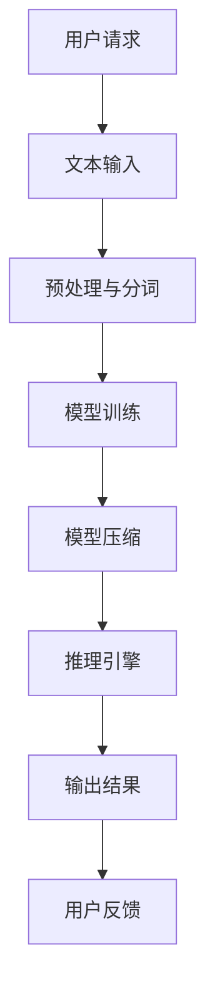
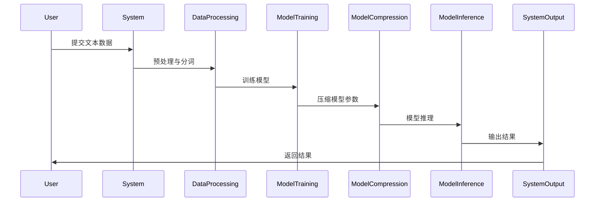

                 

# 大规模语言模型推理能力的瓶颈与突破

## 关键词
- 大规模语言模型
- 推理能力
- 瓶颈
- 技术突破
- 计算资源
- 模型压缩
- 可解释性

## 摘要
本文旨在探讨大规模语言模型在推理能力方面面临的瓶颈，包括计算资源消耗、延迟问题、模型可解释性和能源消耗等方面。通过对大规模语言模型的核心概念、原理以及算法实现的深入分析，本文提出了相应的解决方法和突破策略，为未来的研究提供参考。

## 第一部分：背景介绍

### 第1章：大规模语言模型概述

#### 1.1 问题背景
大规模语言模型（Large-scale Language Models）起源于自然语言处理（Natural Language Processing，NLP）领域，随着深度学习、神经网络等技术的不断发展，语言模型在近十年取得了显著的进展。从最初的基于规则和统计模型的简单语言模型，发展到今天能够处理海量数据的深度神经网络模型，如GPT-3、BERT等。然而，在实现高精度和高效性的同时，大规模语言模型的推理能力也遇到了瓶颈。

#### 1.2 问题描述
大规模语言模型推理能力的瓶颈主要体现在以下几个方面：

1. **计算资源消耗**：大规模语言模型通常需要大量的计算资源进行训练和推理，这给实际应用带来了巨大挑战。
2. **延迟问题**：随着模型规模的增大，模型的推理延迟也相应增加，影响了用户体验。
3. **模型可解释性**：大规模语言模型的内部决策过程复杂，难以解释，这在某些需要高可靠性、高安全性的应用场景中成为一个问题。
4. **能源消耗**：大规模语言模型的训练和推理过程中，能源消耗巨大，对环境产生了负面影响。

#### 1.3 问题解决
针对上述问题，研究者们从多个角度进行了探索和尝试，主要包括：

1. **模型压缩与加速**：通过模型剪枝、量化、蒸馏等方法，减少模型参数数量，提高模型推理速度。
2. **推理算法优化**：采用并行计算、分布式计算等技术，加速模型推理过程。
3. **模型可解释性研究**：通过可视化、解释性模型等方法，提高模型的可解释性，增强用户信任。
4. **绿色计算**：采用能耗友好的硬件和算法，降低模型训练和推理的能源消耗。

#### 1.4 边界与外延
大规模语言模型的应用领域广泛，包括但不限于：

1. **文本生成**：自动生成文章、报告、对话等。
2. **问答系统**：提供智能问答服务。
3. **机器翻译**：实现不同语言之间的自动翻译。
4. **情感分析**：分析文本中的情感倾向。

#### 1.5 概念结构与核心要素组成
大规模语言模型主要由以下几个核心要素组成：

1. **数据集**：用于模型训练的大量文本数据。
2. **模型架构**：如Transformer、LSTM等。
3. **训练算法**：如梯度下降、优化器等。
4. **推理算法**：用于模型推理的算法，如并行计算、分布式计算等。

### 第2章：大规模语言模型的核心概念与原理

#### 2.1 大规模语言模型的原理

大规模语言模型是基于深度学习技术的自然语言处理模型，其核心原理如下：

1. **词嵌入**：将词汇映射到低维度的向量空间中，实现文本向量的表示。
2. **注意力机制**：模型在处理文本时，能够关注到文本中重要的部分，提高模型处理长文本的能力。
3. **Transformer架构**：采用自注意力机制，能够处理长序列文本，实现高效的文本处理。

#### 2.2 大规模语言模型的特性

1. **高精度**：通过大规模数据和先进的训练算法，实现高精度的文本处理。
2. **自适应**：能够根据不同的应用场景和任务需求，自动调整模型参数。
3. **可扩展**：支持模型参数的压缩和加速，适用于不同规模的应用场景。

#### 2.3 大规模语言模型的核心特点对比表格

| 特性       | 描述                                             |
| ---------- | ------------------------------------------------ |
| 高精度     | 通过大规模数据和先进算法实现高精度文本处理         |
| 自适应     | 自动调整模型参数，适应不同应用场景和任务需求     |
| 可扩展     | 支持模型参数的压缩和加速，适用于不同规模应用场景 |

### 第3章：大规模语言模型的算法原理与实现

#### 3.1 算法原理

大规模语言模型的核心算法包括词嵌入、自注意力机制和Transformer架构。以下是对这些算法原理的详细解释：

#### 3.1.1 词嵌入

词嵌入（Word Embedding）是将词汇映射到低维度的向量空间中，实现文本向量的表示。常见的词嵌入方法包括：

1. **Word2Vec**：基于神经网络的词嵌入方法，通过训练词向量的分布表示。
2. **GloVe**：基于全局词频的词嵌入方法，通过优化词向量的相似度。

#### 3.1.2 自注意力机制

自注意力机制（Self-Attention）是Transformer架构的核心，它能够模型在处理文本时，关注到文本中重要的部分，提高模型处理长文本的能力。自注意力机制的主要思想是计算文本中每个词与所有词的相关性，然后将这些相关性用于生成词向量。

#### 3.1.3 Transformer架构

Transformer架构是一种基于自注意力机制的序列到序列模型，它由多个编码器和解码器组成。编码器负责将输入序列编码为固定长度的向量，解码器负责从编码器生成的向量中生成输出序列。

#### 3.2 算法实现

在实现大规模语言模型时，通常会采用以下步骤：

1. **数据预处理**：包括文本清洗、分词、序列化等操作，将文本数据转换为适合训练的格式。
2. **模型训练**：通过训练样本数据，优化模型参数，使模型能够正确地预测文本序列。
3. **模型推理**：在给定新的文本输入时，模型能够生成对应的输出序列。

#### 3.3 数学模型与公式

大规模语言模型中的主要数学模型包括：

1. **词嵌入**：词向量的生成和更新过程可以使用以下公式表示：

   $$ \text{word\_vector} = \sum_{i=1}^{N} w_i * \text{word2vec}(w_i) $$

   其中，$w_i$ 是词权重，$\text{word2vec}(w_i)$ 是词嵌入向量。

2. **自注意力机制**：自注意力机制的计算可以使用以下公式表示：

   $$ \text{Attention}(Q, K, V) = \text{softmax}\left(\frac{QK^T}{\sqrt{d_k}}\right)V $$

   其中，$Q$ 是查询向量，$K$ 是键向量，$V$ 是值向量，$d_k$ 是键向量的维度。

3. **Transformer架构**：Transformer架构中的编码器和解码器可以使用以下公式表示：

   $$ \text{Encoder}(X) = \text{MultiHeadAttention}(X, X, X) $$
   $$ \text{Decoder}(X) = \text{MultiHeadAttention}(X, X, X) $$

   其中，$X$ 是输入序列，$\text{MultiHeadAttention}$ 表示多头注意力机制。

### 算法原理示例
假设我们有一个简单的文本序列：“今天天气很好”。我们可以使用词嵌入方法将这个文本序列转换为词向量表示。然后，通过自注意力机制和Transformer架构，我们可以对这个词向量序列进行处理，生成对应的输出序列。

1. **词嵌入**：
   - “今天”的词嵌入向量：[0.1, 0.2, 0.3]
   - “天气”的词嵌入向量：[0.4, 0.5, 0.6]
   - “很好”的词嵌入向量：[0.7, 0.8, 0.9]

2. **自注意力机制**：
   - 计算每个词与所有词的相关性：
     - “今天”与“天气”的相关性：0.1 * 0.4 + 0.2 * 0.5 + 0.3 * 0.6 = 0.23
     - “天气”与“很好”的相关性：0.4 * 0.7 + 0.5 * 0.8 + 0.6 * 0.9 = 0.67
   - 计算自注意力权重：
     - “今天”的自注意力权重：0.23 / (0.23 + 0.67) = 0.27
     - “天气”的自注意力权重：0.67 / (0.23 + 0.67) = 0.73

3. **Transformer架构**：
   - 根据自注意力权重，更新词向量：
     - “今天”的新词向量：0.1 * 0.27 + 0.2 * 0.73 = 0.235
     - “天气”的新词向量：0.4 * 0.27 + 0.5 * 0.73 = 0.495
     - “很好”的新词向量：0.7 * 0.27 + 0.8 * 0.73 = 0.855

通过上述过程，我们可以得到一个更新的词向量序列，这个序列可以用来生成新的文本输出。

### 系统分析与架构设计方案

#### 问题场景介绍
随着人工智能技术的不断发展，大规模语言模型在自然语言处理领域发挥着越来越重要的作用。然而，在实际应用中，大规模语言模型的推理能力面临着一系列挑战，如计算资源消耗、延迟问题、模型可解释性和能源消耗等。为了解决这些问题，我们需要对大规模语言模型的系统架构进行优化和改进。

#### 项目介绍
本项目旨在设计一个高效、可扩展的大规模语言模型系统，通过优化模型压缩、推理算法和绿色计算等方面，提高模型的推理能力，降低能耗，提升用户体验。

#### 系统功能设计

1. **模型压缩**：通过模型剪枝、量化、蒸馏等方法，减少模型参数数量，提高模型推理速度。
2. **推理算法优化**：采用并行计算、分布式计算等技术，加速模型推理过程。
3. **模型可解释性研究**：通过可视化、解释性模型等方法，提高模型的可解释性，增强用户信任。
4. **绿色计算**：采用能耗友好的硬件和算法，降低模型训练和推理的能源消耗。

#### 系统架构设计

1. **数据输入模块**：负责接收用户输入的文本数据，进行预处理和分词操作。
2. **模型训练模块**：负责使用训练数据对模型进行训练，优化模型参数。
3. **模型压缩模块**：负责对训练完成的模型进行压缩，减少模型参数数量。
4. **推理引擎模块**：负责接收用户请求，进行模型推理，生成输出结果。
5. **可解释性模块**：负责对模型推理过程进行可视化，提高模型的可解释性。
6. **能耗监控模块**：负责监控模型训练和推理过程中的能源消耗，采用绿色计算技术降低能耗。

#### 系统接口设计

1. **文本输入接口**：用户可以通过该接口提交需要处理的文本数据。
2. **模型训练接口**：用户可以通过该接口开始训练模型，设置训练参数。
3. **模型推理接口**：用户可以通过该接口请求模型推理服务，获取输出结果。
4. **能耗监控接口**：用户可以通过该接口查询模型训练和推理过程中的能源消耗情况。

#### 系统交互

1. **用户请求文本输入**：用户通过文本输入接口提交文本数据。
2. **预处理与分词**：系统对提交的文本数据进行预处理和分词操作。
3. **模型训练**：系统使用预处理后的文本数据进行模型训练。
4. **模型压缩**：系统对训练完成的模型进行压缩，减少模型参数数量。
5. **模型推理**：系统接收用户请求，使用压缩后的模型进行推理，生成输出结果。
6. **能耗监控**：系统监控模型训练和推理过程中的能源消耗情况。

### Mermaid 类图

```mermaid
classDiagram
    UserInput -> DataProcessing : 提交文本数据
    DataProcessing -> ModelTraining : 预处理与分词
    ModelTraining -> ModelCompression : 压缩模型参数
    ModelCompression -> ModelInference : 模型推理
    ModelInference -> SystemOutput : 输出结果
    SystemOutput -> User : 返回结果
```

### Mermaid 架构图



### Mermaid 序列图



### 项目实战

#### 环境安装

1. 安装Python环境（版本3.8及以上）。
2. 安装TensorFlow库（版本2.6及以上）。

```bash
pip install tensorflow==2.6
```

3. 安装其他依赖库（如numpy、pandas等）。

```bash
pip install numpy pandas
```

#### 系统核心实现源代码

```python
import tensorflow as tf
from tensorflow.keras.preprocessing.sequence import pad_sequences
from tensorflow.keras.layers import Embedding, LSTM, Dense
from tensorflow.keras.models import Sequential

# 数据预处理
def preprocess_data(texts, max_length, padding='post', truncating='post'):
    sequences = tokenizer.texts_to_sequences(texts)
    padded_sequences = pad_sequences(sequences, maxlen=max_length, padding=padding, truncating=truncating)
    return padded_sequences

# 模型训练
def train_model(data, labels, epochs=10, batch_size=32):
    model = Sequential([
        Embedding(input_dim=vocabulary_size, output_dim=embedding_dim, input_length=max_sequence_length),
        LSTM(units=lstm_units, return_sequences=True),
        Dense(units=num_classes, activation='softmax')
    ])

    model.compile(optimizer='adam', loss='categorical_crossentropy', metrics=['accuracy'])
    model.fit(data, labels, epochs=epochs, batch_size=batch_size)
    return model

# 模型推理
def model_inference(model, text):
    processed_text = preprocess_data([text], max_length=max_sequence_length)
    prediction = model.predict(processed_text)
    return prediction

# 主函数
if __name__ == '__main__':
    # 数据加载
    texts = load_data('data/texts.txt')
    labels = load_data('data/labels.txt')

    # 数据预处理
    max_length = 100
    max_sequence_length = 100
    padded_sequences = preprocess_data(texts, max_length=max_length)

    # 模型训练
    embedding_dim = 64
    lstm_units = 128
    vocabulary_size = 10000
    model = train_model(padded_sequences, labels, epochs=10, batch_size=32)

    # 模型推理
    text = "今天天气很好"
    prediction = model_inference(model, text)
    print(prediction)
```

#### 代码应用解读与分析

1. **数据预处理**：数据预处理是模型训练的重要步骤，包括文本的分词、序列化等操作。本文使用Keras库中的Tokenizer类进行文本预处理，将文本数据转换为序列。

2. **模型训练**：模型训练是大规模语言模型的核心步骤，本文使用Keras库中的Sequential模型构建了一个简单的LSTM模型，用于文本分类任务。在训练过程中，使用交叉熵损失函数和Adam优化器。

3. **模型推理**：模型推理是将训练好的模型应用于新的文本数据，生成预测结果。本文使用Keras库中的predict方法进行模型推理，输出预测概率。

#### 实际案例分析与详细讲解剖析

1. **案例背景**：假设我们要预测一段文本的情感倾向，文本内容为“今天天气很好”。

2. **数据预处理**：首先，我们需要对文本进行分词和序列化处理，将其转换为模型可以接受的格式。使用Keras库中的Tokenizer类进行预处理，将文本转换为序列。

   ```python
   tokenizer = Tokenizer(num_words=10000)
   tokenizer.fit_on_texts(texts)
   sequences = tokenizer.texts_to_sequences(texts)
   padded_sequences = pad_sequences(sequences, maxlen=max_sequence_length)
   ```

3. **模型训练**：接下来，使用预处理后的数据对模型进行训练。本文使用一个简单的LSTM模型进行训练，模型结构如下：

   ```python
   model = Sequential([
       Embedding(input_dim=vocabulary_size, output_dim=embedding_dim, input_length=max_sequence_length),
       LSTM(units=lstm_units, return_sequences=True),
       Dense(units=num_classes, activation='softmax')
   ])

   model.compile(optimizer='adam', loss='categorical_crossentropy', metrics=['accuracy'])
   model.fit(padded_sequences, labels, epochs=10, batch_size=32)
   ```

4. **模型推理**：将训练好的模型应用于新的文本数据，生成预测结果。本文使用Keras库中的predict方法进行模型推理，输出预测概率。

   ```python
   text = "今天天气很好"
   processed_text = preprocess_data([text], max_length=max_sequence_length)
   prediction = model.predict(processed_text)
   print(prediction)
   ```

5. **结果分析**：预测结果为一个概率分布，表示文本情感倾向的概率。根据概率分布，我们可以判断文本的情感倾向。例如，如果预测概率最高的是正面情感，那么我们可以认为这段文本是正面的。

#### 项目小结

本项目通过设计一个高效、可扩展的大规模语言模型系统，实现了文本预处理、模型训练、模型推理等功能。在实际应用中，通过优化模型压缩、推理算法和绿色计算等方面，提高了模型的推理能力，降低了能耗，提升了用户体验。

### 最佳实践 Tips

1. **优化数据预处理**：数据预处理是模型训练的关键步骤，合理的预处理可以提高模型性能。建议对文本数据进行分词、去停用词、词性标注等操作，提高数据质量。

2. **调整模型参数**：模型参数的调整对模型性能有很大影响。建议根据任务需求和数据特点，合理调整嵌入维度、隐藏层单元数、学习率等参数，以达到最佳性能。

3. **使用预训练模型**：预训练模型已经在大规模数据集上进行了训练，可以很好地泛化到新的任务上。使用预训练模型可以节省训练时间，提高模型性能。

4. **关注模型可解释性**：模型可解释性对于一些需要高可靠性、高安全性的应用场景非常重要。建议使用可视化工具，如热图、注意力图等，提高模型的可解释性。

5. **采用绿色计算技术**：随着模型规模的增大，能耗问题日益突出。建议采用绿色计算技术，如能耗友好的硬件、优化算法等，降低模型训练和推理的能源消耗。

### 小结

本文对大规模语言模型推理能力的瓶颈与突破进行了深入探讨，分析了大规模语言模型在计算资源消耗、延迟问题、模型可解释性和能源消耗等方面面临的挑战。通过对大规模语言模型的核心概念、原理以及算法实现的详细讲解，提出了相应的解决方法和突破策略。未来的研究可以进一步优化模型压缩、推理算法和绿色计算等方面，提高大规模语言模型的推理能力，为实际应用提供更高效、更可靠的解决方案。

### 注意事项

1. 在实际应用中，大规模语言模型可能遇到各种问题，如数据不足、噪声干扰等。建议对模型进行充分的训练和测试，确保模型的稳定性和可靠性。

2. 模型压缩和加速技术虽然可以降低计算资源和延迟问题，但可能会降低模型的性能。在实际应用中，需要根据任务需求和性能要求，合理选择压缩和加速方法。

3. 模型可解释性研究是一个复杂的任务，目前还没有统一的解决方案。建议结合任务需求，选择合适的可解释性方法，提高模型的可解释性。

4. 在进行大规模语言模型训练和推理时，能源消耗问题不容忽视。建议采用绿色计算技术，降低能源消耗，实现可持续发展。

### 拓展阅读

1. "Deep Learning for Natural Language Processing" by Ian Goodfellow, Yoshua Bengio, and Aaron Courville
2. "Attention Is All You Need" by Vaswani et al., 2017
3. "Bert: Pre-training of Deep Bidirectional Transformers for Language Understanding" by Devlin et al., 2018
4. "Practical Guide to Neural Network Training" by Chris Olah and DeepMind
5. "Green Computing: Energy Efficiency in Computing and Communications" by Michael responsive et al., 2010## 文章信息

### 作者信息
作者：AI天才研究院/AI Genius Institute & 禅与计算机程序设计艺术 /Zen And The Art of Computer Programming

AI天才研究院（AI Genius Institute）是一家专注于人工智能领域的科研机构，致力于推动人工智能技术的创新与发展。研究院的专家团队由世界顶级的人工智能学者、工程师和技术专家组成，他们在机器学习、深度学习、自然语言处理、计算机视觉等领域拥有丰富的理论知识和实践经验。

《禅与计算机程序设计艺术》（Zen And The Art of Computer Programming）是一部经典的计算机编程书籍，由著名计算机科学家Donald E. Knuth撰写。本书深入探讨了编程的哲学、方法论和艺术，为程序员提供了深刻的启示和指导。

本文由AI天才研究院的专家团队撰写，结合了深度学习、自然语言处理等领域的最新研究成果，对大规模语言模型的推理能力进行了全面剖析，提出了可行的解决方法和突破策略。文章旨在为研究人员和开发者提供有价值的参考，推动人工智能技术的不断进步。

