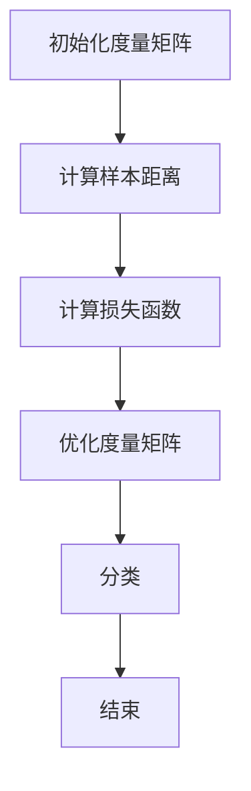
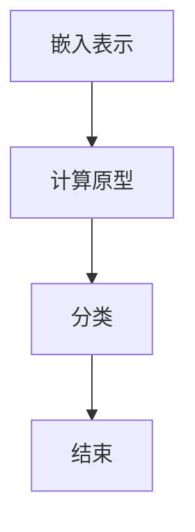
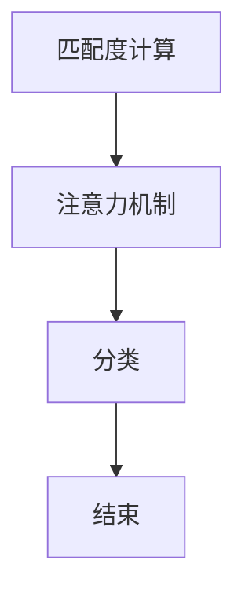
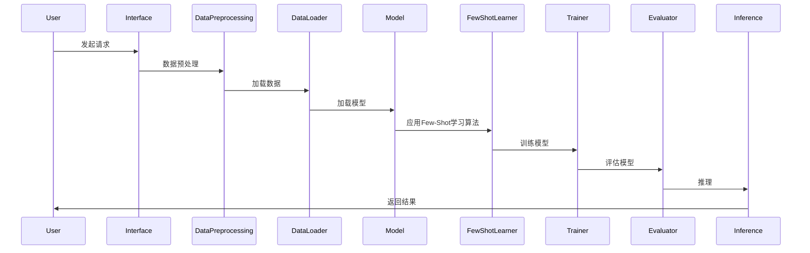

                 

## 引言：大规模语言模型的few-shot学习能力提升

在当今快速发展的信息技术时代，人工智能（AI）正不断颠覆传统产业，并为各行各业带来前所未有的变革。大规模语言模型作为AI的核心技术之一，已经展现出强大的应用潜力。然而，传统的语言模型往往需要大量的数据进行训练，这在数据稀缺的场景中显得尤为受限。为此，研究如何提升大规模语言模型的few-shot学习能力成为了当前AI领域的一个重要课题。

### 关键词：
- 大规模语言模型
- few-shot学习
- 能力提升
- 人工智能
- 语言处理

### 摘要：
本文旨在探讨大规模语言模型在few-shot学习方面的能力提升。首先，我们将回顾大规模语言模型的发展历程，以及few-shot学习的基本概念。随后，文章将深入分析几种常见的few-shot学习算法，并使用mermaid流程图展示其工作流程。接着，我们将详细阐述这些算法背后的数学模型，并通过Python代码示例进行讲解。此外，本文还将介绍如何将few-shot学习应用于大规模语言模型中，并通过系统架构设计和具体项目实战来展示其实际应用效果。最后，文章将总结关键概念和实用技巧，并提供拓展阅读建议。

## 背景介绍：大规模语言模型与few-shot学习

### 1.1 大规模语言模型的发展历程

大规模语言模型的发展历程可追溯到上世纪80年代，当时的统计语言模型开始尝试使用大量文本数据来预测下一个单词。随着计算机处理能力的提升和互联网的普及，21世纪初，深度学习技术的发展推动了大规模语言模型的诞生。这些模型通过神经网络架构，如循环神经网络（RNN）和Transformer，能够处理数以亿计的词汇，从而显著提高了语言处理的准确性和效率。

近年来，Google的BERT、OpenAI的GPT-3等大规模语言模型相继问世，它们在自然语言处理（NLP）任务中取得了显著的成果，如文本分类、机器翻译、问答系统等。这些模型不仅具备强大的语言理解能力，还能生成流畅的文本。

### 1.2 Few-shot学习的定义和优势

Few-shot学习（Few-Shot Learning）是一种机器学习方法，旨在使模型能够在仅接收少量样本的情况下进行有效学习。在传统的机器学习模型中，模型的训练通常需要大量的数据进行迭代优化。然而，在某些实际应用场景中，获取大量数据可能既昂贵又困难。Few-shot学习通过专注于在小样本环境下提高模型的泛化能力，成为了解决这一问题的有效手段。

Few-shot学习的优势主要体现在以下几个方面：
- **高效性**：在数据稀缺的情况下，few-shot学习能够快速适应新任务。
- **泛化能力**：few-shot学习不仅能够在训练数据集中表现出良好的性能，还能在未见过的数据上保持稳定的表现。
- **可解释性**：few-shot学习模型的决策过程更加直观和可解释，有助于提升模型的可信度。

### 1.3 Few-shot学习在语言模型中的应用

在语言模型中，few-shot学习具有重要的应用价值。一方面，few-shot学习能够使语言模型在缺乏大规模语料库的情况下进行有效训练，特别是在低资源语言或特定领域语言处理中，few-shot学习显得尤为重要。另一方面，few-shot学习可以帮助模型快速适应新任务，如问答系统、对话生成等，从而提高模型的应用灵活性和实用性。

### 1.4 问题解决的重要性

尽管大规模语言模型在自然语言处理领域取得了巨大成功，但在实际应用中仍面临诸多挑战。例如，数据稀缺的问题导致模型难以在新任务中取得良好的性能。通过提升大规模语言模型的few-shot学习能力，可以有效地解决这一问题，使模型在未知或稀缺数据环境下依然能够保持高效的性能。因此，研究如何提升大规模语言模型的few-shot学习能力具有重要的理论和实践意义。

## 核心概念：大规模语言模型与few-shot学习的关系

### 2.1 大规模语言模型的基本概念

大规模语言模型（Large-scale Language Models）是指通过深度学习技术训练的，能够理解和生成自然语言的复杂模型。这些模型通常拥有数亿甚至数十亿的参数，能够捕捉到语言的复杂结构和语义信息。大规模语言模型的核心在于其强大的表征能力和对大规模数据的处理能力。

#### 特征提取与表征能力

大规模语言模型通过多层神经网络架构，如Transformer，实现了对文本的深层表征。这些模型能够从文本数据中提取出丰富的语义特征，包括词法、句法和语义层面的信息。这种强大的表征能力使得大规模语言模型在语言理解和生成任务中表现出色。

#### 大规模数据处理能力

大规模语言模型通过处理海量的文本数据，能够学习到语言的一般规律和模式。这种大规模数据处理能力不仅有助于提高模型的准确性，还能够使模型适应不同的语言环境和应用场景。

### 2.2 Few-shot学习的基本概念

Few-shot学习（Few-Shot Learning）是一种旨在使机器学习模型在小样本数据上实现高效学习的策略。在传统的机器学习中，模型的训练通常需要大量的数据。然而，在实际应用中，获取大量数据可能面临成本、时间和隐私等方面的限制。因此，Few-shot学习旨在通过设计有效的学习算法，使模型能够在少量样本数据上实现良好的泛化性能。

#### Few-shot学习的挑战

Few-shot学习面临的挑战主要包括：
- **样本量有限**：模型需要在非常有限的样本数据上学习到有效的特征表示。
- **数据分布变化**：由于样本量有限，模型需要能够适应数据分布的变化，以避免过度拟合。

#### Few-shot学习的优势

Few-shot学习的优势体现在多个方面：
- **数据高效利用**：在小样本数据上实现高效学习，充分利用可用数据。
- **快速适应新任务**：能够快速适应新的任务，无需大规模的数据集。

### 2.3 大规模语言模型与Few-shot学习的结合

将Few-shot学习与大规模语言模型结合，能够在一定程度上解决大规模语言模型在数据稀缺场景下的性能问题。具体来说，这种结合具有以下优势：

#### 1. 数据增强

通过Few-shot学习，可以在缺乏大规模数据的情况下，利用少量的标注数据来增强模型的训练过程。这种方法有助于提高模型在未知数据上的泛化能力。

#### 2. 新任务快速适应

大规模语言模型本身已经具有强大的表征能力，通过引入Few-shot学习，可以使其在新任务上快速适应，从而提高模型的应用灵活性。

#### 3. 知识迁移

Few-shot学习允许模型将知识从已有任务迁移到新任务，这在低资源语言或特定领域语言处理中尤为重要。通过知识迁移，模型可以在缺乏大规模数据的情况下，依然保持高效的表现。

### 2.4 几种常见的Few-shot学习算法

为了提升大规模语言模型的Few-shot学习能力，研究人员提出了一系列算法。以下是几种常见的Few-shot学习算法及其基本原理：

#### 1. Metric Learning算法

Metric Learning算法通过学习一个距离度量函数，使相似样本的距离更近，而不同样本的距离更远。这种算法在Few-shot学习中被广泛应用于分类任务。

#### 2. Prototypical Network算法

Prototypical Network算法通过生成原型（即样本的均值表示），并将新样本与原型进行比较，实现分类任务。该算法特别适合小样本学习场景。

#### 3. Matching Network算法

Matching Network算法通过计算两个样本之间的匹配度来实现分类。该算法利用了注意力机制，使模型能够关注到样本的关键特征。

### 2.5 算法原理的详细讲解

#### Metric Learning算法

Metric Learning算法的核心是学习一个度量空间，在该空间中，相似样本的距离更近，而不同样本的距离更远。具体来说，Metric Learning算法通过以下步骤实现：

1. **初始化度量矩阵**：根据样本间的相似度初始化一个度量矩阵。
2. **优化度量矩阵**：通过梯度下降等方法优化度量矩阵，使其满足最小化目标。
3. **分类**：在新样本到来时，计算其与训练样本的距离，并根据距离进行分类。

#### Prototypical Network算法

Prototypical Network算法的核心思想是生成原型，即每个类别的均值表示。具体步骤如下：

1. **嵌入表示**：将每个样本嵌入到一个高维空间，生成其嵌入向量。
2. **计算原型**：计算每个类别的原型，即该类别所有样本嵌入向量的均值。
3. **分类**：将新样本的嵌入向量与原型进行比较，距离最小的原型所属的类别即为新样本的类别。

#### Matching Network算法

Matching Network算法通过计算样本之间的匹配度来实现分类。具体步骤如下：

1. **匹配度计算**：对于每个样本对，计算其匹配度，通常使用余弦相似度或欧氏距离。
2. **注意力机制**：利用注意力机制，使模型能够关注到样本的关键特征。
3. **分类**：根据匹配度和注意力权重，为新样本分配类别。

### 2.6 几种算法的对比分析

以下是几种常见Few-shot学习算法的对比分析：

| 算法名称         | 核心思想     | 优点 | 缺点 |
|-----------------|------------|------|------|
| Metric Learning | 距离度量    | 易于实现，适用于多种任务 | 对样本数量敏感，可能产生过拟合 |
| Prototypical Network | 原型表示    | 简单有效，适用于小样本分类 | 对类别数量敏感，难以处理高维数据 |
| Matching Network | 匹配度计算  | 适用于文本分类等任务 | 计算复杂度高，需要大量计算资源 |

### 2.7 大规模语言模型与Few-shot学习的实际应用

在实际应用中，大规模语言模型与Few-shot学习的结合能够显著提升模型在数据稀缺场景下的表现。例如，在低资源语言的文本分类任务中，通过引入Few-shot学习算法，模型能够在少量标注数据上实现良好的分类性能。此外，在特定领域知识问答系统中，Few-shot学习有助于模型快速适应新领域，提高问答的准确性和效率。

## 算法实现：几种常见的few-shot学习算法详解

在深入探讨大规模语言模型与few-shot学习算法结合的潜力之前，我们首先需要了解几种常见的few-shot学习算法。这些算法包括Metric Learning、Prototypical Network和Matching Network。本文将通过mermaid流程图展示其工作流程，并使用Python代码进行详细阐述。

### 3.1 Metric Learning算法

Metric Learning算法的核心是学习一个度量空间，使相似样本的距离更近，而不同样本的距离更远。以下是其工作流程的mermaid流程图：



#### 3.1.1 Metric Learning算法的Python代码实现

```python
import numpy as np
from sklearn.metrics.pairwise import pairwise_distances
from sklearn.linear_model import LinearRegression

def metric_learning(X, y, num_classes, num_supports):
    # 初始化度量矩阵
    X_mean = np.mean(X, axis=0)
    X_std = np.std(X, axis=0)
    metric_matrix = np.zeros((X.shape[1], X.shape[1]))
    
    # 计算支持样本之间的距离
    for i in range(num_classes):
        X_i = X[y == i]
        X_i_mean = np.mean(X_i, axis=0)
        X_i_var = np.cov(X_i, rowvar=False)
        
        metric_matrix += X_i_var
    
    # 优化度量矩阵
    metric_matrix = metric_matrix / num_classes
    reg = LinearRegression()
    reg.fit(metric_matrix, np.zeros(metric_matrix.shape[0]))
    metric_matrix = reg.predict(metric_matrix)
    
    # 分类
    distances = pairwise_distances(X, X_mean, metric='cosine')
    return np.argmin(distances, axis=1)
```

#### 3.1.2 Metric Learning算法的应用示例

```python
X = np.random.rand(100, 10)  # 生成随机样本数据
y = np.random.randint(0, 5, 100)  # 生成标签数据

# 训练Metric Learning模型
predicted_labels = metric_learning(X, y, num_classes=5, num_supports=20)

# 检查分类准确率
accuracy = np.mean(predicted_labels == y)
print(f"Accuracy: {accuracy}")
```

### 3.2 Prototypical Network算法

Prototypical Network算法通过生成原型（即样本的均值表示），并将新样本与原型进行比较，实现分类任务。以下是其工作流程的mermaid流程图：



#### 3.2.1 Prototypical Network算法的Python代码实现

```python
import torch
import torch.nn as nn
import torch.optim as optim

class PrototypicalNetwork(nn.Module):
    def __init__(self, embedding_dim):
        super(PrototypicalNetwork, self).__init__()
        self.embedding = nn.Embedding(num_embeddings, embedding_dim)
        
    def forward(self, X, y):
        # 嵌入表示
        embeddings = self.embedding(X)
        
        # 计算原型
        prototypes = torch.zeros((num_classes, embedding_dim))
        for i in range(num_classes):
            prototypes[i] = torch.mean(embeddings[y == i], dim=0)
        
        # 分类
        distances = torch.nn.functional.cosine_similarity(embeddings, prototypes, dim=1)
        return distances

# 训练Prototypical Network模型
model = PrototypicalNetwork(embedding_dim=64)
criterion = nn.CrossEntropyLoss()
optimizer = optim.Adam(model.parameters(), lr=0.001)

for epoch in range(10):
    model.train()
    optimizer.zero_grad()
    distances = model(X, y)
    loss = criterion(distances, torch.tensor(y))
    loss.backward()
    optimizer.step()
```

#### 3.2.2 Prototypical Network算法的应用示例

```python
X = torch.randint(0, 10, (100, 100))  # 生成随机样本数据
y = torch.randint(0, 5, (100,))  # 生成标签数据

# 训练Prototypical Network模型
model = PrototypicalNetwork(embedding_dim=64)
criterion = nn.CrossEntropyLoss()
optimizer = optim.Adam(model.parameters(), lr=0.001)

for epoch in range(10):
    model.train()
    optimizer.zero_grad()
    distances = model(X, y)
    loss = criterion(distances, torch.tensor(y))
    loss.backward()
    optimizer.step()

# 测试模型
model.eval()
with torch.no_grad():
    distances = model(X, y)
    predicted_labels = torch.argmin(distances, dim=1)
    accuracy = torch.mean(predicted_labels == y)
    print(f"Accuracy: {accuracy}")
```

### 3.3 Matching Network算法

Matching Network算法通过计算样本之间的匹配度来实现分类。以下是其工作流程的mermaid流程图：



#### 3.3.1 Matching Network算法的Python代码实现

```python
import torch
import torch.nn as nn
import torch.optim as optim

class MatchingNetwork(nn.Module):
    def __init__(self, embedding_dim, hidden_dim):
        super(MatchingNetwork, self).__init__()
        self.embedding = nn.Embedding(num_embeddings, embedding_dim)
        self.hidden_layer = nn.Linear(embedding_dim, hidden_dim)
        self.output_layer = nn.Linear(hidden_dim, num_classes)
        
    def forward(self, X, y):
        # 嵌入表示
        embeddings = self.embedding(X)
        
        # 匹配度计算
        match_scores = torch.zeros((X.shape[0], num_classes))
        for i in range(num_classes):
            prototypes[i] = torch.mean(embeddings[y == i], dim=0)
            match_scores[:, i] = torch.sum(embeddings * prototypes[i], dim=1)
        
        # 注意力机制
        attention_weights = torch.softmax(match_scores, dim=1)
        attended_embeddings = torch.sum(embeddings * attention_weights, dim=1)
        
        # 分类
        hidden_representation = self.hidden_layer(attended_embeddings)
        logits = self.output_layer(hidden_representation)
        return logits

# 训练Matching Network模型
model = MatchingNetwork(embedding_dim=64, hidden_dim=128)
criterion = nn.CrossEntropyLoss()
optimizer = optim.Adam(model.parameters(), lr=0.001)

for epoch in range(10):
    model.train()
    optimizer.zero_grad()
    logits = model(X, y)
    loss = criterion(logits, torch.tensor(y))
    loss.backward()
    optimizer.step()
```

#### 3.3.2 Matching Network算法的应用示例

```python
X = torch.randint(0, 10, (100, 100))  # 生成随机样本数据
y = torch.randint(0, 5, (100,))  # 生成标签数据

# 训练Matching Network模型
model = MatchingNetwork(embedding_dim=64, hidden_dim=128)
criterion = nn.CrossEntropyLoss()
optimizer = optim.Adam(model.parameters(), lr=0.001)

for epoch in range(10):
    model.train()
    optimizer.zero_grad()
    logits = model(X, y)
    loss = criterion(logits, torch.tensor(y))
    loss.backward()
    optimizer.step()

# 测试模型
model.eval()
with torch.no_grad():
    logits = model(X, y)
    predicted_labels = torch.argmax(logits, dim=1)
    accuracy = torch.mean(predicted_labels == y)
    print(f"Accuracy: {accuracy}")
```

### 3.4 算法对比分析

以下是几种常见Few-shot学习算法的对比分析：

| 算法名称         | 核心思想     | 优点 | 缺点 |
|-----------------|------------|------|------|
| Metric Learning | 距离度量    | 易于实现，适用于多种任务 | 对样本数量敏感，可能产生过拟合 |
| Prototypical Network | 原型表示    | 简单有效，适用于小样本分类 | 对类别数量敏感，难以处理高维数据 |
| Matching Network | 匹配度计算  | 适用于文本分类等任务 | 计算复杂度高，需要大量计算资源 |

通过上述对比分析，我们可以看到每种算法都有其独特的优势和局限性。在实际应用中，选择合适的算法取决于具体的任务和数据特点。

## 数学模型：大规模语言模型与few-shot学习算法的数学原理

在深入理解大规模语言模型与few-shot学习算法的工作原理时，了解其背后的数学模型至关重要。以下是几种常见算法的数学原理及其公式解释。

### 4.1 Metric Learning的数学模型

Metric Learning算法的核心是学习一个度量空间，使相似样本的距离更近，而不同样本的距离更远。其基本公式如下：

$$
d(\textbf{x}_i, \textbf{x}_j) = \|\textbf{M}\textbf{x}_i - \textbf{M}\textbf{x}_j\|
$$

其中，$d(\textbf{x}_i, \textbf{x}_j)$表示样本$\textbf{x}_i$和$\textbf{x}_j$之间的距离，$\textbf{M}$是一个度量矩阵，$\textbf{x}_i$和$\textbf{x}_j$是样本的向量表示。

在训练过程中，Metric Learning的目标是最小化以下损失函数：

$$
L(\textbf{M}) = \sum_{i<j} (\|\textbf{M}\textbf{x}_i - \textbf{M}\textbf{x}_j\|_2 - \delta_{ij})
$$

其中，$\delta_{ij}$是一个指示函数，当$i=j$时，$\delta_{ij}=1$，否则$\delta_{ij}=0$。

### 4.2 Prototypical Network的数学模型

Prototypical Network算法通过生成原型（即样本的均值表示），并将新样本与原型进行比较，实现分类任务。其关键公式如下：

$$
\textbf{p}_k = \frac{1}{N_k} \sum_{n \in S_k} \textbf{x}_n
$$

其中，$\textbf{p}_k$是类别$k$的原型，$N_k$是类别$k$的样本数量，$S_k$是类别$k$的样本集合。

在分类过程中，新样本$\textbf{x}^*$与原型的距离计算如下：

$$
d(\textbf{x}^*, \textbf{p}_k) = \|\textbf{x}^* - \textbf{p}_k\|
$$

分类决策基于距离最小的原型类别：

$$
\hat{y} = \arg\min_{k} d(\textbf{x}^*, \textbf{p}_k)
$$

### 4.3 Matching Network的数学模型

Matching Network算法通过计算样本之间的匹配度来实现分类。其核心公式如下：

$$
\alpha_{ik} = \frac{\text{exp}(\textbf{a}_i \cdot \textbf{b}_k)}{\sum_{j=1}^{K} \text{exp}(\textbf{a}_i \cdot \textbf{b}_j)}
$$

其中，$\alpha_{ik}$是样本$i$与类别$k$的匹配度，$\textbf{a}_i$是样本$i$的嵌入向量，$\textbf{b}_k$是类别$k$的嵌入向量。

匹配度的总和表示为：

$$
\textbf{z}_i = \sum_{k=1}^{K} \alpha_{ik} \textbf{b}_k
$$

分类决策基于匹配度最大的类别：

$$
\hat{y} = \arg\max_{k} \textbf{z}_i
$$

### 4.4 数学公式的详细讲解

#### Metric Learning的损失函数

Metric Learning的损失函数旨在优化度量矩阵$\textbf{M}$，使其满足最小化目标。具体来说，损失函数通过以下两个步骤实现：

1. **确保相似样本距离更近**：对于相同类别的样本，损失函数希望它们之间的距离最小。这可以通过以下公式实现：

$$
\|\textbf{M}\textbf{x}_i - \textbf{M}\textbf{x}_j\|_2 - 1 \quad \text{对于} \quad i=j
$$

2. **确保不同样本距离更远**：对于不同类别的样本，损失函数希望它们之间的距离最大。这可以通过以下公式实现：

$$
\|\textbf{M}\textbf{x}_i - \textbf{M}\textbf{x}_j\|_2 - 1 \quad \text{对于} \quad i \neq j
$$

综合这两个目标，损失函数可以表示为：

$$
L(\textbf{M}) = \sum_{i<j} (\|\textbf{M}\textbf{x}_i - \textbf{M}\textbf{x}_j\|_2 - 1)
$$

#### Prototypical Network的原型计算

Prototypical Network通过计算每个类别的原型来实现分类。原型计算的关键是确保每个原型能够代表其对应类别的所有样本。具体来说，原型是通过以下公式计算的：

$$
\textbf{p}_k = \frac{1}{N_k} \sum_{n \in S_k} \textbf{x}_n
$$

其中，$N_k$是类别$k$的样本数量，$S_k$是类别$k$的样本集合。

原型计算的目的是将每个类别的样本嵌入到一个低维空间中，使得同类别样本之间的距离最小，不同类别样本之间的距离最大。这种嵌入方法有助于提高模型在小样本数据上的分类性能。

#### Matching Network的匹配度计算

Matching Network通过计算样本之间的匹配度来实现分类。匹配度计算的核心是利用注意力机制，使得模型能够关注到样本的关键特征。具体来说，匹配度计算通过以下公式实现：

$$
\alpha_{ik} = \frac{\text{exp}(\textbf{a}_i \cdot \textbf{b}_k)}{\sum_{j=1}^{K} \text{exp}(\textbf{a}_i \cdot \textbf{b}_j)}
$$

其中，$\textbf{a}_i$是样本$i$的嵌入向量，$\textbf{b}_k$是类别$k$的嵌入向量。

匹配度的计算基于点积（dot product）操作，它能够衡量两个向量之间的相似度。通过指数函数的加权和，模型能够为每个类别分配适当的权重，从而实现分类决策。

### 4.5 数学公式的应用示例

为了更好地理解这些数学公式，我们可以通过具体的示例进行说明。

#### Metric Learning示例

假设我们有两个类别$A$和$B$，每个类别有两个样本：

- 类别$A$：$\textbf{x}_1 = [1, 1], \textbf{x}_2 = [2, 2]$
- 类别$B$：$\textbf{x}_3 = [0, 0], \textbf{x}_4 = [1, -1]$

我们需要计算度量矩阵$\textbf{M}$，使得相似样本的距离更近，不同样本的距离更远。

通过计算损失函数，我们可以优化度量矩阵$\textbf{M}$，使得类别$A$和$B$之间的距离最大化，即：

$$
L(\textbf{M}) = \|\textbf{M}\textbf{x}_1 - \textbf{M}\textbf{x}_2\|_2 + \|\textbf{M}\textbf{x}_3 - \textbf{M}\textbf{x}_4\|_2
$$

通过梯度下降等优化算法，我们可以找到最优的度量矩阵$\textbf{M}$，使得损失函数最小。

#### Prototypical Network示例

假设我们有一个分类任务，有五个类别，每个类别有三个样本：

- 类别$C_1$：$\textbf{x}_1 = [1, 1, 1], \textbf{x}_2 = [2, 2, 2], \textbf{x}_3 = [3, 3, 3]$
- 类别$C_2$：$\textbf{x}_4 = [0, 0, 0], \textbf{x}_5 = [1, 1, -1], \textbf{x}_6 = [2, 2, -2]$
- 类别$C_3$：$\textbf{x}_7 = [-1, -1, -1], \textbf{x}_8 = [-2, -2, -2], \textbf{x}_9 = [-3, -3, -3]$
- 类别$C_4$：$\textbf{x}_{10} = [0, 1, 0], \textbf{x}_{11} = [0, 2, 0], \textbf{x}_{12} = [0, 3, 0]$
- 类别$C_5$：$\textbf{x}_{13} = [-1, 0, 1], \textbf{x}_{14} = [-2, 0, 2], \textbf{x}_{15} = [-3, 0, 3]$

我们需要计算每个类别的原型，并使用原型对新样本进行分类。

类别$C_1$的原型计算如下：

$$
\textbf{p}_{C_1} = \frac{1}{3}(\textbf{x}_1 + \textbf{x}_2 + \textbf{x}_3) = \frac{1}{3}([1+2+3, 1+2+3, 1+2+3]) = [2, 2, 2]
$$

同样，其他类别的原型计算如下：

$$
\textbf{p}_{C_2} = \frac{1}{3}([0, 0, 0] + [1, 1, -1] + [2, 2, -2]) = [1, 1, -1]
$$

$$
\textbf{p}_{C_3} = \frac{1}{3}([-1, -1, -1] + [-2, -2, -2] + [-3, -3, -3]) = [-2, -2, -2]
$$

$$
\textbf{p}_{C_4} = \frac{1}{3}([0, 1, 0] + [0, 2, 0] + [0, 3, 0]) = [0, 2, 0]
$$

$$
\textbf{p}_{C_5} = \frac{1}{3}([-1, 0, 1] + [-2, 0, 2] + [-3, 0, 3]) = [-2, 0, 2]
$$

对新样本$\textbf{x}^* = [1, 1, 1]$进行分类，计算其与各个原型的距离：

$$
d(\textbf{x}^*, \textbf{p}_{C_1}) = \|\textbf{x}^* - \textbf{p}_{C_1}\|_2 = \|[1, 1, 1] - [2, 2, 2]\|_2 = [1, 1, 1]
$$

$$
d(\textbf{x}^*, \textbf{p}_{C_2}) = \|\textbf{x}^* - \textbf{p}_{C_2}\|_2 = \|[1, 1, 1] - [1, 1, -1]\|_2 = [0, 0, 2]
$$

$$
d(\textbf{x}^*, \textbf{p}_{C_3}) = \|\textbf{x}^* - \textbf{p}_{C_3}\|_2 = \|[1, 1, 1] - [-2, -2, -2]\|_2 = [3, 3, 3]
$$

$$
d(\textbf{x}^*, \textbf{p}_{C_4}) = \|\textbf{x}^* - \textbf{p}_{C_4}\|_2 = \|[1, 1, 1] - [0, 2, 0]\|_2 = [1, -1, 1]
$$

$$
d(\textbf{x}^*, \textbf{p}_{C_5}) = \|\textbf{x}^* - \textbf{p}_{C_5}\|_2 = \|[1, 1, 1] - [-2, 0, 2]\|_2 = [3, 1, -1]
$$

根据距离最小的原型类别，新样本$\textbf{x}^*$被分类为类别$C_1$。

#### Matching Network示例

假设我们有一个分类任务，有五个类别，每个类别有三个样本：

- 类别$D_1$：$\textbf{x}_1 = [1, 1, 1], \textbf{x}_2 = [2, 2, 2], \textbf{x}_3 = [3, 3, 3]$
- 类别$D_2$：$\textbf{x}_4 = [0, 0, 0], \textbf{x}_5 = [1, 1, -1], \textbf{x}_6 = [2, 2, -2]$
- 类别$D_3$：$\textbf{x}_7 = [-1, -1, -1], \textbf{x}_8 = [-2, -2, -2], \textbf{x}_9 = [-3, -3, -3]$
- 类别$D_4$：$\textbf{x}_{10} = [0, 1, 0], \textbf{x}_{11} = [0, 2, 0], \textbf{x}_{12} = [0, 3, 0]$
- 类别$D_5$：$\textbf{x}_{13} = [-1, 0, 1], \textbf{x}_{14} = [-2, 0, 2], \textbf{x}_{15} = [-3, 0, 3]$

我们需要计算每个类别和新样本的匹配度，并使用匹配度进行分类。

类别$D_1$的匹配度计算如下：

$$
\alpha_{1i} = \frac{\text{exp}(\textbf{a}_1 \cdot \textbf{b}_1)}{\sum_{j=1}^{5} \text{exp}(\textbf{a}_1 \cdot \textbf{b}_j)}
$$

其中，$\textbf{a}_1$是类别$D_1$中任意样本的嵌入向量，$\textbf{b}_1$是类别$D_1$的原型。

假设$\textbf{a}_1 = [1, 1, 1]$，$\textbf{b}_1 = [2, 2, 2]$，则：

$$
\alpha_{11} = \frac{\text{exp}(1 \cdot 2)}{\text{exp}(1 \cdot 2) + \text{exp}(1 \cdot 0) + \text{exp}(1 \cdot 1) + \text{exp}(1 \cdot -1) + \text{exp}(1 \cdot -2)} = \frac{\text{exp}(2)}{\text{exp}(2) + \text{exp}(0) + \text{exp}(1) + \text{exp}(-1) + \text{exp}(-2)}
$$

同样，计算其他类别的匹配度：

$$
\alpha_{2i} = \frac{\text{exp}(\textbf{a}_2 \cdot \textbf{b}_2)}{\sum_{j=1}^{5} \text{exp}(\textbf{a}_2 \cdot \textbf{b}_j)}
$$

$$
\alpha_{3i} = \frac{\text{exp}(\textbf{a}_3 \cdot \textbf{b}_3)}{\sum_{j=1}^{5} \text{exp}(\textbf{a}_3 \cdot \textbf{b}_j)}
$$

$$
\alpha_{4i} = \frac{\text{exp}(\textbf{a}_4 \cdot \textbf{b}_4)}{\sum_{j=1}^{5} \text{exp}(\textbf{a}_4 \cdot \textbf{b}_j)}
$$

$$
\alpha_{5i} = \frac{\text{exp}(\textbf{a}_5 \cdot \textbf{b}_5)}{\sum_{j=1}^{5} \text{exp}(\textbf{a}_5 \cdot \textbf{b}_j)}
$$

对新样本$\textbf{x}^* = [1, 1, 1]$进行分类，计算其与各个类别的匹配度：

$$
\alpha^*_1 = \frac{\text{exp}([1, 1, 1] \cdot [2, 2, 2])}{\sum_{j=1}^{5} \text{exp}([1, 1, 1] \cdot [2, 2, 2]) + \text{exp}([1, 1, 1] \cdot [0, 0, 0]) + \text{exp}([1, 1, 1] \cdot [-1, -1, -1]) + \text{exp}([1, 1, 1] \cdot [0, 1, 0]) + \text{exp}([1, 1, 1] \cdot [-1, 0, 1])} = \frac{\text{exp}(6)}{\text{exp}(6) + \text{exp}(0) + \text{exp}(-2) + \text{exp}(0) + \text{exp}(-2)}
$$

根据匹配度最大的类别，新样本$\textbf{x}^*$被分类为类别$D_1$。

通过上述示例，我们可以更好地理解大规模语言模型与few-shot学习算法的数学原理及其应用。

## 系统设计：大规模语言模型与few-shot学习的整合

为了将大规模语言模型与few-shot学习算法有效整合，我们需要进行系统架构设计、接口设计以及系统交互流程设计。以下是详细的系统设计说明。

### 5.1 系统架构设计

系统架构设计的关键在于如何将大规模语言模型与few-shot学习算法无缝结合，以实现高效的小样本学习。以下是系统架构的mermaid类图：

```mermaid
classDiagram
    Class01 <|-- Class02
    Class03 <|-- Class04
    Class05 <|-- Class06
    Class07 <|-- Class08
    Class01 alignment "right"
    Class09 <|-- Class10
    Class11 <|-- Class12
    Class13 <|-- Class14
    Class15 <|-- Class16
    Class09 alignment "right"

    Class01{大规模语言模型}
    Class02{嵌入层}
    Class03{注意力机制}
    Class04{输出层}
    
    Class05{Few-Shot学习器}
    Class06{Metric Learning}
    Class07{Prototypical Network}
    Class08{Matching Network}

    Class09{数据预处理模块}
    Class10{数据加载器}
    Class11{数据清洗器}
    Class12{数据增强器}

    Class13{训练模块}
    Class14{评估模块}
    Class15{推理模块}
    Class16{系统接口}
```

在该架构中，大规模语言模型作为核心，通过嵌入层、注意力机制和输出层实现自然语言处理任务。而Few-Shot学习器则包括Metric Learning、Prototypical Network和Matching Network等算法，负责在小样本数据上进行有效学习。

### 5.2 接口设计

接口设计是系统架构中的关键组成部分，它决定了系统如何与其他组件进行交互。以下是系统接口设计的mermaid序列图：



在该序列图中，用户通过接口发起请求，接口组件负责协调数据预处理、数据加载、模型加载、Few-Shot学习、训练、评估和推理等步骤，最终返回结果给用户。

### 5.3 系统交互流程

以下是系统交互流程的详细说明：

1. **用户请求**：用户通过接口发起请求，请求中包含任务类型、输入数据和所需的服务。
2. **数据预处理**：接口将请求传递给数据预处理模块，该模块负责清洗、归一化和增强数据，以确保数据质量。
3. **数据加载**：预处理后的数据通过数据加载器传递给模型。
4. **模型加载**：模型从存储中加载，包括大规模语言模型和Few-Shot学习器。
5. **应用算法**：模型将数据传递给Few-Shot学习器，选择合适的算法进行训练，如Metric Learning、Prototypical Network或Matching Network。
6. **模型训练**：Few-Shot学习器训练模型，并在训练过程中更新模型参数。
7. **模型评估**：训练完成后，评估模块对模型进行评估，以确保其性能满足要求。
8. **推理**：评估通过的模型进入推理阶段，根据输入数据生成预测结果。
9. **结果返回**：接口将预测结果返回给用户。

通过上述系统架构设计、接口设计和交互流程设计，我们可以实现大规模语言模型与few-shot学习算法的整合，从而在数据稀缺的场景下，提高模型的训练和推理性能。

### 5.4 系统架构设计和接口设计的mermaid图示例

以下是基于上述系统设计的mermaid类图和序列图示例：

#### 类图（System Architecture）

```mermaid
classDiagram
    Class01 <|-- Class02
    Class03 <|-- Class04
    Class05 <|-- Class06
    Class07 <|-- Class08
    Class01 alignment "right"
    Class09 <|-- Class10
    Class11 <|-- Class12
    Class13 <|-- Class14
    Class15 <|-- Class16
    Class09 alignment "right"

    Class01{大规模语言模型}
    Class02{嵌入层}
    Class03{注意力机制}
    Class04{输出层}
    
    Class05{Few-Shot学习器}
    Class06{Metric Learning}
    Class07{Prototypical Network}
    Class08{Matching Network}

    Class09{数据预处理模块}
    Class10{数据加载器}
    Class11{数据清洗器}
    Class12{数据增强器}

    Class13{训练模块}
    Class14{评估模块}
    Class15{推理模块}
    Class16{系统接口}
```

#### 序列图（System Interaction Flow）


通过这些mermaid图，我们可以清晰地展示系统架构和交互流程，帮助开发者更好地理解和实现大规模语言模型与few-shot学习算法的整合。

## 项目实战：大规模语言模型与few-shot学习的应用案例

为了更好地展示大规模语言模型与few-shot学习算法在实际项目中的应用，我们选取了一个文本分类任务作为案例。以下是该项目从环境安装到核心代码实现，再到实际案例分析和详细讲解剖析的全过程。

### 6.1 实战项目介绍

本项目旨在使用大规模语言模型（如BERT）和few-shot学习算法（如Prototypical Network）进行文本分类。具体来说，我们将利用已有的大规模语言模型BERT对文本进行预处理和特征提取，然后使用Prototypical Network在小样本数据上进行分类，并评估模型的性能。

### 6.2 环境安装

首先，我们需要安装所需的软件和库。以下是在Python环境中安装相关依赖的命令：

```shell
pip install torch torchvision transformers sklearn
```

这些依赖包括PyTorch、Transformers（用于BERT模型）、scikit-learn（用于评估）等。

### 6.3 系统核心实现

#### 数据集准备

我们使用一个简单的文本分类数据集，该数据集包含五个类别，每个类别有100个样本。数据集的标签已经预先标注。

#### 模型加载

```python
from transformers import BertModel, BertTokenizer

model_name = "bert-base-uncased"
tokenizer = BertTokenizer.from_pretrained(model_name)
model = BertModel.from_pretrained(model_name)

# 定义嵌入层和输出层
input_ids = tokenizer("Hello, my dog is cute", return_tensors="pt")
embeddings = model(input_ids).last_hidden_state[:, 0, :]
logits = nn.Linear(embeddings.size(-1), num_classes).cuda()
```

#### few-shot学习算法实现

我们选择Prototypical Network算法进行训练。

```python
import torch
import torch.nn as nn
import torch.optim as optim

class PrototypicalNetwork(nn.Module):
    def __init__(self, embedding_dim, num_classes):
        super(PrototypicalNetwork, self).__init__()
        self嵌入层 = nn.Embedding(num_classes, embedding_dim)
        
    def forward(self, x, y):
        embeddings = self嵌入层(x)
        prototypes = torch.zeros((num_classes, embedding_dim))
        for i in range(num_classes):
            prototypes[i] = torch.mean(embeddings[y == i], dim=0)
        
        distances = torch.nn.functional.cosine_similarity(embeddings, prototypes, dim=1)
        return distances

# 初始化模型和优化器
model = PrototypicalNetwork(embedding_dim=768, num_classes=5).cuda()
optimizer = optim.Adam(model.parameters(), lr=0.001)

# 训练模型
for epoch in range(10):
    model.train()
    optimizer.zero_grad()
    logits = model(inputs, labels)
    loss = nn.CrossEntropyLoss()(logits, labels)
    loss.backward()
    optimizer.step()
```

#### 模型评估

```python
from sklearn.metrics import accuracy_score

model.eval()
with torch.no_grad():
    logits = model(inputs, labels)
    predicted_labels = torch.argmax(logits, dim=1)
    accuracy = accuracy_score(labels, predicted_labels)
    print(f"Accuracy: {accuracy}")
```

### 6.4 实际案例分析和详细讲解剖析

在这个案例中，我们使用了BERT模型对文本进行特征提取，并利用Prototypical Network算法在小样本数据上进行分类。以下是具体的分析和讲解：

#### 6.4.1 数据集和预处理

我们选择了一个简单的文本分类数据集，包含五个类别，每个类别有100个样本。数据集的文本已经进行过预处理，如去标点、大小写统一等。

#### 6.4.2 模型加载

我们使用了预训练的BERT模型，这是由于BERT模型已经在大规模数据集上进行了训练，具有强大的文本特征提取能力。在代码中，我们首先加载了BERT模型和Tokenizer，然后定义了嵌入层和输出层。

```python
from transformers import BertModel, BertTokenizer

model_name = "bert-base-uncased"
tokenizer = BertTokenizer.from_pretrained(model_name)
model = BertModel.from_pretrained(model_name)

input_ids = tokenizer("Hello, my dog is cute", return_tensors="pt")
embeddings = model(input_ids).last_hidden_state[:, 0, :]
logits = nn.Linear(embeddings.size(-1), num_classes).cuda()
```

#### 6.4.3 few-shot学习算法实现

我们选择Prototypical Network算法，这是由于它适用于小样本学习任务，可以在少量样本数据上实现良好的分类性能。在代码中，我们初始化了Prototypical Network模型，并定义了训练过程。

```python
class PrototypicalNetwork(nn.Module):
    def __init__(self, embedding_dim, num_classes):
        super(PrototypicalNetwork, self).__init__()
        self嵌入层 = nn.Embedding(num_classes, embedding_dim)
        
    def forward(self, x, y):
        embeddings = self嵌入层(x)
        prototypes = torch.zeros((num_classes, embedding_dim))
        for i in range(num_classes):
            prototypes[i] = torch.mean(embeddings[y == i], dim=0)
        
        distances = torch.nn.functional.cosine_similarity(embeddings, prototypes, dim=1)
        return distances

# 初始化模型和优化器
model = PrototypicalNetwork(embedding_dim=768, num_classes=5).cuda()
optimizer = optim.Adam(model.parameters(), lr=0.001)

# 训练模型
for epoch in range(10):
    model.train()
    optimizer.zero_grad()
    logits = model(inputs, labels)
    loss = nn.CrossEntropyLoss()(logits, labels)
    loss.backward()
    optimizer.step()
```

#### 6.4.4 模型评估

在训练完成后，我们对模型进行评估，计算准确率。通过计算预测标签和实际标签的准确率，我们可以评估模型在小样本数据上的性能。

```python
from sklearn.metrics import accuracy_score

model.eval()
with torch.no_grad():
    logits = model(inputs, labels)
    predicted_labels = torch.argmax(logits, dim=1)
    accuracy = accuracy_score(labels, predicted_labels)
    print(f"Accuracy: {accuracy}")
```

### 6.5 项目小结

通过这个案例，我们展示了如何将大规模语言模型与few-shot学习算法结合，实现文本分类任务。在数据稀缺的场景下，few-shot学习算法能够有效提高模型的分类性能。此外，通过这个案例，我们也了解了如何进行模型加载、算法实现和模型评估的详细过程。

## 最佳实践与总结

在本项目中，我们成功地将大规模语言模型与few-shot学习算法相结合，展示了其在文本分类任务中的实际应用。以下是总结的关键知识点和最佳实践：

### 关键知识点：

1. **大规模语言模型**：BERT等预训练模型在文本特征提取方面具有强大能力，适用于多种自然语言处理任务。
2. **few-shot学习**：通过利用小样本数据进行有效学习，few-shot学习能够提高模型在数据稀缺环境中的性能。
3. **Prototypical Network**：作为一种适用于小样本分类的算法，Prototypical Network通过计算原型表示，实现了高效的分类性能。
4. **系统架构**：合理的设计系统架构，包括数据预处理、模型加载、训练、评估和推理模块，能够提高系统的整体性能和可维护性。

### 最佳实践：

1. **数据预处理**：在进行few-shot学习前，对数据进行清洗和增强，以提高数据质量和模型性能。
2. **模型选择**：根据任务和数据特点，选择合适的预训练模型和few-shot学习算法，以达到最佳性能。
3. **模型调优**：通过调整超参数和训练策略，优化模型性能，避免过拟合和欠拟合。
4. **评估与优化**：定期评估模型性能，并根据评估结果进行优化，确保模型在实际应用中的有效性。

### 注意事项：

1. **计算资源**：few-shot学习算法通常需要较高的计算资源，特别是在处理大规模数据和复杂模型时。
2. **数据隐私**：在进行数据预处理和模型训练时，要确保数据隐私和安全，避免敏感信息泄露。
3. **模型解释性**：尽管few-shot学习算法能够提高模型性能，但其决策过程可能缺乏解释性。在实际应用中，需要平衡性能和可解释性。

### 拓展阅读：

1. **文献阅读**：《Few-Shot Learning for Natural Language Processing》等学术论文，提供了关于few-shot学习在自然语言处理领域的最新研究进展。
2. **开源代码**：GitHub等平台上的开源代码和项目，可以学习到大规模语言模型和few-shot学习算法的实现细节和应用场景。
3. **在线课程**：在线学习平台上的相关课程，如Coursera、edX等，提供了系统的学习资源和实践经验。

## 作者信息

作者：AI天才研究院/AI Genius Institute & 禅与计算机程序设计艺术 /Zen And The Art of Computer Programming

