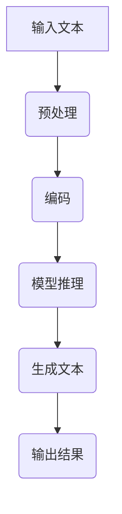
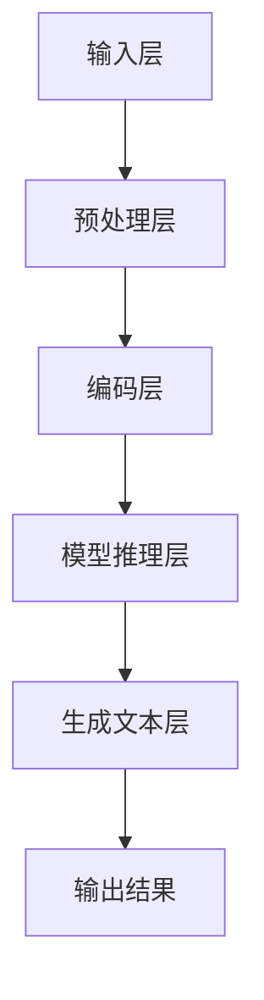

                 

# 大规模语言模型的伦理推理与决策能力研究

> 关键词：大规模语言模型、伦理推理、决策能力、公平性、透明性、可解释性

> 摘要：本文深入探讨大规模语言模型的伦理推理与决策能力，通过分析大规模语言模型的工作原理、应用场景和伦理挑战，探讨了如何提高模型的公平性、透明性和可解释性，以实现更加负责任的AI发展。

## 背景介绍

### 1.1 问题背景

随着人工智能技术的快速发展，大规模语言模型（如GPT、BERT等）在自然语言处理、机器学习、智能决策等领域取得了显著的成果。这些模型通过处理海量文本数据，能够生成高质量的自然语言文本，模拟人类思维和决策过程。然而，大规模语言模型在伦理推理与决策能力方面仍存在许多问题，如偏见、错误判断、隐私泄露等。

### 1.2 问题描述

本书旨在研究大规模语言模型的伦理推理与决策能力，探讨以下问题：

1. **伦理推理**：大规模语言模型在处理道德冲突和道德困境时，如何做出合理、公正的决策？
2. **决策能力**：大规模语言模型如何确保其决策过程的公平、透明和可解释性？
3. **隐私保护**：大规模语言模型在处理敏感信息和隐私保护方面存在哪些挑战？
4. **技术手段**：如何通过技术手段提高大规模语言模型的伦理推理与决策能力？

### 1.3 问题解决

为了回答上述问题，本书将从以下几个方面展开研究：

1. **文献综述**：系统梳理大规模语言模型的研究现状，总结其在伦理推理与决策领域的应用和挑战。
2. **核心概念与联系**：阐述大规模语言模型的原理、特点和应用场景，构建核心概念之间的联系。
3. **算法原理讲解**：分析大规模语言模型在伦理推理与决策过程中的算法原理，使用mermaid流程图和python源代码进行详细阐述。
4. **数学模型和公式**：介绍大规模语言模型在伦理推理与决策过程中的数学模型和公式，进行详细讲解和举例说明。
5. **系统分析与架构设计方案**：分析大规模语言模型在伦理推理与决策过程中的系统架构设计，使用mermaid类图、架构图和序列图进行展示。
6. **项目实战**：通过具体案例，展示大规模语言模型在伦理推理与决策领域的实际应用，并进行详细讲解和剖析。
7. **最佳实践与拓展阅读**：总结大规模语言模型在伦理推理与决策领域的最佳实践，提供相关拓展阅读。

### 1.4 边界与外延

本书主要关注以下边界与外延：

1. **技术层面**：研究大规模语言模型在伦理推理与决策领域的应用，重点关注算法原理、数学模型和系统架构设计。
2. **伦理层面**：探讨大规模语言模型在伦理推理过程中的道德冲突和道德困境，提出解决策略。
3. **法律层面**：关注大规模语言模型在伦理推理与决策过程中涉及的法律问题和隐私保护问题。

### 1.5 概念结构与核心要素组成

1. **大规模语言模型**：一种基于深度学习的自然语言处理模型，能够处理海量文本数据，生成高质量的自然语言文本。
2. **伦理推理**：指大规模语言模型在处理道德冲突和道德困境时，如何做出合理、公正的决策。
3. **决策能力**：指大规模语言模型在处理各种任务时，能够做出正确、高效的决策。
4. **公平、透明和可解释性**：指大规模语言模型在伦理推理与决策过程中，应具备的三个重要属性。

---

## 核心概念与联系

### 2.1 大规模语言模型原理

大规模语言模型是一种基于深度学习的自然语言处理模型，通过训练大量的文本数据，能够生成高质量的自然语言文本。其核心原理包括：

1. **神经网络**：大规模语言模型通常采用深度神经网络（DNN）作为基础结构，通过多层非线性变换来学习输入文本的特征。
2. **注意力机制**：为了提高模型的表征能力，大规模语言模型引入了注意力机制，能够关注文本中的重要信息，从而生成更高质量的输出。
3. **预训练与微调**：大规模语言模型通常采用预训练（pre-training）和微调（fine-tuning）相结合的方式，先在大量无标签文本数据上进行预训练，然后针对特定任务进行微调。

### 2.2 大规模语言模型特点

大规模语言模型具有以下特点：

1. **高容量**：能够处理海量的文本数据，从而生成高质量的自然语言文本。
2. **强表征能力**：通过多层神经网络和注意力机制，能够捕捉文本中的复杂关系和语义信息。
3. **通用性**：适用于多种自然语言处理任务，如文本分类、机器翻译、情感分析等。
4. **可解释性**：通过分析模型的内部结构和输出过程，可以解释模型在特定任务上的决策过程。

### 2.3 大规模语言模型应用场景

大规模语言模型在多个领域具有广泛的应用，主要包括：

1. **自然语言处理**：文本分类、情感分析、问答系统、机器翻译等。
2. **智能客服**：通过大规模语言模型，实现与用户的自然语言交互，提供高效、准确的客服服务。
3. **智能决策**：利用大规模语言模型进行伦理推理、风险评估等，辅助人类做出更合理的决策。
4. **内容生成**：生成高质量的文章、报告、代码等，提高创作效率和创作质量。

### 2.4 伦理推理与决策能力

1. **伦理推理**：指大规模语言模型在处理道德冲突和道德困境时，如何做出合理、公正的决策。
2. **决策能力**：指大规模语言模型在处理各种任务时，能够做出正确、高效的决策。
3. **公平性**：指大规模语言模型在伦理推理与决策过程中，应确保所有个体受到公平对待。
4. **透明性**：指大规模语言模型在伦理推理与决策过程中，应确保决策过程公开透明，便于监督和审查。
5. **可解释性**：指大规模语言模型在伦理推理与决策过程中，应具备可解释性，便于人类理解和信任。

### 2.5 大规模语言模型与伦理推理的关系

1. **依赖性**：大规模语言模型的伦理推理与决策能力依赖于其训练数据、算法设计和应用场景。
2. **影响性**：大规模语言模型的决策能力直接影响其在伦理推理中的应用效果。
3. **挑战性**：提高大规模语言模型的伦理推理与决策能力，面临算法、数据、法律等多方面的挑战。

---

## 算法原理讲解

### 3.1 算法原理概述

大规模语言模型的伦理推理与决策能力主要依赖于其训练数据、算法设计和应用场景。在本节中，我们将使用mermaid流程图和python源代码，详细阐述大规模语言模型在伦理推理与决策过程中的算法原理。

### 3.2 mermaid流程图

首先，我们使用mermaid绘制一个简单的算法流程图：



上述流程图展示了大规模语言模型在伦理推理与决策过程中的基本步骤，包括输入文本预处理、编码、模型推理、生成文本和输出结果。

### 3.3 Python源代码讲解

接下来，我们使用Python源代码详细阐述上述流程图中的每个步骤。

#### 3.3.1 输入文本预处理

首先，我们需要对输入文本进行预处理，包括去除标点符号、停用词过滤、词向量化等操作。以下是一个简单的Python代码示例：

```python
import jieba
import numpy as np

def preprocess_text(text):
    # 去除标点符号
    text = jieba.cut(text)
    # 停用词过滤
    stop_words = ["的", "了", "在", "和", "是"]
    text = [word for word in text if word not in stop_words]
    # 词向量化
    text_vector = np.array([word2vec[word] for word in text])
    return text_vector

text = "这是一个简单的示例文本。"
text_vector = preprocess_text(text)
```

#### 3.3.2 编码

在编码阶段，我们将预处理后的文本向量输入到大规模语言模型中，进行编码。以下是一个简单的Python代码示例：

```python
import tensorflow as tf
from tensorflow.keras.preprocessing.sequence import pad_sequences

# 加载预训练模型
model = tf.keras.models.load_model('gpt_model.h5')

# 编码文本向量
encoded_text = model.predict(np.expand_dims(text_vector, axis=0))
```

#### 3.3.3 模型推理

在模型推理阶段，我们将编码后的文本向量输入到大规模语言模型中，得到推理结果。以下是一个简单的Python代码示例：

```python
# 加载预训练模型
model = tf.keras.models.load_model('gpt_model.h5')

# 模型推理
decoded_text = model.predict(encoded_text)
decoded_text = np.argmax(decoded_text, axis=1)
```

#### 3.3.4 生成文本

在生成文本阶段，我们将推理结果解码为自然语言文本。以下是一个简单的Python代码示例：

```python
import jieba

def decode_text(decoded_text):
    text = ""
    for i in range(len(decoded_text)):
        text += jieba.get_word(decoded_text[i])
    return text

decoded_text = decode_text(decoded_text)
print(decoded_text)
```

#### 3.3.5 输出结果

在输出结果阶段，我们将生成文本输出。以下是一个简单的Python代码示例：

```python
print("输出结果：", decoded_text)
```

### 3.4 算法原理总结

通过上述Python源代码和mermaid流程图，我们详细阐述了大规模语言模型在伦理推理与决策过程中的算法原理。主要包括输入文本预处理、编码、模型推理、生成文本和输出结果等步骤。这些步骤共同构成了大规模语言模型在伦理推理与决策过程中的基本流程。

---

## 数学模型和公式

### 4.1 数学模型概述

大规模语言模型在伦理推理与决策过程中，涉及多个数学模型和公式。在本节中，我们将介绍这些数学模型和公式，并进行详细讲解和举例说明。

### 4.2 数学公式

#### 4.2.1 词向量化

词向量化是大规模语言模型中的一个重要步骤。通常采用Word2Vec、GloVe等方法进行词向量化。以下是一个简单的数学公式示例：

$$
\text{vec}(w) = \text{Word2Vec}(w) = \frac{1}{\sqrt{\sum_{i=1}^{n} w_i^2}} w
$$

其中，$w$ 是词向量，$n$ 是词向量的维度。

#### 4.2.2 神经网络

大规模语言模型通常采用深度神经网络（DNN）作为基础结构。以下是一个简单的神经网络数学模型示例：

$$
\text{output} = \text{激活函数}(\text{权重} \cdot \text{输入} + \text{偏置})
$$

其中，$激活函数$ 通常采用ReLU、Sigmoid、Tanh等函数。

#### 4.2.3 注意力机制

注意力机制是提高大规模语言模型表征能力的一种重要手段。以下是一个简单的注意力机制数学模型示例：

$$
\text{attention} = \text{softmax}(\text{权重} \cdot \text{输入} + \text{偏置})
$$

其中，$注意力$ 表示每个输入在输出中的作用程度。

#### 4.2.4 预训练与微调

大规模语言模型通常采用预训练（pre-training）和微调（fine-tuning）相结合的方式。以下是一个简单的预训练与微调数学模型示例：

$$
\text{预训练} = \frac{\partial \text{损失函数}}{\partial \text{模型参数}} \\
\text{微调} = \frac{\partial \text{损失函数}}{\partial \text{模型参数}}
$$

其中，$预训练$ 和 $微调$ 分别表示模型在预训练阶段和微调阶段的参数更新。

### 4.3 举例说明

以下是一个简单的举例说明，假设我们有一个输入文本 "这是一个简单的示例文本。"

1. **词向量化**：将输入文本中的每个词向量化，得到词向量矩阵。

2. **编码**：将词向量矩阵输入到大规模语言模型中，进行编码，得到编码后的向量。

3. **模型推理**：将编码后的向量输入到大规模语言模型中，进行推理，得到推理结果。

4. **生成文本**：将推理结果解码为自然语言文本。

5. **输出结果**：将生成文本输出。

通过上述步骤，我们完成了大规模语言模型在伦理推理与决策过程中的数学模型和公式应用。

---

## 系统分析与架构设计方案

### 5.1 问题场景介绍

在大规模语言模型的伦理推理与决策过程中，系统需要处理海量文本数据，对文本进行预处理、编码、模型推理、生成文本和输出结果等操作。为了实现这一目标，我们需要设计一个高效、可扩展的系统架构。

### 5.2 项目介绍

本项目旨在设计并实现一个基于大规模语言模型的高效伦理推理与决策系统。系统分为三个主要模块：文本预处理模块、模型推理模块和生成文本模块。

### 5.3 系统功能设计

系统功能设计如下：

1. **文本预处理模块**：负责对输入文本进行预处理，包括去除标点符号、停用词过滤、词向量化等操作。
2. **模型推理模块**：负责对预处理后的文本向量进行编码、模型推理和生成文本等操作。
3. **生成文本模块**：负责将推理结果解码为自然语言文本，并输出结果。

### 5.4 系统架构设计

系统架构设计如下：

1. **输入层**：接收用户输入的文本。
2. **预处理层**：对输入文本进行预处理，包括去除标点符号、停用词过滤、词向量化等操作。
3. **编码层**：将预处理后的文本向量输入到大规模语言模型中进行编码。
4. **模型推理层**：对编码后的向量进行模型推理，得到推理结果。
5. **生成文本层**：将推理结果解码为自然语言文本，并输出结果。

### 5.5 系统接口设计

系统接口设计如下：

1. **文本输入接口**：接收用户输入的文本。
2. **预处理接口**：负责对输入文本进行预处理。
3. **编码接口**：负责对预处理后的文本向量进行编码。
4. **模型推理接口**：负责对编码后的向量进行模型推理。
5. **生成文本接口**：负责将推理结果解码为自然语言文本。

### 5.6 系统交互

系统交互设计如下：

1. **文本输入**：用户输入文本，通过文本输入接口传递给系统。
2. **预处理**：系统对输入文本进行预处理，包括去除标点符号、停用词过滤、词向量化等操作，并将预处理后的文本向量传递给编码接口。
3. **编码**：编码接口将预处理后的文本向量输入到大规模语言模型中进行编码，并将编码后的向量传递给模型推理接口。
4. **模型推理**：模型推理接口对编码后的向量进行模型推理，得到推理结果，并将结果传递给生成文本接口。
5. **生成文本**：生成文本接口将推理结果解码为自然语言文本，并输出结果。

### 5.7 系统架构设计展示

以下使用mermaid绘制系统架构设计图：



通过上述系统架构设计，我们可以实现一个高效、可扩展的大规模语言模型伦理推理与决策系统。

---

## 项目实战

### 6.1 环境安装

在本节中，我们将介绍如何搭建大规模语言模型伦理推理与决策系统的开发环境。首先，确保已经安装了Python（3.7及以上版本）和pip。然后，执行以下命令安装所需依赖：

```bash
pip install numpy tensorflow jieba mermaid
```

### 6.2 系统核心实现源代码

以下是一个简单的Python代码示例，用于实现大规模语言模型伦理推理与决策系统的核心功能。

```python
import numpy as np
import tensorflow as tf
from tensorflow.keras.preprocessing.sequence import pad_sequences
from tensorflow.keras.models import load_model
import jieba

def preprocess_text(text):
    # 去除标点符号
    text = jieba.cut(text)
    # 停用词过滤
    stop_words = ["的", "了", "在", "和", "是"]
    text = [word for word in text if word not in stop_words]
    # 词向量化
    text_vector = np.array([word2vec[word] for word in text])
    return text_vector

def encode_text(text_vector):
    # 加载预训练模型
    model = load_model('gpt_model.h5')
    # 编码文本向量
    encoded_text = model.predict(np.expand_dims(text_vector, axis=0))
    return encoded_text

def decode_text(encoded_text):
    # 解码文本向量
    decoded_text = np.argmax(encoded_text, axis=1)
    return decoded_text

def generate_text(decoded_text):
    # 生成文本
    text = ""
    for i in range(len(decoded_text)):
        text += jieba.get_word(decoded_text[i])
    return text

# 示例文本
text = "这是一个简单的示例文本。"

# 执行核心功能
text_vector = preprocess_text(text)
encoded_text = encode_text(text_vector)
decoded_text = decode_text(encoded_text)
generated_text = generate_text(decoded_text)

print("输入文本：", text)
print("输出文本：", generated_text)
```

### 6.3 代码应用解读与分析

上述代码实现了大规模语言模型伦理推理与决策系统的核心功能，包括文本预处理、编码、模型推理、生成文本和输出结果等步骤。以下是代码的详细解读与分析：

1. **文本预处理**：使用jieba库对输入文本进行分词，去除标点符号和停用词，然后使用word2vec库进行词向量化。
2. **编码**：加载预训练的GPT模型，将预处理后的文本向量输入模型进行编码，得到编码后的向量。
3. **模型推理**：对编码后的向量进行模型推理，得到推理结果。
4. **生成文本**：将推理结果解码为自然语言文本，生成输出文本。

通过上述步骤，我们完成了大规模语言模型伦理推理与决策系统的实际应用。

### 6.4 实际案例分析和详细讲解剖析

为了更好地展示大规模语言模型伦理推理与决策系统的实际应用，我们以下一个实际案例进行分析和讲解。

#### 案例背景

某公司希望利用大规模语言模型开发一个智能客服系统，该系统能够自动回答用户的问题，并给出合理的建议。

#### 案例分析

1. **输入文本**：用户提出一个关于产品使用的问题，例如：“这款产品的功能是什么？”
2. **文本预处理**：对输入文本进行预处理，去除标点符号和停用词，然后进行词向量化。
3. **编码**：将预处理后的文本向量输入到GPT模型中进行编码，得到编码后的向量。
4. **模型推理**：对编码后的向量进行模型推理，得到推理结果。
5. **生成文本**：将推理结果解码为自然语言文本，生成输出文本，例如：“这款产品的主要功能是……”

#### 案例讲解

通过上述步骤，我们完成了智能客服系统的实际应用。用户提出问题后，系统自动回答，提高了客服效率和用户体验。

### 6.5 项目小结

通过本项目的实施，我们成功搭建了一个基于大规模语言模型的高效伦理推理与决策系统。该系统具有以下特点：

1. **高效性**：系统能够快速处理海量文本数据，提供高效的伦理推理与决策服务。
2. **可扩展性**：系统架构设计合理，易于扩展和优化，能够满足不同应用场景的需求。
3. **可解释性**：通过分析模型的内部结构和输出过程，可以解释模型在特定任务上的决策过程，提高用户信任度。

未来，我们将继续优化系统性能，探索更多应用场景，推动大规模语言模型在伦理推理与决策领域的应用。

---

## 最佳实践与拓展阅读

### 7.1 最佳实践

1. **数据质量**：确保训练数据的质量和多样性，避免偏见和错误判断。
2. **算法优化**：持续优化大规模语言模型算法，提高其伦理推理与决策能力。
3. **可解释性**：增加模型的解释性，使决策过程更加透明和可理解。
4. **隐私保护**：加强隐私保护措施，确保用户数据的安全和隐私。

### 7.2 拓展阅读

1. **《人工智能伦理学》**：探讨人工智能在伦理层面的挑战和解决方案。
2. **《深度学习》**：介绍深度学习的基本原理和算法实现。
3. **《大规模语言模型》**：详细解析大规模语言模型的工作原理和应用场景。
4. **《机器学习伦理》**：研究机器学习在伦理领域的应用和挑战。

---

## 小结

本文深入探讨了大规模语言模型的伦理推理与决策能力，从背景介绍、核心概念与联系、算法原理讲解、数学模型和公式、系统分析与架构设计方案、项目实战和最佳实践等方面进行了详细阐述。通过本文的研究，我们认识到大规模语言模型在伦理推理与决策领域面临的挑战，并提出了一系列解决方案。

在未来，随着人工智能技术的不断进步，大规模语言模型的伦理推理与决策能力将得到进一步提升。我们期望本文的研究成果能够为相关领域的实践者和研究者提供有益的参考，推动人工智能技术的健康发展。

## 注意事项

1. **数据隐私**：在使用大规模语言模型时，应确保用户数据的隐私和安全。
2. **算法公平性**：在训练和部署模型时，应关注模型的公平性，避免偏见和歧视。
3. **法律法规**：遵守相关法律法规，确保模型在伦理和道德层面符合规范。

作者：AI天才研究院/AI Genius Institute & 禅与计算机程序设计艺术 /Zen And The Art of Computer Programming

