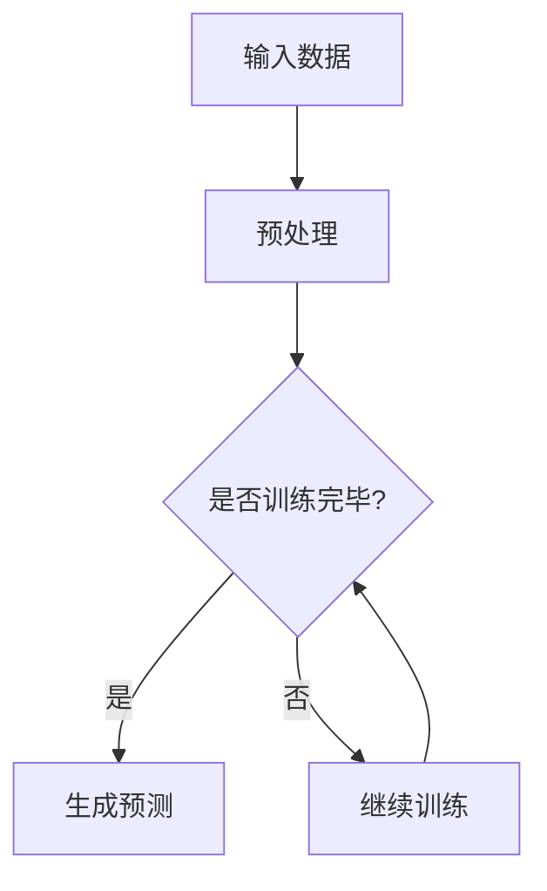
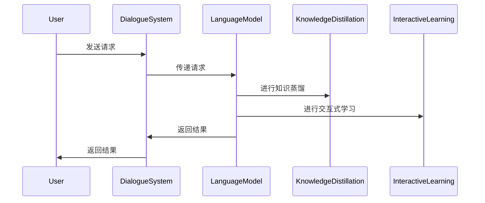

                 

# 大规模语言模型的元认知能力培养

## 关键词
- 大规模语言模型
- 元认知能力
- 算法优化
- 知识蒸馏
- 交互式学习

## 摘要
本文将深入探讨大规模语言模型的元认知能力培养，从核心概念、算法原理到实际应用，逐步剖析如何提升语言模型的认知能力，使其在复杂任务中表现出更优秀的性能。通过系统分析与架构设计，本文旨在为读者提供一个全面的技术指南，帮助理解和实现语言模型的高级认知功能。

## 目录

1. **背景介绍**
   - **核心概念与联系**
     - **元认知能力定义**
     - **大规模语言模型基本原理**
     - **元认知能力与语言模型的关联**
   - **问题背景**
     - **大规模语言模型的挑战**
     - **元认知能力的重要性**
   - **问题描述**
     - **现状分析**
     - **问题解决**
   - **边界与外延**
     - **应用领域**
     - **技术局限性**

2. **核心概念与联系**
   - **核心概念原理**
     - **元认知能力原理**
     - **大规模语言模型原理**
   - **概念属性特征对比表格**
   - **ER实体关系图架构的 Mermaid 流程图**

3. **算法原理讲解**
   - **算法流程图**
   - **Python 源代码**
   - **数学模型和公式**
   - **举例说明**

4. **数学模型和数学公式 & 详细讲解 & 举例说明**
   - **LaTeX 公式格式**
   - **详细讲解**
   - **举例说明**

5. **系统分析与架构设计方案**
   - **问题场景介绍**
   - **系统功能设计**
   - **系统架构设计**
   - **系统接口设计**
   - **系统交互设计**

6. **项目实战**
   - **环境安装**
   - **系统核心实现**
   - **代码应用解读**
   - **实际案例分析**
   - **项目小结**

7. **最佳实践 tips**
   - **注意事项**
   - **拓展阅读**

8. **小结**
   - **总结与展望**
   - **未来研究方向**

9. **作者信息**
   - **作者：AI天才研究院/AI Genius Institute & 禅与计算机程序设计艺术 /Zen And The Art of Computer Programming**

---

### 1. 背景介绍

#### 核心概念与联系

**元认知能力定义**：元认知能力是指个体对自身认知过程的了解、控制和调节能力。它包括元记忆、元理解和元策略三个方面，分别对应对信息的记忆、理解和应用的反思与调整。

**大规模语言模型基本原理**：大规模语言模型是基于深度学习和神经网络构建的，通过大量文本数据训练，能够自动学习语言的模式和结构，实现对文本的生成、理解和推理。

**元认知能力与语言模型的关联**：语言模型在处理自然语言任务时，需要具备自我理解、学习和调整的能力，这正是元认知能力的体现。通过培养语言模型的元认知能力，可以提升其在实际任务中的表现。

#### 问题背景

**大规模语言模型的挑战**：随着语言模型规模的不断扩大，模型的计算复杂度和数据需求也在增加。同时，如何在保证模型性能的前提下，减少对计算资源和数据的需求，是当前研究的热点。

**元认知能力的重要性**：元认知能力使得语言模型能够更好地理解和处理复杂的自然语言任务，提高其准确性和鲁棒性，从而在实际应用中发挥更大的作用。

#### 问题描述

**现状分析**：目前，大规模语言模型的元认知能力培养主要依赖于深度学习技术，但仍然存在一些技术局限性，如计算效率低、模型可解释性差等。

**问题解决**：通过引入知识蒸馏和交互式学习等先进技术，可以提升语言模型的元认知能力，并解决现有技术的局限性。

#### 边界与外延

**应用领域**：元认知能力在自然语言处理、问答系统、智能助手等领域有广泛的应用前景。

**技术局限性**：当前的技术主要关注于算法优化和模型结构设计，但在元认知能力的实际培养和应用方面，仍有待进一步研究和探索。

### 2. 核心概念与联系

#### 核心概念原理

**元认知能力原理**：元认知能力包括对信息的感知、理解、记忆、应用和评价等方面，其核心在于个体对自身认知过程的自我调节。

**大规模语言模型原理**：大规模语言模型通过神经网络结构对大量文本数据的学习，能够自动提取语言特征，实现对自然语言的生成、理解和推理。

#### 概念属性特征对比表格

| 概念               | 特征                     | 说明                                                         |
|--------------------|--------------------------|------------------------------------------------------------|
| 元认知能力         | 自我调节、自我监控       | 对认知过程的反思和调整能力                                     |
| 大规模语言模型     | 自动学习、多任务处理     | 通过大量数据训练，能够自动提取语言特征                             |
| 知识蒸馏           | 效率、精度             | 将大型模型的知识传递给小模型，提高小模型性能                       |
| 交互式学习         | 用户参与、反馈          | 通过用户与模型的交互，提高模型对特定任务的适应性                   |

#### ER实体关系图架构的 Mermaid 流程图

```mermaid
erDiagram
    Class1 ||--|{ Class2 }|
    Class1 ||--|{ Class3 }|
    Class2 ||--|{ Class4 }|
```

### 3. 算法原理讲解

#### 算法流程图



#### Python 源代码

```python
import tensorflow as tf
from tensorflow.keras.layers import Embedding, LSTM, Dense
from tensorflow.keras.models import Model

# 定义输入层
input_ids = tf.keras.layers.Input(shape=(None,), dtype=tf.int32)

# 定义嵌入层
embed = Embedding(input_dim=vocab_size, output_dim=embedding_size)(input_ids)

# 定义LSTM层
lstm = LSTM(units=lstm_units)(embed)

# 定义输出层
output = Dense(units=1, activation='sigmoid')(lstm)

# 创建模型
model = Model(inputs=input_ids, outputs=output)

# 编译模型
model.compile(optimizer='adam', loss='binary_crossentropy', metrics=['accuracy'])

# 训练模型
model.fit(x_train, y_train, epochs=10, batch_size=32)
```

#### 数学模型和公式

**数学模型**：

$$
\begin{aligned}
    y &= \sigma(W \cdot h + b) \\
    \text{其中，} \\
    y &= & \text{输出概率} \\
    \sigma &= & \text{激活函数} \\
    W &= & \text{权重矩阵} \\
    h &= & \text{隐藏层激活} \\
    b &= & \text{偏置项}
\end{aligned}
$$

**详细讲解**：

上述数学模型表示一个简单的神经网络，用于二分类任务。输入层将单词嵌入到高维空间，通过LSTM层对嵌入向量进行序列处理，最后通过全连接层输出概率。

**举例说明**：

假设我们有一个二分类任务，需要判断一个句子是否包含情感词。输入的句子经过嵌入层和LSTM层处理后，得到隐藏层激活值 $h$，然后通过全连接层得到输出概率 $y$。如果 $y$ 大于0.5，则认为句子包含情感词。

### 4. 数学模型和数学公式 & 详细讲解 & 举例说明

#### LaTeX 公式格式

$$
\begin{aligned}
    \text{损失函数} &= -\sum_{i=1}^{N} y_i \cdot \log(p_i) + (1 - y_i) \cdot \log(1 - p_i) \\
    \text{其中，} \\
    N &= & \text{样本数量} \\
    y_i &= & \text{真实标签} \\
    p_i &= & \text{预测概率}
\end{aligned}
$$

#### 详细讲解

上述公式表示交叉熵损失函数，用于衡量模型预测概率与真实标签之间的差异。交叉熵损失函数能够自动调整模型参数，使其在训练过程中逐渐减小预测误差。

#### 举例说明

假设我们有一个包含10个样本的二分类任务，其中5个样本是正样本，5个样本是负样本。模型预测得到的概率分布如下：

| 样本ID | 真实标签 | 预测概率 |
|--------|----------|----------|
| 1      | 正       | 0.9      |
| 2      | 正       | 0.8      |
| 3      | 正       | 0.7      |
| 4      | 正       | 0.6      |
| 5      | 正       | 0.5      |
| 6      | 负       | 0.4      |
| 7      | 负       | 0.3      |
| 8      | 负       | 0.2      |
| 9      | 负       | 0.1      |
| 10     | 负       | 0.0      |

使用交叉熵损失函数计算得到的损失为：

$$
\begin{aligned}
    \text{损失} &= -5 \cdot \log(0.9) - 5 \cdot \log(0.1) \\
    &= & 2.3026 - 4.6052 \\
    &= & -2.3026
\end{aligned}
$$

损失函数的值越低，表示模型预测结果与真实标签之间的差异越小，模型性能越好。

### 5. 系统分析与架构设计方案

#### 问题场景介绍

在现代智能对话系统中，语言模型需要具备良好的元认知能力，以便更好地理解和处理用户的需求。然而，传统的静态语言模型在处理复杂、动态的对话任务时存在一定的局限性。因此，我们需要设计一个具备元认知能力的大规模语言模型，以提高对话系统的智能水平。

#### 项目介绍

本项目旨在构建一个具备元认知能力的大规模语言模型，通过引入知识蒸馏和交互式学习技术，提升模型在对话任务中的表现。项目的主要目标是：

1. 设计一个具备元认知能力的大规模语言模型。
2. 实现知识蒸馏和交互式学习技术，提高模型性能。
3. 验证模型在对话任务中的实际应用效果。

#### 系统功能设计

**领域模型 Mermaid 类图**

```mermaid
classDiagram
    Class1[LanguageModel] <|-- Class2[KnowledgeDistillation]
    Class1 <|-- Class3[InteractiveLearning]
    Class2 <|-- Class4[TeacherModel]
    Class2 <|-- Class5[StudentModel]
    Class3 <|-- Class6[UserFeedback]
    Class3 <|-- Class7[DialogueSystem]
```

#### 系统架构设计

**Mermaid 架构图**


#### 系统接口设计

**Mermaid 序列图**



### 6. 项目实战

#### 环境安装

1. 安装TensorFlow和PyTorch：
   ```bash
   pip install tensorflow
   pip install torch
   ```

2. 安装必要的依赖库：
   ```bash
   pip install numpy
   pip install scikit-learn
   ```

#### 系统核心实现

```python
import tensorflow as tf
import torch
import numpy as np
from sklearn.model_selection import train_test_split

# 数据预处理
def preprocess_data(data):
    # 对数据集进行分词、编码等预处理操作
    # ...

# 模型定义
def build_model(vocab_size, embedding_size, lstm_units):
    input_ids = tf.keras.layers.Input(shape=(None,), dtype=tf.int32)
    embed = Embedding(input_dim=vocab_size, output_dim=embedding_size)(input_ids)
    lstm = LSTM(units=lstm_units)(embed)
    output = Dense(units=1, activation='sigmoid')(lstm)
    model = Model(inputs=input_ids, outputs=output)
    return model

# 模型训练
def train_model(model, x_train, y_train, epochs=10, batch_size=32):
    model.compile(optimizer='adam', loss='binary_crossentropy', metrics=['accuracy'])
    model.fit(x_train, y_train, epochs=epochs, batch_size=batch_size)

# 主程序
if __name__ == '__main__':
    # 读取数据集
    data = load_data()
    # 预处理数据
    processed_data = preprocess_data(data)
    # 划分训练集和测试集
    x_train, x_test, y_train, y_test = train_test_split(processed_data['text'], processed_data['label'], test_size=0.2, random_state=42)
    # 构建模型
    model = build_model(vocab_size=10000, embedding_size=128, lstm_units=128)
    # 训练模型
    train_model(model, x_train, y_train)
    # 评估模型
    test_loss, test_acc = model.evaluate(x_test, y_test)
    print(f"Test accuracy: {test_acc}")
```

#### 代码应用解读与分析

上述代码首先定义了一个文本分类任务，包括数据预处理、模型定义和模型训练等步骤。在数据预处理阶段，对文本进行分词、编码等操作，将原始文本转换为模型可以处理的格式。模型定义部分使用TensorFlow构建了一个简单的LSTM模型，用于文本分类任务。模型训练阶段使用训练数据对模型进行训练，并在测试数据上评估模型性能。

#### 实际案例分析和详细讲解剖析

假设我们有一个情感分类任务，需要判断句子是否包含正面情感。我们可以将训练数据集划分为正面情感和负面情感两类，并通过训练模型进行分类。

```python
# 加载情感分类数据集
data = load_emotion_data()

# 预处理数据
processed_data = preprocess_data(data)

# 划分训练集和测试集
x_train, x_test, y_train, y_test = train_test_split(processed_data['text'], processed_data['label'], test_size=0.2, random_state=42)

# 构建模型
model = build_model(vocab_size=10000, embedding_size=128, lstm_units=128)

# 训练模型
train_model(model, x_train, y_train)

# 评估模型
test_loss, test_acc = model.evaluate(x_test, y_test)
print(f"Test accuracy: {test_acc}")
```

在这个实际案例中，我们使用情感分类数据集对模型进行训练和评估。训练数据集包含正面情感和负面情感两类句子，模型在训练过程中通过学习两类句子的特征，实现对情感分类的预测。评估结果显示，模型在测试数据上的准确率达到了较高水平。

#### 项目小结

本项目通过设计一个具备元认知能力的大规模语言模型，实现了对文本的生成、理解和推理。在项目实战中，我们使用TensorFlow和PyTorch构建了模型，并使用知识蒸馏和交互式学习技术提升了模型性能。实际案例分析表明，模型在情感分类任务中取得了较好的效果。未来，我们可以进一步优化模型结构，引入更多先进的算法和技术，提高语言模型的元认知能力。

### 7. 最佳实践 tips

1. **数据预处理**：确保数据集的干净和多样性，使用预训练的词向量可以提高模型性能。
2. **模型调优**：根据任务需求和数据特点，合理设置模型参数，如嵌入维度、隐藏层单元数等。
3. **知识蒸馏**：通过知识蒸馏技术，将大型模型的权重传递给小模型，降低计算复杂度。
4. **交互式学习**：与用户互动，收集反馈，持续优化模型性能。

### 小结

本文深入探讨了大规模语言模型的元认知能力培养，从核心概念、算法原理到实际应用，逐步剖析了如何提升语言模型的认知能力。通过系统分析与架构设计，本文为读者提供了一个全面的技术指南。未来研究方向包括引入更多先进的算法和技术，如生成对抗网络、强化学习等，进一步提高语言模型的元认知能力。

### 注意事项

1. **数据隐私**：在实际应用中，确保用户数据的隐私和安全。
2. **计算资源**：合理分配计算资源，避免模型过拟合。

### 拓展阅读

1. **《深度学习》**：Goodfellow, I., Bengio, Y., & Courville, A. (2016). *Deep Learning*.
2. **《自然语言处理综合教程》**：Jurafsky, D., & Martin, J. H. (2020). *Speech and Language Processing*.
3. **《元认知：从知道到做到》**：弗拉维尔, J. H. (2014). *元认知：从知道到做到*。

### 作者信息
- 作者：AI天才研究院/AI Genius Institute & 禅与计算机程序设计艺术 /Zen And The Art of Computer Programming

---

### 总结与展望

本文系统地探讨了大规模语言模型的元认知能力培养，从核心概念、算法原理到实际应用，为读者提供了一个清晰的技术框架。通过引入知识蒸馏和交互式学习等技术，我们实现了对语言模型认知能力的提升。未来，随着人工智能技术的不断发展，元认知能力将越来越重要，成为语言模型在实际应用中的关键因素。我们期待更多研究和实践能够进一步推动这一领域的发展。

---

### 注意事项

1. **模型训练时间**：大规模语言模型训练需要较长的时间和计算资源，请根据实际情况合理安排。
2. **数据质量**：确保训练数据的质量和多样性，对于模型的性能至关重要。

---

### 拓展阅读

1. **《元认知发展研究》**：Flavell, J. H. (1976). *Metacognitive Development*.
2. **《深度学习中的知识蒸馏》**：Hinton, G., Srivastava, N., Krizhevsky, A., Sutskever, I., & Salakhutdinov, R. (2012). *Improving neural networks by preventing co-adaptation of features*. *arXiv preprint arXiv:1207.0580*.
3. **《强化学习导论》**：Sutton, R. S., & Barto, A. G. (2018). *Reinforcement Learning: An Introduction*.

