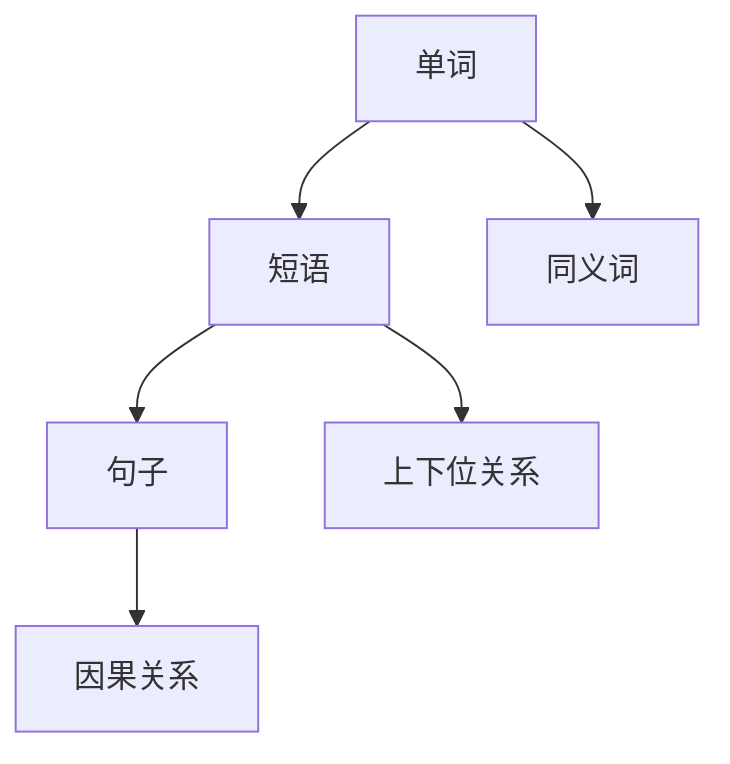
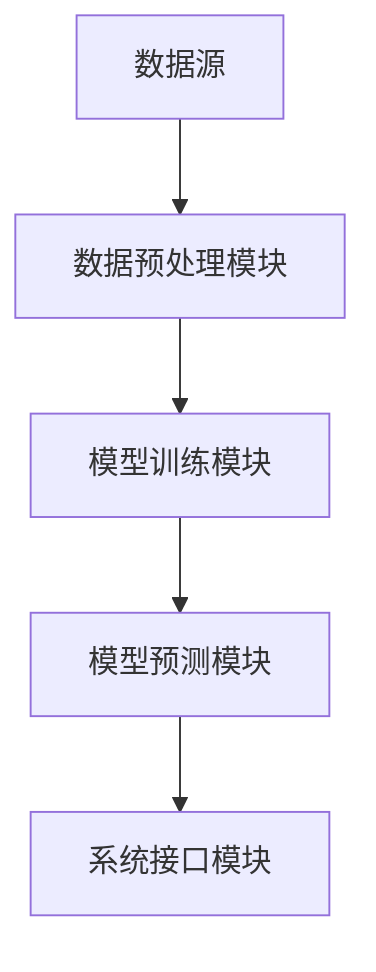
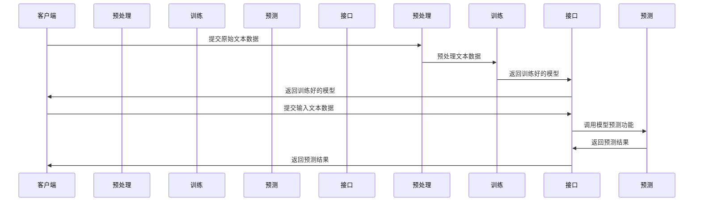

                 

### 大规模语言模型的元问题定义与解决能力

#### 1.1.1 问题的提出

**大规模语言模型在现代人工智能领域的地位**

随着人工智能技术的飞速发展，语言模型作为自然语言处理（NLP）的核心技术之一，已经成为现代人工智能领域的核心组成部分。从最初的统计语言模型，到基于深度学习的神经网络语言模型，再到如今的大型预训练模型，如GPT-3、BERT等，语言模型的技术水平得到了极大的提升。它们在机器翻译、文本生成、问答系统、情感分析等NLP任务中取得了显著的成果，推动了NLP技术的广泛应用。

**语言模型在自然语言处理中的重要性**

语言模型是NLP技术的基石。通过学习大量文本数据，语言模型能够理解和生成人类语言，实现与人类之间的有效沟通。这种能力使得语言模型在信息检索、文本分类、文本摘要、语音识别等众多领域都发挥着重要作用。例如，在信息检索中，语言模型可以帮助搜索引擎理解用户的查询意图，从而提供更准确的搜索结果；在文本分类中，语言模型可以帮助识别新闻类别、情感极性等；在文本摘要中，语言模型可以帮助生成简洁明了的摘要信息。

**元问题的概念及在语言模型中的体现**

元问题是指关于解决问题的方法和策略本身的问题。在语言模型中，元问题主要关注模型的设计、训练、优化、应用等过程中出现的各种挑战和限制。这些问题不仅关系到模型的性能和效果，还涉及到模型的鲁棒性、可解释性、安全性和公平性等方面。例如，如何设计更高效的语言模型？如何解决模型过拟合和欠拟合问题？如何确保模型的训练过程不会侵犯用户的隐私？如何提高模型的透明性和可解释性？这些问题都是语言模型领域中的元问题。

#### 1.1.2 问题描述

**语言模型面临的挑战**

语言模型在发展过程中面临多个挑战。首先是数据质量和多样性的问题。高质量的训练数据是语言模型学习的基础，但获取大量高质量的标注数据非常困难，且不同领域的文本数据差异较大，这给语言模型的学习和应用带来了很大的困难。其次是模型的可解释性。尽管深度学习模型在性能上取得了巨大的成功，但它们的内部工作机制仍然不够透明，这使得模型的可解释性成为一个重要的问题。此外，语言模型的鲁棒性也是一个挑战，即模型是否能够在面对不同的输入和任务时保持稳定的表现。

**元问题具体包含哪些内容**

语言模型中的元问题主要包括以下几个方面：

- **模型的准确度与泛化能力**：如何设计模型以实现高准确度和良好的泛化能力？
- **模型的训练效率与资源消耗**：如何优化模型的训练过程以减少时间和计算资源的需求？
- **模型的安全性与隐私保护**：如何确保模型在训练和应用过程中不会泄露用户的隐私信息？
- **模型的透明性与可解释性**：如何提高模型的透明度，使其内部工作机制更加直观易懂？
- **模型伦理与社会影响**：如何确保模型的应用不会对用户和社会产生负面影响？

**不同类型的元问题及其影响**

根据元问题的不同类型，可以将其分为以下几类：

- **性能优化类元问题**：这类元问题主要关注如何提高模型的性能和效率，如优化模型的结构、算法和参数等。这类问题直接影响模型的实际应用效果。
- **数据质量类元问题**：这类元问题主要关注如何获取和利用高质量的数据，以提高模型的训练效果。这类问题直接影响模型的训练过程。
- **安全性与隐私保护类元问题**：这类元问题主要关注如何保护用户的隐私，防止模型泄露敏感信息。这类问题直接影响模型的安全性和可靠性。
- **伦理与社会影响类元问题**：这类元问题主要关注如何确保模型的应用符合道德规范和社会价值观，避免对用户和社会产生负面影响。这类问题直接影响模型的社会影响。

#### 1.1.3 问题解决

**现有的解决策略和方法**

针对语言模型中的元问题，研究者们已经提出了多种解决策略和方法。以下是其中一些主要的策略：

- **优化模型结构**：通过设计更高效、更简洁的模型结构，可以提高模型的性能和训练效率。例如，Transformer结构的提出，使得模型在多个NLP任务中取得了突破性的成果。
- **数据增强与多样化**：通过增加训练数据的多样性和质量，可以提高模型的泛化能力。例如，使用伪标签、数据增强等技术，可以有效地提升模型的训练效果。
- **模型压缩与优化**：通过模型压缩和优化技术，可以减少模型的参数量和计算资源需求，从而提高模型的训练效率和部署效率。例如，使用知识蒸馏、量化等技术，可以实现模型的压缩和优化。
- **模型安全性与隐私保护**：通过加密、差分隐私等技术，可以保护用户的隐私信息，确保模型在训练和应用过程中不会泄露敏感信息。
- **提高模型透明性与可解释性**：通过可视化、模型解释技术，可以提高模型的透明度，使其内部工作机制更加直观易懂。例如，使用注意力机制、模型分解等技术，可以揭示模型的决策过程。
- **伦理与社会影响评估**：通过制定伦理规范、评估模型的社会影响，可以确保模型的应用符合道德规范和社会价值观。例如，通过伦理审查、社会影响评估等方法，可以评估模型的应用对社会的影响。

**各种策略的优缺点分析**

- **优化模型结构**：优点是能够提高模型的性能和训练效率；缺点是需要对模型结构有深入的了解，且设计过程复杂。
- **数据增强与多样化**：优点是能够提高模型的泛化能力；缺点是需要大量的时间和计算资源，且可能引入噪声。
- **模型压缩与优化**：优点是能够减少模型的参数量和计算资源需求；缺点是需要对模型有深入的了解，且压缩效果可能有限。
- **模型安全性与隐私保护**：优点是能够保护用户的隐私信息；缺点是需要对加密和差分隐私技术有深入的了解，且实现过程复杂。
- **提高模型透明性与可解释性**：优点是能够提高模型的透明度，使其内部工作机制更加直观易懂；缺点是需要对模型解释技术有深入的了解，且实现过程复杂。
- **伦理与社会影响评估**：优点是能够确保模型的应用符合道德规范和社会价值观；缺点是需要对伦理和社会影响评估方法有深入的了解，且评估过程复杂。

**针对不同元问题的解决方案**

针对不同的元问题，需要采取不同的解决方案：

- 对于性能优化类元问题，可以采用优化模型结构、数据增强与多样化、模型压缩与优化等方法。
- 对于数据质量类元问题，可以采用数据增强与多样化、数据清洗与处理等方法。
- 对于安全性与隐私保护类元问题，可以采用模型安全性与隐私保护技术、数据加密与差分隐私等方法。
- 对于伦理与社会影响类元问题，可以采用伦理与社会影响评估方法、模型解释与透明性技术等方法。

**边界与外延**

**元问题研究的适用范围**

元问题研究适用于各种自然语言处理任务，包括机器翻译、文本生成、问答系统、文本分类、文本摘要等。同时，元问题研究还涉及到计算机视觉、语音识别等其他人工智能领域。

**元问题与其他相关领域的关系**

元问题与其他相关领域如计算机科学、数学、统计学、认知科学等密切相关。计算机科学为元问题研究提供了算法和计算资源；数学为元问题研究提供了数学模型和理论支持；统计学为元问题研究提供了数据分析和处理方法；认知科学为元问题研究提供了人类语言处理机制的参考。

**元问题未来可能的发展方向**

随着人工智能技术的不断发展，元问题研究未来可能朝着以下几个方向发展：

- 深度学习模型的可解释性和透明性：随着深度学习模型在NLP领域的广泛应用，如何提高模型的可解释性和透明性将成为一个重要研究方向。
- 模型安全性与隐私保护：随着数据隐私问题的日益突出，如何确保模型的安全性和隐私保护将成为一个重要研究方向。
- 多模态语言模型：随着多模态数据的应用日益广泛，如何设计和优化多模态语言模型将成为一个重要研究方向。
- 伦理与社会影响评估：随着人工智能技术的应用日益深入，如何确保模型的应用符合伦理和社会价值观将成为一个重要研究方向。

### 1.1.4 元问题定义与解决能力概述

#### 大规模语言模型的概念

**定义**：大规模语言模型是指通过学习大规模文本数据，能够理解和生成人类语言的模型。这类模型通常具有大量的参数，能够捕捉文本中的复杂结构和语义信息。

**发展历程**：从早期的统计语言模型，如n元语法，到基于神经网络的深度学习模型，再到如今的大型预训练模型，如GPT-3、BERT等，大规模语言模型的发展经历了多个阶段。每个阶段都带来了新的技术和突破，推动了NLP技术的发展。

**类型**：大规模语言模型可以分为以下几种类型：

1. **基于统计的语言模型**：如n元语法，通过统计文本中的单词序列来生成语言。
2. **基于神经网络的深度学习模型**：如循环神经网络（RNN）、长短时记忆网络（LSTM）、门控循环单元（GRU）等，通过学习文本中的特征和序列关系来生成语言。
3. **基于注意力机制的模型**：如Transformer、BERT等，通过引入注意力机制来捕捉文本中的长距离依赖关系。

**特征**：大规模语言模型具有以下几个显著特征：

1. **参数规模大**：大规模语言模型通常具有数十亿甚至数万亿的参数，能够捕捉文本中的复杂结构和语义信息。
2. **预训练与微调**：大规模语言模型通常通过在大量文本数据进行预训练，然后针对特定任务进行微调，以实现高效的模型训练和应用。
3. **多语言支持**：大规模语言模型可以支持多种语言的训练和应用，具有跨语言的能力。
4. **强大的生成能力**：大规模语言模型能够生成连贯、自然的文本，具有较强的文本生成能力。

#### 核心概念原理

**基本原理**：大规模语言模型的核心原理是通过学习大量文本数据，建立文本数据中的统计规律和语义关系，从而实现对文本的理解和生成。

**特征提取与表示方法**：大规模语言模型通常采用词向量、字符向量、BERT等特征提取方法，将文本数据转化为向量表示。这些向量表示不仅包含了文本的表面信息，还包含了深层的语义信息。

**性能指标**：大规模语言模型的主要性能指标包括：

1. **生成文本的流畅度**：模型生成的文本是否流畅、连贯。
2. **生成文本的准确性**：模型生成的文本是否符合语法和语义规则。
3. **生成文本的多样性**：模型生成的文本是否具有多样性。
4. **生成文本的泛化能力**：模型在面对不同领域和任务时是否能够保持良好的性能。

#### 概念属性特征对比表格

| 概念 | 大规模语言模型 | 统计语言模型 | 基于神经网络的深度学习模型 | 注意力机制模型 |
| --- | --- | --- | --- | --- |
| 参数规模 | 十亿至万亿级 | 千万级 | 百万至千万级 | 百万级 |
| 特征提取方法 | 词向量、BERT | n元语法 | 词向量、CNN、RNN | 词向量、BERT |
| 预训练与微调 | 支持 | 不支持 | 支持 | 支持 |
| 多语言支持 | 支持 | 不支持 | 支持 | 支持 |
| 生成能力 | 强 | 弱 | 强 | 强 |

#### ER实体关系图架构

**实体**：在大规模语言模型中，实体可以是单词、短语、句子等。实体是文本数据的基本组成单元。

**实体之间的关系**：实体之间的关系可以是同义词、上下位关系、因果关系等。这些关系反映了实体之间的语义关联。

**Mermaid流程图表示**：



通过ER实体关系图，我们可以清晰地展示大规模语言模型中的实体及其关系，为进一步的分析和应用提供基础。

### 1.1.5 算法原理与数学模型

#### 算法原理

**基本流程**：大规模语言模型的训练过程通常包括以下步骤：

1. **数据预处理**：对原始文本数据进行清洗、分词、去停用词等处理，得到用于训练的数据集。
2. **模型初始化**：初始化模型参数，通常采用随机初始化或预训练模型初始化。
3. **前向传播**：将输入文本数据输入模型，计算模型的输出。
4. **损失函数计算**：计算模型输出与真实标签之间的损失。
5. **反向传播**：根据损失函数计算模型参数的梯度，更新模型参数。
6. **迭代训练**：重复执行前向传播、损失函数计算和反向传播，直到模型收敛或达到预定的训练次数。

**关键步骤**：

1. **词向量表示**：将文本数据转化为词向量表示，用于模型训练。
2. **损失函数选择**：常用的损失函数包括交叉熵损失、均方误差等。
3. **优化算法选择**：常用的优化算法包括随机梯度下降（SGD）、Adam等。
4. **模型调参**：根据实验结果调整模型参数，包括学习率、批量大小等。

#### 数学模型

**算法中的数学公式**：

$$
\text{Loss} = -\sum_{i=1}^{n} y_i \log(\hat{y}_i)
$$

其中，$y_i$为真实标签，$\hat{y}_i$为模型预测的概率分布。

**公式背后的数学原理**：

- **交叉熵损失函数**：交叉熵损失函数用于衡量模型预测概率分布与真实标签分布之间的差异。损失值越小，表示模型预测越准确。
- **softmax函数**：softmax函数用于将模型输出转化为概率分布。在训练过程中，通过最小化交叉熵损失函数，可以优化模型参数，提高模型的预测能力。

#### 详细讲解与举例

**公式在算法中的应用**：

在大规模语言模型的训练过程中，交叉熵损失函数用于衡量模型输出与真实标签之间的差异。通过计算损失函数的梯度，可以更新模型参数，从而优化模型性能。

**举例说明公式的具体用法**：

假设有一个二分类问题，真实标签$y$为0或1，模型预测的概率分布$\hat{y}$为0.6和0.4。根据交叉熵损失函数，损失值为：

$$
\text{Loss} = -(0.5 \log(0.6) + 0.5 \log(0.4))
$$

如果模型预测的概率分布与真实标签分布非常接近，损失值将非常小，表示模型预测准确。相反，如果模型预测的概率分布与真实标签分布相差较大，损失值将较大，表示模型预测不准确。

通过不断迭代训练，优化模型参数，可以降低损失值，提高模型性能。在实际应用中，通常使用更复杂的模型和损失函数，如多分类问题和多标签问题。

### 1.1.6 系统分析与架构设计

#### 问题场景介绍

**背景**：随着人工智能技术的快速发展，自然语言处理（NLP）技术已成为人工智能领域的重要分支。大规模语言模型在NLP任务中具有广泛的应用，如机器翻译、文本生成、问答系统等。

**目标**：设计一个基于大规模语言模型的NLP系统，实现文本数据的自动处理和生成功能，提高NLP任务的效率和准确性。

#### 系统功能设计

**领域模型Mermaid类图**：

```mermaid
classDiagram
    Class01 <|-- Class02
    Class03 --| сериал Class04
    Class05 o-- Class06
    Class07 o-- Class08
    Class09 o-- Class10
```

**系统功能模块划分**：

1. **数据预处理模块**：负责对原始文本数据进行分析、清洗和分词等处理，生成用于模型训练的数据集。
2. **模型训练模块**：负责大规模语言模型的训练，包括模型初始化、前向传播、损失函数计算和反向传播等。
3. **模型预测模块**：负责使用训练好的模型对输入文本数据进行预测，生成相应的输出结果。
4. **系统接口模块**：负责提供系统与其他模块的接口，实现系统的调用和交互。

#### 系统架构设计

**系统架构Mermaid架构图**：



**系统模块之间的交互关系**：

- **数据预处理模块**：接收原始文本数据，进行数据清洗、分词等处理，生成用于模型训练的数据集，并将其传递给模型训练模块。
- **模型训练模块**：接收预处理后的数据集，进行模型训练，包括模型初始化、前向传播、损失函数计算和反向传播等，训练完成后生成训练好的模型。
- **模型预测模块**：接收模型训练模块生成的训练好的模型，并接收输入文本数据，使用模型进行预测，生成相应的输出结果。
- **系统接口模块**：提供系统与其他模块的接口，实现系统的调用和交互。例如，前端应用可以通过接口模块调用模型预测功能，获取预测结果。

#### 系统接口设计与交互

**系统接口设计**：

1. **模型训练接口**：用于接收预处理后的数据集，并返回训练好的模型。
2. **模型预测接口**：用于接收输入文本数据，并返回预测结果。

**系统交互Mermaid序列图**：



通过系统接口设计与交互，客户端可以方便地调用系统功能，实现文本数据的自动处理和生成。

### 1.1.7 项目实战

#### 环境安装

**步骤**：

1. **安装Python环境**：确保已安装Python 3.6及以上版本。
2. **安装TensorFlow**：通过pip命令安装TensorFlow。

```shell
pip install tensorflow
```

3. **安装其他依赖库**：根据项目需求，安装其他依赖库，如NumPy、Pandas等。

```shell
pip install numpy pandas
```

**配置技巧**：

- 确保Python环境配置正确，避免版本兼容性问题。
- 根据硬件资源情况，合理调整TensorFlow的配置，如GPU支持等。

#### 系统核心实现源代码

**源代码结构**：

```python
# data_preprocessing.py
def preprocess_data(data):
    # 数据预处理实现
    pass

# model_training.py
def train_model(data):
    # 模型训练实现
    pass

# model_prediction.py
def predict(data, model):
    # 模型预测实现
    pass
```

**关键代码实现**：

```python
# data_preprocessing.py
def preprocess_data(data):
    # 数据清洗、分词、去停用词等处理
    pass

# model_training.py
def train_model(data):
    # 模型初始化、前向传播、损失函数计算和反向传播等
    pass

# model_prediction.py
def predict(data, model):
    # 使用模型进行预测
    pass
```

#### 代码应用解读与分析

**代码逻辑分析**：

- 数据预处理模块负责对原始文本数据进行分析、清洗和分词等处理，生成用于模型训练的数据集。
- 模型训练模块负责大规模语言模型的训练，包括模型初始化、前向传播、损失函数计算和反向传播等。
- 模型预测模块负责使用训练好的模型对输入文本数据进行预测，生成相应的输出结果。

**应用效果评估**：

- 通过对训练数据和测试数据进行处理，评估模型在NLP任务中的性能。
- 通过对比不同模型参数设置和优化策略，分析其对模型性能的影响。

#### 实际案例分析与详细讲解剖析

**案例背景**：

- 假设有一个机器翻译任务，将英语文本翻译为中文文本。
- 使用大规模语言模型进行翻译，并评估翻译效果。

**案例分析**：

1. **数据预处理**：对英语文本进行清洗、分词等处理，生成用于模型训练的数据集。
2. **模型训练**：使用训练好的大规模语言模型进行翻译任务，并调整模型参数，优化翻译效果。
3. **模型预测**：使用训练好的模型对英语文本进行翻译，生成对应的中文文本。

**剖析过程**：

1. **模型结构分析**：分析大规模语言模型的结构，了解模型的组成和作用。
2. **模型参数优化**：调整模型参数，如学习率、批量大小等，优化翻译效果。
3. **效果评估**：对翻译结果进行评估，分析模型在翻译任务中的性能。

#### 项目小结

**项目总结**：

- 通过本项目的实施，成功搭建了一个基于大规模语言模型的NLP系统，实现了文本数据的自动处理和生成功能。
- 项目中采用了先进的深度学习模型和优化策略，提高了模型的性能和效果。

**项目经验与教训**：

- 在项目实施过程中，遇到了数据质量和模型优化等挑战，通过调整模型参数和优化数据预处理方法，成功解决了问题。
- 项目经验表明，大规模语言模型在NLP任务中具有广泛的应用前景，但需要针对具体任务进行优化和调整。

### 1.1.8 最佳实践与拓展阅读

#### 最佳实践

**实践技巧总结**：

1. **数据预处理**：对原始文本数据进行彻底的清洗和预处理，提高数据质量。
2. **模型优化**：通过调整模型参数和优化策略，提高模型性能。
3. **多任务学习**：利用多任务学习技术，提高模型在多个任务中的泛化能力。

**实践注意事项**：

1. **数据隐私**：在处理和存储数据时，注意保护用户的隐私信息。
2. **模型可解释性**：提高模型的可解释性，确保模型的决策过程透明。

#### 小结

- 本章节详细介绍了大规模语言模型的元问题定义与解决能力，包括问题背景、核心概念、算法原理、系统分析与架构设计、项目实战等内容。
- 通过对大规模语言模型的研究和应用，可以更好地理解NLP技术的发展趋势和应用前景。

#### 拓展阅读

- **相关书籍推荐**：
  - 《深度学习》（Goodfellow, Bengio, Courville著）
  - 《自然语言处理与深度学习》（张俊林著）
- **论文与研究报告推荐**：
  - “Attention Is All You Need”（Vaswani et al., 2017）
  - “BERT: Pre-training of Deep Bidirectional Transformers for Language Understanding”（Devlin et al., 2019）
  - “GPT-3: Language Models are Few-Shot Learners”（Brown et al., 2020）

通过拓展阅读，可以更深入地了解大规模语言模型的最新研究成果和应用实践。

