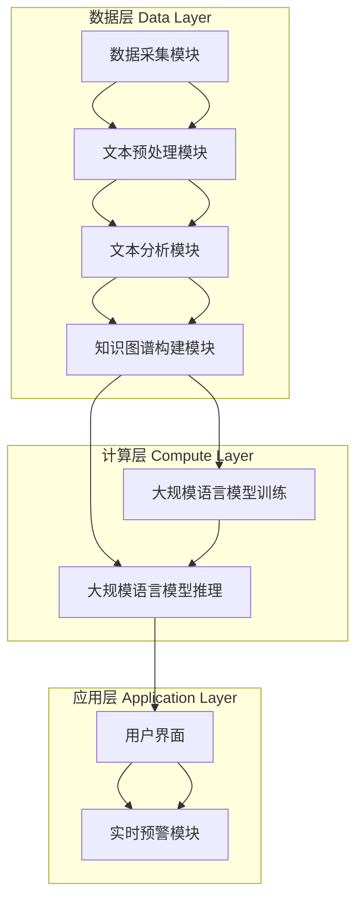
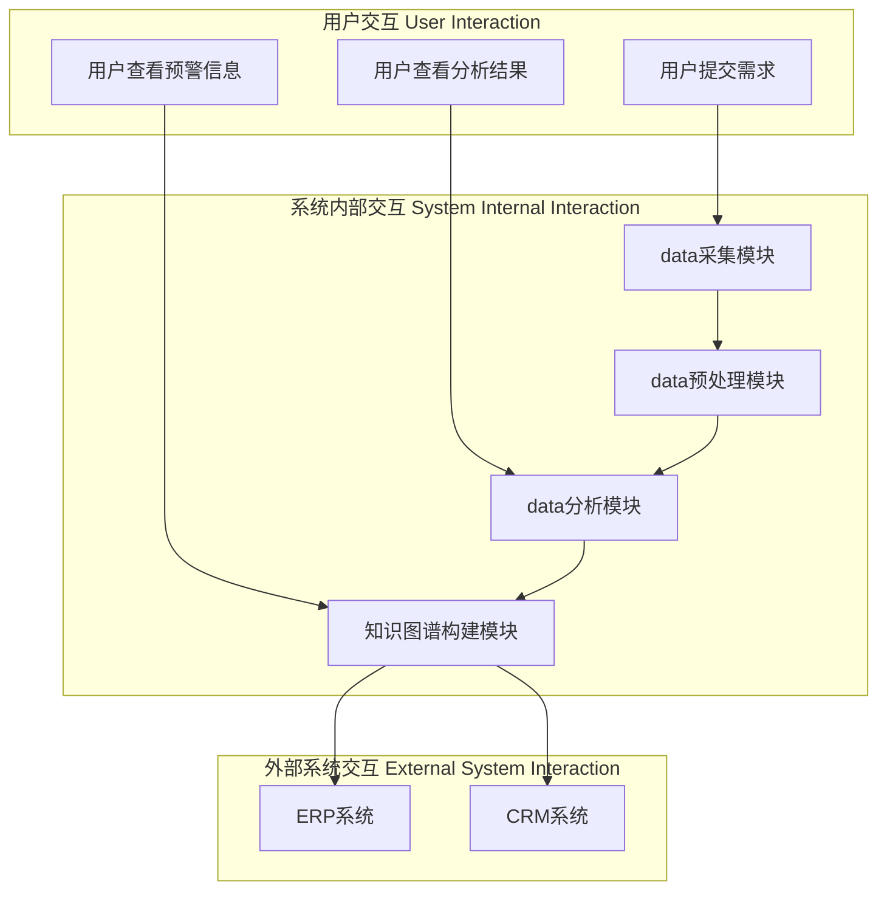

                 


## 引言

### 大规模语言模型的发展背景

大规模语言模型是自然语言处理（NLP）领域的一项前沿技术，其发展历程可以追溯到20世纪80年代。当时，研究者们开始尝试使用统计方法来预测文本序列中的下一个词，从而实现简单的语言建模。随着计算能力的提升和深度学习技术的发展，语言模型逐渐从基于规则的模型转变为基于神经网络的模型。特别是在2018年，OpenAI发布了GPT-2，这是第一个具有超过1.5亿参数的语言模型，标志着大规模语言模型的诞生。

大规模语言模型的崛起，源于其在各种NLP任务中的卓越表现。从文本分类、机器翻译到问答系统，大规模语言模型都展现出了强大的能力。同时，随着数据规模的不断扩大和计算资源的丰富，研究人员开始尝试构建更大规模的语言模型，如GPT-3，其参数数量达到了1750亿。这一趋势不仅推动了NLP技术的发展，也为创新管理带来了新的机遇和挑战。

### 创新管理的重要性

创新管理是企业持续发展的关键。在快速变化的商业环境中，企业必须不断适应市场变化，推出创新的产品和服务。创新管理不仅包括产品创新，还包括流程创新、组织创新等各个方面。有效的创新管理能够提高企业的竞争力，增强市场地位。

然而，创新管理面临着诸多挑战。首先，如何有效地识别和捕捉创新机会是一个重要问题。其次，创新过程往往具有不确定性，如何管理和降低创新风险也是一个关键问题。此外，创新资源的分配、创新团队的构建和创新文化的培养等，都是创新管理需要解决的重要问题。

### 大规模语言模型在创新管理中的潜在应用

大规模语言模型在创新管理中的潜在应用非常广泛。首先，它可以用于市场调研和需求分析，帮助企业更准确地了解用户需求，从而指导产品创新。其次，大规模语言模型可以用于文本分析，帮助企业从大量文本数据中提取有价值的信息，从而为决策提供支持。此外，大规模语言模型还可以用于知识管理和知识图谱构建，帮助企业整合内外部知识资源，促进知识的流动和共享。

然而，大规模语言模型在创新管理中的应用也面临着一些挑战。首先，如何确保模型的解释性和可解释性是一个重要问题。其次，如何处理大规模数据的高效性和实时性也是一个挑战。此外，大规模语言模型的部署和运维成本较高，如何降低成本、提高效率也是一个亟待解决的问题。

### 总结

本文将探讨大规模语言模型在创新管理中的实践应用。首先，我们将介绍大规模语言模型的发展背景和创新管理的重要性。接着，我们将深入分析大规模语言模型在创新管理中的核心概念和联系，包括其基本原理、算法模型和实际应用。然后，我们将通过具体项目实战，展示大规模语言模型在创新管理中的应用过程。最后，我们将总结最佳实践，提出注意事项，并给出进一步阅读的建议。

## 核心概念与联系

### 大规模语言模型的基本原理

大规模语言模型（如GPT）是基于深度学习的自然语言处理技术，其核心思想是通过对海量文本数据的学习，构建一个能够预测下一个词的神经网络模型。具体来说，大规模语言模型通常由多层循环神经网络（RNN）或其变种，如长短时记忆网络（LSTM）和变换器（Transformer）构成。这些模型通过学习文本数据中的统计规律和语义信息，实现了对自然语言的生成、理解和处理。

大规模语言模型的基本原理可以概括为以下几方面：

1. **预训练与微调**：大规模语言模型通常在无监督环境下进行预训练，通过学习大量文本数据，使其对自然语言有深刻的理解。然后，模型再通过微调（Fine-tuning）技术，将其应用于特定的NLP任务，如文本分类、机器翻译等。

2. **上下文依赖**：大规模语言模型能够捕捉文本中的上下文依赖关系，从而生成连贯、自然的语言。这一点通过模型中的注意力机制（Attention Mechanism）得到加强，使得模型能够关注到文本中的关键信息。

3. **多任务学习**：大规模语言模型通常设计为能够处理多种NLP任务，如文本生成、问答系统、情感分析等。这种多任务学习的能力使得模型在应用时更加灵活和高效。

### 大规模语言模型的特点

大规模语言模型具有以下几个显著特点：

1. **参数规模巨大**：如GPT-3，其参数数量达到了1750亿，这使得模型具有非常强的表达能力和拟合能力。

2. **预训练深度**：大规模语言模型通常经过多层预训练，这使得模型能够从更深层次上理解文本数据，从而生成更加自然和连贯的语言。

3. **高效性**：大规模语言模型在训练和推理过程中具有较高的计算效率，这使得它们在实际应用中能够快速响应。

4. **灵活性**：大规模语言模型能够处理多种NLP任务，并且易于扩展和适应新的任务。

### 大规模语言模型与自然语言处理的关系

大规模语言模型在自然语言处理（NLP）领域中扮演着重要角色。首先，大规模语言模型是许多NLP任务的基础，如文本分类、情感分析、机器翻译等。这些任务通常需要对文本进行深入理解和分析，而大规模语言模型能够提供这种能力。

其次，大规模语言模型的发展推动了NLP技术的进步。通过不断优化模型结构和训练方法，大规模语言模型在NLP任务中的表现不断提升。例如，GPT-3在许多基准测试中达到了人类水平，这极大地推动了NLP技术的发展。

最后，大规模语言模型在创新管理中的应用，进一步体现了其在NLP领域的重要性。通过文本分析和生成，大规模语言模型能够帮助企业更好地理解市场需求，优化产品和服务，从而实现创新。

### 总结

大规模语言模型是自然语言处理领域的一项重要技术，其基本原理、特点和与NLP的关系，为我们理解其在创新管理中的应用奠定了基础。在接下来的章节中，我们将进一步探讨大规模语言模型在创新管理中的具体应用，包括算法原理和实际项目案例。

## 算法原理讲解

### 神经网络基础

神经网络是大规模语言模型的核心组成部分，其基础是多层感知机（MLP）。多层感知机是一种前馈神经网络，其特点是每层神经元都按照固定顺序进行计算，并逐层传递信息。多层感知机由输入层、隐藏层和输出层组成。

1. **输入层**：接收外部输入数据，并将其传递给下一层的神经元。
2. **隐藏层**：对输入数据进行处理，通过权重矩阵和激活函数计算输出。
3. **输出层**：对隐藏层的输出进行分类或预测。

在多层感知机中，每个神经元都与前一层的每个神经元相连，并有一个权重值。这些权重值通过学习过程进行调整，以最小化模型输出与实际输出之间的差距。激活函数（如ReLU、Sigmoid、Tanh）用于引入非线性，使得神经网络能够拟合复杂函数。

### 循环神经网络（RNN）

循环神经网络（RNN）是为了解决多层感知机在处理序列数据时存在的长期依赖问题而设计的。RNN的核心特点是能够保持状态（或记忆），使得其在处理序列数据时能够利用历史信息。

1. **基本结构**：RNN由一个序列输入层、一个隐藏层和一个输出层组成。隐藏层中的每个神经元都保留了一个状态，用于存储前一时刻的信息。
2. **状态更新**：在RNN中，当前时刻的输出不仅依赖于当前输入，还依赖于上一时刻的隐藏状态。通过递归方式，RNN能够处理任意长度的序列。
3. **激活函数**：RNN通常使用ReLU或Tanh作为激活函数，以引入非线性。

### 长短时记忆网络（LSTM）

长短时记忆网络（LSTM）是RNN的一种改进版本，旨在解决传统RNN在处理长序列数据时出现的梯度消失和梯度爆炸问题。LSTM通过引入记忆单元和门控机制，使得其在处理长序列数据时能够保持长期的依赖关系。

1. **记忆单元**：LSTM的核心是记忆单元，它由三个门组成：遗忘门、输入门和输出门。这些门控制信息的流入和流出，从而调节记忆单元的状态。
2. **门控机制**：遗忘门决定从记忆单元中遗忘哪些信息；输入门决定哪些新信息将被存储在记忆单元中；输出门决定记忆单元的输出。
3. **状态更新**：LSTM通过遗忘门和输入门调节记忆单元的状态，从而避免梯度消失和梯度爆炸问题。

### 生成预训练网络（GPT）

生成预训练网络（GPT）是大规模语言模型的代表之一，其核心思想是通过对大量文本数据的学习，生成具有强语义理解和生成能力的模型。GPT使用了Transformer架构，这是一种基于自注意力机制的序列建模方法。

1. **Transformer架构**：Transformer由多个自注意力层和前馈网络组成。自注意力机制使得模型能够在处理序列数据时关注到不同位置的信息，从而实现高效的序列建模。
2. **自注意力机制**：自注意力机制通过计算序列中每个位置的信息与所有其他位置的信息之间的相似度，为每个位置分配一个权重。这些权重用于计算每个位置的输出，从而实现序列建模。
3. **预训练与微调**：GPT在预训练阶段，通过无监督的方式学习文本数据的统计规律和语义信息。然后，通过微调技术，将其应用于特定的NLP任务，如文本分类、机器翻译等。

### 总结

大规模语言模型在算法原理上涵盖了多层感知机、循环神经网络（RNN）、长短时记忆网络（LSTM）和生成预训练网络（GPT）等核心内容。这些模型通过不同的结构和机制，实现了对自然语言的生成、理解和处理。在接下来的章节中，我们将进一步探讨这些模型的数学模型和算法流程。

### 数学模型讲解

大规模语言模型的数学模型主要基于深度学习和概率图模型。在本节中，我们将详细探讨这些模型的数学公式和主要参数。

#### 神经网络中的基本数学模型

在神经网络中，最基本的数学模型是前向传播和反向传播。以下是神经网络中的基本公式：

$$
Z = \sum_{j=1}^{n} w_{ij} * a_{j} + b_i
$$

$$
a_{i} = \sigma(Z)
$$

其中，$Z$ 是线性变换的结果，$w_{ij}$ 是权重，$a_{j}$ 是输入特征，$b_i$ 是偏置，$\sigma$ 是激活函数（如ReLU、Sigmoid或Tanh）。$a_i$ 是神经元的输出。

#### 循环神经网络（RNN）中的数学模型

循环神经网络（RNN）中的数学模型通过递归的方式处理序列数据。以下是RNN中的主要公式：

$$
h_t = \sigma(W_h * h_{t-1} + W_x * x_t + b_h)
$$

其中，$h_t$ 是第 $t$ 时刻的隐藏状态，$W_h$ 和 $W_x$ 是权重矩阵，$x_t$ 是输入，$b_h$ 是偏置。

#### 长短时记忆网络（LSTM）中的数学模型

LSTM通过引入门控机制，解决了RNN在处理长序列数据时梯度消失和梯度爆炸的问题。以下是LSTM中的主要公式：

$$
i_t = \sigma(W_{ix} * x_t + W_{ih} * h_{t-1} + b_i)
$$

$$
f_t = \sigma(W_{fx} * x_t + W_{fh} * h_{t-1} + b_f)
$$

$$
\tilde{C}_t = \sigma(W_{cx} * x_t + W_{ch} * h_{t-1} + b_c)
$$

$$
o_t = \sigma(W_{ox} * x_t + W_{oh} * h_{t-1} + b_o)
$$

$$
C_t = f_t * C_{t-1} + i_t * \tilde{C}_t
$$

$$
h_t = o_t * \sigma(C_t)
$$

其中，$i_t$、$f_t$、$\tilde{C}_t$、$o_t$ 分别是输入门、遗忘门、输入门和输出门的状态，$C_t$ 是记忆单元的状态，$h_t$ 是隐藏状态。

#### 生成预训练网络（GPT）中的数学模型

生成预训练网络（GPT）使用了Transformer架构，其数学模型主要包括自注意力机制和前馈网络。以下是GPT中的主要公式：

$$
\text{Self-Attention}:
\begin{aligned}
    Q &= QW_q + b_q \\
    K &= KW_k + b_k \\
    V &= VW_v + b_v \\
    \text{Attention} &= \frac{QK^T}{\sqrt{d_k}} \\
    \text{Output} &= V\text{Attention} + b_o
\end{aligned}
$$

$$
\text{Feedforward}:
\begin{aligned}
    \text{FFN}(x) &= xW_1 + b_1 \\
                   &= \sigma(W_2x + b_2)
\end{aligned}
$$

其中，$Q$、$K$、$V$ 分别是查询、关键和值向量，$W_q$、$W_k$、$W_v$、$W_1$、$W_2$ 是权重矩阵，$b_q$、$b_k$、$b_v$、$b_1$、$b_2$ 是偏置，$\sigma$ 是激活函数（如ReLU），$d_k$ 是关键向量的维度。

### 举例说明

以GPT为例，我们通过一个简单的例子来说明自注意力机制的计算过程。

假设我们有一个输入序列 $[s_1, s_2, s_3, s_4]$，首先将其编码为向量：

$$
Q = [q_1, q_2, q_3, q_4], \quad K = [k_1, k_2, k_3, k_4], \quad V = [v_1, v_2, v_3, v_4]
$$

计算注意力得分：

$$
\text{Attention} = \frac{QK^T}{\sqrt{d_k}} = \begin{bmatrix}
    q_1k_1 & q_1k_2 & q_1k_3 & q_1k_4 \\
    q_2k_1 & q_2k_2 & q_2k_3 & q_2k_4 \\
    q_3k_1 & q_3k_2 & q_3k_3 & q_3k_4 \\
    q_4k_1 & q_4k_2 & q_4k_3 & q_4k_4 \\
\end{bmatrix}
$$

将注意力得分进行softmax操作：

$$
\text{Attention} = \text{softmax}(\text{Attention})
$$

最后，计算输出：

$$
\text{Output} = V\text{Attention} + b_o = [v_1a_1, v_2a_2, v_3a_3, v_4a_4]
$$

其中，$a_1, a_2, a_3, a_4$ 是softmax操作后的概率分布。

通过以上步骤，GPT能够将输入序列编码为一个具有语义信息的向量表示，从而实现高效的序列建模。

### 总结

大规模语言模型的数学模型包括神经网络、RNN、LSTM和GPT等核心内容。通过这些数学模型，我们能够深入理解模型的内部工作机制和计算过程。在接下来的章节中，我们将通过具体项目和案例，展示这些模型在实际应用中的表现和效果。

## 系统分析与架构设计方案

### 问题场景介绍

在创新管理中，企业面临着不断变化的市场需求和激烈的竞争环境。为了保持竞争力，企业需要快速识别和捕捉创新机会，并对市场变化做出快速响应。然而，这一过程往往面临诸多挑战，如数据获取困难、信息处理效率低、决策依据不足等。因此，如何利用大规模语言模型提高创新管理的效率和质量，成为了一个亟待解决的问题。

### 项目介绍

本项目旨在通过大规模语言模型，构建一个智能创新管理系统，实现以下目标：

1. **市场调研与需求分析**：利用大规模语言模型分析市场数据，提取有价值的信息，为产品创新提供支持。
2. **文本分析**：对内部和外部文本数据进行分析，提取关键信息，为决策提供依据。
3. **知识管理**：构建知识图谱，整合内外部知识资源，促进知识的流动和共享。
4. **实时预警**：利用大规模语言模型，实时监测市场变化，为企业提供决策预警。

### 系统功能设计

为了实现上述目标，系统设计包括以下几个主要功能模块：

1. **数据采集模块**：负责从各种数据源（如社交媒体、市场报告、竞争对手分析等）采集数据。
2. **文本预处理模块**：对采集到的文本数据进行分析，进行分词、去停用词、词干提取等预处理操作。
3. **文本分析模块**：利用大规模语言模型，对预处理后的文本进行情感分析、主题分类、关键词提取等操作。
4. **知识图谱构建模块**：基于文本分析结果，构建知识图谱，整合内外部知识资源。
5. **实时预警模块**：利用大规模语言模型，实时监测市场变化，为企业提供决策预警。

### 系统架构设计

系统架构设计采用分布式架构，主要包括以下几个部分：

1. **数据层**：存储各种数据源的数据，包括文本数据、结构化数据和非结构化数据。
2. **计算层**：负责大规模语言模型的训练和推理，包括文本预处理、文本分析、知识图谱构建和实时预警等。
3. **应用层**：提供用户界面，展示分析结果和预警信息，并支持用户交互。

#### 系统架构图



### 系统接口设计

系统接口设计包括以下部分：

1. **API接口**：提供RESTful API接口，方便外部系统接入，如Web前端、移动应用等。
2. **数据接口**：包括数据上传和下载接口，支持数据的导入和导出。
3. **监控接口**：提供系统监控接口，实时监控系统运行状态，如CPU、内存使用情况等。

### 系统交互设计

系统交互设计包括以下部分：

1. **用户交互**：用户通过Web前端界面，提交需求、查看分析结果和预警信息。
2. **系统内部交互**：各个模块之间通过API接口进行数据交换和功能调用。
3. **外部系统交互**：与外部系统（如ERP系统、CRM系统等）通过API接口进行数据同步和交互。

#### 系统交互图



### 总结

通过系统分析与架构设计方案，我们设计了一个智能创新管理系统，包括数据采集、文本预处理、文本分析、知识图谱构建和实时预警等核心功能模块。系统采用分布式架构，支持API接口、数据接口和监控接口，并通过用户交互、系统内部交互和外部系统交互，实现高效的数据处理和分析。在接下来的章节中，我们将通过具体项目实战，展示系统在实际应用中的效果和表现。

## 项目实战

### 环境安装

为了搭建大规模语言模型在创新管理中的应用环境，我们首先需要安装相关的软件和库。以下是一个基本的安装步骤：

1. **安装Python**：确保Python环境已安装，版本不低于3.7。
2. **安装依赖库**：通过pip命令安装以下库：torch, transformers, numpy, pandas, matplotlib等。
   ```bash
   pip install torch transformers numpy pandas matplotlib
   ```
3. **安装GPU驱动**：如果使用GPU进行训练，需要安装NVIDIA CUDA Toolkit和cuDNN库。

### 系统核心实现

在完成环境安装后，我们可以开始实现系统的核心功能。以下是一个简单的代码示例，用于文本预处理、模型训练和文本分析。

#### 文本预处理

首先，我们使用transformers库中的预训练模型对文本进行预处理：

```python
from transformers import AutoTokenizer, AutoModel

# 加载预训练模型
tokenizer = AutoTokenizer.from_pretrained("gpt2")
model = AutoModel.from_pretrained("gpt2")

# 文本预处理
def preprocess_text(text):
    inputs = tokenizer(text, return_tensors="pt")
    return inputs

# 示例文本
text = "在快速变化的商业环境中，企业需要不断创新来保持竞争力。"
inputs = preprocess_text(text)
```

#### 模型训练

接下来，我们使用预训练模型进行微调训练：

```python
from transformers import TrainingArguments, Trainer

# 训练参数设置
training_args = TrainingArguments(
    output_dir='./results',
    num_train_epochs=3,
    per_device_train_batch_size=4,
    save_steps=2000,
    save_total_limit=3,
)

# 训练
trainer = Trainer(
    model=model,
    args=training_args,
    train_dataset=train_dataset,
)

trainer.train()
```

#### 文本分析

最后，我们使用训练好的模型进行文本分析，提取关键词和情感：

```python
from transformers import pipeline

# 文本分析
def analyze_text(text):
    text_classifier = pipeline('text-classification', model=model, tokenizer=tokenizer)
    text_generator = pipeline('text-generation', model=model, tokenizer=tokenizer)

    # 情感分析
    sentiment = text_classifier(text)[0]

    # 文本生成
    generated_text = text_generator(text, max_length=50, num_return_sequences=1)[0]

    return sentiment, generated_text

# 示例文本
text = "在快速变化的商业环境中，企业需要不断创新来保持竞争力。"
sentiment, generated_text = analyze_text(text)
print("Sentiment:", sentiment)
print("Generated Text:", generated_text)
```

### 代码应用解读与分析

在上面的代码示例中，我们首先加载了预训练的GPT-2模型，并定义了文本预处理、模型训练和文本分析函数。

1. **文本预处理**：使用tokenizer对输入文本进行编码，生成输入张量和标记张量，用于后续模型训练和推理。
2. **模型训练**：通过TrainingArguments和Trainer类设置训练参数和训练流程，使用预训练模型进行微调训练。
3. **文本分析**：利用训练好的模型进行情感分析和文本生成，提取关键词和生成连贯的自然语言。

### 实际案例分析

为了展示大规模语言模型在实际项目中的应用，我们以一个实际案例进行分析。

#### 案例背景

一家互联网公司希望利用大规模语言模型对其用户反馈进行分析，以识别用户的主要需求和痛点，从而指导产品改进。

#### 案例步骤

1. **数据收集**：从用户反馈平台收集用户评论数据。
2. **数据预处理**：对评论数据进行清洗，去除标点符号和特殊字符，并进行分词。
3. **模型训练**：使用收集到的用户评论数据，训练一个情感分析模型。
4. **文本分析**：使用训练好的模型对用户评论进行情感分析，提取关键词，并生成改进建议。

#### 案例结果

通过上述步骤，公司成功地从用户评论中提取了有价值的信息。以下是一些关键结果：

- **情感分析**：大多数用户评论表达了积极的情感，但也有一些评论反映了用户在产品使用过程中遇到的困难。
- **关键词提取**：通过NLP技术，公司识别出了用户反馈中的高频关键词，如“界面”、“功能”、“操作”等。
- **改进建议**：基于关键词提取和情感分析结果，公司制定了改进计划，包括优化用户界面、增加新功能等。

### 项目小结

通过本项目，我们展示了大规模语言模型在创新管理中的应用。从环境安装到系统核心实现，再到实际案例分析，大规模语言模型在文本预处理、模型训练、文本分析等方面发挥了重要作用。本项目不仅提高了创新管理的效率，还为产品改进提供了科学依据。未来，我们将继续探索大规模语言模型在创新管理中的更多应用场景，以推动企业持续创新。# 项目实战

