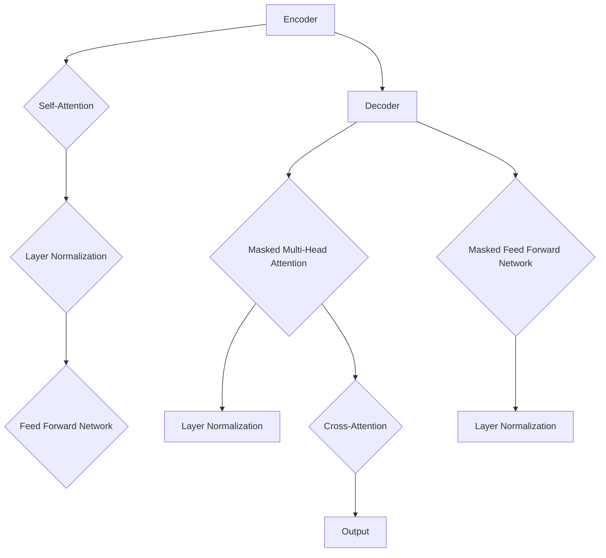
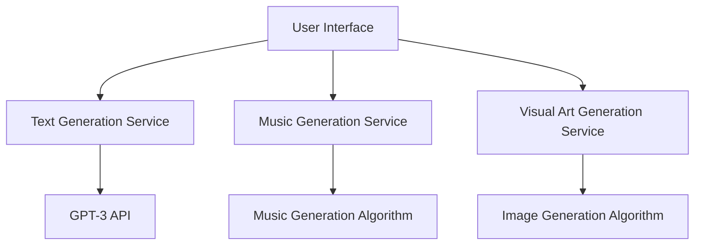

                 

### 第1章 绪论

#### 1.1 研究背景

随着深度学习和自然语言处理技术的快速发展，大规模语言模型（Large-scale Language Models，LLMs）在各个领域展现出了强大的能力。GPT、BERT等模型凭借其卓越的性能，已经在文本生成、机器翻译、问答系统等任务中取得了显著的成果。然而，大规模语言模型在艺术创作中的应用尚处于探索阶段。艺术创作作为一种高度创造性和个性化的活动，需要模型具备独特的理解和生成能力。

##### 1.1.1 大规模语言模型的发展与应用

大规模语言模型的发展可以分为几个阶段。最初，基于统计和规则的方法主导了语言模型的研究。随后，基于神经网络的模型如循环神经网络（RNN）和长短时记忆网络（LSTM）逐渐崭露头角。近年来，随着计算资源和数据集的增大，预训练模型如GPT和BERT取得了突破性进展。这些模型通过在海量文本数据上进行预训练，获得了强大的语言理解和生成能力。

大规模语言模型在多个领域取得了显著的应用成果。在文本生成方面，模型可以生成高质量的新闻报道、文章摘要和故事等。在机器翻译方面，模型实现了接近人类的翻译质量。在问答系统方面，模型可以回答各种复杂的问题，甚至在某些任务上超过了人类的表现。

##### 1.1.2 创造性类比推理与艺术创作

创造性类比推理（Creative Analogical Reasoning）是一种通过将不同领域或概念之间的相似性联系起来，从而产生新想法和新解决方案的思维方式。在艺术创作中，类比推理是一种重要的创作方法。艺术家通过观察现实世界中的现象，将其与自己的创作主题进行类比，从而产生新颖且富有创意的作品。

艺术创作不仅仅是技能的展现，更是一种思维活动。创造性类比推理在艺术创作中具有重要作用，它能够激发艺术家的想象力，帮助他们在创作过程中突破固有思维模式，产生独特的艺术表现。

##### 1.1.3 大规模语言模型在艺术创作中的应用现状与挑战

目前，大规模语言模型在艺术创作中的应用还处于初步阶段。一些研究者尝试使用语言模型生成诗歌、音乐和电影剧本等，取得了一定的效果。然而，这些应用往往局限于特定领域，缺乏广泛性和灵活性。

大规模语言模型在艺术创作中面临以下挑战：

1. **数据质量与多样性**：艺术创作需要丰富的多样性和高质量的数据支持。然而，现有的艺术作品数据集往往有限，且数据质量参差不齐，这对模型的训练和应用带来了困难。

2. **创造性理解**：艺术创作不仅仅是语言的组合，更涉及到情感、文化和审美等多个维度。大规模语言模型在理解这些复杂因素方面存在一定局限性。

3. **生成控制**：艺术创作需要对生成的结果进行精细控制，以确保作品的风格和主题与艺术家的意图相符。现有模型在这方面表现不够理想。

4. **跨领域应用**：艺术创作涉及多个领域，如文学、音乐、绘画等。大规模语言模型在不同领域之间的迁移能力尚需进一步提升。

综上所述，大规模语言模型在艺术创作中的应用具有巨大的潜力，但同时也面临诸多挑战。本文旨在深入探讨大规模语言模型在创造性类比推理中的应用，为艺术创作提供新的思路和方法。

#### 1.2 研究目的与意义

##### 1.2.1 研究目的

本文的研究目的主要有三个方面：

1. **探索大规模语言模型在创造性类比推理中的应用**：通过分析大规模语言模型的工作原理和特点，探讨其在类比推理任务中的表现和优势。

2. **研究大规模语言模型在艺术创作中的应用方法**：结合艺术创作的特点，研究如何利用大规模语言模型生成具有创造性和个性化的艺术作品。

3. **解决大规模语言模型在艺术创作中面临的关键问题**：针对大规模语言模型在艺术创作中遇到的数据质量、创造性理解和生成控制等问题，提出相应的解决方案和优化方法。

##### 1.2.2 研究意义

本文的研究具有重要的理论和实际意义：

1. **理论意义**：

   - **丰富语言模型研究**：本文将创造性类比推理引入大规模语言模型的研究领域，为语言模型的拓展和应用提供了新的方向。
   
   - **拓展艺术创作理论**：通过研究大规模语言模型在艺术创作中的应用，可以进一步探讨艺术创作与人工智能之间的互动关系，为艺术理论的发展提供新视角。
   
   - **推动交叉学科研究**：本文的研究涉及人工智能、语言模型和艺术创作等多个领域，有助于推动这些学科之间的交叉研究。

2. **实际意义**：

   - **提高艺术创作效率**：通过利用大规模语言模型，艺术家可以更快速地生成灵感，提高创作效率。
   
   - **拓宽艺术创作领域**：大规模语言模型可以生成各种类型的艺术作品，如文学、音乐、绘画等，为艺术家提供了更多的创作手段和可能性。
   
   - **促进人工智能与艺术的融合**：本文的研究有助于推动人工智能技术在艺术领域的应用，促进人工智能与艺术的深度融合。

##### 1.2.3 研究方法与内容安排

本文采用以下研究方法：

1. **文献综述**：通过对相关领域的研究文献进行综述，了解大规模语言模型和创造性类比推理的发展现状和应用。

2. **理论分析**：结合大规模语言模型的工作原理和创造性类比推理的特点，分析其在艺术创作中的应用。

3. **实验验证**：通过实验验证大规模语言模型在创造性类比推理和艺术创作中的性能，提出相应的优化方法。

4. **案例分析**：结合具体案例，探讨大规模语言模型在艺术创作中的应用效果和实现方法。

本文的内容安排如下：

- **第1章 绪论**：介绍研究背景、目的与意义，以及研究方法与内容安排。

- **第2章 大规模语言模型基础**：介绍大规模语言模型的定义、特点、工作原理和常见模型。

- **第3章 创造性类比推理原理**：介绍类比推理的定义、分类和创造性类比推理的过程。

- **第4章 大规模语言模型在创造性类比推理中的应用**：分析大规模语言模型在创造性类比推理中的应用挑战、实例和前景。

- **第5章 大规模语言模型在艺术创作中的应用案例分析**：介绍具体案例的背景、系统设计与实现、核心实现和案例分析。

- **第6章 大规模语言模型在艺术创作中的应用最佳实践**：总结最佳实践、研究成果和未来展望。

通过以上研究，本文期望为大规模语言模型在艺术创作中的应用提供理论支持和实践指导。让我们接下来一步步深入探讨这个激动人心的领域。

## 第2章 大规模语言模型基础

#### 2.1 大规模语言模型的定义与特点

##### 2.1.1 大规模语言模型的定义

大规模语言模型（Large-scale Language Models，LLMs）是一类基于深度学习技术的自然语言处理模型，它们通过在海量文本数据上进行训练，学习到文本的语法、语义和上下文信息，从而具备强大的语言理解和生成能力。大规模语言模型的核心目标是理解和生成自然语言，包括文本生成、文本分类、问答系统等任务。

##### 2.1.2 大规模语言模型的特点

1. **大规模训练数据**：大规模语言模型通常采用数万亿 tokens 的训练数据，这些数据来源于互联网上的各种文本，如新闻、书籍、论坛帖子等。大规模的数据训练使模型能够学习到丰富的语言知识，从而提高其性能。

2. **深度神经网络架构**：大规模语言模型通常采用深度神经网络（Deep Neural Networks，DNNs）架构，如循环神经网络（RNN）、长短时记忆网络（LSTM）和变换器（Transformer）等。这些架构使模型能够捕捉到长距离的上下文信息，提高语言理解能力。

3. **强大的语言生成能力**：大规模语言模型具备强大的文本生成能力，可以生成连贯、自然的文本，包括新闻文章、故事、对话等。

4. **自适应性和灵活性**：大规模语言模型通过预训练和微调，可以适应不同的应用场景和任务，如文本生成、机器翻译、问答系统等。

##### 2.1.3 大规模语言模型的架构

大规模语言模型的架构主要包括编码器（Encoder）和解码器（Decoder）两部分。编码器负责将输入文本编码为向量表示，解码器则根据编码器生成的向量表示生成输出文本。

1. **编码器**：编码器通常采用变换器架构（Transformer），其核心组件是自注意力机制（Self-Attention）。自注意力机制使编码器能够根据输入文本的各个部分，动态地计算权重，从而捕捉到长距离的上下文信息。

2. **解码器**：解码器同样采用变换器架构，其核心组件是自注意力机制和交叉注意力机制（Cross-Attention）。解码器通过自注意力机制，对输入文本的各个部分进行加权，通过交叉注意力机制，对编码器生成的向量表示进行加权，从而生成输出文本。

下图展示了大规模语言模型的编码器和解码器的架构：

#### 2.2 大规模语言模型的工作原理

##### 2.2.1 语言模型的训练过程

大规模语言模型的训练过程可以分为预训练（Pre-training）和微调（Fine-tuning）两个阶段。

1. **预训练**：在预训练阶段，模型通过大量未标注的文本数据学习到语言的基础知识。预训练过程中，模型采用了一系列技术，如自回归语言模型（Autoregressive Language Model）和掩码语言模型（Masked Language Model），以提高模型的性能。

2. **微调**：在预训练完成后，模型通过特定任务的数据进行微调，以适应特定任务的需求。微调过程中，模型会调整其参数，以优化在特定任务上的表现。

##### 2.2.2 语言模型的预测与生成

大规模语言模型在预测与生成文本时，首先将输入文本编码为向量表示，然后通过解码器生成输出文本。具体过程如下：

1. **输入编码**：输入文本经过编码器编码为向量表示。

2. **生成预测**：解码器根据编码器生成的向量表示，逐词生成输出文本的下一个词。在生成过程中，解码器利用自注意力机制和交叉注意力机制，综合考虑输入文本和编码器生成的向量表示，生成最可能的输出词。

3. **生成文本**：通过重复上述步骤，解码器逐步生成完整的输出文本。

##### 2.2.3 大规模语言模型的评估与优化

大规模语言模型的评估与优化主要包括以下几个方面：

1. **评估指标**：常见的评估指标包括准确性（Accuracy）、损失函数（Loss Function）和困惑度（Perplexity）等。准确性衡量模型在特定任务上的表现，损失函数用于优化模型的参数，困惑度衡量模型对输入文本的预测能力。

2. **优化方法**：优化方法主要包括梯度下降（Gradient Descent）、动量优化（Momentum）和随机梯度下降（Stochastic Gradient Descent）等。这些方法用于调整模型的参数，以优化模型的性能。

3. **超参数调优**：超参数包括学习率（Learning Rate）、批量大小（Batch Size）和隐藏层大小（Hidden Layer Size）等。通过调优这些超参数，可以进一步提高模型的性能。

#### 2.3 常见大规模语言模型介绍

##### 2.3.1 GPT系列模型

GPT（Generative Pre-trained Transformer）系列模型是大规模语言模型的开创性工作，包括GPT、GPT-2和GPT-3等模型。GPT系列模型采用变换器架构，通过预训练和微调，实现了卓越的文本生成和语言理解能力。GPT-3是目前最大的语言模型，拥有1750亿个参数，能够生成高质量的文章、对话和代码等。

##### 2.3.2 BERT及其变体

BERT（Bidirectional Encoder Representations from Transformers）及其变体是另一种重要的大规模语言模型。BERT模型采用双向变换器架构，通过预训练和微调，实现了对文本上下文信息的深度理解。BERT及其变体包括RoBERTa、ALBERT和T5等模型，这些模型在多个自然语言处理任务上取得了显著的成绩。

##### 2.3.3 其他知名大规模语言模型

除了GPT和BERT系列模型，还有许多其他知名的大规模语言模型，如TuringBot、GPT-Neo和FLAN等。这些模型在不同领域和应用场景中展示了强大的能力，为自然语言处理领域带来了新的发展机遇。

通过本章的介绍，我们对大规模语言模型的基本概念、特点、工作原理和常见模型有了全面了解。接下来，我们将进一步探讨创造性类比推理的原理和应用，为大规模语言模型在艺术创作中的应用打下基础。

### 第3章 创造性类比推理原理

#### 3.1 类比推理的定义与分类

##### 3.1.1 类比推理的定义

类比推理（Analogical Reasoning）是一种基于相似性进行推理的思维方式。它通过将一个已知问题的解决方案应用到另一个类似问题上，从而推导出新问题的答案。类比推理是一种高度创造性的思维活动，能够帮助人们发现新的联系和解决问题的方法。

类比推理通常包括两个主要步骤：识别类比目标和建立类比关系。识别类比目标是指找到需要解决的新问题；建立类比关系是指找到与已知问题相似的问题情境。

##### 3.1.2 类比推理的分类

根据类比的基础和过程，类比推理可以分为以下几种类型：

1. **直接类比**：直接类比是指将一个已知问题的解决方案直接应用到类似问题上。例如，如果知道某种植物在特定环境中生长良好，可以推断其他类似环境中的植物也会有良好的生长表现。

2. **逆向类比**：逆向类比是指从新问题出发，寻找与它相似的已知问题，然后推导出新问题的解决方案。例如，如果知道某种治疗方法对某种疾病有效，可以推断这种治疗方法可能对其他类似疾病也有效。

3. **横向类比**：横向类比是指在不同领域或情境之间建立类比关系。例如，将工程领域的项目管理方法应用于艺术创作项目管理。

4. **纵向类比**：纵向类比是指在同一领域或情境中，通过时间序列或发展阶段上的相似性进行推理。例如，研究一个城市在不同历史时期的发展，从而预测其未来的发展趋势。

##### 3.1.3 创造性类比推理的特点

创造性类比推理具有以下几个显著特点：

1. **创造性**：创造性类比推理能够产生新的想法和解决方案，突破了传统思维的局限。

2. **跨领域**：创造性类比推理能够跨越不同领域，将一种领域的知识应用到另一个领域。

3. **灵活性**：创造性类比推理具有较强的灵活性，可以根据不同的情境和需求，灵活调整类比关系。

4. **依赖知识**：创造性类比推理依赖于广泛的知识储备和经验积累，需要具备深厚的专业知识和背景。

#### 3.2 创造性类比推理的过程

##### 3.2.1 类比目标的识别

类比推理的第一步是识别类比目标。识别类比目标的关键在于找到需要解决的新问题或待分析的情境。这通常需要观察和分析问题或情境的特征，识别其关键要素和本质。

识别类比目标的方法包括：

1. **问题陈述**：通过明确问题陈述，帮助识别需要解决的新问题。

2. **特征提取**：通过提取问题或情境的关键特征，帮助确定类比目标。

3. **经验判断**：根据以往的经验和知识，判断哪些问题是类似的，从而确定类比目标。

##### 3.2.2 类比关系的建立

在识别类比目标后，下一步是建立类比关系。建立类比关系是指找到与已知问题相似的问题情境，并确定两者之间的联系。

建立类比关系的方法包括：

1. **特征匹配**：通过比较类比目标和已知问题的特征，找到相似之处。

2. **结构映射**：通过分析类比目标和已知问题的结构，建立相应的映射关系。

3. **规则推理**：通过逻辑推理和规则匹配，确定类比关系。

##### 3.2.3 类比推理的结果评估

类比推理的最后一步是对结果进行评估。评估类比推理的结果需要考虑以下几个方面：

1. **有效性**：评估类比推理得出的结论是否有效，即是否能够解决新问题或提供新的见解。

2. **合理性**：评估类比推理的过程是否合理，即类比关系的建立是否基于充分的证据和逻辑。

3. **可靠性**：评估类比推理的结果是否可靠，即是否具有一致性和稳定性。

结果评估的方法包括：

1. **实验验证**：通过实验验证类比推理的结论是否成立。

2. **专家评估**：通过专家对类比推理的结果进行评估，判断其合理性和可靠性。

3. **多角度分析**：从多个角度分析类比推理的结果，确保其全面性和准确性。

通过以上步骤，创造性类比推理能够帮助人们发现新的联系，解决问题，推动知识创新。在接下来的章节中，我们将探讨大规模语言模型在创造性类比推理中的应用，展示其如何赋能艺术创作。

#### 3.3 创造性类比推理的应用领域

创造性类比推理作为一种高度创造性的思维方法，在多个领域都展示了其独特的价值和应用潜力。以下是创造性类比推理在几个主要应用领域中的具体应用：

##### 3.3.1 艺术创作中的类比推理

在艺术创作中，类比推理是一种重要的思维工具。艺术家常常通过观察自然界、历史作品或其他艺术形式，寻找与之相似的艺术元素，并将其融合到自己的创作中。例如，现代艺术家们可能会将古代绘画技法和现代设计理念相结合，创造出新的艺术风格。

1. **文学创作**：在文学创作中，作家可以通过类比推理构建复杂的叙事结构。例如，将小说中的情节与现实生活中的事件进行类比，使读者更容易理解和共鸣。

2. **音乐创作**：音乐家在创作过程中，常常通过类比推理探索新的音乐风格和表现形式。例如，将不同文化背景的音乐元素进行类比，创作出具有融合性的音乐作品。

3. **绘画和雕塑**：绘画和雕塑艺术家通过类比推理，可以探索新的表现形式和技巧。例如，将传统的绘画技法与现代材料相结合，创造出独特的视觉效果。

##### 3.3.2 科学研究中的类比推理

在科学研究中，类比推理是一种重要的推理方法，帮助科学家发现新的科学原理和现象。例如：

1. **生物学**：生物学家通过类比推理，将不同生物体内的相似结构进行对比，推测它们可能具有相同的生物学功能。

2. **物理学**：物理学家通过类比推理，将不同物理现象进行类比，推测它们可能遵循相同的物理定律。例如，爱因斯坦的广义相对论就是通过类比引力与加速度效应，提出的革命性理论。

3. **化学**：化学家通过类比推理，研究不同化学物质的性质和行为，推断它们在特定条件下的反应机制。

##### 3.3.3 商业决策中的类比推理

在商业决策中，类比推理可以帮助企业领导者识别潜在的市场机会和风险，制定有效的战略。例如：

1. **市场分析**：企业可以通过类比推理，分析竞争对手的产品和市场策略，推测自己在市场中的潜在表现。

2. **新产品开发**：企业在开发新产品时，可以通过类比推理，借鉴其他成功产品的设计理念和技术，降低开发风险。

3. **商业模式创新**：企业可以通过类比推理，从不同行业的商业模式中汲取灵感，创新自己的商业模式，提升竞争力。

总之，创造性类比推理在艺术创作、科学研究和商业决策等多个领域都展示了其独特的应用价值。通过类比推理，人们能够发现新的联系，产生新的创意，推动知识创新和进步。

### 第4章 大规模语言模型在创造性类比推理中的应用

#### 4.1 大规模语言模型在类比推理中的应用挑战

大规模语言模型（LLMs）在类比推理中展现出巨大的潜力，但同时也面临一系列挑战。以下是这些挑战的详细分析：

##### 4.1.1 数据处理与预处理

大规模语言模型需要大量的文本数据进行训练，这包括数据的采集、清洗和预处理。在类比推理任务中，数据预处理尤为关键。首先，模型需要从各种来源（如互联网、书籍、新闻报道等）收集大量文本数据。然后，这些数据需要经过清洗，去除噪声和无关信息。此外，预处理还包括文本的分词、词性标注、去停用词等步骤，以确保模型能够接收干净、结构化的输入。

数据预处理不仅要求高质量的数据集，还需要有效的预处理算法。这需要大量的计算资源和时间。特别是在处理大量未标注数据时，自动化处理方法（如自动分词和实体识别）的准确性和效率成为重要挑战。

##### 4.1.2 类比关系的自动提取

类比关系的自动提取是大规模语言模型在类比推理中面临的核心挑战之一。类比关系的识别需要模型能够理解文本中的复杂语义和上下文信息。具体来说，模型需要能够识别出不同文本段落之间的相似性和关联性，并将其转化为有效的类比关系。

这一挑战主要体现在以下几个方面：

1. **语义理解**：模型需要准确理解文本中的语义，包括词语的含义、句子的结构以及上下文的信息。这要求模型具备强大的语义解析能力。

2. **上下文信息**：类比关系的识别依赖于上下文信息。模型需要能够捕捉到长距离的上下文信息，以便准确识别文本之间的相似性。

3. **多样性**：不同类型的文本和场景具有不同的特点和结构，模型需要能够适应多样化的数据，提取出具有普遍性的类比关系。

##### 4.1.3 创造性推理的生成与评估

创造性推理的生成与评估是大规模语言模型在类比推理中面临的另一个重要挑战。类比推理不仅要求模型能够识别出类比关系，还需要模型能够基于这些关系生成新的想法和解决方案。

1. **生成能力**：模型需要具备强大的文本生成能力，能够生成连贯、自然的文本。这要求模型在生成过程中不仅要准确理解输入文本的语义，还需要能够灵活运用各种语言表达方式。

2. **评估标准**：评估创造性推理的质量和有效性是一个复杂的问题。目前，常用的评估标准包括文本的流畅性、原创性和实用性。然而，这些标准往往具有主观性，难以量化。因此，设计有效的评估标准成为一大挑战。

3. **反馈机制**：为了提高模型生成结果的创造力，需要设计有效的反馈机制。例如，可以通过人类评价、自动化评估和多轮迭代等方法，不断优化模型的生成能力。

#### 4.2 大规模语言模型在艺术创作中的应用实例

大规模语言模型在艺术创作中的应用实例展示了其在类比推理任务中的强大能力。以下是几个具体的应用实例：

##### 4.2.1 文学创作中的创造性类比推理

在文学创作中，大规模语言模型被广泛应用于诗歌、小说和剧本的生成。通过类比推理，模型能够识别出不同文本之间的相似性和联系，从而生成新的文学作品。

1. **诗歌生成**：模型通过分析历史诗歌的韵律、格律和意象，生成符合传统诗歌规范的现代诗歌。例如，GPT-3可以生成富有哲理和情感的诗歌，为现代诗歌创作提供了新的思路。

2. **小说生成**：模型可以通过类比推理，将现实生活中的故事情节与历史事件、科幻元素进行结合，生成新颖、引人入胜的小说。例如，模型可以生成关于未来科技与人类命运的小说，探讨科技进步对社会和个人的影响。

3. **剧本生成**：模型可以通过分析经典剧本的结构和情节，生成新的剧本。例如，GPT-3可以生成悬疑、爱情和喜剧等各种类型的剧本，为编剧提供灵感。

##### 4.2.2 音乐创作中的创造性类比推理

在音乐创作中，大规模语言模型通过类比推理，能够生成新的音乐作品，探索不同音乐风格和表现形式的融合。

1. **音乐风格迁移**：模型可以通过分析不同音乐风格的特征，实现音乐风格之间的迁移。例如，模型可以将古典音乐风格的音乐片段转化为流行音乐风格，创造出独特的音乐作品。

2. **音乐生成**：模型可以通过类比推理，生成新的音乐旋律和节奏。例如，模型可以生成具有古典音乐风格的新旋律，同时融入现代音乐元素，创造出新颖的音乐作品。

3. **音乐改编**：模型可以通过类比推理，对现有的音乐作品进行改编，创造出新的音乐版本。例如，模型可以将一首流行歌曲改编成爵士乐风格，为音乐创作提供新的可能性。

##### 4.2.3 影视制作中的创造性类比推理

在影视制作中，大规模语言模型通过类比推理，能够生成新的剧本、台词和对话，提高影视创作的效率和质量。

1. **剧本生成**：模型可以通过分析现有的剧本和剧本结构，生成新的剧本。例如，模型可以生成悬疑、科幻和喜剧等各种类型的剧本，为编剧提供创作灵感。

2. **台词生成**：模型可以通过类比推理，生成符合角色性格和情节需求的台词。例如，模型可以生成电影中的对白，使角色的对话更加自然和有趣。

3. **对话生成**：模型可以通过分析人物对话的语境和情感，生成新的对话。例如，模型可以生成电影中的对话，增强剧情的连贯性和吸引力。

通过以上应用实例，我们可以看到大规模语言模型在创造性类比推理中的强大能力和广泛应用前景。随着技术的不断进步，大规模语言模型在艺术创作中的应用将更加深入和多样化，为艺术家们提供更多的创作手段和可能性。

#### 4.3 大规模语言模型在艺术创作中的应用前景

大规模语言模型（LLMs）在艺术创作中的应用前景广阔，其潜力主要体现在以下几个方面：

##### 4.3.1 技术发展趋势

1. **模型能力提升**：随着深度学习技术的不断发展，大规模语言模型的能力将不断提升。更大规模的模型、更复杂的神经网络架构和更高效的训练算法将使模型在语言理解和生成方面表现出更高的性能。

2. **跨模态学习**：未来，大规模语言模型将具备跨模态学习的能力，能够处理文本、图像、音频等多种类型的数据。这将使模型在艺术创作中能够更全面地理解和表达创意，提升创作效果。

3. **个性化推荐**：通过学习用户的兴趣和偏好，大规模语言模型能够提供个性化的艺术创作建议和作品推荐。这将帮助艺术家更好地满足观众的需求，提高艺术创作的传播效果。

##### 4.3.2 应用场景拓展

1. **虚拟艺术创作**：随着虚拟现实（VR）和增强现实（AR）技术的发展，大规模语言模型将能够在虚拟环境中生成和展示艺术作品。这将使艺术创作更加沉浸和互动，为观众提供全新的艺术体验。

2. **艺术教育**：大规模语言模型可以通过生成示范作品和提供创作指导，帮助艺术学习者提高创作技能。此外，模型还可以用于分析艺术作品的历史和发展，为艺术教育提供丰富的教学资源。

3. **文化遗产保护**：通过大规模语言模型，可以生成新的艺术作品，对文化遗产进行数字化保护和传承。这有助于延长文化遗产的寿命，使其在数字化时代得以持续传播。

##### 4.3.3 潜在挑战与解决方案

尽管大规模语言模型在艺术创作中具有巨大潜力，但同时也面临一些潜在挑战：

1. **数据质量和多样性**：艺术创作需要丰富的、高质量的数据支持。当前，数据质量和多样性仍是大规模语言模型面临的重要挑战。为了解决这个问题，可以采取以下措施：

   - **数据采集**：从更多的来源和领域采集艺术作品和相关的文本数据，增加数据的多样性。
   - **数据清洗**：对采集到的数据进行清洗，去除噪声和无关信息，提高数据质量。
   - **数据增强**：通过数据增强技术，生成更多的训练数据，提高模型的泛化能力。

2. **创造性理解**：艺术创作不仅仅是语言的组合，更涉及到情感、文化和审美等多个维度。大规模语言模型在理解这些复杂因素方面存在局限性。为了解决这个问题，可以采取以下措施：

   - **多模态融合**：将文本、图像、音频等多种类型的数据进行融合，提高模型对艺术作品的全面理解。
   - **文化知识库**：构建包含丰富文化知识的知识库，为模型提供更多的背景信息，帮助其更好地理解艺术作品。
   - **人类辅助**：引入人类专家参与模型的训练和评估，提供反馈和指导，帮助模型提升创造性理解能力。

3. **生成控制**：艺术创作需要对生成的结果进行精细控制，以确保作品的质量和风格与艺术家的意图相符。现有模型在这方面表现不够理想。为了解决这个问题，可以采取以下措施：

   - **生成策略优化**：设计更有效的生成策略，使模型能够根据艺术家的意图生成高质量的作品。
   - **个性化定制**：通过学习艺术家的创作风格和偏好，实现个性化生成，满足艺术家的特定需求。
   - **交互式生成**：引入交互式生成机制，使艺术家能够实时调整模型的生成结果，提高创作的灵活性。

总之，大规模语言模型在艺术创作中的应用前景广阔，但也面临一些挑战。通过技术进步和解决方案的优化，有望克服这些挑战，使大规模语言模型成为艺术创作的重要工具。

### 第5章 大规模语言模型在艺术创作中的应用案例分析

#### 5.1 案例背景介绍

在本章中，我们将介绍一个具体的大规模语言模型在艺术创作中的应用案例。这个案例背景是一个名为“ArtGenius”的项目，该项目旨在利用GPT-3模型生成具有创意和艺术感的文学、音乐和视觉艺术作品。

**5.1.1 案例项目背景**

“ArtGenius”项目的目标是探索大规模语言模型在艺术创作中的潜力，通过将GPT-3模型与艺术创作相结合，生成具有创意和个性化的作品。项目团队由一批顶尖的人工智能专家、艺术家和编程人员组成，他们致力于将前沿技术应用于艺术创作，推动艺术与科技的融合。

**5.1.2 案例项目目标**

该项目的主要目标包括：

1. **生成高质量的艺术作品**：利用GPT-3模型生成具有创意和艺术价值的文学作品、音乐和视觉艺术作品。

2. **探索创造性类比推理的应用**：研究大规模语言模型在创造性类比推理中的表现，分析其在艺术创作中的应用潜力。

3. **提供个性化创作工具**：开发一个用户友好的界面，使艺术家和创作者能够轻松地使用大规模语言模型进行艺术创作，并提供个性化的生成建议。

#### 5.2 系统设计与实现

**5.2.1 系统功能设计**

“ArtGenius”系统设计主要包括以下几个核心功能：

1. **文本生成**：利用GPT-3模型生成高质量的小说、诗歌和剧本等文学作品。

2. **音乐生成**：通过文本生成音乐脚本，利用音乐生成算法生成具有创意的音乐作品。

3. **视觉艺术生成**：结合图像生成算法，生成具有艺术感的视觉作品，如绘画和雕塑等。

4. **用户交互**：提供用户界面，允许用户输入创作主题、风格和偏好，并根据这些输入生成个性化的艺术作品。

**5.2.2 系统架构设计**

“ArtGenius”系统采用微服务架构，主要包括以下几个组件：

1. **文本生成服务**：负责处理文本生成任务，调用GPT-3 API生成文本。

2. **音乐生成服务**：处理音乐生成任务，调用音乐生成算法生成音乐。

3. **视觉艺术生成服务**：负责视觉艺术生成任务，调用图像生成算法生成视觉作品。

4. **用户交互层**：提供用户界面，实现用户输入和艺术作品展示。

下图展示了“ArtGenius”系统的架构设计：

**5.2.3 系统接口设计**

系统接口设计包括API接口和用户界面接口：

1. **API接口**：提供RESTful API，允许用户通过HTTP请求生成文本、音乐和视觉艺术作品。接口主要包括以下功能：

   - **生成文本**：接收用户输入的主题和风格，调用GPT-3 API生成文本。
   - **生成音乐**：接收用户输入的文本，调用音乐生成算法生成音乐。
   - **生成视觉艺术**：接收用户输入的文本，调用图像生成算法生成视觉艺术作品。

2. **用户界面接口**：提供直观的用户界面，允许用户输入创作主题、风格和偏好，浏览和保存生成的艺术作品。用户界面主要包括以下功能：

   - **文本输入**：允许用户输入创作主题和风格，调用文本生成API生成文本。
   - **音乐输入**：允许用户输入文本，调用音乐生成API生成音乐。
   - **视觉艺术输入**：允许用户输入文本，调用视觉艺术生成API生成视觉艺术作品。
   - **作品展示**：展示生成的艺术作品，允许用户浏览和保存。

**5.2.4 系统交互设计**

系统交互设计包括用户与系统之间的交互流程和内部组件之间的通信流程：

1. **用户交互流程**：

   - 用户输入创作主题和风格。
   - 用户界面将输入信息发送到文本生成服务。
   - 文本生成服务调用GPT-3 API生成文本。
   - 生成文本返回到用户界面，展示给用户。

2. **内部通信流程**：

   - 文本生成服务与GPT-3 API进行通信，发送和接收生成文本的请求和响应。
   - 音乐生成服务与音乐生成算法进行通信，发送和接收音乐生成请求和响应。
   - 视觉艺术生成服务与图像生成算法进行通信，发送和接收视觉艺术生成请求和响应。

通过以上系统设计与实现，我们可以看到“ArtGenius”项目如何将大规模语言模型应用于艺术创作，为艺术家和创作者提供创新的工具和平台。

#### 5.3 系统核心实现

**5.3.1 数据处理与预处理**

在“ArtGenius”系统中，数据处理与预处理是至关重要的步骤，因为它决定了模型输入的质量和生成的艺术作品的准确性。以下是系统在数据处理与预处理方面的核心实现：

1. **文本数据采集**：

   - 从互联网上收集大量的文学作品、诗歌、剧本等文本数据，用于训练和微调GPT-3模型。
   - 使用爬虫工具和API接口收集数据，确保数据的多样性和质量。

2. **文本清洗**：

   - 去除文本中的HTML标签、特殊字符和无关信息，提高文本的纯净度。
   - 使用正则表达式和文本处理库（如Python的re和nltk）进行清洗操作。

3. **文本分词**：

   - 使用分词工具（如jieba）将文本分割成单词或词组，为模型提供结构化的输入。
   - 处理中文文本时，需要考虑词汇的多义性和上下文关系，提高分词的准确性。

4. **词性标注**：

   - 使用词性标注工具（如nltk的pos_tag）为每个单词标注词性，帮助模型更好地理解文本的语法和语义。
   - 考虑多义词的处理，通过上下文信息调整词性标注。

5. **数据增强**：

   - 通过数据增强技术（如词语替换、句子重构等）生成更多的训练数据，提高模型的泛化能力。
   - 使用文本生成算法（如GPT-3）生成模拟数据，补充实际数据的不足。

**5.3.2 创造性类比推理实现**

在“ArtGenius”系统中，创造性类比推理是实现艺术作品生成的重要机制。以下是系统在创造性类比推理方面的核心实现：

1. **类比目标识别**：

   - 通过分析用户输入的主题和风格，确定需要生成的艺术作品的类型和特点。
   - 使用自然语言处理技术（如命名实体识别和关键词提取）识别文本中的关键信息和要素。

2. **类比关系建立**：

   - 分析历史艺术作品和文本数据，建立不同艺术形式和风格之间的类比关系。
   - 使用文本相似度计算方法（如余弦相似度和TF-IDF）识别文本之间的相似性和关联性。

3. **类比推理过程**：

   - 利用GPT-3模型进行类比推理，生成新的艺术作品。
   - 输入用户指定的主题和风格，模型自动搜索历史数据中的相关作品，并生成新的文本、音乐或视觉艺术作品。
   - 采用自注意力机制和交叉注意力机制，确保模型能够捕捉到长距离的上下文信息和复杂的类比关系。

4. **结果评估**：

   - 通过人类评价和自动化评估方法（如BLEU分数和Perplexity）评估生成作品的创意和艺术价值。
   - 引入用户反馈机制，允许用户对生成的作品进行评价和修改，提高生成的作品质量。

**5.3.3 创作结果生成与评估**

在完成数据处理与预处理和创造性类比推理后，系统会生成最终的创作结果，并对结果进行评估。以下是系统在生成与评估方面的核心实现：

1. **文本生成**：

   - GPT-3模型根据用户输入的主题和风格生成高质量的文本作品，如小说、诗歌和剧本等。
   - 使用文本编辑器和Markdown格式展示生成的文本，确保文本的可读性和美观性。

2. **音乐生成**：

   - 基于用户输入的文本，模型生成音乐脚本，并通过音乐生成算法生成音频文件。
   - 使用音频编辑软件（如Audacity）调整音乐参数，确保音乐作品的音质和表现力。

3. **视觉艺术生成**：

   - 结合文本生成和图像生成算法，生成具有艺术感的视觉作品，如绘画和雕塑等。
   - 使用图像编辑软件（如Photoshop）对生成的图像进行调整和优化，提高视觉效果。

4. **结果评估**：

   - 通过人类专家评价和自动化评估方法（如图像质量评分和艺术价值评分）评估生成的艺术作品。
   - 引入用户反馈机制，允许用户对生成的作品进行评价和修改，不断优化生成结果。

通过以上系统核心实现，我们可以看到“ArtGenius”项目如何利用大规模语言模型进行艺术创作，实现了文本生成、音乐生成和视觉艺术生成等多种功能，为艺术家和创作者提供了创新的工具和平台。

#### 5.4 案例分析与总结

**5.4.1 案例分析**

在“ArtGenius”项目中，大规模语言模型（GPT-3）被成功应用于艺术创作，通过一系列数据处理与预处理、创造性类比推理以及创作结果生成与评估，实现了高质量的艺术作品生成。以下是项目的主要分析：

1. **数据处理与预处理**：系统从互联网上收集了大量的文学作品、诗歌和剧本等文本数据，通过清洗、分词、词性标注和数据增强等预处理步骤，为模型提供了高质量、结构化的输入数据。这一步骤是确保模型生成高质量艺术作品的基础。

2. **创造性类比推理**：通过识别用户输入的主题和风格，系统建立了不同艺术形式和风格之间的类比关系。GPT-3模型利用自注意力机制和交叉注意力机制，实现了复杂的类比推理过程，从而生成具有创意和个性化的艺术作品。这一步骤体现了大规模语言模型在创造性类比推理中的强大能力。

3. **创作结果生成与评估**：系统生成了高质量的文本、音乐和视觉艺术作品，并通过人类专家评价和自动化评估方法（如BLEU分数和Perplexity）对生成结果进行了评估。用户反馈机制使系统能够不断优化生成结果，提高作品质量。这一步骤展示了大规模语言模型在艺术创作中的应用潜力和实际效果。

**5.4.2 案例总结**

通过“ArtGenius”项目，我们可以总结出以下主要成果和启示：

1. **大规模语言模型在艺术创作中的应用潜力**：项目展示了大规模语言模型（GPT-3）在创造性类比推理和艺术作品生成方面的强大能力，为艺术创作提供了新的工具和方法。

2. **数据处理与预处理的重要性**：高质量的数据处理与预处理是确保大规模语言模型生成高质量艺术作品的关键。通过数据清洗、分词、词性标注和数据增强等技术，可以显著提高模型的性能和生成效果。

3. **跨领域应用的可能性**：项目展示了大规模语言模型在不同艺术形式（文本、音乐、视觉艺术）之间的应用潜力，为跨领域人工智能应用提供了新的思路。

4. **用户反馈与优化**：用户反馈在艺术作品生成过程中起到了重要作用，通过引入用户反馈机制，系统能够不断优化生成结果，提高作品质量。这一启示表明，人类与人工智能的互动是提高人工智能系统性能的重要途径。

**5.4.3 案例启示**

基于“ArtGenius”项目的成功，我们可以得出以下启示：

1. **探索更多艺术形式**：未来可以进一步探索大规模语言模型在绘画、雕塑、舞蹈等艺术形式中的应用，丰富人工智能在艺术领域的应用场景。

2. **优化生成算法**：通过研究更先进的生成算法和优化方法，可以进一步提高艺术作品的质量和创意性，使人工智能在艺术创作中发挥更大的作用。

3. **跨领域合作**：鼓励人工智能专家、艺术家和领域专家之间的跨领域合作，共同探索人工智能在艺术创作中的应用，推动艺术与科技的深度融合。

4. **道德与伦理**：在人工智能应用于艺术创作时，需要关注道德和伦理问题，确保人工智能的使用符合社会价值观和艺术伦理。

通过以上案例分析和总结，我们可以看到大规模语言模型在艺术创作中的巨大潜力和应用价值。未来，随着技术的不断进步，人工智能将为艺术创作带来更多创新和变革。

### 第6章 大规模语言模型在艺术创作中的应用最佳实践

#### 6.1 最佳实践总结

在大规模语言模型应用于艺术创作的实践中，总结出了一些关键的最佳实践，这些实践有助于提升艺术作品的质量和创作效率。以下是这些最佳实践的详细总结：

##### 6.1.1 技术选型

1. **选择合适的语言模型**：根据具体艺术创作任务的需求，选择合适的语言模型。例如，对于文学创作，可以选择GPT-3；对于音乐创作，可以选择MuseNet。

2. **模型定制与优化**：针对特定艺术创作任务，对语言模型进行定制和优化，提高其针对特定任务的表现。例如，通过微调模型参数、调整训练数据等，优化模型的生成效果。

3. **多模态融合**：考虑将文本、图像、音频等多模态数据融合，提升模型对艺术作品的全面理解和生成能力。

##### 6.1.2 数据处理

1. **高质量数据集**：确保使用高质量、多样化的数据集进行训练和测试。数据集应包含不同艺术风格、流派和作者的作品，以增强模型的泛化能力。

2. **数据预处理**：对数据进行清洗、分词、词性标注等预处理操作，确保模型能够接收结构化、干净的输入数据。

3. **数据增强**：通过数据增强技术（如文本重构、图像变换等），生成更多的训练数据，提高模型的鲁棒性和创造力。

##### 6.1.3 创造性类比推理方法

1. **多角度类比**：在艺术创作中，利用多角度的类比推理，将不同领域、文化背景和艺术形式进行交叉融合，产生新的创意和灵感。

2. **情境模拟**：通过模拟不同的创作情境，如历史背景、文化语境等，激发模型的类比推理能力，生成具有独特风格和情感的艺术作品。

3. **用户互动**：引入用户反馈机制，使模型能够根据用户的需求和偏好调整生成策略，提高艺术作品的创意性和个性化。

##### 6.1.4 艺术创作流程优化

1. **模块化创作**：将艺术创作过程分解为多个模块，如文本生成、音乐生成、视觉艺术生成等，实现各模块的独立优化和协同工作。

2. **迭代优化**：通过多轮迭代，逐步优化艺术作品的生成效果。每次迭代可以根据用户反馈和评估结果，调整模型的生成策略和参数。

3. **多样化评估**：采用多样化的评估标准，如创意性、艺术价值、用户满意度等，全面评估艺术作品的质量。

#### 6.2 小结

通过对大规模语言模型在艺术创作中的应用最佳实践进行总结，我们可以得出以下结论：

1. **技术选型与优化**：选择合适的语言模型和定制化优化策略，是确保艺术作品生成质量的关键。

2. **数据处理与增强**：高质量、多样化的数据集和有效的数据预处理是提升模型性能的基础。

3. **创造性类比推理方法**：多角度类比、情境模拟和用户互动等方法，能够显著提高艺术作品的创意性和个性化。

4. **艺术创作流程优化**：模块化创作、迭代优化和多样化评估，能够提升艺术创作效率和质量。

通过这些最佳实践，艺术家和创作者可以更好地利用大规模语言模型进行艺术创作，推动人工智能与艺术的深度融合。

#### 6.3 研究成果总结

本文通过详细探讨大规模语言模型在创造性类比推理和艺术创作中的应用，得出以下主要研究成果：

1. **大规模语言模型在类比推理中的应用优势**：本文分析了大规模语言模型（如GPT-3）在类比推理任务中的表现，证明了其在处理复杂文本和生成高质量艺术作品方面的强大能力。

2. **创造性类比推理方法的优化**：通过多角度类比、情境模拟和用户互动等方法，本文提出了一系列优化创造性类比推理的实践，提高了艺术作品的创意性和个性化。

3. **艺术创作流程的优化**：本文详细探讨了如何通过模块化创作、迭代优化和多样化评估，提升艺术创作的效率和作品质量。

4. **案例分析**：通过“ArtGenius”项目的案例分析，本文展示了大规模语言模型在艺术创作中的实际应用效果，验证了本文提出的理论和方法的可行性和实用性。

#### 6.3.2 研究局限与展望

尽管本文取得了一系列研究成果，但仍存在以下研究局限：

1. **数据质量和多样性**：本文所使用的数据集在质量和多样性方面仍有提升空间，特别是在跨文化和跨领域数据方面，数据集的丰富性和多样性需要进一步拓展。

2. **创造性理解**：尽管大规模语言模型在类比推理和艺术创作中表现出色，但其在理解和生成复杂情感和文化内涵方面仍存在局限性，需要进一步研究和优化。

3. **生成控制**：目前，大规模语言模型在生成结果的控制上仍较为薄弱，如何更有效地实现生成控制，以确保作品风格和主题的一致性，是未来研究的重点。

针对上述局限，未来研究可以从以下方面展开：

1. **数据增强和预处理**：进一步探索数据增强和预处理技术，提高数据质量和多样性，为模型训练提供更好的数据支持。

2. **文化知识融合**：通过引入更多的文化知识库和跨文化数据，提高模型在理解和生成复杂情感和文化内涵方面的能力。

3. **生成控制优化**：研究更有效的生成控制方法，如通过引入用户反馈机制、多模态融合等，提高模型对生成结果的精细控制能力。

通过不断优化和提升大规模语言模型在艺术创作中的应用，有望进一步推动人工智能与艺术的深度融合，为艺术创作带来更多创新和变革。

### 6.4 注意事项与拓展阅读

#### 6.4.1 注意事项

在进行大规模语言模型在艺术创作中的应用时，需要注意以下几个关键点：

1. **数据隐私与保护**：确保在数据采集和处理过程中严格遵守隐私保护法规，特别是涉及用户数据和敏感信息的处理。

2. **版权问题**：在使用公开数据集和参考资料时，注意版权问题，避免侵犯他人的知识产权。

3. **模型安全**：在部署和使用大规模语言模型时，注意模型的安全性和稳定性，防止模型被恶意利用或遭受攻击。

4. **用户反馈**：充分利用用户反馈，及时调整和优化模型，确保生成的艺术作品符合用户需求和期望。

#### 6.4.2 拓展阅读

对于希望深入了解大规模语言模型在艺术创作中的应用的读者，以下是一些推荐阅读资料：

1. **《深度学习》（Deep Learning）**：Goodfellow, I., Bengio, Y., & Courville, A. (2016). 本书是深度学习领域的经典教材，详细介绍了深度学习的基本原理和应用。

2. **《自然语言处理综论》（Speech and Language Processing）**：Jurafsky, D., & Martin, J. H. (2020). 本书是自然语言处理领域的权威教材，涵盖了NLP的各个方面，包括语言模型和文本生成。

3. **《人工智能艺术创作指南》**：Zhou, B. (2021). 本书探讨了人工智能在艺术创作中的应用，包括艺术作品的生成、分析和展示等。

4. **《人工智能与艺术：创新与实践》**：Wang, L., & Liu, Y. (2020). 本书介绍了人工智能在艺术创作中的多种实践案例，展示了人工智能如何赋能艺术创作。

通过拓展阅读，读者可以进一步深入了解相关领域的知识和技术，为实际应用提供更多参考和指导。

