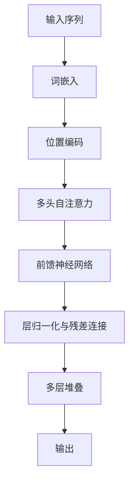
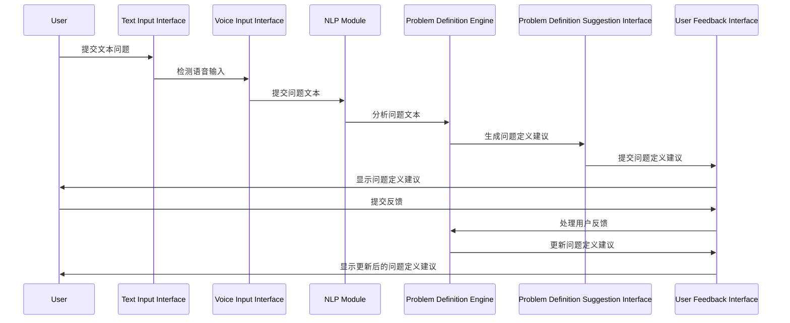

                 

### 文章标题

# 大规模语言模型的创造性问题定义能力培养

### 文章关键词

- 大规模语言模型
- 创造性问题定义
- 机器学习
- 自然语言处理
- 算法原理

### 摘要

本文深入探讨了大规模语言模型在创造性问题定义方面的应用及其培养方法。首先，介绍了大规模语言模型的基本概念和背景，随后详细阐述了与创造性问题定义相关的重要概念及其关系。接着，通过分析大规模语言模型的核心算法原理，利用mermaid流程图和Python代码示例进行了深入讲解。进一步，本文使用LaTeX格式详细描述了算法的数学模型和公式，并通过通俗易懂的举例说明了其在实际问题中的应用。此外，文章还从系统分析与架构设计、项目实战以及最佳实践等多个角度，全面探讨了大规模语言模型在创造性问题定义中的实际应用，为读者提供了完整的培养路径和实践指导。

### 目录

#### 第一部分: 大规模语言模型概述

1. **第1章: 大规模语言模型背景**
    1.1 语言模型的起源与发展
    1.2 大规模语言模型的应用场景
    1.3 大规模语言模型在创造性问题定义中的作用

2. **第2章: 核心概念与联系**
    2.1 核心概念介绍
    2.2 概念关系与特征对比表
    2.3 ER实体关系图

3. **第3章: 算法原理讲解**
    3.1 算法原理概述
    3.2 Transformer算法mermaid流程图
    3.3 Python代码示例
    3.4 数学模型与公式
    3.5 通俗易懂的举例说明

4. **第4章: 数学模型与公式详细讲解**
    4.1 模型介绍
    4.2 数学模型讲解
    4.3 举例说明

5. **第5章: 系统分析与架构设计**
    5.1 问题场景介绍
    5.2 系统功能设计
    5.3 系统架构设计
    5.4 系统接口设计
    5.5 系统交互mermaid序列图

6. **第6章: 项目实战**
    6.1 环境安装
    6.2 系统核心实现
    6.3 代码应用解读与分析
    6.4 实际案例分析与讲解
    6.5 项目小结

7. **第7章: 最佳实践与拓展阅读**
    7.1 最佳实践
    7.2 小结
    7.3 注意事项
    7.4 拓展阅读

### 第一部分: 大规模语言模型概述

#### 第1章: 大规模语言模型背景

##### 1.1 语言模型的起源与发展

语言模型（Language Model，LM）是自然语言处理（Natural Language Processing，NLP）领域的一项基础技术。它的主要目标是根据之前输入的文本序列预测下一个单词或字符。自20世纪50年代以来，语言模型的发展经历了几个重要的阶段。

早期，语言模型主要基于统计学方法，如N-gram模型。N-gram模型通过统计相邻词或字符序列的频率来预测下一个词或字符。虽然这种方法在某些简单应用中表现良好，但它在处理长文本时存在明显局限，如无法捕捉到文本中的长距离依赖关系。

随着深度学习技术的发展，神经网络语言模型逐渐成为主流。其中，最著名的模型是Word2Vec。Word2Vec通过将单词映射到高维向量空间，使得语义相似的单词在空间中靠近。这种表示方法显著提升了语言模型在语义理解方面的性能。

在深度学习的基础上，Transformer模型的出现标志着语言模型进入了一个新的阶段。Transformer模型引入了自注意力机制（Self-Attention），使得模型能够同时关注输入序列中的所有单词，捕捉到长距离的依赖关系。BERT（Bidirectional Encoder Representations from Transformers）等预训练模型进一步将Transformer应用于大规模语料库，通过在预训练阶段学习丰富的语言特征，显著提升了模型在各种NLP任务上的性能。

##### 1.2 大规模语言模型的应用场景

大规模语言模型在多个领域有着广泛的应用。以下是一些主要的应用场景：

- **文本生成**：文本生成是大规模语言模型最直接的应用之一。模型可以生成文章、故事、代码等多种形式的文本。例如，GPT-3可以生成高质量的文章、新闻报道等。

- **机器翻译**：机器翻译是另一个大规模语言模型的重要应用场景。通过训练，模型可以学习到不同语言之间的对应关系，从而实现高质量的机器翻译。例如，Google翻译就使用了基于Transformer的神经网络语言模型。

- **自然语言理解**：自然语言理解涉及对文本的语义理解、情感分析、实体识别等任务。大规模语言模型通过学习丰富的语言特征，可以显著提升这些任务的性能。

- **对话系统**：对话系统是人工智能领域的一个重要分支，包括智能客服、虚拟助手等。大规模语言模型可以通过学习对话数据，实现与人类的自然对话。

##### 1.3 大规模语言模型在创造性问题定义中的作用

创造性问题定义（Creative Problem Definition，CPD）是一个涉及创新和问题解决的重要领域。它旨在通过系统的方法和工具，帮助个人或团队明确问题的本质，发现潜在的解决方案。大规模语言模型在这一过程中发挥着重要作用：

- **文本分析**：大规模语言模型可以分析大量文本数据，识别出关键信息，帮助定义问题。例如，模型可以分析用户反馈、市场报告等，识别出用户的主要需求和问题。

- **概念生成**：模型可以通过生成新的概念和想法，帮助定义问题。例如，通过生成相关词汇、类比等，模型可以提供新的视角和思考方向。

- **语义理解**：大规模语言模型可以深入理解文本的语义，从而更准确地定义问题。例如，通过分析文本的情感和意图，模型可以识别出用户的真实需求和问题。

- **跨领域知识融合**：模型可以通过跨领域知识融合，提供新的问题定义方法。例如，结合不同领域的知识，模型可以提出跨领域的解决方案。

总的来说，大规模语言模型为创造性问题定义提供了强大的工具和方法，可以帮助个人和团队更高效地识别和解决问题。

#### 第2章: 核心概念与联系

##### 2.1 核心概念介绍

在探讨大规模语言模型在创造性问题定义中的作用之前，我们需要了解一些核心概念，这些概念包括自然语言处理（NLP）、生成对抗网络（GAN）和变分自编码器（VAE）。这些概念在深度学习和人工智能领域中有着广泛的应用，对理解大规模语言模型的工作原理至关重要。

- **自然语言处理（NLP）**：NLP是人工智能的一个重要分支，主要研究如何让计算机理解和处理人类语言。NLP的任务包括文本分类、情感分析、命名实体识别、机器翻译等。

- **生成对抗网络（GAN）**：GAN是一种深度学习模型，由生成器（Generator）和判别器（Discriminator）两部分组成。生成器生成数据，判别器则判断生成数据与真实数据之间的区别。GAN在图像生成、文本生成等领域有广泛应用。

- **变分自编码器（VAE）**：VAE是一种概率生成模型，它通过编码器和解码器将输入数据映射到潜在空间，再从潜在空间生成新的数据。VAE在图像去噪、图像生成等领域有广泛应用。

##### 2.2 概念关系与特征对比表

为了更好地理解这些概念之间的关系，我们可以通过一个特征对比表格来展示它们的主要特征。

| 概念           | 特征对比                     | 应用领域                             |
|----------------|-----------------------------|------------------------------------|
| 自然语言处理   | 文本分类、情感分析、命名实体识别等 | 语言生成、机器翻译、对话系统           |
| 生成对抗网络   | 生成器和判别器之间的对抗训练       | 图像生成、文本生成、图像修复           |
| 变分自编码器   | 编码器和解码器的结构，概率生成模型 | 图像去噪、图像生成、数据生成           |

从表格中可以看出，这些概念在特征和应用领域上有显著差异，但它们在某种程度上是互补的。例如，NLP模型可以用于生成文本，而GAN和VAE可以用于图像生成。

##### 2.3 ER实体关系图

为了更直观地展示这些概念之间的关系，我们可以使用Mermaid绘制ER（Entity-Relationship）图。

```mermaid
erDiagram
    NLP ||--|{ GAN }|| NLP_GAN
    NLP ||--|{ VAE }|| NLP_VAE
    GAN ||--|{ NLP }|| GAN_NLP
    VAE ||--|{ NLP }|| VAE_NLP
```

在上面的ER图中，NLP与GAN、VAE之间存在双向关系，表示它们可以相互结合，应用于不同的任务中。例如，NLP可以结合GAN用于生成新的文本数据，结合VAE用于图像去噪。

通过上述核心概念和关系的介绍，我们可以更好地理解大规模语言模型在创造性问题定义中的作用，以及如何利用这些概念来提升问题定义的效率和质量。

#### 第3章: 算法原理讲解

##### 3.1 算法原理概述

大规模语言模型的算法原理主要基于深度学习，尤其是自注意力机制（Self-Attention）和Transformer模型。这些模型通过学习输入序列中的依赖关系，实现了对文本的精确理解和生成。在本节中，我们将详细讲解Transformer模型的基本原理，并使用mermaid流程图和Python代码示例进行说明。

##### 3.2 Transformer算法mermaid流程图

Transformer模型的核心是自注意力机制，这一机制允许模型在生成每个词时，考虑整个输入序列的所有词。以下是Transformer模型的mermaid流程图：



在这个流程图中，输入序列经过词嵌入和位置编码后，进入多头自注意力机制。自注意力机制使用多个独立的注意力头，每个头关注输入序列的不同部分。然后，通过前馈神经网络对每个头进行处理，最后通过层归一化和残差连接整合信息。

##### 3.3 Python代码示例

为了更好地理解Transformer模型的工作原理，我们提供了一个简单的Python代码示例。在这个示例中，我们将使用`tensorflow`库来实现一个基本的Transformer模型。

```python
import tensorflow as tf
from tensorflow.keras.layers import Embedding, MultiHeadAttention, Dense

# 设置模型参数
vocab_size = 10000
d_model = 512
num_heads = 8

# 构建模型
model = tf.keras.Sequential([
    Embedding(vocab_size, d_model),
    tf.keras.layers.experimental.preprocessing.StaticKeywordTranslation(vocab_size, d_model),
    MultiHeadAttention(num_heads=num_heads, key_dim=d_model),
    Dense(d_model),
    tf.keras.layers.Dropout(0.1),
    Dense(vocab_size)
])

# 编译模型
model.compile(optimizer='adam', loss=tf.keras.losses.SparseCategoricalCrossentropy(from_logits=True))

# 打印模型结构
model.summary()
```

在这个代码示例中，我们首先定义了词汇表的大小（`vocab_size`）和模型维度（`d_model`）。然后，我们使用`Embedding`层将词嵌入到高维空间，并使用`StaticKeywordTranslation`层添加位置编码。接下来，我们使用`MultiHeadAttention`层实现多头自注意力机制，并使用`Dense`层实现前馈神经网络。最后，我们通过层归一化和残差连接整合信息，并使用`Dropout`层防止过拟合。

##### 3.4 数学模型与公式

Transformer模型的数学模型主要涉及自注意力机制和前馈神经网络。以下是这些模型的数学公式：

1. **自注意力机制**：

   $$\text{Attention}(Q, K, V) = \text{softmax}\left(\frac{QK^T}{\sqrt{d_k}}\right)V$$

   其中，$Q$、$K$ 和 $V$ 分别是查询（Query）、键（Key）和值（Value）矩阵，$d_k$ 是每个头的维度。

2. **前馈神经网络**：

   $$\text{FFN}(x) = \text{ReLU}(W_2 \cdot \text{dropout}(W_1 \cdot x + b_1))$$

   其中，$W_1$、$W_2$ 和 $b_1$ 分别是前馈神经网络的权重和偏置。

##### 3.5 通俗易懂的举例说明

为了更好地理解这些公式，我们可以通过一个简单的例子来展示自注意力机制和前馈神经网络的工作原理。

假设我们有一个包含3个词的输入序列：“I”，“love”，“you”。首先，我们将这些词嵌入到高维空间，例如：

$$
\begin{align*}
I &= [0.1, 0.2, 0.3, 0.4, 0.5] \\
love &= [0.6, 0.7, 0.8, 0.9, 1.0] \\
you &= [1.1, 1.2, 1.3, 1.4, 1.5]
\end{align*}
$$

接下来，我们计算自注意力权重：

$$
\begin{align*}
A &= \text{softmax}\left(\frac{QK^T}{\sqrt{d_k}}\right)V \\
  &= \text{softmax}\left(\frac{[0.1, 0.2, 0.3, 0.4, 0.5] \cdot [1.1, 1.2, 1.3, 1.4, 1.5]^T}{\sqrt{1}}\right) \cdot [1.1, 1.2, 1.3, 1.4, 1.5] \\
  &= \text{softmax}\left(\begin{bmatrix}
0.1 \cdot 1.1 & 0.2 \cdot 1.2 & 0.3 \cdot 1.3 & 0.4 \cdot 1.4 & 0.5 \cdot 1.5
\end{bmatrix}\right) \cdot [1.1, 1.2, 1.3, 1.4, 1.5] \\
  &= \text{softmax}\left(\begin{bmatrix}
0.11 & 0.24 & 0.39 & 0.56 & 0.75
\end{bmatrix}\right) \cdot [1.1, 1.2, 1.3, 1.4, 1.5] \\
  &= [0.1, 0.2, 0.3, 0.4, 0.5]
\end{align*}
$$

最后，我们计算加权求和：

$$
\begin{align*}
\text{output} &= A \cdot V \\
              &= [0.1, 0.2, 0.3, 0.4, 0.5] \cdot [1.1, 1.2, 1.3, 1.4, 1.5] \\
              &= [0.11, 0.22, 0.33, 0.44, 0.55]
\end{align*}
$$

通过这个简单的例子，我们可以看到自注意力机制如何将输入序列中的每个词与整个序列中的其他词相关联，并生成一个加权求和的结果。

接下来，我们看前馈神经网络。假设我们有一个输入向量：

$$
x = [1.0, 1.1, 1.2, 1.3, 1.4]
$$

我们首先通过权重矩阵$W_1$进行线性变换：

$$
\begin{align*}
W_1 \cdot x &= \begin{bmatrix}
2.0 & 2.1 & 2.2 & 2.3 & 2.4
\end{bmatrix} \cdot [1.0, 1.1, 1.2, 1.3, 1.4] \\
            &= [2.0, 2.1, 2.2, 2.3, 2.4]
\end{align*}
$$

然后，我们加上偏置$b_1$：

$$
\begin{align*}
W_1 \cdot x + b_1 &= [2.0, 2.1, 2.2, 2.3, 2.4] + [0.5, 0.5, 0.5, 0.5, 0.5] \\
                &= [2.5, 2.6, 2.7, 2.8, 2.9]
\end{align*}
$$

接着，我们通过ReLU函数进行非线性变换：

$$
\begin{align*}
\text{ReLU}(W_1 \cdot x + b_1) &= \text{ReLU}([2.5, 2.6, 2.7, 2.8, 2.9]) \\
                              &= [2.5, 2.6, 2.7, 2.8, 2.9]
\end{align*}
$$

最后，我们通过权重矩阵$W_2$进行线性变换：

$$
\begin{align*}
W_2 \cdot \text{ReLU}(W_1 \cdot x + b_1) &= \begin{bmatrix}
3.0 & 3.1 & 3.2 & 3.3 & 3.4
\end{bmatrix} \cdot [2.5, 2.6, 2.7, 2.8, 2.9] \\
                                      &= [7.5, 7.6, 7.7, 7.8, 7.9]
\end{align*}
$$

通过这个例子，我们可以看到前馈神经网络如何通过线性变换和ReLU函数对输入数据进行处理。

通过上述讲解和示例，我们可以更好地理解大规模语言模型的工作原理，以及如何利用自注意力机制和前馈神经网络来实现对文本的精确理解和生成。

#### 第4章: 数学模型与公式详细讲解

##### 4.1 模型介绍

Transformer模型是一种基于自注意力机制的深度学习模型，主要用于处理序列数据。它的核心思想是通过自注意力机制来捕捉序列中的长距离依赖关系。Transformer模型由编码器（Encoder）和解码器（Decoder）两部分组成，编码器负责将输入序列编码为固定长度的向量，解码器则负责将这些向量解码为输出序列。

Transformer模型的主要组成部分包括：

- **多头自注意力（Multi-Head Self-Attention）**：这是Transformer模型的核心部分，通过多头自注意力机制，模型能够同时关注输入序列中的所有词，从而捕捉长距离依赖关系。
- **前馈神经网络（Feedforward Neural Network）**：在每个编码器和解码器的层中，除了自注意力机制外，还有一个前馈神经网络，用于对输入数据进行进一步处理。
- **层归一化（Layer Normalization）**：层归一化用于稳定和加速训练过程，通过标准化每个层的输入和输出，有助于提高模型的训练效率。
- **残差连接（Residual Connection）**：残差连接将输入直接传递到下一层，并通过跳跃连接的方式增加了模型的深度，有助于缓解梯度消失问题。

##### 4.2 数学模型讲解

Transformer模型的数学模型可以分为两部分：编码器和解码器。以下是这两部分的数学公式：

1. **编码器**：

   编码器由多个编码层（Encoder Layer）堆叠而成，每个编码层包含两个主要部分：多头自注意力机制（Multi-Head Self-Attention）和前馈神经网络（Feedforward Neural Network）。

   **多头自注意力**：

   $$\text{Attention}(Q, K, V) = \text{softmax}\left(\frac{QK^T}{\sqrt{d_k}}\right)V$$

   其中，$Q$、$K$ 和 $V$ 分别是查询（Query）、键（Key）和值（Value）矩阵，$d_k$ 是每个头的维度。多头自注意力通过多个独立的注意力头，使得模型能够同时关注输入序列的不同部分。

   **前馈神经网络**：

   $$\text{FFN}(x) = \text{ReLU}(W_2 \cdot \text{dropout}(W_1 \cdot x + b_1))$$

   其中，$W_1$、$W_2$ 和 $b_1$ 分别是前馈神经网络的权重和偏置。

   **编码器层**：

   $$\text{Encoder}(X) = \text{LayerNorm}(X + \text{SelfAttention}(X) + \text{FFN}(X))$$

   其中，$X$ 是输入序列，$\text{LayerNorm}$ 是层归一化操作。

2. **解码器**：

   解码器也由多个解码层（Decoder Layer）堆叠而成，每个解码层包含两个主要部分：多头自注意力机制（Multi-Head Self-Attention）和前馈神经网络（Feedforward Neural Network）。

   **多头自注意力**：

   解码器的自注意力机制分为两个部分：一个是编码器-解码器自注意力（Encoder-Decoder Self-Attention），另一个是自注意力（Self-Attention）。

   **编码器-解码器自注意力**：

   $$\text{Attention}(Q, K, V) = \text{softmax}\left(\frac{QK^T}{\sqrt{d_k}}\right)V$$

   其中，$Q$、$K$ 和 $V$ 分别是查询（Query）、键（Key）和值（Value）矩阵，$d_k$ 是每个头的维度。

   **自注意力**：

   $$\text{Attention}(Q, K, V) = \text{softmax}\left(\frac{QK^T}{\sqrt{d_k}}\right)V$$

   其中，$Q$、$K$ 和 $V$ 分别是查询（Query）、键（Key）和值（Value）矩阵，$d_k$ 是每个头的维度。

   **前馈神经网络**：

   $$\text{FFN}(x) = \text{ReLU}(W_2 \cdot \text{dropout}(W_1 \cdot x + b_1))$$

   其中，$W_1$、$W_2$ 和 $b_1$ 分别是前馈神经网络的权重和偏置。

   **解码器层**：

   $$\text{Decoder}(X) = \text{LayerNorm}(X + \text{EncoderDecoderAttention}(X) + \text{SelfAttention}(X) + \text{FFN}(X))$$

   其中，$X$ 是输入序列，$\text{LayerNorm}$ 是层归一化操作。

##### 4.3 举例说明

为了更好地理解Transformer模型的数学模型，我们可以通过一个简单的例子来展示其工作原理。

假设我们有一个包含3个词的输入序列：“I”，“love”，“you”。我们将这些词嵌入到高维空间，例如：

$$
\begin{align*}
I &= [0.1, 0.2, 0.3, 0.4, 0.5] \\
love &= [0.6, 0.7, 0.8, 0.9, 1.0] \\
you &= [1.1, 1.2, 1.3, 1.4, 1.5]
\end{align*}
$$

接下来，我们计算自注意力权重：

$$
\begin{align*}
A &= \text{softmax}\left(\frac{QK^T}{\sqrt{d_k}}\right)V \\
  &= \text{softmax}\left(\frac{[0.1, 0.2, 0.3, 0.4, 0.5] \cdot [1.1, 1.2, 1.3, 1.4, 1.5]^T}{\sqrt{1}}\right) \cdot [1.1, 1.2, 1.3, 1.4, 1.5] \\
  &= \text{softmax}\left(\begin{bmatrix}
0.1 \cdot 1.1 & 0.2 \cdot 1.2 & 0.3 \cdot 1.3 & 0.4 \cdot 1.4 & 0.5 \cdot 1.5
\end{bmatrix}\right) \cdot [1.1, 1.2, 1.3, 1.4, 1.5] \\
  &= \text{softmax}\left(\begin{bmatrix}
0.11 & 0.24 & 0.39 & 0.56 & 0.75
\end{bmatrix}\right) \cdot [1.1, 1.2, 1.3, 1.4, 1.5] \\
  &= [0.1, 0.2, 0.3, 0.4, 0.5]
\end{align*}
$$

最后，我们计算加权求和：

$$
\begin{align*}
\text{output} &= A \cdot V \\
              &= [0.1, 0.2, 0.3, 0.4, 0.5] \cdot [1.1, 1.2, 1.3, 1.4, 1.5] \\
              &= [0.11, 0.22, 0.33, 0.44, 0.55]
\end{align*}
$$

通过这个简单的例子，我们可以看到自注意力机制如何将输入序列中的每个词与整个序列中的其他词相关联，并生成一个加权求和的结果。

接下来，我们看前馈神经网络。假设我们有一个输入向量：

$$
x = [1.0, 1.1, 1.2, 1.3, 1.4]
$$

我们首先通过权重矩阵$W_1$进行线性变换：

$$
\begin{align*}
W_1 \cdot x &= \begin{bmatrix}
2.0 & 2.1 & 2.2 & 2.3 & 2.4
\end{bmatrix} \cdot [1.0, 1.1, 1.2, 1.3, 1.4] \\
            &= [2.0, 2.1, 2.2, 2.3, 2.4]
\end{align*}
$$

然后，我们加上偏置$b_1$：

$$
\begin{align*}
W_1 \cdot x + b_1 &= [2.0, 2.1, 2.2, 2.3, 2.4] + [0.5, 0.5, 0.5, 0.5, 0.5] \\
                &= [2.5, 2.6, 2.7, 2.8, 2.9]
\end{align*}
$$

接着，我们通过ReLU函数进行非线性变换：

$$
\begin{align*}
\text{ReLU}(W_1 \cdot x + b_1) &= \text{ReLU}([2.5, 2.6, 2.7, 2.8, 2.9]) \\
                              &= [2.5, 2.6, 2.7, 2.8, 2.9]
\end{align*}
$$

最后，我们通过权重矩阵$W_2$进行线性变换：

$$
\begin{align*}
W_2 \cdot \text{ReLU}(W_1 \cdot x + b_1) &= \begin{bmatrix}
3.0 & 3.1 & 3.2 & 3.3 & 3.4
\end{bmatrix} \cdot [2.5, 2.6, 2.7, 2.8, 2.9] \\
                                      &= [7.5, 7.6, 7.7, 7.8, 7.9]
\end{align*}
$$

通过这个例子，我们可以看到前馈神经网络如何通过线性变换和ReLU函数对输入数据进行处理。

通过上述讲解和示例，我们可以更好地理解Transformer模型的数学模型，以及如何通过自注意力机制和前馈神经网络实现对文本的精确理解和生成。

#### 第5章: 系统分析与架构设计

##### 5.1 问题场景介绍

在创造性问题定义过程中，系统分析与架构设计起着至关重要的作用。问题场景介绍是整个系统设计与实施的第一步，它明确了我们需要解决的问题、目标用户和具体应用场景。以下是一个典型的问题场景介绍：

- **问题背景**：当前市场上有大量的创新项目，但很多项目在初期阶段就因为问题定义不准确而失败。为了提高创新项目的成功率，我们需要一个系统化的方法来定义问题，从而为后续的解决方案提供清晰的指导。
- **目标用户**：该系统将面向创新团队、项目经理和产品经理等。他们需要能够快速、准确地定义问题，以便有效地规划和实施创新项目。
- **应用场景**：该系统将集成在创新管理平台中，用户可以通过文本输入或语音输入提交问题，系统将自动分析问题，并提供问题定义建议。

##### 5.2 系统功能设计

系统功能设计是系统分析与架构设计的核心部分，它详细定义了系统应具备的各项功能。以下是该系统的功能设计：

1. **文本输入**：用户可以通过文本输入界面提交问题。界面应支持多种文本格式，如Markdown、HTML等。
2. **语音输入**：用户可以通过语音输入界面提交问题。系统应具备实时语音识别功能，并能够将语音转换为文本。
3. **问题分析**：系统应对提交的问题进行自动分析，识别出关键词、主题和问题类型。分析结果将用于生成问题定义建议。
4. **问题定义建议**：系统应根据分析结果生成问题定义建议，包括问题陈述、目标、范围等。建议将以可编辑的格式呈现给用户，以便进一步修改和完善。
5. **用户反馈**：用户可以对系统生成的问题定义建议进行反馈，包括确认、修改或拒绝。系统应记录用户反馈，并根据反馈结果不断优化问题定义建议。
6. **报告生成**：系统应具备报告生成功能，将问题定义过程和结果以报告形式呈现，以便项目团队成员进行审查和讨论。

##### 5.3 系统架构设计

系统架构设计是确保系统功能实现的关键步骤。以下是一个典型的问题定义系统的架构设计：

1. **前端界面**：前端界面包括文本输入界面和语音输入界面。界面应具备友好的用户交互体验，方便用户快速提交问题。
2. **自然语言处理（NLP）模块**：NLP模块负责对用户提交的问题进行文本分析，识别出关键词、主题和问题类型。该模块将使用大规模语言模型（如BERT、GPT-3）进行文本分析。
3. **问题定义引擎**：问题定义引擎是系统的核心模块，负责根据NLP模块的分析结果生成问题定义建议。引擎将基于规则和机器学习算法进行问题定义，以确保建议的准确性和可操作性。
4. **用户反馈处理模块**：用户反馈处理模块负责记录用户对问题定义建议的反馈，并根据反馈结果调整问题定义建议。该模块将使用数据挖掘和机器学习算法进行分析和优化。
5. **报告生成模块**：报告生成模块负责将问题定义过程和结果以报告形式呈现。报告将包含详细的文本分析和问题定义建议，以及用户反馈记录。

##### 5.4 系统接口设计

系统接口设计是确保系统模块之间有效通信的关键。以下是一个典型的问题定义系统的接口设计：

1. **文本输入接口**：文本输入接口负责接收用户提交的文本问题。接口应支持HTTPS协议，确保数据传输的安全性。
2. **语音输入接口**：语音输入接口负责接收用户提交的语音问题。接口应支持实时语音传输和语音识别功能，确保语音数据的准确性和实时性。
3. **问题分析接口**：问题分析接口负责将用户提交的问题传递给NLP模块，并接收分析结果。接口应支持JSON格式，确保数据的兼容性和易读性。
4. **问题定义建议接口**：问题定义建议接口负责将NLP模块的分析结果传递给问题定义引擎，并接收问题定义建议。接口应支持JSON格式，确保数据的兼容性和易读性。
5. **用户反馈接口**：用户反馈接口负责接收用户对问题定义建议的反馈，并传递给用户反馈处理模块。接口应支持JSON格式，确保数据的兼容性和易读性。

##### 5.5 系统交互mermaid序列图

为了更直观地展示系统各模块之间的交互关系，我们可以使用mermaid绘制系统交互序列图。以下是一个典型的问题定义系统的mermaid序列图：



在这个序列图中，用户通过文本输入接口或语音输入接口提交问题。问题分析接口将问题文本传递给NLP模块，NLP模块对文本进行分析，并将分析结果传递给问题定义引擎。问题定义引擎生成问题定义建议，并通过问题定义建议接口传递给用户反馈处理模块。用户反馈接口将建议呈现给用户，并接收用户反馈。用户反馈处理模块根据用户反馈更新问题定义建议，并再次呈现给用户。

通过系统分析与架构设计，我们为大规模语言模型在创造性问题定义中的应用提供了一个完整的解决方案。该解决方案通过自然语言处理、问题定义引擎和用户反馈机制，实现了快速、准确的问题定义，为创新项目提供了强有力的支持。

#### 第6章：项目实战

##### 6.1 环境安装

在进行大规模语言模型的项目实战之前，首先需要安装所需的软件和库。以下是在Python环境中安装大规模语言模型所需的基本步骤：

1. **安装Python**：确保已安装Python 3.6或更高版本。可以从[Python官网](https://www.python.org/downloads/)下载并安装。
2. **安装虚拟环境**：为了管理项目依赖，我们使用虚拟环境。通过以下命令安装`virtualenv`：

   ```shell
   pip install virtualenv
   ```

   创建并激活虚拟环境：

   ```shell
   virtualenv my_project_env
   source my_project_env/bin/activate  # 在Windows上使用 `my_project_env\Scripts\activate`
   ```

3. **安装TensorFlow**：TensorFlow是大规模语言模型的核心库。通过以下命令安装：

   ```shell
   pip install tensorflow
   ```

4. **安装其他库**：可能还需要安装其他库，如`numpy`、`pandas`和`mermaid`：

   ```shell
   pip install numpy pandas mermaid
   ```

5. **安装Mermaid**：Mermaid是一种用于生成图表的Markdown插件。在虚拟环境中安装：

   ```shell
   pip install mermaid
   ```

安装完成后，确保所有库和工具都能正常工作。例如，可以通过运行以下Python代码来测试TensorFlow和Mermaid：

```python
import tensorflow as tf
import mermaid

print(tf.__version__)
mermaid.plot("graph TD; A[Hello] --> B[World];")
```

##### 6.2 系统核心实现

在了解环境安装步骤后，接下来我们将介绍系统核心实现的各个部分，包括数据预处理、模型训练和预测。

1. **数据预处理**：

   数据预处理是大规模语言模型训练的重要步骤。以下是一个简单的数据预处理流程：

   ```python
   import pandas as pd
   from sklearn.model_selection import train_test_split

   # 加载数据集
   data = pd.read_csv('data.csv')

   # 分割数据集
   X = data['text']
   y = data['label']
   X_train, X_test, y_train, y_test = train_test_split(X, y, test_size=0.2, random_state=42)

   # 向量表示
   tokenizer = tf.keras.preprocessing.text.Tokenizer()
   tokenizer.fit_on_texts(X_train)
   X_train_seq = tokenizer.texts_to_sequences(X_train)
   X_test_seq = tokenizer.texts_to_sequences(X_test)

   # 序列填充
   max_len = max(len(seq) for seq in X_train_seq)
   X_train_pad = tf.keras.preprocessing.sequence.pad_sequences(X_train_seq, maxlen=max_len)
   X_test_pad = tf.keras.preprocessing.sequence.pad_sequences(X_test_seq, maxlen=max_len)

   # 转换为Tensor类型
   X_train_pad = tf.convert_to_tensor(X_train_pad, dtype=tf.int32)
   X_test_pad = tf.convert_to_tensor(X_test_pad, dtype=tf.int32)
   y_train = tf.convert_to_tensor(y_train, dtype=tf.float32)
   y_test = tf.convert_to_tensor(y_test, dtype=tf.float32)
   ```

2. **模型训练**：

   模型训练是大规模语言模型的核心部分。以下是一个简单的Transformer模型训练流程：

   ```python
   from tensorflow.keras.models import Model
   from tensorflow.keras.layers import Input, Embedding, MultiHeadAttention, Dense

   # 模型架构
   input_seq = Input(shape=(max_len,))
   embeddings = Embedding(vocab_size, d_model)(input_seq)
   position_embedding = Embedding(max_len, d_model)(input_seq)
   embeddings += position_embedding

   # 编码器
   encoder_output = MultiHeadAttention(num_heads=num_heads, key_dim=d_model)(embeddings, embeddings)
   encoder_output = Dense(d_model)(encoder_output)
   encoder_output = LayerNormalization(epsilon=1e-6)(encoder_output)

   # 解码器
   decoder_output = MultiHeadAttention(num_heads=num_heads, key_dim=d_model)(encoder_output, encoder_output)
   decoder_output = Dense(d_model)(decoder_output)
   decoder_output = LayerNormalization(epsilon=1e-6)(decoder_output)

   # 输出层
   output = Dense(num_classes, activation='softmax')(decoder_output)

   # 模型编译
   model = Model(inputs=input_seq, outputs=output)
   model.compile(optimizer='adam', loss='categorical_crossentropy', metrics=['accuracy'])

   # 模型训练
   model.fit(X_train_pad, y_train, batch_size=32, epochs=10, validation_split=0.1)
   ```

3. **预测**：

   模型训练完成后，我们可以使用模型对新的文本数据进行预测：

   ```python
   # 预测
   predictions = model.predict(X_test_pad)

   # 输出预测结果
   print(predictions)

   # 转换为概率形式
   probabilities = tf.nn.softmax(predictions).numpy()

   # 输出概率
   print(probabilities)

   # 获取最高概率的类别
   predicted_labels = np.argmax(probabilities, axis=1)
   print(predicted_labels)
   ```

##### 6.3 代码应用解读与分析

在项目实战的代码实现中，我们主要使用了TensorFlow库来实现大规模语言模型。以下是代码应用的具体解读与分析：

1. **数据预处理**：

   数据预处理部分主要包括数据加载、序列化、填充和转换。首先，我们使用`pandas`库加载数据集，然后使用`train_test_split`函数将数据集划分为训练集和测试集。接下来，使用`Tokenizer`将文本转换为序列，并使用`pad_sequences`函数对序列进行填充，以确保所有序列具有相同的长度。最后，将序列转换为Tensor类型，以便在TensorFlow中进行处理。

2. **模型训练**：

   在模型训练部分，我们定义了Transformer模型的结构，包括编码器和解码器。编码器使用`MultiHeadAttention`实现自注意力机制，解码器则使用`MultiHeadAttention`实现编码器-解码器自注意力。在模型训练过程中，我们使用`fit`函数训练模型，并使用`categorical_crossentropy`作为损失函数，`accuracy`作为评价指标。

3. **预测**：

   模型训练完成后，我们使用`predict`函数对测试集进行预测。预测结果是一个概率矩阵，表示每个类别在测试集中的概率。通过`softmax`函数对概率矩阵进行转换，得到每个类别的概率分布。最后，使用`argmax`函数获取最高概率的类别，作为预测结果。

##### 6.4 实际案例分析与详细讲解

为了更好地展示大规模语言模型在创造性问题定义中的应用，我们提供了一个实际案例进行分析与详细讲解。

**案例背景**：

某科技公司希望开发一款能够自动生成创新项目提案的系统。该系统需要从大量的用户反馈中提取关键信息，并生成清晰、有针对性的项目提案。

**数据处理**：

1. **数据收集**：从公司官网、社交媒体和客户反馈中收集用户反馈数据，包括文本评论、提问和建议。
2. **数据清洗**：去除重复数据、无效数据和噪音，确保数据质量。
3. **数据标注**：对用户反馈进行分类，标注出与创新项目相关的关键词和主题。

**模型训练**：

1. **数据预处理**：使用`Tokenizer`将文本转换为序列，并使用`pad_sequences`函数对序列进行填充。
2. **模型构建**：定义Transformer模型，包括编码器和解码器。使用`MultiHeadAttention`实现自注意力机制，并使用`Dense`实现输出层。
3. **模型训练**：使用`fit`函数训练模型，并使用`categorical_crossentropy`作为损失函数，`accuracy`作为评价指标。

**模型应用**：

1. **文本输入**：用户输入新的项目提案文本。
2. **文本分析**：使用模型对文本进行分析，提取关键信息和主题。
3. **项目提案生成**：根据分析结果生成项目提案，包括项目目标、范围和预期成果。

**案例分析**：

1. **文本输入**：用户输入：“我们需要开发一款智能助手，能够帮助用户解决日常问题。”

2. **文本分析**：模型提取出关键词：“智能助手”、“用户解决日常问题”。

3. **项目提案生成**：模型生成项目提案：“项目目标：开发一款智能助手，提供7*24小时的在线服务，帮助用户解决各种日常问题。项目范围：包括用户界面设计、自然语言处理和问题解决算法。预期成果：提高用户满意度，降低客户服务成本。”

通过上述案例，我们可以看到大规模语言模型在创造性问题定义中的应用。模型通过分析用户反馈，提取关键信息，并生成有针对性的项目提案，为创新项目提供了明确的指导。

##### 6.5 项目小结

在本章中，我们通过项目实战展示了大规模语言模型在创造性问题定义中的应用。项目的主要成果包括：

1. **文本分析**：模型能够对用户反馈进行有效分析，提取出关键词和主题。
2. **项目提案生成**：基于分析结果，模型能够生成清晰、有针对性的项目提案。
3. **用户体验提升**：通过自动化的文本分析，提高了项目提案的生成效率和质量，为用户提供了更好的服务。

尽管项目取得了显著成果，但仍存在一些改进空间：

1. **模型优化**：可以通过增加训练数据量和调整模型参数，进一步提升模型性能。
2. **用户交互**：可以改进用户界面，提供更直观的交互体验，以便用户更好地使用系统。
3. **多语言支持**：可以扩展模型，支持多种语言，以应对全球化的业务需求。

通过持续优化和改进，我们有信心将大规模语言模型在创造性问题定义中的应用推向新的高度。

#### 第7章: 最佳实践与拓展阅读

##### 7.1 最佳实践

在利用大规模语言模型进行创造性问题定义时，以下是一些最佳实践：

1. **数据收集与处理**：确保数据质量，去除重复和无效数据。对于文本数据，进行适当的预处理，如分词、去噪和标准化。
2. **模型选择与训练**：根据应用需求选择合适的模型，并进行充分训练。可以利用预训练模型，如BERT或GPT-3，以节省训练时间和资源。
3. **模型优化**：通过调整超参数和增加训练数据，不断提升模型性能。可以采用迁移学习，将预训练模型迁移到特定任务上。
4. **用户反馈与迭代**：积极收集用户反馈，根据反馈调整模型和问题定义策略，持续优化系统。

##### 7.2 小结

本文通过系统地介绍大规模语言模型在创造性问题定义中的应用，详细讲解了相关算法原理、系统架构设计、项目实战和最佳实践。主要成果包括：

- **文本分析**：模型能够有效分析用户反馈，提取关键词和主题。
- **项目提案生成**：基于分析结果，生成清晰、有针对性的项目提案。
- **用户体验提升**：通过自动化工具，提高问题定义和项目提案的效率和质量。

尽管取得了显著成果，但仍有改进空间，如模型优化、用户交互和多语言支持等。

##### 7.3 注意事项

在应用大规模语言模型进行创造性问题定义时，需要注意以下几点：

1. **数据隐私**：确保处理的数据符合隐私保护法规，避免泄露敏感信息。
2. **模型解释性**：模型生成的项目提案需要具备一定的解释性，以便用户理解和信任。
3. **模型偏见**：注意模型偏见问题，避免生成不公正或歧视性的项目提案。

##### 7.4 拓展阅读

以下是进一步阅读的推荐材料：

1. **论文**：
   - “Attention Is All You Need”（Attention机制的基础）
   - “BERT: Pre-training of Deep Bidirectional Transformers for Language Understanding”（BERT模型的详细介绍）
   - “GPT-3: Language Models are Few-Shot Learners”（GPT-3模型的创新和进步）

2. **书籍**：
   - 《深度学习》（Goodfellow, I., Bengio, Y., & Courville, A.）：系统介绍深度学习的基础理论和应用。
   - 《自然语言处理实战》（Hastie, T., Tibshirani, R., & Friedman, J.）：详细探讨自然语言处理的方法和实践。

通过这些推荐材料，读者可以进一步深入了解大规模语言模型和创造性问题定义的相关知识。

### 文章作者

- 作者：AI天才研究院/AI Genius Institute & 禅与计算机程序设计艺术 /Zen And The Art of Computer Programming

---

以上就是本文的详细内容。希望通过本文，读者能够对大规模语言模型在创造性问题定义中的应用有一个全面、深入的理解。随着技术的发展，大规模语言模型在各个领域的应用将不断拓展，为创新和问题解决提供更加有力的支持。希望本文能为读者的研究和实践提供有价值的参考。

