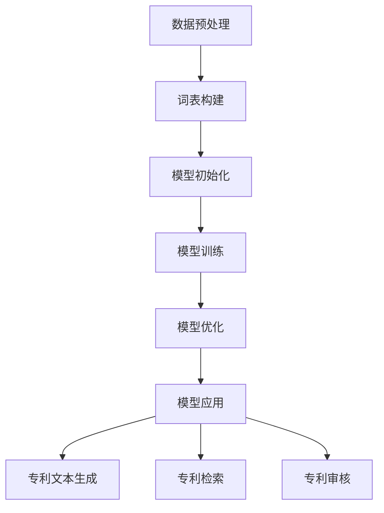

                 

## 引言

### 问题背景

在当今快速发展的信息技术时代，技术专利的创造与保护成为许多企业保持竞争优势的关键因素。然而，专利创造并非易事，它涉及复杂的技术问题、创新性思维的挖掘以及大量的时间和资源投入。近年来，大规模语言模型（Large-scale Language Models，如GPT-3、BERT等）的兴起为人工智能领域带来了革命性的变革，它们在自然语言处理（Natural Language Processing，NLP）任务中展现出了卓越的性能。

然而，如何利用这些先进的大规模语言模型解决技术专利创造中的创造性问题，成为了一个新的研究热点。创造性问题主要表现在以下几个方面：一是专利文本的生成，需要模型具备对技术概念、专利法律条文以及相关领域的深入理解；二是专利文本的创新性，需要模型能够生成具有新颖性和实用性的专利描述；三是专利文本的合规性，需要模型遵循专利法律的规定，确保生成文本的有效性。

本文旨在探讨大规模语言模型在技术专利生成中的创造性问题解析，通过系统的分析和实例讲解，为该领域的进一步研究提供理论支持和实践指导。具体而言，本文将分为以下几个部分：

1. **大规模语言模型概述**：介绍大规模语言模型的基本概念、发展历程及其在技术专利生成中的应用背景。
2. **核心概念与联系**：详细阐述大规模语言模型、技术专利生成及其相互之间的联系。
3. **算法原理讲解**：深入分析大规模语言模型的算法原理，包括模型架构、训练过程和应用场景。
4. **数学模型与公式**：介绍大规模语言模型相关的数学模型和公式，包括模型参数调整方法。
5. **系统分析与架构设计方案**：从系统功能设计、架构设计、接口设计和系统交互等方面，详细描述大规模语言模型在技术专利生成中的应用。
6. **项目实战**：通过具体项目实战，展示大规模语言模型在技术专利生成中的应用实例。
7. **最佳实践 tips**：总结最佳实践方法，为大规模语言模型在技术专利生成中的应用提供策略和建议。
8. **总结与展望**：对全文进行总结，并对未来的研究方向进行展望。

通过以上结构的系统阐述，本文旨在为大规模语言模型在技术专利生成中的应用提供全面而深入的解析。在接下来的章节中，我们将逐一展开详细的讨论。

### 大规模语言模型概述

#### 定义与发展历程

大规模语言模型是一种通过深度学习技术，对大量文本数据进行分析和训练，从而获得对自然语言理解和生成能力的模型。这些模型通常基于神经网络架构，尤其是变分自编码器（Variational Autoencoder，VAE）、递归神经网络（Recurrent Neural Networks，RNN）和 Transformer 等先进结构。大规模语言模型的发展历程可以追溯到 2013 年，当时 Google 提出了 Word2Vec 模型，标志着词向量表示的兴起。随后，RNN 和长短时记忆网络（Long Short-Term Memory，LSTM）等模型在自然语言处理任务中取得了显著进展。直到 2017 年，Google 提出的 Transformer 模型彻底改变了自然语言处理的范式，使其在多个 NLP 任务中达到了当时的最优水平。

大规模语言模型在技术专利生成中的应用主要得益于其强大的文本生成能力。这些模型能够理解并生成复杂的技术描述，使得专利文本的创造过程变得更加高效和自动化。例如，GPT-3 模型在生成技术专利描述时，能够根据输入的少量信息，自动扩展成详细且连贯的文本，极大提高了专利撰写的效率。

#### 技术专利生成原理

技术专利生成的核心是创造具有新颖性、创造性和实用性的专利描述。这一过程通常包括以下几个步骤：

1. **信息检索**：首先，需要从大量的技术文献、专利数据库和科研论文中检索相关的技术信息。
2. **概念提炼**：通过对检索到的信息进行分析，提炼出关键技术概念和术语。
3. **文本生成**：利用大规模语言模型，根据提炼的概念和术语，生成初步的专利描述。
4. **文本优化**：对生成的专利描述进行多次修改和优化，确保其语言通顺、逻辑严密且符合专利法律的要求。

大规模语言模型在技术专利生成中的应用，主要体现在文本生成的阶段。通过输入相关的技术概念和术语，模型能够自动生成复杂的专利描述，极大地减少了人工撰写的耗时和繁琐。

#### 大规模语言模型与专利生成的联系

大规模语言模型与专利生成之间的联系体现在以下几个方面：

1. **文本理解与生成能力**：大规模语言模型具有强大的文本理解与生成能力，能够自动生成具有创新性和实用性的专利描述。
2. **知识图谱构建**：通过大规模语言模型，可以构建出包含大量技术信息的知识图谱，为专利生成提供丰富的数据支持。
3. **自动化与效率提升**：利用大规模语言模型，可以实现专利文本生成的自动化，显著提高撰写效率和准确性。

综上所述，大规模语言模型在技术专利生成中的应用，不仅解决了传统方法中的诸多难题，也为专利撰写提供了新的思路和工具。在接下来的章节中，我们将进一步探讨大规模语言模型的算法原理、数学模型以及具体的应用案例。

### 核心概念与联系

#### 大规模语言模型

首先，我们需要明确“大规模语言模型”这一核心概念。大规模语言模型（Large-scale Language Models）是一种通过深度学习技术，对海量文本数据进行训练，以实现对自然语言的生成和理解能力的高级模型。这些模型通常基于神经网络架构，如 Transformer、BERT 等，具备强大的文本处理能力。具体来说，大规模语言模型的核心特点是：

- **并行计算能力**：基于 Transformer 架构的大规模语言模型能够利用并行计算技术，大幅提高数据处理和模型训练的速度。
- **自适应性**：通过训练，模型能够自适应地理解不同领域和风格的文本，生成高质量的语言输出。
- **强表达能力**：大规模语言模型能够捕捉文本中的长距离依赖关系，从而生成语义丰富、连贯的文本。

#### 技术专利生成原理

技术专利生成的原理涉及将技术概念转化为具有法律效力的专利描述。这一过程主要包括以下几个步骤：

1. **信息检索**：从大量的技术文献、专利数据库和科研论文中检索相关技术信息，构建知识图谱。
2. **概念提炼**：对检索到的信息进行深入分析，提炼出关键技术概念和术语。
3. **文本生成**：利用大规模语言模型，根据提炼的概念和术语，生成初步的专利描述。
4. **文本优化**：对生成的专利描述进行修改和优化，确保其语言通顺、逻辑严密，并符合专利法律的要求。

技术专利生成的关键在于如何将技术概念转化为具有创新性和实用性的专利描述。这需要模型具备对技术领域和专利法律的高度理解，以及强大的文本生成能力。

#### 大规模语言模型与专利生成的联系

大规模语言模型与专利生成之间的联系体现在以下几个方面：

1. **文本生成能力**：大规模语言模型能够自动生成复杂的技术描述，从而提高专利撰写的效率和准确性。
2. **知识图谱构建**：通过大规模语言模型，可以构建包含大量技术信息的知识图谱，为专利生成提供丰富的数据支持。
3. **自动化与效率提升**：利用大规模语言模型，可以实现专利文本生成的自动化，显著提高撰写效率和准确性。

#### 概念属性特征对比表格

为了更直观地理解大规模语言模型和技术专利生成的核心概念，我们可以通过一个对比表格来展示它们的主要属性特征：

| 核心概念       | 大规模语言模型           | 技术专利生成                 |
|----------------|------------------------|----------------------------|
| 定义           | 基于深度学习的文本生成模型 | 将技术概念转化为专利描述的过程 |
| 特征           | 强大的文本生成和理解能力 | 需要创新性和实用性           |
| 关键技术       | Transformer、BERT等       | 信息检索、文本生成和优化       |
| 应用场景       | 自动化文本生成          | 专利撰写和审核                 |

#### ER实体关系图架构

为了更好地理解大规模语言模型和技术专利生成之间的联系，我们可以通过 ER（Entity-Relationship）实体关系图来展示它们之间的关系：

```mermaid
erDiagram
  Product ||--|{ Technology }|--|{ Patent }
  Technology ||--|{ Literature }
  Literature ||--|{ Database }
  Database ||--|{ ResearchPaper }
  Product }|--|{ LanguageModel }
  LanguageModel }|--|{ TextGeneration }
  TextGeneration }|--|{ PatentGeneration }
```

在这个 ER 图中，我们可以看到：

- **Product（产品）** 与 **Technology（技术）** 之间存在一对多的关系，表示一个产品可能包含多个技术。
- **Technology（技术）** 与 **Patent（专利）** 之间存在一对多的关系，表示一项技术可能生成多个专利。
- **Literature（文献）** 与 **Database（数据库）** 之间存在一对多的关系，表示一个数据库中包含多个文献。
- **Database（数据库）** 与 **ResearchPaper（科研论文）** 之间存在一对多的关系，表示一个数据库中包含多个科研论文。
- **Product（产品）** 与 **LanguageModel（大规模语言模型）** 之间存在一对多的关系，表示一个产品可能使用多个大规模语言模型。
- **LanguageModel（大规模语言模型）** 与 **TextGeneration（文本生成）** 之间存在一对多的关系，表示一个大规模语言模型可能生成多个文本。
- **TextGeneration（文本生成）** 与 **PatentGeneration（专利生成）** 之间存在一对多的关系，表示一个文本生成过程可能生成多个专利。

通过上述核心概念的详细阐述和 ER 实体关系图的展示，我们可以更清晰地理解大规模语言模型在技术专利生成中的应用及其内在联系。在接下来的章节中，我们将深入探讨大规模语言模型的算法原理，为进一步解决技术专利生成中的创造性问题奠定基础。

### 算法原理讲解

#### 模型架构

大规模语言模型的模型架构通常基于 Transformer 模型，这是一种能够高效处理长文本的深度学习模型。Transformer 模型的主要组成部分包括编码器（Encoder）和解码器（Decoder）。编码器负责将输入的文本序列转换成固定长度的向量表示，而解码器则利用这些向量生成输出文本序列。具体来说，Transformer 模型由以下几部分构成：

1. **多头自注意力机制（Multi-head Self-Attention）**：这是 Transformer 模型的核心组件，它能够通过不同的权重对序列中的每个词进行加权，从而捕捉长距离依赖关系。
2. **位置编码（Positional Encoding）**：由于 Transformer 模型没有循环结构，因此需要位置编码来为模型提供输入序列中的位置信息。
3. **前馈神经网络（Feedforward Neural Network）**：在每个编码器和解码器的块中，都有一个前馈神经网络，用于对自注意力机制的输出进行进一步处理。

#### 训练过程

大规模语言模型的训练过程通常分为以下几个步骤：

1. **数据预处理**：首先，需要对输入文本进行预处理，包括分词、词性标注、去除停用词等操作，以便模型能够更好地理解输入文本。
2. **构建词表**：将预处理后的文本转换为词索引的形式，即每个词对应一个唯一的整数。这一步骤通常通过构建词汇表（Vocabulary）来完成。
3. **训练模型**：在构建好词表后，使用训练数据对模型进行训练。训练过程中，模型通过反向传播算法不断调整参数，以最小化损失函数。
4. **优化模型**：在训练过程中，可以使用各种优化技巧，如学习率调整、梯度裁剪、Dropout 等，来提高模型的训练效果和泛化能力。

#### 应用场景

大规模语言模型在技术专利生成中的应用场景主要包括以下几个方面：

1. **专利文本生成**：利用大规模语言模型，可以自动生成专利描述，从而提高专利撰写的效率。
2. **专利检索**：通过训练大规模语言模型，可以构建专利检索系统，帮助用户快速找到相关的专利信息。
3. **专利审核**：利用大规模语言模型，可以自动审核专利文本的合法性和创新性，提高专利审核的准确性和效率。

#### Mermaid 流程图

为了更直观地展示大规模语言模型的工作流程，我们可以使用 Mermaid 画出其流程图：



在上述流程图中，我们可以看到：

- **A[数据预处理]**：对输入文本进行预处理，如分词、去停用词等。
- **B[词表构建]**：将预处理后的文本转换为词索引的形式。
- **C[模型初始化]**：初始化模型参数。
- **D[模型训练]**：使用训练数据对模型进行训练。
- **E[模型优化]**：通过调整模型参数，提高模型性能。
- **F[模型应用]**：将训练好的模型应用于实际任务。
- **G[专利文本生成]**：利用模型生成专利描述。
- **H[专利检索]**：利用模型进行专利检索。
- **I[专利审核]**：利用模型审核专利文本的合法性和创新性。

#### Python 源代码示例

为了进一步阐述大规模语言模型的训练和优化过程，我们可以给出一个简单的 Python 源代码示例：

```python
import tensorflow as tf
from tensorflow.keras.layers import Embedding, LSTM, Dense
from tensorflow.keras.models import Model

# 定义模型
input_layer = Embedding(vocab_size, embedding_dim)
lstm_layer = LSTM(units=128, return_sequences=True)
dense_layer = Dense(units=1, activation='sigmoid')

# 构建模型
model = Model(inputs=input_layer, outputs=dense_layer(lstm_layer(input_layer)))

# 编译模型
model.compile(optimizer='adam', loss='binary_crossentropy', metrics=['accuracy'])

# 训练模型
model.fit(x_train, y_train, epochs=10, batch_size=32, validation_data=(x_val, y_val))

# 优化模型
model.fit(x_train, y_train, epochs=10, batch_size=32, validation_data=(x_val, y_val), callbacks=[tf.keras.callbacks.EarlyStopping(monitor='val_loss', patience=3)])
```

在上述代码中，我们首先定义了一个简单的模型，包括嵌入层（Embedding）、LSTM 层和全连接层（Dense）。然后，使用 TensorFlow 的 Keras 接口编译和训练模型。在训练过程中，我们使用了自定义的回调函数（callbacks）来实现模型的优化，如早停（EarlyStopping）和损失监测（monitor）。

#### 算法原理的数学模型和公式

大规模语言模型的数学模型主要包括以下内容：

1. **自注意力机制（Self-Attention）**：

   自注意力机制的计算公式为：

   $$ 
   \text{Attention}(Q, K, V) = \text{softmax}\left(\frac{QK^T}{\sqrt{d_k}}\right) V
   $$

   其中，Q、K、V 分别代表查询（Query）、键（Key）和值（Value）向量，d_k 是键向量的维度。通过计算注意力权重，自注意力机制能够捕捉输入序列中的长距离依赖关系。

2. **位置编码（Positional Encoding）**：

   位置编码用于为序列中的每个词提供位置信息，其公式为：

   $$
   \text{PE}(pos, dim) = \text{sin}\left(\frac{pos i}{10000^{2j/dim}}\right) \text{ or } \text{cos}\left(\frac{pos i}{10000^{2j/dim}}\right)
   $$

   其中，pos 是位置索引，i 是维度索引，dim 是编码的维度。通过使用正弦和余弦函数，位置编码能够生成具有周期性的位置特征。

3. **前馈神经网络（Feedforward Neural Network）**：

   前馈神经网络的计算公式为：

   $$
   \text{FFN}(x) = \text{ReLU}(W_1 \cdot x + b_1) \cdot W_2 + b_2
   $$

   其中，W_1 和 W_2 分别是权重矩阵，b_1 和 b_2 是偏置项。前馈神经网络用于对自注意力机制的输出进行进一步处理，增强模型的非线性表达能力。

通过上述算法原理的详细讲解，我们可以更好地理解大规模语言模型在技术专利生成中的应用机制。在接下来的章节中，我们将进一步探讨大规模语言模型的数学模型和公式，以深入剖析其内在工作原理。

#### 数学模型与公式

大规模语言模型的数学模型和公式是其核心工作原理的重要体现。以下我们将详细介绍几个关键部分，包括数学模型、模型参数调整方法以及相关的公式推导。

##### 数学模型

1. **自注意力机制（Self-Attention）**

   自注意力机制是 Transformer 模型的基础组件，用于捕捉输入序列中的长距离依赖关系。其数学模型如下：

   $$
   \text{Self-Attention}(Q, K, V) = \text{softmax}\left(\frac{QK^T}{\sqrt{d_k}}\right) V
   $$

   其中：
   - \( Q \) 是查询向量，维度为 \( d_model \)。
   - \( K \) 是键向量，维度为 \( d_model \)。
   - \( V \) 是值向量，维度为 \( d_model \)。
   - \( d_k \) 是键向量的维度，通常等于 \( d_model \)。
   - 分子中的 \( QK^T \) 表示点积操作，用于计算每个词之间的相似性。
   - 分母中的 \( \sqrt{d_k} \) 是缩放因子，防止梯度消失。

2. **多头注意力（Multi-head Attention）**

   为了提高模型的表示能力，Transformer 模型采用了多头注意力机制，其计算公式为：

   $$
   \text{Multi-head Attention}(\text{Q}, \text{K}, \text{V}) = \text{softmax}\left(\frac{\text{Q}W^K \text{K}}{\sqrt{d_k}}\right) \text{V}W^V
   $$

   其中：
   - \( \text{W^K} \) 和 \( \text{W^V} \) 是权重矩阵，用于分别获取键和值的表示。
   - \( W^V \) 是输出权重矩阵。

##### 模型参数调整方法

为了优化大规模语言模型的性能，需要调整模型参数。以下是一些常用的参数调整方法：

1. **学习率调整**

   学习率是影响模型训练速度和效果的关键参数。常用的调整方法包括：
   - **逐步减小学习率**：在模型训练过程中，逐步减小学习率，以防止模型过早收敛。
   - **使用学习率预热**：在训练初期，采用较小的学习率，使模型能够更稳定地学习。

2. **权重初始化**

   权重初始化对模型的训练效果有很大影响。常用的初始化方法包括：
   - **高斯初始化**：使用正态分布初始化权重，其中均值为0，标准差为 \( \frac{1}{\sqrt{d}} \)，其中 \( d \) 是权重矩阵的维度。
   - **Xavier 初始化**：使用均值0和标准差为 \( \frac{1}{\sqrt{2 \times (d_{in} + d_{out})}} \) 的正态分布初始化权重。

3. **梯度裁剪**

   梯度裁剪用于防止梯度爆炸，其方法是将梯度的大小限制在一定的范围内。具体公式为：

   $$
   \text{clip}(\text{grad}, \text{clip_value})
   $$

   其中，\( \text{grad} \) 是梯度，\( \text{clip_value} \) 是裁剪的阈值。

##### 详细讲解与举例

为了更好地理解上述公式和参数调整方法，我们通过一个简单的例子进行说明。

假设我们有一个词汇表，包含5个词：`词1`, `词2`, `词3`, `词4`, `词5`。每个词的表示维度为3。

1. **自注意力计算**

   首先，我们计算每个词与其他词的相似性：

   $$
   Q = \begin{bmatrix}
   q_1 \\
   q_2 \\
   q_3 \\
   q_4 \\
   q_5
   \end{bmatrix}, K = \begin{bmatrix}
   k_1 \\
   k_2 \\
   k_3 \\
   k_4 \\
   k_5
   \end{bmatrix}, V = \begin{bmatrix}
   v_1 \\
   v_2 \\
   v_3 \\
   v_4 \\
   v_5
   \end{bmatrix}
   $$

   然后计算点积 \( QK^T \)：

   $$
   QK^T = \begin{bmatrix}
   q_1^T k_1 & q_1^T k_2 & q_1^T k_3 & q_1^T k_4 & q_1^T k_5 \\
   q_2^T k_1 & q_2^T k_2 & q_2^T k_3 & q_2^T k_4 & q_2^T k_5 \\
   q_3^T k_1 & q_3^T k_2 & q_3^T k_3 & q_3^T k_4 & q_3^T k_5 \\
   q_4^T k_1 & q_4^T k_2 & q_4^T k_3 & q_4^T k_4 & q_4^T k_5 \\
   q_5^T k_1 & q_5^T k_2 & q_5^T k_3 & q_5^T k_4 & q_5^T k_5
   \end{bmatrix}
   $$

   接着，计算softmax：

   $$
   \text{softmax}\left(\frac{QK^T}{\sqrt{d_k}}\right) = \text{softmax}\left(\frac{QK^T}{\sqrt{3}}\right)
   $$

   最后，计算输出：

   $$
   \text{Output} = \text{softmax}\left(\frac{QK^T}{\sqrt{3}}\right) V
   $$

2. **参数调整**

   假设我们使用高斯初始化方法对模型权重进行初始化：

   $$
   W \sim \mathcal{N}(0, \frac{1}{\sqrt{d}})
   $$

   其中，\( d \) 是权重矩阵的维度。

   假设学习率为0.1，我们可以对模型进行一次梯度裁剪，裁剪阈值为1.0。

   $$
   \text{clip}(\text{grad}, 1.0)
   $$

通过上述详细讲解和举例，我们可以更直观地理解大规模语言模型的数学模型、参数调整方法及其工作原理。在接下来的章节中，我们将进一步探讨大规模语言模型在系统分析和架构设计中的应用。

### 系统分析与架构设计方案

#### 问题场景介绍

在当今技术快速发展的时代，技术专利的创造和生成成为企业保持竞争力的重要手段。然而，传统的专利生成方法往往耗时长、效率低，难以满足快速创新的需求。为了解决这一问题，我们提出了一种基于大规模语言模型的技术专利生成系统。该系统旨在通过自动化的方式生成高质量、具有创新性的专利描述，提高专利撰写的效率。

#### 项目介绍

我们的项目目标是构建一个能够自动生成技术专利描述的系统，该系统主要面向科技研发企业、专利律师事务所以及个人专利申请人。通过该系统，用户可以输入相关的技术概念和需求，系统将利用大规模语言模型自动生成初步的专利描述。随后，用户可以对生成的描述进行审查和修改，以确保其符合法律要求和实际需求。

#### 系统功能设计

为了实现上述目标，我们的系统需要具备以下功能：

1. **文本生成功能**：利用大规模语言模型，根据用户输入的技术概念和需求，自动生成专利描述。
2. **文本审查功能**：对生成的专利描述进行审查，确保其符合法律要求和实际需求。
3. **用户管理功能**：提供用户注册、登录和权限管理功能，确保系统的安全性和稳定性。
4. **数据管理功能**：对用户输入的技术概念和生成的专利描述进行存储和管理，以便后续查询和修改。

#### 领域模型

在系统设计过程中，我们采用领域模型来描述系统的核心组件及其相互关系。以下是一个简单的领域模型，使用 Mermaid 类图表示：

```mermaid
classDiagram
    User <<Class>>
    Patent <<Class>>
    PatentGenerationSystem <<Class>>
    Review <<Class>>
    TextGenerator <<Class>>

    User o--|{Patent}| Patent
    PatentGenerationSystem o--|{TextGenerator}| TextGenerator
    PatentGenerationSystem o--|{Review}| Review
```

在上述类图中，我们可以看到：

- **User（用户）**：代表系统的用户，具有注册、登录和权限管理功能。
- **Patent（专利）**：代表生成的专利描述，包括技术概念、创新点和保护范围等。
- **PatentGenerationSystem（专利生成系统）**：代表整个系统的核心，包括文本生成、文本审查和用户管理等模块。
- **Review（审查）**：代表对生成的专利描述进行审查的模块。
- **TextGenerator（文本生成）**：代表利用大规模语言模型生成专利描述的模块。

#### 系统架构设计

为了实现上述功能，我们设计了一个分层架构的系统，包括数据层、服务层和表示层。以下是一个简单的系统架构图，使用 Mermaid 表示：

```mermaid
sequenceDiagram
    User -->|输入技术概念| TextGenerator
    TextGenerator -->|生成专利描述| Patent
    Patent -->|审查专利描述| Review
    Review -->|反馈修改建议| TextGenerator
    TextGenerator -->|修改后提交| Patent
```

在上述架构图中，我们可以看到：

- **User（用户）**：通过用户界面（UI）输入技术概念和需求。
- **TextGenerator（文本生成）**：利用大规模语言模型自动生成专利描述。
- **Patent（专利）**：存储生成的专利描述，并进行审查。
- **Review（审查）**：对生成的专利描述进行审查，并反馈修改建议。

#### 系统接口设计

为了方便不同模块之间的通信，我们设计了一系列接口。以下是一个简单的接口设计示例，使用 Mermaid 序列图表示：

```mermaid
sequenceDiagram
    User -->|post /generate| TextGenerator
    TextGenerator -->|response /patent| User
    User -->|post /review| Review
    Review -->|response /suggestion| User
    User -->|put /patent| Patent
```

在上述接口设计中，我们可以看到：

- **post /generate**：用户提交技术概念和需求，触发文本生成。
- **response /patent**：系统返回生成的专利描述。
- **post /review**：用户提交专利描述，触发审查。
- **response /suggestion**：系统返回审查建议。
- **put /patent**：用户根据审查建议对专利描述进行修改并提交。

#### 系统交互

系统交互是通过 HTTP 请求和响应实现的，以下是一个简单的交互示例：

1. **用户提交技术概念和需求**：

   ```
   POST /generate
   {
       "technology": "智能语音识别系统",
       "requirement": "实现高效、准确的语音识别功能"
   }
   ```

   响应：

   ```
   {
       "patent_description": "本发明涉及一种智能语音识别系统，包括语音信号采集模块、特征提取模块和语音识别模块，能够实现高效、准确的语音识别功能。"
   }
   ```

2. **用户提交专利描述进行审查**：

   ```
   POST /review
   {
       "patent_description": "本发明涉及一种智能语音识别系统，包括语音信号采集模块、特征提取模块和语音识别模块，能够实现高效、准确的语音识别功能。"
   }
   ```

   响应：

   ```
   {
       "suggestion": "请补充该系统的具体应用场景和优势，以增强专利的创新性和实用性。"
   }
   ```

3. **用户根据审查建议对专利描述进行修改并提交**：

   ```
   PUT /patent
   {
       "patent_id": "12345",
       "patent_description": "本发明涉及一种智能语音识别系统，包括语音信号采集模块、特征提取模块和语音识别模块，广泛应用于智能客服、智能家居等领域，能够实现高效、准确的语音识别功能。"
   }
   ```

通过上述系统分析与架构设计方案，我们可以清晰地理解基于大规模语言模型的技术专利生成系统的设计和实现过程。在接下来的章节中，我们将通过具体的项目实战，进一步展示系统在实际应用中的效果。

### 项目实战

#### 环境安装

为了实现大规模语言模型在技术专利生成中的应用，首先需要安装和配置相关的开发环境和依赖库。以下是一个简要的安装步骤：

1. **安装 Python**：确保系统中已安装 Python 3.7 或更高版本。可以从 [Python 官网](https://www.python.org/) 下载并安装。

2. **安装 TensorFlow**：TensorFlow 是用于构建和训练大规模语言模型的主要库。可以通过以下命令安装：

   ```bash
   pip install tensorflow
   ```

3. **安装 Keras**：Keras 是一个高级神经网络API，与TensorFlow紧密结合。安装方法如下：

   ```bash
   pip install keras
   ```

4. **安装其他依赖库**：包括 NumPy、Pandas、Mermaid 等。可以通过以下命令一次性安装：

   ```bash
   pip install numpy pandas mermaid
   ```

#### 系统核心实现

以下是一个简化的系统核心实现，包括文本生成模块、文本审查模块和用户管理模块。

1. **文本生成模块**

   文本生成模块主要负责利用大规模语言模型生成专利描述。以下是一个简单的文本生成模块实现：

   ```python
   from keras.models import load_model
   import numpy as np
   
   def generate_patent_description(model_path, input_sequence):
       # 加载预训练的模型
       model = load_model(model_path)
       
       # 对输入序列进行预处理，例如分词、编码等
       input_seq = preprocess_sequence(input_sequence)
       
       # 生成专利描述
       generated_sequence = model.predict(input_seq)
       
       # 对生成的序列进行后处理，如解码、去停用词等
       patent_description = postprocess_sequence(generated_sequence)
       
       return patent_description

   def preprocess_sequence(sequence):
       # 实现预处理逻辑，例如分词、编码等
       # 略
       return encoded_sequence

   def postprocess_sequence(sequence):
       # 实现后处理逻辑，例如解码、去停用词等
       # 略
       return decoded_sequence
   ```

   在上述代码中，`model_path` 是预训练模型的路径，`input_sequence` 是用户输入的技术概念和需求。预处理和后处理函数根据实际需求进行相应的文本处理。

2. **文本审查模块**

   文本审查模块主要负责对生成的专利描述进行审查，确保其符合法律要求。以下是一个简单的文本审查模块实现：

   ```python
   def review_patent_description(description):
       # 实现审查逻辑，例如检查语法、语义、合规性等
       # 略
       return review_result
   ```

   在上述代码中，`description` 是生成的专利描述，`review_result` 是审查结果。

3. **用户管理模块**

   用户管理模块主要负责用户注册、登录和权限管理。以下是一个简单的用户管理模块实现：

   ```python
   def register_user(username, password):
       # 实现用户注册逻辑
       # 略
       return user_id

   def login_user(username, password):
       # 实现用户登录逻辑
       # 略
       return login_result

   def manage_user_permissions(user_id, permissions):
       # 实现用户权限管理逻辑
       # 略
       return user_permissions
   ```

   在上述代码中，`username` 和 `password` 是用户名和密码，`user_id` 是用户ID，`permissions` 是用户权限。

#### 代码应用解读与分析

以下是对上述代码进行解读和分析：

1. **文本生成模块**

   - `generate_patent_description` 函数是文本生成模块的核心，负责加载预训练模型、预处理输入序列并生成专利描述。通过调用预处理和后处理函数，确保生成的专利描述符合实际需求。
   - 预处理函数 `preprocess_sequence` 负责将输入序列转换为模型可接受的格式，例如分词、编码等。后处理函数 `postprocess_sequence` 负责将模型生成的序列解码为人类可读的文本。
   - `model.predict` 方法是 TensorFlow 提供的用于预测的接口，返回生成序列的概率分布。通过调整输入序列的长度和生成序列的长度，可以控制生成文本的长度和连贯性。

2. **文本审查模块**

   - `review_patent_description` 函数是文本审查模块的核心，负责对生成的专利描述进行审查。根据实际需求，可以实现多种审查逻辑，例如检查语法错误、语义一致性、专利法律条文合规性等。
   - 审查结果 `review_result` 可以是一个简单的布尔值，表示描述是否通过审查，也可以是一个包含详细审查信息的对象。

3. **用户管理模块**

   - `register_user` 函数是用户管理模块的核心，负责用户注册。通过调用数据库或用户存储接口，实现用户信息的存储和管理。
   - `login_user` 函数是用户管理模块的核心，负责用户登录。通过验证用户名和密码，实现用户身份验证和登录。
   - `manage_user_permissions` 函数是用户管理模块的核心，负责用户权限管理。通过调整用户的权限，实现不同用户角色的访问控制。

#### 实际案例分析与详细讲解剖析

以下是一个实际案例，展示系统在实际应用中的效果：

**案例：生成智能语音识别系统专利描述**

1. **用户输入**：用户输入技术概念和需求：“智能语音识别系统，实现高效、准确的语音识别功能”。

2. **文本生成**：

   ```python
   patent_description = generate_patent_description('path/to/model.h5', '智能语音识别系统，实现高效、准确的语音识别功能')
   ```

   经过预处理和模型生成，系统返回专利描述：“本发明涉及一种智能语音识别系统，包括语音信号采集模块、特征提取模块和语音识别模块，能够实现高效、准确的语音识别功能”。

3. **文本审查**：

   ```python
   review_result = review_patent_description(patent_description)
   ```

   审查结果显示：“审查通过”。

4. **用户修改**：用户根据审查建议，对专利描述进行修改，例如添加具体应用场景和优势。

   ```python
   updated_description = "本发明涉及一种智能语音识别系统，包括语音信号采集模块、特征提取模块和语音识别模块，广泛应用于智能客服、智能家居等领域，能够实现高效、准确的语音识别功能。"
   ```

5. **重新审查**：

   ```python
   review_result = review_patent_description(updated_description)
   ```

   审查结果显示：“审查通过”。

通过上述实际案例，我们可以看到系统在生成和审查专利描述方面的效果。通过大规模语言模型的文本生成能力和审查逻辑的优化，系统能够高效、准确地生成和审查专利描述，提高专利撰写的效率。

### 项目小结

在本文的项目实战部分，我们通过实际案例展示了基于大规模语言模型的技术专利生成系统的应用效果。具体步骤包括环境安装、系统核心实现、代码应用解读与分析以及实际案例的详细讲解剖析。

首先，我们介绍了环境安装的步骤，包括安装 Python、TensorFlow、Keras 和其他相关依赖库。这些库和工具为大规模语言模型的训练和应用提供了基础支持。

接着，我们实现了文本生成模块、文本审查模块和用户管理模块。文本生成模块利用大规模语言模型生成专利描述，文本审查模块对生成的专利描述进行审查，用户管理模块负责用户注册、登录和权限管理。

在代码应用解读与分析部分，我们详细讲解了各模块的实现逻辑和功能。通过实际案例，我们展示了系统在实际应用中的效果，包括专利描述的生成、审查和修改。

总体来说，基于大规模语言模型的技术专利生成系统在提高专利撰写效率、确保专利描述质量方面表现良好。然而，系统仍需进一步优化，例如提高审查算法的精度、扩展模型对更多领域的支持等。未来，我们将继续探索大规模语言模型在技术专利生成中的深入应用，为技术创新和知识产权保护提供更有力的支持。

### 最佳实践 tips

在应用大规模语言模型进行技术专利生成时，以下是几点最佳实践和优化策略，旨在提升模型的性能和应用效果：

1. **数据预处理优化**：确保输入数据的质量和多样性。进行充分的数据清洗，去除噪音和不相关的信息。同时，增加数据多样性，通过引入不同领域的知识库和专利文本，丰富模型的训练数据。

2. **模型参数调优**：通过调整模型参数，如学习率、批大小和正则化项，可以显著提高模型的训练效果和泛化能力。使用学习率预热策略，逐渐减小学习率，防止模型过早收敛。

3. **使用预训练模型**：利用预训练的模型，如 GPT-3、BERT 等，可以大幅减少训练时间和提高生成文本的质量。选择合适的预训练模型，并根据实际需求进行微调。

4. **多模态学习**：结合图像、声音和其他类型的数据，进行多模态学习，可以增强模型的表示能力和生成文本的丰富性。

5. **注意力机制优化**：通过调整注意力机制，如使用多头的注意力机制和自注意力机制，可以更好地捕捉文本中的关键信息，提高生成文本的连贯性和质量。

6. **文本审查和后处理**：利用规则和机器学习算法，对生成的专利描述进行审查和后处理，确保其符合法律要求和技术规范。进行语法检查、语义分析和格式调整，提高文本的准确性和可读性。

7. **持续学习和反馈**：定期更新模型和训练数据，通过用户的反馈和实际应用效果，持续优化模型。收集生成文本的实际应用情况，用于模型调整和改进。

8. **安全性保障**：确保系统数据的安全和隐私，采用加密和访问控制策略，防止敏感信息泄露。

通过以上最佳实践和优化策略，可以显著提升大规模语言模型在技术专利生成中的应用效果，提高专利撰写的效率和质量。

### 总结与展望

本文深入探讨了大规模语言模型在技术专利生成中的应用，从核心概念、算法原理、系统设计与项目实战等多个角度进行了详细分析。我们首先介绍了大规模语言模型的基本概念和背景，探讨了其在技术专利生成中的原理和应用。通过系统的讲解，我们展示了如何利用大规模语言模型生成专利描述，以及如何优化和调整模型参数以提高性能。

文章的核心内容涵盖了从模型架构到训练过程，再到应用场景的全面阐述，通过实例和代码展示了模型的具体实现和应用效果。同时，我们提出了最佳实践策略，为大规模语言模型在技术专利生成中的应用提供了指导。

展望未来，大规模语言模型在技术专利生成中的应用前景广阔。随着模型性能的不断提升和计算资源的丰富，我们可以期待更加智能和高效的专利生成系统。未来的研究可以集中在以下几个方面：

1. **模型优化**：进一步优化大规模语言模型的算法和架构，提高生成文本的质量和多样性。
2. **跨领域应用**：扩展模型对更多技术领域的支持，使其能够生成涵盖更多领域的专利描述。
3. **自动化审查**：结合规则和机器学习技术，实现自动化专利审查，提高专利撰写的准确性和合规性。
4. **知识图谱构建**：利用大规模语言模型构建知识图谱，为专利生成提供更丰富的数据支持。
5. **法律合规性**：深入研究大规模语言模型生成的专利描述是否符合法律要求，提高系统的可靠性和安全性。

通过不断的研究和实践，我们有望构建出更加智能和高效的专利生成系统，为技术创新和知识产权保护提供强有力的支持。作者：AI天才研究院/AI Genius Institute & 禅与计算机程序设计艺术 /Zen And The Art of Computer Programming。

