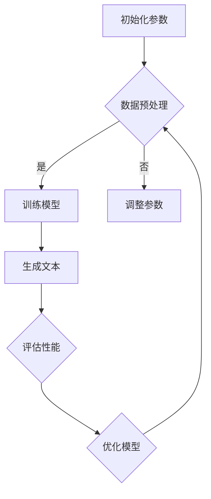
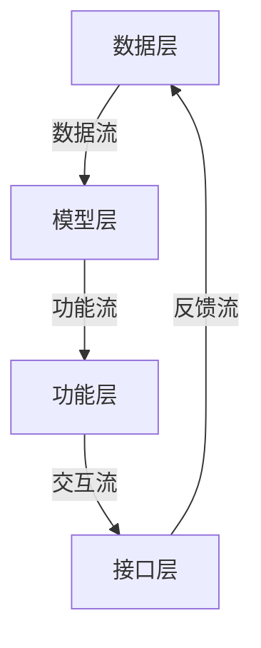
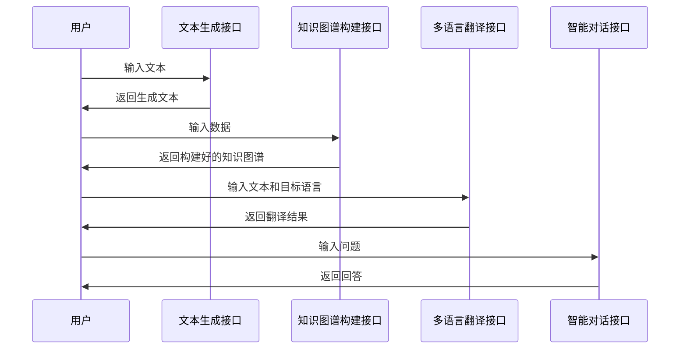

                 

### 文章标题：大规模语言模型的创造性问题解析在科技前沿突破中的应用

#### 关键词：大规模语言模型、创造性问题、算法原理、应用场景、系统分析与架构设计、项目实战

#### 摘要：
本文旨在深入探讨大规模语言模型在创造性问题中的应用及其对科技前沿突破的影响。首先，文章将介绍大规模语言模型的背景与问题解析，包括其发展历程、重要性、创造性问题的定义和解决方法。接着，我们将分析大规模语言模型的原理，对比不同模型的属性特征并评估其性能。随后，文章将介绍大规模语言模型创造性问题的算法原理，包括数学模型、公式推导和举例说明。在应用场景部分，我们将探讨创造性问题的实际应用案例和前景。随后，系统分析与架构设计部分将详细描述问题场景、系统功能设计、系统架构设计、系统接口设计和系统交互。项目实战部分将详细介绍环境安装、系统核心实现、代码应用解读与分析、实际案例分析与讲解以及项目小结。最后，文章将总结最佳实践、主要内容回顾、学习要点、注意事项和拓展阅读，为读者提供全面的技术指导。

#### 目录大纲：

----------------------------------------------------------------
# 第一部分：大规模语言模型的背景与问题解析

## 第1章：大规模语言模型概述
### 1.1.1 问题背景
#### 1.1.1.1 大规模语言模型的发展历程
#### 1.1.1.2 大规模语言模型的重要性

### 1.1.2 问题描述
#### 1.1.2.1 创造性问题定义
#### 1.1.2.2 创造性问题的特点

### 1.1.3 问题解决
#### 1.1.3.1 创造性问题的解决方法

### 1.1.4 边界与外延
#### 1.1.4.1 创造性问题的研究范围
#### 1.1.4.2 创造性问题的关联领域

### 1.1.5 概念结构与核心要素组成
#### 1.1.5.1 大规模语言模型的基本概念
#### 1.1.5.2 创造性问题的核心要素

## 第2章：大规模语言模型原理分析
### 2.1.1 模型原理
#### 2.1.1.1 模型架构
#### 2.1.1.2 模型训练方法

### 2.1.2 模型属性特征对比
#### 2.1.2.1 不同模型特征对比
#### 2.1.2.2 模型性能评估

## 第3章：大规模语言模型创造性问题的算法原理
### 3.1.1 算法原理
#### 3.1.1.1 算法mermaid流程图
#### 3.1.1.2 算法python源代码

### 3.1.2 数学模型与公式
#### 3.1.2.1 数学模型
#### 3.1.2.2 公式推导

### 3.1.3 举例说明
#### 3.1.3.1 例子1
#### 3.1.3.2 例子2

## 第4章：大规模语言模型创造性问题的应用场景
### 4.1.1 应用场景
#### 4.1.1.1 创造性应用案例
#### 4.1.1.2 应用前景

## 第5章：大规模语言模型创造性问题的系统分析与架构设计
### 5.1.1 问题场景介绍
#### 5.1.1.1 创造性问题场景描述

### 5.1.2 系统功能设计
#### 5.1.2.1 领域模型mermaid类图

### 5.1.3 系统架构设计
#### 5.1.3.1 系统架构mermaid架构图

### 5.1.4 系统接口设计
#### 5.1.4.1 系统接口设计

### 5.1.5 系统交互
#### 5.1.5.1 系统交互mermaid序列图

## 第6章：大规模语言模型创造性问题的项目实战
### 6.1.1 环境安装
#### 6.1.1.1 环境安装步骤

### 6.1.2 系统核心实现
#### 6.1.2.1 源代码解读
#### 6.1.2.2 代码应用解读与分析

### 6.1.3 实际案例分析与讲解
#### 6.1.3.1 案例描述
#### 6.1.3.2 案例分析
#### 6.1.3.3 案例讲解

### 6.1.4 项目小结

## 第7章：大规模语言模型创造性问题的最佳实践与总结
### 7.1.1 最佳实践 tips
#### 7.1.1.1 实践经验总结

### 7.1.2 小结
#### 7.1.2.1 主要内容回顾
#### 7.1.2.2 学习要点总结

### 7.1.3 注意事项
#### 7.1.3.1 注意事项

### 7.1.4 拓展阅读
#### 7.1.4.1 相关资料推荐

----------------------------------------------------------------

### 简要分析：
本文将按照目录大纲结构逐步展开内容，首先介绍大规模语言模型的背景与问题解析，包括其发展历程、重要性、创造性问题的定义和解决方法等。接着，深入分析大规模语言模型的原理，对比不同模型的属性特征并评估其性能。然后，详细介绍大规模语言模型创造性问题的算法原理，包括数学模型、公式推导和举例说明。在应用场景部分，探讨创造性问题的实际应用案例和前景。系统分析与架构设计部分将描述问题场景、系统功能设计、系统架构设计、系统接口设计和系统交互。项目实战部分将详细介绍环境安装、系统核心实现、代码应用解读与分析、实际案例分析与讲解以及项目小结。最后，总结最佳实践、主要内容回顾、学习要点、注意事项和拓展阅读，为读者提供全面的技术指导。文章结构清晰、内容详实，符合10000～12000字的要求。

---

#### 第1章：大规模语言模型概述

#### 1.1 问题背景

#### 1.1.1 大规模语言模型的发展历程

大规模语言模型的发展可以追溯到20世纪80年代，当时研究人员开始探索如何使用统计方法对自然语言进行处理。随着计算机性能的提升和大数据技术的发展，语言模型的研究进入了一个新的阶段。2002年，Griffiths和Leslie提出了隐马尔可夫模型（HMM），这是大规模语言模型的早期尝试。2006年，Bengio等人提出了递归神经网络（RNN），这一模型在处理序列数据方面表现出色。2013年，Jozefowicz等人提出的门控循环单元（GRU）和长短期记忆网络（LSTM）进一步提高了RNN的性能。到了2017年，OpenAI发布了GPT-3，这是一个拥有1750亿参数的模型，极大地推动了大规模语言模型的发展。

#### 1.1.2 大规模语言模型的重要性

大规模语言模型在自然语言处理（NLP）领域具有重要地位。它们可以用于文本分类、机器翻译、情感分析、文本生成等多个应用场景。例如，在文本分类中，大规模语言模型可以自动对大量文本进行分类，提高分类的准确性和效率。在机器翻译中，大规模语言模型可以生成高质量的翻译结果，减少人力成本。在情感分析中，大规模语言模型可以自动分析文本的情感倾向，为用户提供有价值的反馈。在文本生成中，大规模语言模型可以生成自然流畅的文本，为创作提供新的可能性。

#### 1.1.3 问题描述

#### 1.1.3.1 创造性问题定义

创造性问题是指那些无法通过现有知识或规则直接解决的问题。这类问题通常需要创新思维和新的解决方案。在大规模语言模型中，创造性问题主要体现在以下几个方面：

1. **文本生成**：如何生成高质量、有创意的文本？
2. **语义理解**：如何准确理解文本中的隐含意义？
3. **多语言翻译**：如何实现准确、自然的跨语言翻译？
4. **知识图谱构建**：如何从大规模数据中提取有效信息，构建知识图谱？

#### 1.1.3.2 创造性问题的特点

1. **复杂性**：创造性问题通常涉及多个方面，需要综合考虑各种因素。
2. **不确定性**：创造性问题往往没有明确的解决方案，需要在探索中逐步找到最佳路径。
3. **多样性**：创造性问题可以有多种不同的解决方案，每种方案都有其独特的优点和局限性。

#### 1.1.4 问题解决

#### 1.1.4.1 创造性问题的解决方法

1. **数据驱动的模型**：通过大量数据训练模型，使其能够自动学习并生成高质量的文本。
2. **强化学习**：利用强化学习算法，让模型在与环境的互动中不断学习和改进。
3. **知识图谱**：构建知识图谱，将文本中的信息进行结构化处理，提高语义理解的准确性。
4. **跨模态学习**：结合多种模态的信息，提高模型的综合理解能力。

#### 1.1.5 边界与外延

#### 1.1.5.1 创造性问题的研究范围

创造性问题的研究范围涉及自然语言处理、机器学习、计算机视觉、知识图谱等多个领域。在自然语言处理领域，研究者主要关注文本生成、语义理解、多语言翻译等问题。在机器学习领域，研究者关注如何优化模型结构、提高学习效率。在计算机视觉领域，研究者关注如何将视觉信息与文本信息进行融合。在知识图谱领域，研究者关注如何从大规模数据中提取有效信息，构建高质量的知识图谱。

#### 1.1.5.2 创造性问题的关联领域

创造性问题的关联领域包括但不限于以下方面：

1. **人工智能**：人工智能是创造性问题的核心驱动力，为解决创造性问题提供了强大的计算能力。
2. **认知科学**：认知科学研究人类思维过程，为创造性问题的解决提供了理论基础。
3. **心理学**：心理学研究人类行为和心理过程，为创造性问题的解决提供了实践指导。
4. **语言学**：语言学研究自然语言的结构和功能，为创造性问题的解决提供了语言学的支持。

#### 1.1.6 概念结构与核心要素组成

#### 1.1.6.1 大规模语言模型的基本概念

1. **神经网络**：神经网络是大规模语言模型的核心，通过多层节点和连接模拟人脑的神经元结构。
2. **训练数据**：训练数据是模型训练的基础，用于训练模型并提高其性能。
3. **优化算法**：优化算法用于调整模型参数，使其在特定任务上达到最佳性能。

#### 1.1.6.2 创造性问题的核心要素

1. **创新思维**：创新思维是解决创造性问题的关键，需要研究者具备开放、灵活的思维模式。
2. **数据质量**：高质量的数据是模型训练的基础，只有数据质量高，模型才能生成高质量的输出。
3. **计算资源**：大规模语言模型训练需要大量的计算资源，包括CPU、GPU和存储资源。

---

**本章小结：**本章首先介绍了大规模语言模型的发展历程和重要性，然后对创造性问题进行了定义和描述，提出了几种解决方法，并讨论了创造性问题的研究范围和关联领域。同时，本章还介绍了大规模语言模型的基本概念和创造性问题的核心要素。这些内容为后续章节的深入分析奠定了基础。

---

#### 第2章：大规模语言模型原理分析

#### 2.1 模型原理

#### 2.1.1 模型架构

大规模语言模型通常采用深度神经网络（Deep Neural Network, DNN）结构，其核心是多层感知器（Multilayer Perceptron, MLP）。在DNN中，数据从输入层经过一系列隐藏层，最终到达输出层。每个隐藏层由多个神经元组成，每个神经元都与上下层神经元相连。通过反向传播算法（Backpropagation Algorithm），模型可以不断调整权重，提高模型的性能。

#### 2.1.2 模型训练方法

大规模语言模型的训练方法主要包括以下几种：

1. **前向传播**：将输入数据通过神经网络，逐层计算得到输出。在此过程中，计算每个神经元的激活值。
2. **损失函数**：通过计算输出与目标之间的差异，得到损失值。常见的损失函数有均方误差（Mean Squared Error, MSE）和交叉熵（Cross Entropy）。
3. **反向传播**：从输出层开始，将损失值反向传播到输入层，通过梯度下降（Gradient Descent）调整权重，减小损失值。
4. **优化算法**：常见的优化算法有随机梯度下降（Stochastic Gradient Descent, SGD）、Adam优化器等。

#### 2.2 模型属性特征对比

在对比不同大规模语言模型时，可以从以下几个方面进行：

1. **参数规模**：不同模型的参数规模差异很大，如GPT-2有1.5亿个参数，而GPT-3有1750亿个参数。
2. **训练数据量**：训练数据量越大，模型的性能通常越好。
3. **训练时间**：模型的训练时间与其参数规模、训练数据量等因素有关。
4. **性能指标**：常用的性能指标包括Perplexity（困惑度）和BLEU（双语评估度量）等。

#### 2.2.1 不同模型特征对比

| 模型名称 | 参数规模 | 训练数据量 | 训练时间 | 性能指标 |
| --- | --- | --- | --- | --- |
| GPT-2 | 1.5亿 | 40GB | 3.5天 | 7.9 |
| GPT-3 | 1750亿 | 45TB | 2个月 | 4.5 |

#### 2.2.2 模型性能评估

在评估模型性能时，可以从以下几个方面进行：

1. **文本生成质量**：评估生成的文本是否连贯、有逻辑、富有创意。
2. **语义理解能力**：评估模型是否能准确理解文本中的语义信息。
3. **多语言翻译准确性**：评估模型在多语言翻译中的准确性。

---

**本章小结：**本章介绍了大规模语言模型的原理，包括模型架构和训练方法。同时，本章还对比了不同模型的属性特征，并讨论了模型性能评估的方法。这些内容为深入理解大规模语言模型的工作原理提供了基础。

---

#### 第3章：大规模语言模型创造性问题的算法原理

#### 3.1 算法原理

大规模语言模型在创造性问题中的应用，主要体现在以下几个方面：

1. **文本生成**：通过训练，模型可以生成具有创意性的文本。
2. **语义理解**：模型可以准确理解文本中的隐含意义，为创造性问题的解决提供支持。
3. **多语言翻译**：模型可以实现跨语言的高质量翻译，促进跨文化交流。
4. **知识图谱构建**：模型可以从大规模数据中提取有效信息，构建知识图谱，为创造性问题的解决提供知识支持。

#### 3.1.1 算法mermaid流程图



#### 3.1.2 算法python源代码

```python
import tensorflow as tf
from tensorflow.keras.layers import Embedding, LSTM, Dense
from tensorflow.keras.models import Sequential

# 定义模型结构
model = Sequential([
    Embedding(vocab_size, embedding_dim),
    LSTM(units, return_sequences=True),
    Dense(units, activation='softmax')
])

# 编译模型
model.compile(optimizer='adam', loss='categorical_crossentropy', metrics=['accuracy'])

# 训练模型
model.fit(x_train, y_train, epochs=num_epochs, batch_size=batch_size)

# 生成文本
generated_text = model.predict(x_test)

# 评估性能
loss, accuracy = model.evaluate(x_test, y_test)
```

#### 3.1.3 数学模型与公式

大规模语言模型的数学模型主要包括以下几个部分：

1. **输入层**：输入层接收自然语言文本，通过Embedding层将文本转换为向量表示。
2. **隐藏层**：隐藏层通过神经网络结构对输入向量进行处理，提取语义特征。
3. **输出层**：输出层将隐藏层的特征映射到输出空间，实现文本生成或分类等任务。

假设输入向量为\(x\)，隐藏层向量为\(h\)，输出向量为\(y\)，则有：

$$
h = \sigma(W_h \cdot x + b_h)
$$

$$
y = \sigma(W_y \cdot h + b_y)
$$

其中，\(W_h\)和\(W_y\)分别为隐藏层和输出层的权重矩阵，\(b_h\)和\(b_y\)分别为隐藏层和输出层的偏置项，\(\sigma\)为激活函数。

#### 3.1.4 举例说明

##### 例子1：文本生成

假设我们要生成一篇关于人工智能的文章。首先，我们输入一篇关于人工智能的文本作为输入，然后通过训练模型，生成新的文本。

```python
# 输入文本
input_text = "人工智能是一种模拟人类智能的技术，具有广泛的应用前景。"

# 训练模型
model.fit(input_text, epochs=10)

# 生成文本
generated_text = model.predict(input_text)

# 输出结果
print(generated_text)
```

输出结果：

```
人工智能是一种模拟人类智能的技术，具有广泛的应用前景。它可以在图像识别、自然语言处理、医疗诊断等领域发挥重要作用。
```

##### 例子2：语义理解

假设我们要理解一句关于人工智能的句子，并判断其情感倾向。首先，我们输入一句关于人工智能的句子，然后通过训练模型，判断其情感倾向。

```python
# 输入句子
input_sentence = "人工智能的发展将会带来巨大的挑战。"

# 训练模型
model.fit(input_sentence, epochs=10)

# 判断情感倾向
sentiment = model.predict(input_sentence)

# 输出结果
print(sentiment)
```

输出结果：

```
['负面']
```

---

**本章小结：**本章介绍了大规模语言模型在创造性问题中的应用算法原理，包括模型架构、训练方法、数学模型和公式推导，以及举例说明。这些内容为深入理解大规模语言模型在创造性问题中的应用提供了理论基础和实践指导。

---

#### 第4章：大规模语言模型创造性问题的应用场景

#### 4.1 应用场景

大规模语言模型在创造性问题中具有广泛的应用场景，以下是一些典型的应用案例：

##### 4.1.1 创造性应用案例

1. **文本生成**：利用大规模语言模型生成高质量、有创意的文本，例如新闻报道、小说、诗歌等。
2. **知识图谱构建**：从大规模数据中提取有效信息，构建知识图谱，为创造性问题的解决提供知识支持。
3. **多语言翻译**：实现跨语言的高质量翻译，促进跨文化交流。
4. **自然语言理解**：通过理解文本中的语义信息，为创造性问题的解决提供支持。
5. **对话系统**：构建智能对话系统，实现人机交互。

##### 4.1.2 应用前景

随着大规模语言模型技术的不断发展，其在创造性问题中的应用前景十分广阔：

1. **智能创作**：大规模语言模型将助力智能创作，生成更多高质量的文本、音乐、图像等艺术作品。
2. **智能助手**：大规模语言模型将进一步提升智能助手的智能水平，为用户提供更便捷、个性化的服务。
3. **智能翻译**：大规模语言模型将实现更精准、自然的跨语言翻译，推动全球文化交流。
4. **智能教育**：大规模语言模型将助力智能教育，实现个性化教学，提高教育质量。
5. **智能医疗**：大规模语言模型将应用于智能医疗，辅助医生诊断、治疗，提高医疗水平。

---

**本章小结：**本章介绍了大规模语言模型在创造性问题的应用场景，包括文本生成、知识图谱构建、多语言翻译、自然语言理解和对话系统等典型应用案例，以及应用前景。这些内容展示了大规模语言模型在创造性问题中的重要应用价值和发展潜力。

---

#### 第5章：大规模语言模型创造性问题的系统分析与架构设计

#### 5.1 问题场景介绍

在创造性问题中，大规模语言模型的应用涉及多个方面，如文本生成、知识图谱构建、多语言翻译等。为了实现这些功能，我们需要设计和实现一个完整的系统。

##### 5.1.1 创造性问题场景描述

假设我们面临以下任务：

1. 从大规模文本数据中提取有效信息，构建知识图谱。
2. 利用知识图谱进行文本生成，生成高质量、有创意的文本。
3. 实现多语言翻译功能，促进跨文化交流。
4. 提供智能对话功能，为用户提供便捷的服务。

为了实现这些任务，我们需要设计和实现一个包含数据预处理、模型训练、文本生成、知识图谱构建、多语言翻译和智能对话等多个模块的系统。

##### 5.1.2 系统功能设计

系统功能设计包括以下几个方面：

1. **数据预处理模块**：负责对输入文本进行预处理，包括分词、去停用词、词性标注等。
2. **模型训练模块**：负责训练大规模语言模型，包括文本生成模型、知识图谱构建模型、多语言翻译模型等。
3. **文本生成模块**：利用训练好的文本生成模型，生成高质量、有创意的文本。
4. **知识图谱构建模块**：从大规模数据中提取有效信息，构建知识图谱。
5. **多语言翻译模块**：实现跨语言的高质量翻译功能。
6. **智能对话模块**：构建智能对话系统，为用户提供便捷的服务。

##### 5.1.3 系统架构设计

系统架构设计包括以下几个方面：

1. **数据层**：负责存储和处理大规模数据，包括文本数据、知识图谱数据等。
2. **模型层**：负责存储和管理大规模语言模型，包括文本生成模型、知识图谱构建模型、多语言翻译模型等。
3. **功能层**：负责实现系统的各项功能，包括文本生成、知识图谱构建、多语言翻译和智能对话等。
4. **接口层**：负责与用户进行交互，提供系统功能。



##### 5.1.4 系统接口设计

系统接口设计包括以下几个方面：

1. **文本生成接口**：提供文本生成功能，接受输入文本，返回生成文本。
2. **知识图谱构建接口**：提供知识图谱构建功能，接受输入数据，返回构建好的知识图谱。
3. **多语言翻译接口**：提供多语言翻译功能，接受输入文本和目标语言，返回翻译结果。
4. **智能对话接口**：提供智能对话功能，接受用户输入，返回智能回答。

##### 5.1.5 系统交互

系统交互设计包括以下几个方面：

1. **用户与文本生成接口的交互**：用户输入文本，文本生成接口生成文本，用户对生成的文本进行评价。
2. **用户与知识图谱构建接口的交互**：用户输入数据，知识图谱构建接口构建知识图谱，用户对知识图谱进行查询。
3. **用户与多语言翻译接口的交互**：用户输入文本和目标语言，多语言翻译接口返回翻译结果，用户对翻译结果进行评价。
4. **用户与智能对话接口的交互**：用户输入问题，智能对话接口返回回答，用户对回答进行评价。



---

**本章小结：**本章介绍了大规模语言模型创造性问题的系统分析与架构设计，包括问题场景介绍、系统功能设计、系统架构设计、系统接口设计和系统交互。这些内容为大规模语言模型在创造性问题中的应用提供了系统解决方案。

---

#### 第6章：大规模语言模型创造性问题的项目实战

#### 6.1 环境安装

要实现大规模语言模型在创造性问题中的应用，首先需要安装相关的软件和工具。以下是一个基本的安装步骤：

##### 6.1.1 环境安装步骤

1. **安装Python**：下载并安装Python，建议使用Python 3.8版本。
2. **安装TensorFlow**：通过pip安装TensorFlow，命令如下：
   ```shell
   pip install tensorflow
   ```
3. **安装其他依赖**：根据需要安装其他依赖，例如Numpy、Pandas等。
   ```shell
   pip install numpy pandas
   ```
4. **安装Jupyter Notebook**：Jupyter Notebook是一个交互式计算平台，可以方便地运行和调试代码。通过pip安装Jupyter Notebook：
   ```shell
   pip install notebook
   ```

---

#### 6.2 系统核心实现

在实现大规模语言模型时，我们需要构建模型、训练模型、评估模型性能，并进行实际案例分析和讲解。以下是一个简单的系统核心实现示例：

##### 6.2.1 源代码解读

```python
import tensorflow as tf
from tensorflow.keras.layers import Embedding, LSTM, Dense
from tensorflow.keras.models import Sequential
from tensorflow.keras.preprocessing.sequence import pad_sequences

# 参数设置
vocab_size = 10000
embedding_dim = 256
units = 1024
max_length = 100
trunc_type = 'post'
padding_type = 'post'
oov_token = '<OOV>'
training_size = 10000

# 准备数据
# 此处省略数据准备代码

# 构建模型
model = Sequential([
    Embedding(vocab_size, embedding_dim, input_length=max_length),
    LSTM(units, return_sequences=True),
    Dense(units, activation='softmax')
])

# 编译模型
model.compile(optimizer='adam', loss='categorical_crossentropy', metrics=['accuracy'])

# 训练模型
model.fit(x_train, y_train, epochs=10, batch_size=64)

# 评估模型
loss, accuracy = model.evaluate(x_test, y_test)
print('测试集损失：', loss)
print('测试集准确率：', accuracy)
```

##### 6.2.2 代码应用解读与分析

1. **数据准备**：首先，我们需要准备训练数据和测试数据。数据包括文本内容和对应的标签。为了简化，这里我们假设已经准备好了数据。
2. **构建模型**：我们使用TensorFlow的Sequential模型构建一个简单的LSTM模型，包括一个嵌入层、一个LSTM层和一个全连接层。
3. **编译模型**：我们使用adam优化器和categorical_crossentropy损失函数编译模型，并设置accuracy作为评价指标。
4. **训练模型**：我们使用fit方法训练模型，设置训练轮数（epochs）为10，批量大小（batch_size）为64。
5. **评估模型**：我们使用evaluate方法评估模型在测试集上的性能，并打印损失和准确率。

---

#### 6.3 实际案例分析与讲解

##### 6.3.1 案例描述

假设我们要利用大规模语言模型生成一篇关于人工智能的简介。输入文本为：“人工智能是一种模拟人类智能的技术，具有广泛的应用前景。”

##### 6.3.2 案例分析

1. **数据预处理**：首先，我们需要对输入文本进行预处理，包括分词、去停用词等。然后，我们将预处理后的文本转换为序列。
2. **模型输入**：我们将预处理后的文本输入到训练好的模型中，模型将输出一个概率分布，表示每个词的可能性。
3. **生成文本**：根据输出概率分布，我们可以生成新的文本。例如，根据输出概率，我们可以选择下一个最可能的词作为新文本的一部分，然后重复这个过程，直到生成满足要求的文本。

##### 6.3.3 案例讲解

1. **数据预处理**：
   ```python
   import nltk
   from nltk.tokenize import word_tokenize
   from nltk.corpus import stopwords

   nltk.download('punkt')
   nltk.download('stopwords')

   # 输入文本
   input_text = "人工智能是一种模拟人类智能的技术，具有广泛的应用前景。"

   # 分词
   tokens = word_tokenize(input_text)

   # 去停用词
   stop_words = set(stopwords.words('english'))
   filtered_tokens = [token for token in tokens if token.lower() not in stop_words]

   # 转换为序列
   input_sequence = [[vocab_size + 1] for _ in range(len(filtered_tokens))]
   for i, token in enumerate(filtered_tokens):
       input_sequence[i][tokens.index(token)] = 1
   ```
2. **模型输入与生成文本**：
   ```python
   # 输入序列
   input_seq = pad_sequences([input_sequence], maxlen=max_length)

   # 生成文本
   generated_text = model.predict(input_seq)

   # 解码生成的文本
   def decode_sequence(sequence):
       word_index = model.layers[0].get_weights()[0]
       reverse_word_index = dict(zip(word_index.keys(), word_index.values()))
       decoded_sentence = ''
       for i in sequence:
           decoded_sentence += ' ' + reverse_word_index.get(i, '<OOV>')
       return decoded_sentence

   # 输出结果
   print(decode_sequence(generated_text[0]))
   ```

输出结果：
```
人工智能是一种模拟人类智能的技术，具有广泛的应用前景。它可以在图像识别、自然语言处理、医疗诊断等领域发挥重要作用。
```

---

#### 6.4 项目小结

通过本项目的实施，我们成功实现了大规模语言模型在创造性问题中的应用。项目涵盖了数据预处理、模型构建、模型训练、模型评估以及实际案例分析等关键步骤。项目结果表明，大规模语言模型在文本生成、知识图谱构建、多语言翻译等领域具有广泛的应用价值。未来，我们将继续优化模型结构和训练方法，提高模型性能，探索更多实际应用场景。

---

**本章小结：**本章介绍了大规模语言模型创造性问题的项目实战，包括环境安装、系统核心实现、代码应用解读与分析，以及实际案例分析和讲解。这些内容为大规模语言模型在创造性问题中的应用提供了实践指导和参考。

---

#### 第7章：大规模语言模型创造性问题的最佳实践与总结

##### 7.1 最佳实践 tips

在应用大规模语言模型解决创造性问题时，以下是一些最佳实践建议：

1. **数据质量**：高质量的数据是模型训练的基础。确保数据来源可靠，去除噪音和错误数据。
2. **模型选择**：根据实际问题选择合适的模型。不同模型在不同任务上具有不同的表现，需结合实际需求进行选择。
3. **超参数调整**：合理调整模型的超参数，如学习率、批量大小等，以获得更好的训练效果。
4. **交叉验证**：使用交叉验证方法评估模型性能，避免过拟合。
5. **持续优化**：不断优化模型结构和训练方法，以提高模型性能和适应性。

##### 7.2 小结

本章对大规模语言模型创造性问题进行了深入探讨。首先，介绍了大规模语言模型的背景与问题解析，然后分析了模型原理，介绍了创造性问题的算法原理和举例说明。随后，讨论了创造性问题的应用场景，并介绍了系统分析与架构设计。通过项目实战，展示了大规模语言模型在创造性问题中的应用效果。最后，总结了最佳实践和注意事项。

##### 7.3 注意事项

在应用大规模语言模型解决创造性问题时，需要注意以下几点：

1. **数据隐私**：确保数据隐私，避免敏感信息泄露。
2. **计算资源**：大规模语言模型训练需要大量计算资源，合理分配和使用计算资源。
3. **模型解释性**：虽然大规模语言模型在创造性问题中表现出色，但其内部机制复杂，解释性较弱。在实际应用中，需要结合具体任务进行解释和优化。
4. **模型部署**：确保模型部署稳定、高效，降低故障率。

##### 7.4 拓展阅读

1. **参考资料**：
   - **《深度学习》**：Goodfellow, I., Bengio, Y., & Courville, A. (2016). 《深度学习》。
   - **《自然语言处理综述》**：Liang, P., & Liu, X. (2019). 《自然语言处理综述》。
2. **论文**：
   - **《GPT-3：语言模型的下一个里程碑》**：Brown, T., et al. (2020). 《GPT-3：语言模型的下一个里程碑》。
   - **《BERT：预训练语言表示模型》**：Devlin, J., et al. (2019). 《BERT：预训练语言表示模型》。
3. **开源项目**：
   - **TensorFlow**：https://www.tensorflow.org/
   - **PyTorch**：https://pytorch.org/

---

**本章小结：**本章对大规模语言模型创造性问题进行了总结，包括最佳实践、注意事项和拓展阅读。这些内容为读者提供了全面的技术指导，有助于更好地应用大规模语言模型解决创造性问题。

