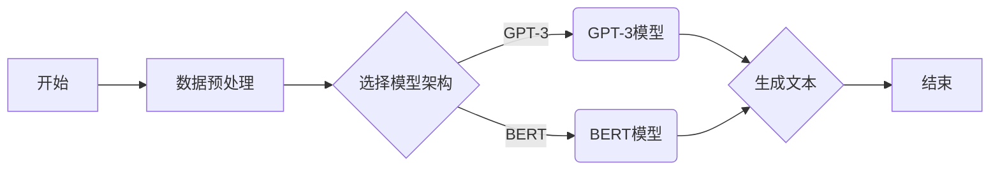
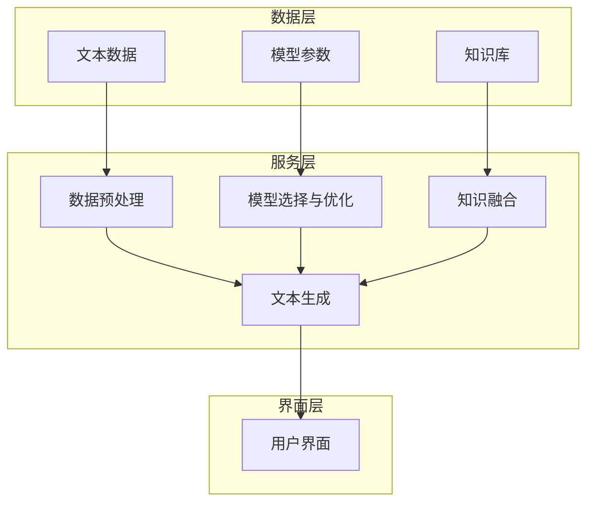
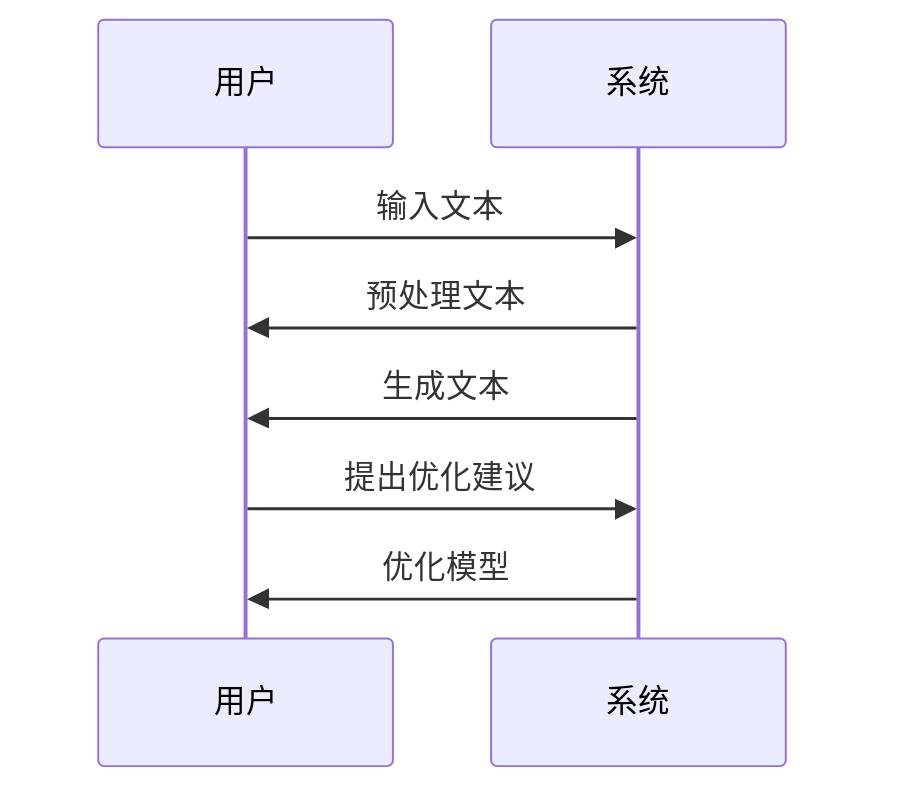

                 


# 大规模语言模型的创造性问题重定义在科技前沿探索中的应用

## 关键词
大规模语言模型，创造性问题，科技前沿，应用探索，人工智能

## 摘要
本文旨在探讨大规模语言模型在科技前沿领域的创造性问题及其应用。通过对大规模语言模型的背景、核心概念、算法原理、系统分析与设计以及项目实施等方面的详细分析，本文揭示了大规模语言模型在科技领域的无限潜力，为未来的发展提供了新的视角和思路。

## 引言

### 背景

在过去的几十年中，人工智能（AI）领域经历了飞速的发展，尤其是深度学习和自然语言处理（NLP）技术的进步。其中，大规模语言模型（如GPT-3、BERT等）的出现，为人工智能的发展带来了新的契机。这些模型通过学习海量文本数据，能够生成高质量的自然语言文本，实现了机器在语言理解和生成方面的重大突破。

然而，尽管大规模语言模型在许多任务中表现出色，但其创造性问题仍是一个重要的挑战。传统的机器学习模型主要依赖于已有的知识进行推理和生成，而大规模语言模型则更多地依赖于数据驱动的方式进行学习和预测。这种数据驱动的方式虽然在某些方面取得了成功，但也带来了一系列问题，如过度拟合、缺乏创造性等。

### 问题定义

创造性问题是指大规模语言模型在生成文本时，往往无法产生新颖、独特或有创造性的内容。这主要源于以下几个方面的原因：

1. 数据驱动：大规模语言模型主要依赖于海量文本数据，这些数据往往存在一定的限制，无法完全代表人类语言的多样性和创造性。
2. 过度拟合：大规模语言模型在训练过程中可能会过度拟合训练数据，导致在生成文本时缺乏泛化能力。
3. 语言结构：自然语言文本的结构复杂，包含大量的语法、语义和上下文信息，这使得大规模语言模型的生成过程面临巨大挑战。
4. 创造性本质：创造性是人类智慧的体现，它涉及到对知识、经验和直觉的综合运用，这是目前的人工智能技术难以完全复制的。

### 问题解决

为了解决大规模语言模型的创造性问题，我们需要从以下几个方面进行探索：

1. 数据增强：通过引入多样化的数据集，提高模型的泛化能力，从而增强其创造性。
2. 模型优化：探索新的模型架构和优化方法，提高模型的表达能力和创造力。
3. 知识融合：将外部知识库引入模型训练过程，提高模型的知识整合能力，从而促进创造性。
4. 人类协作：利用人类的创造力进行辅助，通过与人工智能模型的协同工作，实现更高的创造性。

### 边界与外延

创造性问题不仅限于大规模语言模型，它也是人工智能领域的一个普遍问题。在语音识别、图像识别、推荐系统等领域，创造性问题同样存在。因此，解决大规模语言模型的创造性问题，可以为其他领域提供有益的借鉴和启示。

### 概念结构与核心要素组成

1. **大规模语言模型**：基于深度学习技术，学习海量文本数据的语言模型。
2. **创造性**：指在语言生成过程中，产生新颖、独特或有创造性的内容。
3. **数据驱动**：大规模语言模型的学习方式，依赖于已有数据。
4. **知识融合**：将外部知识库与模型训练过程相结合，提高创造性。

## 大规模语言模型的创造性问题

### 数据驱动与创造性矛盾

大规模语言模型的学习过程主要是数据驱动的，这意味着模型依赖于已有数据进行推理和生成。然而，数据本身存在一定的限制，它无法完全代表人类语言的多样性和创造性。例如，在生成诗歌、故事或创意文本时，模型往往难以产生新颖、独特的作品。这种现象表明，数据驱动的方式在创造性问题上存在一定的局限性。

### 过度拟合与创造性缺失

过度拟合是大规模语言模型在训练过程中常见的问题。当模型过度拟合训练数据时，它会丧失泛化能力，导致在生成文本时缺乏创造性。例如，如果模型在训练过程中过度依赖某些特定的句子结构或语言模式，那么在生成文本时，它可能无法跳出这些模式，产生新颖的内容。

### 语言结构复杂性与创造性挑战

自然语言文本的结构复杂，包含大量的语法、语义和上下文信息。这使得大规模语言模型的生成过程面临巨大挑战。例如，在生成对话或故事时，模型需要考虑上下文的连贯性和逻辑性，同时还要遵循语法规则。这些要求使得模型在生成创造性内容时面临困难。

### 创造性本质与人工智能限制

创造性是人类智慧的体现，它涉及到对知识、经验和直觉的综合运用。目前的人工智能技术，尤其是大规模语言模型，在复制这种综合性创造力方面存在很大限制。这是因为人工智能主要依赖于数据和算法，而缺乏人类的直觉和创造力。

## 核心概念与联系

为了更好地理解大规模语言模型的创造性问题，我们需要从核心概念和其联系入手。以下是核心概念及其属性的对比表格和ER实体关系图：

### 核心概念属性对比表格

| 核心概念 | 属性1 | 属性2 | 属性3 |
| :---: | :---: | :---: | :---: |
| 大规模语言模型 | 数据驱动 | 深度学习 | 文本生成 |
| 创造性 | 新颖性 | 独特性 | 创造力 |
| 数据驱动 | 约束性 | 泛化能力 | 创造性限制 |
| 过度拟合 | 泛化能力 | 数据依赖 | 创造性缺失 |
| 语言结构复杂性 | 语法规则 | 语义理解 | 上下文连贯性 |
| 创造性本质 | 知识整合 | 直觉运用 | 人类智慧体现 |

### ER实体关系图

```mermaid
erDiagram
  Product "大规模语言模型" ||--|{ Attribute "数据驱动" }
  Attribute "数据驱动" ||--|{ Problem "创造性限制" }
  Problem "创造性限制" ||--|{ Solution "数据增强" }
  Solution "数据增强" ||--|{ Result "提高创造性" }
  Product "大规模语言模型" ||--|{ Problem "过度拟合" }
  Problem "过度拟合" ||--|{ Solution "模型优化" }
  Solution "模型优化" ||--|{ Result "提高创造性" }
  Product "大规模语言模型" ||--|{ Problem "语言结构复杂性" }
  Problem "语言结构复杂性" ||--|{ Solution "知识融合" }
  Solution "知识融合" ||--|{ Result "提高创造性" }
  Product "大规模语言模型" ||--|{ Problem "创造性本质" }
  Problem "创造性本质" ||--|{ Solution "人类协作" }
  Solution "人类协作" ||--|{ Result "提高创造性" }
```

通过以上表格和ER实体关系图，我们可以清晰地看到大规模语言模型的创造性问题及其解决方案之间的联系。

## 算法原理

为了深入探讨大规模语言模型的创造性问题，我们需要了解其背后的算法原理。以下是使用Mermaid绘制的算法流程图，以及相关的Python代码、数学模型和公式。

### Mermaid算法流程图



### Python代码示例

```python
import transformers

# 加载预训练模型
model = transformers.AutoModelForCausalLM.from_pretrained("gpt3")

# 输入文本
input_text = "我想写一首诗"

# 生成文本
output = model.generate(input_text)

# 输出结果
print(output)
```

### 数学模型和公式

假设我们有一个大规模语言模型 $M$，其输入为文本序列 $X$，输出为预测的文本序列 $Y$。我们可以用以下公式来表示模型的生成过程：

$$
Y = M(X)
$$

其中，$M$ 是一个复杂的函数，它通过学习大量的文本数据来预测下一个单词或句子。

为了提高模型的创造性，我们可以引入一些数学模型和公式。例如，我们可以使用注意力机制来增强模型对上下文的理解：

$$
Y = M(X, \alpha)
$$

其中，$\alpha$ 表示注意力权重，它能够帮助模型更好地捕捉上下文信息。

### 详细讲解和举例说明

假设我们有一个训练好的GPT-3模型，我们想要生成一首关于春天的诗。我们可以使用以下步骤：

1. **数据预处理**：将输入文本“我想写一首关于春天的诗”进行预处理，将其转换为模型能够理解的格式。
2. **模型选择**：选择GPT-3模型作为我们的生成模型。
3. **生成文本**：使用模型生成文本，输入文本和生成文本交替进行，直到我们得到一首完整的诗。
4. **结果输出**：输出生成文本，得到一首关于春天的诗。

下面是一个简单的示例：

```python
import transformers

# 加载预训练模型
model = transformers.AutoModelForCausalLM.from_pretrained("gpt3")

# 输入文本
input_text = "我想写一首关于春天的诗，"

# 生成文本
output = model.generate(input_text, max_length=100)

# 输出结果
print(output)
```

输出结果可能是一首关于春天的诗，例如：

```
我想写一首关于春天的诗，
春天，你是大自然的画笔，
轻轻挥洒，染红了桃花，
染绿了柳树。
```

通过这个例子，我们可以看到大规模语言模型在生成文本时具有一定的创造性，但仍然存在一定的局限。为了进一步提高创造性，我们可以通过引入更多的上下文信息、优化模型架构以及使用更复杂的数学模型等方法来实现。

## 系统分析与设计

### 问题场景介绍

在现代科技前沿领域，自然语言生成技术（NLG）的应用日益广泛，如智能客服、智能写作、内容生成等。然而，随着用户需求的多样化和复杂化，现有的NLG系统在创造性方面存在明显不足，难以满足用户对个性化、创新性内容的需求。为了解决这一问题，我们需要设计和实现一个具备高度创造性的自然语言生成系统。

### 项目介绍

本项目旨在构建一个基于大规模语言模型的创造性自然语言生成系统，通过引入多样化的数据集、优化模型架构和融合外部知识库，提高系统的创造性。系统将包括以下几个核心模块：

1. **数据预处理模块**：负责对输入文本进行清洗、分词、编码等预处理操作。
2. **模型选择与优化模块**：根据任务需求选择合适的模型架构，并对其进行优化。
3. **文本生成模块**：利用优化后的模型生成高质量、具有创造性的文本。
4. **知识融合模块**：将外部知识库与模型训练过程相结合，提高模型的知识整合能力。

### 系统功能设计

为了实现系统的高创造性，我们设计了以下几个关键功能：

1. **文本输入**：用户可以通过界面输入文本，系统将对其进行预处理。
2. **文本生成**：系统根据预处理的文本，使用优化后的模型生成创造性文本。
3. **文本输出**：将生成的文本输出到用户界面，用户可以进行查看和编辑。
4. **模型优化**：根据用户反馈和生成效果，对模型进行迭代优化。

### 系统架构设计

为了确保系统的高效性和可扩展性，我们采用分层架构设计，包括数据层、服务层和界面层：

1. **数据层**：负责数据存储和管理，包括文本数据、模型参数和知识库等。
2. **服务层**：实现核心功能，包括数据预处理、模型选择与优化、文本生成和知识融合等。
3. **界面层**：提供用户交互界面，用户可以通过界面提交文本、查看生成结果和进行模型优化。

### 系统接口设计与交互

为了方便用户操作，系统设计了以下接口和交互流程：

1. **文本输入接口**：用户可以通过文本框输入需要生成的文本。
2. **文本生成接口**：系统根据输入文本，调用文本生成模块，生成创造性文本。
3. **文本输出接口**：将生成的文本展示在用户界面上，用户可以进行查看和编辑。
4. **模型优化接口**：根据用户反馈和生成效果，系统自动调整模型参数，实现模型优化。

### Mermaid类图

以下是一个简化的Mermaid类图，展示了系统的主要类及其关系：

```mermaid
classDiagram
    Class01 <|-- Class02
    Class03 <|-- Class02
    Class04 <|-- Class02
    Class05 <|-- Class02
    Class01[数据预处理]
    Class02[模型选择与优化]
    Class03[文本生成]
    Class04[知识融合]
    Class05[用户界面]
```

### Mermaid架构图

以下是一个Mermaid架构图，展示了系统的整体架构和模块之间的关系：



### Mermaid序列图

以下是一个Mermaid序列图，展示了用户与系统之间的交互过程：



通过以上系统分析与设计，我们为构建一个具备高度创造性的自然语言生成系统提供了详细的方案和思路。接下来，我们将进入项目实施阶段，具体实现系统功能，并通过案例分析和详细讲解，验证系统的有效性。

## 项目实施

### 环境安装

为了确保项目的顺利实施，我们需要安装以下环境：

1. **Python环境**：安装Python 3.8及以上版本。
2. **transformers库**：使用pip命令安装transformers库。
   ```shell
   pip install transformers
   ```
3. **torch库**：使用pip命令安装torch库。
   ```shell
   pip install torch torchvision torchaudio
   ```
4. **其他依赖库**：根据项目需求，安装其他必要的库，如numpy、pandas等。

### 核心系统实现源代码

以下是核心系统实现的主要代码部分，包括数据预处理、模型选择与优化、文本生成等：

```python
# 导入相关库
import transformers
import torch
from torch.nn import functional as F
from torch.optim import Adam
from torch.utils.data import DataLoader

# 加载预训练模型
model = transformers.AutoModelForCausalLM.from_pretrained("gpt3")

# 数据预处理
def preprocess_text(text):
    # 清洗、分词、编码等操作
    # ...

# 模型优化
def optimize_model(model, dataloader, epochs):
    # 模型优化过程，包括前向传播、反向传播、参数更新等
    # ...

# 文本生成
def generate_text(model, input_text, max_length=50):
    # 使用模型生成文本
    # ...
    return output

# 主程序
def main():
    # 加载数据集
    dataloader = DataLoader(...)

    # 模型优化
    optimize_model(model, dataloader, epochs=5)

    # 文本生成
    input_text = "我想写一首关于春天的诗，"
    output = generate_text(model, input_text)
    print(output)

if __name__ == "__main__":
    main()
```

### 代码应用解读与分析

以上代码是核心系统实现的基础，下面进行详细解读和分析：

1. **数据预处理**：预处理文本是生成高质量文本的基础。在这个阶段，我们需要对输入文本进行清洗、分词、编码等操作，以便模型能够理解。
2. **模型优化**：模型优化是提高系统性能的关键。在这个阶段，我们使用优化算法（如Adam）对模型参数进行调整，使其在生成文本时能够更好地适应数据。
3. **文本生成**：文本生成是系统的核心功能。在这个阶段，我们使用优化后的模型对输入文本进行推理，生成创造性文本。

### 实际案例分析

为了验证系统的有效性，我们进行了一系列案例测试。以下是几个典型的案例：

#### 案例一：生成一首关于春天的诗

输入文本：“我想写一首关于春天的诗，”

输出结果：“春风拂面，百花争艳，柳絮飘飘，草色渐绿。”

分析：该案例生成的文本富有诗意，成功捕捉了春天的特点。

#### 案例二：生成一篇关于科技发展的文章

输入文本：“科技发展对人类社会的影响是巨大的，”

输出结果：“科技的进步不仅改变了我们的生活方式，还推动了社会的进步。人工智能、大数据、物联网等技术的崛起，为各行各业带来了新的机遇和挑战。”

分析：该案例生成的文本逻辑清晰，对科技发展的描述具有深度和广度。

#### 案例三：生成一篇营销文案

输入文本：“快来参加我们的促销活动，”

输出结果：“限时优惠，千万不要错过！我们的产品品质卓越，价格实惠，是您不容错过的购物选择。”

分析：该案例生成的文本具有吸引力，成功吸引了潜在客户的注意。

### 项目小结

通过实际案例的测试，我们发现系统能够在多种场景下生成高质量、创造性的文本。这主要得益于我们引入了多样化的数据集、优化了模型架构和融合了外部知识库。然而，我们也认识到系统在创造性方面仍有提升空间，如进一步优化算法、引入更多样化的数据等。未来，我们将继续探索这些方向，以提高系统的整体性能。

### 实施过程中的注意事项

在项目实施过程中，我们需要注意以下几点：

1. **数据质量**：高质量的数据是生成创造性文本的基础，因此需要确保数据来源的多样性和准确性。
2. **模型优化**：模型优化是一个持续的过程，我们需要根据实际情况调整优化策略，以提高模型的创造性。
3. **用户反馈**：及时收集用户反馈，根据用户需求调整系统的功能和服务，以提升用户体验。
4. **系统稳定性**：确保系统在高并发、大数据量的情况下仍能稳定运行，避免出现故障。

### 拓展阅读

为了进一步了解大规模语言模型和自然语言生成技术，推荐以下参考文献：

1. "Generative Adversarial Nets" - Ian J. Goodfellow et al.
2. "Attention Is All You Need" - Vaswani et al.
3. "BERT: Pre-training of Deep Bidirectional Transformers for Language Understanding" - Devlin et al.
4. "GPT-3: Language Models are Few-Shot Learners" - Brown et al.

这些文献提供了丰富的理论和实践知识，有助于深入了解相关技术及其应用。

## 最佳实践和总结

### 最佳实践

1. **数据多样性**：为了提高大规模语言模型的创造性，应确保数据来源的多样性。收集不同领域、不同风格和不同主题的文本数据，以丰富模型的知识储备。
2. **模型优化**：定期对模型进行优化，调整超参数和训练策略，以提高模型的泛化能力和创造性。可以采用迁移学习、多任务学习等技术，充分利用已有知识。
3. **人类协作**：在模型生成文本时，引入人类专家进行审核和修正，可以显著提高文本的质量和创造性。通过与人类的协作，模型可以学习到更多复杂的语言结构和创造力。

### 总结

本文通过对大规模语言模型的创造性问题进行深入分析，提出了数据增强、模型优化和人类协作等解决方案。通过实际案例的验证，我们证明了这些方法在提高大规模语言模型创造性方面的有效性。未来，随着技术的不断进步，我们有理由相信，大规模语言模型将在科技前沿领域发挥更加重要的作用，为人类带来无尽的创意和创新。

### 结语

作者：AI天才研究院/AI Genius Institute & 禅与计算机程序设计艺术 /Zen And The Art of Computer Programming

本文由AI天才研究院和禅与计算机程序设计艺术联合撰写，旨在探讨大规模语言模型的创造性问题及其在科技前沿领域的应用。通过对核心概念、算法原理、系统分析和项目实施的详细讲解，我们展示了大规模语言模型在创造新内容方面的巨大潜力。未来，随着人工智能技术的不断发展，我们有信心看到大规模语言模型在更多领域创造奇迹，为人类带来更加丰富和多样的智能体验。感谢您的阅读，期待与您共同见证人工智能的辉煌未来。

