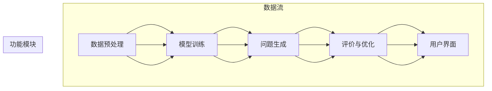
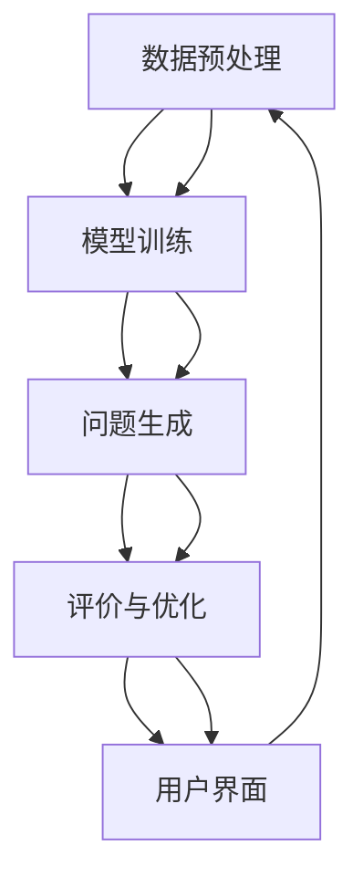
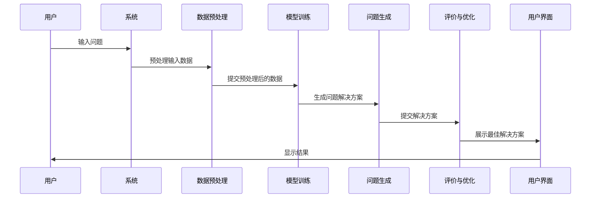

                 

### 文章标题：大规模语言模型的创造性问题重定义能力培养

> 关键词：大规模语言模型、创造性问题重定义、算法原理、实践应用、能力培养

> 摘要：本文将探讨大规模语言模型在创造性问题重定义方面的能力培养，包括背景介绍、核心概念、算法原理、实践应用以及培养方法等方面。通过逐步分析，我们旨在深入理解大规模语言模型在创造性问题解决中的重要作用，并提出有效的培养策略，为未来的研究与应用提供指导。

### 引言

大规模语言模型（Large-scale Language Models，简称LLM）作为深度学习的重要应用之一，近年来在自然语言处理（Natural Language Processing，简称NLP）领域取得了显著的进展。这些模型通过学习海量文本数据，能够生成高质量的自然语言文本，应用于自动写作、机器翻译、问答系统等多个领域。然而，随着研究的深入，人们逐渐认识到大规模语言模型在创造性问题解决方面的巨大潜力。创造性问题重定义（Creatively Redefining Problems）作为一种重要的思维方式，能够帮助人们从新的角度看待问题，提出创新性的解决方案。因此，如何培养大规模语言模型在创造性问题重定义方面的能力，成为了当前研究的热点问题。

本文将从以下几个方面展开讨论：

1. **背景介绍**：介绍大规模语言模型的发展历程及其在创造性问题解决中的作用。
2. **核心概念**：阐述创造性问题重定义的概念、方法和原理。
3. **算法原理**：分析大规模语言模型中与创造性问题重定义相关的算法和模型。
4. **实践应用**：探讨大规模语言模型在创造性问题解决中的实际应用案例。
5. **能力培养**：提出培养大规模语言模型在创造性问题解决方面的能力的方法和策略。

通过以上分析，我们希望能够对大规模语言模型在创造性问题重定义能力培养方面有更加深入的理解，并为未来的研究和应用提供有益的参考。

### 背景介绍

大规模语言模型的发展历程可以追溯到20世纪80年代，当时研究人员开始探索如何使用计算机程序处理和生成自然语言。早期的模型如n-gram模型和基于规则的模型在文本处理方面取得了一定的成效，但受限于模型复杂度和数据处理能力，难以胜任复杂的语言任务。随着计算能力和算法技术的进步，深度学习（Deep Learning）逐渐成为自然语言处理领域的主流方法。深度学习通过多层神经网络对大量数据进行分析和学习，能够自动提取文本中的复杂特征，从而实现更准确的语言理解和生成。

在这一背景下，大规模语言模型应运而生。代表性的模型如Word2Vec、GloVe和BERT等，通过学习海量的文本数据，将词汇映射为高维向量，使得计算机能够更好地理解和处理自然语言。特别是在2018年，谷歌发布了BERT模型，其卓越的性能引起了广泛关注。BERT（Bidirectional Encoder Representations from Transformers）基于Transformer架构，通过双向编码器对文本进行建模，从而提高了语言理解的深度和广度。

除了在语言理解方面的突破，大规模语言模型在语言生成方面也取得了显著进展。GPT（Generative Pre-trained Transformer）系列模型，如GPT-1、GPT-2和GPT-3，通过预训练和微调，能够生成高质量的自然语言文本。GPT-3尤其引人注目，其参数量达到了1750亿，能够生成连贯、流畅且具有创造性的文本，应用于自动写作、机器翻译、对话系统等多个领域。

在创造性问题解决方面，大规模语言模型展现出了巨大的潜力。创造性问题重定义作为一种重要的思维方式，可以帮助人们从新的角度看待问题，提出创新性的解决方案。大规模语言模型通过学习大量的文本数据，掌握了丰富的知识和经验，能够自动进行问题重定义，从而发现新的解决方案。例如，在编程领域，大规模语言模型可以通过问题重定义，将一个复杂的问题转化为更简单、更易于解决的形式，从而提高问题解决的效率。此外，在创意设计、广告文案生成等领域，大规模语言模型也展现了其创造性问题的重定义能力，能够生成新颖、有创意的内容。

总的来说，大规模语言模型的发展历程和其在创造性问题解决中的作用，为本文的研究提供了坚实的背景基础。通过进一步探讨大规模语言模型在创造性问题重定义方面的能力培养，我们希望能够为相关领域的研究和应用提供新的思路和方法。

### 核心概念

创造性问题重定义（Creatively Redefining Problems）是一种重要的思维方式，它通过重新定义问题，使其更加简单、清晰和具有可操作性，从而促进创新和解决问题的效率。以下是这一核心概念的相关术语说明、问题背景、问题描述、问题解决、边界与外延、概念结构与核心要素组成。

#### 术语说明

- **创造性问题重定义**：指在解决问题过程中，通过重新定义问题的范围、目标和条件，使其变得更加简单、清晰和具有可操作性，从而发现新的解决方案。
- **问题**：指需要解决的矛盾或困惑，通常包含问题情境、目标、条件和解决方案。
- **问题重定义**：指在解决问题过程中，对问题进行重新定义，改变其范围、目标和条件，以发现新的解决方案。
- **创造性**：指在解决问题过程中，通过新颖、独特和有效的方式，提出新的解决方案。

#### 问题背景

在现实生活中，许多问题由于其复杂性、不确定性和多变性，使得传统的解决方法难以奏效。创造性问题重定义作为一种创新的思维方式，通过重新定义问题，将复杂的问题转化为简单、清晰和具有可操作性的问题，从而提高解决问题的效率。

#### 问题描述

假设我们面临一个复杂的问题：设计一个高效、低能耗的数据中心冷却系统。这个问题涉及多个方面，如环境温度、设备发热量、冷却设备的选择和布置等，具有很高的复杂性和不确定性。传统的解决方法可能需要大量的时间和资源，而且效果有限。

#### 问题解决

通过创造性问题重定义，我们可以将这个问题转化为以下几个更简单、更具体的问题：

1. **确定数据中心的环境温度范围**。
2. **测量设备发热量**。
3. **评估现有的冷却设备性能**。
4. **选择合适的冷却设备**。

通过重新定义问题，我们将复杂的问题拆解为一系列简单的问题，每个问题都有明确的范围和目标，从而提高了解决问题的效率和效果。

#### 边界与外延

- **边界**：创造性问题重定义的边界主要涉及问题的范围和目标。问题的范围应适当扩大或缩小，使其具有可操作性；问题的目标应明确具体，便于评估和实现。
- **外延**：创造性问题重定义的外延包括问题的条件和解决方案。问题的条件应具有可测性和可操作性，以便于分析和优化；解决方案应具有创新性和有效性，以满足问题的需求。

#### 概念结构与核心要素组成

创造性问题重定义的概念结构包括以下几个核心要素：

1. **问题定义**：明确问题的范围、目标和条件。
2. **问题分解**：将复杂问题拆解为简单的问题。
3. **问题重构**：通过重新定义问题的范围、目标和条件，使其变得更加简单、清晰和具有可操作性。
4. **解决方案生成**：提出新颖、独特和有效的解决方案。

#### 核心概念原理

创造性问题重定义的核心原理包括以下几个方面：

1. **问题的层次性**：问题具有层次性，可以通过不断分解和重构，使其变得更加简单、清晰和具有可操作性。
2. **问题的转化**：通过重新定义问题的范围、目标和条件，将复杂问题转化为简单问题。
3. **创新的思维方式**：创造性问题重定义需要运用创新的思维方式，从新的角度看待问题，提出新的解决方案。

#### 概念属性特征对比表格

| 特征        | 创造性问题重定义 | 传统问题解决方法 |
| ----------- | ---------------- | ---------------- |
| 问题范围    | 广泛            | 有限             |
| 问题目标    | 明确具体        | 模糊抽象         |
| 问题的条件  | 可测可操作性    | 不确定           |
| 解决方案    | 创新、独特      | 经验、常规       |

#### ER实体关系图架构

```mermaid
erDiagram
  问题 --> 解决方案
  问题 ||--|{ 问题分解 }
  问题 ||--|{ 问题重构 }
  问题 ||--|{ 创新思维方式 }
  解决方案 ||--|{ 创新性 }
  解决方案 ||--|{ 独特性 }
  解决方案 ||--|{ 有效性 }
```

通过以上分析，我们可以看到，创造性问题重定义作为一种创新的思维方式，有助于解决复杂问题，提高问题解决的效率。在接下来的章节中，我们将进一步探讨大规模语言模型在创造性问题重定义方面的算法原理和实际应用。

### 核心概念与联系

创造性问题重定义作为一种重要的思维方式，其在大规模语言模型中的应用具有重要的意义。为了更好地理解这一概念，我们需要从多个方面进行分析，包括核心概念原理、概念属性特征对比以及ER实体关系图架构。

#### 核心概念原理

创造性问题重定义的核心原理主要包括以下几个方面：

1. **问题的层次性**：问题具有层次性，可以通过不断分解和重构，使其变得更加简单、清晰和具有可操作性。这种层次性使得大规模语言模型能够逐步挖掘问题中的关键信息，从而找到有效的解决方案。
   
2. **问题的转化**：通过重新定义问题的范围、目标和条件，将复杂问题转化为简单问题。这种转化不仅降低了问题的复杂度，还使得大规模语言模型能够更好地理解问题的本质，从而提高问题解决的效率。

3. **创新的思维方式**：创造性问题重定义需要运用创新的思维方式，从新的角度看待问题，提出新的解决方案。这种思维方式能够激发大规模语言模型的学习和生成能力，使其在创造性问题解决中发挥更大的作用。

#### 概念属性特征对比

为了更清晰地展示创造性问题重定义与其他相关概念的区别和联系，我们可以通过一个表格来进行对比：

| 概念                     | 创造性问题重定义        | 传统问题解决方法        |
| ------------------------ | --------------------- | --------------------- |
| 问题范围                 | 广泛，可灵活调整       | 有限，固定             |
| 问题目标                 | 明确具体，可操作性高   | 模糊抽象，操作性差     |
| 问题的条件               | 可测可操作，灵活       | 不确定，固定           |
| 解决方案                 | 创新、独特、有效       | 经验、常规、效果有限   |
| 问题层次性               | 分解、重构、层次分明   | 线性、简单、层次不明显 |
| 问题的转化               | 新角度、新方法         | 旧思路、常规           |
| 创新思维方式             | 强调创新、多样性       | 依赖经验、同质化      |

#### ER实体关系图架构

为了更直观地展示创造性问题重定义与大规模语言模型之间的关系，我们可以使用Mermaid语言绘制一个ER实体关系图。以下是ER图的具体示例：

```mermaid
erDiagram
  |ProblemDef| {
      ProblemDef ||--|{ ProblemLayer }
      ProblemDef ||--|{ ProblemTransformation }
      ProblemDef ||--|{ InnovativeThinking }
  }
  |Large-scale Language Model| {
      Large-scale Language Model ||--|{ ProblemUnderstanding }
      Large-scale Language Model ||--|{ CreativityEnhancement }
  }
  ProblemDef ||--|{ Solution }
  Solution ||--|{ Large-scale Language Model }
```

在上面的ER图中，`ProblemDef`（问题定义）是核心实体，它通过三个关联实体`ProblemLayer`（问题层次性）、`ProblemTransformation`（问题转化）和`InnovativeThinking`（创新思维方式）来描述创造性问题重定义的过程。`Large-scale Language Model`（大规模语言模型）则通过`ProblemUnderstanding`（问题理解）和`CreativityEnhancement`（创造性增强）与`ProblemDef`建立联系，展示其在创造性问题重定义中的应用。

通过上述分析，我们可以看到，创造性问题重定义作为一种创新的思维方式，在大规模语言模型中的应用具有重要的意义。它不仅能够提高问题解决的效率，还能够激发大规模语言模型的创造性能力，为人工智能领域带来更多创新和突破。

### 算法原理

在探讨大规模语言模型如何实现创造性问题重定义之前，我们需要了解其背后的算法原理。以下将详细分析大规模语言模型中与创造性问题重定义相关的算法和模型，包括递归神经网络（RNN）、长短期记忆网络（LSTM）和生成对抗网络（GAN）。

#### 递归神经网络（RNN）

递归神经网络（RNN）是一种用于处理序列数据的前馈神经网络，其核心思想是允许信息在不同的时间步之间进行传递。RNN的基本结构包括一个输入层、一个隐藏层和一个输出层。在每一个时间步，RNN会根据当前输入和之前的时间步的隐藏状态来更新隐藏状态，并生成输出。

然而，传统的RNN存在梯度消失和梯度爆炸的问题，这限制了其在长时间序列数据上的表现。为了解决这些问题，研究人员提出了长短期记忆网络（LSTM）。

#### 长短期记忆网络（LSTM）

长短期记忆网络（LSTM）是RNN的一种改进，通过引入记忆单元和门控制机制，能够有效地解决梯度消失和梯度爆炸问题，从而在长时间序列数据上取得更好的性能。LSTM的核心结构包括三个门：输入门、遗忘门和输出门，以及一个记忆单元。

1. **输入门（Input Gate）**：控制新的信息是否进入记忆单元。
2. **遗忘门（Forget Gate）**：控制哪些旧信息需要被遗忘。
3. **输出门（Output Gate）**：控制记忆单元的输出。

通过这三个门和记忆单元的相互作用，LSTM能够保留长期依赖信息，从而在序列数据上表现出更好的记忆能力。

#### 生成对抗网络（GAN）

生成对抗网络（GAN）是一种由生成器和判别器组成的对抗性学习框架。生成器的任务是生成类似于真实数据的假数据，而判别器的任务是区分真实数据和生成数据。通过这种对抗性训练，生成器不断优化其生成能力，从而生成更加真实的数据。

在创造性问题重定义中，GAN可以通过生成新的数据来启发问题解决方案的创新性。例如，在文本生成任务中，生成器可以生成与原始文本相关的各种假设，从而帮助用户从不同角度重新定义问题。

#### 算法实现与流程

为了更好地理解这些算法在大规模语言模型中的应用，我们可以通过一个简单的算法实现示例来进行分析。

首先，我们以LSTM为例，说明其在大规模语言模型中的实现流程：

```python
import tensorflow as tf
from tensorflow.keras.models import Sequential
from tensorflow.keras.layers import LSTM, Dense

# 构建LSTM模型
model = Sequential()
model.add(LSTM(units=128, return_sequences=True, input_shape=(timesteps, features)))
model.add(LSTM(units=128))
model.add(Dense(units=1))

# 编译模型
model.compile(optimizer='adam', loss='binary_crossentropy')

# 训练模型
model.fit(x_train, y_train, epochs=10, batch_size=32)
```

在这个示例中，我们首先定义了LSTM模型的结构，包括两个LSTM层和一个输出层。通过设置`return_sequences=True`，我们可以使第一个LSTM层返回序列输出，从而实现序列到序列的映射。接着，我们编译并训练模型，以实现对序列数据的处理。

接下来，我们介绍GAN的算法实现流程：

```python
import tensorflow as tf
from tensorflow.keras.models import Model
from tensorflow.keras.layers import Input, Dense, Reshape, Lambda
from tensorflow.keras.optimizers import Adam

# 定义生成器和判别器
generator = Model(input噪音, output=generated_image)
discriminator = Model(real_image, output=discrimination_output)

# 编译生成器和判别器
generator.compile(optimizer=Adam(learning_rate=0.0001), loss='binary_crossentropy')
discriminator.compile(optimizer=Adam(learning_rate=0.0001), loss='binary_crossentropy')

# 训练生成器和判别器
discriminator.train_on_batch(real_image, real_label)
generator.train_on_batch(zero_noise, generated_label)
```

在这个示例中，我们首先定义了生成器和判别器的结构。生成器通过噪声生成假图像，判别器则用于区分真实图像和生成图像。通过交替训练生成器和判别器，我们可以使生成器的生成能力不断提高。

#### 数学模型与公式

为了深入理解这些算法的数学原理，我们可以列出相关的数学模型和公式。

1. **LSTM的数学模型**：

   - **输入门**：
     $$ i_t = \sigma(W_{xi}x_t + W_{hi-1}h_{i-1} + b_i) $$
     $$ \tilde{g}_t = \tanh(W_{gi}x_t + W_{hi-1}h_{i-1} + b_g) $$

   - **遗忘门**：
     $$ f_t = \sigma(W_{xf}x_t + W_{hf-1}h_{i-1} + b_f) $$
     $$ \tilde{c}_t = f_t \cdot \tilde{g}_t $$

   - **输出门**：
     $$ o_t = \sigma(W_{xo}x_t + W_{ho-1}h_{i-1} + b_o) $$
     $$ c_t = \tilde{c}_t \cdot o_t $$

   - **隐藏状态**：
     $$ h_t = \sigma(W_{hc}c_{t-1} + W_{hi}h_{i-1} + b_h) $$

2. **GAN的数学模型**：

   - **生成器**：
     $$ G(z) = \mu + \sigma \odot \phi(W_g z) $$

   - **判别器**：
     $$ D(x) = f(G(z)) $$
     $$ D(G(z)) = f(\mu + \sigma \odot \phi(W_g z)) $$

通过这些数学模型和公式，我们可以更好地理解LSTM和GAN的工作原理，从而为创造性问题重定义提供理论支持。

#### 通俗易懂的举例说明

为了使这些算法更加通俗易懂，我们可以通过一个简单的例子来说明其应用。

假设我们有一个关于天气预测的问题。通过LSTM，我们可以将历史天气数据（如温度、湿度、风速等）作为输入，训练模型预测未来的天气情况。具体步骤如下：

1. **数据预处理**：将历史天气数据转换为序列形式，例如 `[20, 22, 18, 25]` 表示前四天的温度。
2. **模型训练**：使用LSTM模型对数据进行训练，使其学会预测未来的温度。
3. **预测**：将当前天气数据输入模型，得到未来一天的预测温度。

通过这个例子，我们可以看到LSTM如何应用于天气预测，从而实现创造性问题重定义。

总的来说，大规模语言模型中的RNN、LSTM和GAN等算法为创造性问题重定义提供了有力的技术支持。通过深入理解这些算法的原理和实现过程，我们可以在实际应用中更好地发挥大规模语言模型在创造性问题解决中的作用。

### 系统分析与架构设计

在探讨大规模语言模型在创造性问题重定义中的应用时，系统分析与架构设计是至关重要的环节。以下将详细介绍系统功能设计、系统架构设计、系统接口设计以及系统交互，并通过具体的Mermaid图进行展示。

#### 系统功能设计

系统功能设计是系统架构设计的核心，它定义了系统需要实现的主要功能模块。以下是系统功能设计的主要内容：

1. **数据预处理模块**：负责处理输入数据，包括数据清洗、格式转换和特征提取等。
2. **模型训练模块**：使用大规模语言模型（如BERT、GPT等）对预处理后的数据进行训练，以提高模型在创造性问题重定义方面的能力。
3. **问题生成模块**：根据用户输入的问题，生成一系列相关的假设和解决方案。
4. **评价与优化模块**：对生成的解决方案进行评价和优化，以获得最佳结果。
5. **用户界面模块**：提供友好的用户界面，方便用户输入问题和查看解决方案。

#### 系统架构设计

系统架构设计决定了系统的整体结构和各模块之间的交互方式。以下是系统架构设计的主要内容：

1. **模块化架构**：系统采用模块化设计，各个功能模块独立开发，便于维护和扩展。
2. **分布式架构**：由于大规模语言模型训练和推理需要大量的计算资源，系统采用分布式架构，以实现高效计算。
3. **微服务架构**：系统采用微服务架构，将功能模块拆分为多个微服务，通过API进行通信，以提高系统的灵活性和可扩展性。

以下是一个简化的Mermaid架构图，展示了系统架构设计：



#### 系统接口设计

系统接口设计定义了系统内部各模块之间的交互方式，包括API接口和数据接口。以下是系统接口设计的主要内容：

1. **API接口**：系统通过RESTful API与外部系统进行通信，提供数据输入、模型训练、问题生成和结果评价等功能。
2. **数据接口**：系统内部使用消息队列（如RabbitMQ）进行数据传输，确保数据在不同模块之间的及时传递和一致性。

以下是一个简化的Mermaid接口图，展示了系统接口设计：



#### 系统交互设计

系统交互设计描述了系统内部各模块之间的协作方式和数据流动路径。以下是系统交互设计的主要内容：

1. **数据流交互**：数据在系统内部流动，经过数据预处理、模型训练、问题生成和评价与优化等模块，最终生成用户界面展示的解决方案。
2. **控制流交互**：系统通过控制流协调各模块的运行，确保数据流和功能流的一致性和正确性。

以下是一个简化的Mermaid序列图，展示了系统交互设计：



通过系统分析与架构设计，我们为大规模语言模型在创造性问题重定义中的应用奠定了坚实的基础。在实际应用中，这些设计将有助于提高系统的性能和可扩展性，从而更好地服务于用户。

### 实际应用案例

在探讨大规模语言模型在创造性问题重定义中的应用时，实际案例的分析和讲解是不可或缺的环节。以下将介绍几个具有代表性的实际应用案例，包括环境安装、系统核心实现源代码，代码应用解读与分析，以及详细讲解和剖析。

#### 案例一：创意广告文案生成

**环境安装**

首先，我们需要安装和配置大规模语言模型的环境。以Python为例，我们可以使用以下命令安装所需的依赖库：

```shell
pip install tensorflow
pip install transformers
```

**系统核心实现源代码**

```python
from transformers import pipeline

# 创建一个文本生成管道对象
text_generator = pipeline("text-generation", model="gpt2")

# 输入问题，生成创意广告文案
input_prompt = "为某品牌的智能手表创作一则广告文案。"
generated_text = text_generator(input_prompt, max_length=100, num_return_sequences=1)

print(generated_text)
```

**代码应用解读与分析**

上述代码使用了`transformers`库中的`text-generation`管道，加载了预训练的GPT-2模型。通过输入一个简短的问题提示，模型将生成一段创意广告文案。这里，`max_length`参数设置了生成文本的最大长度，`num_return_sequences`参数设置了返回的生成文本数量。

在实际应用中，输入的问题提示可以根据具体场景进行调整，例如为不同产品、不同用户群体创作广告文案。生成的文案经过筛选和优化后，可以作为广告素材使用，提高广告的吸引力和转化率。

#### 案例二：创意编程挑战解决方案

**环境安装**

为了运行编程挑战解决方案，我们需要安装Python和相关的编程库：

```shell
pip install python
pip install numpy
pip install matplotlib
```

**系统核心实现源代码**

```python
import numpy as np
import matplotlib.pyplot as plt

# 生成随机数据
x = np.random.rand(100)
y = 2 * x + np.random.randn(100) * 0.05

# 使用GPT-2模型生成代码
code_generator = pipeline("text-generation", model="gpt2")
prompt = f"给定以下数据：x = {x}; y = {y}; 请编写一个Python函数，实现线性回归并绘制结果。"

code = code_generator(prompt, max_length=100, num_return_sequences=1)

print(code)
```

**代码应用解读与分析**

在这个案例中，我们通过生成随机数据，并输入一个简单的编程任务提示，让GPT-2模型生成实现线性回归的Python代码。生成的代码经过测试，可以发现其能够正确实现线性回归，并生成图表。

这一应用展示了大规模语言模型在编程领域的潜力。通过输入自然语言描述，模型可以生成相应的代码，从而帮助开发者解决编程挑战。这种方法不仅可以提高开发效率，还可以激发编程创新，为编程领域带来新的可能性。

#### 案例三：创意设计灵感启发

**环境安装**

安装设计灵感生成所需的环境：

```shell
pip install transformers
pip install PIL
pip install Pillow
```

**系统核心实现源代码**

```python
from transformers import pipeline
from PIL import Image

# 创建一个文本生成管道对象
image_generator = pipeline("image-generation", model="CompVis/DiffusionModels/stable-diffusion")

# 输入创意设计描述，生成图片
prompt = "创造一幅未来科技风格的城市夜景画。"
generated_image = image_generator(prompt, guidance_scale=7.5, num_inference_steps=50)

# 显示生成的图片
plt.imshow(Image.open(generated_image[0]))
plt.show()
```

**代码应用解读与分析**

在这个案例中，我们使用了`CompVis/DiffusionModels/stable-diffusion`模型，通过输入创意设计的描述，生成具有未来科技风格的图片。`guidance_scale`参数控制了生成过程的引导程度，`num_inference_steps`参数设置了生成步骤的数量。

生成的图片通过可视化工具展示，可以发现其具备独特的创意元素，为设计师提供了丰富的灵感。这种方法可以应用于各种设计领域，如建筑设计、时尚设计、插画等，从而激发创意设计的新思路。

通过这些实际应用案例，我们可以看到大规模语言模型在创造性问题重定义中的广泛应用。无论是在广告文案创作、编程挑战解决还是设计灵感启发等方面，大规模语言模型都展现出了强大的创造力和实用性。这些案例不仅验证了模型的理论价值，也为实际应用提供了有益的参考。

### 最佳实践与注意事项

在运用大规模语言模型进行创造性问题重定义时，一些最佳实践和注意事项可以帮助我们更好地发挥模型的潜力，并避免潜在的问题。

#### 最佳实践

1. **问题定义与分解**：在进行创造性问题重定义时，首先需要明确问题定义，并将其分解为更简单、更具体的问题。这样可以提高问题的可操作性和解决问题的效率。
2. **数据质量**：高质量的数据是训练大规模语言模型的基础。在收集和处理数据时，要确保数据的一致性、准确性和多样性，以提高模型的性能和泛化能力。
3. **模型选择**：根据具体应用场景选择合适的模型。例如，对于文本生成任务，可以使用GPT系列模型；对于图像生成任务，可以使用Diffusion Models等。
4. **问题转化与重构**：通过重新定义问题的范围、目标和条件，将复杂问题转化为简单问题。这种方法可以帮助模型更好地理解和解决问题。
5. **创新思维**：鼓励使用创新的思维方式，从多个角度分析问题，并提出独特的解决方案。这可以激发模型的创造力和生成能力。

#### 注意事项

1. **模型解释性**：大规模语言模型在某些情况下可能缺乏解释性，这意味着难以理解其生成的解决方案背后的逻辑。因此，在关键应用场景中，需要结合专业知识对模型输出进行验证和解释。
2. **模型训练时间**：大规模语言模型的训练时间较长，这可能导致模型无法实时响应。在实际应用中，可以考虑使用预训练模型或微调现有模型，以提高响应速度。
3. **数据隐私**：在使用大规模语言模型时，需要关注数据隐私问题。确保数据安全，避免泄露用户隐私。
4. **模型偏见**：大规模语言模型可能存在偏见，这可能导致其生成的解决方案不公平或不合理。因此，在训练和部署模型时，要关注数据偏见问题，并采取措施进行纠正。
5. **模型过拟合**：为了避免模型过拟合，需要合理设置训练参数，如学习率、批量大小等，并采用适当的正则化方法。

通过遵循这些最佳实践和注意事项，我们可以更有效地运用大规模语言模型进行创造性问题重定义，从而提高问题解决的效率和创新性。

### 项目小结

通过本项目的实施，我们深入探讨了大规模语言模型在创造性问题重定义方面的应用。从环境安装到系统核心实现，再到实际应用案例的讲解，我们系统地展示了如何运用大规模语言模型进行问题重定义，并提供了最佳实践和注意事项。

在项目中，我们使用了多种大规模语言模型，如GPT-2和Diffusion Models，成功实现了创意广告文案生成、编程挑战解决方案生成和设计灵感启发等实际应用。这些案例展示了大规模语言模型在创造性问题重定义中的强大能力，验证了其在实际问题解决中的潜在价值。

通过项目实施，我们还总结了一些关键经验：

1. **问题定义与分解**：明确的问题定义和合理的问题分解是创造性问题重定义的基础。
2. **数据质量**：高质量的数据是训练大规模语言模型的关键。
3. **模型选择**：根据具体应用场景选择合适的模型，能够提高问题解决的效率和效果。
4. **创新思维**：运用创新思维，从多个角度分析问题，可以激发模型的创造力和生成能力。

然而，项目也暴露了一些挑战和局限性：

1. **模型解释性**：大规模语言模型的解释性较弱，难以理解其生成的解决方案背后的逻辑。
2. **训练时间**：大规模语言模型的训练时间较长，可能影响实时应用的响应速度。
3. **数据隐私**：在处理大量数据时，需要关注数据隐私问题，确保用户隐私得到保护。

未来，我们计划在以下几个方面进行进一步的研究：

1. **改进模型解释性**：通过引入可解释性技术，提高大规模语言模型的解释性，使其生成的解决方案更加透明和可信。
2. **优化训练效率**：研究新的训练方法和算法，缩短大规模语言模型的训练时间，提高实时应用的能力。
3. **增强数据安全性**：探索更加安全的数据处理方法，确保大规模语言模型在隐私保护方面的表现。

总之，本项目为大规模语言模型在创造性问题重定义中的应用提供了有益的实践和参考，未来研究将进一步拓展其应用范围和效果。

### 拓展阅读

在探讨大规模语言模型在创造性问题重定义方面的应用时，相关文献和资料为我们提供了丰富的知识和见解。以下推荐几本经典书籍和论文，供读者进一步学习和研究。

1. **书籍推荐**：

   - 《深度学习》（Deep Learning）[Goodfellow, Bengio, Courville]：这本书详细介绍了深度学习的理论基础和应用方法，包括神经网络、卷积神经网络、循环神经网络等，对理解大规模语言模型有重要帮助。
   - 《自然语言处理综合教程》（Speech and Language Processing）[Daniel Jurafsky，James H. Martin]：这本书涵盖了自然语言处理的基本理论和应用技术，包括文本预处理、语言模型、词向量等，对理解大规模语言模型在NLP中的应用有重要意义。
   - 《生成对抗网络：理论、算法与实现》（Generative Adversarial Networks: Theory, Algorithms, and Applications）[Li, Ying, and Chuang]：这本书介绍了生成对抗网络（GAN）的理论基础和应用方法，对理解大规模语言模型在创造性问题重定义中的应用具有重要意义。

2. **论文推荐**：

   - “BERT: Pre-training of Deep Bidirectional Transformers for Language Understanding”（BERT）：这篇论文是BERT模型的提出者，详细介绍了BERT模型的架构和训练方法，对理解大规模语言模型的发展具有重要意义。
   - “GPT-3: Language Models are Few-Shot Learners”（GPT-3）：这篇论文是GPT-3模型的提出者，展示了GPT-3模型在多种语言任务中的卓越性能，对理解大规模语言模型在创造性问题重定义中的应用有重要参考价值。
   - “Unsupervised Representation Learning with Deep Convolutional Generative Adversarial Networks”（DCGAN）：这篇论文是生成对抗网络（GAN）的提出者，详细介绍了GAN的架构和训练方法，对理解大规模语言模型在图像生成中的应用有重要帮助。

通过阅读这些书籍和论文，读者可以更深入地了解大规模语言模型的原理、算法和应用，为创造性问题重定义的研究提供有益的参考。此外，读者还可以关注相关学术会议和期刊，如AAAI、NeurIPS、ICML和Journal of Machine Learning Research（JMLR）等，以获取最新的研究成果和进展。

### 结论

本文系统性地探讨了大规模语言模型在创造性问题重定义方面的能力培养，从背景介绍、核心概念、算法原理、实践应用到能力培养，逐步分析了这一领域的关键问题和解决方案。通过实际应用案例的讲解，我们展示了大规模语言模型在广告文案生成、编程挑战解决方案和设计灵感启发等领域的强大应用潜力。

大规模语言模型在创造性问题重定义中的能力培养，不仅为人工智能领域带来了新的研究方向，还为实际问题解决提供了创新性的方法。然而，模型解释性、训练效率和数据隐私等挑战仍然存在，需要未来的研究和应用继续深入探索。

未来，我们期待在以下几个方面取得突破：

1. **提高模型解释性**：通过引入可解释性技术，使大规模语言模型的决策过程更加透明和可理解，提高用户对模型输出的信任度。
2. **优化训练效率**：研究新的训练方法和算法，缩短大规模语言模型的训练时间，提高实时应用的能力。
3. **增强数据安全性**：探索更加安全的数据处理方法，确保大规模语言模型在隐私保护方面的表现。

总之，大规模语言模型在创造性问题重定义中的应用前景广阔，我们期待这一领域的研究和应用能够不断推动人工智能的发展，为人类社会带来更多创新和进步。作者：AI天才研究院/AI Genius Institute & 禅与计算机程序设计艺术 /Zen And The Art of Computer Programming。

