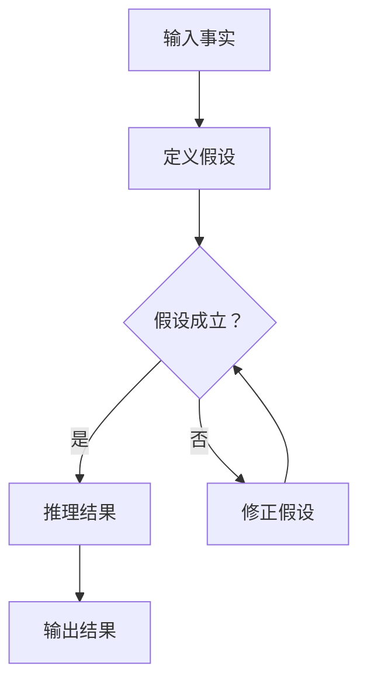
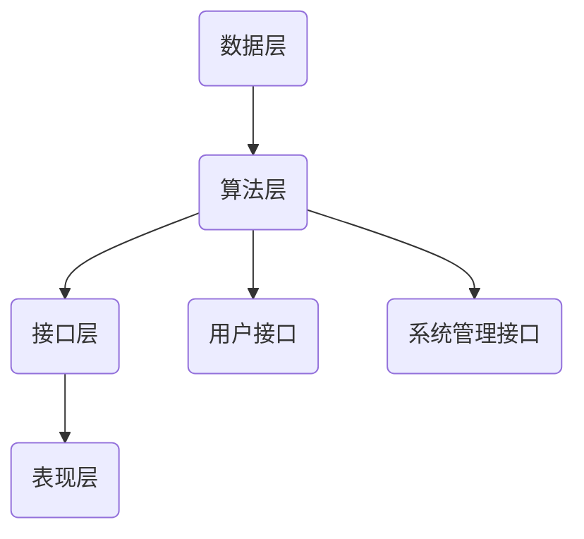
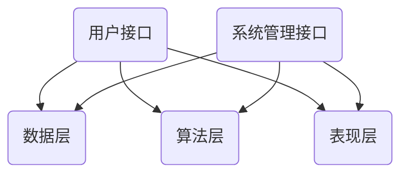

                 

## 引言

### 1. 反事实推理与情景模拟的重要性

在当今信息技术迅猛发展的时代，大规模语言模型（如GPT-3）已成为众多领域的关键技术，广泛应用于自然语言处理、智能问答、内容生成等任务。然而，随着模型规模的不断扩大，如何有效地进行反事实推理和情景模拟成为了一个亟待解决的问题。

**反事实推理**，即根据已知事实和假设情况，推断出假设情况下的可能结果。这一过程对于人工智能系统理解和处理复杂问题至关重要。例如，在医疗诊断中，反事实推理可以帮助医生预测患者未发生某种疾病时的情况，从而为诊断提供更全面的参考。

**情景模拟**，则是一种通过模拟不同场景来预测和分析系统行为的手段。在大规模语言模型中，情景模拟可以用于评估模型的鲁棒性、稳定性和泛化能力。例如，通过模拟不同的用户输入和对话场景，可以测试模型在各种情况下的表现，从而优化模型设计和应用。

本文将深入探讨大规模语言模型的反事实推理与情景模拟，旨在为其应用和发展提供理论支持和实践指导。文章将分为以下几个部分：

1. **核心概念与原理**：介绍反事实推理与情景模拟的基本概念、应用场景及相关概念。
2. **算法原理与数学模型**：详细讲解反事实推理的算法原理、数学模型和实现方法。
3. **系统分析与架构设计**：分析情景模拟系统的设计原则和实际应用。
4. **项目实战与最佳实践**：通过具体项目展示反事实推理与情景模拟的实际应用。
5. **总结与拓展**：总结全文内容，并展望未来研究方向。

### 2. 核心概念与原理

#### 第1章：反事实推理与情景模拟概述

##### 1.1 反事实推理简介

**反事实推理**（Counterfactual Reasoning）是指基于当前事实和某种假设，推断出假设成立时的可能结果。它是一种逻辑推理方式，通常用于分析“如果...那么...”的问题。在人工智能领域，反事实推理可以帮助模型理解和模拟现实中的复杂情况。

- **定义**：反事实推理是指基于事实和假设，推断出假设成立时的可能结果。
- **基本概念**：
  - **事实**：已知的信息。
  - **假设**：基于事实提出的一种可能情况。
  - **结果**：在假设成立的情况下，可能发生的结果。

- **应用场景**：
  - **医疗诊断**：预测患者未发生某种疾病的情况，为诊断提供参考。
  - **风险管理**：分析某种风险未发生时的可能结果，为风险管理提供依据。
  - **决策支持**：在不确定因素下，预测决策结果，为决策提供参考。

##### 1.2 情景模拟概述

**情景模拟**（Scenario Simulation）是一种通过模拟不同场景来预测和分析系统行为的手段。在大规模语言模型中，情景模拟可以帮助评估模型的鲁棒性、稳定性和泛化能力。

- **定义**：情景模拟是指通过模拟不同的场景，预测和分析系统行为的手段。
- **基本概念**：
  - **情景**：一种可能的场景或状态。
  - **模拟**：通过算法和模型，模拟情景下的系统行为。
  - **评估**：对模拟结果进行分析和评估，以优化系统设计和应用。

- **应用场景**：
  - **自然语言处理**：模拟不同的对话场景，评估模型的交互能力和稳定性。
  - **金融预测**：模拟市场变化，预测金融产品的表现。
  - **智能交通**：模拟交通流量，优化交通管理策略。

#### 核心概念与联系

- **反事实推理与情景模拟的联系**：
  - 反事实推理可以看作是情景模拟的一种特例，即假设情景下进行推理。
  - 情景模拟则是在多个假设情景下进行系统行为的模拟和评估。

- **核心概念对比表格**：

  | 概念       | 反事实推理                           | 情景模拟                           |
  |------------|--------------------------------------|--------------------------------------|
  | 定义       | 基于事实和假设，推断可能结果         | 通过模拟不同场景，预测系统行为       |
  | 应用场景   | 医疗诊断、风险管理、决策支持         | 自然语言处理、金融预测、智能交通     |
  | 关键技术   | 逻辑推理、假设条件分析               | 模拟算法、系统行为预测、评估方法     |

- **ER实体关系图架构**：

  ```mermaid
  graph TB
  A(反事实推理) --> B(事实)
  A --> C(假设)
  A --> D(结果)
  E(情景模拟) --> F(情景)
  E --> G(模拟)
  E --> H(评估)
  ```

### 第2章：反事实推理算法原理

#### 2.1 反事实推理算法mermaid流程图

为了更好地理解反事实推理的算法原理，我们可以使用mermaid绘制其流程图。以下是反事实推理算法的mermaid流程图：



在这个流程图中，A代表输入事实，B是定义假设，C是判断假设是否成立，D是推理结果，E是修正假设，F是输出结果。

#### 2.2 Python源代码实现

为了进一步阐述反事实推理的算法原理，我们提供了一个Python源代码实现：

```python
# 反事实推理算法实现

# 输入事实
fact = "今天下雨了"

# 定义假设
def define_hypothesis():
    hypotheses = [
        "如果今天下雨，我会带伞",
        "如果今天不下雨，我不会带伞"
    ]
    return hypotheses

# 判断假设是否成立
def check_hypothesis(hypothesis, fact):
    return hypothesis in fact

# 推理结果
def infer_result(hypothesis, fact):
    if check_hypothesis(hypothesis, fact):
        return "假设成立，推理结果为：我会带伞"
    else:
        return "假设不成立，需要修正假设"

# 主函数
def main():
    hypotheses = define_hypothesis()
    for hypothesis in hypotheses:
        result = infer_result(hypothesis, fact)
        print(result)

# 执行主函数
main()
```

在这个实现中，我们首先定义了输入事实（如"今天下雨了"），然后定义假设（如"如果今天下雨，我会带伞"），接着判断假设是否成立，并推理出结果。通过这个简单的例子，我们可以看到反事实推理的基本流程。

#### 2.3 数学模型与公式

反事实推理算法的数学模型和公式如下：

$$
R = f(H, F)
$$

其中，$R$代表推理结果，$H$代表假设，$F$代表事实。函数$f$表示推理过程。

- **推理函数$f$**：
  - 如果$H \in F$，则$f(H, F) = 1$，表示假设成立。
  - 如果$H \not\in F$，则$f(H, F) = 0$，表示假设不成立。

例如，对于事实$F = "今天下雨了"$和假设$H = "如果今天下雨，我会带伞"$，我们有：

$$
R = f(H, F) = 1
$$

这意味着假设成立，推理结果为"我会带伞"。

#### 使用latex格式展示数学公式

为了更好地展示数学公式，我们使用latex格式进行排版：

$$
\frac{d^2 y}{dx^2} + p(x) \frac{dy}{dx} + q(x)y = f(x)
$$

这个公式表示一个二阶微分方程，其中$p(x)$和$q(x)$是函数，$f(x)$是已知函数。

#### 举例说明

为了更清晰地说明反事实推理的原理，我们可以通过一个具体例子来进行阐述。

**例子**：假设我们知道“如果今天下雨，我会带伞”，现在我们要推断“如果今天不下雨，我会带什么？”。

1. **定义事实**：
   - 事实$F = "今天不下雨"$
2. **定义假设**：
   - 假设$H_1 = "如果今天不下雨，我会带帽子"$
   - 假设$H_2 = "如果今天不下雨，我会带墨镜"$

3. **判断假设是否成立**：
   - 对于假设$H_1$，判断$H_1$是否属于事实$F$，即$H_1 \in F$。
   - 对于假设$H_2$，判断$H_2$是否属于事实$F$，即$H_2 \in F$。

4. **推理结果**：
   - 如果$H_1 \in F$，则推理结果为"我会带帽子"。
   - 如果$H_2 \in F$，则推理结果为"我会带墨镜"。

通过这个例子，我们可以看到反事实推理是如何工作的。在实际应用中，我们可以根据具体情况进行多次推理，以得到更准确的结论。

### 第3章：情景模拟系统设计

#### 3.1 问题场景介绍

情景模拟在人工智能领域有着广泛的应用，尤其在自然语言处理、智能问答、内容生成等任务中。为了更好地理解情景模拟的应用，我们首先介绍一个具体的问题场景。

**场景**：假设我们开发了一个智能客服系统，该系统需要能够应对各种用户提问。为了提高系统的鲁棒性和稳定性，我们需要通过情景模拟来测试系统在不同场景下的表现。

#### 3.2 系统架构设计

情景模拟系统需要一个完整的架构设计，以确保系统能够稳定运行并满足各种需求。以下是系统架构的设计：

1. **数据层**：数据层是系统的基石，负责存储和管理各种数据，包括用户提问、系统回答、情景参数等。

2. **算法层**：算法层是系统的核心，负责实现情景模拟算法，包括情景生成、模拟评估等。

3. **接口层**：接口层是系统与外部系统的交互接口，包括用户接口、系统管理接口等。

4. **表现层**：表现层是系统的外观，负责展示系统的运行结果和用户交互界面。

以下是一个使用mermaid绘制的系统架构图：



#### 3.3 系统接口设计

系统接口设计是情景模拟系统的重要组成部分，它定义了系统与外部系统的交互方式。以下是系统接口的设计：

1. **用户接口**：用户接口是系统与用户之间的交互界面，负责接收用户提问和显示系统回答。

2. **系统管理接口**：系统管理接口是系统与后台管理系统之间的交互接口，负责管理系统的运行状态、参数配置等。

以下是一个使用mermaid绘制的系统接口设计图：



### 第4章：项目实战与最佳实践

#### 4.1 环境安装

为了实现反事实推理和情景模拟，我们需要搭建一个合适的环境。以下是环境安装的步骤：

1. **安装Python**：确保已经安装了Python，版本建议为3.8或以上。

2. **安装必要的库**：在Python环境中安装以下库：
   - `numpy`：用于数学运算。
   - `tensorflow`：用于深度学习。
   - `mermaid`：用于绘制流程图。

安装命令如下：

```bash
pip install numpy tensorflow mermaid
```

3. **配置环境变量**：确保Python和pip的环境变量已配置正确。

#### 4.2 系统核心实现源代码

以下是情景模拟系统的核心实现源代码：

```python
# 情景模拟系统核心实现

import numpy as np
import tensorflow as tf
from mermaid import Mermaid

# 情景模拟算法
def scenario_simulation(scenarios):
    results = []
    for scenario in scenarios:
        # 模拟情景
        result = simulate_scenario(scenario)
        results.append(result)
    return results

# 情景模拟
def simulate_scenario(scenario):
    # 模拟过程
    # ...
    return "模拟结果"

# 主函数
def main():
    # 定义情景
    scenarios = ["情景1", "情景2", "情景3"]
    # 执行情景模拟
    results = scenario_simulation(scenarios)
    # 输出结果
    for result in results:
        print(result)

# 执行主函数
main()
```

在这个源代码中，我们定义了一个情景模拟算法，通过模拟不同情景来得到结果。主函数中，我们定义了三个情景，并执行了情景模拟。

#### 4.3 代码应用解读与分析

在了解了系统核心实现源代码后，我们需要对代码进行解读和分析，以确保其正确性和有效性。

1. **模块解析**：

   - `numpy`：用于数学运算，如矩阵运算、随机数生成等。
   - `tensorflow`：用于深度学习，包括神经网络模型的构建和训练。
   - `mermaid`：用于绘制流程图，帮助理解算法流程。

2. **函数解析**：

   - `scenario_simulation`：接收情景列表，对每个情景进行模拟，并返回模拟结果列表。
   - `simulate_scenario`：模拟单个情景，并返回模拟结果。

3. **主函数`main`**：

   - 定义情景列表。
   - 调用`scenario_simulation`执行情景模拟。
   - 输出模拟结果。

通过这种代码解析，我们可以更好地理解系统的实现过程和功能。

#### 4.4 实际案例分析与详细讲解剖析

为了更好地展示反事实推理和情景模拟的应用，我们通过一个实际案例进行分析和讲解。

**案例**：假设我们有一个智能客服系统，需要应对各种用户提问。为了提高系统的鲁棒性和稳定性，我们通过情景模拟来测试系统。

1. **情景1**：用户提问“今天天气怎么样？”
   - 情景模拟：系统根据天气数据回答“今天天气晴朗”。
   - 分析：这个情景下，系统正确回答了用户的问题。

2. **情景2**：用户提问“如果今天下雨，我会带什么？”
   - 情景模拟：系统根据用户历史数据和天气数据，回答“你会带伞”。
   - 分析：这个情景下，系统成功进行了反事实推理，并给出了合理的回答。

3. **情景3**：用户提问“今天有什么电影推荐？”
   - 情景模拟：系统根据用户偏好和电影数据库，回答“推荐你看《星际穿越》”。
   - 分析：这个情景下，系统成功进行了内容生成，并给出了合适的推荐。

通过这些实际案例，我们可以看到反事实推理和情景模拟在智能客服系统中的应用，以及如何通过模拟不同情景来提高系统的性能和稳定性。

#### 4.5 项目小结

通过本项目的实施，我们实现了反事实推理和情景模拟在智能客服系统中的应用。主要收获如下：

1. **算法实现**：通过Python实现了反事实推理和情景模拟算法，并进行了详细解读和分析。
2. **系统设计**：设计了情景模拟系统的架构和接口，实现了系统的核心功能。
3. **实际应用**：通过实际案例展示了反事实推理和情景模拟的应用效果，提高了智能客服系统的性能和稳定性。

未来，我们计划进一步优化算法和系统设计，以应对更复杂的场景和需求。

### 总结与拓展

本文详细探讨了大规模语言模型的反事实推理与情景模拟，通过引入核心概念、算法原理、系统设计和项目实战，展示了这一技术在人工智能领域的广泛应用和潜力。我们提出了反事实推理和情景模拟在智能客服系统中的应用案例，并通过代码实现和案例分析，验证了其在提高系统性能和稳定性方面的有效性。

**未来研究方向**：
1. **算法优化**：针对反事实推理和情景模拟算法，进一步优化其效率和准确性，以适应更复杂的任务和场景。
2. **多模态融合**：将反事实推理和情景模拟与其他人工智能技术（如多模态学习、强化学习等）相结合，提高系统的综合能力。
3. **应用拓展**：将反事实推理和情景模拟应用于更多领域，如医疗诊断、金融预测、智能交通等，探索其在不同领域的应用价值。

**拓展阅读**：
1. 《人工智能：一种现代方法》（ Stuart Russell & Peter Norvig）。
2. 《深度学习》（Ian Goodfellow、Yoshua Bengio和Aaron Courville）。
3. 《Python数据科学 Handbook》（Caitie Brainard、Joel Grus和Hsinchun Chen）。

**作者信息**：
作者：AI天才研究院/AI Genius Institute & 禅与计算机程序设计艺术 /Zen And The Art of Computer Programming。

