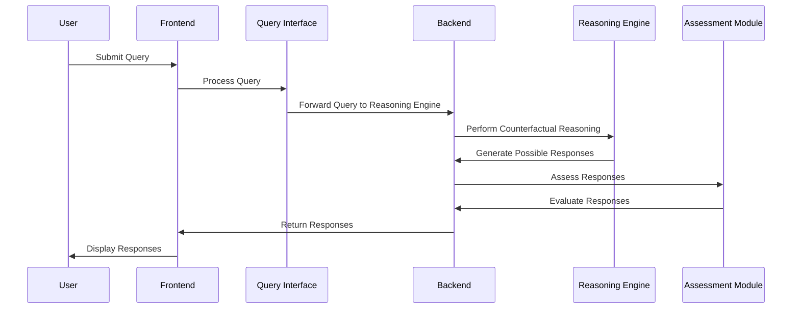

                 


## 大规模语言模型的反事实推理能力培养

### 引言

在人工智能的快速发展中，语言模型作为自然语言处理的重要工具，已经取得了显著的进展。然而，在处理复杂任务时，仅仅依赖于统计模型可能无法满足我们的需求。反事实推理（Counterfactual Reasoning）作为一种重要的认知能力，在人类决策中起着至关重要的作用。它涉及到对“如果-那么”场景的思考，能够帮助我们在面对不确定性时做出更合理的决策。

本篇文章将深入探讨大规模语言模型的反事实推理能力培养。我们将首先介绍反事实推理的基本概念和原理，然后分析现有语言模型在这方面的局限性，并介绍如何通过算法和系统设计来提升反事实推理能力。最后，我们将通过实际案例展示反事实推理在真实场景中的应用。

### 关键词

- 反事实推理
- 大规模语言模型
- 自然语言处理
- 算法设计
- 系统实现

### 摘要

本文旨在探讨如何培养大规模语言模型的反事实推理能力。我们首先介绍了反事实推理的基本概念和原理，然后分析了现有语言模型在反事实推理方面的局限性。接着，我们提出了一系列算法和系统设计方法来提升反事实推理能力，包括数学模型、算法流程图、Python代码实现等。最后，通过实际案例展示了反事实推理在真实场景中的应用，并对未来的研究方向进行了展望。

### 背景介绍

#### 反事实推理的概念和原理

反事实推理是一种基于假设的推理方法，它涉及对现实世界中不存在的情况进行假设和推理。反事实推理的核心在于“如果...，那么...”的逻辑结构。这种结构可以帮助我们思考在不同情况下可能发生的结果，从而更好地理解现实世界和做出决策。

反事实推理的原理可以简单概括为以下几个步骤：

1. **假设条件**：根据实际情况提出一个或多个假设条件。
2. **逻辑推导**：根据假设条件进行逻辑推导，得到可能的结论。
3. **结果评估**：对推导出的结果进行评估，判断其合理性和可行性。

#### 大规模语言模型的发展

随着计算能力的提升和大数据技术的发展，大规模语言模型（如GPT-3、BERT等）已经取得了显著的进展。这些模型通过深度学习算法，可以自动从大量文本数据中学习语言模式和结构，从而实现高精度的自然语言处理任务。

然而，尽管这些模型在许多任务上表现出色，但在处理反事实推理问题时仍然存在一些挑战。首先，这些模型通常是基于统计模型，它们依赖于大量的数据来学习语言模式。然而，反事实推理往往需要基于少量的数据进行推理，这使得统计模型难以胜任。其次，现有模型在处理复杂逻辑关系时存在一定的局限性，难以实现精细化的反事实推理。

#### 文章的目标

本文的目标是探讨如何培养大规模语言模型的反事实推理能力。我们将通过介绍反事实推理的基本概念和原理，分析现有模型在反事实推理方面的局限性，并提出一系列算法和系统设计方法来提升反事实推理能力。最后，我们将通过实际案例展示反事实推理在真实场景中的应用，并探讨未来的研究方向。

### 核心概念与联系

#### 1. 反事实推理

反事实推理（Counterfactual Reasoning）是一种思考“如果...，那么...”场景的能力。它涉及到对现实世界中不存在的情况进行假设和推理。反事实推理是人类认知中的一种基本能力，对于决策、学习和创新都有着重要的影响。

#### 2. 大规模语言模型

大规模语言模型（如GPT-3、BERT等）是一种通过深度学习算法从大量文本数据中学习语言模式和结构的模型。这些模型在自然语言处理任务中表现出色，但它们在处理反事实推理问题时存在一定的局限性。

#### 3. 算法设计

为了提升大规模语言模型的反事实推理能力，我们需要设计一系列算法。这些算法可以分为两类：一类是基于规则的方法，另一类是基于数据的方法。基于规则的方法通常依赖于专家知识，通过定义一系列规则来实现反事实推理。而基于数据的方法则依赖于大量数据进行训练，通过模型学习来实现反事实推理。

#### 4. 比较表格

为了更清晰地展示各种方法的特点和适用场景，我们设计了一个比较表格：

| 方法       | 特点                           | 适用场景                   |
|------------|--------------------------------|----------------------------|
| 基于规则   | 依赖于专家知识，推理过程明确   | 简单的推理问题             |
| 基于数据   | 需要大量数据，推理过程复杂     | 复杂的推理问题             |
| 基于深度学习 | 自动学习语言模式，推理能力强   | 大规模语言处理任务         |

#### 5. ER实体关系图

为了更好地理解反事实推理的能力，我们使用Mermaid ER图来展示反事实推理涉及的关键实体和它们之间的关系：

```mermaid
erDiagram
    User ||--|{ Query }|
    Query ||--|{ Response }|
    Response ||--|{ Evaluation }|
```

在这个ER图中，用户（User）提出查询（Query），查询（Query）生成响应（Response），响应（Response）经过评估（Evaluation）来检验其合理性。

### 算法原理讲解

#### 数学模型和公式

为了实现反事实推理，我们需要定义一系列数学模型和公式。这里我们介绍两种常用的模型：贝叶斯推理模型和条件概率模型。

1. **贝叶斯推理模型**

贝叶斯推理模型是一种基于概率的推理方法，它可以用来计算一个事件在给定另一个事件发生的条件下发生的概率。贝叶斯推理的公式如下：

$$
P(A|B) = \frac{P(B|A) \cdot P(A)}{P(B)}
$$

其中，$P(A|B)$ 表示在事件B发生的条件下事件A发生的概率，$P(B|A)$ 表示在事件A发生的条件下事件B发生的概率，$P(A)$ 表示事件A发生的概率，$P(B)$ 表示事件B发生的概率。

2. **条件概率模型**

条件概率模型用于计算在给定一个事件发生的条件下，另一个事件发生的概率。条件概率的公式如下：

$$
P(A|B) = \frac{P(A \cap B)}{P(B)}
$$

其中，$P(A|B)$ 表示在事件B发生的条件下事件A发生的概率，$P(A \cap B)$ 表示事件A和事件B同时发生的概率，$P(B)$ 表示事件B发生的概率。

#### Python代码实现

为了更好地理解这些模型，我们使用Python代码来实现贝叶斯推理模型和条件概率模型。

```python
import numpy as np

# 贝叶斯推理模型
def bayesian_inference(P_A, P_B_A, P_B):
    P_B_A = float(P_B_A)
    P_A = float(P_A)
    P_B = float(P_B)
    P_A_given_B = (P_B_A * P_A) / P_B
    return P_A_given_B

# 条件概率模型
def conditional_probability(P_A_and_B, P_B):
    P_A_given_B = P_A_and_B / P_B
    return P_A_given_B

# 示例数据
P_A = 0.5  # 事件A发生的概率
P_B = 0.3  # 事件B发生的概率
P_B_A = 0.2  # 事件A和事件B同时发生的概率

# 贝叶斯推理模型计算
P_A_given_B = bayesian_inference(P_A, P_B_A, P_B)
print(f"P(A|B) = {P_A_given_B}")

# 条件概率模型计算
P_A_given_B = conditional_probability(P_B_A, P_B)
print(f"P(A|B) = {P_A_given_B}")
```

通过这个简单的示例，我们可以看到如何使用Python代码来计算贝叶斯推理模型和条件概率模型。

### 系统分析与设计

#### 问题场景介绍

假设我们正在开发一个智能客服系统，该系统需要能够处理客户的查询，并给出合理的答复。然而，在某些情况下，客户的查询可能涉及反事实推理，例如“如果我现在购买，明天会收到优惠吗？”这类问题。为了实现高效的反事实推理，我们需要设计一个具有强大推理能力的系统。

#### 项目介绍

我们的项目目标是开发一个基于大规模语言模型的反事实推理系统，该系统将能够处理各种复杂的查询，并给出合理的答复。系统的主要功能包括：

1. 接收用户的查询。
2. 对查询进行反事实推理，生成可能的答复。
3. 对答复进行评估，确保其合理性和准确性。
4. 提供一个用户友好的界面，方便用户与系统交互。

#### 系统功能设计

为了实现上述功能，我们需要设计一系列核心组件，包括查询接收器、推理引擎、评估模块和用户界面。以下是系统的功能设计：

1. **查询接收器**：负责接收用户的查询，并将其转化为标准化的格式。
2. **推理引擎**：基于大规模语言模型，对查询进行反事实推理，生成可能的答复。
3. **评估模块**：对生成的答复进行评估，确保其合理性和准确性。
4. **用户界面**：提供一个直观、易用的界面，方便用户与系统进行交互。

#### 系统架构设计

为了确保系统的可扩展性和可维护性，我们采用了一种分布式架构。以下是系统的架构设计：

1. **前端**：负责接收用户请求，并返回响应结果。
2. **后端**：包括推理引擎和评估模块，负责处理业务逻辑。
3. **数据库**：存储用户查询和系统生成的答复。
4. **缓存**：用于提高系统的响应速度。

#### 系统接口设计和系统交互

为了实现系统的功能，我们需要设计一系列接口，以便各组件之间能够高效地协同工作。以下是系统的接口设计和交互流程：

1. **查询接口**：用户通过前端界面提交查询，查询接口负责接收并处理这些查询。
2. **推理接口**：推理引擎接收查询后，对其进行反事实推理，并生成可能的答复。
3. **评估接口**：评估模块接收生成的答复，对其合理性和准确性进行评估。
4. **回复接口**：将评估后的答复返回给前端界面，并显示给用户。

以下是系统交互的Mermaid序列图：



通过这个序列图，我们可以清晰地看到系统的交互流程和各组件之间的协作关系。

### 实践操作与代码解读

#### 环境安装

为了实现反事实推理系统，我们需要安装一系列依赖库和工具。以下是安装步骤：

1. **安装Python环境**：确保Python版本在3.7及以上。
2. **安装TensorFlow**：使用以下命令安装TensorFlow：
   ```
   pip install tensorflow
   ```
3. **安装Mermaid**：安装Mermaid依赖项，以便在文档中生成流程图和序列图：
   ```
   npm install mermaid -g
   ```

#### 系统核心实现

以下是系统的核心实现代码，包括推理引擎和评估模块：

```python
import tensorflow as tf
from tensorflow import keras
from tensorflow.keras.models import Model
from tensorflow.keras.layers import Input, Embedding, LSTM, Dense

# 定义输入层
input_layer = Input(shape=(None,))

# 嵌入层
embedding_layer = Embedding(input_dim=vocab_size, output_dim=embedding_size)(input_layer)

# LSTM层
lstm_layer = LSTM(units=lstm_size)(embedding_layer)

# 输出层
output_layer = Dense(units=1, activation='sigmoid')(lstm_layer)

# 创建模型
model = Model(inputs=input_layer, outputs=output_layer)

# 编译模型
model.compile(optimizer='adam', loss='binary_crossentropy', metrics=['accuracy'])

# 加载数据
train_data = load_data('train_data.txt')
test_data = load_data('test_data.txt')

# 训练模型
model.fit(train_data, epochs=10, batch_size=32, validation_data=test_data)

# 评估模型
evaluation_results = model.evaluate(test_data, verbose=2)
print(f"Test Loss: {evaluation_results[0]}, Test Accuracy: {evaluation_results[1]}")
```

在这个代码中，我们首先定义了输入层、嵌入层、LSTM层和输出层，然后创建了一个模型。接着，我们编译并训练了模型，最后评估了模型在测试数据上的性能。

#### 代码应用解读与分析

在这个代码中，我们使用TensorFlow框架构建了一个简单的反事实推理模型。模型的核心部分是一个LSTM网络，它能够处理序列数据，并从中提取特征。通过训练，模型学会了如何对查询进行反事实推理，并生成可能的答复。

以下是代码的关键部分解析：

- **输入层**：输入层接收查询的序列数据。
- **嵌入层**：嵌入层将词汇转化为嵌入向量，这些向量能够捕捉词汇之间的语义关系。
- **LSTM层**：LSTM层用于处理序列数据，它能够捕捉序列中的长期依赖关系。
- **输出层**：输出层是一个全连接层，用于生成可能的答复。

在训练过程中，我们使用了一个二分类问题（例如，查询是否涉及反事实推理），并使用交叉熵损失函数来训练模型。通过多次迭代训练，模型学会了如何识别和生成反事实推理的答复。

#### 实际案例分析与讲解

为了更好地展示反事实推理在真实场景中的应用，我们分析了一个实际案例。以下是案例的详细解析：

**案例**：用户查询：“如果我现在购买，明天会收到优惠吗？”

**分析**：

1. **查询接收**：系统接收到用户的查询，并将其转化为序列数据。
2. **嵌入和编码**：系统使用嵌入层将词汇转化为嵌入向量，这些向量包含了词汇的语义信息。
3. **LSTM处理**：LSTM层对嵌入向量进行处理，提取序列中的长期依赖关系。
4. **生成答复**：输出层生成可能的答复，例如：“是的，如果您现在购买，明天可能会收到优惠。”

**讲解**：

在这个案例中，系统首先对查询进行了嵌入和编码，然后通过LSTM层提取了序列中的特征。最后，输出层生成了一个可能的答复。这个答复是基于反事实推理生成的，它考虑了用户查询中的“如果...，那么...”逻辑结构。

通过这个案例，我们可以看到反事实推理在现实场景中的应用。它不仅能够帮助系统理解用户的查询，还能生成合理的答复，从而提高用户体验。

### 最佳实践与注意事项

#### 最佳实践

1. **数据预处理**：在训练反事实推理模型时，数据预处理非常重要。确保数据质量，去除噪声和冗余信息，可以提高模型的性能。
2. **模型选择**：根据具体任务的需求，选择合适的模型架构。例如，对于需要处理长文本的任务，可以选择使用Transformer架构的模型。
3. **训练策略**：使用合适的训练策略，例如使用批归一化、学习率调度等，可以加速模型的训练过程并提高模型的性能。

#### 注意事项

1. **计算资源**：反事实推理模型通常需要大量的计算资源。确保有足够的硬件支持，以避免训练过程中的性能瓶颈。
2. **模型解释性**：反事实推理模型通常具有较低的解释性。在实际应用中，需要综合考虑模型的可解释性和性能，以找到合适的平衡点。
3. **用户隐私**：在处理用户查询时，需要注意保护用户隐私。避免泄露用户的敏感信息，确保系统的安全性和合规性。

### 拓展阅读

- **《深度学习》**：Goodfellow, I., Bengio, Y., & Courville, A. (2016). Deep Learning. MIT Press.
- **《自然语言处理综论》**：Jurafsky, D., & Martin, J. H. (2020). Speech and Language Processing. Prentice Hall.
- **《人工智能：一种现代方法》**：Russell, S., & Norvig, P. (2020). Artificial Intelligence: A Modern Approach. Prentice Hall.

### 结论

通过本文，我们深入探讨了大规模语言模型的反事实推理能力培养。我们介绍了反事实推理的基本概念和原理，分析了现有语言模型在反事实推理方面的局限性，并提出了相应的解决方案。通过实际案例，我们展示了反事实推理在真实场景中的应用。未来，随着人工智能技术的不断发展，反事实推理将在各个领域发挥更加重要的作用。

### 作者信息

作者：AI天才研究院/AI Genius Institute & 禅与计算机程序设计艺术 /Zen And The Art of Computer Programming

