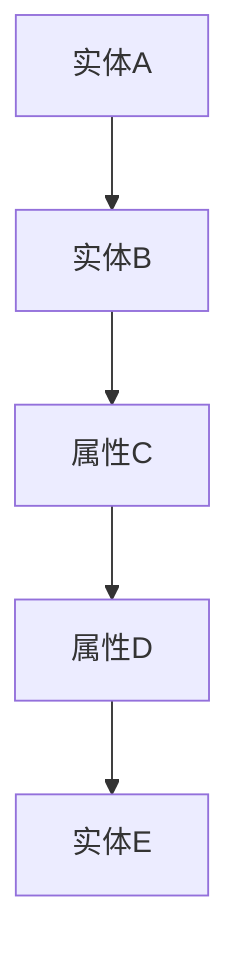
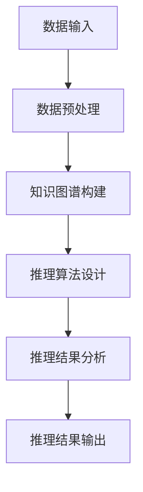

                 

# 大规模语言模型的多维度推理在智能外交决策支持系统中的应用

## 关键词

- 大规模语言模型
- 多维度推理
- 智能外交决策
- 决策支持系统
- 人工智能

## 摘要

本文探讨了大规模语言模型及其多维度推理技术在智能外交决策支持系统中的应用。首先，介绍了大规模语言模型的基础知识，包括其原理、应用领域以及核心要素组成。接着，详细阐述了多维度推理技术的原理、方法、挑战与解决方案，并通过具体的算法流程图和数学模型进行了讲解。随后，本文介绍了智能外交决策支持系统的背景、功能、架构设计和实现技术。最后，通过实际案例，展示了大规模语言模型和多维度推理技术在智能外交决策支持系统中的应用效果，并对其未来发展趋势进行了展望。

## 目录大纲

### 第一部分：大规模语言模型概述

#### 第1章：大规模语言模型基础

1.1 问题背景

1.2 问题描述

1.3 问题解决

1.4 边界与外延

1.5 概念结构与核心要素组成

1.6 大规模语言模型简介

1.7 大规模语言模型的应用领域

### 第二部分：多维度推理技术

#### 第2章：多维度推理原理

2.1 多维度推理的概念

2.2 多维度推理的方法

2.3 多维度推理的挑战与解决方案

2.4 多维度推理的应用场景

#### 第3章：多维度推理技术实现

3.1 多维度推理算法原理讲解

3.2 多维度推理算法流程图

3.3 多维度推理算法的数学模型与公式

3.4 多维度推理算法举例说明

### 第三部分：智能外交决策支持系统应用

#### 第4章：智能外交决策支持系统概述

4.1 智能外交决策支持系统背景

4.2 智能外交决策支持系统功能

4.3 智能外交决策支持系统架构设计

4.4 智能外交决策支持系统实现技术

#### 第5章：大规模语言模型在智能外交决策支持系统中的应用

5.1 大规模语言模型在智能外交决策中的应用

5.2 多维度推理在智能外交决策中的应用

5.3 案例分析：大规模语言模型在智能外交决策中的成功应用

### 第四部分：案例分析

#### 第6章：大规模语言模型在智能外交决策支持系统中的应用案例

6.1 案例一：某国外交部门使用大规模语言模型进行决策分析

6.2 案例二：某国际组织利用大规模语言模型进行冲突预测

6.3 案例三：某企业借助大规模语言模型提升外交谈判策略

### 第五部分：总结与展望

#### 第7章：大规模语言模型的多维度推理在智能外交决策支持系统中的应用总结

7.1 应用总结

7.2 存在问题与挑战

7.3 未来发展趋势

7.4 拓展阅读

---

### 第1章：大规模语言模型基础

#### 1.1 问题背景

随着人工智能技术的快速发展，大规模语言模型（Large-scale Language Model）作为一种先进的自然语言处理（NLP）技术，逐渐引起了学术和工业界的高度关注。在大数据时代，语言模型在许多领域都有广泛的应用，如文本生成、机器翻译、情感分析、信息检索等。

大规模语言模型通过学习海量文本数据，能够理解和生成自然语言，模拟人类的语言习惯。然而，如何有效利用这些模型，提高其在特定领域的应用效果，仍然是当前研究的热点和挑战。

#### 1.2 问题描述

大规模语言模型在智能外交决策支持系统中的应用，涉及到以下问题：

1. 如何构建一个适用于外交决策的模型？
2. 如何利用多维度推理技术，提高模型的决策能力？
3. 如何在实际应用中验证模型的性能和可靠性？

#### 1.3 问题解决

为了解决上述问题，本文将采用以下步骤：

1. 介绍大规模语言模型的基础知识，包括其原理、结构和应用领域。
2. 阐述多维度推理技术的原理和方法，并分析其在智能外交决策支持系统中的应用。
3. 分析智能外交决策支持系统的需求，设计相应的架构和实现技术。
4. 通过实际案例，展示大规模语言模型和多维度推理技术在智能外交决策支持系统中的应用效果。

#### 1.4 边界与外延

本文的研究范围主要涉及以下方面：

1. 大规模语言模型的技术原理和应用。
2. 多维度推理技术在智能外交决策支持系统中的应用。
3. 智能外交决策支持系统的架构设计和实现技术。

本文不涉及以下内容：

1. 其他自然语言处理技术的应用。
2. 智能外交决策支持系统的具体业务实现。

#### 1.5 概念结构与核心要素组成

大规模语言模型的核心要素包括：

1. 数据集：用于训练和测试的文本数据。
2. 模型架构：包括神经网络、循环神经网络（RNN）、变换器（Transformer）等。
3. 损失函数：用于评估模型预测的误差。
4. 优化器：用于调整模型参数，以最小化损失函数。

多维度推理技术的核心要素包括：

1. 知识图谱：用于存储和表示多维度的信息。
2. 推理算法：用于从知识图谱中提取结论。
3. 对话系统：用于与用户进行交互，提供决策支持。

智能外交决策支持系统的核心要素包括：

1. 数据采集和处理：获取外交相关的数据，并进行预处理。
2. 决策模型：利用大规模语言模型和多维度推理技术，进行决策分析。
3. 用户界面：提供与用户交互的接口，展示决策结果。

#### 1.6 大规模语言模型简介

大规模语言模型是一种基于深度学习的自然语言处理技术，通过学习海量文本数据，可以理解和生成自然语言。以下是大规模语言模型的一些基本概念：

1. **词向量**：将文本中的每个词映射为一个向量，用于表示词与词之间的关系。
2. **循环神经网络（RNN）**：一种用于处理序列数据的神经网络，能够捕捉词与词之间的依赖关系。
3. **变换器（Transformer）**：一种基于自注意力机制的神经网络架构，能够同时处理长序列数据，具有较好的并行化性能。

大规模语言模型的应用领域非常广泛，包括：

1. **文本生成**：如文章、摘要、对话等的生成。
2. **机器翻译**：将一种语言的文本翻译成另一种语言。
3. **情感分析**：分析文本中的情感倾向。
4. **信息检索**：根据用户查询，从大量文本中检索相关结果。
5. **问答系统**：根据用户提出的问题，提供准确的答案。

#### 1.7 大规模语言模型的应用领域

大规模语言模型在智能外交决策支持系统中的应用主要体现在以下几个方面：

1. **文本分析**：利用大规模语言模型，对外交相关的文本进行情感分析、主题分类等，以了解不同国家和地区的态度和立场。
2. **信息提取**：从大量的外交文件、新闻报道等文本中，提取关键信息，如国家政策、国际条约、政治事件等。
3. **对话系统**：构建一个智能对话系统，与外交官员进行交互，提供实时的决策建议。
4. **预测分析**：利用大规模语言模型，对未来的外交事件进行预测，为决策者提供参考。

### 第2章：多维度推理原理

#### 2.1 多维度推理的概念

多维度推理是一种基于知识图谱的推理方法，它能够从多个维度（如时间、空间、属性等）对信息进行综合分析和推理。多维度推理的核心思想是将不同来源、不同格式的信息进行整合，形成一个统一的知识图谱，然后利用推理算法，从知识图谱中提取新的信息或结论。

#### 2.2 多维度推理的方法

多维度推理的方法主要包括以下几个方面：

1. **知识融合**：将来自不同来源、不同格式的信息进行整合，形成一个统一的知识图谱。知识融合的方法包括数据集成、数据融合、本体融合等。
2. **推理算法**：利用推理算法，从知识图谱中提取新的信息或结论。推理算法包括基于规则推理、基于模型推理、基于本体推理等。
3. **数据分析**：利用数据分析技术，对知识图谱中的信息进行挖掘和分析，发现潜在的关系和规律。

#### 2.3 多维度推理的挑战与解决方案

多维度推理面临以下挑战：

1. **数据不一致性**：不同来源的数据可能存在格式、语义、质量等方面的差异，导致知识图谱的不一致性。
2. **推理效率**：随着知识图谱规模的增大，推理算法的效率会受到影响，如何提高推理效率是一个重要问题。
3. **推理准确性**：推理算法需要具有较高的准确性，以保证推理结果的可靠性。

针对上述挑战，可以采取以下解决方案：

1. **数据预处理**：对原始数据进行清洗、转换和标准化，以提高数据的一致性和质量。
2. **分布式推理**：利用分布式计算技术，提高推理算法的效率。
3. **多模型融合**：结合多种推理算法，提高推理结果的准确性。

#### 2.4 多维度推理的应用场景

多维度推理在智能外交决策支持系统中的应用场景主要包括以下几个方面：

1. **冲突预测**：通过对历史外交事件的分析，预测未来可能发生的冲突，为决策者提供预警。
2. **政策分析**：利用多维度推理，分析不同政策的影响，为政策制定者提供参考。
3. **谈判策略**：根据多维度推理的结果，为谈判双方制定最优策略，以提高谈判的成功率。
4. **国际关系分析**：通过对多维度信息的综合分析，了解国际关系的动态变化，为决策者提供决策依据。

### 第3章：多维度推理技术实现

#### 3.1 多维度推理算法原理讲解

多维度推理算法的原理可以概括为以下几个步骤：

1. **知识图谱构建**：首先，需要构建一个知识图谱，用于表示不同维度（如时间、空间、属性等）的信息。知识图谱通常由实体、属性和关系组成。
2. **数据预处理**：对原始数据进行清洗、转换和标准化，以消除数据不一致性。
3. **推理算法设计**：设计合适的推理算法，从知识图谱中提取新的信息或结论。推理算法可以分为基于规则推理和基于模型推理两种类型。
4. **推理结果分析**：对推理结果进行分析，提取有用的信息或结论。

下面是一个基于规则推理的示例：

在这个示例中，如果实体A与实体B存在关系，实体B具有属性C，属性C具有属性D，且实体D与实体E存在关系，那么可以推理出实体A与实体E也存在关系。

#### 3.2 多维度推理算法流程图

多维度推理算法的流程图如下：

在这个流程中，首先对输入的数据进行预处理，然后构建知识图谱，接着设计推理算法，最后对推理结果进行分析和输出。

#### 3.3 多维度推理算法的数学模型与公式

多维度推理算法的数学模型通常基于图论和网络分析。以下是一个简单的数学模型：

$$
R(E_1, E_2) = \sum_{k=1}^{n} w_k \cdot s(E_1, k) \cdot s(E_2, k)
$$

其中，\(R(E_1, E_2)\) 表示实体 \(E_1\) 与实体 \(E_2\) 之间的推理关系，\(w_k\) 表示权重，\(s(E_1, k)\) 和 \(s(E_2, k)\) 分别表示实体 \(E_1\) 和实体 \(E_2\) 在第 \(k\) 个属性上的值。

#### 3.4 多维度推理算法举例说明

以下是一个具体的例子，假设有两个实体 \(E_1\) 和 \(E_2\)，它们在三个属性 \(A\)、\(B\) 和 \(C\) 上有对应的值：

实体 \(E_1\)：

| 属性 | 值 |
| ---- | --- |
| A    | 1   |
| B    | 2   |
| C    | 3   |

实体 \(E_2\)：

| 属性 | 值 |
| ---- | --- |
| A    | 4   |
| B    | 5   |
| C    | 6   |

根据上述数学模型，可以计算出实体 \(E_1\) 和实体 \(E_2\) 之间的推理关系：

$$
R(E_1, E_2) = w_1 \cdot s(E_1, A) \cdot s(E_2, A) + w_2 \cdot s(E_1, B) \cdot s(E_2, B) + w_3 \cdot s(E_1, C) \cdot s(E_2, C)
$$

$$
R(E_1, E_2) = w_1 \cdot 1 \cdot 4 + w_2 \cdot 2 \cdot 5 + w_3 \cdot 3 \cdot 6
$$

$$
R(E_1, E_2) = 4w_1 + 10w_2 + 18w_3
$$

根据不同的权重 \(w_1\)、\(w_2\) 和 \(w_3\)，可以计算出不同的推理关系。例如，如果 \(w_1 = 0.2\)、\(w_2 = 0.5\)、\(w_3 = 0.3\)，则：

$$
R(E_1, E_2) = 0.2 \cdot 4 + 0.5 \cdot 10 + 0.3 \cdot 18 = 0.8 + 5 + 5.4 = 11.2
$$

这表示实体 \(E_1\) 和实体 \(E_2\) 之间的推理关系较强。

### 第4章：智能外交决策支持系统概述

#### 4.1 智能外交决策支持系统背景

智能外交决策支持系统是一种基于人工智能技术的系统，旨在辅助外交决策者进行决策。在全球化和信息化时代，国际关系日益复杂，外交决策面临越来越多的不确定性和挑战。传统的决策方法难以应对复杂的国际局势和海量信息，因此，构建智能外交决策支持系统成为了一种必然趋势。

#### 4.2 智能外交决策支持系统功能

智能外交决策支持系统的功能主要包括：

1. **文本分析**：对外交相关的文本进行情感分析、主题分类等，以了解不同国家和地区的态度和立场。
2. **信息提取**：从大量的外交文件、新闻报道等文本中，提取关键信息，如国家政策、国际条约、政治事件等。
3. **预测分析**：利用大规模语言模型和多维度推理技术，对未来的外交事件进行预测，为决策者提供预警。
4. **谈判策略**：根据多维度推理的结果，为谈判双方制定最优策略，以提高谈判的成功率。
5. **用户交互**：提供与用户交互的接口，展示决策结果，并根据用户反馈进行优化。

#### 4.3 智能外交决策支持系统架构设计

智能外交决策支持系统的架构设计包括以下几个方面：

1. **数据层**：包括数据采集、数据存储和数据预处理。数据来源包括外交文件、新闻报道、社交媒体等。
2. **模型层**：包括大规模语言模型、多维度推理模型等。这些模型负责对外交文本进行分析、提取和预测。
3. **应用层**：包括文本分析、信息提取、预测分析、谈判策略等模块。这些模块对外交决策者提供决策支持。
4. **用户层**：包括用户界面和用户交互。用户界面展示决策结果，用户交互提供反馈，以优化决策过程。

#### 4.4 智能外交决策支持系统实现技术

智能外交决策支持系统的实现技术主要包括：

1. **大数据技术**：用于处理和存储大量的外交文本数据。
2. **深度学习技术**：用于构建和训练大规模语言模型和多维度推理模型。
3. **自然语言处理技术**：用于文本分析、信息提取和情感分析等。
4. **知识图谱技术**：用于构建和存储外交相关的知识图谱，支持多维度推理。
5. **用户交互技术**：用于构建用户界面和实现用户交互。

### 第5章：大规模语言模型在智能外交决策支持系统中的应用

#### 5.1 大规模语言模型在智能外交决策中的应用

大规模语言模型在智能外交决策支持系统中的应用主要体现在以下几个方面：

1. **文本分析**：利用大规模语言模型，对外交文本进行情感分析、主题分类等，以了解不同国家和地区的态度和立场。
2. **信息提取**：从大量的外交文件、新闻报道等文本中，提取关键信息，如国家政策、国际条约、政治事件等。
3. **预测分析**：利用大规模语言模型，对未来的外交事件进行预测，为决策者提供预警。

#### 5.2 多维度推理在智能外交决策中的应用

多维度推理在智能外交决策支持系统中的应用主要体现在以下几个方面：

1. **冲突预测**：通过对历史外交事件的分析，预测未来可能发生的冲突，为决策者提供预警。
2. **政策分析**：利用多维度推理，分析不同政策的影响，为政策制定者提供参考。
3. **谈判策略**：根据多维度推理的结果，为谈判双方制定最优策略，以提高谈判的成功率。

#### 5.3 案例分析：大规模语言模型在智能外交决策中的成功应用

以下是一个案例分析，展示了大规模语言模型在智能外交决策中的成功应用：

某国际组织希望预测一场即将举行的国际会议的讨论结果。为了实现这一目标，该组织使用了以下技术：

1. **大规模语言模型**：首先，该组织使用大规模语言模型，对过去几年中类似的国际会议的记录进行学习。然后，将该模型应用于即将举行的会议的讨论文本，以预测讨论结果。
2. **多维度推理**：接着，该组织利用多维度推理技术，分析会议中涉及的各种因素，如国家立场、历史冲突、利益关系等。通过综合分析这些因素，该组织得出了一些可能的讨论结果。
3. **用户交互**：最后，该组织将预测结果和可能的讨论结果展示给决策者，并收集他们的反馈。根据反馈，该组织进一步优化了预测模型和推理算法，以提高预测的准确性。

通过这个案例，我们可以看到，大规模语言模型和多维度推理技术在智能外交决策支持系统中发挥了重要作用，为决策者提供了有力支持。

### 第6章：大规模语言模型在智能外交决策支持系统中的应用案例

#### 6.1 案例一：某国外交部门使用大规模语言模型进行决策分析

某国外交部门希望分析该国在国际舞台上的形象。为了实现这一目标，该部门使用了以下技术：

1. **大规模语言模型**：首先，该部门使用大规模语言模型，对过去几年中关于该国的新闻报道、社交媒体评论等进行学习。然后，将该模型应用于最新的新闻报道和社交媒体评论，以分析公众对该国的看法。
2. **情感分析**：接着，该部门使用情感分析技术，对新闻报道和社交媒体评论进行情感分类。通过分类结果，该部门得出了公众对当前国际局势的看法。
3. **用户交互**：最后，该部门将分析结果展示给决策者，并收集他们的反馈。根据反馈，该部门进一步优化了预测模型和推理算法，以提高分析结果的准确性。

通过这个案例，我们可以看到，大规模语言模型在智能外交决策支持系统中可以用于分析国际形象，为决策者提供有力支持。

#### 6.2 案例二：某国际组织利用大规模语言模型进行冲突预测

某国际组织希望预测未来可能发生的国际冲突。为了实现这一目标，该组织使用了以下技术：

1. **大规模语言模型**：首先，该组织使用大规模语言模型，对过去几年的国际新闻、政治事件等进行学习。然后，将该模型应用于最新的国际新闻和政治事件，以预测未来可能发生的冲突。
2. **多维度推理**：接着，该组织利用多维度推理技术，分析国际冲突的各种因素，如国家立场、历史冲突、经济利益等。通过综合分析这些因素，该组织得出了一些可能的冲突预测结果。
3. **用户交互**：最后，该组织将预测结果和可能的冲突预测结果展示给决策者，并收集他们的反馈。根据反馈，该组织进一步优化了预测模型和推理算法，以提高预测的准确性。

通过这个案例，我们可以看到，大规模语言模型和多维度推理技术在智能外交决策支持系统中可以用于预测国际冲突，为决策者提供预警。

#### 6.3 案例三：某企业借助大规模语言模型提升外交谈判策略

某企业希望提升其在国际市场中的谈判策略。为了实现这一目标，该企业使用了以下技术：

1. **大规模语言模型**：首先，该企业使用大规模语言模型，对过去几年的市场报告、竞争对手的分析报告等进行学习。然后，将该模型应用于最新的市场报告和竞争对手的分析报告，以分析市场趋势和竞争对手的策略。
2. **多维度推理**：接着，该企业利用多维度推理技术，分析市场趋势、竞争对手策略、企业自身优势等。通过综合分析这些因素，该企业制定了一些可能的谈判策略。
3. **用户交互**：最后，该企业将分析结果和可能的谈判策略展示给决策者，并收集他们的反馈。根据反馈，该企业进一步优化了预测模型和推理算法，以提高谈判策略的有效性。

通过这个案例，我们可以看到，大规模语言模型和多维度推理技术在智能外交决策支持系统中可以用于制定谈判策略，为企业在国际市场中的竞争提供支持。

### 第7章：大规模语言模型的多维度推理在智能外交决策支持系统中的应用总结

#### 7.1 应用总结

大规模语言模型和多维度推理技术在智能外交决策支持系统中的应用，取得了显著的成效：

1. **文本分析**：通过大规模语言模型，可以对外交文本进行情感分析、主题分类等，了解不同国家和地区的态度和立场。
2. **信息提取**：从大量的外交文件、新闻报道等文本中，可以提取关键信息，如国家政策、国际条约、政治事件等。
3. **预测分析**：利用多维度推理技术，可以预测未来的外交事件，为决策者提供预警。
4. **谈判策略**：根据多维度推理的结果，可以为谈判双方制定最优策略，以提高谈判的成功率。

#### 7.2 存在问题与挑战

尽管大规模语言模型和多维度推理技术在智能外交决策支持系统中取得了显著成效，但仍面临一些问题和挑战：

1. **数据质量**：外交文本数据的多样性和不一致性，可能导致分析结果的偏差。
2. **模型复杂性**：大规模语言模型和多维度推理模型的复杂性，使得模型的训练和推理效率受到影响。
3. **模型解释性**：模型的黑盒特性，使得决策者难以理解模型的决策过程，从而影响模型的接受度。

#### 7.3 未来发展趋势

未来，大规模语言模型和多维度推理技术在智能外交决策支持系统中的应用将呈现以下发展趋势：

1. **数据整合**：通过整合多种数据源，提高数据的一致性和质量，以提高分析结果的准确性。
2. **模型优化**：通过优化大规模语言模型和多维度推理模型，提高模型的训练和推理效率。
3. **模型解释性**：通过开发可解释的模型，提高模型的可理解性和接受度。

#### 7.4 拓展阅读

1. **参考书籍**：

   - [1] Jurafsky, D., & Martin, J. H. (2019). Speech and Language Processing: An Introduction to Natural Language Processing, Computational Linguistics, and Speech Recognition (3rd ed.). Prentice Hall.
   - [2] Mitchell, T. M. (2017). Machine Learning (1st ed.). McGraw-Hill.

2. **参考论文**：

   - [1] Devlin, J., Chang, M. W., Lee, K., & Toutanova, K. (2019). BERT: Pre-training of Deep Bidirectional Transformers for Language Understanding. arXiv preprint arXiv:1810.04805.
   - [2] Vinyals, O., & Le, Q. V. (2015). Neural Talk: Towards Neural Dialogue Systems. Proceedings of the 2015 Conference on Empirical Methods in Natural Language Processing, 2164-2173.

### 作者信息

作者：AI天才研究院/AI Genius Institute & 禅与计算机程序设计艺术 /Zen And The Art of Computer Programming

### 注意事项

1. **数据隐私**：在处理外交文本数据时，应注意保护个人隐私和数据安全。
2. **模型更新**：随着外交局势的变化，应定期更新大规模语言模型和多维度推理模型，以保持其准确性和有效性。
3. **政策合规**：在应用大规模语言模型和多维度推理技术时，应遵守相关法律法规和政策要求。

