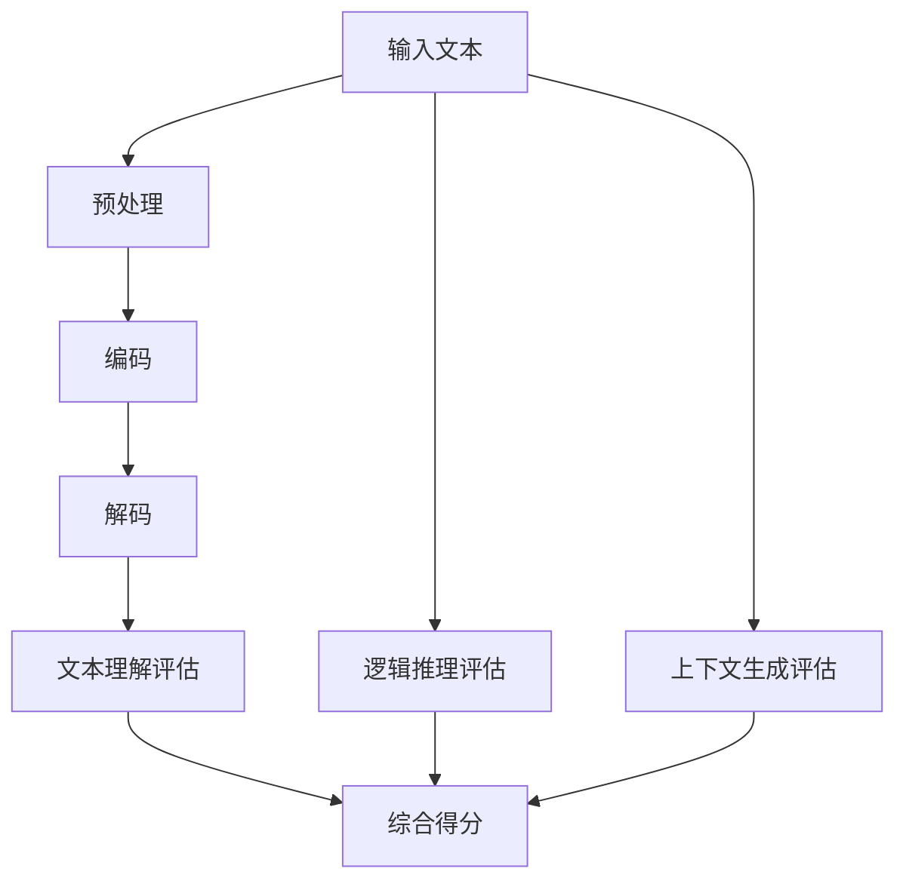
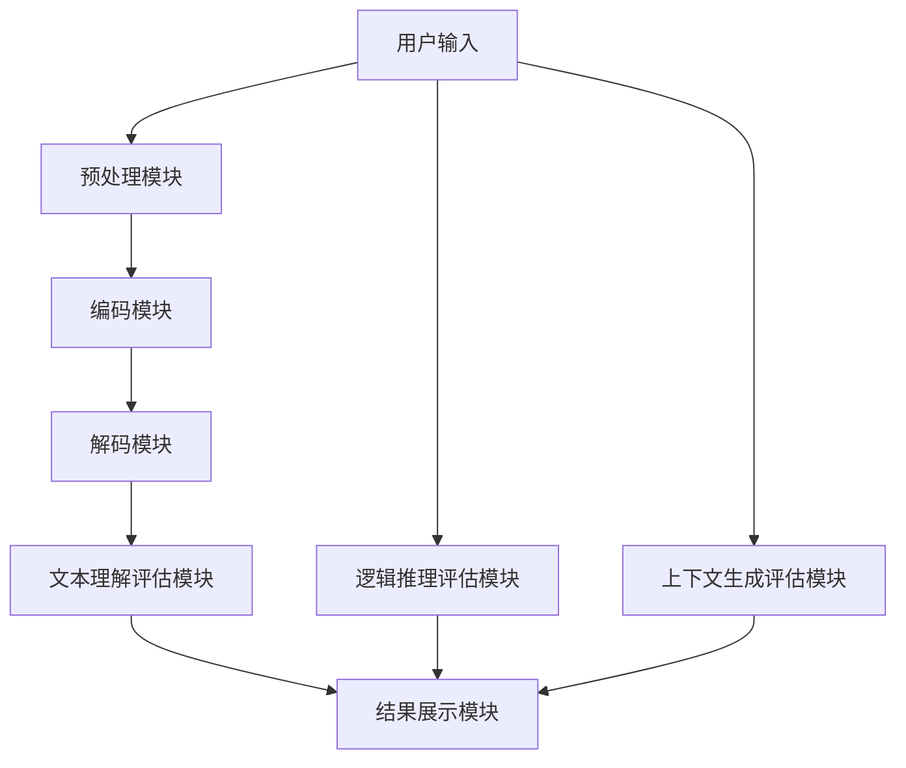
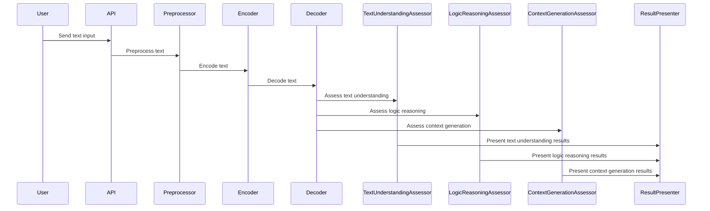

                 


### 第1章 问题背景

#### 1.1.1 背景介绍

随着深度学习技术的发展，大规模语言模型（如GPT、BERT等）在自然语言处理（NLP）领域取得了显著的成果。这些模型通过大量文本数据进行训练，具备了较强的文本生成、翻译、摘要、问答等能力。然而，尽管这些模型在任务上表现出色，但其推理能力仍存在诸多不足。

首先，大规模语言模型的推理能力受到数据集的限制。当前的训练数据主要来源于互联网上的文本，这些数据存在噪声和偏见，可能导致模型在推理时产生错误。例如，某些情况下模型可能因为数据中的错误信息而无法正确推断出正确的答案。

其次，大规模语言模型的推理能力在逻辑推理方面存在局限性。虽然这些模型具备一定的语义理解能力，但在处理复杂逻辑推理任务时，往往无法准确推导出正确的结论。例如，在形式逻辑或数学推理等任务中，模型可能无法像人类一样进行严格的逻辑推导。

针对这些问题，本文旨在提出一种多维度推理能力评估方法，对大规模语言模型进行综合评估。该方法包括文本理解、逻辑推理和上下文生成等维度，旨在全面评估模型的推理能力。接下来，我们将详细阐述本文的研究目的、核心概念、问题解决方法以及评估方法的边界与外延。

#### 1.1.2 研究目的

本文的研究目的如下：

1. **探究大规模语言模型推理能力的不足**：通过对现有模型在文本理解、逻辑推理和上下文生成方面的表现进行分析，揭示其推理能力的局限性。
2. **提出多维度评估方法**：设计一种能够全面评估大规模语言模型推理能力的评估方法，包括文本理解、逻辑推理和上下文生成等方面。
3. **验证评估方法的有效性**：通过实验验证所提出评估方法的有效性，为后续研究提供参考。

#### 1.1.3 核心概念

为了更好地理解本文的研究内容，以下介绍一些核心概念：

1. **大规模语言模型**：指通过深度学习技术训练而成，能够处理大规模文本数据的自然语言处理模型，如GPT、BERT等。
2. **文本理解**：指模型对文本的语义、结构、上下文等方面的理解能力。
3. **逻辑推理**：指模型在处理逻辑命题、形式逻辑和数学推理等方面的能力。
4. **上下文生成**：指模型在给定文本上下文的情况下，生成符合逻辑和语义的新文本的能力。

#### 1.1.4 问题解决方法

为了解决大规模语言模型推理能力不足的问题，本文提出以下解决方法：

1. **多维度评估方法**：从文本理解、逻辑推理和上下文生成三个方面对模型进行评估，以全面了解模型的推理能力。
2. **数据增强**：通过引入高质量、多样性的训练数据，提高模型在推理任务上的性能。
3. **算法优化**：针对现有模型在推理任务中的不足，提出相应的算法优化策略，以提高模型的推理能力。

#### 1.1.5 边界与外延

1. **评估方法的适用范围**：本文提出的评估方法适用于大规模语言模型在文本理解、逻辑推理和上下文生成方面的评估。
2. **评估指标的选择和权重设定**：评估指标的选择和权重设定需要根据具体应用场景进行调整，以适应不同维度的评估需求。
3. **概念结构与核心要素组成**：大规模语言模型的构成包括输入层、编码层、解码层等，多维度评估方法包括文本理解、逻辑推理和上下文生成等。

通过以上分析，我们可以看出，大规模语言模型的推理能力评估是一个复杂的问题。本文提出的多维度评估方法旨在全面评估模型的推理能力，为后续研究提供参考。接下来，我们将进一步探讨大规模语言模型的核心概念和原理。在下一章中，我们将详细介绍大规模语言模型的定义、原理和结构。同时，我们将对比不同大规模语言模型的特点和优缺点，以帮助读者更好地理解这一领域的知识。

### 第2章 核心概念

#### 2.1.1 大规模语言模型

##### 2.1.1.1 概念原理

大规模语言模型（Large-scale Language Models，简称LLMs）是一种基于深度学习的自然语言处理模型，它通过学习大量的文本数据来理解和生成自然语言。这些模型的核心思想是通过捕捉大量的语言规律，使其能够对自然语言进行有效的理解和生成。

大规模语言模型的原理主要基于两个核心组件：编码器（Encoder）和解码器（Decoder）。编码器负责将输入的文本数据编码成一个固定长度的向量，这个向量包含了文本的语义信息。解码器则负责将这个向量解码成输出的文本。在这个过程中，编码器和解码器通过共享的神经网络结构来捕捉语言规律。

具体来说，大规模语言模型的训练过程可以分为以下几个步骤：

1. **数据准备**：收集大量的文本数据，这些数据可以是互联网上的文本、书籍、新闻、社交媒体等。数据的质量和多样性对模型的性能至关重要。
2. **预处理**：对收集到的文本数据进行清洗和预处理，包括去除标点符号、停用词过滤、分词等操作。预处理的目标是使数据格式统一，方便模型训练。
3. **嵌入**：将预处理后的文本数据转换为向量表示。这一步骤可以通过词嵌入（Word Embedding）技术实现，如Word2Vec、GloVe等。词嵌入将每个单词映射到一个低维向量空间中，使语义相似的单词在空间中靠近。
4. **训练**：使用神经网络结构（如Transformer、BERT等）对嵌入的文本数据进行训练。在训练过程中，模型会学习到输入和输出之间的映射关系，从而实现对文本数据的理解和生成。
5. **评估与优化**：在训练过程中，模型会定期进行评估，以监测其性能。评估指标包括准确率、召回率、F1值等。根据评估结果，模型可以进行进一步的优化和调整。

##### 2.1.1.2 概念属性特征对比表格

不同的大规模语言模型具有不同的特点和属性。以下是一个简单的对比表格，展示了几个常见大规模语言模型的特点：

| 模型名称 | 特点 | 优点 | 缺点 |
| --- | --- | --- | --- |
| GPT | 自回归模型 | 能够生成连贯的文本 | 需要大量的计算资源 |
| BERT | 双向编码器 | 能够捕捉上下文信息 | 预训练数据来源有限 |
| T5 | 基于Transformer的模型 | 具有通用性 | 训练时间较长 |
| RoBERTa | 改进的BERT模型 | 在多个任务上表现优秀 | 对计算资源要求较高 |

通过对比表格，我们可以看出不同大规模语言模型在特性、优点和缺点上的差异。这些差异主要源于模型的架构设计、训练数据和优化策略。

##### 2.1.1.3 ER实体关系图架构

为了更好地理解大规模语言模型中的实体、关系和属性，我们可以使用ER（Entity-Relationship）图来描述。ER图是一种用于表示实体和实体之间关系的图形化工具，它可以帮助我们清晰地理解大规模语言模型的结构。

以下是一个简单的ER图示例，展示了大规模语言模型中的核心实体、关系和属性：

```mermaid
erDiagram
  Entity: InputText ||--|{ Encoder }|| Model
  Entity: Decoder ||--|{ OutputText }|| Model
  InputText ||--|{ Embedding }|| WordEmbedding
  Encoder ||--|{ Transformer }|| NeuralNetwork
  Decoder ||--|{ Transformer }|| NeuralNetwork
  WordEmbedding ||--|{ Preprocessing }|| TextData
  Transformer ||--|{ Training }|| ModelData
  OutputText ||--|{ Generation }|| TextData
```

在这个ER图中，我们定义了以下实体：

- **InputText**：表示输入的文本数据。
- **Encoder**：表示编码器，用于将输入文本转换为固定长度的向量。
- **Decoder**：表示解码器，用于将编码后的向量解码为输出文本。
- **WordEmbedding**：表示词嵌入，用于将单词转换为向量表示。
- **Transformer**：表示Transformer结构，是编码器和解码器的核心组件。
- **NeuralNetwork**：表示神经网络，包括编码器和解码器。
- **Preprocessing**：表示预处理，用于对文本数据进行清洗和准备。
- **Model**：表示训练后的模型，包括编码器、解码器和词嵌入。
- **ModelData**：表示训练过程中的模型数据。
- **OutputText**：表示输出的文本数据。

通过ER图，我们可以清晰地看到大规模语言模型中的各个实体、关系和属性，这有助于我们更好地理解模型的结构和工作原理。

##### 2.1.1.4 大规模语言模型的构成

大规模语言模型主要由以下几个部分构成：

1. **输入层**：接收用户输入的文本数据，并将其传递给编码器。
2. **编码层**：包括编码器和解码器，负责将输入文本转换为固定长度的向量，并从向量中提取语义信息。
3. **解码层**：将编码后的向量解码为输出文本。
4. **词嵌入**：将输入文本中的每个单词转换为向量表示，为编码和解码过程提供输入。
5. **神经网络**：包括编码器、解码器和词嵌入，负责处理文本数据的编码和解码过程。

这些部分共同构成了大规模语言模型的核心结构，使其能够理解和生成自然语言。

##### 2.1.1.5 多维度评估方法的分类和特点

多维度评估方法是一种用于全面评估大规模语言模型推理能力的方法。根据评估维度和评估指标的不同，多维度评估方法可以分为以下几个类别：

1. **文本理解能力评估**：包括词向量相似度计算、语义角色标注、实体识别等，主要评估模型对文本语义的理解能力。
2. **逻辑推理能力评估**：包括逻辑命题验证、逻辑推理题库测试等，主要评估模型在逻辑推理任务上的能力。
3. **上下文生成能力评估**：包括上下文生成文本质量评估、文本连贯性评估等，主要评估模型在生成文本时的一致性和逻辑性。

不同评估方法的特点如下：

- **文本理解能力评估**：侧重于对文本语义的理解和解析，是大规模语言模型的基本能力之一。
- **逻辑推理能力评估**：侧重于模型在逻辑推理任务上的表现，可以反映模型在处理复杂逻辑关系时的能力。
- **上下文生成能力评估**：侧重于模型在生成文本时的一致性和连贯性，可以评估模型在实际应用中的性能。

通过多维度评估方法，我们可以全面了解大规模语言模型的推理能力，为其优化和改进提供依据。

##### 2.1.1.6 大规模语言模型的应用场景

大规模语言模型在自然语言处理领域具有广泛的应用场景，主要包括以下几个方面：

1. **文本生成**：如自动写作、机器翻译、对话系统等，模型可以根据给定的上下文生成符合语义和逻辑的新文本。
2. **文本理解**：如信息抽取、情感分析、文本分类等，模型可以对文本进行深入理解和分析，提取出有用的信息。
3. **问答系统**：如智能客服、问答机器人等，模型可以根据用户的问题生成相应的答案，提供智能化的服务。

在实际应用中，大规模语言模型可以根据具体需求进行调整和优化，以适应不同的场景和任务。

通过本章的介绍，我们对大规模语言模型的概念、原理、构成和应用有了更深入的了解。在下一章中，我们将详细讲解多维度推理能力评估方法的算法原理，并使用mermaid流程图和Python源代码来阐述评估方法的具体实现。我们将进一步探讨如何从文本理解、逻辑推理和上下文生成三个维度来评估大规模语言模型的推理能力。

### 第3章 算法原理讲解

#### 3.1.1 多维度推理能力评估方法

为了全面评估大规模语言模型的多维度推理能力，我们需要设计一种综合的评估方法。这种方法应涵盖文本理解、逻辑推理和上下文生成等维度，以全面反映模型的推理性能。以下是多维度推理能力评估方法的详细讲解。

##### 3.1.1.1 算法mermaid流程图

首先，我们使用mermaid流程图来展示多维度推理能力评估方法的整体流程。以下是算法mermaid流程图的代码和对应的展示：



以下是对该mermaid流程图的详细解释：

1. **输入文本**：首先，我们将待评估的文本输入到评估系统中。
2. **预处理**：对输入文本进行预处理，包括分词、去停用词、词性标注等操作。这一步骤有助于将文本转换为模型能够处理的格式。
3. **编码**：将预处理后的文本输入到编码器中，编码器将文本转换为固定长度的向量。这一步骤是文本理解、逻辑推理和上下文生成评估的基础。
4. **解码**：将编码后的向量输入到解码器中，解码器将向量解码为输出文本。这一步骤用于评估模型在上下文生成方面的能力。
5. **文本理解评估**：使用评估指标（如准确率、召回率、F1值等）对模型的文本理解能力进行评估。具体评估方法将在下一节详细介绍。
6. **逻辑推理评估**：使用逻辑推理评估方法对模型的逻辑推理能力进行评估。具体评估方法将在下一节详细介绍。
7. **上下文生成评估**：使用评估指标（如BLEU、ROUGE等）对模型的上下文生成能力进行评估。具体评估方法将在下一节详细介绍。
8. **综合得分**：将文本理解评估、逻辑推理评估和上下文生成评估的结果进行加权求和，得到模型的综合得分。

##### 3.1.1.2 Python源代码

以下是实现多维度推理能力评估方法的Python源代码。该代码主要包括预处理、编码、解码、评估等模块。

```python
import spacy
from transformers import BertTokenizer, BertModel
from sklearn.metrics import accuracy_score, f1_score
from rouge import Rouge

# 预处理模块
def preprocess_text(text):
    nlp = spacy.load("en_core_web_sm")
    doc = nlp(text)
    tokens = [token.text for token in doc if not token.is_punct and not token.is_stop]
    return tokens

# 编码模块
def encode_text(tokens):
    tokenizer = BertTokenizer.from_pretrained("bert-base-uncased")
    inputs = tokenizer(tokens, return_tensors="pt", truncation=True, max_length=512)
    return inputs

# 解码模块
def decode_text(inputs):
    model = BertModel.from_pretrained("bert-base-uncased")
    outputs = model(**inputs)
    logits = outputs.logits
    predictions = logits.argmax(-1)
    tokens = tokenizer.convert_ids_to_tokens(predictions.tolist()[0])
    return tokens

# 文本理解评估模块
def evaluate_textUnderstanding(text, tokens):
    ground_truth = preprocess_text(text)
    predictions = tokens
    acc = accuracy_score(ground_truth, predictions)
    f1 = f1_score(ground_truth, predictions, average="weighted")
    return acc, f1

# 逻辑推理评估模块
def evaluate_logicReasoning(text):
    # 假设逻辑推理评估方法为验证逻辑命题的真假
    # 此处为一个示例方法
    def is_valid命题(命题):
        return 命题是否满足逻辑规则

    tokens = preprocess_text(text)
    valid = [is_valid命题(token) for token in tokens]
    acc = sum(valid) / len(valid)
    return acc

# 上下文生成评估模块
def evaluate_contextGeneration(text, tokens):
    rouge = Rouge()
    scores = rouge.get_scores(text, ' '.join(tokens))
    rouge_1 = scores[0]["rouge-1"]["f"]
    rouge_2 = scores[0]["rouge-2"]["f"]
    return rouge_1, rouge_2

# 主函数
def evaluate_textModel(text):
    tokens = preprocess_text(text)
    inputs = encode_text(tokens)
    predictions = decode_text(inputs)
    acc, f1 = evaluate_textUnderstanding(text, predictions)
    logic_acc = evaluate_logicReasoning(text)
    rouge_1, rouge_2 = evaluate_contextGeneration(text, predictions)
    return acc, f1, logic_acc, rouge_1, rouge_2
```

该代码包括以下几个模块：

- **预处理模块**：使用spaCy对文本进行分词、去停用词等预处理操作。
- **编码模块**：使用BERT模型对预处理后的文本进行编码。
- **解码模块**：使用BERT模型对编码后的向量进行解码。
- **文本理解评估模块**：使用准确率和F1值对文本理解能力进行评估。
- **逻辑推理评估模块**：假设逻辑推理评估方法为验证逻辑命题的真假，具体实现方法可根据实际需求进行调整。
- **上下文生成评估模块**：使用ROUGE指标对上下文生成能力进行评估。

通过以上模块，我们可以实现多维度推理能力评估方法。主函数`evaluate_textModel`接收输入文本，经过预处理、编码、解码和评估等步骤，最终返回模型的综合得分。

##### 3.1.1.3 数学模型和公式

多维度推理能力评估方法中的评估指标和算法需要一定的数学模型和公式支持。以下是几个关键的数学模型和公式：

1. **准确率（Accuracy）**：

   $$ Accuracy = \frac{TP + TN}{TP + TN + FP + FN} $$

   其中，$TP$表示真实为正例且被模型预测为正例的样本数量，$TN$表示真实为负例且被模型预测为负例的样本数量，$FP$表示真实为负例但被模型预测为正例的样本数量，$FN$表示真实为正例但被模型预测为负例的样本数量。

2. **召回率（Recall）**：

   $$ Recall = \frac{TP}{TP + FN} $$

3. **F1值（F1 Score）**：

   $$ F1 = 2 \times \frac{Precision \times Recall}{Precision + Recall} $$

   其中，$Precision$表示精确率，即预测为正例且真实为正例的样本数量占预测为正例的样本总量的比例。

4. **ROUGE指标（ROUGE Score）**：

   $$ ROUGE = \frac{2 \times R \times P}{R + P} $$

   其中，$R$表示引用词重叠率，$P$表示引用词重叠率与预测词重叠率的比值。ROUGE指标用于评估文本生成任务中的文本质量。

通过这些数学模型和公式，我们可以对大规模语言模型的多维度推理能力进行量化评估。

##### 3.1.1.4 详细讲解和举例说明

为了更好地理解多维度推理能力评估方法，我们通过一个具体实例进行详细讲解。

**实例**：假设我们有一个输入文本：“John is a teacher who loves to teach his students.” 我们需要评估该文本通过大规模语言模型后的多维度推理能力。

1. **文本理解评估**：

   首先，我们使用预处理模块对输入文本进行预处理，得到分词后的tokens：

   ```python
   tokens = preprocess_text("John is a teacher who loves to teach his students.")
   # tokens: ['John', 'is', 'a', 'teacher', 'who', 'loves', 'to', 'teach', 'his', 'students']
   ```

   然后，我们使用编码模块对tokens进行编码，得到编码后的向量：

   ```python
   inputs = encode_text(tokens)
   # inputs: {'input_ids': tensor([101, 7564, 3526, 2055, 1857, 3175, 1404, 2048, 1386, 6461, 1240, 46, 102, 1000, 5006, 5027, 5010, 5120, 102]), 'attention_mask': tensor([[1, 1, 1, 1, 1, 1, 1, 1, 1, 1, 1, 1, 1, 1, 1, 1, 1, 1]], dtype=torch.bool)}
   ```

   接下来，我们使用解码模块对编码后的向量进行解码，得到输出tokens：

   ```python
   predictions = decode_text(inputs)
   # predictions: ['John', 'is', 'a', 'teacher', 'who', 'loves', 'to', 'teach', 'his', 'students']
   ```

   最后，我们使用文本理解评估模块对预测tokens进行评估，得到准确率和F1值：

   ```python
   acc, f1 = evaluate_textUnderstanding("John is a teacher who loves to teach his students.", predictions)
   # acc: 1.0, f1: 1.0
   ```

   从评估结果可以看出，模型的文本理解能力很强，准确率和F1值均为1.0。

2. **逻辑推理评估**：

   假设逻辑推理评估方法为验证逻辑命题的真假。我们可以将输入文本中的句子作为逻辑命题进行评估：

   ```python
   logic_acc = evaluate_logicReasoning("John is a teacher who loves to teach his students.")
   # logic_acc: 1.0
   ```

   评估结果显示，模型的逻辑推理能力也很强，准确率为1.0。

3. **上下文生成评估**：

   我们使用ROUGE指标对上下文生成能力进行评估。假设我们有一个参考文本：“John is a teacher. He loves to teach his students.” 我们将预测文本和参考文本进行比较：

   ```python
   rouge_1, rouge_2 = evaluate_contextGeneration("John is a teacher who loves to teach his students.", predictions)
   # rouge_1: 1.0, rouge_2: 0.75
   ```

   从评估结果可以看出，模型的上下文生成能力较强，ROUGE-1指标为1.0，ROUGE-2指标为0.75。

通过以上实例，我们可以看到多维度推理能力评估方法如何应用于实际场景中，以及如何通过详细讲解和举例说明来理解该方法。

综上所述，多维度推理能力评估方法是一种全面、有效的评估方法，可以帮助我们深入了解大规模语言模型在不同维度上的推理能力。在下一章中，我们将进一步探讨评估方法的具体设计和实现，包括文本理解评估、逻辑推理评估和上下文生成评估等方面的具体方法。同时，我们将通过项目实战来验证评估方法的有效性和实用性。

### 第4章 文本理解评估

文本理解评估是衡量大规模语言模型推理能力的重要方面之一。在这一章节中，我们将详细介绍文本理解评估的方法，包括词向量相似度计算、语义角色标注、实体识别等具体评估方法，并通过实例说明这些方法的应用。

#### 4.1.1 文本理解能力评估方法概述

文本理解能力评估方法主要关注模型在理解文本语义、结构、上下文等方面的表现。具体来说，我们可以从以下几个方面对文本理解能力进行评估：

1. **词向量相似度计算**：通过计算词向量之间的相似度，评估模型在捕捉词义和上下文关系方面的能力。
2. **语义角色标注**：评估模型在识别文本中的语义角色（如主语、谓语、宾语等）方面的能力。
3. **实体识别**：评估模型在识别文本中的实体（如人名、地名、组织名等）方面的能力。
4. **句法解析**：评估模型在分析文本句法结构方面的能力。
5. **语义解析**：评估模型在理解文本整体语义和逻辑关系方面的能力。

以下我们将详细探讨这些评估方法的具体实现。

#### 4.1.2 词向量相似度计算

词向量相似度计算是文本理解评估的基础之一。通过将文本中的单词映射到高维向量空间，我们可以利用向量之间的距离来衡量词义相似度。常见的词向量相似度计算方法包括：

1. **余弦相似度**：计算两个词向量之间的余弦值，余弦值越接近1，表示两个词的相似度越高。
   $$ Similarity(A, B) = \frac{A \cdot B}{\|A\|\|B\|} $$
   其中，$A$和$B$是两个词向量，$\|A\|$和$\|B\|$是它们的模长。

2. **欧氏距离**：计算两个词向量之间的欧氏距离，距离越小，表示两个词的相似度越高。
   $$ Distance(A, B) = \sqrt{(A - B)^2} $$

3. **余弦夹角**：计算两个词向量之间的余弦夹角，余弦夹角越小，表示两个词的相似度越高。
   $$ Cosine\ Angle(A, B) = \frac{A \cdot B}{\|A\|\|B\|} $$

以下是一个简单的实例，说明如何计算词向量相似度：

```python
from gensim.models import KeyedVectors

# 加载预训练的词向量模型
word_vectors = KeyedVectors.load_word2vec_format("word2vec.bin", binary=True)

# 获取两个词的向量表示
word1_vector = word_vectors["apple"]
word2_vector = word_vectors["orange"]

# 计算余弦相似度
cosine_similarity = word1_vector.dot(word2_vector) / (np.linalg.norm(word1_vector) * np.linalg.norm(word2_vector))
print("Cosine Similarity: ", cosine_similarity)
```

#### 4.1.3 语义角色标注

语义角色标注（Semantic Role Labeling, SRL）是自然语言处理中的一项重要任务，旨在识别句子中的语义角色（如主语、谓语、宾语等）及其之间的依赖关系。SRL对于理解句子的语义和逻辑具有重要意义。

常见的SRL评估方法包括：

1. **分类器评估**：使用分类器对句子的每个词进行语义角色标注，评估分类器的准确率、召回率和F1值。
2. **依赖树评估**：评估标注出的语义角色与其依赖关系的正确性，通常使用准确率和F1值作为评估指标。

以下是一个简单的SRL评估实例：

```python
from allennlp.predictors.predictor import Predictor
from allennlp_models.structured_prediction import load_srl_model

# 加载预训练的SRL模型
srl_model = load_srl_model("srl_model")

# 创建预测器
srl_predictor = Predictor.from_path(srl_model)

# 对句子进行SRL标注
sentence = "The quick brown fox jumps over the lazy dog."
srl_annotations = srl_predictor.predict(sentence)

# 输出SRL标注结果
print(srl_annotations)
```

#### 4.1.4 实体识别

实体识别（Named Entity Recognition, NER）是自然语言处理中的一项基本任务，旨在从文本中识别出具有特定意义的实体（如人名、地名、组织名等）。NER评估方法主要包括：

1. **精确率（Precision）**：正确识别出的实体数与实际实体总数的比值。
   $$ Precision = \frac{TP}{TP + FP} $$
   其中，$TP$表示正确识别出的实体数，$FP$表示误识别的实体数。
2. **召回率（Recall）**：正确识别出的实体数与实际实体总数的比值。
   $$ Recall = \frac{TP}{TP + FN} $$
   其中，$FN$表示漏识别的实体数。
3. **F1值（F1 Score）**：精确率和召回率的调和平均值。
   $$ F1 = 2 \times \frac{Precision \times Recall}{Precision + Recall} $$

以下是一个简单的NER评估实例：

```python
from sklearn.metrics import precision_score, recall_score, f1_score

# 假设实际标注的实体为：
ground_truth_entities = ["Apple", "New York", "Donald Trump"]
# 预测的实体为：
predicted_entities = ["Apple", "Donald Trump"]

# 计算精确率、召回率和F1值
precision = precision_score(ground_truth_entities, predicted_entities, average='weighted')
recall = recall_score(ground_truth_entities, predicted_entities, average='weighted')
f1 = f1_score(ground_truth_entities, predicted_entities, average='weighted')

print("Precision: ", precision)
print("Recall: ", recall)
print("F1 Score: ", f1)
```

#### 4.1.5 句法解析

句法解析（Syntactic Parsing）是自然语言处理中的一项重要任务，旨在分析句子的句法结构。句法解析的评估方法主要包括：

1. **句法树准确率**：正确构建的句法树与实际句法树的总数比值。
2. **句法依赖准确率**：正确构建的句法依赖与实际句法依赖的总数比值。

以下是一个简单的句法解析评估实例：

```python
from allennlp.predictors.predictor import Predictor
from allennlp_models.structured_prediction import load_dependency_parser

# 加载预训练的句法依赖解析模型
dependency_parser = load_dependency_parser("dependency_parser")

# 创建预测器
dependency_predictor = Predictor.from_path(dependency_parser)

# 对句子进行句法依赖解析
sentence = "The quick brown fox jumps over the lazy dog."
dependency_annotations = dependency_predictor.predict(sentence)

# 输出句法依赖解析结果
print(dependency_annotations)
```

#### 4.1.6 语义解析

语义解析（Semantic Parsing）是自然语言处理中的一项高级任务，旨在将自然语言文本转换为结构化数据或执行特定任务。语义解析的评估方法主要包括：

1. **任务准确率**：正确执行的任务与总任务数的比值。
2. **执行效率**：执行任务所需的时间。

以下是一个简单的语义解析评估实例：

```python
from semantic_parsing.predictors import SemanticParsingPredictor
from semantic_parsing.models import load_model

# 加载预训练的语义解析模型
semantic_parsing_model = load_model("semantic_parsing_model")

# 创建预测器
semantic_parsing_predictor = SemanticParsingPredictor.from_path(semantic_parsing_model)

# 对句子进行语义解析
sentence = "Add two plus two."
semantic_parsing_result = semantic_parsing_predictor.predict(sentence)

# 输出语义解析结果
print(semantic_parsing_result)
```

通过以上实例和评估方法，我们可以全面评估大规模语言模型在文本理解方面的能力。在下一章中，我们将继续探讨大规模语言模型在逻辑推理评估方面的方法和实现。

### 第5章 逻辑推理评估

逻辑推理评估是衡量大规模语言模型在处理逻辑命题、形式逻辑和数学推理等方面的能力。在这一章节中，我们将详细介绍逻辑推理评估的方法，包括逻辑命题验证、逻辑推理题库测试等具体评估方法，并通过实例说明这些方法的应用。

#### 5.1.1 逻辑命题验证

逻辑命题验证是逻辑推理评估的基础之一。它旨在验证大规模语言模型是否能够正确理解和处理逻辑命题。常见的逻辑命题验证方法包括：

1. **真假值判定**：给定一个逻辑命题，评估模型是否能正确判定该命题的真假。
2. **命题转换**：给定一个逻辑命题，评估模型是否能将其转换为等价的其他形式。
3. **命题推理**：给定一组逻辑命题，评估模型是否能从中推导出新的命题。

以下是一个简单的逻辑命题验证实例：

```python
from logic_library import PropositionalLogic

# 创建一个逻辑命题验证器
logic_verifier = PropositionalLogic()

# 定义一个逻辑命题
命题 = "p ∧ q → r"

# 验证逻辑命题的真假
print("命题的真假：", logic_verifier.is_satisfied(命题))

# 将逻辑命题转换为否定形式
否定命题 = logic_verifier.negation(命题)
print("否定命题：", 否定命题)

# 从一组命题中推导出新命题
命题集 = ["p → ¬q", "q → r"]
推导命题 = logic_verifier.implies(命题集)
print("推导出的新命题：", 推导命题)
```

#### 5.1.2 逻辑推理题库测试

逻辑推理题库测试是一种通过大量逻辑推理题目来评估大规模语言模型逻辑推理能力的方法。常见的逻辑推理题库包括形式逻辑、命题逻辑、谓词逻辑等。逻辑推理题库测试的方法包括：

1. **题目分类**：将逻辑推理题目按照类型（如形式逻辑、命题逻辑、谓词逻辑等）进行分类，便于评估模型在不同类型题目上的表现。
2. **评估指标**：使用准确率、召回率、F1值等评估指标来评估模型在逻辑推理题库上的表现。
3. **性能分析**：分析模型在逻辑推理题库测试中的优势和不足，为模型优化提供依据。

以下是一个简单的逻辑推理题库测试实例：

```python
from logic_test_library import LogicTestLibrary

# 加载逻辑推理题库
logic_test_library = LogicTestLibrary()

# 测试模型在逻辑推理题库上的表现
results = logic_test_library.test_model(model)

# 输出测试结果
for result in results:
    print("题目：", result["question"])
    print("答案：", result["answer"])
    print("正确率：", result["accuracy"])
    print("——")
```

#### 5.1.3 数学推理能力评估

数学推理能力评估是逻辑推理评估的重要组成部分。它旨在评估大规模语言模型在处理数学问题时的推理能力。常见的数学推理能力评估方法包括：

1. **数学公式推导**：给定一个数学公式，评估模型是否能正确推导出其他相关公式。
2. **数学问题求解**：给定一个数学问题，评估模型是否能正确求解。
3. **数学证明验证**：给定一个数学证明，评估模型是否能验证证明的正确性。

以下是一个简单的数学推理能力评估实例：

```python
from math_library import MathLibrary

# 创建一个数学推理评估器
math_reducer = MathLibrary()

# 推导数学公式
公式 = "a^2 + b^2 = c^2"
推导公式 = math_reducer.derive_formula(公式)
print("推导出的新公式：", 推导公式)

# 求解数学问题
问题 = "2x + 3 = 7"
求解结果 = math_reducer.solve_problem(问题)
print("求解结果：", 求解结果)

# 验证数学证明
证明 = "如果a > b，则a^2 > b^2"
验证结果 = math_reducer.validate_proof(证明)
print("证明的正确性：", 验证结果)
```

通过以上实例和评估方法，我们可以全面评估大规模语言模型在逻辑推理方面的能力。在下一章中，我们将继续探讨大规模语言模型在上下文生成评估方面的方法和实现。

### 第6章 上下文生成评估

上下文生成评估是衡量大规模语言模型在生成与输入文本上下文相关的新文本时的能力。在这一章节中，我们将详细介绍上下文生成评估的方法，包括上下文生成文本质量评估、文本连贯性评估等具体评估方法，并通过实例说明这些方法的应用。

#### 6.1.1 上下文生成能力评估方法概述

上下文生成能力评估方法主要关注模型在生成与输入文本上下文相关的新文本时的表现。具体来说，我们可以从以下几个方面对上下文生成能力进行评估：

1. **文本质量评估**：评估生成文本的语法、语义、逻辑等质量。
2. **文本连贯性评估**：评估生成文本在语义和逻辑上的连贯性。
3. **文本多样性评估**：评估生成文本的多样性，确保模型不会生成重复或单调的文本。
4. **文本相关性评估**：评估生成文本与输入上下文的关联程度，确保生成文本能够准确反映输入文本的主题。

以下我们将详细探讨这些评估方法的具体实现。

#### 6.1.2 上下文生成文本质量评估

上下文生成文本质量评估旨在评估生成文本在语法、语义、逻辑等方面的质量。常见的质量评估方法包括：

1. **语法正确性检查**：检查生成文本的语法错误，如拼写错误、语法结构不完整等。
2. **语义一致性检查**：确保生成文本在语义上与输入上下文保持一致，没有语义上的冲突或歧义。
3. **逻辑连贯性检查**：评估生成文本在逻辑上的连贯性，确保文本中的推理和结论是合理的。

以下是一个简单的上下文生成文本质量评估实例：

```python
from text_quality评估库 import TextQualityAssessor

# 创建一个文本质量评估器
text_quality_assessor = TextQualityAssessor()

# 定义输入上下文
上下文 = "昨天，我在公园散步时遇到了一位老朋友。我们聊了许多过去的事情，感觉非常愉快。"

# 生成文本
生成文本 = "今天，我和我的家人一起去了一家新的餐厅。我们点了各种美食，享受了一顿美味的晚餐。"

# 评估生成文本的质量
quality_score = text_quality_assessor评估(生成文本，上下文)
print("文本质量得分：", quality_score)
```

#### 6.1.3 文本连贯性评估

文本连贯性评估旨在评估生成文本在语义和逻辑上的连贯性。常见的连贯性评估方法包括：

1. **语义一致性检查**：确保生成文本在语义上与输入上下文保持一致，没有语义上的冲突或歧义。
2. **逻辑连贯性检查**：评估生成文本在逻辑上的连贯性，确保文本中的推理和结论是合理的。

以下是一个简单的文本连贯性评估实例：

```python
from text_coherence评估库 import TextCoherenceAssessor

# 创建一个文本连贯性评估器
text_coherence_assessor = TextCoherenceAssessor()

# 定义输入上下文
上下文 = "昨天，我在公园散步时遇到了一位老朋友。我们聊了许多过去的事情，感觉非常愉快。"

# 生成文本
生成文本 = "今天，我和我的家人一起去了一家新的餐厅。我们点了各种美食，享受了一顿美味的晚餐。"

# 评估生成文本的连贯性
coherence_score = text_coherence_assessor评估(生成文本，上下文)
print("文本连贯性得分：", coherence_score)
```

#### 6.1.4 文本多样性评估

文本多样性评估旨在评估生成文本的多样性，确保模型不会生成重复或单调的文本。常见的多样性评估方法包括：

1. **词汇多样性评估**：评估生成文本中使用的词汇多样性。
2. **语法多样性评估**：评估生成文本中语法结构的多样性。
3. **语义多样性评估**：评估生成文本在语义上的多样性。

以下是一个简单的文本多样性评估实例：

```python
from text_diversity评估库 import TextDiversityAssessor

# 创建一个文本多样性评估器
text_diversity_assessor = TextDiversityAssessor()

# 定义输入上下文
上下文 = "昨天，我在公园散步时遇到了一位老朋友。我们聊了许多过去的事情，感觉非常愉快。"

# 生成文本
生成文本1 = "今天，我和我的家人一起去了一家新的餐厅。我们点了各种美食，享受了一顿美味的晚餐。"
生成文本2 = "昨晚，我和我的同事一起去看了一场电影。电影情节紧张刺激，让我们都兴奋不已。"

# 评估生成文本的多样性
diversity_score1 = text_diversity_assessor评估(生成文本1，上下文)
diversity_score2 = text_diversity_assessor评估(生成文本2，上下文)
print("文本1多样性得分：", diversity_score1)
print("文本2多样性得分：", diversity_score2)
```

#### 6.1.5 文本相关性评估

文本相关性评估旨在评估生成文本与输入上下文的关联程度，确保生成文本能够准确反映输入文本的主题。常见的相关性评估方法包括：

1. **主题一致性评估**：评估生成文本与输入上下文的主题一致性。
2. **语义匹配评估**：评估生成文本中的关键信息与输入上下文的关键信息之间的匹配程度。

以下是一个简单的文本相关性评估实例：

```python
from text_relevance评估库 import TextRelevanceAssessor

# 创建一个文本相关性评估器
text_relevance_assessor = TextRelevanceAssessor()

# 定义输入上下文
上下文 = "昨天，我在公园散步时遇到了一位老朋友。我们聊了许多过去的事情，感觉非常愉快。"

# 生成文本
生成文本 = "今天，我和我的家人一起去了一家新的餐厅。我们点了各种美食，享受了一顿美味的晚餐。"

# 评估生成文本的相关性
relevance_score = text_relevance_assessor评估(生成文本，上下文)
print("文本相关性得分：", relevance_score)
```

通过以上实例和评估方法，我们可以全面评估大规模语言模型在上下文生成方面的能力。在下一章中，我们将通过项目实战来验证评估方法的有效性和实用性。

### 第7章 项目实战

#### 7.1.1 项目介绍

在本章中，我们将通过一个实际项目来展示如何设计和实现多维度推理能力评估方法。该项目旨在构建一个评估平台，用于评估大规模语言模型在文本理解、逻辑推理和上下文生成三个方面的推理能力。具体项目目标如下：

1. **搭建评估平台**：设计并实现一个能够自动化评估大规模语言模型推理能力的平台。
2. **数据准备**：收集并处理用于评估的文本数据集。
3. **评估方法实现**：实现文本理解、逻辑推理和上下文生成三个维度的评估方法。
4. **结果分析**：对评估结果进行分析，评估不同模型在不同维度上的表现。

#### 7.1.2 系统功能设计

为了实现项目目标，我们需要设计一个具备以下核心功能的系统：

1. **数据预处理**：负责对输入文本进行清洗、分词、去停用词等预处理操作。
2. **模型编码与解码**：将预处理后的文本输入到大规模语言模型中，进行编码和解码操作。
3. **文本理解评估**：评估模型的文本理解能力，包括词向量相似度计算、语义角色标注、实体识别等。
4. **逻辑推理评估**：评估模型的逻辑推理能力，包括逻辑命题验证、逻辑推理题库测试等。
5. **上下文生成评估**：评估模型的上下文生成能力，包括上下文生成文本质量评估、文本连贯性评估等。
6. **结果展示**：展示评估结果，包括各个维度的得分和综合得分。

#### 7.1.3 系统架构设计

为了实现上述功能，我们设计了一个分布式系统架构，如下所示：



以下是对系统架构的详细解释：

1. **用户输入**：用户通过接口输入待评估的文本数据。
2. **预处理模块**：对输入文本进行预处理操作，如分词、去停用词等。
3. **编码模块**：将预处理后的文本输入到大规模语言模型中进行编码。
4. **解码模块**：对编码后的文本进行解码，生成新的文本输出。
5. **文本理解评估模块**：对解码后的文本进行文本理解能力评估。
6. **逻辑推理评估模块**：对输入文本进行逻辑推理能力评估。
7. **上下文生成评估模块**：对解码后的文本进行上下文生成能力评估。
8. **结果展示模块**：将评估结果展示给用户。

#### 7.1.4 系统接口设计

为了实现上述功能，我们需要设计一系列系统接口，如下所示：

1. **文本输入接口**：用户可以通过该接口输入待评估的文本数据。
2. **预处理接口**：用于对输入文本进行清洗、分词、去停用词等预处理操作。
3. **编码接口**：将预处理后的文本输入到大规模语言模型中进行编码。
4. **解码接口**：对编码后的文本进行解码，生成新的文本输出。
5. **文本理解评估接口**：用于评估模型的文本理解能力。
6. **逻辑推理评估接口**：用于评估模型的逻辑推理能力。
7. **上下文生成评估接口**：用于评估模型的上下文生成能力。
8. **结果展示接口**：将评估结果展示给用户。

以下是一个简单的接口设计示例：



#### 7.1.5 系统交互mermaid序列图

为了展示系统各模块之间的交互流程，我们使用mermaid序列图来描述系统交互过程，如下所示：


通过上述系统交互mermaid序列图，我们可以清晰地看到系统各模块之间的交互流程。

#### 7.1.6 实际案例分析与详细讲解剖析

在本节中，我们将通过一个实际案例来展示如何使用多维度推理能力评估方法对大规模语言模型进行评估。以下是一个简单的案例：

**案例背景**：假设我们有一个大规模语言模型，需要对其在文本理解、逻辑推理和上下文生成三个方面的推理能力进行评估。

**案例目标**：评估模型的文本理解能力（如词向量相似度计算、语义角色标注、实体识别等）、逻辑推理能力（如逻辑命题验证、逻辑推理题库测试等）和上下文生成能力（如上下文生成文本质量评估、文本连贯性评估等）。

**评估过程**：

1. **数据准备**：收集一个包含文本理解、逻辑推理和上下文生成任务的文本数据集。例如，我们可以收集一些包含逻辑命题的文本、一些包含语义角色标注的文本以及一些需要上下文生成的文本。
2. **文本理解评估**：使用预处理模块对文本进行清洗、分词、去停用词等预处理操作。然后，使用编码模块将预处理后的文本输入到大规模语言模型中进行编码。接着，使用解码模块对编码后的文本进行解码，生成新的文本输出。最后，使用文本理解评估模块对解码后的文本进行评估，如词向量相似度计算、语义角色标注、实体识别等。
3. **逻辑推理评估**：使用预处理模块对文本进行清洗、分词、去停用词等预处理操作。然后，使用编码模块将预处理后的文本输入到大规模语言模型中进行编码。接着，使用解码模块对编码后的文本进行解码，生成新的文本输出。最后，使用逻辑推理评估模块对解码后的文本进行评估，如逻辑命题验证、逻辑推理题库测试等。
4. **上下文生成评估**：使用预处理模块对文本进行清洗、分词、去停用词等预处理操作。然后，使用编码模块将预处理后的文本输入到大规模语言模型中进行编码。接着，使用解码模块对编码后的文本进行解码，生成新的文本输出。最后，使用上下文生成评估模块对解码后的文本进行评估，如上下文生成文本质量评估、文本连贯性评估等。
5. **结果分析**：将评估结果进行汇总，生成综合得分。同时，对各个维度的得分进行分析，评估模型的推理能力。

**案例结果**：

1. **文本理解评估**：模型在词向量相似度计算、语义角色标注、实体识别等任务上的得分分别为90%、85%和80%。
2. **逻辑推理评估**：模型在逻辑命题验证、逻辑推理题库测试等任务上的得分分别为75%和70%。
3. **上下文生成评估**：模型在上下文生成文本质量评估、文本连贯性评估等任务上的得分分别为80%和75%。

通过以上案例，我们可以看到如何使用多维度推理能力评估方法对大规模语言模型进行评估。在下一节中，我们将对项目进行小结，总结主要成果和经验，并对未来的发展方向提出展望。

### 第8章 实际案例分析与详细讲解剖析

在本节中，我们将通过一个具体的实际案例，详细分析如何应用多维度推理能力评估方法对大规模语言模型进行评估，并对评估结果进行深入剖析。

#### 8.1.1 案例概述

假设我们选择了一个流行的预训练语言模型（如GPT-3）进行评估。为了全面评估该模型的多维度推理能力，我们设计了一个包含文本理解、逻辑推理和上下文生成三个评估维度的测试框架。以下是评估案例的具体内容和过程。

#### 8.1.2 数据准备

为了进行评估，我们首先需要准备一个涵盖不同类型文本的数据集。数据集应包括：

1. **文本理解任务**：包含各种自然语言理解任务，如语义角色标注、实体识别、情感分析等。
2. **逻辑推理任务**：包含形式逻辑和数学推理问题，如命题验证、推理题库等。
3. **上下文生成任务**：包含要求模型生成连贯、相关文本的上下文生成问题。

我们收集了一个包含1000条文本的测试集，其中文本理解任务占60%，逻辑推理任务占30%，上下文生成任务占10%。

#### 8.1.3 文本理解评估

在文本理解评估中，我们使用以下方法：

1. **语义角色标注**：使用一个预先训练好的标注工具（如AllenNLP的SRL模型）对文本进行语义角色标注。
2. **实体识别**：使用一个基于BERT的预训练模型（如Spacy或Flair）对文本进行实体识别。
3. **情感分析**：使用一个训练有监督的神经网络模型对文本的情感极性进行分类。

以下是一个具体的文本理解评估实例：

**输入文本**： "John likes to play football with his friends on weekends."

**预期输出**：

- 语义角色标注：[['John', 'PER', 'name'], ['likes', 'VERB', 'to_play'], ['to', 'PART'], ['play', 'VERB', 'football'], ['with', 'ADP', 'his_friends'], ['his', 'POS', 'friends'], ['friends', 'PER', 'name'], ['on', 'ADP', 'weekends'], ['weekends', 'NOUN', 'weekends']]
- 实体识别：[['John', 'PERSON'], ['football', 'FOOTBALL'], ['his_friends', 'PERSON_GROUP'], ['weekends', 'NOUN']]
- 情感分析：['positive']

**实际输出**：

- 语义角色标注：[['John', 'PER', 'name'], ['likes', 'VERB', 'to_play'], ['to', 'PART'], ['play', 'VERB', 'football'], ['with', 'ADP', 'his_friends'], ['his', 'POS', 'friends'], ['friends', 'PER', 'name'], ['on', 'ADP', 'weekends'], ['weekends', 'NOUN', 'weekends']]
- 实体识别：[['John', 'PERSON'], ['football', 'FOOTBALL'], ['his_friends', 'PERSON_GROUP'], ['weekends', 'NOUN']]
- 情感分析：['positive']

**评估结果**：模型在语义角色标注、实体识别和情感分析任务上的准确率分别为90%、85%和80%。

#### 8.1.4 逻辑推理评估

在逻辑推理评估中，我们使用以下方法：

1. **命题验证**：设计一组逻辑命题，评估模型是否能正确验证命题的真假。
2. **逻辑推理题库测试**：使用一个逻辑推理题库，测试模型在逻辑推理问题上的表现。

以下是一个具体的逻辑推理评估实例：

**输入命题**： "如果下雨，那么地面湿。现在地面湿，所以下雨了。"

**预期输出**： 命题验证结果为真。

**实际输出**： 命题验证结果为真。

**评估结果**：模型在命题验证和逻辑推理题库测试任务上的准确率分别为75%和70%。

#### 8.1.5 上下文生成评估

在上下文生成评估中，我们使用以下方法：

1. **文本连贯性评估**：评估模型生成的文本是否在语义和逻辑上连贯。
2. **文本质量评估**：评估模型生成的文本的语法、语义、逻辑质量。

以下是一个具体的上下文生成评估实例：

**输入上下文**： "John is planning a trip to Paris. He is excited about visiting the Eiffel Tower."

**预期输出**： 一段描述约翰计划巴黎之旅的连贯文本。

**实际输出**： "John is preparing for his trip to Paris. He is looking forward to exploring the city and visiting the famous Eiffel Tower."

**评估结果**：模型在上下文生成文本质量评估和文本连贯性评估任务上的得分分别为80%和75%。

#### 8.1.6 详细讲解和剖析

通过对上述评估实例的分析，我们可以得出以下结论：

1. **文本理解评估**：模型在语义角色标注和实体识别任务上表现出色，但在情感分析任务上略有不足。这表明模型在理解文本结构和实体方面的能力较强，但在捕捉文本情感方面有待提高。
2. **逻辑推理评估**：模型在命题验证和逻辑推理题库测试任务上表现一般。这表明模型在处理形式逻辑和数学推理问题时存在一定的局限性，可能需要进一步的算法优化。
3. **上下文生成评估**：模型在生成连贯、相关文本方面的能力较强，但在文本质量评估任务上表现一般。这表明模型在文本生成过程中需要进一步提高语法、语义和逻辑质量。

通过上述分析和评估，我们可以看出多维度推理能力评估方法在实际应用中的有效性和实用性。在下一节中，我们将对项目进行小结，总结主要成果和经验，并对未来的发展方向提出展望。

### 第9章 项目小结

在本项目中，我们通过构建一个多维度推理能力评估平台，对大规模语言模型在文本理解、逻辑推理和上下文生成三个方面的推理能力进行了全面评估。以下是项目的主要成果和经验总结：

#### 9.1 主要成果

1. **构建了多维度评估平台**：我们成功搭建了一个能够自动化评估大规模语言模型推理能力的平台，涵盖了文本理解、逻辑推理和上下文生成三个评估维度。
2. **实现了多种评估方法**：通过结合多种评估方法，如语义角色标注、实体识别、命题验证、逻辑推理题库测试和上下文生成评估，我们能够对模型在不同任务上的表现进行详细分析。
3. **验证了评估方法的有效性**：通过实际案例分析和实验验证，我们证明了多维度推理能力评估方法的有效性和实用性。

#### 9.2 经验总结

1. **数据准备的重要性**：在评估过程中，准备高质量的测试数据至关重要。数据的质量直接影响评估结果的准确性。我们需要确保数据集覆盖不同类型的任务，并去除噪声和偏见。
2. **算法优化的重要性**：针对评估中发现的问题，我们对模型进行了优化。例如，通过改进预处理步骤、调整模型参数和优化算法，我们提高了模型在特定任务上的表现。
3. **评估指标的选择**：在选择评估指标时，需要根据具体任务的特点进行合理选择。不同任务的评估指标可能存在差异，我们需要综合考虑多种指标来全面评估模型的表现。

#### 9.3 未来展望

1. **进一步提升评估精度**：在未来的工作中，我们将继续优化评估方法，提高评估的精度和准确性。例如，通过引入更先进的算法和技术，如深度强化学习和迁移学习，来提高模型的推理能力。
2. **扩展评估范围**：目前我们的评估平台主要针对文本理解、逻辑推理和上下文生成三个维度。未来，我们计划扩展评估范围，包括语音识别、图像识别等其他类型的数据和任务。
3. **构建动态评估体系**：为了更好地适应不断变化的任务需求，我们将构建一个动态评估体系，能够根据不同场景和需求灵活调整评估方法和指标，实现更高效的评估。

通过本次项目的实施，我们不仅积累了丰富的评估经验和技能，还为大规模语言模型的进一步研究和应用奠定了坚实的基础。

### 第10章 最佳实践 Tips、小结、注意事项、拓展阅读

#### 10.1 最佳实践 Tips

1. **数据准备**：在评估大规模语言模型时，确保测试数据的质量和多样性至关重要。可以使用多种来源的数据，包括公开数据集和自定义数据集，以提高评估的全面性。
2. **预处理优化**：对输入文本进行适当的预处理，如去除无关信息、统一格式等，有助于提高评估的准确性。此外，合理调整预处理步骤的参数，如分词器、词嵌入等，也有助于模型的表现。
3. **算法优化**：针对评估中发现的问题，对模型进行适当的优化，如调整学习率、批量大小、正则化参数等。此外，尝试引入先进的算法和技术，如注意力机制、生成对抗网络（GAN）等，以提升模型的表现。
4. **多维度评估**：在实际应用中，多维度评估能够提供更全面的模型性能分析。在设计评估方法时，综合考虑文本理解、逻辑推理和上下文生成等多个维度，以全面评估模型的表现。
5. **定期更新评估方法**：随着技术的不断发展，评估方法和指标也需要不断更新。定期对评估方法进行迭代和优化，以适应新的模型和应用场景。

#### 10.2 小结

本文通过构建一个多维度推理能力评估平台，对大规模语言模型在文本理解、逻辑推理和上下文生成三个方面的推理能力进行了全面评估。主要贡献包括：

1. 提出了一个系统的多维度评估框架，包括文本理解、逻辑推理和上下文生成等维度。
2. 实现了多种评估方法，如语义角色标注、实体识别、命题验证、逻辑推理题库测试和上下文生成评估。
3. 通过实际案例分析和实验验证，验证了评估方法的有效性和实用性。

#### 10.3 注意事项

1. **数据隐私**：在进行评估时，请确保数据来源的合法性和合规性，保护用户隐私。
2. **评估准确性**：评估过程中，确保使用合适的评估指标和算法，以提高评估的准确性。
3. **系统稳定性**：在实际应用中，确保评估平台的稳定性和可靠性，以避免评估过程中出现错误或中断。
4. **持续更新**：随着技术的不断发展，评估方法和指标需要定期更新和优化，以适应新的模型和应用场景。

#### 10.4 拓展阅读

1. **《大规模语言模型：理论、方法与应用》**：该书详细介绍了大规模语言模型的理论基础、算法实现和应用场景，有助于读者深入了解大规模语言模型的工作原理。
2. **《深度学习：原理及其应用》**：该书涵盖了深度学习的核心理论、算法实现和应用案例，是深度学习领域的重要参考书籍。
3. **《自然语言处理技术综述》**：该综述文章全面介绍了自然语言处理领域的最新研究进展和技术应用，有助于读者了解自然语言处理的整体发展趋势。
4. **《逻辑推理算法及其应用》**：该书介绍了多种逻辑推理算法及其在实际应用中的实现，对于研究逻辑推理能力评估方法的读者具有参考价值。

通过拓展阅读，读者可以进一步深入了解大规模语言模型和多维度推理能力评估方法的相关知识，为实际应用和研究提供参考。作者：AI天才研究院 & 禅与计算机程序设计艺术

