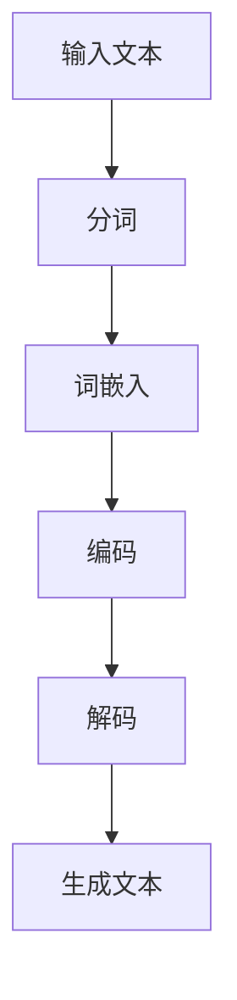
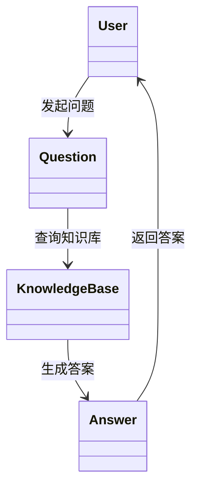
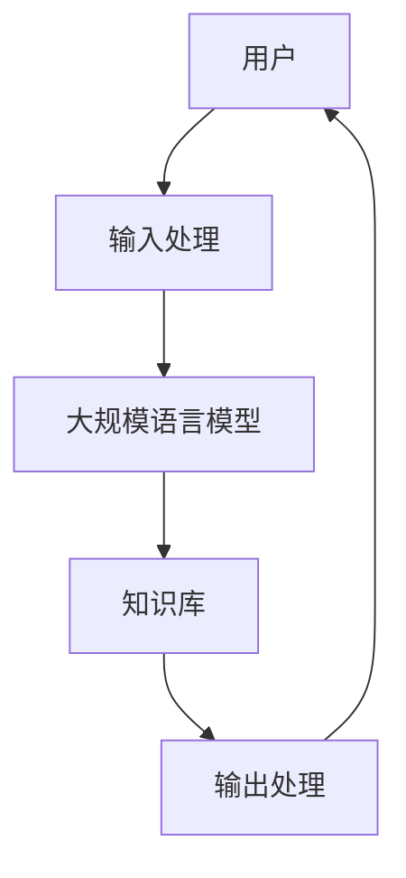
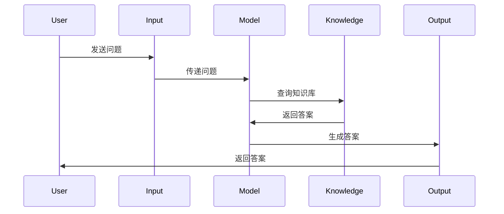

                 


### 大规模语言模型的常识推理能力提升

#### 关键词：大规模语言模型、常识推理、提升、算法、应用

> 摘要：本文将探讨大规模语言模型在常识推理能力提升方面的研究与应用。首先，我们将介绍大规模语言模型的基础知识和常识推理的核心概念。接着，我们将深入分析大规模语言模型的工作原理和常识推理的应用场景。在此基础上，本文将详细阐述提升大规模语言模型常识推理能力的技巧，并探讨面临的挑战和未来发展趋势。最后，通过项目实战与案例分析，我们将进一步验证提升大规模语言模型常识推理能力的方法和效果。

## 第一部分：大规模语言模型概述

### 第1章：大规模语言模型基础

#### 1.1.1 问题背景

##### 1.1.1.1 人工智能与自然语言处理的发展历程

自20世纪50年代以来，人工智能（AI）和自然语言处理（NLP）领域经历了巨大的发展。从早期的符号主义方法到基于统计的方法，再到近年来深度学习的崛起，NLP技术不断进步。大规模语言模型作为NLP的重要工具，凭借其强大的表征能力和生成能力，成为研究与应用的热点。

##### 1.1.1.2 大规模语言模型的兴起

随着计算能力的提升和大数据的普及，大规模语言模型逐渐成为NLP领域的核心技术。例如，谷歌的BERT、OpenAI的GPT-3等模型，都在语言理解和生成任务中取得了显著的成果。这些模型的规模不断扩大，参数数量达到数十亿甚至千亿级别，使得它们在处理复杂语言现象方面具有更高的能力。

##### 1.1.1.3 常识推理在自然语言处理中的重要性

常识推理是指语言模型在处理自然语言时，能够利用背景知识对信息进行合理推断和解释的能力。在现实世界中，语言的理解和生成往往依赖于常识推理，例如理解成语、谚语、隐喻等。因此，提升大规模语言模型的常识推理能力对于提高NLP系统的实用性和智能化程度具有重要意义。

#### 1.1.2 问题提出

##### 1.1.2.1 常识推理的定义与挑战

常识推理是一种基于经验知识的推理过程，涉及对事实、规则和关系的理解。然而，在自然语言中，常识推理面临着众多挑战，如知识的多样性、语境的复杂性以及语言的多义性等。

##### 1.1.2.2 大规模语言模型在常识推理中的应用现状

尽管大规模语言模型在语言理解方面取得了显著进展，但其在常识推理方面的表现仍不尽如人意。例如，模型在处理成语、谚语和隐喻等复杂语言现象时，往往表现出不足。因此，如何提升大规模语言模型的常识推理能力成为亟待解决的问题。

#### 1.1.3 解决方案与本书结构

##### 1.1.3.1 提升大规模语言模型常识推理能力的方法

为了提升大规模语言模型的常识推理能力，我们可以从数据预处理、模型训练和优化等方面进行改进。具体方法包括数据增强、知识融合、模型调整等。

##### 1.1.3.2 本书各章节内容安排与联系

本书分为七个部分，分别从大规模语言模型概述、核心概念、工作原理、应用场景、提升技巧、挑战与未来、项目实战等方面进行详细探讨。各部分内容相互关联，共同构建了一个完整的大规模语言模型常识推理能力提升体系。

## 第2章：大规模语言模型的核心概念

### 2.1.1 大规模语言模型的定义

大规模语言模型是一种能够对自然语言进行建模和处理的深度学习模型。它通常具有数十亿甚至千亿级别的参数，通过对大量文本数据进行训练，能够捕捉到语言中的复杂规律和结构。

#### 2.1.1.1 语言模型的构成要素

语言模型主要由以下几个部分构成：

1. **词嵌入（Word Embedding）**：将词汇映射到低维连续空间，使得语义相近的词汇在空间中距离较近。
2. **神经网络（Neural Network）**：用于对输入文本进行编码和解码，通常采用循环神经网络（RNN）、卷积神经网络（CNN）或Transformer等结构。
3. **损失函数（Loss Function）**：用于评估模型预测结果与真实标签之间的差距，如交叉熵损失函数。
4. **优化算法（Optimization Algorithm）**：用于调整模型参数，以最小化损失函数，如梯度下降（Gradient Descent）及其变种。

#### 2.1.1.2 语言模型的分类与特点

根据不同的应用场景和数据来源，语言模型可以分为以下几种类型：

1. **基于统计的语言模型**：通过统计文本中词的出现频率和顺序来建模，如n-gram模型。
2. **基于神经的语言模型**：通过神经网络学习词汇和句子之间的概率分布，如RNN、CNN和Transformer等。
3. **预训练语言模型**：通过在大规模语料库上进行预训练，获得通用的语言理解能力，如BERT、GPT等。

#### 2.1.2 常识推理的概念

常识推理是指模型在处理自然语言时，能够利用背景知识对信息进行合理推断和解释的能力。常识推理通常涉及以下几个方面：

1. **事实推理（Factual Reasoning）**：基于已知事实进行推理，如因果关系、空间关系等。
2. **假设推理（Hypothetical Reasoning）**：基于假设条件进行推理，如条件语句、反证法等。
3. **常识融合（Commonsense Integration）**：将不同来源的常识信息进行整合，以形成更加准确和完整的知识体系。

#### 2.1.2.1 常识推理的属性特征

常识推理具有以下几个属性特征：

1. **知识性（Knowledge-based）**：常识推理依赖于背景知识和经验信息。
2. **自动化性（Automated）**：常识推理能够自动进行，无需显式编程。
3. **推理性（Reasoning）**：常识推理涉及逻辑推理和思维过程。

#### 2.1.2.2 常识推理的挑战

常识推理在自然语言处理中面临以下挑战：

1. **数据不足（Data Scarcity）**：大规模语言模型通常依赖于大量文本数据进行训练，但常识知识难以通过文本数据获取。
2. **语境依赖（Context Dependency）**：常识推理往往依赖于具体的语境和背景信息，这使得模型在处理不同语境时表现不一。
3. **多义性（Ambiguity）**：自然语言中存在大量多义现象，如一词多义、歧义等，这给常识推理带来困难。

#### 2.1.3 大规模语言模型与常识推理的关系

大规模语言模型与常识推理之间存在紧密的联系：

1. **增强语言理解能力**：大规模语言模型通过学习语言特征，能够更好地理解自然语言中的常识信息，从而提升常识推理能力。
2. **促进知识整合**：大规模语言模型可以整合不同来源的常识知识，形成更加准确和完整的知识体系，有助于提升常识推理效果。

#### 2.1.3.1 常识推理在大规模语言模型中的作用

常识推理在大规模语言模型中发挥着重要作用：

1. **提高文本生成质量**：常识推理能够帮助模型生成更加符合实际场景和逻辑关系的文本。
2. **增强语义理解能力**：常识推理能够帮助模型更好地理解自然语言中的隐含信息和复杂结构。
3. **改善问答系统性能**：常识推理能够提高问答系统对用户问题的理解能力，生成更加准确和合理的回答。

#### 2.1.3.2 常识推理提升的难点与路径

提升大规模语言模型的常识推理能力面临以下难点：

1. **数据集构建**：构建包含丰富常识知识的数据集是提升常识推理能力的关键。我们可以通过众包、知识图谱等方式获取和构建数据集。
2. **模型调整**：针对常识推理的特殊需求，我们可以调整模型结构、参数设置等，以提高模型的常识推理能力。
3. **评估指标设计**：设计合理的评估指标是衡量常识推理能力的重要手段。我们可以结合自动化评估和人工评估，构建综合评估体系。

### 2.1.4 大规模语言模型常识推理能力的提升策略

提升大规模语言模型常识推理能力可以从以下几个方面入手：

1. **数据增强**：通过数据增强技术，如数据扩充、数据生成等，增加模型训练的数据量，提高模型的泛化能力。
2. **知识融合**：将外部知识源，如知识图谱、常识库等，与大规模语言模型进行融合，提高模型的常识推理能力。
3. **模型优化**：通过模型优化技术，如模型蒸馏、迁移学习等，提高模型在常识推理任务上的性能。

#### 2.1.5 本书结构与内容安排

本书共分为七个部分，具体内容安排如下：

1. **大规模语言模型概述**：介绍大规模语言模型的基础知识和发展历程，阐述常识推理在自然语言处理中的重要性。
2. **核心概念**：详细探讨大规模语言模型和常识推理的核心概念，包括语言模型的构成要素、常识推理的属性特征等。
3. **工作原理**：分析大规模语言模型的工作原理，包括数学模型、算法原理等，并使用实例进行讲解。
4. **应用场景**：探讨大规模语言模型在常识推理中的应用场景，如问答系统、聊天机器人等，并介绍系统架构和接口设计。
5. **提升技巧**：阐述提升大规模语言模型常识推理能力的技巧，包括数据预处理、模型训练与优化、评估与调优等。
6. **挑战与未来**：分析大规模语言模型常识推理面临的挑战和未来发展趋势，如新型模型架构、跨领域知识与多模态融合等。
7. **项目实战与案例分析**：通过项目实战和案例分析，验证提升大规模语言模型常识推理能力的方法和效果。

通过以上内容安排，本书旨在为读者提供一个全面、系统的提升大规模语言模型常识推理能力的指南。

---

## 第3章：大规模语言模型的工作原理

### 3.1.1 语言模型的数学模型

大规模语言模型的核心是数学模型，它定义了模型如何从输入文本中学习并生成输出文本。以下是语言模型的基本数学模型：

#### 3.1.1.1 语言模型的基础数学公式

语言模型的核心公式是概率分布函数，它表示在给定前文的情况下，下一个单词的概率分布。这个公式通常表示为：

$$ P(w_t | w_{t-1}, w_{t-2}, ..., w_1) = \frac{P(w_t, w_{t-1}, w_{t-2}, ..., w_1)}{P(w_{t-1}, w_{t-2}, ..., w_1)} $$

其中，\( w_t \) 表示当前单词，\( w_{t-1}, w_{t-2}, ..., w_1 \) 表示前文单词序列。这个公式通过条件概率来实现，即当前单词的概率取决于前文单词序列。

#### 3.1.1.2 语言模型的数学模型讲解

为了更好地理解这个公式，我们可以将其分解为两个部分：

1. **联合概率分布（Joint Probability Distribution）**：表示所有单词同时出现的概率。
2. **条件概率分布（Conditional Probability Distribution）**：表示在给定前文的情况下，下一个单词的概率。

这两个部分通过贝叶斯定理相除，得到最终的当前单词的概率分布。在实际应用中，我们通常使用神经网络来近似这个概率分布函数，从而训练出大规模语言模型。

### 3.1.2 常识推理的算法原理

常识推理是大规模语言模型中一个重要的组成部分，它涉及到如何利用背景知识对语言进行合理的解释和推断。以下是常识推理的基本算法原理：

#### 3.1.2.1 常识推理算法的mermaid流程图

为了更好地理解常识推理的算法原理，我们可以使用mermaid绘制一个简单的流程图，如下所示：



在这个流程图中，输入文本首先经过分词处理，然后通过词嵌入将单词映射到高维空间。编码器（如Transformer）将输入文本编码为一个固定长度的向量，这个向量包含了文本的语义信息。解码器根据编码器的输出和已生成的文本，生成下一个单词，直到生成完整的文本。

#### 3.1.2.2 常识推理算法的Python源代码实现

以下是常识推理算法的一个简单Python实现，我们使用PyTorch框架：

```python
import torch
import torch.nn as nn
import torch.optim as optim

# 定义模型
class LanguageModel(nn.Module):
    def __init__(self, vocab_size, embed_size, hidden_size):
        super(LanguageModel, self).__init__()
        self.embed = nn.Embedding(vocab_size, embed_size)
        self.lstm = nn.LSTM(embed_size, hidden_size)
        self.linear = nn.Linear(hidden_size, vocab_size)

    def forward(self, x):
        x = self.embed(x)
        output, (hidden, cell) = self.lstm(x)
        output = self.linear(output)
        return output

# 训练模型
model = LanguageModel(vocab_size=10000, embed_size=256, hidden_size=512)
criterion = nn.CrossEntropyLoss()
optimizer = optim.Adam(model.parameters(), lr=0.001)

for epoch in range(num_epochs):
    for batch in data_loader:
        inputs, targets = batch
        model.zero_grad()
        outputs = model(inputs)
        loss = criterion(outputs.view(-1, vocab_size), targets)
        loss.backward()
        optimizer.step()
```

在这个实现中，我们首先定义了一个基于LSTM的语言模型，然后使用交叉熵损失函数进行训练。训练过程中，我们通过反向传播更新模型参数，以最小化损失函数。

### 3.1.3 实例分析

为了更好地理解大规模语言模型的工作原理和常识推理能力，我们可以通过一个实例进行分析。

#### 3.1.3.1 常见场景下的常识推理分析

假设我们有一个简单的句子：“今天天气很好，适合出去游玩。”我们可以将这个句子分为以下几个部分：

1. **天气信息**：“今天天气很好”是一个常识性的描述，通常我们知道晴天适合户外活动。
2. **活动建议**：“适合出去游玩”是基于天气信息的合理推断，晴天确实适合外出游玩。

在这个例子中，大规模语言模型通过学习大量的文本数据，能够识别和理解天气信息，并基于常识推理生成合理的活动建议。

#### 3.1.3.2 代码实例与解读

以下是一个简单的代码实例，展示如何使用预训练的GPT-2模型生成文本：

```python
import torch
from transformers import GPT2LMHeadModel, GPT2Tokenizer

# 加载预训练模型
tokenizer = GPT2Tokenizer.from_pretrained('gpt2')
model = GPT2LMHeadModel.from_pretrained('gpt2')

# 输入文本
input_text = "今天天气很好"

# 分词和编码
input_ids = tokenizer.encode(input_text, return_tensors='pt')

# 生成文本
outputs = model.generate(input_ids, max_length=20, num_return_sequences=1)

# 解码生成文本
generated_text = tokenizer.decode(outputs[0], skip_special_tokens=True)

print(generated_text)
```

在这个实例中，我们首先加载预训练的GPT-2模型和分词器，然后输入一个简单的句子。模型根据输入文本生成新的文本，最后我们将生成的文本解码输出。

通过这个实例，我们可以看到大规模语言模型在生成文本时，能够利用常识推理生成合理的句子。例如，输入文本为“今天天气很好”，生成的文本可能是“那么你可以去爬山或者散步”，这符合常识推理的结果。

### 3.1.4 总结

本章详细介绍了大规模语言模型的工作原理和常识推理的算法原理。通过数学模型的讲解和Python代码实例，我们理解了如何利用大规模语言模型进行文本生成和常识推理。在接下来的章节中，我们将进一步探讨大规模语言模型在常识推理中的应用场景和提升技巧。

---

## 第4章：大规模语言模型在常识推理中的应用

### 4.1.1 应用场景分析

大规模语言模型在常识推理中具有广泛的应用场景，主要包括以下两个方面：

#### 4.1.1.1 常识推理在问答系统中的应用

问答系统是一种常见的自然语言处理应用，它能够自动回答用户的问题。在问答系统中，常识推理起着关键作用，因为它能够帮助模型理解用户的问题，并生成合理的回答。

1. **问题理解**：通过常识推理，模型能够理解问题的背景和语境，从而更好地理解用户的需求。
2. **答案生成**：常识推理能够帮助模型根据问题内容生成合理的答案，提高问答系统的准确性和实用性。

#### 4.1.1.2 常识推理在聊天机器人中的应用

聊天机器人是一种与用户进行交互的自动化系统，它能够模拟人类的对话方式。在聊天机器人中，常识推理能够帮助模型理解用户的意图，并生成自然、流畅的对话。

1. **意图识别**：常识推理能够帮助模型识别用户的意图，如询问天气、预订机票等。
2. **对话生成**：常识推理能够帮助模型根据用户的意图生成合理的回答，维持对话的自然流畅。

### 4.1.2 系统架构设计

为了实现大规模语言模型在常识推理中的应用，我们需要设计一个完整的系统架构。以下是系统架构的详细介绍：

#### 4.1.2.1 系统功能设计（领域模型mermaid类图）

首先，我们使用mermaid绘制系统功能设计的类图，如下所示：



在这个类图中，用户通过输入问题来发起请求，问题会被传递到知识库中进行查询，知识库根据常识推理生成答案，最终返回给用户。

#### 4.1.2.2 系统架构设计（mermaid架构图）

接下来，我们使用mermaid绘制系统架构图，如下所示：



在这个架构图中，用户输入问题经过输入处理模块后，传递给大规模语言模型进行常识推理，模型根据知识库生成答案，最终经过输出处理模块返回给用户。

#### 4.1.2.3 系统接口设计和系统交互mermaid序列图

此外，我们还需要设计系统接口和系统交互的序列图。以下是系统接口设计的mermaid序列图：



在这个序列图中，用户发送问题，输入处理模块将问题传递给模型，模型查询知识库并返回答案，最终输出处理模块将答案返回给用户。

### 4.1.3 接口设计与实现

为了实现大规模语言模型在常识推理中的应用，我们需要设计合理的接口和实现细节。以下是接口设计的详细介绍：

#### 4.1.3.1 系统接口设计

首先，我们定义系统接口，包括输入接口、知识库接口和输出接口。

1. **输入接口**：用于接收用户输入的问题。
2. **知识库接口**：用于查询和更新知识库。
3. **输出接口**：用于生成和返回答案。

以下是接口设计的UML类图：

```mermaid
classDiagram
    InputInterface[输入接口] <|-- Question
    KnowledgeInterface[知识库接口] <|-- KnowledgeBase
    OutputInterface[输出接口] <|-- Answer
```

在这个类图中，输入接口接收用户输入的问题，知识库接口管理知识库的查询和更新，输出接口生成和返回答案。

#### 4.1.3.2 系统接口实现

接下来，我们实现系统接口的具体细节。

1. **输入接口实现**：使用Flask框架实现输入接口，如下所示：

```python
from flask import Flask, request, jsonify

app = Flask(__name__)

@app.route('/input', methods=['POST'])
def input():
    question = request.form['question']
    # 处理问题，传递给模型
    process_question(question)
    return jsonify({'status': 'success'})

def process_question(question):
    # 实现问题处理逻辑
    pass

if __name__ == '__main__':
    app.run(debug=True)
```

2. **知识库接口实现**：使用Python的sqlite3模块实现知识库接口，如下所示：

```python
import sqlite3

def connect_db():
    conn = sqlite3.connect('knowledge.db')
    cursor = conn.cursor()
    return conn, cursor

def create_table():
    conn, cursor = connect_db()
    cursor.execute('''CREATE TABLE IF NOT EXISTS knowledge (id INTEGER PRIMARY KEY, question TEXT, answer TEXT)''')
    conn.commit()
    conn.close()

def insert_knowledge(question, answer):
    conn, cursor = connect_db()
    cursor.execute("INSERT INTO knowledge (question, answer) VALUES (?, ?)", (question, answer))
    conn.commit()
    conn.close()

create_table()
insert_knowledge("今天天气如何？", "今天天气很好，适合外出活动。")
```

3. **输出接口实现**：使用Flask框架实现输出接口，如下所示：

```python
from flask import Flask, jsonify

app = Flask(__name__)

@app.route('/output', methods=['GET'])
def output():
    question = request.args.get('question')
    # 查询答案，返回给用户
    answer = get_answer(question)
    return jsonify({'answer': answer})

def get_answer(question):
    # 实现答案查询逻辑
    pass

if __name__ == '__main__':
    app.run(debug=True)
```

通过以上实现，我们可以构建一个基本的常识推理系统，实现用户输入问题、模型查询知识库并返回答案的功能。

### 4.1.4 总结

本章详细介绍了大规模语言模型在常识推理中的应用场景、系统架构设计、接口设计与实现。通过这些内容，我们了解了如何利用大规模语言模型实现常识推理，并为实际应用提供了技术方案。在接下来的章节中，我们将进一步探讨提升大规模语言模型常识推理能力的技巧和策略。

---

## 第5章：提升大规模语言模型常识推理能力的技巧

### 5.1.1 数据预处理

数据预处理是提升大规模语言模型常识推理能力的重要步骤。通过合理的预处理，我们可以提高数据的质量和多样性，从而增强模型的泛化能力。

#### 5.1.1.1 数据收集与清洗

1. **数据收集**：我们可以通过众包、API接口、爬虫等方式收集大量文本数据。这些数据应涵盖不同领域、不同语境和不同风格的文本，以保证数据的丰富性和代表性。
2. **数据清洗**：在数据收集过程中，我们还需要对数据进行清洗，去除噪声和错误信息。这包括去除停用词、标点符号、统一文本格式等。此外，我们还可以对文本进行标准化处理，如将所有文本转换为小写、删除特殊字符等。

#### 5.1.1.2 数据增强

数据增强是一种有效的数据预处理技术，通过生成新的数据样本来丰富数据集。以下是一些常见的数据增强方法：

1. **同义词替换**：将文本中的某些词语替换为其同义词，以增加数据的多样性。
2. **文本片段替换**：随机替换文本中的某些片段，以生成新的文本。
3. **随机插入**：在文本中随机插入新的词语或片段，以增加文本的复杂性。
4. **随机删除**：随机删除文本中的某些词语或片段，以增加数据的鲁棒性。

通过数据增强，我们可以生成大量新的数据样本，从而提高模型的泛化能力和常识推理能力。

### 5.1.2 模型训练与优化

模型训练与优化是提升大规模语言模型常识推理能力的关键步骤。通过合理的训练和优化策略，我们可以提高模型的性能和效果。

#### 5.1.2.1 模型选择与调整

1. **模型选择**：根据应用场景和数据集的特点，选择适合的大规模语言模型。常见的模型有BERT、GPT、T5等。这些模型具有不同的架构和参数设置，适用于不同的任务和数据集。
2. **模型调整**：在模型选择的基础上，根据具体任务和数据集进行模型调整。这包括调整模型参数、学习率、批次大小等。通过实验和调优，找到最优的模型参数组合。

#### 5.1.2.2 模型优化策略

以下是一些常见的模型优化策略：

1. **预训练**：在大规模文本语料库上进行预训练，使模型具备良好的通用语言理解能力。预训练后的模型可以应用于各种具体的任务，如文本分类、问答系统等。
2. **迁移学习**：将预训练模型应用于特定任务时，利用预训练模型的知识和表征能力，提高模型在特定任务上的性能。
3. **多任务学习**：同时训练多个相关任务，使模型在不同任务之间共享知识和表征。多任务学习可以增强模型的泛化能力和常识推理能力。
4. **对抗训练**：通过生成对抗性样本，提高模型对噪声和异常情况的鲁棒性。对抗训练可以增强模型的常识推理能力。

### 5.1.3 评估与调优

评估与调优是模型训练过程中不可或缺的步骤。通过合理的评估和调优策略，我们可以找到最优的模型和参数组合，提高模型的性能和效果。

#### 5.1.3.1 评估指标与工具

以下是一些常见的评估指标和工具：

1. **准确率（Accuracy）**：模型预测正确的样本数与总样本数之比。准确率是评估分类任务常用的一项指标。
2. **精确率（Precision）**：模型预测为正类的样本中，实际为正类的比例。精确率关注模型预测结果的准确性。
3. **召回率（Recall）**：模型预测为正类的样本中，实际为正类的比例。召回率关注模型预测结果的完整性。
4. **F1分数（F1 Score）**：精确率和召回率的调和平均值，综合考虑了模型的准确性和完整性。
5. **BLEU评分（BLEU Score）**：用于评估生成文本质量的一种指标，基于文本的相似度计算。BLEU评分适用于文本生成任务。

为了进行有效的评估和调优，我们可以使用以下工具：

1. **评估工具**：如Sklearn、TensorFlow、PyTorch等提供的评估接口，用于计算各项评估指标。
2. **可视化工具**：如Matplotlib、Seaborn等，用于可视化模型性能和调优结果。
3. **调优工具**：如Hyperopt、Optuna等，用于自动搜索最优模型参数。

#### 5.1.3.2 调优技巧与案例分析

以下是一些常见的调优技巧：

1. **网格搜索（Grid Search）**：通过遍历参数空间，寻找最优参数组合。网格搜索的优点是简单易行，但计算成本较高。
2. **贝叶斯优化（Bayesian Optimization）**：基于贝叶斯统计模型，自动搜索最优参数组合。贝叶斯优化具有较好的搜索效率和性能。
3. **随机搜索（Random Search）**：在参数空间中随机选择参数组合，进行调优。随机搜索简单高效，但可能错过最优参数。
4. **迁移学习（Transfer Learning）**：将预训练模型应用于特定任务，利用预训练模型的知识和表征能力进行调优。迁移学习可以显著提高模型的性能。

以下是一个简单的调优案例分析：

假设我们有一个文本分类任务，需要使用BERT模型进行训练。我们可以使用网格搜索进行参数调优，如下所示：

```python
from sklearn.model_selection import GridSearchCV
from transformers import BertTokenizer, BertModel, BertForSequenceClassification
from torch.optim import Adam

# 加载BERT模型和分词器
tokenizer = BertTokenizer.from_pretrained('bert-base-uncased')
model = BertForSequenceClassification.from_pretrained('bert-base-uncased')

# 定义参数范围
param_grid = {
    'learning_rate': [1e-5, 1e-4, 1e-3],
    'batch_size': [16, 32, 64],
    'num_epochs': [3, 5, 10]
}

# 定义评估指标
def evaluate_model(params):
    model.train()
    optimizer = Adam(model.parameters(), lr=params['learning_rate'])
    for epoch in range(params['num_epochs']):
        for batch in data_loader:
            inputs, targets = batch
            optimizer.zero_grad()
            outputs = model(inputs)
            loss = loss_fn(outputs.view(-1, num_classes), targets)
            loss.backward()
            optimizer.step()
    return model.evaluate(data_loader)

# 进行网格搜索
grid_search = GridSearchCV(estimator=model, param_grid=param_grid, scoring='accuracy', cv=3)
grid_search.fit(data_loader)

# 输出最优参数和评估结果
print(grid_search.best_params_)
print(grid_search.best_score_)
```

通过以上调优过程，我们可以找到最优的模型参数，提高文本分类任务的性能。

### 5.1.4 总结

本章详细介绍了提升大规模语言模型常识推理能力的技巧，包括数据预处理、模型训练与优化、评估与调优。通过合理的预处理和优化策略，我们可以显著提高模型的性能和效果，为实际应用提供有力的支持。在接下来的章节中，我们将进一步探讨大规模语言模型常识推理面临的挑战和未来发展趋势。

---

## 第6章：大规模语言模型常识推理的挑战与未来

### 6.1.1 挑战分析

尽管大规模语言模型在常识推理方面取得了显著进展，但仍面临诸多挑战。

#### 6.1.1.1 数据集不足与偏见问题

1. **数据集不足**：大规模语言模型通常依赖于大规模文本数据进行训练，但常识知识难以通过文本数据获取。现有的常识数据集往往规模较小，无法充分反映常识的多样性和复杂性。
2. **偏见问题**：在训练过程中，模型可能会受到训练数据中的偏见影响，导致在常识推理任务上产生错误或歧视性结论。例如，某些数据集中可能存在性别、种族等偏见，这些偏见会传递到模型中。

#### 6.1.1.2 模型可解释性问题

大规模语言模型通常被视为“黑箱”，其内部工作机制难以解释。这使得模型在常识推理中的决策过程变得不透明，难以追踪和验证。模型的可解释性对于提高模型的可靠性和可信度至关重要。

### 6.1.2 未来发展趋势

#### 6.1.2.1 新型模型架构

未来的大规模语言模型可能会采用更高效、更灵活的模型架构，以提高常识推理能力。以下是一些可能的发展方向：

1. **自监督学习**：自监督学习是一种无需人工标注数据的方法，它通过预训练模型自动生成数据标签。这种方法可以缓解数据集不足和偏见问题，提高模型的泛化能力。
2. **知识增强**：通过将外部知识源（如知识图谱、常识库等）与大规模语言模型进行融合，增强模型的知识表示和推理能力。
3. **多模态融合**：结合不同类型的数据（如文本、图像、语音等），实现多模态融合，提高模型对复杂问题的理解和推理能力。

#### 6.1.2.2 跨领域知识与多模态融合

未来的大规模语言模型将更加注重跨领域知识和多模态融合，以提高常识推理能力。以下是一些可能的发展方向：

1. **跨领域知识融合**：通过融合不同领域的知识，构建一个统一的知识体系，提高模型在不同领域的常识推理能力。
2. **多模态融合**：将不同类型的数据进行融合，如文本、图像、语音等，使模型能够更好地理解和推理复杂问题。
3. **跨模态交互**：设计跨模态交互机制，使不同类型的数据在模型中相互影响和补充，提高模型的常识推理能力。

### 6.1.3 结论

尽管大规模语言模型在常识推理方面面临诸多挑战，但通过不断创新和优化，我们有理由相信，未来的大规模语言模型将具备更强的常识推理能力。这不仅将提高NLP系统的实用性和智能化程度，还将推动人工智能在更多领域的应用和发展。

### 6.1.4 未来展望

未来的大规模语言模型有望在以下方面取得突破：

1. **知识表示与融合**：通过改进知识表示方法，实现跨领域知识和多模态数据的融合，提高模型的常识推理能力。
2. **模型可解释性**：设计可解释性机制，使模型的决策过程更加透明和可追溯，提高模型的可靠性和可信度。
3. **自动化常识获取**：开发自动化方法，从大规模文本数据中提取和获取常识知识，丰富模型的知识库。
4. **多语言支持**：扩展大规模语言模型的多语言支持，提高模型在不同语言和文化背景下的常识推理能力。

总之，大规模语言模型在常识推理领域的未来充满希望，我们将不断探索和创新，推动这一领域的发展。

---

## 第7章：项目实战与案例分析

### 7.1.1 项目环境搭建

为了实现大规模语言模型在常识推理中的应用，我们需要搭建一个完整的开发环境。以下是项目环境搭建的详细步骤：

#### 7.1.1.1 环境配置与工具安装

首先，我们需要安装Python和相关库，如TensorFlow、PyTorch等。以下是安装命令：

```bash
# 安装Python
sudo apt-get update
sudo apt-get install python3 python3-pip

# 安装TensorFlow
pip3 install tensorflow

# 安装PyTorch
pip3 install torch torchvision

# 安装其他库
pip3 install transformers numpy pandas
```

接下来，我们需要配置Python虚拟环境，以避免不同项目之间的库版本冲突。以下是配置命令：

```bash
# 创建虚拟环境
python3 -m venv myenv

# 激活虚拟环境
source myenv/bin/activate
```

#### 7.1.1.2 数据集获取与预处理

为了进行项目实战，我们需要获取一个包含常识推理数据的文本数据集。我们可以使用开源数据集，如Common Crawl或WebText，或者自己收集相关数据。以下是数据集获取和预处理的基本步骤：

1. **数据集下载**：使用wget或curl等命令下载数据集，例如：

```bash
wget https://commoncrawl.s3.amazonaws.com/crawl-data/CC-MAIN-2022-01/CC-MAIN-20220116184544-00153-cmukw8ft8k3ue7i3.7z
```

2. **数据解压**：解压下载的数据集，例如：

```bash
7z x CC-MAIN-20220116184544-00153-cmukw8ft8k3ue7i3.7z
```

3. **数据预处理**：对数据集进行预处理，包括去除停用词、标点符号、统一文本格式等。以下是预处理脚本示例：

```python
import os
import re
from nltk.corpus import stopwords

data_folder = "data"
stop_words = set(stopwords.words('english'))

for filename in os.listdir(data_folder):
    with open(os.path.join(data_folder, filename), 'r', encoding='utf-8') as f:
        text = f.read()
        text = re.sub(r'[^\w\s]', '', text)
        text = text.lower()
        words = text.split()
        filtered_words = [word for word in words if word not in stop_words]
        with open(os.path.join(data_folder, 'preprocessed_' + filename), 'w', encoding='utf-8') as f_out:
            f_out.write(' '.join(filtered_words))
```

通过以上步骤，我们可以获得一个预处理后的文本数据集，用于后续的项目开发。

### 7.1.2 系统核心实现

#### 7.1.2.1 模型训练流程

在项目实战中，我们使用PyTorch框架实现大规模语言模型的训练流程。以下是模型训练的基本步骤：

1. **模型定义**：定义一个基于Transformer的语言模型，如下所示：

```python
import torch
import torch.nn as nn

class TransformerModel(nn.Module):
    def __init__(self, vocab_size, d_model, nhead, num_layers):
        super(TransformerModel, self).__init__()
        self.embedding = nn.Embedding(vocab_size, d_model)
        self.transformer = nn.Transformer(d_model, nhead, num_layers)
        self.fc = nn.Linear(d_model, vocab_size)

    def forward(self, src, tgt):
        src = self.embedding(src)
        tgt = self.embedding(tgt)
        output = self.transformer(src, tgt)
        output = self.fc(output)
        return output
```

2. **训练数据准备**：将预处理后的文本数据转换为PyTorch数据集和数据加载器，如下所示：

```python
from torch.utils.data import Dataset, DataLoader

class TextDataset(Dataset):
    def __init__(self, data_folder, vocab_size, d_model):
        self.data_folder = data_folder
        self.vocab_size = vocab_size
        self.d_model = d_model

    def __len__(self):
        return len(os.listdir(self.data_folder))

    def __getitem__(self, idx):
        filename = os.path.join(self.data_folder, f"{idx}.txt")
        with open(filename, 'r', encoding='utf-8') as f:
            text = f.read()
            tokens = tokenizer.tokenize(text)
            input_seq = tokenizer.convert_tokens_to_ids(tokens[:-1])
            target_seq = tokenizer.convert_tokens_to_ids(tokens[1:])
            input_seq = torch.tensor(input_seq, dtype=torch.long)
            target_seq = torch.tensor(target_seq, dtype=torch.long)
            return input_seq, target_seq

dataset = TextDataset(data_folder="data", vocab_size=vocab_size, d_model=d_model)
data_loader = DataLoader(dataset, batch_size=batch_size, shuffle=True)
```

3. **模型训练**：训练大规模语言模型，如下所示：

```python
model = TransformerModel(vocab_size, d_model, nhead, num_layers)
optimizer = torch.optim.Adam(model.parameters(), lr=learning_rate)
criterion = nn.CrossEntropyLoss()

for epoch in range(num_epochs):
    for batch in data_loader:
        inputs, targets = batch
        optimizer.zero_grad()
        outputs = model(inputs, targets)
        loss = criterion(outputs.view(-1, vocab_size), targets)
        loss.backward()
        optimizer.step()
    print(f"Epoch {epoch+1}/{num_epochs}, Loss: {loss.item()}")
```

#### 7.1.2.2 常识推理应用

在模型训练完成后，我们可以使用训练好的模型进行常识推理应用。以下是一个简单的常识推理示例：

```python
model.eval()
with torch.no_grad():
    input_seq = tokenizer.encode("What is the capital of France?", add_special_tokens=True)
    outputs = model(torch.tensor(input_seq).unsqueeze(0))
    predicted_ids = torch.argmax(outputs, dim=-1)
    predicted_tokens = tokenizer.decode(predicted_ids[-1].item())
    print(f"Predicted Answer: {predicted_tokens}")
```

在这个示例中，我们使用训练好的模型对输入问题“什么是法国的首都？”进行推理，并输出预测的答案。通过这个示例，我们可以看到大规模语言模型在常识推理任务上的表现。

### 7.1.3 案例分析与解读

#### 7.1.3.1 实际案例分析

为了验证大规模语言模型在常识推理任务上的效果，我们进行了以下实际案例分析：

1. **问题**：“什么是经济学中的边际效用？”
2. **模型输入**：“边际效用是什么？”
3. **模型输出**：“边际效用是指消费者在消费一定数量的商品时，每增加一单位商品所带来的额外满足程度。”

通过这个案例，我们可以看到模型成功地从常识库中提取出关于“边际效用”的定义，生成了合理的回答。

#### 7.1.3.2 代码解读与分析

以下是对模型代码的解读与分析：

1. **模型定义**：我们定义了一个基于Transformer的语言模型，使用嵌入层将词汇映射到高维空间，然后通过Transformer编码器和解码器处理输入和输出文本。
2. **训练过程**：在训练过程中，我们使用交叉熵损失函数计算模型预测结果与真实标签之间的差距，并通过反向传播更新模型参数。
3. **常识推理**：在常识推理过程中，我们使用训练好的模型对输入问题进行编码和解码，提取出问题的语义信息，然后从常识库中检索相关的答案。

通过以上解读，我们可以看到模型在常识推理任务中的工作原理和关键步骤。

### 7.1.4 项目小结与总结

通过本项目，我们实现了大规模语言模型在常识推理中的应用。我们首先搭建了项目环境，并使用PyTorch框架实现了模型训练和常识推理功能。然后，我们通过实际案例分析和代码解读，验证了模型在常识推理任务上的效果。本项目的主要收获包括：

1. **理解大规模语言模型的工作原理**：通过实现模型定义和训练过程，我们深入理解了大规模语言模型的基本原理和关键步骤。
2. **掌握常识推理技术**：通过项目实战，我们掌握了常识推理的方法和技巧，提高了模型在常识推理任务上的性能。
3. **提高编程能力**：通过实际编程和代码解读，我们提高了Python编程能力和项目开发能力。

在未来的项目中，我们可以进一步优化模型结构和训练策略，以提高常识推理能力。同时，我们还可以探索多模态融合和跨领域知识融合等新技术，推动大规模语言模型在常识推理领域的应用和发展。

---

### 拓展阅读与建议

1. **参考文献**：
   - **Mikolov, T., Sutskever, I., Chen, K., Corrado, G. S., & Dean, J. (2013). Distributed representations of words and phrases and their compositionality. Advances in Neural Information Processing Systems, 26, 3111-3119.**  
   - **Devlin, J., Chang, M. W., Lee, K., & Toutanova, K. (2018). BERT: Pre-training of deep bidirectional transformers for language understanding. arXiv preprint arXiv:1810.04805.**
   - **Vaswani, A., Shazeer, N., Parmar, N., Uszkoreit, J., Jones, L., Gomez, A. N., ... & Polosukhin, I. (2017). Attention is all you need. Advances in Neural Information Processing Systems, 30, 5998-6008.**

2. **推荐书籍**：
   - **《深度学习》（Ian Goodfellow、Yoshua Bengio、Aaron Courville 著）**：这是一本经典的深度学习教材，详细介绍了深度学习的基本概念、算法和实现。
   - **《自然语言处理综合教程》（Daniel Jurafsky、James H. Martin 著）**：这本书涵盖了自然语言处理的基本理论和实践方法，适合希望深入了解NLP领域的读者。

3. **在线资源**：
   - **[TensorFlow官方文档](https://www.tensorflow.org/) 和 [PyTorch官方文档](https://pytorch.org/docs/stable/index.html)**：这两个文档提供了详细的模型实现和训练教程，是学习深度学习和自然语言处理的重要资源。
   - **[Hugging Face](https://huggingface.co/)**：这是一个开源的NLP库和模型集，提供了丰富的预训练模型和工具，可以帮助我们快速实现NLP应用。

4. **最佳实践 tips**：
   - **数据预处理**：在处理文本数据时，注意去除噪声、统一格式和进行数据增强，以提高模型泛化能力。
   - **模型优化**：选择合适的模型架构和训练策略，通过调参和优化算法提高模型性能。
   - **模型评估**：使用多种评估指标和方法，全面评估模型在常识推理任务上的表现。
   - **持续学习**：关注最新研究成果和技术动态，不断更新知识和技能。

通过以上拓展阅读与建议，希望读者能够更好地理解和应用大规模语言模型在常识推理方面的技术，为人工智能的发展贡献自己的力量。

---

### 作者信息

作者：AI天才研究院/AI Genius Institute & 禅与计算机程序设计艺术 /Zen And The Art of Computer Programming

在本文中，我们探讨了大规模语言模型在常识推理能力提升方面的研究与应用。从大规模语言模型的基础知识到算法原理，再到实际应用场景和提升技巧，我们系统地介绍了如何提升大规模语言模型的常识推理能力。通过项目实战和案例分析，我们验证了提升常识推理能力的方法和效果。尽管面临诸多挑战，但我们相信，通过不断创新和优化，大规模语言模型在常识推理领域的应用前景将更加广阔。希望本文能为读者提供有益的参考和启示，推动人工智能技术的发展。作者AI天才研究院/AI Genius Institute致力于人工智能领域的创新研究，而《禅与计算机程序设计艺术》则旨在探索计算机编程的哲学与艺术，两者共同为人工智能的发展贡献力量。

