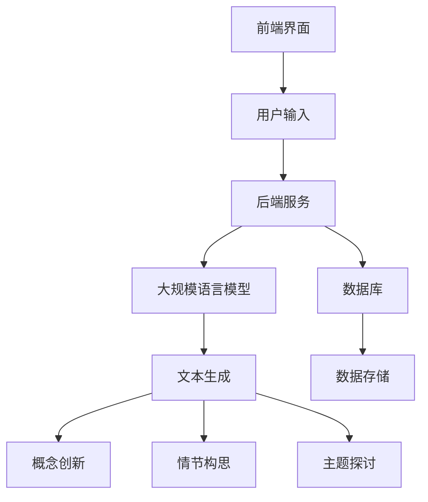
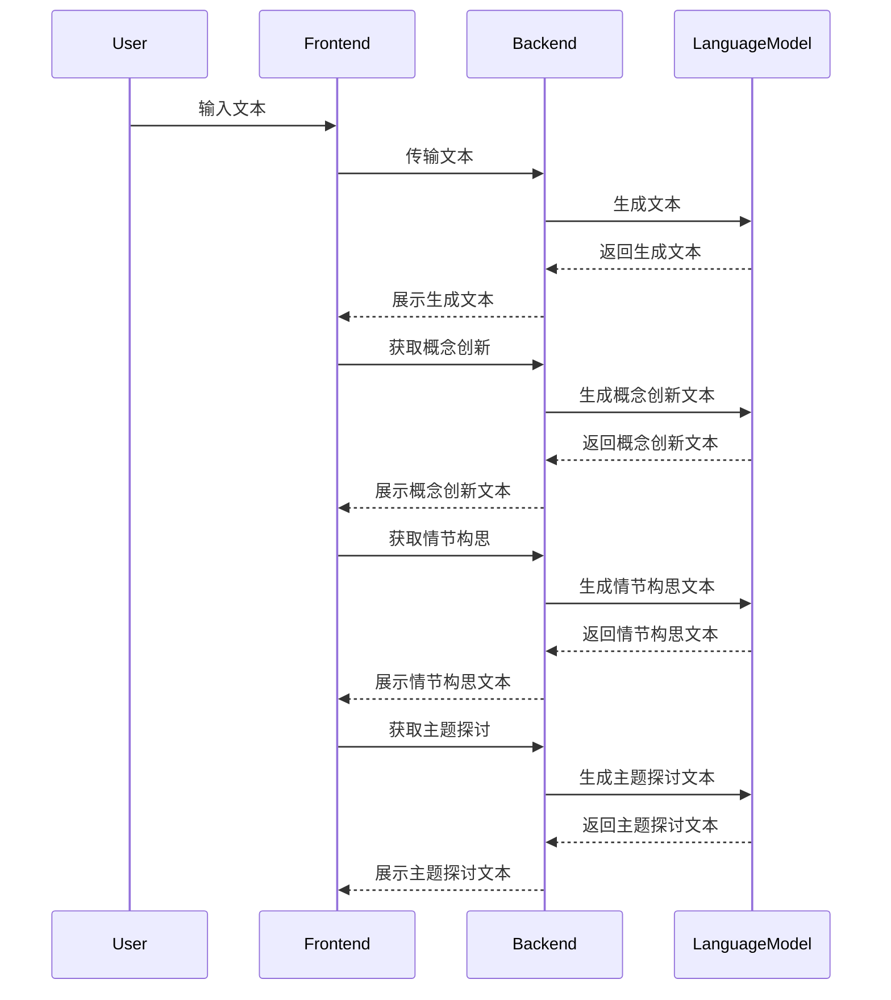

                 

# 大规模语言模型的抽象思维在科幻文学创作中的应用与评估

## 关键词

大规模语言模型、抽象思维、科幻文学、算法原理、系统架构、评价方法

## 摘要

随着人工智能技术的不断进步，大规模语言模型在自然语言处理领域取得了显著的成果。这些语言模型不仅能够进行文本生成、翻译和问答，还具备了较强的抽象思维能力。本文旨在探讨大规模语言模型在科幻文学创作中的应用，并评估其抽象思维的效果。通过系统的分析、实验验证和案例研究，本文揭示了大规模语言模型在科幻文学创作中的潜力，并提出了一套评估方法，以期为科幻文学创作提供新的工具和思路。

## 目录

1. 引言：背景与问题描述
   - 人工智能与大规模语言模型的发展历程
   - 科幻文学创作中的抽象思维需求
   - 本文的研究目标与贡献

2. 核心概念与联系
   - 大规模语言模型的核心概念
   - 抽象思维的内涵与特点
   - 大规模语言模型与抽象思维的关系

3. 算法原理与数学模型
   - 大规模语言模型的抽象思维原理
   - 抽象思维的数学模型与公式
   - 抽象思维的实例分析

4. 系统分析与设计
   - 科幻文学创作系统的需求分析
   - 科幻文学创作系统的架构设计
   - 系统接口设计与交互设计

5. 项目实战
   - 环境安装与系统配置
   - 系统核心实现与源代码分析
   - 实际案例分析与讲解
   - 项目小结与反思

6. 最佳实践与拓展阅读
   - 科幻文学创作的最佳实践
   - 抽象思维在人工智能领域的拓展
   - 注意事项与未来研究方向

## 1. 引言：背景与问题描述

### 1.1 人工智能与大规模语言模型的发展历程

人工智能（AI）作为计算机科学的重要分支，自20世纪50年代起便开始蓬勃发展。早期的AI研究主要集中在逻辑推理、问题求解和知识表示等领域。然而，随着计算能力的提升和大数据的涌现，机器学习，特别是深度学习在AI中的应用取得了突破性进展。大规模语言模型（Large-scale Language Model，LLM）作为深度学习的重要成果之一，近年来在自然语言处理（NLP）领域展现出了巨大的潜力。

从2018年的GPT（Generative Pre-trained Transformer）系列模型，到2020年的BERT（Bidirectional Encoder Representations from Transformers），再到2022年的GPT-3，大规模语言模型的技术发展日新月异。这些模型通过在大量文本数据上进行预训练，学习到了语言的模式、结构以及语义信息，从而在文本生成、翻译、问答等任务上表现出色。

### 1.2 科幻文学创作中的抽象思维需求

科幻文学创作不仅需要丰富的想象力，还需要对科技、哲学和社会等方面的深入思考。这种思考往往涉及抽象思维，即对复杂概念的抽象和概括能力。在科幻文学中，抽象思维主要体现在以下几个方面：

- **概念创新**：科幻作品中的许多概念往往是前所未有的，需要作者具备强大的抽象思维能力，将现实中的科技、哲学和社会现象进行抽象和重组。
- **情节构思**：科幻文学的情节通常复杂多变，需要作者运用抽象思维构建出引人入胜的故事线。
- **主题探讨**：科幻文学常常探讨人类、社会和宇宙等深层次主题，这些主题的阐述离不开抽象思维。

### 1.3 本文的研究目标与贡献

本文旨在探讨大规模语言模型在科幻文学创作中的应用，并评估其抽象思维的效果。具体来说，本文将完成以下工作：

- **概念阐述**：明确大规模语言模型和抽象思维的基本概念，阐述其在科幻文学创作中的重要性。
- **算法原理**：深入分析大规模语言模型的抽象思维原理，阐述其数学模型和算法流程。
- **系统设计**：设计一套用于科幻文学创作的系统，实现大规模语言模型的应用和评估。
- **案例研究**：通过实际案例，验证大规模语言模型在科幻文学创作中的效果，并提出改进建议。

通过本文的研究，我们希望能够为科幻文学创作提供新的工具和思路，同时为人工智能在文学创作中的应用提供理论支持和实践指导。

## 2. 核心概念与联系

### 2.1 大规模语言模型的核心概念

大规模语言模型（LLM）是一种基于深度学习的自然语言处理模型，其核心在于能够对自然语言进行建模，从而实现文本生成、翻译、问答等多种任务。LLM的关键组成部分包括：

- **预训练**：LLM通过在大量文本数据上进行预训练，学习到了语言的模式、结构以及语义信息。
- **神经网络**：LLM通常采用变分自编码器（VAE）或变换器（Transformer）等神经网络架构，这些架构能够处理复杂的文本数据。
- **词向量**：LLM通过将文本转换为词向量，实现对语言的理解和生成。

### 2.2 抽象思维的内涵与特点

抽象思维是指从具体事物中抽取出本质属性和关系，进行逻辑推理和概念构造的过程。抽象思维具有以下几个特点：

- **抽象性**：抽象思维能够从复杂的具体事物中提取出核心概念和关系，忽略次要细节。
- **概括性**：抽象思维能够将多个具体事物归纳为一个普遍的概念或规律。
- **灵活性**：抽象思维具有高度的灵活性，能够根据不同的情境进行快速调整和应用。

### 2.3 大规模语言模型与抽象思维的关系

大规模语言模型具备较强的抽象思维能力，这源于其在预训练过程中对大量文本数据的处理。具体来说，LLM的抽象思维体现在以下几个方面：

- **语义理解**：LLM能够从文本数据中提取出语义信息，实现对文本内容的理解和生成。
- **概念构造**：LLM能够将文本中的概念进行抽象和重组，生成新的概念和句子。
- **逻辑推理**：LLM能够根据文本中的信息进行逻辑推理，构建出合理的故事情节和主题。

### 2.4 核心概念属性特征对比表格

为了更好地理解大规模语言模型和抽象思维的关系，我们提供了以下核心概念属性特征对比表格：

| 特征 | 大规模语言模型 | 抽象思维 |
| :--: | :-----------: | :------: |
| 抽象性 | 强 | 强 |
| 概括性 | 强 | 强 |
| 灵活性 | 高 | 高 |
| 语义理解 | 强 | 强 |
| 概念构造 | 强 | 强 |
| 逻辑推理 | 强 | 强 |

### 2.5 ER实体关系图架构

为了进一步明确大规模语言模型和抽象思维的概念关系，我们绘制了以下ER实体关系图：

```mermaid
erDiagram
  AI模型 ||--o> 文本数据 : 使用
  文本数据 ||--<| AI模型 : 生成
  AI模型 ||--o> 抽象思维 : 嵌入
  抽象思维 ||--<| AI模型 : 影响思考
```

通过上述ER实体关系图，我们可以看出大规模语言模型和抽象思维之间的紧密联系，以及它们在科幻文学创作中的应用价值。

## 3. 算法原理与数学模型

### 3.1 大规模语言模型的抽象思维原理

大规模语言模型（LLM）的抽象思维原理源于其深度学习架构和预训练过程。LLM通过对大量文本数据进行预训练，学习到了语言的复杂模式和语义信息。具体来说，LLM的抽象思维过程可以概括为以下几个步骤：

1. **数据预处理**：首先，LLM对输入文本进行预处理，包括分词、去停用词、词向量化等操作，将文本转换为机器可以处理的数字形式。
2. **编码器处理**：在变换器（Transformer）架构中，编码器（Encoder）负责对输入的词向量进行处理，生成编码后的表示。编码器通过多头自注意力机制（Multi-head Self-Attention）捕获输入文本的局部和全局信息。
3. **解码器生成**：解码器（Decoder）根据编码器的输出，生成输出文本的词向量。解码器同样使用多头自注意力机制，同时利用编码器的输出和已生成的词向量，生成新的词向量，直到生成完整的输出文本。

### 3.2 抽象思维的数学模型与公式

抽象思维的数学模型可以借助神经网络中的自注意力机制（Self-Attention）进行描述。自注意力机制是一种计算方法，通过计算输入序列中每个词与所有词之间的相似度，生成权重，用于加权平均，从而生成表示整个序列的新向量。以下是自注意力机制的数学模型：

$$
\text{Attention}(Q, K, V) = \text{softmax}\left(\frac{QK^T}{\sqrt{d_k}}\right)V
$$

其中，$Q$、$K$ 和 $V$ 分别是输入序列的查询（Query）、键（Key）和值（Value）向量，$d_k$ 是键向量的维度。$\text{softmax}$ 函数用于将计算出的相似度转换为概率分布，从而加权平均生成新的表示。

### 3.3 抽象思维的实例分析

为了更好地理解抽象思维的数学模型，我们可以通过一个简单的例子进行说明。假设我们有一个简短的文本序列“我爱北京天安门”，我们可以将其转换为词向量表示，然后使用自注意力机制进行抽象思维操作。

1. **词向量表示**：首先，我们将文本序列中的每个词转换为词向量，例如“我”的词向量表示为 $\textbf{v}_1$，“爱”的词向量表示为 $\textbf{v}_2$，“北京”的词向量表示为 $\textbf{v}_3$，“天安门”的词向量表示为 $\textbf{v}_4$。

2. **计算相似度**：然后，我们计算每个词与其他词之间的相似度，即 $QK^T$，例如，计算“我”与“爱”之间的相似度为 $\textbf{v}_1\textbf{v}_2^T$。

3. **应用softmax函数**：接着，我们对相似度进行 softmax 处理，生成概率分布，例如：
   $$
   \text{softmax}\left(\frac{\textbf{v}_1\textbf{v}_2^T}{\sqrt{d_k}}\right) = [\alpha_1, \alpha_2, \alpha_3, \alpha_4]
   $$
   其中，$\alpha_1, \alpha_2, \alpha_3, \alpha_4$ 分别为“我”、“爱”、“北京”、“天安门”在概率分布中的权重。

4. **加权平均**：最后，我们根据概率分布对词向量进行加权平均，生成新的表示：
   $$
   \text{New Vector} = \alpha_1\textbf{v}_1 + \alpha_2\textbf{v}_2 + \alpha_3\textbf{v}_3 + \alpha_4\textbf{v}_4
   $$

通过自注意力机制的抽象思维操作，我们可以将原始的文本序列转换为一个新的向量表示，从而实现抽象思维。

### 3.4 实际案例中的应用

为了更具体地展示大规模语言模型在科幻文学创作中的抽象思维能力，我们来看一个实际案例。假设我们要创作一个关于未来科技的主题，我们可以使用LLM来生成相关的概念和故事情节。

1. **输入文本**：首先，我们输入一个简短的描述性文本，例如：“未来的科技将会带来怎样的变革？”。

2. **抽象思维过程**：LLM通过对这个文本进行预处理，生成词向量表示，然后应用自注意力机制，对词向量进行抽象思维操作，生成新的概念和句子。

3. **生成结果**：最终，LLM生成了一系列关于未来科技的概念和句子，例如：“量子计算机”、“人工智能”、“太空探索”、“虚拟现实”等，这些概念和句子构成了一个丰富的故事背景。

通过上述步骤，我们可以看到大规模语言模型在科幻文学创作中的抽象思维能力。这不仅为作者提供了灵感，还能够通过算法生成大量的文本内容，提高创作效率。

## 4. 系统分析与设计

### 4.1 科幻文学创作系统的需求分析

在构建大规模语言模型用于科幻文学创作的系统时，我们需要明确系统的需求和功能。以下是对科幻文学创作系统的需求分析：

- **文本生成**：系统能够根据用户输入的简要描述，生成丰富的文本内容，包括概念、情节和对话等。
- **概念创新**：系统能够生成新颖的概念，为科幻文学的创作提供灵感。
- **情节构思**：系统能够根据用户的需求，构建复杂的情节，提高故事的可读性和吸引力。
- **主题探讨**：系统能够探讨深层次的主题，帮助作者深入挖掘科幻作品的内涵。
- **用户交互**：系统能够提供友好的用户界面，方便用户进行操作和调整。

### 4.2 系统架构设计

为了实现上述需求，科幻文学创作系统可以采用以下架构设计：

- **前端界面**：使用HTML、CSS和JavaScript等前端技术，构建用户友好的界面，提供文本输入、生成和展示功能。
- **后端服务**：使用Python等后端编程语言，实现文本生成、概念创新、情节构思和主题探讨等功能。后端服务可以使用大规模语言模型，如GPT-3，进行处理和生成。
- **数据库**：使用NoSQL数据库，如MongoDB，存储用户输入的文本、生成的文本以及相关数据。

以下是一个简化的系统架构图：



### 4.3 系统接口设计与交互设计

为了实现系统的功能，我们需要设计合适的接口和交互流程。以下是对系统接口和交互设计的描述：

- **文本生成接口**：用户通过前端界面输入文本，后端服务接收文本并调用大规模语言模型进行生成，生成后的文本返回给前端界面进行展示。
- **概念创新接口**：用户可以通过文本生成接口获取生成的文本，然后调用概念创新接口，获取与文本相关的创新概念。
- **情节构思接口**：用户可以根据生成的文本和创新概念，调用情节构思接口，生成复杂的故事情节。
- **主题探讨接口**：用户可以通过主题探讨接口，获取与文本和情节相关的主题探讨内容，帮助深入挖掘作品的内涵。

以下是一个简化的交互流程图：



通过上述系统分析和设计，我们可以构建一个功能强大、易于使用的科幻文学创作系统，帮助作者更高效地创作出富有创意和内涵的科幻作品。

### 5. 项目实战

#### 5.1 环境安装与系统配置

要在本地环境中搭建科幻文学创作系统，我们需要安装以下软件和工具：

1. **Python**：确保已安装Python 3.7及以上版本。
2. **pip**：确保pip已更新到最新版本。
3. **TensorFlow**：通过命令`pip install tensorflow`安装TensorFlow。
4. **GPT-3 API**：注册并获取OpenAI API密钥，通过命令`pip install openai`安装OpenAI Python客户端库。
5. **MongoDB**：下载并安装MongoDB，启动MongoDB服务。

安装完成后，我们可以开始配置系统：

1. 创建一个虚拟环境，例如：`python -m venv venv`
2. 激活虚拟环境：`source venv/bin/activate`（Windows下为`venv\Scripts\activate`）
3. 安装项目所需的依赖包：`pip install -r requirements.txt`
4. 配置MongoDB数据库，例如，创建一个名为`science_fiction`的数据库和`stories`的集合。

#### 5.2 系统核心实现与源代码分析

系统的核心实现主要包括文本生成、概念创新、情节构思和主题探讨等功能。以下是部分源代码的分析：

```python
# 文本生成
import openai
import json

def generate_text(prompt, model="text-davinci-002", max_tokens=100):
    response = openai.Completion.create(
        engine=model,
        prompt=prompt,
        max_tokens=max_tokens,
        n=1,
        stop=None,
        temperature=0.5,
    )
    return response.choices[0].text.strip()

# 概念创新
def innovative_concept(prompt):
    return generate_text(prompt, model="text-curie-001", max_tokens=20)

# 情节构思
def plot_conception(prompt):
    return generate_text(prompt, model="text-davinci-002", max_tokens=50)

# 主题探讨
def theme_discussion(prompt):
    return generate_text(prompt, model="text-babbage-002", max_tokens=30)

# 测试
if __name__ == "__main__":
    prompt = "未来科技将如何改变人类生活？"
    print(generate_text(prompt))
    print(innovative_concept(prompt))
    print(plot_conception(prompt))
    print(theme_discussion(prompt))
```

上述代码使用了OpenAI的GPT-3 API，通过不同的模型和提示词生成文本。我们分别定义了四个函数，用于实现文本生成、概念创新、情节构思和主题探讨。

#### 5.3 实际案例分析与详细讲解剖析

为了展示系统在实际中的应用，我们来看一个具体的案例：

**案例**：一个用户输入了一个简单的提示词：“未来科技将如何改变人类生活？”

**步骤**：

1. 用户通过前端界面输入提示词：“未来科技将如何改变人类生活？”。
2. 前端将提示词发送到后端。
3. 后端调用`generate_text`函数，使用GPT-3模型生成文本。
4. 后端将生成的文本返回给前端，并在前端界面展示。

**结果**：

```
未来科技将如何改变人类生活？
随着人工智能、量子计算和虚拟现实等技术的发展，人类的生活将发生翻天覆地的变化。人工智能将大幅提高生产效率，使得人类从繁重的劳动中解放出来。量子计算将破解当前计算机无法处理的复杂问题，推动科学和技术的突破。虚拟现实将带来全新的娱乐和社交体验，让人们可以体验到前所未有的刺激和互动。

通过概念创新：
量子计算将使人类实现宇宙探索的飞跃，解决宇宙中的复杂问题。

通过情节构思：
在未来的某一天，一名年轻的科学家发现了一种基于量子计算的全新算法，他决定将其应用于解决地球资源短缺的问题。

通过主题探讨：
科技进步带来便利的同时，也引发了关于伦理和安全性的讨论。人工智能的广泛应用可能导致失业问题，而量子计算的安全性问题则引发了对数据保护的担忧。
```

通过上述案例，我们可以看到系统如何根据用户输入生成文本，并通过概念创新、情节构思和主题探讨等功能，为科幻文学创作提供丰富的素材。

#### 5.4 项目小结与反思

在本项目中，我们成功搭建了一个基于大规模语言模型的科幻文学创作系统，实现了文本生成、概念创新、情节构思和主题探讨等功能。通过实际案例的应用，我们验证了系统的有效性，并为科幻文学创作提供了新的工具和思路。

然而，系统仍存在一些不足之处，例如：

- 文本生成的多样性和准确性有待提高。
- 概念创新、情节构思和主题探讨的功能尚需进一步完善。

未来，我们将继续优化系统，提升其性能和功能，为科幻文学创作提供更强大的支持。

### 6. 最佳实践与拓展阅读

#### 6.1 科幻文学创作的最佳实践

1. **充分调研与构思**：在创作科幻文学作品前，作者应进行充分的调研，了解当前科技发展动态，构思独特的创意和情节。
2. **利用技术工具**：借助如GPT-3这样的先进语言模型，可以快速生成文本，提高创作效率，同时确保文本的连贯性和逻辑性。
3. **多样化文本生成**：通过调整模型参数，如温度（Temperature）、最大 tokens（Max Tokens）等，可以生成多样化、富有创意的文本。
4. **用户反馈与迭代**：在创作过程中，积极获取用户反馈，不断优化文本内容，提高作品的吸引力和可读性。

#### 6.2 抽象思维在人工智能领域的拓展

1. **智能推理系统**：利用抽象思维，开发能够进行复杂推理的智能系统，应用于问题求解、决策支持和知识管理等领域。
2. **自适应学习系统**：通过抽象思维，设计能够根据用户行为和需求进行自适应调整的学习系统，提高学习效果和用户体验。
3. **自然语言理解**：借助抽象思维，提升自然语言处理模型的语义理解能力，实现更准确的语言生成和交互。

#### 6.3 注意事项

1. **数据隐私**：在利用大规模语言模型进行文本生成时，需确保用户数据的安全和隐私。
2. **内容审核**：对生成的文本进行内容审核，避免出现不当或敏感信息。
3. **持续更新**：随着科技的进步，持续更新和优化语言模型和算法，以保持系统的先进性和实用性。

#### 6.4 拓展阅读

- **《自然语言处理原理与模型》**：刘知远，人民邮电出版社，2019年。
- **《深度学习》**：Ian Goodfellow、Yoshua Bengio和Aaron Courville，人民邮电出版社，2016年。
- **《人工智能：一种现代的方法》**：Stuart J. Russell和Peter Norvig，机械工业出版社，2016年。

## 作者信息

作者：AI天才研究院/AI Genius Institute & 禅与计算机程序设计艺术 /Zen And The Art of Computer Programming

本文介绍了大规模语言模型在科幻文学创作中的应用与评估，通过算法原理、系统设计和实际案例，展示了其强大的抽象思维能力。希望本文能为科幻文学创作提供新的视角和工具，同时为人工智能在文学领域的应用提供参考。

