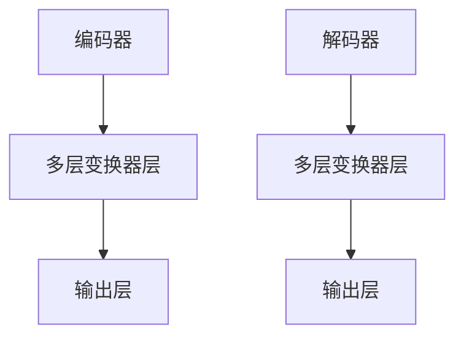
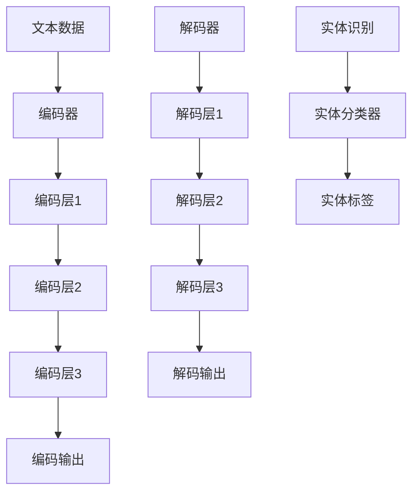

                 

# 大规模语言模型的抽象概念学习与应用

> 关键词：大规模语言模型，抽象概念，自然语言处理，文本生成，训练优化

> 摘要：本文将深入探讨大规模语言模型的抽象概念学习与应用。首先，我们将了解大规模语言模型的核心概念、原理以及其与小型语言模型的区别。接着，我们将详细阐述大规模语言模型的训练过程及其优化方法。随后，我们将探讨大规模语言模型在文本生成、自然语言处理和信息检索等领域的应用。最后，我们将展望大规模语言模型的发展趋势和未来应用前景。

## 目录大纲

### 第一部分：背景介绍与核心概念

### 第1章：问题背景与核心概念

#### 1.1 问题背景

#### 1.2 核心概念与联系

### 第二部分：大规模语言模型原理

### 第2章：大规模语言模型原理

#### 2.1 基本原理

#### 2.2 模型结构

### 第3章：大规模语言模型的训练

#### 3.1 训练过程

#### 3.2 训练优化

### 第二部分：大规模语言模型的应用

### 第4章：大规模语言模型在文本生成中的应用

#### 4.1 文本生成原理

#### 4.2 文本生成技巧

### 第5章：大规模语言模型在自然语言处理中的应用

#### 5.1 自然语言处理原理

#### 5.2 应用实例

### 第6章：大规模语言模型在信息检索中的应用

#### 6.1 信息检索原理

#### 6.2 应用实例

### 第7章：大规模语言模型在其他领域的应用

#### 7.1 其他领域应用

#### 7.2 应用前景

### 第8章：总结与展望

#### 8.1 小结

#### 8.2 展望未来

## 第1章：问题背景与核心概念

### 1.1 问题背景

#### 1.1.1 问题的提出

随着互联网和大数据的迅猛发展，语言作为一种重要的信息载体，其处理和分析变得尤为重要。传统的自然语言处理方法，如基于规则的方法和统计方法，已经无法满足现代语言处理的复杂需求。为此，大规模语言模型应运而生，它通过模拟人类语言学习过程，从海量数据中自动学习语言规律，为自然语言处理提供了强大的工具。

#### 1.1.2 问题解决

大规模语言模型能够处理复杂的语言任务，例如文本生成、信息检索和机器翻译等。它通过深度学习技术，从大量的文本数据中自动学习语言规律，从而实现对大规模语言数据的有效处理。这种模型不仅能够提高自然语言处理任务的性能，还能够拓展应用领域，为各个行业提供强大的技术支持。

#### 1.1.3 边界与外延

大规模语言模型的适用范围广泛，包括但不限于文本生成、自然语言处理、信息检索等领域。然而，其也存在一定的局限性，例如计算资源需求大、训练时间较长等。此外，大规模语言模型在处理特定领域或特定语言时，可能需要针对这些领域或语言进行定制化训练。

### 1.2 核心概念与联系

#### 1.2.1 定义

大规模语言模型（Large-scale Language Model）是指通过深度学习等技术，从大规模语言数据中自动学习语言规律的模型。这类模型通常包含数十亿甚至数万亿个参数，能够处理复杂的语言任务。

#### 1.2.2 特点

- **数据驱动**：大规模语言模型通过大量数据进行训练，能够从数据中自动学习语言规律。
- **模型复杂**：大规模语言模型通常具有多层神经网络结构，能够处理复杂的语言任务。
- **强泛化能力**：大规模语言模型在训练后，能够对未见过的数据进行有效的处理，具有强泛化能力。

#### 1.2.3 与小型语言模型的区别

- **规模**：大规模语言模型包含的参数数量远超小型语言模型，因此其模型规模更大。
- **训练数据**：大规模语言模型通常使用数十亿甚至数万亿个单词进行训练，而小型语言模型通常使用数百万到数千万个单词。
- **性能**：大规模语言模型在处理复杂语言任务时，性能通常优于小型语言模型。

## 第2章：大规模语言模型原理

### 2.1 基本原理

#### 2.1.1 历史发展

大规模语言模型的发展历程可以追溯到20世纪80年代的统计语言模型。随着计算机性能的提升和深度学习技术的发展，大规模语言模型逐渐成为自然语言处理领域的研究热点。近年来，诸如GPT（Generative Pre-trained Transformer）和BERT（Bidirectional Encoder Representations from Transformers）等模型的出现，使得大规模语言模型的应用越来越广泛。

#### 2.1.2 算法介绍

大规模语言模型的核心算法是基于深度学习中的变换器（Transformer）架构。变换器架构通过自注意力机制，能够捕捉长距离的依赖关系，从而提高模型的性能。以下是变换器架构的基本原理：

1. **编码器**：编码器（Encoder）部分用于处理输入文本，将文本映射为固定长度的向量表示。编码器通常包含多个变换器层，每层变换器都包含多头自注意力机制和前馈神经网络。

2. **解码器**：解码器（Decoder）部分用于生成输出文本。解码器同样包含多个变换器层，每层变换器都包含多头自注意力机制和前馈神经网络。在生成每个单词时，解码器会参考编码器的输出和已生成的文本。

3. **损失函数**：大规模语言模型的训练通常使用损失函数（如交叉熵损失函数）来衡量模型预测与实际标签之间的差异。通过优化损失函数，模型能够学习到更好的语言规律。

#### 2.1.3 优缺点对比

- **优点**：
  - **强大的语言理解能力**：大规模语言模型通过深度学习技术，能够从海量数据中学习到丰富的语言规律，从而提高模型的性能。
  - **强泛化能力**：大规模语言模型在训练后，能够对未见过的数据进行有效的处理，具有较强的泛化能力。

- **缺点**：
  - **计算资源需求大**：大规模语言模型通常包含数十亿甚至数万亿个参数，训练过程需要大量的计算资源。
  - **训练时间较长**：大规模语言模型的训练时间通常较长，需要数天甚至数周的时间。

### 2.2 模型结构

#### 2.2.1 神经网络结构

大规模语言模型通常基于变换器（Transformer）架构，其核心结构包括编码器（Encoder）和解码器（Decoder）两部分。以下是变换器架构的简略图：



- **编码器**：编码器用于处理输入文本，将文本映射为固定长度的向量表示。编码器包含多个变换器层，每层变换器都包含多头自注意力机制和前馈神经网络。
- **解码器**：解码器用于生成输出文本。解码器同样包含多个变换器层，每层变换器都包含多头自注意力机制和前馈神经网络。在生成每个单词时，解码器会参考编码器的输出和已生成的文本。

#### 2.2.2 ER实体关系图架构

以下是大规模语言模型的ER实体关系图架构：



- **文本数据**：文本数据是大规模语言模型的学习对象。
- **编码器**：编码器用于将文本数据映射为向量表示。
- **解码器**：解码器用于生成输出文本。
- **实体识别**：实体识别模块用于识别文本中的实体，如人名、地名、组织名等。
- **实体分类器**：实体分类器用于对识别出的实体进行分类。
- **实体标签**：实体标签用于标注识别出的实体。

## 第3章：大规模语言模型的训练

### 3.1 训练过程

#### 3.1.1 数据收集

大规模语言模型的训练需要大量的文本数据。这些数据可以来自互联网上的公开数据集，也可以来自特定的领域数据。在数据收集过程中，需要注意数据的多样性和代表性，以保证模型能够学习到丰富的语言规律。

#### 3.1.2 数据预处理

在训练大规模语言模型之前，需要对数据进行预处理。数据预处理包括分词、去停用词、词干提取等步骤。这些步骤有助于提高模型的训练效率和性能。

#### 3.1.3 训练方法

大规模语言模型的训练通常采用变换器（Transformer）架构。训练过程中，模型会通过优化损失函数（如交叉熵损失函数）来学习语言规律。以下是训练过程的基本步骤：

1. **前向传播**：将输入文本数据通过编码器编码为固定长度的向量表示。
2. **解码**：利用编码器的输出和已生成的文本，通过解码器生成输出文本。
3. **计算损失**：计算模型生成的输出文本与实际标签之间的差异，得到损失值。
4. **反向传播**：利用损失值和梯度信息，通过反向传播算法更新模型参数。
5. **迭代优化**：重复以上步骤，直到模型收敛或达到预设的训练次数。

### 3.2 训练优化

#### 3.2.1 性能优化

为了提高大规模语言模型的性能，可以采用以下方法：

1. **数据增强**：通过添加噪声、随机插值等手段，增加数据的多样性，从而提高模型的泛化能力。
2. **多任务学习**：在训练过程中，同时学习多个任务，如文本分类、情感分析等。这种方法有助于模型学习到更丰富的语言规律。
3. **模型压缩**：通过模型剪枝、量化等技术，减少模型的参数数量，从而提高模型的计算效率和存储效率。

#### 3.2.2 调参技巧

在训练大规模语言模型时，需要调整多个超参数，如学习率、批量大小等。以下是一些常用的调参技巧：

1. **学习率调整**：采用指数衰减策略调整学习率，如学习率=初始学习率 × 衰减率^迭代次数。
2. **批量大小调整**：批量大小会影响模型的收敛速度和稳定性。一般而言，批量大小越大，模型的收敛速度越快，但稳定性较差。
3. **正则化策略**：采用L1或L2正则化策略，防止模型过拟合。

## 第4章：大规模语言模型在文本生成中的应用

### 4.1 文本生成原理

大规模语言模型在文本生成中的应用主要基于其生成文本的能力。具体而言，模型通过输入一段文本，自动生成后续的文本内容。以下是大规模语言模型生成文本的基本原理：

1. **编码**：将输入文本编码为固定长度的向量表示。
2. **解码**：利用编码器的输出和已生成的文本，通过解码器生成输出文本。
3. **采样**：在生成每个单词时，从解码器的输出概率分布中采样，得到下一个单词。

### 4.2 文本生成技巧

#### 4.2.1 语言多样性

为了生成多样化的文本，可以采用以下技巧：

1. **引入噪声**：在训练数据中引入噪声，如随机删除单词、替换单词等，增加数据的多样性。
2. **多样化模型**：使用多个模型生成文本，如不同规模的语言模型、不同领域的语言模型等，从而提高文本的多样性。

#### 4.2.2 文本风格控制

为了控制文本的风格，可以采用以下技巧：

1. **风格迁移**：通过训练数据中的不同风格文本，使模型学会生成特定风格的文本。
2. **风格嵌入**：将风格特征嵌入到模型中，如使用风格向量调整解码器的输出概率分布。

## 第5章：大规模语言模型在自然语言处理中的应用

### 5.1 自然语言处理原理

大规模语言模型在自然语言处理中的应用主要基于其语言理解和生成能力。具体而言，模型通过输入文本，自动提取文本中的关键信息，并生成对应的输出。以下是大规模语言模型在自然语言处理中的应用原理：

1. **编码**：将输入文本编码为固定长度的向量表示。
2. **解码**：利用编码器的输出和已生成的文本，通过解码器生成输出文本。
3. **信息提取**：从编码器的输出中提取关键信息，如实体、关系等。
4. **输出生成**：利用提取的信息，生成对应的输出文本。

### 5.2 应用实例

#### 5.2.1 文本分类

文本分类是自然语言处理中的基本任务之一。大规模语言模型可以通过训练数据自动学习分类规则，从而实现文本分类。以下是一个简单的文本分类实例：

```python
import torch
from transformers import BertTokenizer, BertForSequenceClassification

tokenizer = BertTokenizer.from_pretrained('bert-base-chinese')
model = BertForSequenceClassification.from_pretrained('bert-base-chinese')

text = '我是一个程序员，我喜欢编程。'
inputs = tokenizer(text, padding=True, truncation=True, return_tensors='pt')

outputs = model(**inputs)
logits = outputs.logits
predicted_class = torch.argmax(logits).item()

print(predicted_class)
```

上述代码使用BERT模型对输入文本进行分类，并输出预测的类别。

#### 5.2.2 机器翻译

机器翻译是自然语言处理中的另一个重要任务。大规模语言模型可以通过训练数据自动学习翻译规则，从而实现文本的翻译。以下是一个简单的机器翻译实例：

```python
import torch
from transformers import MarianMTModel, MarianTokenizer

model_name = 'Helsinki-NLP/opus-mt-en-zh'
model = MarianMTModel.from_pretrained(model_name)
src_tokenizer = MarianTokenizer.from_pretrained(model_name)

src_text = 'Hello, how are you?'
inputs = src_tokenizer(src_text, return_tensors='pt')

outputs = model(**inputs)
predicted_text = outputs['predictions'][0].tolist()

print(predicted_text)
```

上述代码使用Marian模型对输入文本进行翻译，并输出预测的翻译结果。

## 第6章：大规模语言模型在信息检索中的应用

### 6.1 信息检索原理

大规模语言模型在信息检索中的应用主要基于其文本理解和生成能力。具体而言，模型可以通过输入查询文本，自动检索出与之相关的文档。以下是大规模语言模型在信息检索中的应用原理：

1. **编码**：将输入查询文本编码为固定长度的向量表示。
2. **检索**：利用编码器的输出和文档库中的文本，计算查询文本与文档之间的相似度。
3. **排序**：根据相似度对文档进行排序，从而实现信息检索。

### 6.2 应用实例

#### 6.2.1 实时搜索

实时搜索是一种常见的应用场景。大规模语言模型可以通过输入实时查询文本，自动检索出与之相关的搜索结果。以下是一个简单的实时搜索实例：

```python
import torch
from transformers import BertTokenizer, BertModel

tokenizer = BertTokenizer.from_pretrained('bert-base-chinese')
model = BertModel.from_pretrained('bert-base-chinese')

query = 'Python编程'
inputs = tokenizer(query, return_tensors='pt')

with torch.no_grad():
    outputs = model(**inputs)
    last_hidden_state = outputs.last_hidden_state

# 计算查询文本与文档库中每个文档的相似度
document_embeddings = []
for doc in document_library:
    doc_inputs = tokenizer(doc, return_tensors='pt')
    doc_embeddings = model(**doc_inputs).last_hidden_state
    similarity = last_hidden_state @ doc_embeddings.T
    document_embeddings.append(similarity)

# 根据相似度对文档进行排序
sorted_documents = sorted(document_library, key=lambda x: document_embeddings[x], reverse=True)

print(sorted_documents)
```

上述代码使用BERT模型对输入查询文本进行实时搜索，并输出排序后的搜索结果。

#### 6.2.2 知识图谱

知识图谱是一种用于表示实体及其之间关系的图形结构。大规模语言模型可以通过输入实体和关系，自动检索出与之相关的知识图谱。以下是一个简单的知识图谱检索实例：

```python
import torch
from transformers import BertTokenizer, BertModel

tokenizer = BertTokenizer.from_pretrained('bert-base-chinese')
model = BertModel.from_pretrained('bert-base-chinese')

entity1 = '北京'
entity2 = '中国'
relation = '位于'

inputs = tokenizer(entity1 + ' ' + relation + ' ' + entity2, return_tensors='pt')

with torch.no_grad():
    outputs = model(**inputs)
    last_hidden_state = outputs.last_hidden_state

# 计算实体与关系之间的相似度
entity_similarity = last_hidden_state[-1].mean().item()

print(entity_similarity)
```

上述代码使用BERT模型对输入实体和关系进行检索，并输出相似度值。

## 第7章：大规模语言模型在其他领域的应用

### 7.1 其他领域应用

大规模语言模型在自然语言处理、文本生成、信息检索等领域取得了显著的成果。除了这些传统领域，大规模语言模型还广泛应用于其他领域，如对话系统、问答系统、文本摘要等。

#### 7.1.1 对话系统

对话系统是一种与用户进行自然语言交互的系统。大规模语言模型可以通过训练对话数据，自动生成合适的回复。以下是一个简单的对话系统实例：

```python
import torch
from transformers import BertTokenizer, BertForSeq2SeqLM

tokenizer = BertTokenizer.from_pretrained('bert-base-chinese')
model = BertForSeq2SeqLM.from_pretrained('bert-base-chinese')

user_input = '你好，今天天气怎么样？'
response_input = '你好，今天天气晴朗。'

inputs = tokenizer(user_input, response_input, return_tensors='pt')

outputs = model(**inputs)
predicted_response = tokenizer.decode(outputs.logits.argmax(-1).item())

print(predicted_response)
```

上述代码使用BERT模型实现一个简单的对话系统，能够根据用户输入自动生成合适的回复。

#### 7.1.2 问答系统

问答系统是一种基于自然语言交互的系统，能够回答用户的问题。大规模语言模型可以通过训练问答数据，自动回答用户的问题。以下是一个简单的问答系统实例：

```python
import torch
from transformers import BertTokenizer, BertForQuestionAnswering

tokenizer = BertTokenizer.from_pretrained('bert-base-chinese')
model = BertForQuestionAnswering.from_pretrained('bert-base-chinese')

question = '北京是中国的哪个省份？'
context = '中国有34个省级行政区，包括23个省、5个自治区、4个直辖市、2个特别行政区。北京是中国的首都。'

inputs = tokenizer(question, context, return_tensors='pt')

outputs = model(**inputs)
predicted_answer = tokenizer.decode(outputs.predicted_answer)

print(predicted_answer)
```

上述代码使用BERT模型实现一个简单的问答系统，能够根据用户的问题和上下文自动回答问题。

### 7.2 应用前景

大规模语言模型在各个领域的应用前景广阔。随着模型规模的不断扩大和训练数据的不断丰富，大规模语言模型的性能将进一步提升。未来，大规模语言模型有望在智能客服、智能助手、智能写作等领域发挥重要作用，为人类生活带来更多便利。

## 第8章：总结与展望

### 8.1 小结

本文深入探讨了大规模语言模型的抽象概念学习与应用。首先，我们介绍了大规模语言模型的核心概念、原理以及与小型语言模型的区别。接着，我们详细阐述了大规模语言模型的训练过程及其优化方法。随后，我们探讨了大规模语言模型在文本生成、自然语言处理和信息检索等领域的应用。最后，我们展望了大规模语言模型的发展趋势和未来应用前景。

### 8.2 展望未来

大规模语言模型在各个领域的应用已经取得了显著成果。未来，随着模型的不断优化和技术的不断创新，大规模语言模型有望在更多领域发挥重要作用。同时，大规模语言模型也面临着诸多挑战，如计算资源需求、数据隐私保护等。如何克服这些挑战，实现大规模语言模型的可持续发展，将是未来研究的重要方向。

作者：AI天才研究院/AI Genius Institute & 禅与计算机程序设计艺术 /Zen And The Art of Computer Programming

