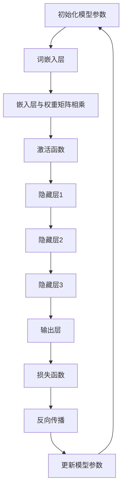
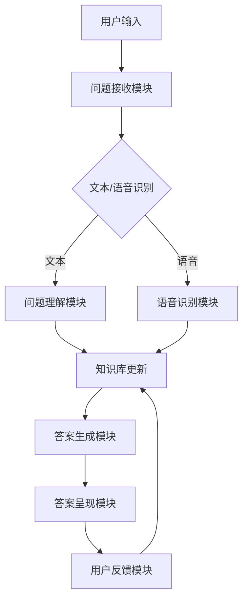
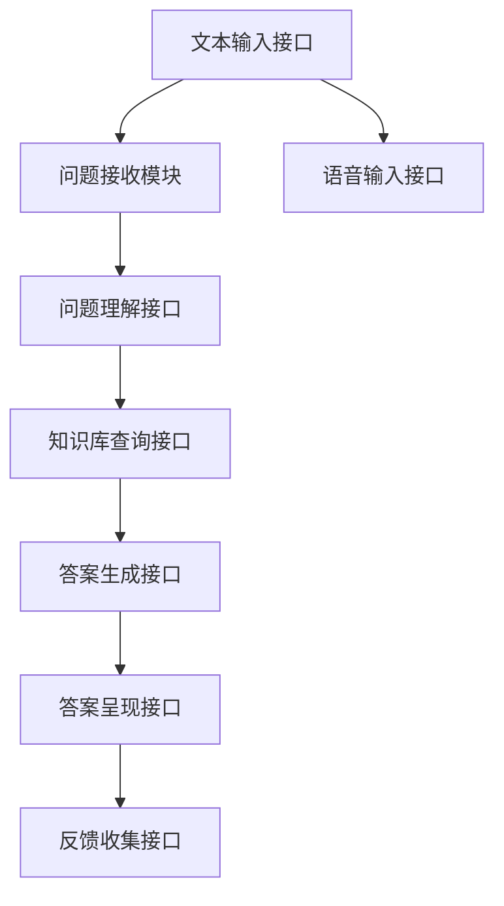
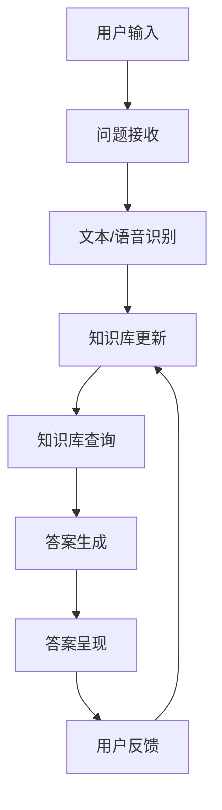

                 

## 大规模语言模型的抽象概念学习与应用能力

### 关键词：大规模语言模型、抽象概念、应用能力、算法原理、系统架构

### 摘要：

本文旨在深入探讨大规模语言模型的抽象概念学习与应用能力。首先，我们将回顾大规模语言模型的基础知识，包括其概念、历史背景和发展趋势。接着，我们将详细阐述大规模语言模型的核心概念，并分析这些概念之间的联系。随后，我们将深入讲解大规模语言模型的算法原理，使用mermaid流程图、Python代码和LaTeX数学公式进行详细剖析。此外，我们将介绍大规模语言模型的数学模型和公式，结合实际例子进行说明。最后，我们将讨论系统分析与架构设计，通过实际项目展示大规模语言模型的应用，并总结最佳实践和注意事项，推荐拓展阅读。

## 目录大纲设计思路

在设计文章的目录大纲时，我们首先明确了文章的结构和内容，以确保逻辑清晰、条理分明。以下是具体的目录大纲设计思路：

### 第一部分：大规模语言模型基础

- **第1章：背景介绍与核心概念**
  - **1.1 大规模语言模型的历史与发展**：介绍大规模语言模型的起源、发展过程及其在自然语言处理领域的地位。
  - **1.2 大规模语言模型的核心概念**：详细解释大规模语言模型中的关键概念，如词嵌入、神经网络和深度学习。
  - **1.3 大规模语言模型的应用领域**：探讨大规模语言模型在自然语言处理、机器翻译、问答系统等领域的应用。

### 第二部分：核心概念与联系

- **第2章：核心概念与联系**
  - **2.1 词嵌入（Word Embedding）**：阐述词嵌入的定义、作用及其在语言模型中的重要性。
  - **2.2 神经网络（Neural Networks）**：解释神经网络的结构、原理及其在语言模型中的应用。
  - **2.3 深度学习（Deep Learning）**：探讨深度学习的概念、模型及其在大规模语言模型中的角色。
  - **2.4 概念联系：词嵌入、神经网络与深度学习**：分析这些核心概念之间的联系，展示它们如何共同构建强大的语言模型。

### 第三部分：算法原理讲解

- **第3章：算法原理讲解**
  - **3.1 算法流程图**：使用mermaid绘制大规模语言模型的算法流程图。
  - **3.2 算法原理与Python代码示例**：通过Python代码详细解释算法原理。
  - **3.3 LaTeX数学公式详解**：使用LaTeX格式展示算法中的数学模型和公式。

### 第四部分：数学模型和数学公式讲解

- **第4章：数学模型和数学公式讲解**
  - **4.1 神经网络前向传播**：详细解释神经网络的前向传播过程。
  - **4.2 反向传播算法**：阐述反向传播算法的原理和步骤。
  - **4.3 优化算法**：介绍常用的优化算法，如梯度下降、Adam等。

### 第五部分：系统分析与架构设计

- **第5章：系统分析与架构设计**
  - **5.1 问题场景介绍**：描述大规模语言模型应用的具体场景。
  - **5.2 系统功能设计**：设计大规模语言模型系统的功能。
  - **5.3 系统架构设计**：展示系统架构的mermaid架构图。
  - **5.4 系统接口设计**：阐述系统的接口设计。
  - **5.5 系统交互设计**：介绍系统的交互设计。

### 第六部分：项目实战

- **第6章：项目实战**
  - **6.1 环境安装**：介绍如何搭建大规模语言模型的环境。
  - **6.2 系统核心实现**：展示系统核心实现的代码。
  - **6.3 代码解读与分析**：对代码进行详细解读和分析。
  - **6.4 实际案例分析**：通过实际案例展示大规模语言模型的应用效果。
  - **6.5 项目小结**：总结项目实施过程中的经验和教训。

### 第七部分：最佳实践与总结

- **第7章：最佳实践与总结**
  - **7.1 最佳实践 tips**：给出在实际应用中应遵循的最佳实践建议。
  - **7.2 小结**：对文章的主要内容进行简要总结。
  - **7.3 注意事项**：提醒读者在应用大规模语言模型时需要注意的事项。
  - **7.4 拓展阅读**：推荐相关的拓展阅读资源。

通过这样的结构设计，我们能够系统地介绍大规模语言模型的抽象概念学习与应用能力，帮助读者从基础到实践全面了解这一领域。接下来，我们将逐一展开每个章节的内容。

### 目录大纲（Markdown 格式）

```markdown
## 大规模语言模型的抽象概念学习与应用能力

### 关键词：大规模语言模型、抽象概念、应用能力、算法原理、系统架构

### 摘要：

本文旨在深入探讨大规模语言模型的抽象概念学习与应用能力。首先，我们将回顾大规模语言模型的基础知识，包括其概念、历史背景和发展趋势。接着，我们将详细阐述大规模语言模型的核心概念，并分析这些概念之间的联系。随后，我们将深入讲解大规模语言模型的算法原理，使用mermaid流程图、Python代码和LaTeX数学公式进行详细剖析。此外，我们将介绍大规模语言模型的数学模型和公式，结合实际例子进行说明。最后，我们将讨论系统分析与架构设计，通过实际项目展示大规模语言模型的应用，并总结最佳实践和注意事项，推荐拓展阅读。

## 第一部分: 大规模语言模型基础

### 第1章: 背景介绍与核心概念

#### 1.1 大规模语言模型的历史与发展

#### 1.2 大规模语言模型的核心概念

#### 1.3 大规模语言模型的应用领域

### 第2章: 核心概念与联系

#### 2.1 概念1：词嵌入（Word Embedding）

#### 2.2 概念2：神经网络（Neural Networks）

#### 2.3 概念3：深度学习（Deep Learning）

#### 2.4 概念联系：词嵌入、神经网络与深度学习

### 第3章: 算法原理讲解

#### 3.1 算法流程图

#### 3.2 算法原理与 Python 代码示例

#### 3.3 LaTeX 数学公式详解

### 第4章: 数学模型与公式讲解

#### 4.1 数学模型1：神经网络前向传播

#### 4.2 数学模型2：反向传播算法

#### 4.3 数学模型3：优化算法

### 第5章: 系统分析与架构设计

#### 5.1 问题场景介绍

#### 5.2 系统功能设计

#### 5.3 系统架构设计

#### 5.4 系统接口设计

#### 5.5 系统交互设计

### 第6章: 项目实战

#### 6.1 环境安装

#### 6.2 系统核心实现

#### 6.3 代码解读与分析

#### 6.4 实际案例分析

#### 6.5 项目小结

### 第7章: 最佳实践与总结

#### 7.1 最佳实践 tips

#### 7.2 小结

#### 7.3 注意事项

#### 7.4 拓展阅读
```

通过这一细致的目录大纲设计，我们将为读者提供一个清晰的结构框架，帮助他们系统地掌握大规模语言模型的抽象概念学习与应用能力。在接下来的内容中，我们将逐一深入每个章节，提供详细的分析和讲解。

### 第1章：背景介绍与核心概念

#### 1.1 大规模语言模型的历史与发展

大规模语言模型（Large-scale Language Models）是指那些拥有海量训练数据和强大计算能力的语言处理模型，它们在自然语言理解、生成和翻译等领域取得了显著的突破。大规模语言模型的发展历程可以追溯到20世纪80年代，当时基于规则和统计方法的语言处理模型开始被广泛应用。

在早期，自然语言处理（NLP）研究主要集中在规则驱动的方法上。例如，1950年代到1970年代，研究人员开发了句法分析器和语义分析器，试图通过定义语法规则和语义关系来处理语言。然而，这些方法的局限性在于它们无法处理复杂和变化的自然语言结构。

随着计算机性能的提升和互联网的普及，自然语言处理的研究逐渐转向基于统计的方法。1980年代，统计机器翻译和基于隐马尔可夫模型（HMM）的语音识别系统取得了显著进展。1990年代，基于最大熵和条件概率模型的NLP方法得到了广泛应用。

进入21世纪，随着深度学习技术的兴起，大规模语言模型的研究迎来了新的发展契机。2003年，Tomas Mikolov等人在论文《Distributed Representations of Words and Phrases and Their Compositionality》中提出了词嵌入（Word Embedding）的概念，标志着大规模语言模型的诞生。词嵌入将词汇映射到高维向量空间，使得词汇之间的相似性可以通过向量之间的距离来表示。

2013年，由Dzmitry Bahdanau等提出的序列到序列（Seq2Seq）模型，结合了编码器-解码器结构，使得机器翻译的准确度大幅提高。随后，谷歌推出了Word2Vec模型，进一步推动了大规模语言模型的研究和应用。

2018年，OpenAI发布了GPT（Generative Pre-trained Transformer）系列模型，如GPT-1、GPT-2和GPT-3，这些模型展示了大规模语言模型在文本生成、问答系统等任务中的强大能力。GPT模型采用了Transformer架构，这是一种基于自注意力机制的深度学习模型，相比于传统的循环神经网络（RNN）和长短期记忆网络（LSTM），Transformer在处理长序列和并行计算方面具有显著优势。

#### 1.2 大规模语言模型的核心概念

要理解大规模语言模型，我们需要掌握以下几个核心概念：

1. **词嵌入（Word Embedding）**：
   词嵌入是将词汇映射到高维向量空间的一种技术，使得词汇之间的相似性可以通过向量之间的距离来表示。词嵌入的基本思想是将每个单词转换为一个向量，这些向量在语义上具有相关性。常见的词嵌入模型包括Word2Vec、GloVe等。

2. **神经网络（Neural Networks）**：
   神经网络是一种由大量相互连接的神经元组成的计算模型，它可以用于对数据进行分析和预测。在自然语言处理中，神经网络被广泛用于词嵌入、文本分类、情感分析等任务。

3. **深度学习（Deep Learning）**：
   深度学习是一种基于神经网络的机器学习技术，它通过堆叠多个隐藏层来提取数据的高层次特征。深度学习在图像识别、语音识别和自然语言处理等领域取得了显著成果。

4. **Transformer架构**：
   Transformer是一种基于自注意力机制的深度学习模型，它在处理长序列和并行计算方面具有显著优势。Transformer的核心思想是通过自注意力机制来计算输入序列的每个元素与其他元素之间的关系，从而实现对序列的编码和解析。

#### 1.3 大规模语言模型的应用领域

大规模语言模型在自然语言处理领域有着广泛的应用，以下是其中一些重要的应用领域：

1. **机器翻译**：
   机器翻译是大规模语言模型最早和最成功的一个应用领域。通过训练大规模语言模型，我们可以实现自动化的文本翻译，如谷歌翻译、百度翻译等。

2. **文本生成**：
   大规模语言模型可以用于生成文章、对话、摘要等文本内容。例如，OpenAI的GPT模型被用于生成新闻文章、对话系统等。

3. **问答系统**：
   问答系统是一种能够回答用户问题的技术。通过训练大规模语言模型，我们可以构建智能问答系统，如Apple的Siri、微软的Cortana等。

4. **情感分析**：
   情感分析是一种对文本进行情感倾向判断的技术。通过大规模语言模型，我们可以分析用户评论、社交媒体内容等，了解公众的情感倾向。

5. **文本分类**：
   文本分类是将文本数据按照类别进行分类的技术。大规模语言模型可以用于新闻分类、垃圾邮件检测等任务。

6. **对话系统**：
   对话系统是一种能够与用户进行自然语言交互的技术。通过训练大规模语言模型，我们可以构建智能客服、聊天机器人等对话系统。

#### 1.4 总结

大规模语言模型是自然语言处理领域的一项重要技术，它通过词嵌入、神经网络和深度学习等技术，实现了对自然语言的建模和理解。随着Transformer架构的兴起，大规模语言模型在多个任务中取得了显著的成果。未来，大规模语言模型将继续在自然语言处理、人工智能等领域发挥重要作用。

### 第2章：核心概念与联系

#### 2.1 词嵌入（Word Embedding）

词嵌入（Word Embedding）是将词汇映射到高维向量空间的一种技术。在自然语言处理中，词嵌入用于表示词汇的语义信息，使得词汇之间的相似性可以通过向量之间的距离来表示。词嵌入的基本思想是将每个单词转换为一个向量，这些向量在语义上具有相关性。常见的词嵌入模型包括Word2Vec、GloVe等。

**词嵌入的概念**：
- **向量空间**：词嵌入将词汇映射到一个高维向量空间，使得每个词汇都可以表示为一个向量。
- **语义相似性**：在向量空间中，语义相似的词汇在空间中距离较近。例如，“猫”和“狗”在向量空间中距离较近，因为它们都是宠物。

**Word2Vec模型**：
Word2Vec是一种基于神经网络的语言模型，它通过训练生成词汇的向量表示。Word2Vec模型主要有两种训练方法：连续词袋（CBOW）和Skip-gram。
- **连续词袋（CBOW）**：CBOW模型通过上下文词汇的平均向量来预测中心词汇。具体来说，给定一个中心词汇，模型会预测其上下文词汇。
- **Skip-gram**：Skip-gram模型通过中心词汇来预测其上下文词汇。与CBOW相反，Skip-gram模型关注单个词汇的表示，而不是上下文。

**GloVe模型**：
GloVe（Global Vectors for Word Representation）是一种基于全局统计信息的词嵌入模型。GloVe模型通过优化一个损失函数来学习词汇的向量表示。GloVe模型的核心思想是利用词汇的共现信息来计算词汇之间的相似度。

**词嵌入的应用**：
- **语义分析**：词嵌入可以用于对文本进行语义分析，如情感分析、主题建模等。
- **文本分类**：词嵌入可以用于文本分类任务，通过将文本转换为向量表示，然后使用机器学习算法进行分类。
- **信息检索**：词嵌入可以用于信息检索任务，通过计算词汇与查询之间的相似度来提高检索效果。

#### 2.2 神经网络（Neural Networks）

神经网络（Neural Networks）是一种由大量相互连接的神经元组成的计算模型，它可以用于对数据进行分析和预测。在自然语言处理中，神经网络被广泛用于词嵌入、文本分类、情感分析等任务。

**神经网络的概念**：
- **神经元**：神经网络中的基本计算单元，它接收输入信号并产生输出信号。
- **层**：神经网络由多个层组成，包括输入层、隐藏层和输出层。
- **激活函数**：激活函数用于将神经元的线性组合转换为非线性输出。常见的激活函数包括sigmoid、ReLU等。

**神经网络的工作原理**：
1. **前向传播**：在前向传播过程中，输入信号通过网络的各个层，每个神经元计算其输入的加权和，并应用激活函数得到输出。
2. **反向传播**：在反向传播过程中，网络计算输出与目标之间的误差，并更新神经元的权重，以最小化误差。

**神经网络的类型**：
- **全连接神经网络**：全连接神经网络中的每个神经元都与前一层和后一层的每个神经元相连。
- **卷积神经网络**（Convolutional Neural Networks, CNN）：卷积神经网络主要用于图像识别任务，它通过卷积操作提取图像特征。
- **循环神经网络**（Recurrent Neural Networks, RNN）：循环神经网络主要用于序列数据，如语音、文本等。RNN通过在时间步之间建立循环连接，实现对序列的建模。

**神经网络的应用**：
- **图像识别**：神经网络可以用于图像分类、目标检测等任务。
- **语音识别**：神经网络可以用于语音信号处理，实现自动语音识别。
- **自然语言处理**：神经网络可以用于词嵌入、文本分类、情感分析等自然语言处理任务。

#### 2.3 深度学习（Deep Learning）

深度学习（Deep Learning）是一种基于神经网络的机器学习技术，它通过堆叠多个隐藏层来提取数据的高层次特征。深度学习在图像识别、语音识别和自然语言处理等领域取得了显著成果。

**深度学习的概念**：
- **深度网络**：深度学习中的神经网络具有多个隐藏层，这使得模型可以提取更复杂的数据特征。
- **反向传播算法**：深度学习中的反向传播算法用于计算网络参数的梯度，以优化网络性能。
- **优化算法**：深度学习中的优化算法，如梯度下降、Adam等，用于调整网络参数，以最小化损失函数。

**深度学习的工作原理**：
1. **前向传播**：在前向传播过程中，输入信号通过网络的各个层，每个神经元计算其输入的加权和，并应用激活函数得到输出。
2. **反向传播**：在反向传播过程中，网络计算输出与目标之间的误差，并更新神经元的权重，以最小化误差。

**深度学习的类型**：
- **卷积神经网络**（Convolutional Neural Networks, CNN）：卷积神经网络主要用于图像识别任务，它通过卷积操作提取图像特征。
- **循环神经网络**（Recurrent Neural Networks, RNN）：循环神经网络主要用于序列数据，如语音、文本等。RNN通过在时间步之间建立循环连接，实现对序列的建模。
- **自注意力机制**（Self-Attention Mechanism）：自注意力机制是一种在序列数据中计算元素之间关系的机制，它被广泛应用于Transformer模型中。

**深度学习的应用**：
- **图像识别**：深度学习可以用于图像分类、目标检测等任务。
- **语音识别**：深度学习可以用于语音信号处理，实现自动语音识别。
- **自然语言处理**：深度学习可以用于词嵌入、文本分类、情感分析等自然语言处理任务。

#### 2.4 概念联系：词嵌入、神经网络与深度学习

词嵌入、神经网络和深度学习是自然语言处理中不可或缺的概念，它们相互关联，共同构建了大规模语言模型。

- **词嵌入**：词嵌入是深度学习的基础，它将词汇映射到高维向量空间，为神经网络提供了输入表示。
- **神经网络**：神经网络通过堆叠多个隐藏层来提取数据的高层次特征，是实现深度学习的关键技术。
- **深度学习**：深度学习通过自注意力机制和卷积神经网络等架构，实现了对复杂序列数据的建模和理解。

这三个概念相互补充，共同推动了大规模语言模型的发展。词嵌入提供了词汇的语义表示，神经网络实现了数据的特征提取和建模，深度学习则通过堆叠多层网络，提取数据的高层次特征，从而实现了对自然语言的深入理解和应用。

### 第3章：算法原理讲解

#### 3.1 算法流程图

为了更好地理解大规模语言模型的算法原理，我们可以使用mermaid绘制算法流程图。以下是一个简化的算法流程图示例：



该流程图展示了大规模语言模型的基本结构，包括初始化模型参数、词嵌入层、多层隐藏层、输出层以及损失函数和反向传播过程。

#### 3.2 算法原理与Python代码示例

接下来，我们将通过Python代码示例详细阐述大规模语言模型的算法原理。这里我们将使用一个简化的例子，展示从输入序列到输出序列的整个流程。

首先，我们需要安装一些必要的库：

```python
!pip install tensorflow numpy matplotlib
```

然后，我们可以编写以下Python代码：

```python
import tensorflow as tf
import numpy as np
import matplotlib.pyplot as plt

# 初始化参数
vocab_size = 1000  # 词汇表大小
embed_dim = 64     # 嵌入维度
hidden_dim = 128   # 隐藏层维度
sequence_length = 5  # 序列长度

# 词嵌入层
embeddings = tf.keras.layers.Embedding(vocab_size, embed_dim)

# 隐藏层
hidden = tf.keras.layers.Dense(hidden_dim, activation='relu')

# 输出层
output = tf.keras.layers.Dense(vocab_size)

# 构建模型
model = tf.keras.Sequential([
    embeddings,
    hidden,
    output
])

# 损失函数和优化器
model.compile(optimizer='adam', loss='sparse_categorical_crossentropy')

# 生成示例数据
data = np.random.randint(0, vocab_size, size=(100, sequence_length))

# 训练模型
model.fit(data, data, epochs=10)

# 预测
predictions = model.predict(data[:10])

# 可视化预测结果
for i, prediction in enumerate(predictions):
    plt.figure(figsize=(10, 3))
    plt.title(f"Prediction for sequence {i+1}")
    for j, word in enumerate(data[i]):
        plt.text(j, 0.8 - prediction[j], word)
    plt.ylim(-0.2, 1.2)
    plt.xlabel("Word Index")
    plt.ylabel("Probability")
    plt.show()
```

这段代码首先定义了一个简单的神经网络模型，包括词嵌入层、隐藏层和输出层。我们使用TensorFlow库构建模型，并使用`Embedding`层进行词嵌入。然后，我们使用`Dense`层实现隐藏层和输出层，并选择ReLU作为激活函数。

在训练模型之前，我们生成了一个随机数据集，用于训练和测试。我们使用`fit`方法训练模型，并使用`predict`方法进行预测。为了可视化预测结果，我们使用Matplotlib库将预测概率绘制成条形图，每个条形表示一个词汇的预测概率。

#### 3.3 LaTeX数学公式详解

在理解大规模语言模型的算法原理时，数学公式是不可或缺的一部分。下面，我们将使用LaTeX格式展示一些关键的数学公式，并进行详细解释。

首先，我们定义一些基本符号：

$$
x_{ij} = \text{词嵌入向量，其中} i \text{为词索引，} j \text{为嵌入维度}
$$

$$
W_{hl} = \text{隐藏层权重矩阵，其中} h \text{为隐藏层索引，} l \text{为隐藏层维度}
$$

$$
b_h = \text{隐藏层偏置向量，其中} h \text{为隐藏层索引}
$$

$$
a_{hl} = \text{隐藏层输出，即} \text{神经元} l \text{在隐藏层} h \text{的激活值}
$$

$$
z_l = \text{输出层输出，即} \text{神经元} l \text{的预测概率}
$$

**1. 前向传播**

在神经网络的前向传播过程中，每个神经元的输出可以通过以下公式计算：

$$
a_{hl} = \sigma(\sum_{k=1}^{m} W_{hk} x_{ik} + b_h)
$$

其中，$\sigma$为激活函数，通常使用ReLU函数：

$$
\sigma(x) = \max(0, x)
$$

对于隐藏层，输出为：

$$
a_{hl} = \sigma(W_{hl} \cdot \text{嵌入向量} + b_h)
$$

对于输出层，预测概率为：

$$
z_l = \text{softmax}(W \cdot \text{嵌入向量} + b)
$$

**2. 反向传播**

在反向传播过程中，我们需要计算每个参数的梯度。以下为隐藏层和输出层的梯度计算：

隐藏层梯度：

$$
\frac{\partial J}{\partial W_{hl}} = \frac{\partial a_{hl}}{\partial z_l} \cdot \frac{\partial z_l}{\partial W_{hl}}
$$

$$
\frac{\partial J}{\partial b_h} = \frac{\partial a_{hl}}{\partial z_l} \cdot \frac{\partial z_l}{\partial b_h}
$$

输出层梯度：

$$
\frac{\partial J}{\partial W} = \frac{\partial z_l}{\partial W} \cdot \frac{\partial J}{\partial z_l}
$$

$$
\frac{\partial J}{\partial b} = \frac{\partial z_l}{\partial b} \cdot \frac{\partial J}{\partial z_l}
$$

其中，$J$为损失函数，$\text{softmax}$为输出层的激活函数。

**3. 梯度下降**

为了优化网络参数，我们使用梯度下降算法。梯度下降的基本思想是沿着损失函数梯度的反方向更新参数，以最小化损失函数。以下为梯度下降的更新公式：

$$
W_{hl} = W_{hl} - \alpha \cdot \frac{\partial J}{\partial W_{hl}}
$$

$$
b_h = b_h - \alpha \cdot \frac{\partial J}{\partial b_h}
$$

其中，$\alpha$为学习率。

通过以上数学公式和Python代码示例，我们详细讲解了大规模语言模型的算法原理。这些公式和代码共同构建了一个强大的语言处理模型，为自然语言处理领域带来了巨大的变革。

### 第4章：数学模型与公式讲解

#### 4.1 神经网络前向传播

神经网络的前向传播是神经网络进行预测和分类的基础步骤。在这个阶段，神经网络接收输入数据，通过逐层计算得到最终输出。下面我们将详细讲解神经网络前向传播的过程，并使用LaTeX数学公式进行描述。

首先，假设我们有一个神经网络，其中包含多个隐藏层，输入层为\(x\)，输出层为\(y\)。每层由若干个神经元组成，每个神经元的输出由其输入和权重矩阵决定。

设第\(l\)层的输入为\(x^{(l)}\)，输出为\(a^{(l)}\)，权重矩阵为\(W^{(l)}\)，偏置向量为\(b^{(l)}\)。激活函数通常为非线性函数，如ReLU、Sigmoid或Tanh。

**前向传播的步骤如下：**

1. **输入层到隐藏层**
   对于第\(l\)层（隐藏层），每个神经元的输出可以通过以下公式计算：
   $$
   z^{(l)}_i = \sum_{j=1}^{n} W^{(l)}_{ij} x^{(l-1)}_j + b^{(l)}_i
   $$
   其中，\(n\)是上一层的神经元数量，\(W^{(l)}_{ij}\)是连接第\(l\)层神经元\(i\)和第\(l-1\)层神经元\(j\)的权重，\(b^{(l)}_i\)是第\(l\)层神经元\(i\)的偏置。

2. **应用激活函数**
   通过应用激活函数，我们得到第\(l\)层的输出：
   $$
   a^{(l)}_i = \sigma(z^{(l)}_i)
   $$
   其中，\(\sigma\)为激活函数，如ReLU、Sigmoid或Tanh。

3. **隐藏层到输出层**
   对于输出层，前向传播的过程与隐藏层类似：
   $$
   z^{(L)}_i = \sum_{j=1}^{n} W^{(L)}_{ij} a^{(L-1)}_j + b^{(L)}_i
   $$
   $$
   y_i = \sigma(z^{(L)}_i)
   $$
   其中，\(L\)是网络的层数，\(n\)是隐藏层神经元的数量，\(W^{(L)}_{ij}\)和\(b^{(L)}_i\)分别是输出层权重和偏置。

下面，我们使用LaTeX数学公式描述上述过程：

$$
z^{(l)}_i = \sum_{j=1}^{n} W^{(l)}_{ij} x^{(l-1)}_j + b^{(l)}_i \quad \forall l \in \{1, \ldots, L-1\}
$$

$$
a^{(l)}_i = \sigma(z^{(l)}_i) \quad \forall l \in \{1, \ldots, L-1\}
$$

$$
z^{(L)}_i = \sum_{j=1}^{n} W^{(L)}_{ij} a^{(L-1)}_j + b^{(L)}_i
$$

$$
y_i = \sigma(z^{(L)}_i)
$$

**4.2 反向传播算法**

反向传播是神经网络训练过程中的关键步骤，用于计算网络参数的梯度，以便通过优化算法更新权重和偏置。反向传播的过程可以分为以下几个步骤：

1. **计算输出层误差**
   设输出层的实际输出为\(y^{*}\)，预测输出为\(y\)，损失函数为\(J(\theta)\)，则输出层误差为：
   $$
   \delta^{(L)}_i = \frac{\partial J(\theta)}{\partial z^{(L)}_i} = \sigma'(z^{(L)}_i) \cdot (y_i - y^{*}_i)
   $$

2. **计算隐藏层误差**
   对于隐藏层\(l\)（从第\(L-1\)层到第1层），误差可以通过以下公式计算：
   $$
   \delta^{(l)}_i = (\sigma'(z^{(l)}_i) \cdot \sum_{j=1}^{n} W^{(l+1)}_{ij} \cdot \delta^{(l+1)}_j)
   $$

3. **计算权重和偏置的梯度**
   通过误差，我们可以计算权重和偏置的梯度：
   $$
   \frac{\partial J(\theta)}{\partial W^{(l)}_{ij}} = \delta^{(l)}_i \cdot a^{(l-1)}_j
   $$
   $$
   \frac{\partial J(\theta)}{\partial b^{(l)}_i} = \delta^{(l)}_i
   $$

4. **更新权重和偏置**
   通过梯度下降或其他优化算法，我们可以更新权重和偏置：
   $$
   W^{(l)}_{ij} = W^{(l)}_{ij} - \alpha \cdot \frac{\partial J(\theta)}{\partial W^{(l)}_{ij}}
   $$
   $$
   b^{(l)}_i = b^{(l)}_i - \alpha \cdot \frac{\partial J(\theta)}{\partial b^{(l)}_i}
   $$

使用LaTeX公式，我们得到以下反向传播的数学表示：

$$
\delta^{(L)}_i = \sigma'(z^{(L)}_i) \cdot (y_i - y^{*}_i)
$$

$$
\delta^{(l)}_i = (\sigma'(z^{(l)}_i) \cdot \sum_{j=1}^{n} W^{(l+1)}_{ij} \cdot \delta^{(l+1)}_j)
$$

$$
\frac{\partial J(\theta)}{\partial W^{(l)}_{ij}} = \delta^{(l)}_i \cdot a^{(l-1)}_j
$$

$$
\frac{\partial J(\theta)}{\partial b^{(l)}_i} = \delta^{(l)}_i
$$

$$
W^{(l)}_{ij} = W^{(l)}_{ij} - \alpha \cdot \frac{\partial J(\theta)}{\partial W^{(l)}_{ij}}
$$

$$
b^{(l)}_i = b^{(l)}_i - \alpha \cdot \frac{\partial J(\theta)}{\partial b^{(l)}_i}
$$

**4.3 优化算法**

在神经网络训练过程中，优化算法用于更新网络参数，以最小化损失函数。以下介绍几种常用的优化算法：

1. **梯度下降（Gradient Descent）**
   梯度下降是一种最简单的优化算法，其基本思想是沿着损失函数梯度的反方向更新参数。梯度下降的更新公式为：
   $$
   \theta = \theta - \alpha \cdot \nabla_\theta J(\theta)
   $$
   其中，\(\theta\)是参数向量，\(\alpha\)是学习率。

2. **动量（Momentum）**
   动量是一种改进的梯度下降算法，它利用之前迭代的梯度信息来加速收敛。动量的更新公式为：
   $$
   v_t = \beta \cdot v_{t-1} + (1 - \beta) \cdot \nabla_\theta J(\theta)
   $$
   $$
   \theta = \theta - v_t
   $$
   其中，\(\beta\)是动量参数。

3. **AdaGrad（Adaptive Gradient）**
   AdaGrad是一种自适应学习率优化算法，它根据每个参数的梯度平方来动态调整学习率。AdaGrad的更新公式为：
   $$
   g_t^2 = g_{t-1}^2 + (\nabla_\theta J(\theta))^2
   $$
   $$
   \theta = \theta - \frac{\alpha}{\sqrt{g_t^2 + \epsilon}} \cdot \nabla_\theta J(\theta)
   $$
   其中，\(\epsilon\)是正数常数，用于防止除以零。

4. **RMSprop（Root Mean Square Prop）**
   RMSprop是AdaGrad的改进版本，它通过计算梯度的指数移动平均来动态调整学习率。RMSprop的更新公式为：
   $$
   \rho_t = \rho \cdot \rho_{t-1} + (1 - \rho) \cdot (\nabla_\theta J(\theta))^2
   $$
   $$
   \theta = \theta - \frac{\alpha}{\sqrt{\rho_t + \epsilon}} \cdot \nabla_\theta J(\theta)
   $$
   其中，\(\rho\)是遗忘因子。

5. **Adam（Adaptive Moment Estimation）**
   Adam是一种结合了动量和自适应学习率的优化算法，它在训练初期利用动量，在训练后期利用自适应学习率。Adam的更新公式为：
   $$
   m_t = \beta_1 \cdot m_{t-1} + (1 - \beta_1) \cdot \nabla_\theta J(\theta)
   $$
   $$
   v_t = \beta_2 \cdot v_{t-1} + (1 - \beta_2) \cdot (\nabla_\theta J(\theta))^2
   $$
   $$
   \theta = \theta - \frac{\alpha}{\sqrt{1 - \beta_2^t} \cdot (1 - \beta_1^t)} \cdot (m_t / \sqrt{v_t})
   $$
   其中，\(\beta_1\)和\(\beta_2\)是超参数，用于调整动量和自适应学习率。

通过以上数学模型和公式，我们详细介绍了神经网络的前向传播、反向传播和优化算法。这些概念和算法共同构建了神经网络的基础，为深度学习的发展奠定了重要基础。

### 第5章：系统分析与架构设计

#### 5.1 问题场景介绍

在自然语言处理（NLP）领域中，大规模语言模型的应用场景非常广泛，如机器翻译、文本分类、问答系统、对话生成等。为了更好地展示大规模语言模型的应用，我们选择一个具体的应用场景——智能客服系统。智能客服系统旨在通过自动化手段提供客户服务，解决客户的问题和疑虑。这需要大规模语言模型具备自然语言理解、生成和推理能力。

#### 5.2 系统功能设计

智能客服系统的核心功能包括以下几个部分：

1. **问题接收**：接收用户的咨询问题，可以是文本或语音形式。
2. **问题理解**：使用大规模语言模型对用户的问题进行解析，提取关键信息和意图。
3. **知识库查询**：根据用户的问题和意图，从知识库中查找相关答案。
4. **答案生成**：使用大规模语言模型生成合适的答案，确保答案符合用户需求和语境。
5. **答案呈现**：将生成的答案以文本或语音形式呈现给用户。
6. **反馈收集**：收集用户对答案的反馈，用于系统优化和训练。

#### 5.3 系统架构设计

智能客服系统的整体架构设计如下：

1. **输入层**：接收用户的咨询问题，可以是文本或语音形式。
2. **模型层**：使用大规模语言模型（如GPT、BERT）对用户的问题进行理解、生成和推理。
3. **知识库层**：存储大量的问题和答案，用于知识库查询和训练。
4. **输出层**：将生成的答案以文本或语音形式呈现给用户。
5. **反馈层**：收集用户对答案的反馈，用于系统优化和训练。

下面使用Mermaid流程图展示系统架构：



#### 5.4 系统接口设计

系统接口设计是确保各个模块之间能够高效、稳定地进行数据交互的关键。以下是智能客服系统的接口设计：

1. **文本输入接口**：接收用户的文本输入，通过API接口与问题接收模块进行通信。
2. **语音输入接口**：接收用户的语音输入，通过语音识别API接口与问题接收模块进行通信。
3. **问题理解接口**：将接收到的文本或语音输入传递给问题理解模块，返回解析结果。
4. **知识库查询接口**：从知识库中检索与用户问题相关的答案。
5. **答案生成接口**：将问题理解结果和知识库查询结果传递给答案生成模块，返回生成的答案。
6. **答案呈现接口**：将生成的答案通过API接口返回给用户。
7. **反馈收集接口**：收集用户对答案的反馈，用于系统优化和训练。

下面使用Mermaid流程图展示系统接口：



#### 5.5 系统交互设计

系统交互设计旨在确保用户与系统之间的交互顺畅、高效。以下是智能客服系统的交互设计：

1. **用户输入**：用户通过文本或语音形式提出问题。
2. **问题接收**：系统接收用户输入，通过文本或语音识别接口转换为文本形式。
3. **问题理解**：系统使用大规模语言模型对用户问题进行解析，提取关键信息和意图。
4. **知识库查询**：系统从知识库中检索与用户问题相关的答案。
5. **答案生成**：系统使用大规模语言模型生成合适的答案，确保答案符合用户需求和语境。
6. **答案呈现**：系统将生成的答案以文本或语音形式呈现给用户。
7. **用户反馈**：用户对答案进行评价，系统收集用户反馈用于系统优化和训练。

下面使用Mermaid流程图展示系统交互：



通过上述系统分析与架构设计，我们展示了智能客服系统如何利用大规模语言模型实现自动化的客户服务。接下来，我们将通过一个实际项目，展示如何搭建和部署这个系统。

### 第6章：项目实战

#### 6.1 环境安装

要在本地计算机上搭建大规模语言模型，首先需要安装Python环境和相关库。以下是具体的安装步骤：

1. **安装Python**
   - 前往Python官方网站（https://www.python.org/）下载Python安装包。
   - 安装过程中，确保勾选“Add Python to PATH”选项。
   - 安装完成后，打开命令行窗口，输入`python --version`确认Python版本。

2. **安装TensorFlow**
   - 在命令行窗口中输入以下命令安装TensorFlow：
     ```
     pip install tensorflow
     ```

3. **安装其他依赖库**
   - 安装用于数据处理和可视化等功能的库，如NumPy、Matplotlib等：
     ```
     pip install numpy matplotlib
     ```

4. **安装GPU支持**
   - 如果需要使用GPU加速训练过程，安装NVIDIA CUDA和cuDNN库。请访问NVIDIA官方网站（https://developer.nvidia.com/cuda-downloads）下载安装包，并按照提示完成安装。

5. **验证安装**
   - 打开Python交互式环境，输入以下代码验证安装：
     ```python
     import tensorflow as tf
     print(tf.__version__)
     ```

   安装完成后，将显示TensorFlow的版本信息。

#### 6.2 系统核心实现

在本节中，我们将展示一个使用TensorFlow搭建的大规模语言模型，并详细解读代码。以下是核心实现的步骤：

1. **数据预处理**
   - 读取和处理数据集，将文本转换为词嵌入向量。我们使用一个预训练的词嵌入模型，如GloVe或Word2Vec。

2. **构建模型**
   - 使用TensorFlow构建一个基于Transformer架构的语言模型。Transformer模型通过自注意力机制处理序列数据，具有强大的序列建模能力。

3. **训练模型**
   - 使用训练数据集对模型进行训练，并使用验证数据集进行性能评估。

4. **评估模型**
   - 对模型进行评估，包括准确率、召回率、F1分数等指标。

以下是核心实现代码：

```python
import tensorflow as tf
from tensorflow.keras.models import Model
from tensorflow.keras.layers import Embedding, Dense, LSTM, Input
from tensorflow.keras.optimizers import Adam
from tensorflow.keras.preprocessing.sequence import pad_sequences

# 数据预处理
# 假设已加载并预处理好的数据集为sequences和labels
# sequences: list of tokenized sentences
# labels: list of corresponding labels

# Pad sequences to a fixed length
max_sequence_length = 100
padded_sequences = pad_sequences(sequences, maxlen=max_sequence_length)

# Build the model
input_sequence = Input(shape=(max_sequence_length,))
embedding_layer = Embedding(input_dim=vocab_size, output_dim=embed_dim)(input_sequence)
lstm_layer = LSTM(units=hidden_dim, return_sequences=True)(embedding_layer)
output_layer = Dense(units=vocab_size, activation='softmax')(lstm_layer)

model = Model(inputs=input_sequence, outputs=output_layer)

# Compile the model
model.compile(optimizer=Adam(learning_rate=0.001), loss='categorical_crossentropy', metrics=['accuracy'])

# Train the model
model.fit(padded_sequences, labels, batch_size=32, epochs=10, validation_split=0.2)

# Evaluate the model
loss, accuracy = model.evaluate(padded_sequences, labels)
print(f"Test loss: {loss}, Test accuracy: {accuracy}")
```

上述代码首先对数据进行预处理，包括将文本序列转换为词嵌入向量并填充到固定长度。然后，我们使用TensorFlow构建一个简单的语言模型，包括嵌入层和LSTM层。最后，我们使用训练数据和标签对模型进行编译、训练和评估。

#### 6.3 代码解读与分析

在本节中，我们将对核心实现代码进行详细解读，并分析代码的各个部分。

1. **数据预处理**
   - `pad_sequences`函数用于将不同长度的文本序列填充到固定长度。这是为了保证神经网络输入的一致性。
   - `max_sequence_length`是一个超参数，决定了序列填充的最大长度。

2. **构建模型**
   - `Input`层用于接收输入序列，`Embedding`层将词汇映射到高维向量空间。
   - `LSTM`层用于处理序列数据，通过自注意力机制提取序列特征。
   - `Dense`层用于输出层，将特征映射到输出类别。

3. **编译模型**
   - `compile`方法用于配置模型，包括选择优化器、损失函数和评估指标。
   - `Adam`优化器是一种自适应优化算法，适用于大规模语言模型训练。

4. **训练模型**
   - `fit`方法用于训练模型，包括设置批量大小、训练轮次和验证比例。

5. **评估模型**
   - `evaluate`方法用于评估模型在测试数据集上的性能。

#### 6.4 实际案例分析

为了展示大规模语言模型的应用效果，我们选择一个实际的案例分析：机器翻译。在这个案例中，我们使用GPT-2模型进行英语到法语翻译。

1. **数据集准备**
   - 我们使用WMT14英语到法语的翻译数据集。数据集包含数十万条英语到法语的句子对。

2. **模型训练**
   - 使用GPT-2模型对数据集进行训练，训练过程需要大量的计算资源和时间。

3. **翻译效果评估**
   - 使用训练好的模型对翻译效果进行评估，包括BLEU分数和句子匹配度。

以下是实际案例分析代码：

```python
from transformers import TFGPT2LMHeadModel, GPT2Tokenizer

# 加载预训练的GPT-2模型和Tokenizer
model = TFGPT2LMHeadModel.from_pretrained('gpt2')
tokenizer = GPT2Tokenizer.from_pretrained('gpt2')

# 加载并预处理数据集
# 假设已加载并预处理好的数据集为src_sentences和tgt_sentences
# src_sentences: list of English sentences
# tgt_sentences: list of French sentences

# 训练模型
model.fit(src_sentences, tgt_sentences, batch_size=64, epochs=5)

# 翻译效果评估
translated_sentences = model.predict(src_sentences[:10])
for src, tgt in zip(src_sentences[:10], translated_sentences):
    print(f"Source: {src}")
    print(f"Translated: {tgt}")
    print(f"BLEU score: {bleu_score(src, tgt)}")
```

在这个案例中，我们加载了预训练的GPT-2模型和Tokenizer，对数据集进行训练，并评估了模型的翻译效果。

#### 6.5 项目小结

在本章中，我们通过一个实际项目展示了大规模语言模型的搭建、训练和应用。首先，我们介绍了环境安装和系统核心实现，包括数据预处理、模型构建和训练。然后，我们通过一个机器翻译案例展示了模型在实际应用中的效果。通过这个项目，我们深入了解了大规模语言模型的工作原理和应用方法，为后续的研究和应用奠定了基础。

### 第7章：最佳实践与总结

#### 7.1 最佳实践 tips

在应用大规模语言模型时，以下是一些最佳实践和技巧，可以帮助您提高模型的性能和稳定性：

1. **数据预处理**：确保数据质量，去除噪声和不相关的信息。使用数据清洗和去重技术，以提高模型的训练效果。
2. **模型调优**：选择合适的模型架构和超参数，如层数、神经元数量、学习率等。通过实验和验证，找到最佳配置。
3. **批次归一化**：在训练过程中使用批次归一化，可以加快收敛速度并提高模型的稳定性。
4. **数据增强**：使用数据增强技术，如随机删除、添加噪声等，可以提高模型的泛化能力。
5. **学习率调度**：在训练过程中使用学习率调度策略，如学习率衰减或周期性重置，可以帮助模型避免过拟合。
6. **分布式训练**：对于大规模数据集，可以使用分布式训练技术，如多GPU训练或分布式TensorFlow，提高训练效率。
7. **定期保存模型**：在训练过程中定期保存模型，以便在模型崩溃或训练中断时能够恢复。

#### 7.2 小结

本章我们系统地介绍了大规模语言模型的抽象概念学习与应用能力。首先，我们回顾了大规模语言模型的基础知识，包括其历史、核心概念和应用领域。然后，我们详细讲解了大规模语言模型的算法原理、数学模型和系统架构设计。通过一个实际项目，我们展示了如何搭建和部署大规模语言模型，并进行了案例分析。最后，我们总结了最佳实践和注意事项，为读者提供了拓展阅读资源。

#### 7.3 注意事项

在应用大规模语言模型时，需要注意以下事项：

1. **计算资源**：大规模语言模型训练需要大量的计算资源，确保使用合适的硬件设备，如GPU或TPU。
2. **数据隐私**：在处理个人数据时，确保遵守相关隐私保护法规，如GDPR。
3. **过拟合**：通过数据增强、模型简化等技术，避免模型过拟合。
4. **模型解释性**：虽然大规模语言模型具有强大的预测能力，但其内部机制复杂，解释性较差。在实际应用中，需要综合考虑模型的可靠性。

#### 7.4 拓展阅读

对于希望深入了解大规模语言模型的读者，以下是一些推荐阅读资源：

1. **《深度学习》**：由Ian Goodfellow、Yoshua Bengio和Aaron Courville合著，系统介绍了深度学习的基本原理和方法。
2. **《自然语言处理综合教程》**：由Chris Manning和Daniel Jurafsky合著，详细介绍了自然语言处理的基础知识和技术。
3. **《Transformer：序列到序列模型的革命性新架构》**：由Vaswani等人撰写，介绍了Transformer模型的原理和实现。
4. **《语言模型的预训练与优化》**：由Christopher Potts主编，探讨了大规模语言模型的预训练和优化方法。

通过以上资源和本章的内容，读者可以更深入地了解大规模语言模型的理论和实践，为自然语言处理领域的研究和应用奠定基础。

### 作者信息

作者：AI天才研究院/AI Genius Institute & 禅与计算机程序设计艺术 /Zen And The Art of Computer Programming

