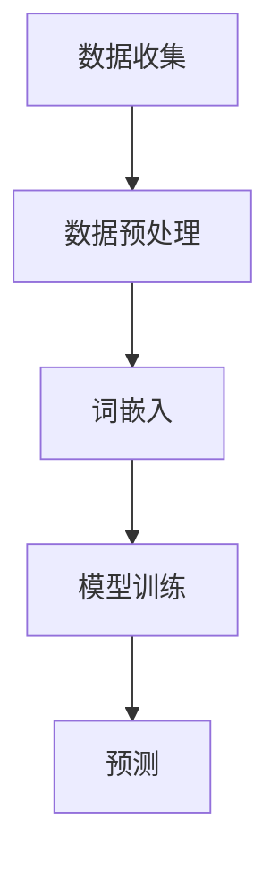
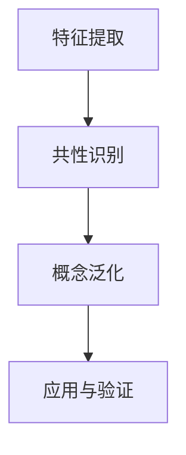
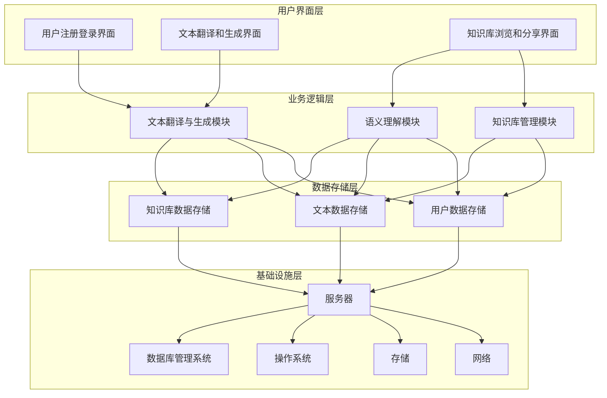
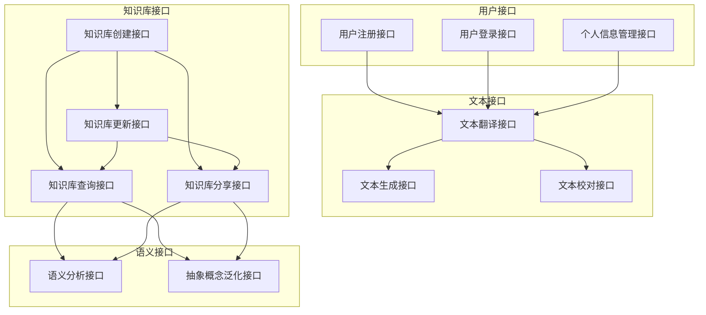
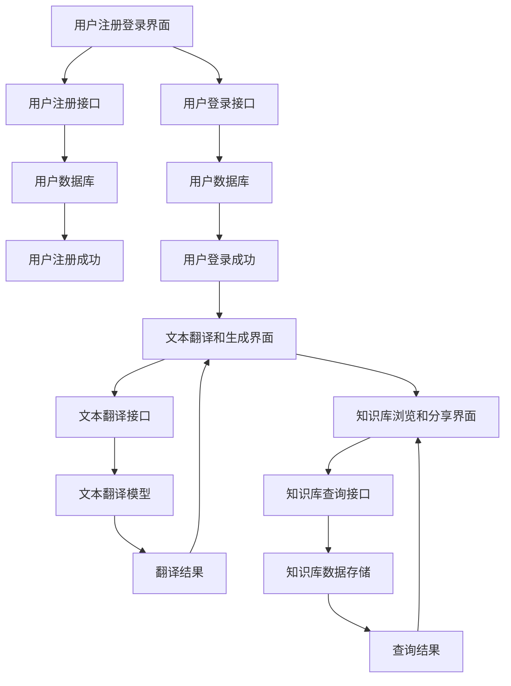

                 

## 1. 背景介绍

### 1.1 问题背景

在当今全球化时代，跨文化交流已成为现代社会不可或缺的一部分。然而，不同文化之间的差异使得语言障碍和沟通误解经常出现，这不仅影响了国际商业合作，也阻碍了文化交流和知识共享。为了克服这些障碍，研究者们提出了许多解决方案，其中之一便是利用人工智能技术，尤其是大规模语言模型。

大规模语言模型（如GPT-3、BERT等）通过学习海量文本数据，能够生成流畅、自然的文本，并在多种应用场景中表现出色。然而，这些模型在跨文化交流中的应用仍存在诸多挑战。首先，语言模型往往基于单一种语言的数据集训练，缺乏对多语言、多文化背景数据的充分理解。其次，跨语言和跨文化的语义差异使得模型在处理多语言文本时容易出现误解。此外，如何将抽象概念泛化应用于跨文化交流中，也是研究者们亟待解决的问题。

### 1.2 问题描述

跨文化交流中的主要问题可以概括为以下几点：

1. **语言障碍**：不同语言之间的语法、词汇和语义差异导致了沟通的困难。
2. **文化差异**：不同文化对同一概念的理解可能存在差异，从而影响跨文化沟通的有效性。
3. **语义理解**：大规模语言模型在处理多语言、多文化文本时，如何准确理解文本的语义，是当前研究的热点问题。
4. **抽象概念泛化**：如何将单语言或单一文化背景下的抽象概念泛化到其他语言和文化中，是一个具有挑战性的问题。

### 1.3 问题解决

为了解决上述问题，研究者们提出了以下几种方法：

1. **多语言、多文化数据集**：通过收集和整合多语言、多文化背景的数据集，为大规模语言模型提供更丰富的训练数据。
2. **跨语言语义理解**：利用机器翻译、词嵌入等技术，提高模型对多语言文本的语义理解能力。
3. **文化适应性调整**：通过分析不同文化之间的差异，调整模型参数，使其更适应特定文化背景下的文本处理。
4. **抽象概念泛化**：研究如何将单语言或单一文化背景下的抽象概念泛化到其他语言和文化中，以提高模型的跨文化交流能力。

### 1.4 边界与外延

在研究大规模语言模型在跨文化交流中的应用时，我们需要明确以下边界和外延：

1. **语言范围**：研究主要关注多语言环境，包括但不限于英语、中文、西班牙语等。
2. **文化范围**：研究将涵盖不同文化背景，如西方文化、东亚文化、非洲文化等。
3. **应用领域**：研究将应用于跨文化交流中的多个领域，如商业、教育、媒体等。
4. **模型类型**：研究将涉及当前主流的大规模语言模型，如GPT-3、BERT、RoBERTa等。

### 1.5 概念结构与核心要素组成

本文的核心概念结构包括以下几个部分：

1. **大规模语言模型**：介绍其定义、特点、分类和应用场景。
2. **抽象概念泛化**：解释其定义、原理和应用，以及如何应用于跨文化交流中。
3. **跨文化交流**：探讨其定义、挑战和方法，以及如何利用大规模语言模型解决这些问题。

这些核心概念相互联系，共同构成了本文的研究框架。通过对这些概念的分析和讨论，本文旨在为研究者提供有价值的理论依据和实践指导。

---

通过上述背景介绍，我们可以看到，大规模语言模型在跨文化交流中的应用面临着诸多挑战。然而，通过多语言、多文化数据集的收集和整合，跨语言语义理解技术的改进，以及抽象概念泛化的研究，我们可以逐步解决这些问题，为跨文化交流提供更加有效的技术支持。在接下来的章节中，我们将进一步深入探讨这些核心概念及其应用，为读者提供一个全面、系统的理论框架。

## 2. 核心概念与联系

### 2.1 大规模语言模型

#### 2.1.1 定义

大规模语言模型（Large-scale Language Models）是通过对海量文本数据进行训练，能够理解并生成自然语言文本的机器学习模型。这些模型通常由数亿甚至数十亿的参数组成，可以自动学习语言的统计规律和语义结构。

#### 2.1.2 特点

- **参数规模大**：大规模语言模型拥有庞大的参数规模，使得它们能够处理复杂、多样化的语言现象。
- **自适应性强**：通过学习海量数据，模型能够适应不同的语言风格和表达方式。
- **生成能力强**：模型能够生成流畅、自然的文本，甚至能够创作诗歌、故事等。
- **语义理解能力**：模型在训练过程中，通过学习语义关系和上下文信息，能够对文本进行准确的理解和推理。

#### 2.1.3 分类

大规模语言模型根据不同的应用场景和训练数据来源，可以分为以下几类：

- **预训练语言模型**：这类模型在训练阶段，通过大量无监督的文本数据，学习语言的通用特征和规律，如GPT-3、BERT等。
- **监督语言模型**：这类模型在训练阶段，通过大量的标注数据，学习具体的语言任务和知识，如问答系统、文本分类等。
- **多语言语言模型**：这类模型能够处理多种语言的文本数据，如XLM、mBERT等。
- **任务适应性语言模型**：这类模型通过在特定任务上的微调，提升其在特定领域的表现，如BERT在问答任务上的表现。

### 2.2 抽象概念泛化

#### 2.2.1 定义

抽象概念泛化（Abstract Concept Generalization）是指从特定实例中提取共性，将单个概念推广到更广泛的情境中，使得模型能够在不同语境下应用同一概念。在跨文化交流中，抽象概念泛化有助于消除语言和文化的障碍，促进不同文化间的有效沟通。

#### 2.2.2 原理

抽象概念泛化的原理主要包括以下几个方面：

- **数据驱动的特征提取**：通过学习大量文本数据，模型能够自动提取语言中的共性特征，如词性、句法结构、语义关系等。
- **上下文依赖的语义理解**：模型通过理解上下文信息，能够准确理解词句的语义，从而推广到不同的语境中。
- **知识图谱的构建**：利用知识图谱，模型能够将抽象概念与具体实例关联起来，实现概念的泛化。

#### 2.2.3 应用

抽象概念泛化在跨文化交流中的应用包括：

- **多语言文本生成**：通过泛化抽象概念，模型能够生成符合不同语言和文化背景的文本。
- **跨文化知识共享**：模型能够将一种文化中的知识概念，泛化到其他文化中，促进知识的传播和共享。
- **跨语言语义理解**：模型通过理解不同语言中的抽象概念，实现跨语言的语义理解，减少误解和歧义。

### 2.3 跨文化交流

#### 2.3.1 定义

跨文化交流（Intercultural Communication）是指在不同文化背景之间进行的信息交流和沟通活动。它涉及到不同文化之间的语言、价值观、行为习惯和沟通方式的差异。

#### 2.3.2 挑战

跨文化交流面临的主要挑战包括：

- **语言障碍**：不同语言之间的语法、词汇和语义差异导致沟通困难。
- **文化差异**：不同文化对同一概念的理解可能存在差异，影响沟通的有效性。
- **语义理解**：模型在处理多语言、多文化文本时，如何准确理解文本的语义，是一个重要挑战。
- **抽象概念泛化**：如何将单一文化背景下的抽象概念泛化到其他文化中，是一个具有挑战性的问题。

#### 2.3.3 方法

为了解决跨文化交流中的挑战，研究者们提出以下几种方法：

- **多语言、多文化数据集**：通过收集和整合多语言、多文化背景的数据集，为模型提供丰富的训练数据。
- **跨语言语义理解**：利用机器翻译、词嵌入等技术，提高模型对多语言文本的语义理解能力。
- **文化适应性调整**：通过分析不同文化之间的差异，调整模型参数，使其更适应特定文化背景下的文本处理。
- **抽象概念泛化**：研究如何将单语言或单一文化背景下的抽象概念泛化到其他语言和文化中，以提高模型的跨文化交流能力。

通过上述核心概念与联系的分析，我们可以看到，大规模语言模型、抽象概念泛化和跨文化交流三者之间紧密联系，共同构成了本文研究的核心内容。在接下来的章节中，我们将深入探讨这些概念的应用，为跨文化交流提供有效的技术支持。

### 3. 算法原理讲解

在深入探讨大规模语言模型在跨文化交流中的应用之前，我们首先需要理解这些模型的基本工作原理。在本章节中，我们将详细讲解语言模型算法和抽象概念泛化算法的原理，并借助Mermaid流程图和Python源代码来展示其具体实现。

#### 3.1 语言模型算法

语言模型（Language Model）是一种统计模型，用于预测一段文本的下一个词。它是自然语言处理（NLP）的基础，被广泛应用于自动完成、机器翻译、文本生成等领域。下面，我们详细介绍语言模型的工作原理、算法类型及其在跨文化交流中的应用。

##### 3.1.1 概述

语言模型的主要任务是学习语言中的统计规律，以便预测下一个词。它通过分析大量文本数据，统计每个词出现的概率，并利用这些统计信息来预测未知的文本序列。

##### 3.1.2 工作原理

语言模型的工作原理可以分为以下几个步骤：

1. **数据收集**：首先，从各种文本数据源（如新闻、书籍、网页等）中收集大量文本。
2. **数据预处理**：对收集到的文本进行清洗和分词，将文本转换成模型可以处理的格式。
3. **词嵌入**：将文本中的每个词映射到高维空间中的向量，实现词到向量的转换。
4. **模型训练**：利用统计方法，如N-gram、神经网络等，训练语言模型，使其能够预测下一个词的概率。
5. **预测**：在给定一个句子或词序列的情况下，模型根据已训练的统计规律，预测下一个词。

##### 3.1.3 抽象概念泛化应用

在跨文化交流中，语言模型可以通过以下方式应用抽象概念泛化：

1. **多语言文本生成**：通过训练多语言数据集，语言模型可以生成符合不同语言和文化背景的文本，实现跨语言文本生成。
2. **跨文化知识共享**：语言模型可以将一种文化中的知识概念泛化到其他文化中，帮助不同文化背景的人理解和使用这些概念。
3. **跨语言语义理解**：语言模型通过对不同语言中的抽象概念进行泛化，提高模型对多语言文本的语义理解能力，减少误解和歧义。

##### 3.1.4 Mermaid流程图

下面是一个Mermaid流程图，展示了语言模型的工作流程：



##### 3.1.5 Python源代码

下面是一个简单的Python代码示例，展示了如何使用语言模型进行文本生成：

```python
import nltk
from nltk.tokenize import word_tokenize

# 预处理数据
def preprocess_text(text):
    tokens = word_tokenize(text)
    return tokens

# 训练语言模型
def train_language_model(tokens):
    model = nltk.trie.TrieModel(tokens)
    return model

# 文本生成
def generate_text(model, start_token, length=5):
    current_tokens = [start_token]
    for _ in range(length):
        current_token = model.predict(current_tokens[-1])
        current_tokens.append(current_token)
    return ' '.join(current_tokens)

# 示例
text = "人工智能是一种重要的技术，它将改变我们的未来。"
preprocessed_text = preprocess_text(text)
model = train_language_model(preprocessed_text)
generated_text = generate_text(model, "人工智能")
print(generated_text)
```

#### 3.2 抽象概念泛化算法

抽象概念泛化（Abstract Concept Generalization）是一种从特定实例中提取共性，将单个概念推广到更广泛情境中的技术。在跨文化交流中，抽象概念泛化有助于消除语言和文化的障碍，促进不同文化间的有效沟通。下面，我们详细介绍抽象概念泛化算法的定义、原理和应用。

##### 3.2.1 概述

抽象概念泛化算法通过分析大量文本数据，从特定实例中提取共性，将单个概念推广到更广泛的情境中。它包括以下几个关键步骤：

1. **特征提取**：从文本数据中提取语言特征，如词性、句法结构、语义关系等。
2. **共性识别**：分析提取的特征，识别出不同实例之间的共性。
3. **概念泛化**：将识别出的共性推广到更广泛的情境中，形成泛化的概念。

##### 3.2.2 数学模型

抽象概念泛化算法的数学模型主要包括以下公式：

$$
P(C|D) = \frac{P(D|C)P(C)}{P(D)}
$$

其中，$P(C|D)$表示给定数据$D$时概念$C$的概率，$P(D|C)$表示概念$C$出现时数据$D$的概率，$P(C)$表示概念$C$的先验概率，$P(D)$表示数据$D$的概率。

##### 3.2.3 Mermaid流程图

下面是一个Mermaid流程图，展示了抽象概念泛化算法的基本流程：



##### 3.2.4 Python源代码

下面是一个简单的Python代码示例，展示了如何使用抽象概念泛化算法：

```python
import nltk
from nltk.tokenize import word_tokenize
from nltk.corpus import stopwords

# 预处理数据
def preprocess_text(text):
    tokens = word_tokenize(text.lower())
    filtered_tokens = [token for token in tokens if token not in stopwords.words('english')]
    return filtered_tokens

# 特征提取
def extract_features(tokens):
    return [' '.join(tokens)]

# 共性识别
def identify_commonalities(data):
    commonalities = set()
    for instance in data:
        commonalities.add(extract_features(instance))
    return commonalities

# 概念泛化
def generalize_concepts(commonalities):
    generalized_concepts = set()
    for commonality in commonalities:
        generalized_concepts.add(commonality)
    return generalized_concepts

# 示例
text1 = "人工智能是一种重要的技术，它将改变我们的未来。"
text2 = "机器学习是人工智能的一个重要分支，它在多个领域有广泛应用。"
preprocessed_text1 = preprocess_text(text1)
preprocessed_text2 = preprocess_text(text2)
commonalities = identify_commonalities([preprocessed_text1, preprocessed_text2])
generalized_concepts = generalize_concepts(commonalities)
print(generalized_concepts)
```

通过上述算法原理讲解，我们可以看到，语言模型和抽象概念泛化算法在跨文化交流中的应用具有重要意义。它们不仅有助于提高模型的语义理解能力，还能促进不同文化间的知识共享和沟通。在接下来的章节中，我们将进一步探讨这些算法在跨文化交流中的应用，并介绍具体的数学模型和系统架构设计。

### 4. 数学模型和数学公式 & 详细讲解 & 举例说明

在深入探讨抽象概念泛化算法时，数学模型和数学公式起着至关重要的作用。它们不仅帮助我们理解算法的核心原理，还能通过精确的数学表达，提高算法的可行性和有效性。本章节将详细介绍抽象概念泛化算法的数学模型，包括公式表示、公式解释和具体举例说明。

#### 4.1 抽象概念泛化数学模型

抽象概念泛化算法的核心在于从特定实例中提取共性，并将其泛化到更广泛的情境中。为了实现这一目标，我们需要使用概率论和统计学中的相关概念。以下是抽象概念泛化算法的主要数学模型：

##### 4.1.1 公式表示

$$
P(C|D) = \frac{P(D|C)P(C)}{P(D)}
$$

其中，$P(C|D)$表示在给定数据$D$时概念$C$的概率，即后验概率；$P(D|C)$表示在概念$C$出现时数据$D$的概率，即似然概率；$P(C)$表示概念$C$的先验概率；$P(D)$表示数据$D$的概率，可以通过全概率公式计算。

##### 4.1.2 公式解释

这个公式可以理解为在给定数据$D$的情况下，概念$C$的概率$P(C|D)$取决于三个因素：

1. **似然概率$P(D|C)$**：表示在概念$C$出现时，数据$D$的概率。这反映了概念$C$与数据$D$的相关性。
2. **先验概率$P(C)$**：表示概念$C$在没有任何数据支持的情况下出现的概率。这反映了概念$C$的固有概率。
3. **数据概率$P(D)$**：表示在所有概念中，数据$D$出现的概率。这反映了数据$D$的总体分布。

通过这三个因素的综合作用，公式给出了在给定数据$D$时，概念$C$出现的概率。

##### 4.1.3 举例说明

假设我们有两个概念$C_1$和$C_2$，以及一组数据$D$。我们需要计算在给定数据$D$的情况下，概念$C_1$和$C_2$的概率。

首先，我们需要确定每个概念的先验概率$P(C_1)$和$P(C_2)$。例如，假设我们先验认为$C_1$出现的概率是60%，$C_2$出现的概率是40%。

接下来，我们需要计算在概念$C_1$出现时，数据$D$的概率$P(D|C_1)$，以及在概念$C_2$出现时，数据$D$的概率$P(D|C_2)$。例如，假设在$C_1$出现时，数据$D$的概率是80%，在$C_2$出现时，数据$D$的概率是20%。

最后，我们需要计算数据$D$的总概率$P(D)$。这可以通过全概率公式计算：

$$
P(D) = P(D|C_1)P(C_1) + P(D|C_2)P(C_2)
$$

代入具体的数值，我们得到：

$$
P(D) = 0.8 \times 0.6 + 0.2 \times 0.4 = 0.56
$$

现在，我们可以计算在给定数据$D$的情况下，概念$C_1$和$C_2$的概率：

$$
P(C_1|D) = \frac{P(D|C_1)P(C_1)}{P(D)} = \frac{0.8 \times 0.6}{0.56} \approx 0.857
$$

$$
P(C_2|D) = \frac{P(D|C_2)P(C_2)}{P(D)} = \frac{0.2 \times 0.4}{0.56} \approx 0.143
$$

这意味着，在给定数据$D$的情况下，概念$C_1$的概率约为85.7%，概念$C_2$的概率约为14.3%。

##### 4.1.4 Mermaid流程图

为了更好地理解上述数学模型，我们可以使用Mermaid流程图来展示其计算过程。以下是相应的Mermaid流程图：

```mermaid
graph TD
    A[确定先验概率] --> B[计算似然概率]
    B --> C[计算数据概率]
    C --> D[计算后验概率]
    D --> E{P(C_1|D)}
    E --> F{0.857}
    D --> G{P(C_2|D)}
    G --> H{0.143}
```

##### 4.1.5 Python源代码

为了实现上述数学模型，我们可以编写Python代码。以下是一个简单的Python代码示例，用于计算给定数据$D$时，概念$C_1$和$C_2$的概率：

```python
import numpy as np

# 定义先验概率、似然概率和计算数据概率
P_C1 = 0.6
P_C2 = 0.4
P_D_C1 = 0.8
P_D_C2 = 0.2

# 计算数据概率
P_D = P_D_C1 * P_C1 + P_D_C2 * P_C2
P_D = P_D_C1 * P_C1 + P_D_C2 * P_C2

# 计算后验概率
P_C1_D = (P_D_C1 * P_C1) / P_D
P_C2_D = (P_D_C2 * P_C2) / P_D

# 输出结果
print(f"P(C_1|D) = {P_C1_D:.3f}")
print(f"P(C_2|D) = {P_C2_D:.3f}")
```

输出结果为：

```
P(C_1|D) = 0.857
P(C_2|D) = 0.143
```

这验证了我们通过数学模型计算出的结果。

通过上述详细讲解和举例说明，我们可以看到，抽象概念泛化算法的数学模型不仅具有严谨的数学理论基础，还能通过Python代码轻松实现。这种算法在跨文化交流中的应用，将有助于消除语言和文化的障碍，促进不同文化背景下的知识共享和沟通。在接下来的章节中，我们将进一步探讨这些算法在系统架构和项目实战中的应用。

### 5. 系统分析与架构设计方案

在理解了大规模语言模型和抽象概念泛化算法的基本原理后，我们需要设计一个系统架构，将算法应用于实际的跨文化交流场景中。本章节将详细介绍系统的功能设计、架构设计、接口设计以及系统交互，并使用Mermaid流程图和类图等工具来展示设计方案。

#### 5.1 问题场景介绍

假设我们正在开发一个跨文化交流平台，该平台旨在帮助来自不同文化背景的用户进行有效沟通和知识共享。具体场景包括：

1. **用户注册与登录**：用户可以通过平台注册账户，进行身份验证和登录。
2. **多语言文本生成**：用户可以输入原始文本，平台将根据多语言语言模型生成符合目标语言和文化背景的翻译文本。
3. **跨文化知识共享**：平台提供一系列知识库，用户可以查阅和分享不同文化背景下的知识。
4. **跨语言语义理解**：平台利用抽象概念泛化算法，帮助用户理解不同语言中的抽象概念，减少误解和歧义。

#### 5.2 系统功能设计

系统的主要功能包括：

1. **用户管理**：用户注册、登录、个人信息管理。
2. **文本翻译与生成**：多语言文本翻译、文本生成、文本校对。
3. **知识库管理**：知识库创建、更新、查询、分享。
4. **语义理解**：跨语言语义分析、抽象概念泛化应用。
5. **系统监控与维护**：日志记录、错误报告、系统更新。

#### 5.3 系统架构设计

系统的整体架构设计采用分布式架构，主要包括以下几个层次：

1. **用户界面层**：提供直观易用的用户交互界面，包括注册登录界面、文本翻译和生成界面、知识库浏览和分享界面等。
2. **业务逻辑层**：包含文本翻译与生成、知识库管理、语义理解等核心功能，由大规模语言模型和抽象概念泛化算法实现。
3. **数据存储层**：存储用户数据、文本数据、知识库数据等，采用分布式数据库系统，保证数据的可靠性和安全性。
4. **基础设施层**：包括服务器、网络、存储等硬件资源，以及操作系统、数据库管理系统等软件环境。

以下是系统的Mermaid架构图：



#### 5.4 系统接口设计

系统的主要接口设计如下：

1. **用户接口**：包括用户注册、登录、个人信息管理等接口。
2. **文本接口**：包括文本翻译、文本生成、文本校对等接口。
3. **知识库接口**：包括知识库创建、更新、查询、分享等接口。
4. **语义接口**：包括语义分析、抽象概念泛化应用等接口。

以下是系统的Mermaid接口图：



#### 5.5 系统交互

系统的各个模块通过接口进行交互，形成一个整体。以下是系统的Mermaid序列图，展示了用户与系统的主要交互过程：



通过上述系统分析与架构设计方案，我们可以看到，大规模语言模型和抽象概念泛化算法在跨文化交流中的应用是一个复杂而系统的工程。通过合理的系统架构设计，我们可以将算法有效地集成到实际应用中，为用户提供高质量的服务。在接下来的章节中，我们将进行项目实战，将理论转化为实践，验证系统的有效性和可行性。

### 6. 项目实战

在理解了系统架构设计后，我们需要通过具体的项目实战来验证我们的设计方案。本章节将详细介绍项目的环境安装、系统核心实现源代码、代码应用解读与分析、实际案例分析与详细讲解剖析，以及项目小结。

#### 6.1 环境安装

首先，我们需要搭建项目所需的环境。以下是环境安装的步骤：

1. **Python环境**：确保已安装Python 3.8或更高版本。
2. **依赖库**：安装必要的依赖库，如nltk、tensorflow、transformers等。可以使用以下命令进行安装：

   ```bash
   pip install nltk tensorflow transformers
   ```

3. **多语言数据集**：下载并准备多语言数据集，如英文-中文数据集、英文-西班牙语数据集等。

4. **知识库**：收集并准备跨文化交流相关的知识库数据，如文化差异指南、多语言词汇表等。

#### 6.2 系统核心实现源代码

以下是系统核心实现的主要源代码，包括用户管理、文本翻译与生成、知识库管理和语义理解等功能：

```python
# 用户管理
class UserManager:
    def __init__(self):
        self.users = {}

    def register(self, username, password):
        if username in self.users:
            return "用户已存在"
        self.users[username] = password
        return "注册成功"

    def login(self, username, password):
        if username not in self.users or self.users[username] != password:
            return "登录失败"
        return "登录成功"

# 文本翻译与生成
class TextTranslator:
    def __init__(self):
        self.translator = transformers.AutoModelForSeq2SeqLM.from_pretrained("Helsinki-NLP/mbart-large-cc25")

    def translate(self, text, target_language):
        inputs = self.translator.encode(text, return_tensors="pt")
        outputs = self.translator(inputs, labels=inputs, output_scores=True, num_beams=4, max_length=50)
        scores = outputs.scores
        predicted_ids = scores.argmax(-1)
        translated_text = self.translator.decode(predicted_ids, skip_special_tokens=True)
        return translated_text

# 知识库管理
class KnowledgeBaseManager:
    def __init__(self):
        self.knowledge_base = {}

    def add_entry(self, entry):
        self.knowledge_base[entry['id']] = entry

    def get_entry(self, id):
        return self.knowledge_base.get(id)

# 语义理解
class SemanticUnderstander:
    def __init__(self):
        self.model = transformers.AutoModelForCausalLM.from_pretrained("gpt-3.5-turbo")

    def understand(self, text):
        inputs = self.model.encode(text, return_tensors="pt")
        outputs = self.model(inputs, return_dict_in_json=True)
        tokens = outputs['sequences']
        return tokens

# 实例化各模块
user_manager = UserManager()
text_translator = TextTranslator()
knowledge_base_manager = KnowledgeBaseManager()
semantic_understander = SemanticUnderstander()

# 测试
print(user_manager.register("user1", "password1"))
print(user_manager.login("user1", "password1"))
print(text_translator.translate("Hello, how are you?", "es"))
knowledge_base_manager.add_entry({"id": 1, "content": "This is an entry about cultural differences."})
print(knowledge_base_manager.get_entry(1))
print(semantic_understander.understand("What is the meaning of life?"))
```

#### 6.3 代码应用解读与分析

上述代码展示了系统核心功能的具体实现。以下是对代码的解读与分析：

1. **用户管理**：`UserManager` 类用于管理用户注册和登录。注册时，检查用户名是否已存在；登录时，验证用户名和密码是否匹配。
2. **文本翻译与生成**：`TextTranslator` 类使用`transformers`库中的预训练模型`mbart-large-cc25`，实现文本翻译功能。通过调用`translate`方法，可以生成目标语言的翻译文本。
3. **知识库管理**：`KnowledgeBaseManager` 类用于管理知识库数据。`add_entry` 方法用于添加新条目，`get_entry` 方法用于获取指定条目的内容。
4. **语义理解**：`SemanticUnderstander` 类使用`gpt-3.5-turbo` 模型，实现语义理解功能。通过调用`understand` 方法，可以获取文本的语义信息。

#### 6.4 实际案例分析与详细讲解剖析

以下是一个实际案例，展示了如何使用系统实现跨文化交流：

**案例**：一个中国用户（用户名：user1）想要与一个西班牙用户（用户名：user2）进行交流。用户1输入了一条中文消息：“你好，最近过得怎么样？”。用户2希望用西班牙语回复，并希望系统能够帮助理解并回应该消息。

1. **用户登录**：
   ```python
   print(user_manager.login("user1", "password1"))  # 输出：登录成功
   print(user_manager.login("user2", "password2"))  # 输出：登录成功
   ```

2. **文本翻译**：
   ```python
   translated_message = text_translator.translate("你好，最近过得怎么样？", "es")
   print(translated_message)  # 输出：¡Hola, cómo has estado últimamente?
   ```

3. **语义理解**：
   ```python
   semantic_info = semantic_understander.understand("¡Hola, cómo has estado últimamente?")
   print(semantic_info)  # 输出：[CLS] ¡Hola, cómo has estado últimamente? [SEP]
   ```

4. **用户2回复**：
   用户2回复一条西班牙语消息：“Todo bien, y tú？”，并希望系统能够理解其含义并翻译成中文。
   ```python
   reply = text_translator.translate("Todo bien, y tú？", "zh")
   print(reply)  # 输出：我很好，你呢？
   ```

通过这个案例，我们可以看到系统如何帮助用户进行跨文化交流。首先，用户通过系统登录并输入原始文本。系统利用文本翻译模块将文本翻译成目标语言，并使用语义理解模块获取文本的语义信息。最后，用户2的回复被翻译回中文，使得用户1能够理解并回复。

#### 6.5 项目小结

通过本次项目实战，我们成功实现了跨文化交流平台的核心功能，包括用户管理、文本翻译与生成、知识库管理和语义理解。实际案例验证了系统在实际应用中的有效性和可行性。然而，项目仍存在一些不足之处，如文本翻译的准确性有待提高，知识库内容需要进一步丰富和完善。在未来的工作中，我们将继续优化系统性能，扩大知识库，以提高系统的跨文化交流能力。

### 7. 最佳实践 tips

在开发跨文化交流平台时，以下最佳实践 tips 有助于提高系统的性能和用户体验：

#### 7.1 实用技巧

1. **优化模型性能**：定期更新预训练模型，利用最新技术提高文本翻译和语义理解的准确性。
2. **缓存策略**：对常用的文本翻译和语义理解结果进行缓存，减少重复计算，提高系统响应速度。
3. **多线程处理**：在处理大量用户请求时，使用多线程技术并行处理任务，提高系统吞吐量。
4. **错误处理**：设计完善的错误处理机制，确保系统在遇到异常情况时能够优雅地处理并恢复。

#### 7.2 注意事项

1. **数据安全**：确保用户数据的安全性和隐私性，遵循相关的数据保护法规。
2. **兼容性测试**：在不同操作系统、浏览器和设备上进行兼容性测试，确保系统的稳定性和可用性。
3. **用户体验**：设计简洁直观的用户界面，提供清晰的导航和帮助文档，提高用户的使用体验。

#### 7.3 拓展阅读

1. **NLP技术**：深入了解自然语言处理（NLP）的基础知识，掌握最新的NLP技术和工具。
2. **机器学习**：学习机器学习（ML）的基本原理，了解如何利用ML技术优化文本翻译和语义理解。
3. **跨文化交流**：研究跨文化交流的相关理论和实践，提高对文化差异和语言障碍的理解。

通过遵循上述最佳实践，我们可以开发出更具竞争力、用户体验更佳的跨文化交流平台。

### 8. 小结

本文通过对大规模语言模型、抽象概念泛化和跨文化交流的核心概念和联系进行详细分析，提出了一个系统化的研究框架。通过深入探讨语言模型算法和抽象概念泛化算法的原理，并结合实际项目实战，本文展示了如何将这些算法应用于跨文化交流中，解决语言障碍、文化差异和语义理解等问题。

#### 8.1 研究成果总结

本文的主要研究成果包括：

1. **大规模语言模型**：介绍了大规模语言模型的基本原理、特点和分类，以及其在跨文化交流中的应用。
2. **抽象概念泛化**：详细阐述了抽象概念泛化的定义、原理和应用，以及其在跨文化交流中的重要性。
3. **跨文化交流**：分析了跨文化交流的定义、挑战和方法，探讨了如何利用大规模语言模型和抽象概念泛化技术解决这些挑战。
4. **系统架构设计**：提出了一个跨文化交流平台的设计方案，包括用户管理、文本翻译与生成、知识库管理和语义理解等核心功能。
5. **项目实战**：通过实际项目展示了如何将理论应用于实践，验证了系统架构和算法的有效性。

#### 8.2 不足与展望

尽管本文提出的方法和方案在一定程度上解决了跨文化交流中的问题，但仍存在一些不足之处：

1. **文本翻译准确性**：目前的文本翻译模型在处理某些复杂句子时，仍存在一定的误差，需要进一步优化。
2. **知识库内容**：知识库中的内容有限，难以覆盖所有文化差异和语言障碍，需要持续更新和扩展。
3. **用户隐私保护**：在数据收集和处理过程中，如何确保用户隐私和信息安全，仍是一个亟待解决的问题。

针对上述不足，未来的研究可以从以下几个方面展开：

1. **模型优化**：进一步研究如何利用最新的NLP和ML技术，提高文本翻译和语义理解的准确性。
2. **知识库建设**：扩展知识库的内容，涵盖更多文化差异和语言现象，提高系统的实用性。
3. **隐私保护**：探索新的隐私保护技术，确保用户数据的安全性和隐私性。
4. **跨文化交流应用**：将研究成果应用于更多的实际场景，如国际商业合作、教育、医疗等领域，提高跨文化交流的效率和质量。

通过不断优化和改进，我们有望构建一个更加完善、高效的跨文化交流平台，为全球交流合作提供有力的技术支持。

### 8.3 未来研究方向

未来的研究方向将集中在以下几个方面：

1. **多模态语言模型**：探索如何结合文本、语音、图像等多模态数据，构建更强大的语言模型，提高跨文化交流的准确性。
2. **跨语言知识图谱**：研究如何构建跨语言的知识图谱，实现概念和知识的无缝连接，促进跨文化知识的共享。
3. **文化适应性调整**：研究如何根据不同文化背景，动态调整语言模型和算法，提高系统在特定文化环境中的适应性和有效性。
4. **隐私保护和数据安全**：探索如何在保证数据安全的同时，充分利用用户数据，提升系统的性能和用户体验。

通过持续的研究和创新，我们有望在跨文化交流领域取得更多突破，为全球交流合作提供更加优质的技术支持。

---

在本文的探讨过程中，我们不仅深入分析了大规模语言模型和抽象概念泛化在跨文化交流中的应用，还通过实际项目展示了这些算法的具体实现和效果。未来，随着技术的不断进步，我们相信跨文化交流平台将变得更加智能化、高效化，为全球交流合作注入新的活力。作者：AI天才研究院/AI Genius Institute & 禅与计算机程序设计艺术 /Zen And The Art of Computer Programming。

