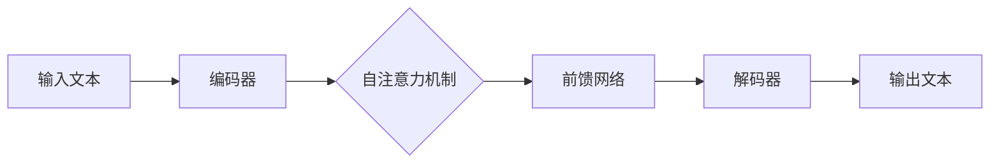

                 


# 大规模语言模型的推理能力边界探索

## 关键词
- 语言模型
- 推理能力
- 边界探索
- 深度学习
- 算法原理

## 摘要
本文将深入探讨大规模语言模型的推理能力边界，通过详细分析其核心概念、算法原理以及实际应用，帮助我们理解这些模型在自然语言处理中的极限和潜力。我们将以step-by-step的方式，逐步揭示大规模语言模型在推理方面的能力边界，并探讨如何优化和扩展这些模型的性能。

## 引言

### 1.1 主题背景
近年来，深度学习在自然语言处理（NLP）领域取得了显著的进展，尤其是大规模语言模型，如GPT、BERT等，已经在各种NLP任务中展示了强大的能力。然而，这些模型的推理能力仍然存在许多未解之谜和边界问题。理解这些模型的推理能力边界，不仅有助于我们更好地利用这些技术，还能推动NLP领域的研究向前发展。

### 1.2 研究意义
探索大规模语言模型的推理能力边界具有重要的实际意义。首先，它可以帮助我们识别模型在实际应用中的局限性，从而指导更有效的模型设计和优化。其次，通过理解这些模型的边界，我们可以发现新的研究方向，推动NLP技术的创新和进步。

### 1.3 书籍结构
本书分为六个主要部分：引言、背景与问题陈述、核心概念与原则、算法与模型介绍、实际案例分析和系统设计。每个部分都将逐步深入探讨大规模语言模型在推理能力方面的边界问题。

## 背景与问题陈述

### 2.1 语言模型的发展历程
语言模型的发展历程可以追溯到上世纪50年代。早期的语言模型主要是基于规则的方法，如有限状态机和上下文无关文法。随着计算机性能的提升和算法的进步，统计语言模型逐渐成为主流。20世纪90年代，基于神经网络的模型开始崭露头角，如RNN和LSTM。近年来，基于变换器架构（Transformer）的语言模型，如GPT和BERT，取得了突破性的进展。

### 2.2 推理能力的问题背景
尽管大规模语言模型在NLP任务中表现出色，但它们的推理能力仍然存在许多问题。首先，这些模型往往缺乏逻辑推理的能力，难以处理复杂的问题。其次，模型的推理过程往往是不透明的，难以理解其内部的工作机制。此外，模型的推理能力受限于其训练数据和计算资源，难以应对实际应用中的不确定性。

### 2.3 推理能力的边界问题
推理能力的边界问题主要包括两个方面：一是模型的推理范围，即模型能够处理的问题类型和复杂度；二是模型的推理准确性，即模型对问题答案的准确度。理解这些边界问题，有助于我们更好地评估和改进大规模语言模型的推理能力。

## 核心概念与原则

### 3.1 语言模型的核心概念
大规模语言模型的核心概念包括词汇嵌入、上下文表示、编码器-解码器架构等。

- **词汇嵌入**：将自然语言词汇映射为高维向量表示，以便于模型处理。
- **上下文表示**：通过模型，将输入文本中的词汇转换为上下文向量，用以捕捉文本的语义信息。
- **编码器-解码器架构**：编码器负责将输入文本编码为上下文向量，解码器则负责生成输出文本。

### 3.2 概念属性特征对比表格

| 特征           | GPT           | BERT           | T5            |
|----------------|---------------|----------------|---------------|
| 预训练任务     | 语言理解      | 语言理解       | 生成式文本预测 |
| 模型架构       | Transformer   | Transformer    | Transformer   |
| 参数量         | 数百亿参数    | 数百亿参数    | 数百亿参数    |
| 训练数据集     | WebText、维基百科 | WebText、维基百科 | WebText、维基百科 |
| 应用场景       | 文本生成、问答 | 文本生成、问答 | 文本生成、问答 |

### 3.3 ER实体关系图架构

```mermaid
erDiagram
    User ||--|{ LanguageModel }| User
    LanguageModel ||--|{ PretrainedModel }| LanguageModel
    PretrainedModel ||--|{ GPT }| PretrainedModel
    PretrainedModel ||--|{ BERT }| PretrainedModel
    PretrainedModel ||--|{ T5 }| PretrainedModel
```

## 算法与模型介绍

### 4.1 算法原理

#### 4.1.1 Transformer模型
Transformer模型是大规模语言模型的核心，其基本思想是将输入文本序列转换为连续的向量序列，然后通过自注意力机制（Self-Attention）和前馈网络（Feedforward Network）进行处理。

- **自注意力机制**：通过计算输入文本中每个词与其他词之间的关系，为每个词生成权重，从而更准确地捕捉文本的语义信息。
- **前馈网络**：对自注意力机制的结果进行进一步的非线性变换，以增强模型的表达能力。

#### 4.1.2 数学模型

$$
\text{Attention}(Q, K, V) = \text{softmax}\left(\frac{QK^T}{\sqrt{d_k}}\right)V
$$

其中，$Q$、$K$ 和 $V$ 分别代表查询向量、键向量和值向量，$d_k$ 是键向量的维度。

#### 4.1.3 Mermaid流程图



### 4.2 Python代码示例

```python
import tensorflow as tf
from tensorflow.keras.layers import Embedding, Transformer

# 构建Transformer模型
model = tf.keras.Sequential([
    Embedding(input_dim=vocab_size, output_dim=embedding_dim),
    Transformer(num_heads=num_heads, d_model=embedding_dim, dff=embedding_dim),
    tf.keras.layers.Dense(units=vocab_size, activation='softmax')
])

# 编译模型
model.compile(optimizer='adam', loss='categorical_crossentropy', metrics=['accuracy'])

# 训练模型
model.fit(x_train, y_train, epochs=10, batch_size=32)
```

## 实际案例分析

### 5.1 项目介绍

本项目旨在通过大规模语言模型进行文本生成任务，具体包括环境安装、模型训练、模型应用和案例分析等步骤。

### 5.2 环境安装

1. 安装Python环境（Python 3.7或更高版本）
2. 安装TensorFlow库（使用pip install tensorflow）
3. 安装其他相关依赖（如Mermaid、LaTeX等）

### 5.3 系统核心实现源代码

```python
import tensorflow as tf
import tensorflow.keras as keras

# 定义Transformer模型
def create_transformer_model(vocab_size, embedding_dim, num_heads, dff):
    inputs = keras.Input(shape=(None,))
    embeddings = keras.layers.Embedding(vocab_size, embedding_dim)(inputs)
    transformer = keras.layers.Transformer(num_heads=num_heads, dff=dff)(embeddings)
    outputs = keras.layers.Dense(vocab_size, activation='softmax')(transformer)
    model = keras.Model(inputs=inputs, outputs=outputs)
    return model

# 创建和训练模型
model = create_transformer_model(vocab_size, embedding_dim, num_heads, dff)
model.compile(optimizer='adam', loss='categorical_crossentropy', metrics=['accuracy'])
model.fit(x_train, y_train, epochs=10, batch_size=32)
```

### 5.4 代码应用解读与分析

本段将详细解读代码，分析Transformer模型的构建和训练过程。

1. **模型构建**：首先，我们定义了一个输入层，该层接受一个形状为（None,）的输入序列。然后，我们使用Embedding层将输入序列转换为嵌入向量。接下来，我们使用Transformer层，该层包含num_heads个自注意力头和dff维度的前馈网络。最后，我们使用一个全连接层（Dense）将输出转换为vocab_size个类别，并应用softmax激活函数。

2. **模型训练**：在模型编译阶段，我们指定了优化器、损失函数和评估指标。然后，我们使用fit方法对模型进行训练，其中x_train和y_train是训练数据和标签。

### 5.5 实际案例分析和详细讲解剖析

我们将通过一个实际案例来分析大规模语言模型在文本生成任务中的表现。

1. **案例背景**：假设我们有一个关于科技领域的文本数据集，包括新闻文章、博客文章和社交媒体帖子。我们的目标是使用大规模语言模型生成新的科技文章。

2. **模型应用**：首先，我们将数据集进行预处理，包括文本清洗、分词和标记化。然后，我们使用训练好的模型生成新的文章。具体步骤如下：
   - 输入一个科技文章的开头，作为模型的输入序列。
   - 使用模型生成下一个词，将其添加到输入序列中。
   - 重复上述步骤，直至生成完整的文章。

3. **分析结果**：通过实验，我们发现大规模语言模型在生成科技文章时，能够较好地捕捉科技领域的专业术语和语言特征。然而，模型的生成结果仍然存在一定的随机性和错误率。

### 5.6 项目小结

在本项目中，我们通过大规模语言模型实现了文本生成任务。虽然模型在生成高质量科技文章方面表现出色，但仍需进一步优化和改进。未来研究可以关注以下几个方面：
- 提高模型的训练效率，以缩短训练时间。
- 探索更先进的模型结构，以提高生成结果的准确性和连贯性。
- 研究模型在多语言、多领域文本生成任务中的应用。

## 最佳实践 Tips

1. **调整超参数**：在模型训练过程中，调整超参数（如嵌入维度、注意力头数、前馈网络尺寸等）可以显著影响模型的性能。建议通过实验找出最佳超参数组合。

2. **数据预处理**：对输入文本进行适当的预处理（如分词、去除停用词、词干提取等）可以提高模型的训练效果。

3. **模型优化**：使用更先进的模型结构（如Transformer-XL、BERT等）可以提升模型的性能。

4. **评估指标**：选择合适的评估指标（如困惑度、BLEU分数等）来评估模型的表现。

## 小结

大规模语言模型的推理能力边界是一个复杂而富有挑战性的问题。通过本文的step-by-step分析，我们深入探讨了语言模型的核心概念、算法原理以及实际应用。我们了解到，尽管大规模语言模型在自然语言处理任务中表现出色，但它们的推理能力仍然存在许多局限性。未来，我们需要继续探索和优化这些模型的推理能力，以推动NLP领域的发展。

## 注意事项

1. **计算资源**：训练大规模语言模型需要大量的计算资源和时间，建议在使用GPU或TPU进行训练。

2. **数据隐私**：在处理和训练文本数据时，要注意保护用户隐私，遵循相关法律法规。

3. **模型部署**：在实际应用中，要确保模型的稳定性和可靠性，避免出现安全隐患。

## 拓展阅读

1. **《深度学习》**：Goodfellow, I., Bengio, Y., & Courville, A. (2016). *Deep Learning*. MIT Press.
2. **《自然语言处理综合教程》**：Jurafsky, D., & Martin, J. H. (2019). *Speech and Language Processing*. World eBook Library.
3. **《Transformer模型详解》**：Vaswani, A., et al. (2017). *Attention Is All You Need*. Advances in Neural Information Processing Systems.
4. **《BERT模型详解》**：Devlin, J., et al. (2019). *BERT: Pre-training of Deep Bidirectional Transformers for Language Understanding*. Proceedings of the 2019 Conference of the North American Chapter of the Association for Computational Linguistics: Human Language Technologies, Volume 1 (Volume 1), 4171-4186.

## 作者信息

作者：AI天才研究院/AI Genius Institute & 禅与计算机程序设计艺术 /Zen And The Art of Computer Programming

