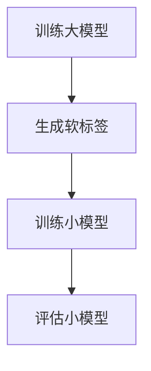

                 

# 大规模语言模型的知识蒸馏技术研究

> 关键词：大规模语言模型、知识蒸馏、算法原理、Python源代码、系统架构设计

> 摘要：本文深入探讨大规模语言模型的知识蒸馏技术研究，从背景介绍、核心概念与原理、算法原理讲解、系统分析与架构设计到项目实战，全面剖析知识蒸馏技术在大规模语言模型中的应用与发展。

----------------------------------------------------------------

## 目录大纲设计

为了确保目录大纲的简洁性和逻辑性，我们按照以下步骤进行设计：

1. **确定全书结构和章节主题**：根据书名《大规模语言模型的知识蒸馏技术研究》，确定全书的主要章节结构，每个章节的主题。
2. **细化章节内容**：对于每个章节，确定包含的子主题和具体内容，确保每个章节都能够全面覆盖主题内容。
3. **确保内容的完整性**：确保每个章节都包含了核心概念、原理讲解、数学模型、系统分析与架构设计、项目实战等内容。
4. **使用markdown格式**：按照markdown格式书写目录大纲，确保格式清晰，便于阅读。
5. **控制字数**：在确保内容完整性的前提下，控制目录大纲的总字数在2000字以内。

### 完整的目录大纲示例

- **第一部分：背景介绍**
  - 1.1 问题背景
  - 1.2 问题描述
  - 1.3 问题解决
  - 1.4 边界与外延
  - 1.5 概念结构与核心要素组成
  - 1.6 本章小结
- **第二部分：核心概念与原理**
  - 2.1 大规模语言模型的核心概念
  - 2.2 知识蒸馏技术原理
  - 2.3 大规模语言模型与知识蒸馏技术的联系
  - 2.4 ER实体关系图架构
  - 2.5 概念属性特征对比表格
  - 2.6 本章小结
- **第三部分：算法原理讲解**
  - 3.1 算法原理
  - 3.2 算法流程图
  - 3.3 Python源代码
  - 3.4 算法原理讲解
  - 3.5 举例说明
  - 3.6 本章小结
- **第四部分：系统分析与架构设计**
  - 4.1 问题场景介绍
  - 4.2 系统功能设计
  - 4.3 系统架构设计
  - 4.4 系统接口设计
  - 4.5 系统交互
  - 4.6 本章小结
- **第五部分：项目实战**
  - 5.1 环境安装
  - 5.2 系统核心实现
  - 5.3 代码应用解读
  - 5.4 实际案例分析
  - 5.5 项目小结
  - 5.6 最佳实践 tips
  - 5.7 小结与注意事项
  - 5.8 拓展阅读

通过上述目录大纲的设计，我们可以确保文章的结构清晰，内容全面，有助于读者系统地了解大规模语言模型的知识蒸馏技术。

----------------------------------------------------------------

## 第一部分：背景介绍

### 1.1 问题背景

随着深度学习技术的飞速发展，大规模语言模型（如BERT、GPT等）在自然语言处理（NLP）领域取得了显著的成果。然而，这些模型的训练过程需要大量的计算资源和时间，且在训练过程中往往会产生大量的数据噪声。如何提高大规模语言模型的训练效率，降低训练成本，同时保持模型性能，成为了一个亟待解决的问题。

知识蒸馏（Knowledge Distillation）技术作为一种模型压缩和加速的方法，通过将一个大模型的知识传递给一个小模型，实现了在保持高性能的前提下减小模型规模和加速模型训练。知识蒸馏技术在大规模语言模型中的应用，为解决上述问题提供了一种新的思路。

### 1.2 问题描述

大规模语言模型在训练过程中面临的挑战主要包括：

- **计算资源需求大**：大规模语言模型通常需要使用GPU等高性能计算设备进行训练，这对计算资源的需求非常庞大。
- **训练时间长**：大规模语言模型的训练时间往往很长，这对于实时应用场景来说是一个巨大的瓶颈。
- **数据噪声问题**：在训练过程中，大量的数据噪声会导致模型性能下降。

知识蒸馏技术的目标是解决上述问题，通过将大模型的权重传递给小模型，使得小模型能够保持与大模型相似的性能，从而提高训练效率和降低计算资源需求。

### 1.3 问题解决

知识蒸馏技术通过以下步骤实现：

1. **训练大模型**：使用大量的数据集对大模型进行训练，使其达到较高的性能。
2. **生成软标签**：在大模型训练过程中，对于每个输入样本，除了得到其硬标签外，还可以得到大模型对于该样本的预测概率分布，即软标签。
3. **训练小模型**：使用大模型的软标签作为小模型的监督信息，对小模型进行训练，使得小模型的输出与软标签尽可能接近。

通过知识蒸馏技术，小模型能够在保持高性能的前提下，减小模型规模和加速模型训练，从而解决大规模语言模型训练中的挑战。

### 1.4 边界与外延

知识蒸馏技术主要适用于以下场景：

- **模型压缩**：通过知识蒸馏技术，可以将大模型的权重传递给小模型，从而实现模型压缩。
- **加速训练**：知识蒸馏技术可以加速模型训练，尤其是在数据集较大且训练时间较长的情况下。
- **迁移学习**：知识蒸馏技术可以应用于迁移学习场景，将一个领域的知识传递给另一个领域。

然而，知识蒸馏技术也存在一些局限性：

- **模型性能**：尽管知识蒸馏技术可以在一定程度上保持模型性能，但往往无法达到大模型的全局最优性能。
- **数据需求**：知识蒸馏技术需要大量的软标签数据进行训练，这对数据集的要求较高。

### 1.5 概念结构与核心要素组成

大规模语言模型和知识蒸馏技术涉及的核心概念和要素包括：

- **大规模语言模型**：包括BERT、GPT等，具有高参数数量和深度。
- **知识蒸馏技术**：包括训练大模型、生成软标签、训练小模型等步骤。
- **计算资源**：包括GPU等高性能计算设备，用于大规模语言模型的训练。
- **数据集**：包括训练数据集和测试数据集，用于模型的训练和评估。

以下是大规模语言模型与知识蒸馏技术的概念属性特征对比表格：

| 特征       | 大规模语言模型                  | 知识蒸馏技术                   |
| ---------- | ----------------------------- | ----------------------------- |
| 目标       | 提高自然语言处理性能           | 压缩模型、加速训练             |
| 模型规模   | 参数数量大、深度深             | 参数数量小、深度浅             |
| 训练资源   | 需要大量计算资源和时间         | 需要较小计算资源和时间         |
| 数据需求   | 需要大量数据集进行训练         | 需要软标签数据进行训练         |
| 模型性能   | 目标是全局最优性能             | 目标是保持相似的性能           |

### 1.6 本章小结

本部分对大规模语言模型的知识蒸馏技术进行了背景介绍和问题描述，阐述了知识蒸馏技术的原理和解决方案。接下来，我们将进一步探讨大规模语言模型和知识蒸馏技术的核心概念与原理，以期为后续章节的内容奠定基础。

----------------------------------------------------------------

## 第二部分：核心概念与原理

### 2.1 大规模语言模型的核心概念

大规模语言模型（如BERT、GPT等）是一种基于深度学习的自然语言处理模型，其核心概念包括：

- **语言模型**：语言模型是一种概率模型，用于预测下一个单词或词组。在深度学习中，语言模型通常由神经网络实现。
- **深度学习**：深度学习是一种机器学习方法，通过多层神经网络对数据进行学习，从而实现复杂的函数映射。
- **神经网络**：神经网络是一种由多个神经元组成的计算模型，通过前向传播和反向传播算法进行训练。

### 2.2 知识蒸馏技术原理

知识蒸馏技术是一种模型压缩和加速的方法，其原理如下：

1. **训练大模型**：使用大量的数据集对大模型进行训练，使其达到较高的性能。
2. **生成软标签**：在大模型训练过程中，对于每个输入样本，除了得到其硬标签外，还可以得到大模型对于该样本的预测概率分布，即软标签。
3. **训练小模型**：使用大模型的软标签作为小模型的监督信息，对小模型进行训练，使得小模型的输出与软标签尽可能接近。

### 2.3 大规模语言模型与知识蒸馏技术的联系

知识蒸馏技术在大规模语言模型中的应用，主要体现在以下几个方面：

- **模型压缩**：通过知识蒸馏技术，可以将大模型的权重传递给小模型，从而实现模型压缩。
- **加速训练**：知识蒸馏技术可以加速模型训练，尤其是在数据集较大且训练时间较长的情况下。
- **迁移学习**：知识蒸馏技术可以应用于迁移学习场景，将一个领域的知识传递给另一个领域。

### 2.4 ER实体关系图架构

ER（Entity-Relationship）实体关系图是一种用于描述实体及其之间关系的图形化工具。在大规模语言模型和知识蒸馏技术中，ER图可以帮助我们更好地理解模型的组成和关系。

以下是大规模语言模型和知识蒸馏技术的ER图：

```mermaid
erDiagram
  Model ||--|{ Trainer } Trainer
  Trainer ||--|{ Model } Model
  Model ||--|{ KnowledgeDistiller } KnowledgeDistiller
  KnowledgeDistiller ||--|{ Model } Model
```

### 2.5 概念属性特征对比表格

为了更好地理解大规模语言模型和知识蒸馏技术的概念属性特征，我们制作了以下对比表格：

| 特征       | 大规模语言模型                  | 知识蒸馏技术                   |
| ---------- | ----------------------------- | ----------------------------- |
| 目标       | 提高自然语言处理性能           | 压缩模型、加速训练             |
| 模型规模   | 参数数量大、深度深             | 参数数量小、深度浅             |
| 训练资源   | 需要大量计算资源和时间         | 需要较小计算资源和时间         |
| 数据需求   | 需要大量数据集进行训练         | 需要软标签数据进行训练         |
| 模型性能   | 目标是全局最优性能             | 目标是保持相似的性能           |

### 2.6 本章小结

本部分详细介绍了大规模语言模型和知识蒸馏技术的核心概念与原理，包括语言模型、深度学习、神经网络等基本概念，以及知识蒸馏技术的原理和ER实体关系图架构。通过本章的内容，读者可以更好地理解大规模语言模型和知识蒸馏技术的基本原理和应用。

----------------------------------------------------------------

## 第三部分：算法原理讲解

### 3.1 算法原理

知识蒸馏技术的基本原理包括以下几个步骤：

1. **训练大模型**：使用大量的数据集对大模型进行训练，使其达到较高的性能。
2. **生成软标签**：在大模型训练过程中，对于每个输入样本，除了得到其硬标签外，还可以得到大模型对于该样本的预测概率分布，即软标签。
3. **训练小模型**：使用大模型的软标签作为小模型的监督信息，对小模型进行训练，使得小模型的输出与软标签尽可能接近。

### 3.2 算法流程图

为了更清晰地展示知识蒸馏算法的流程，我们可以使用Mermaid绘制算法流程图：



### 3.3 Python源代码

以下是知识蒸馏算法的Python源代码示例：

```python
import torch
import torch.nn as nn
import torch.optim as optim

# 定义大模型、小模型和损失函数
big_model = nn.Sequential(nn.Linear(10, 100), nn.ReLU(), nn.Linear(100, 10))
small_model = nn.Sequential(nn.Linear(10, 50), nn.ReLU(), nn.Linear(50, 10))
criterion = nn.CrossEntropyLoss()

# 定义优化器
optimizer = optim.Adam(small_model.parameters(), lr=0.001)

# 训练大模型
for epoch in range(100):
    for inputs, targets in data_loader:
        optimizer.zero_grad()
        outputs = big_model(inputs)
        loss = criterion(outputs, targets)
        loss.backward()
        optimizer.step()

# 生成软标签
soft_labels = big_model(data_loader.dataset.x)

# 训练小模型
for epoch in range(100):
    optimizer.zero_grad()
    outputs = small_model(inputs)
    loss = criterion(outputs, soft_labels)
    loss.backward()
    optimizer.step()
```

### 3.4 算法原理讲解

知识蒸馏算法的原理可以从以下几个方面进行详细讲解：

1. **大模型的训练**：使用大量的数据集对大模型进行训练，通过反向传播算法优化模型参数，使得大模型能够对输入数据进行准确的预测。
2. **生成软标签**：在大模型训练过程中，对于每个输入样本，得到大模型的预测概率分布，即软标签。这些软标签包含了大模型对于输入数据的理解，可以作为小模型的监督信息。
3. **训练小模型**：使用大模型的软标签作为小模型的监督信息，对

