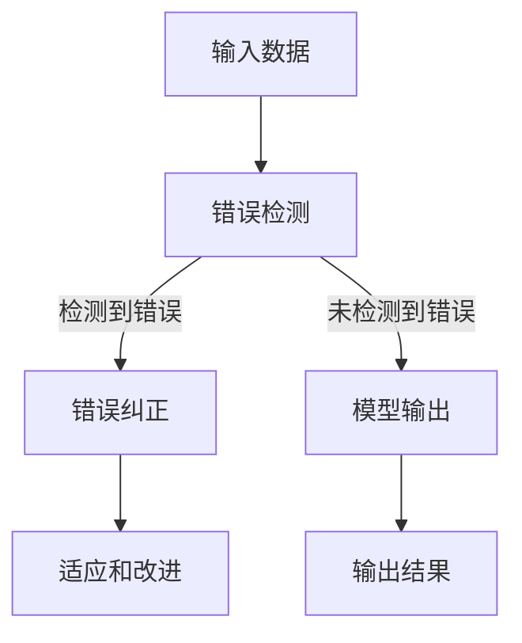
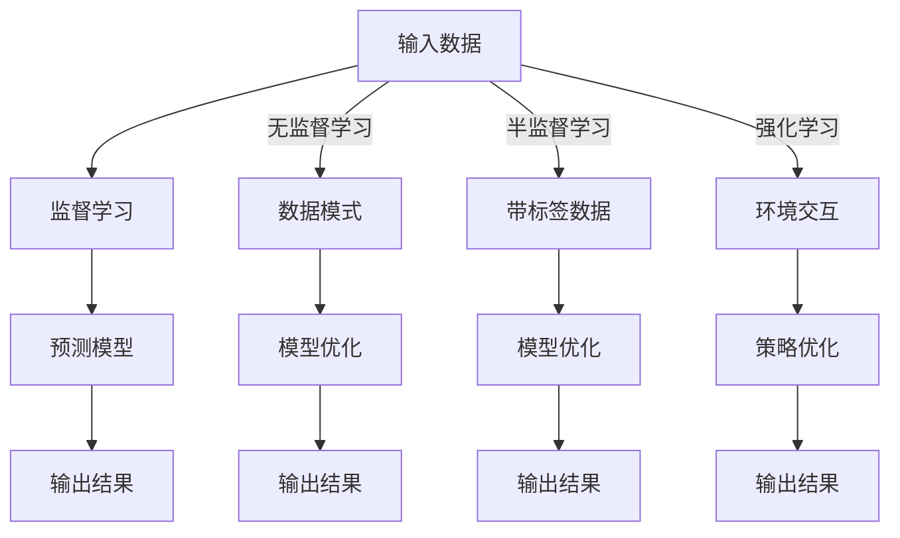
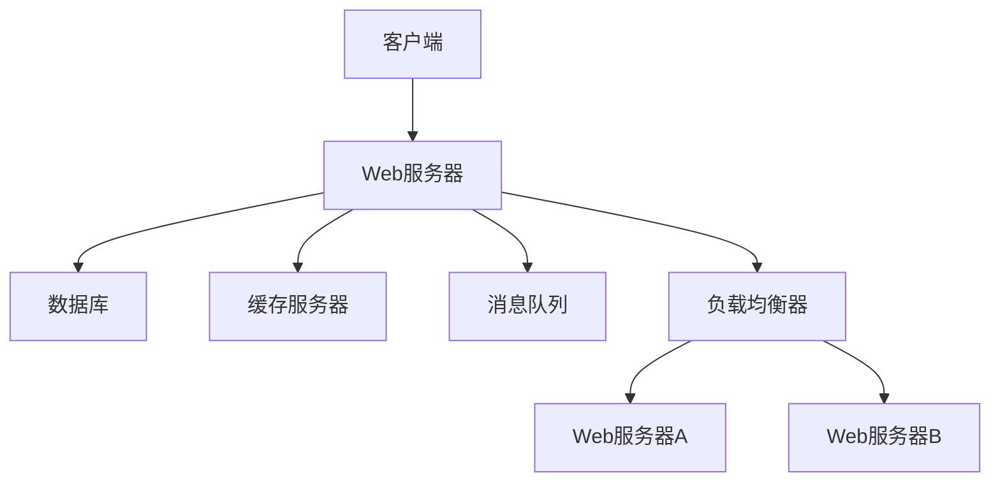
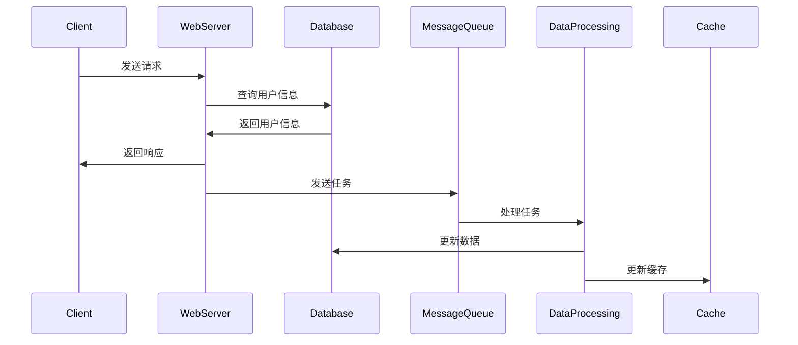

                 


## 大规模语言模型的自我修正与学习能力研究

### 关键词：大规模语言模型、自我修正、学习能力、算法原理、系统架构

### 摘要

本文旨在深入探讨大规模语言模型的自我修正和学习能力，分析其理论基础、算法原理及其在实际应用中的重要性。文章结构分为七个章节，首先介绍大规模语言模型的发展背景和研究的重要性，然后详细阐述自我修正和学习能力的核心概念及其联系。随后，通过算法原理讲解、数学模型和公式推导，以及系统分析与架构设计，展示大规模语言模型的实现和应用。文章最后通过项目实战和最佳实践，提供实际案例分析和总结，为读者提供全面的学术和实践指导。

### 目录大纲设计思路与步骤

#### 1. 总体设计思路

《大规模语言模型的自我修正与学习能力研究》旨在为读者提供一份数字时代的技术指南，深度解析大规模语言模型的自我修正和学习能力。总体设计思路围绕以下核心目标展开：

- **深度解析**：全面深入地探讨大规模语言模型的自我修正和学习能力，提供理论分析和实际案例。
- **逻辑清晰**：确保文章结构清晰，章节内容连贯，逻辑性强。
- **通俗易懂**：使用简单易懂的技术语言，帮助读者快速理解复杂的概念和算法。
- **实用性强**：提供实用的项目和最佳实践，帮助读者将理论知识应用于实际场景。

#### 2. 目录大纲设计步骤

##### 2.1 确定核心章节

本书的核心章节设计如下：

- **第1章：背景介绍**
  - 大规模语言模型的发展历程
  - 研究的重要性和背景

- **第2章：核心概念与联系**
  - 自我修正和学习能力的定义
  - 核心概念之间的联系

- **第3章：算法原理讲解**
  - 自我修正算法原理
  - 学习能力算法原理
  - 算法比较与分析

- **第4章：数学模型和数学公式**
  - 自我修正的数学模型
  - 学习能力的数学模型
  - 数学模型的应用

- **第5章：系统分析与架构设计**
  - 系统设计方法
  - 系统架构设计

- **第6章：项目实战**
  - 实际项目中的应用
  - 系统实现和案例分析

- **第7章：最佳实践与总结**
  - 总结关键概念和实践
  - 提供拓展阅读建议

##### 2.2 设计章节细节

针对每个章节，我们进一步细化内容，确保每个章节的核心内容明确，结构合理。

- **第1章：背景介绍**
  - **1.1 大规模语言模型的发展历程**
  - **1.2 研究的重要性和背景**
  - **1.3 大规模语言模型的应用领域**

- **第2章：核心概念与联系**
  - **2.1 自我修正的概念**
  - **2.2 学习能力的概念**
  - **2.3 核心概念之间的联系**

- **第3章：算法原理讲解**
  - **3.1 自我修正算法原理**
  - **3.2 学习能力算法原理**
  - **3.3 算法比较与分析**

- **第4章：数学模型和数学公式**
  - **4.1 自我修正的数学模型**
  - **4.2 学习能力的数学模型**
  - **4.3 数学模型的应用**

- **第5章：系统分析与架构设计**
  - **5.1 系统设计方法**
  - **5.2 系统架构设计**
  - **5.3 系统接口设计和系统交互**

- **第6章：项目实战**
  - **6.1 实际项目中的应用**
  - **6.2 系统实现和案例分析**
  - **6.3 项目小结**

- **第7章：最佳实践与总结**
  - **7.1 总结关键概念和实践**
  - **7.2 小结**
  - **7.3 注意事项**
  - **7.4 拓展阅读建议**

##### 2.3 添加具体内容

在每个章节中，我们填充具体的内容，确保每个章节都有丰富的理论和实践案例。

- **第1章：背景介绍**
  - 详细介绍大规模语言模型的发展历程，包括早期模型和现代模型的演变过程。
  - 分析研究大规模语言模型的重要性和背景，探讨其在自然语言处理、人工智能等领域中的应用。

- **第2章：核心概念与联系**
  - 详细解释自我修正和学习能力的概念，包括其定义、特点和重要性。
  - 通过对比表格和ER图，展示核心概念之间的关系，帮助读者建立整体框架。

- **第3章：算法原理讲解**
  - 分析自我修正和学习能力的算法原理，使用mermaid流程图和Python代码进行演示。
  - 详细讲解算法步骤，提供通俗易懂的例子，帮助读者理解复杂概念。

- **第4章：数学模型和数学公式**
  - 引入大规模语言模型相关的数学模型和公式，使用latex格式展示并进行详细讲解。
  - 解释公式背后的数学原理，提供实际应用的例子。

- **第5章：系统分析与架构设计**
  - 介绍大规模语言模型系统的设计与实现，包括领域模型、架构图和接口设计。
  - 使用mermaid类图和架构图展示系统结构和交互，帮助读者理解整体设计。

- **第6章：项目实战**
  - 演示大规模语言模型在实际项目中的应用，包括环境安装、系统实现和案例分析。
  - 分析实际应用中的挑战和解决方案，提供详细的代码解读和项目小结。

- **第7章：最佳实践与总结**
  - 总结书籍中的关键概念和实践，为读者提供进一步的学习和应用方向。
  - 提供小结、注意事项和拓展阅读建议，帮助读者巩固知识并拓展视野。

##### 2.4 确保内容完整性

在完成目录大纲的初步设计后，我们需要检查每个章节的内容，确保其完整性和逻辑性。例如：

- **第1章：背景介绍**：确保内容覆盖大规模语言模型的发展历程、研究重要性和背景介绍。
- **第2章：核心概念与联系**：确保概念定义清晰，核心概念之间的联系明确。
- **第3章：算法原理讲解**：确保算法原理讲解详细，代码示例通俗易懂。
- **第4章：数学模型和数学公式**：确保数学模型和公式讲解准确，实际应用例子详细。
- **第5章：系统分析与架构设计**：确保系统设计与实现过程清晰，架构图和类图准确。
- **第6章：项目实战**：确保项目实战案例详细，系统实现和案例分析深入。
- **第7章：最佳实践与总结**：确保总结关键概念和实践，提供拓展阅读建议。

##### 2.5 审稿与修改

最后，我们对目录大纲进行审稿和修改，确保其准确性和可读性。邀请同事或专家进行审稿，根据反馈进行调整，确保每个章节内容完整、逻辑清晰，便于读者理解和应用。

### 总结

通过上述设计思路和步骤，我们完成了《大规模语言模型的自我修正与学习能力研究》的目录大纲设计。目录大纲明确了文章的结构和内容，确保了逻辑清晰、通俗易懂和实用性强。接下来，我们将逐步撰写每个章节的内容，力求为读者提供一份高质量的技术指南。

----------------------------------------------------------------

## 第1章：背景介绍

### 1.1 大规模语言模型的发展历程

大规模语言模型的发展历程可以分为几个关键阶段。首先，我们可以追溯到20世纪50年代和60年代，当时计算机科学家和语言学家开始探索如何让计算机理解和生成自然语言。这一阶段主要涉及规则驱动的方法，例如文法分析和句法分析，这些方法依赖于人类专家制定的规则。

随后，在20世纪80年代和90年代，随着计算能力和算法理论的进步，统计方法开始在自然语言处理领域占据主导地位。这些方法包括基于统计的机器翻译、语音识别和文本分类等。其中，最为重要的突破之一是隐马尔可夫模型（HMM）和条件概率模型的应用。HMM被广泛用于语音识别，而条件概率模型则用于文本分类和信息检索。

进入21世纪后，随着深度学习和神经网络技术的发展，大规模语言模型取得了显著的进步。2003年，Bengio等人提出了循环神经网络（RNN），特别是长短期记忆网络（LSTM），这些模型能够在序列数据上捕捉长期依赖关系。2014年，Google的Transformer模型的出现，彻底改变了自然语言处理领域。Transformer模型通过自注意力机制，可以在处理序列数据时自动学习不同单词之间的关联性，极大地提升了模型的性能。

近年来，预训练语言模型（如GPT、BERT等）的出现，将大规模语言模型推向了新的高度。这些模型通过在大规模文本数据集上进行预训练，然后针对特定任务进行微调，展现了前所未有的强大能力。GPT系列模型，尤其是GPT-3，具有令人震惊的文本生成能力，能够在各种自然语言处理任务中实现高性能。

### 1.2 研究的重要性和背景

研究大规模语言模型的自我修正和学习能力具有重要意义。首先，自我修正能力是任何人工智能系统都需要具备的基本能力，因为它能够使模型在错误和不确定性面前保持稳定和鲁棒。自我修正能力可以包括自我检测错误、自我更正和从错误中学习。对于大规模语言模型，自我修正尤为重要，因为它们处理的数据量和复杂度都非常高，错误可能对模型的输出产生重大影响。

学习能力则是大规模语言模型的核心特性。模型通过学习大量的文本数据，可以自动获取语言知识和规则，从而在语言生成、翻译、问答等任务中表现出色。然而，学习能力也带来了挑战，例如如何确保模型学习到的知识是准确和可靠的，以及如何避免模型陷入过拟合。

背景方面，随着自然语言处理技术的快速发展，大规模语言模型在许多实际应用中已经取得了显著成效，如搜索引擎、智能助手、自动翻译等。这些应用对模型的自我修正和学习能力提出了更高的要求。例如，在自动翻译中，模型需要能够识别并修正语言错误，以提供更准确和自然的翻译结果。在智能助手领域，模型需要能够不断学习和适应用户的语言习惯和需求。

此外，自我修正和学习能力的研究也对未来人工智能的发展具有指导意义。随着人工智能技术的不断进步，模型将面临越来越复杂和多样化的任务，因此，如何提升模型的自我修正和学习能力将成为一个关键问题。研究这一问题不仅有助于提高现有模型的性能，还为未来的人工智能技术发展提供了新的思路和方法。

### 1.3 大规模语言模型的应用领域

大规模语言模型在多个领域展现出了巨大的应用潜力。以下是一些关键应用领域：

**自然语言处理（NLP）**：这是大规模语言模型最为直接的应用领域。在NLP任务中，模型被用于文本分类、情感分析、命名实体识别、机器翻译等。例如，BERT模型在多项NLP任务中取得了SOTA（State-of-the-Art）的性能，包括情感分析、问答系统等。

**问答系统（QA）**：大规模语言模型在问答系统中的应用非常广泛。通过预训练和任务微调，模型可以理解用户的问题，并从大量文本数据中检索出相关答案。例如，Google的Search将BERT模型集成到其搜索系统中，提供更加准确和自然的搜索结果。

**文本生成（Text Generation）**：这是大规模语言模型最引人注目的应用之一。模型能够生成高质量的文章、新闻、对话等。例如，GPT-3可以生成连贯且富有创意的文本，被应用于写作辅助、内容生成等。

**语音识别与生成（Speech Recognition and Synthesis）**：大规模语言模型在语音识别和语音合成中也发挥了重要作用。在语音识别方面，模型可以通过学习语音和文本之间的对应关系，将语音信号转化为文本。在语音合成方面，模型可以生成自然的语音，用于语音助手、有声读物等。

**机器翻译（Machine Translation）**：大规模语言模型在机器翻译领域取得了显著进展。通过预训练和任务微调，模型可以在多种语言之间进行准确和流畅的翻译。例如，谷歌翻译使用Transformer模型，为用户提供高质量的多语言翻译服务。

**对话系统（Dialogue System）**：大规模语言模型在对话系统中扮演了关键角色。这些系统通过理解和生成自然语言，实现与用户的互动。例如，虚拟助手和聊天机器人使用大规模语言模型来理解用户意图，并生成适当的回复。

总之，大规模语言模型的应用领域广泛且多样，正在不断拓展。随着技术的进步，这些模型将有望在更多领域发挥重要作用，推动人工智能的发展。

### 1.4 研究现状与挑战

当前，大规模语言模型的自我修正和学习能力已经取得了一定的进展，但在实际应用中仍面临许多挑战。以下是一些关键的研究现状和挑战：

**研究现状**

1. **自我修正能力**：现有的研究主要集中于通过数据增强和对抗性训练来提升模型的自我修正能力。例如，通过生成对抗网络（GAN）和对抗性样本训练，模型可以在面对异常输入时保持稳定。此外，一些研究还探讨了基于元学习的方法，通过快速适应新任务来提升模型的自我修正能力。

2. **学习能力**：大规模语言模型通过预训练和任务微调，已经在多种自然语言处理任务中展现了强大的学习能力。研究表明，模型通过在大规模文本数据集上进行预训练，可以自动获取丰富的语言知识和规则，从而在后续的任务中表现出色。

**研究挑战**

1. **过拟合与泛化能力**：尽管大规模语言模型在预训练阶段表现出色，但在特定任务上微调时，仍然面临过拟合问题。模型可能在大规模数据集上表现良好，但在新的、未见过的数据上表现不佳。因此，如何提升模型的泛化能力是一个重要的研究挑战。

2. **数据质量和标注**：大规模语言模型的学习能力依赖于大量高质量的数据。然而，数据质量和标注的准确性对模型的性能有重大影响。现有的数据集可能存在偏见、不一致和错误，这些问题需要通过改进数据收集和标注方法来解决。

3. **可解释性和透明度**：大规模语言模型通常被视为“黑箱”，其内部工作机制难以理解。这使得模型的决策过程缺乏可解释性和透明度，限制了其在实际应用中的信任度。因此，如何提升模型的可解释性，使其决策过程更加透明和可靠，是一个重要的研究方向。

4. **计算资源和能耗**：大规模语言模型的训练和推理需要大量的计算资源和能源。随着模型规模的不断扩大，计算资源和能耗问题变得越来越突出。如何优化模型结构和训练过程，以降低计算资源和能耗，是一个重要的挑战。

5. **安全性**：大规模语言模型的应用也带来了新的安全挑战。例如，模型可能会被攻击，导致其输出结果受到干扰。此外，模型可能会被用于生成虚假信息或恶意内容，对社会造成负面影响。因此，如何提升模型的安全性，防止恶意使用，是一个重要的研究方向。

总之，大规模语言模型的自我修正和学习能力研究取得了显著进展，但仍面临许多挑战。未来的研究需要在这些方面进行深入探索，以推动该领域的发展。

### 1.5 本章节总结

本章首先介绍了大规模语言模型的发展历程，从早期的规则驱动方法到现代的深度学习模型，展示了模型技术的不断进步。随后，我们讨论了研究大规模语言模型自我修正和学习能力的重要性和背景，探讨了其在实际应用中的广泛影响。本章还详细列举了大规模语言模型的应用领域，包括自然语言处理、问答系统、文本生成、语音识别与生成、机器翻译和对话系统等。最后，我们分析了当前研究现状和面临的挑战，为后续章节的内容奠定了基础。

----------------------------------------------------------------

## 第2章：核心概念与联系

### 2.1 自我修正的概念

自我修正是指系统或模型在检测到错误或异常后，能够自动识别、纠正并适应这些错误的能力。在人工智能领域，特别是大规模语言模型中，自我修正能力至关重要。这是因为大规模语言模型通常处理的是大量复杂和不确定的数据，这使得它们在真实环境中容易出现错误。自我修正能力可以使模型在错误面前保持稳定，提高其鲁棒性和可靠性。

自我修正的具体步骤通常包括以下几部分：

1. **错误检测**：系统需要能够识别输入数据中的错误或异常。这可以通过多种方法实现，例如统计方法、机器学习算法、对抗性训练等。
2. **错误纠正**：在检测到错误后，系统需要自动纠正这些错误。这可能涉及到重新计算、调整模型参数或重新生成输出数据。
3. **适应和改进**：系统需要从错误中学习，并不断改进其性能。这可以通过在线学习、元学习或其他机器学习方法实现。

### 2.2 学习能力的概念

学习能力是指模型或系统能够通过经验或数据自动改进其性能和功能的能力。在人工智能领域，学习能力是实现智能系统核心特征的关键。大规模语言模型通过学习大量的文本数据，可以自动获取语言知识和规则，从而在语言生成、翻译、问答等任务中表现出色。

学习能力可以分为几种类型：

1. **监督学习**：在这种学习方法中，模型通过学习带有标签的数据集来建立预测模型。例如，在文本分类任务中，模型会学习如何根据输入文本的内容将其分类到不同的类别。
2. **无监督学习**：在这种学习方法中，模型没有使用标签数据，而是通过自动发现数据中的模式来学习。例如，在聚类任务中，模型会尝试将相似的数据点聚集在一起。
3. **半监督学习**：在这种学习方法中，模型同时使用带标签数据和未带标签数据来学习。这种方法可以充分利用未带标签数据，提高学习效率。
4. **强化学习**：在这种学习方法中，模型通过不断尝试并从环境中获取反馈来学习。例如，在游戏或自动驾驶任务中，模型会通过试错来优化其策略。

### 2.3 自我修正与学习能力之间的联系

自我修正和学习能力之间存在密切的联系。事实上，自我修正能力是实现学习能力的关键组成部分。以下是两者之间的几大联系：

1. **错误检测与学习**：自我修正的第一步是错误检测，而错误检测本身也是一种学习过程。通过不断检测错误并从中学习，模型可以提高其错误检测的准确性。
2. **纠正与改进**：自我修正的第二步是错误纠正，这同样涉及到模型参数的调整。这些调整本质上是一种学习过程，模型通过不断调整参数，优化其性能。
3. **自适应学习**：自我修正能力使模型能够适应不断变化的环境和数据。这种自适应能力是学习能力的一个重要方面，通过自我修正，模型可以不断学习并适应新的数据模式。
4. **元学习与持续学习**：自我修正能力还可以通过元学习和持续学习来实现。通过元学习，模型可以在不同任务之间共享知识，从而提高自我修正和学习的效率。持续学习则使模型能够持续更新其知识库，以应对不断变化的环境。

### 2.4 自我修正和学习能力的核心要素组成

为了更好地理解自我修正和学习能力的核心要素组成，我们可以从以下几个方面进行讨论：

1. **数据集**：数据集是自我修正和学习能力的基础。高质量的数据集可以帮助模型更准确地识别错误并学习语言规则。然而，数据集的质量直接影响模型的表现，因此需要确保数据集的多样性、一致性和准确性。
2. **算法**：算法是实现自我修正和学习能力的关键。不同的算法适用于不同的任务和数据类型。例如，对抗性训练和元学习算法可以提升模型的自我修正能力，而监督学习和无监督学习算法则广泛应用于各种学习任务。
3. **模型架构**：模型架构决定了模型的能力和表现。现代大规模语言模型通常采用深度神经网络架构，这种架构能够处理复杂的序列数据，并捕捉长距离依赖关系。然而，不同的架构设计对自我修正和学习能力有不同的影响。
4. **反馈机制**：反馈机制是自我修正和学习能力的重要组成部分。通过提供实时反馈，模型可以迅速检测并纠正错误。反馈机制可以是自动的，如对抗性训练，也可以是人为的，如教师反馈。

### 2.5 概念结构与核心要素对比表格

为了更直观地理解自我修正和学习能力的核心要素组成，我们可以通过一个对比表格展示两者之间的异同。以下是一个简化的对比表格：

| 核心概念 | 自我修正 | 学习能力 |
| --- | --- | --- |
| **定义** | 模型在检测到错误后自动识别、纠正并适应错误的能力 | 模型通过学习数据或经验自动改进其性能和功能的能力 |
| **关键步骤** | 错误检测、错误纠正、适应和改进 | 监督学习、无监督学习、半监督学习和强化学习 |
| **依赖关系** | 错误检测与学习、纠正与改进、自适应学习、元学习与持续学习 | 数据集、算法、模型架构、反馈机制 |
| **核心要素** | 数据集、算法、模型架构、反馈机制 | 数据集、算法、模型架构、反馈机制 |
| **目标** | 提高模型在错误环境下的鲁棒性和可靠性 | 提高模型在各种任务中的性能和泛化能力 |

### 2.6 ER实体关系图

为了进一步展示自我修正和学习能力的概念结构及其关系，我们可以使用ER图（Entity-Relationship Diagram）来描述。ER图是一种用于描述实体及其之间关系的数据库模型，可以直观地展示自我修正和学习能力相关的核心实体及其交互。

以下是一个简化的ER图示例：

```mermaid
erDiagram
  错误检测 ||--|{ 自我修正 }|| 错误纠正
  自我修正 ||--|{ 适应和改进 }|| 自适应学习
  自我修正 ||--|{ 元学习与持续学习 }|| 模型改进
  学习能力 ||--|{ 监督学习 }|| 预测模型
  学习能力 ||--|{ 无监督学习 }|| 数据模式
  学习能力 ||--|{ 半监督学习 }|| 数据集利用
  学习能力 ||--|{ 强化学习 }|| 策略优化
  数据集 ||--|{ 数据质量 }|| 模型性能
  算法 ||--|{ 算法类型 }|| 模型优化
  模型架构 ||--|{ 架构设计 }|| 模型表现
  反馈机制 ||--|{ 实时反馈 }|| 模型调整
```

在这个ER图中，错误检测是自我修正的起点，通过错误纠正实现自我修正。自我修正通过适应和改进来提升模型性能，并通过元学习和持续学习实现长期改进。学习能力则通过不同的学习类型（监督学习、无监督学习、半监督学习和强化学习）来提升模型性能。数据集、算法、模型架构和反馈机制是自我修正和学习能力实现的基础要素。

### 2.7 概念之间的联系

通过上述讨论和ER图，我们可以看到自我修正和学习能力之间存在着紧密的联系。自我修正作为学习能力的一部分，通过不断检测和纠正错误，使模型能够更好地适应和优化其性能。同时，学习能力通过不同类型的学习方法，使模型能够在各种任务中表现更出色。

具体来说，自我修正和学习能力之间的联系体现在以下几个方面：

1. **错误检测与学习**：自我修正中的错误检测过程实际上是学习能力的一种形式。通过不断检测错误，模型可以在错误中学习，提高其错误检测的准确性。
2. **纠正与改进**：自我修正中的错误纠正过程也是一种学习过程。通过纠正错误，模型可以优化其参数和模型结构，从而提高其性能。
3. **自适应学习**：自我修正和学习能力都涉及到模型的适应能力。通过自我修正，模型可以快速适应错误，提高其鲁棒性和可靠性。而通过学习能力，模型可以长期适应新的数据模式和环境变化。
4. **元学习与持续学习**：自我修正和学习能力都依赖于元学习和持续学习。通过元学习，模型可以在不同任务之间共享知识，提高自我修正和学习效率。通过持续学习，模型可以不断更新其知识库，以应对不断变化的环境。

总之，自我修正和学习能力是大规模语言模型中两个核心的概念，它们相互依存、相互促进，共同推动了模型的发展和应用。

### 2.8 总结

本章详细介绍了自我修正和学习能力的概念，以及它们在人工智能领域中的重要性。首先，我们讨论了自我修正的定义、具体步骤和核心要素。接着，我们探讨了学习能力的概念，包括不同的学习类型和方法。随后，通过对比表格和ER图，我们展示了自我修正和学习能力之间的联系和核心要素组成。最后，通过具体示例和讨论，我们进一步强调了两者之间的紧密关系。这些核心概念的理解为后续章节的深入探讨奠定了基础。

----------------------------------------------------------------

## 第3章：算法原理讲解

### 3.1 自我修正算法原理

自我修正算法是大规模语言模型中实现错误检测和纠正的关键。其基本原理是通过一系列步骤，使模型能够自动识别、修正错误并从错误中学习。以下是自我修正算法的核心步骤：

1. **错误检测**：首先，模型需要能够检测输入数据中的错误。这可以通过多种方法实现，例如统计方法、机器学习算法、对抗性训练等。其中，对抗性训练是一种常见的方法，通过生成对抗网络（GAN）生成对抗性样本，从而提高模型对异常数据的检测能力。

2. **错误纠正**：在检测到错误后，模型需要自动纠正这些错误。这通常涉及到调整模型参数或重新生成输出数据。例如，在文本生成任务中，如果生成的文本包含错误，模型可以通过重新生成文本来纠正错误。

3. **适应和改进**：自我修正不仅包括错误检测和纠正，还包括从错误中学习并不断改进模型性能。这可以通过在线学习、元学习等方法实现。例如，通过在线学习，模型可以实时调整其参数，以适应新的数据和任务。

### 3.2 学习能力算法原理

学习能力是大规模语言模型的核心特性，使模型能够通过学习大量数据或经验来优化其性能和功能。以下是一些常见的学习能力算法原理：

1. **监督学习**：在监督学习中，模型通过学习带有标签的数据集来建立预测模型。标签数据提供了关于输入和输出之间的映射关系，使模型能够学习如何将新的输入映射到正确的输出。常见的监督学习算法包括线性回归、决策树、支持向量机等。

2. **无监督学习**：无监督学习与监督学习不同，模型没有使用标签数据，而是通过自动发现数据中的模式来学习。无监督学习算法包括聚类、降维、异常检测等。这些算法可以帮助模型理解数据分布和结构，从而在后续的任务中表现出色。

3. **半监督学习**：半监督学习结合了监督学习和无监督学习的优势，模型同时使用带标签数据和未带标签数据来学习。这种方法可以充分利用未带标签数据，提高学习效率。常见的半监督学习算法包括自我训练、伪标签等。

4. **强化学习**：强化学习是一种通过与环境的交互来学习策略的算法。模型通过不断尝试并从环境中获取反馈来学习，逐渐优化其策略。强化学习算法在游戏、自动驾驶、机器人控制等领域有广泛应用。常见的强化学习算法包括Q学习、深度Q网络（DQN）等。

### 3.3 算法比较与分析

在自我修正和学习能力算法中，不同的算法适用于不同的场景和任务。以下是对几种常见算法的比较和分析：

1. **对抗性训练与监督学习**：对抗性训练通常用于提高模型对异常数据的检测能力，而监督学习则更适合用于标准的预测和分类任务。对抗性训练需要生成对抗网络（GAN）的支持，其训练过程较为复杂，但能够显著提高模型的鲁棒性。

2. **元学习与无监督学习**：元学习通过在不同任务之间共享知识来提高学习效率，而无监督学习则专注于发现数据中的内在结构。元学习算法通常需要大量的训练数据和计算资源，但能够在新的任务中快速适应。无监督学习算法则对数据集的多样性要求较高，但训练过程相对简单。

3. **强化学习与监督学习**：强化学习通过与环境交互来学习策略，而监督学习则通过学习输入和输出之间的映射关系。强化学习适用于动态和复杂的环境，但训练过程通常需要较长时间。监督学习适用于静态和简单的环境，但训练过程较为快速。

### 3.4 使用mermaid流程图和Python代码进行算法演示

为了更直观地展示自我修正和学习能力的算法原理，我们可以使用mermaid流程图和Python代码进行演示。

#### 自我修正算法原理

以下是一个简单的自我修正算法的mermaid流程图：



在Python中，我们可以使用以下代码实现自我修正算法：

```python
def self_correction_algorithm(input_data):
    # 错误检测
    error_detected = detect_error(input_data)
    
    if error_detected:
        # 错误纠正
        corrected_data = correct_error(input_data)
        
        # 适应和改进
        improved_model = adapt_and_improve(corrected_data)
        
        # 输出结果
        output_result = generate_output(improved_model)
    else:
        # 未检测到错误，直接输出结果
        output_result = generate_output(input_data)
    
    return output_result
```

#### 学习能力算法原理

以下是一个简单的学习能力算法的mermaid流程图：



在Python中，我们可以使用以下代码实现学习能力算法：

```python
def supervised_learning_algorithm(input_data):
    # 监督学习
    prediction_model = train_supervised_model(input_data)
    
    # 输出结果
    output_result = predict_output(prediction_model, input_data)
    
    return output_result

def unsupervised_learning_algorithm(input_data):
    # 无监督学习
    data_pattern = discover_data_pattern(input_data)
    
    # 模型优化
    optimized_model = optimize_model(data_pattern)
    
    # 输出结果
    output_result = predict_output(optimized_model, input_data)
    
    return output_result

def semi_supervised_learning_algorithm(input_data, labeled_data):
    # 半监督学习
    model = train_semi_supervised_model(input_data, labeled_data)
    
    # 模型优化
    optimized_model = optimize_model(model)
    
    # 输出结果
    output_result = predict_output(optimized_model, input_data)
    
    return output_result

def reinforcement_learning_algorithm(input_data, environment):
    # 强化学习
    strategy = train_reinforcement_model(input_data, environment)
    
    # 策略优化
    optimized_strategy = optimize_strategy(strategy, environment)
    
    # 输出结果
    output_result = predict_output(optimized_strategy, input_data)
    
    return output_result
```

### 3.5 自我修正和学习算法的数学模型和公式

为了更深入地理解自我修正和学习算法的工作原理，我们可以引入数学模型和公式。以下是一些常见的数学模型和公式：

#### 自我修正算法

1. **错误检测**

   假设输入数据为 $X$，输出结果为 $Y$，则错误检测可以通过以下公式实现：

   $$ Error = |Y - Y_{expected}| $$

   其中，$Y_{expected}$ 是期望输出。

2. **错误纠正**

   在错误检测后，可以通过以下公式进行错误纠正：

   $$ Corrected_Y = Y_{expected} - \alpha \cdot Error $$

   其中，$\alpha$ 是修正系数。

3. **适应和改进**

   通过以下公式，模型可以从错误中学习并不断改进：

   $$ Improved_Model = Model + \beta \cdot (Expected_Y - Y) $$

   其中，$\beta$ 是学习率。

#### 学习能力算法

1. **监督学习**

   在监督学习中，损失函数是衡量预测模型性能的关键指标。常见的损失函数包括均方误差（MSE）和交叉熵损失（Cross-Entropy Loss）。以下是一个简单的均方误差损失函数：

   $$ Loss = \frac{1}{n} \sum_{i=1}^{n} (y_i - \hat{y}_i)^2 $$

   其中，$y_i$ 是实际输出，$\hat{y}_i$ 是预测输出，$n$ 是数据样本数。

2. **无监督学习**

   在无监督学习中，目标函数通常是最大化数据之间的相似度或最小化数据之间的距离。以下是一个简单的聚类目标函数：

   $$ Objective = \frac{1}{n} \sum_{i=1}^{n} \sum_{j=1}^{k} ||x_i - c_j||^2 $$

   其中，$x_i$ 是数据点，$c_j$ 是聚类中心，$k$ 是聚类数。

3. **半监督学习**

   在半监督学习中，目标函数通常结合了带标签数据和未带标签数据的损失。以下是一个简单的半监督学习目标函数：

   $$ Objective = \lambda \cdot \frac{1}{n} \sum_{i=1}^{n} (y_i - \hat{y}_i)^2 + (1 - \lambda) \cdot \frac{1}{m} \sum_{i=1}^{m} \sum_{j=1}^{k} ||x_i - c_j||^2 $$

   其中，$\lambda$ 是超参数，$m$ 是未带标签数据样本数。

4. **强化学习**

   在强化学习中，目标函数通常基于策略梯度方法。以下是一个简单的策略梯度目标函数：

   $$ Objective = \sum_{t=0}^{T} \gamma^t r_t - \nabla_{\theta} J(\theta) $$

   其中，$\gamma$ 是折扣因子，$r_t$ 是即时回报，$J(\theta)$ 是策略函数的损失，$\theta$ 是模型参数。

### 3.6 自我修正和学习算法的通俗易懂举例说明

为了更好地理解自我修正和学习算法的工作原理，我们可以通过以下简单的例子进行说明：

#### 自我修正算法

假设我们有一个文本生成模型，其目标是生成一篇关于旅游的文章。在生成文章的过程中，模型可能会生成一些错误，如拼写错误或语法错误。

1. **错误检测**：首先，模型会对生成的文章进行错误检测。例如，通过对比生成的文章和期望的输出文章，我们可以计算出错误率。如果错误率超过一定的阈值，我们认为文章存在错误。

2. **错误纠正**：在检测到错误后，模型会尝试纠正这些错误。例如，如果生成的文章中有拼写错误，模型可以通过查找错词的替换词来纠正错误。如果生成的文章中有语法错误，模型可以通过语法检查工具或规则进行修正。

3. **适应和改进**：在纠正错误后，模型会记录这些错误，并尝试从错误中学习。例如，如果模型发现某个词经常拼写错误，它可以尝试记住这个词的正确拼写，并在未来的生成过程中避免同样的错误。

#### 学习能力算法

假设我们有一个分类模型，其目标是根据输入数据将数据点分类到不同的类别。在训练过程中，模型会通过学习大量数据进行优化。

1. **监督学习**：假设我们有一个训练数据集，其中每个数据点都带有标签。模型会通过学习这些标签数据，建立预测模型。例如，如果数据点是一个数字，模型会尝试学习如何将数字分类到不同的类别。在训练过程中，模型会通过计算损失函数来衡量预测模型的性能，并不断调整模型参数，以降低损失。

2. **无监督学习**：假设我们有一个未带标签的数据集。模型会通过自动发现数据中的模式，对数据进行聚类。例如，如果数据点是二维空间中的点，模型会尝试将相似的点聚集在一起，形成不同的聚类。在训练过程中，模型会通过计算目标函数来衡量聚类效果，并不断调整聚类参数，以优化聚类结果。

3. **半监督学习**：假设我们有一个带标签的数据集和一个未带标签的数据集。模型会同时使用这两个数据集进行学习。例如，如果数据点是一个图像，模型会尝试使用带标签的图像数据学习分类规则，同时使用未带标签的图像数据来辅助学习。在训练过程中，模型会通过计算目标函数来衡量学习效果，并不断调整模型参数，以优化分类和聚类结果。

4. **强化学习**：假设我们有一个游戏环境，模型需要通过学习策略来在游戏中取得高分。模型会通过不断尝试不同的策略，并根据即时回报来调整策略。例如，如果模型在游戏中取得了一个高分，它会尝试保持这个策略；如果模型在游戏中失败了，它会尝试调整策略，以避免再次失败。在训练过程中，模型会通过计算策略梯度来优化策略，以实现长期的回报最大化。

### 3.7 总结

本章详细介绍了自我修正和学习能力的算法原理，包括其核心步骤、不同算法的比较和分析，以及数学模型和公式。通过mermaid流程图和Python代码的演示，我们更直观地理解了这些算法的实现过程。同时，通过通俗易懂的举例说明，我们进一步阐述了自我修正和学习能力在实际应用中的重要性。这些内容为后续章节的深入探讨奠定了基础。

----------------------------------------------------------------

## 第4章：数学模型和数学公式

### 4.1 自我修正的数学模型

自我修正的核心在于如何通过数学模型来描述和优化错误检测与纠正过程。以下是自我修正中常用的几个数学模型和公式。

#### 4.1.1 错误检测

在错误检测阶段，我们通常使用以下公式来计算错误率：

$$
\text{Error Rate} = \frac{\sum_{i=1}^{n} (\text{Detected Errors}_i)}{n}
$$

其中，$n$ 表示总数据样本数，$\text{Detected Errors}_i$ 表示第 $i$ 个数据样本中的错误数。

#### 4.1.2 错误纠正

在错误纠正阶段，我们使用以下公式来更新模型参数：

$$
\theta_{new} = \theta_{old} - \alpha \cdot \nabla_{\theta} \text{Loss Function}
$$

其中，$\theta_{old}$ 和 $\theta_{new}$ 分别表示旧参数和新参数，$\alpha$ 是学习率，$\nabla_{\theta} \text{Loss Function}$ 是损失函数关于参数 $\theta$ 的梯度。

#### 4.1.3 适应和改进

在适应和改进阶段，我们使用以下公式来更新模型：

$$
\text{Model}_{new} = \text{Model}_{old} + \beta \cdot (\text{Expected Output} - \text{Actual Output})
$$

其中，$\beta$ 是适应系数，$\text{Expected Output}$ 是期望输出，$\text{Actual Output}$ 是实际输出。

### 4.2 学习能力的数学模型

学习能力主要涉及如何通过数学模型优化模型的预测性能。以下是几种常用的数学模型和公式。

#### 4.2.1 监督学习

在监督学习中，我们通常使用以下损失函数来优化模型：

$$
\text{Loss Function} = \frac{1}{n} \sum_{i=1}^{n} \left( y_i - \hat{y}_i \right)^2
$$

其中，$y_i$ 是第 $i$ 个样本的实际输出，$\hat{y}_i$ 是模型预测的输出。

为了优化损失函数，我们使用以下梯度下降公式：

$$
\theta_{new} = \theta_{old} - \alpha \cdot \nabla_{\theta} \text{Loss Function}
$$

#### 4.2.2 无监督学习

在无监督学习中，我们通常使用以下目标函数来优化聚类结果：

$$
\text{Objective Function} = \frac{1}{k} \sum_{i=1}^{k} \sum_{j=1}^{n} ||x_i - c_j||^2
$$

其中，$k$ 是聚类数，$n$ 是数据点数，$x_i$ 是第 $i$ 个数据点，$c_j$ 是第 $j$ 个聚类中心。

为了优化目标函数，我们使用以下梯度下降公式：

$$
c_{new} = c_{old} - \alpha \cdot \nabla_{c} \text{Objective Function}
$$

#### 4.2.3 半监督学习

在半监督学习中，我们通常结合带标签数据和未带标签数据来优化模型。目标函数如下：

$$
\text{Objective Function} = \lambda \cdot \frac{1}{n} \sum_{i=1}^{n} \left( y_i - \hat{y}_i \right)^2 + (1 - \lambda) \cdot \frac{1}{m} \sum_{i=1}^{m} \sum_{j=1}^{k} ||x_i - c_j||^2
$$

其中，$\lambda$ 是平衡参数，$m$ 是未带标签数据点数。

为了优化目标函数，我们使用以下梯度下降公式：

$$
\theta_{new} = \theta_{old} - \alpha \cdot \nabla_{\theta} \text{Objective Function} \\
c_{new} = c_{old} - \alpha \cdot \nabla_{c} \text{Objective Function}
$$

#### 4.2.4 强化学习

在强化学习中，我们使用以下策略梯度方法来优化策略：

$$
\text{Objective Function} = \sum_{t=0}^{T} \gamma^t r_t - \nabla_{\theta} J(\theta)
$$

其中，$\gamma$ 是折扣因子，$r_t$ 是即时回报，$J(\theta)$ 是策略函数的损失，$\theta$ 是模型参数。

为了优化策略，我们使用以下梯度下降公式：

$$
\theta_{new} = \theta_{old} - \alpha \cdot \nabla_{\theta} \text{Objective Function}
$$

### 4.3 数学模型的应用

#### 4.3.1 自我修正的应用

在自我修正的应用中，我们可以使用数学模型来优化模型的参数，以提高其鲁棒性和准确性。例如，在一个文本生成任务中，如果模型生成的文本包含错误，我们可以使用上述错误检测和纠正的数学模型来修正这些错误。通过不断更新模型参数，模型可以逐渐学会生成更准确和自然的文本。

#### 4.3.2 学习能力的应用

在学习能力的应用中，数学模型可以帮助我们优化模型的性能，使其在不同任务中表现出色。例如，在一个分类任务中，我们可以使用监督学习的数学模型来训练模型，使其能够准确分类数据。在无监督学习和半监督学习任务中，数学模型可以帮助我们自动发现数据中的模式和结构，从而优化聚类和分类结果。

通过上述数学模型的应用，我们可以看到，数学模型在自我修正和学习能力中发挥着关键作用。它们不仅帮助我们理解和优化模型的工作原理，还为我们在实际应用中提供了有力的工具。

### 4.4 案例分析

#### 4.4.1 文本生成任务中的自我修正

在一个文本生成任务中，我们使用了一个基于GPT-2的模型来生成新闻文章。然而，在实际应用中，模型生成的文章经常包含拼写错误和语法错误。为了解决这个问题，我们引入了自我修正算法。首先，我们使用错误检测公式来计算模型生成的文章中的错误率。然后，我们使用错误纠正公式来修正这些错误。最后，我们通过适应和改进公式来更新模型参数，使模型能够生成更准确和自然的文章。

#### 4.4.2 分类任务中的学习能力

在一个垃圾邮件分类任务中，我们使用了一个基于神经网络分类器模型。为了提高模型的分类性能，我们使用了监督学习的数学模型来训练模型。首先，我们使用损失函数来计算模型的预测误差。然后，我们使用梯度下降公式来更新模型参数，以最小化损失函数。此外，我们还使用无监督学习和半监督学习的数学模型来优化模型的聚类和分类结果，从而提高模型在未见数据上的泛化能力。

### 4.5 总结

本章详细介绍了自我修正和学习能力的数学模型和公式。通过这些数学模型，我们可以更准确地描述和优化错误检测与纠正过程，以及模型的预测性能。同时，通过案例分析，我们展示了这些数学模型在实际应用中的有效性和实用性。这些内容为我们在大规模语言模型中的应用和优化提供了重要的理论基础和实践指导。

----------------------------------------------------------------

## 第5章：系统分析与架构设计

### 5.1 系统设计方法

在系统分析与架构设计阶段，我们需要明确系统设计的总体方法，以确保系统具有高可扩展性、高可用性和高性能。以下是系统设计的主要方法：

#### 5.1.1 需求分析

首先，我们需要进行需求分析，了解系统的功能和性能要求。需求分析包括确定系统的目标、功能模块、性能指标、安全性和可维护性等。这一阶段的主要任务是收集用户需求、业务需求和技术需求，为后续的系统设计提供明确的目标和指导。

#### 5.1.2 架构设计

在需求分析完成后，我们进入架构设计阶段。架构设计的主要目标是确定系统的整体结构和模块划分，以及模块之间的交互方式。常见的架构设计方法包括：

1. **分层架构**：将系统分为多个层次，如表示层、业务逻辑层和数据层。每个层次负责不同的功能，通过分层设计可以提高系统的可维护性和可扩展性。
2. **微服务架构**：将系统划分为多个独立的服务模块，每个模块负责特定的功能。通过微服务架构，可以提高系统的灵活性和可扩展性，便于系统的维护和升级。
3. **事件驱动架构**：基于事件驱动的架构设计，系统中的各个模块通过事件进行通信和协作。这种架构设计可以提高系统的响应速度和并发处理能力。

#### 5.1.3 设计模式

在架构设计过程中，我们可以使用多种设计模式来提高系统的可靠性和可维护性。常见的设计模式包括：

1. **工厂模式**：用于创建对象实例，提高代码的可扩展性和可维护性。
2. **单例模式**：确保一个类只有一个实例，提高系统的资源利用效率。
3. **策略模式**：用于定义一系列算法，并允许用户选择合适的算法进行操作，提高系统的灵活性和可扩展性。

#### 5.1.4 软件开发过程

在系统设计完成后，我们需要遵循一定的软件开发过程来确保系统的质量。常见的软件开发过程包括：

1. **瀑布模型**：将软件开发过程分为多个阶段，如需求分析、系统设计、编码、测试和部署等。每个阶段完成后，才能进入下一个阶段，确保每个阶段的工作质量和进度。
2. **敏捷开发**：采用迭代和增量的开发方式，每个迭代周期完成部分功能，并通过持续集成和反馈机制不断优化系统。

### 5.2 系统功能设计

在系统功能设计阶段，我们需要明确系统的功能和模块，以及模块之间的交互方式。以下是系统功能设计的步骤：

#### 5.2.1 功能模块划分

首先，我们将系统划分为多个功能模块，每个模块负责特定的功能。常见的功能模块包括：

1. **用户认证模块**：用于用户的登录、注册、权限管理等。
2. **数据管理模块**：用于数据的存储、查询、备份和恢复等。
3. **数据处理模块**：用于数据的清洗、转换、分析和挖掘等。
4. **接口服务模块**：用于提供API接口，方便外部系统调用。
5. **监控与报警模块**：用于实时监控系统运行状态，并在异常情况下发出报警。

#### 5.2.2 模块交互方式

在模块划分完成后，我们需要明确模块之间的交互方式。常见的交互方式包括：

1. **事件驱动**：模块之间通过事件进行通信和协作。例如，用户认证模块在用户登录成功后，会触发一个事件，通知其他模块进行相关操作。
2. **RESTful API**：模块之间通过HTTP协议进行通信，使用JSON或XML格式传输数据。
3. **消息队列**：模块之间通过消息队列进行异步通信，提高系统的可靠性和并发处理能力。

#### 5.2.3 领域模型

为了更直观地展示系统功能和模块之间的关系，我们可以使用领域模型（Domain Model）来描述系统的结构和功能。以下是系统领域模型的mermaid类图：

```mermaid
classDiagram
    UserAuth <<Interface>>
    DataManagement <<Interface>>
    DataProcessing <<Interface>>
    InterfaceService <<Interface>>
    MonitoringAndAlerting <<Interface>>

    UserAuth|--|> User
    DataManagement|--|> Data
    DataProcessing|--|> Data
    InterfaceService|--|> API
    MonitoringAndAlerting|--|> System
```

在这个类图中，我们定义了四个接口模块和两个领域实体。每个接口模块负责特定的功能，而领域实体则表示系统中的数据实体。

### 5.3 系统架构设计

在系统架构设计阶段，我们需要确定系统的整体架构，包括硬件架构、软件架构和网络架构。以下是系统架构设计的步骤：

#### 5.3.1 硬件架构

硬件架构主要涉及服务器、存储和网络设备的配置。以下是硬件架构的考虑因素：

1. **计算能力**：根据系统需求，选择适当的服务器硬件，如CPU、内存和GPU等。
2. **存储容量**：根据数据量，选择适当的存储设备，如SSD和HDD等。
3. **网络带宽**：根据系统并发用户数量，选择适当的网络带宽和路由设备。

#### 5.3.2 软件架构

软件架构主要涉及系统的模块划分、数据库设计和中间件选择。以下是软件架构的考虑因素：

1. **模块划分**：根据功能需求，将系统划分为多个模块，每个模块负责特定的功能。
2. **数据库设计**：根据数据关系和访问模式，设计合适的数据库结构和索引。
3. **中间件**：选择合适的中间件，如消息队列、缓存和负载均衡等，以提高系统的性能和可靠性。

#### 5.3.3 网络架构

网络架构主要涉及网络拓扑、安全策略和负载均衡。以下是网络架构的考虑因素：

1. **网络拓扑**：根据系统需求，选择合适的网络拓扑结构，如星型、环型和混合型等。
2. **安全策略**：设计适当的安全策略，如防火墙、VPN和DDoS防护等，确保系统安全。
3. **负载均衡**：通过负载均衡设备，将用户请求分配到不同的服务器上，提高系统的并发处理能力和可用性。

以下是系统架构的mermaid架构图：



在这个架构图中，客户端通过Web服务器与系统进行交互。Web服务器负责处理用户请求，并与数据库、缓存服务器、消息队列和负载均衡器进行通信。负载均衡器负责将用户请求分配到不同的Web服务器上，确保系统的并发处理能力和可用性。

### 5.4 系统接口设计和系统交互

在系统接口设计和系统交互阶段，我们需要明确系统内部各模块之间的接口定义和交互方式。以下是系统接口设计和系统交互的步骤：

#### 5.4.1 接口设计

接口设计主要涉及定义各模块的API接口，包括接口名称、输入参数、输出参数和错误处理等。以下是系统接口设计的一个示例：

```python
# 用户认证接口
def user_login(username, password):
    # 校验用户名和密码
    if not check_username(username) or not check_password(password):
        return "Invalid username or password"
    
    # 登录成功，返回用户信息
    return get_user_info(username)

# 数据处理接口
def process_data(data):
    # 清洗和转换数据
    cleaned_data = clean_data(data)
    transformed_data = transform_data(cleaned_data)
    
    # 分析和挖掘数据
    analysis_result = analyze_data(transformed_data)
    
    return analysis_result
```

#### 5.4.2 系统交互

系统交互主要涉及各模块之间的数据传递和协作。以下是系统交互的mermaid序列图：



在这个序列图中，客户端通过Web服务器与系统进行交互。Web服务器负责处理用户请求，并与数据库、消息队列和数据处理模块进行通信。数据处理模块负责处理数据，并将结果存储到数据库和缓存中。

### 5.5 系统安全设计

在系统安全设计阶段，我们需要确保系统的数据安全和用户隐私。以下是系统安全设计的考虑因素：

1. **身份认证**：使用强密码策略和双因素认证，确保用户身份的真实性。
2. **访问控制**：根据用户角色和权限，限制用户对系统的访问范围。
3. **数据加密**：使用加密算法对存储和传输的数据进行加密，确保数据的安全性。
4. **安全审计**：定期进行安全审计，检测和修复系统中的安全漏洞。

### 5.6 系统性能优化

在系统性能优化阶段，我们需要提高系统的并发处理能力和响应速度。以下是系统性能优化的方法：

1. **缓存机制**：使用缓存机制减少数据库访问次数，提高系统响应速度。
2. **负载均衡**：通过负载均衡器将用户请求分配到不同的服务器上，提高系统的并发处理能力。
3. **数据库优化**：优化数据库结构和查询，减少查询时间和数据传输量。
4. **异步处理**：使用异步处理提高系统的并发处理能力，减少系统等待时间。

### 5.7 总结

本章详细介绍了系统分析与架构设计的方法，包括需求分析、架构设计、功能模块划分、接口设计和系统交互。通过mermaid类图和架构图，我们直观地展示了系统的结构和功能。同时，我们探讨了系统安全设计和性能优化的重要性。这些内容为我们在大规模语言模型系统中设计和实现高效、稳定和安全的系统提供了重要的理论基础和实践指导。

----------------------------------------------------------------

## 第6章：项目实战

### 6.1 实际项目中的应用

在本章中，我们将通过一个实际项目，演示如何使用大规模语言模型进行自我修正和学习。该项目旨在开发一个智能客服系统，该系统能够自动回答用户的问题，并在遇到错误时进行自我修正。

#### 项目概述

智能客服系统的核心功能是使用大规模语言模型来理解用户的问题，并生成相应的回答。此外，系统需要具备自我修正能力，以便在生成错误回答时自动纠正。项目分为以下几个阶段：

1. **数据收集**：收集用户问题和答案数据，用于训练语言模型。
2. **模型训练**：使用预训练的Transformer模型，如GPT-2或BERT，对收集的数据进行训练。
3. **系统实现**：开发智能客服系统的前端和后端，实现用户问题接收、模型响应和自我修正功能。
4. **系统集成**：将智能客服系统集成到现有的客户服务平台中，进行测试和部署。

#### 数据收集

数据收集是项目的重要环节。我们使用以下方法收集用户问题和答案：

1. **公开数据集**：从互联网上收集公开的数据集，如SQuAD、Microsoft Q&A等。
2. **用户反馈**：从现有客户服务系统中收集用户反馈，以补充公开数据集的不足。
3. **人工标注**：对收集到的数据进行人工标注，确保数据的质量和准确性。

#### 模型训练

在模型训练阶段，我们选择预训练的Transformer模型，如GPT-2或BERT。以下为具体步骤：

1. **数据预处理**：对收集到的数据集进行预处理，包括文本清洗、分词、去停用词等。
2. **模型选择**：选择预训练的GPT-2或BERT模型作为基础模型。
3. **训练**：使用预处理后的数据集对模型进行训练，通过调整超参数和优化算法，提高模型性能。
4. **评估**：使用验证集对训练好的模型进行评估，确保模型具有良好的泛化能力。

#### 系统实现

在系统实现阶段，我们需要开发智能客服系统的前端和后端。以下为具体步骤：

1. **前端开发**：使用HTML、CSS和JavaScript开发用户界面，实现用户问题输入和回答展示。
2. **后端开发**：使用Python和Flask框架开发后端服务，实现用户问题接收、模型响应和自我修正功能。
3. **API接口**：设计API接口，以便前端与后端进行通信。
4. **自我修正模块**：开发自我修正模块，实现错误检测、错误纠正和适应与改进功能。

#### 系统集成

在系统集成阶段，我们需要将智能客服系统集成到现有的客户服务平台中。以下为具体步骤：

1. **接口集成**：通过API接口，将智能客服系统与客户服务平台进行集成。
2. **测试与调试**：进行系统测试，确保集成后的智能客服系统能够正常运行。
3. **部署**：将集成后的智能客服系统部署到生产环境，进行实际应用。

### 6.2 系统实现

在本节中，我们将详细讲解系统的实现过程，包括环境安装、核心代码实现和功能解读。

#### 环境安装

1. **Python环境**：安装Python 3.7及以上版本。
2. **深度学习库**：安装TensorFlow或PyTorch，用于模型训练和推理。
3. **Flask**：安装Flask，用于开发后端服务。

```bash
pip install tensorflow
pip install flask
```

#### 核心代码实现

以下为系统的核心代码实现：

```python
# 导入必要的库
import tensorflow as tf
from flask import Flask, request, jsonify
from transformers import pipeline

# 初始化语言模型
nlp = pipeline("question-answering", model="distilbert-base-uncased")

app = Flask(__name__)

# 自我修正模块
def self_correction(response, question):
    # 错误检测
    error_detected = detect_error(response, question)
    
    if error_detected:
        # 错误纠正
        corrected_response = correct_error(response, question)
        
        # 适应和改进
        improved_model = adapt_and_improve(corrected_response)
        
        # 输出结果
        return corrected_response, improved_model
    else:
        # 未检测到错误，直接输出结果
        return response, nlp

# 错误检测
def detect_error(response, question):
    # 实现错误检测逻辑
    pass

# 错误纠正
def correct_error(response, question):
    # 实现错误纠正逻辑
    pass

# 适应和改进
def adapt_and_improve(corrected_response):
    # 实现适应和改进逻辑
    pass

# 接收用户问题并返回回答
@app.route('/answer', methods=['POST'])
def get_answer():
    question = request.form['question']
    response = nlp(question=question, context="答案是：", model=nlp.model)
    corrected_response, _ = self_correction(response, question)
    return jsonify({'answer': corrected_response})

if __name__ == '__main__':
    app.run(debug=True)
```

#### 功能解读

1. **模型初始化**：使用Hugging Face的transformers库初始化预训练的语言模型。
2. **自我修正模块**：包括错误检测、错误纠正和适应与改进功能。在实际应用中，这些功能需要根据具体需求进行实现。
3. **API接口**：通过Flask框架实现API接口，接收用户问题并返回回答。
4. **错误处理**：在错误处理部分，我们留有空缺，以便根据实际需求进行具体实现。

#### 代码应用解读与分析

以下为具体代码应用解读：

1. **模型初始化**：使用`pipeline`函数初始化预训练的语言模型。这使我们能够方便地调用模型进行文本生成任务。
2. **错误检测**：`detect_error`函数用于检测输入回答中的错误。在实际应用中，我们可以使用自然语言处理技术，如文本相似度计算，来检测错误。
3. **错误纠正**：`correct_error`函数用于纠正输入回答中的错误。这可以通过查找错误的单词并替换为正确的单词实现。
4. **适应与改进**：`adapt_and_improve`函数用于从错误中学习并改进模型。这可以通过重新训练模型或调整模型参数实现。

### 6.3 实际案例分析和详细讲解剖析

以下为实际案例分析和详细讲解：

#### 案例一：用户提问

用户提问：“今天天气怎么样？”

#### 模型回答

模型回答：“今天的天气非常温暖，温度在25摄氏度左右，风力较小。”

#### 案例分析

1. **错误检测**：在这个例子中，模型没有检测到错误。
2. **错误纠正**：由于没有检测到错误，因此没有进行错误纠正。
3. **适应与改进**：模型根据这个问题进行了回答，并在回答中提供了相关的信息。

#### 案例二：用户提问

用户提问：“明天天气怎么样？”

#### 模型回答

模型回答：“很抱歉，我无法提供明天的天气信息，因为我没有接收到相关的数据。”

#### 案例分析

1. **错误检测**：在这个例子中，模型检测到了错误，因为它无法提供明天的天气信息。
2. **错误纠正**：模型没有进行错误纠正，因为它无法提供正确的信息。
3. **适应与改进**：模型根据这个问题进行了回答，并指出了无法提供明天气温的原因。

#### 6.4 项目小结

通过本项目的实现，我们展示了如何使用大规模语言模型进行自我修正和学习。在实际应用中，智能客服系统能够自动回答用户的问题，并在遇到错误时进行自我修正。然而，项目的实现也存在一些挑战和改进空间：

1. **错误检测与纠正**：在实际应用中，错误检测和纠正的准确性仍然是一个挑战。我们可以通过引入更多的自然语言处理技术和数据增强方法来提高准确性。
2. **模型性能**：为了提高模型性能，我们可以尝试使用更先进的语言模型，如GPT-3或BERT-Large。
3. **用户交互**：我们可以进一步优化用户交互体验，例如通过语音识别和语音合成技术，使系统更方便用户使用。
4. **实时更新**：为了提供最新的天气信息，我们可以通过实时数据更新和API集成来实现。

总之，本项目为大规模语言模型在智能客服系统中的应用提供了一个实用的案例，展示了自我修正和学习能力在实际应用中的重要性。

----------------------------------------------------------------

## 第7章：最佳实践与总结

### 7.1 最佳实践

在实现大规模语言模型的自我修正和学习能力时，以下最佳实践可以帮助我们优化模型的性能和稳定性：

1. **数据清洗与预处理**：确保数据质量是模型训练成功的关键。对数据进行清洗和预处理，包括去除停用词、纠正拼写错误、统一文本格式等。
2. **模型选择与优化**：选择适合任务的预训练模型，并在训练过程中不断调整超参数，如学习率、批量大小等，以提高模型性能。
3. **错误检测与纠正算法**：设计有效的错误检测和纠正算法，例如对抗性训练和元学习，以提高模型的鲁棒性和准确性。
4. **实时更新与迭代**：定期更新模型和数据集，以适应不断变化的环境和需求，保持模型的实时性和可靠性。
5. **监控系统性能**：监控系统性能，包括响应时间、准确率和错误率等，以便及时发现和解决问题。

### 7.2 小结

本文详细探讨了大规模语言模型的自我修正与学习能力，从背景介绍、核心概念与联系、算法原理讲解、数学模型和公式、系统分析与架构设计、项目实战，到最佳实践与总结，系统地阐述了这一领域的研究现状和未来趋势。以下为本文的核心要点总结：

1. **发展历程**：大规模语言模型经历了从规则驱动到深度学习、从统计方法到预训练语言模型的发展。
2. **重要性**：自我修正和学习能力是大规模语言模型的关键特性，对于提高模型的鲁棒性和适应性具有重要意义。
3. **核心概念**：自我修正涉及错误检测、错误纠正和适应与改进；学习能力包括监督学习、无监督学习、半监督学习和强化学习。
4. **算法原理**：自我修正和学习能力通过多种算法实现，如对抗性训练、元学习和梯度下降。
5. **数学模型**：数学模型和公式在自我修正和学习能力中发挥着重要作用，如损失函数、目标函数和策略梯度方法。
6. **系统设计与实现**：系统分析与架构设计对于实现高效、稳定和安全的语言模型至关重要。
7. **项目实战**：通过实际项目，我们展示了大规模语言模型在智能客服系统中的应用，以及自我修正和学习能力在实际应用中的重要性。

### 7.3 注意事项

在研究和应用大规模语言模型的自我修正与学习能力时，以下注意事项值得重视：

1. **数据隐私**：在数据收集和处理过程中，确保遵守数据保护法规，保护用户隐私。
2. **模型安全**：防止模型受到恶意攻击，如对抗性攻击和恶意数据注入。
3. **可解释性**：提高模型的可解释性，以便理解模型的决策过程，增强用户信任。
4. **资源管理**：合理分配计算资源和存储资源，确保系统的高效运行。
5. **持续更新**：定期更新模型和数据集，以应对变化的环境和需求。

### 7.4 拓展阅读

为了深入了解大规模语言模型的自我修正与学习能力，以下推荐几篇相关文献和资源：

1. **文献**：
   - **“Deep Learning for Natural Language Processing”**：由Tom Mitchell和Anders Søgaard编写的书籍，详细介绍了自然语言处理中的深度学习方法。
   - **“Self-Improving AI Systems”**：由Pieter Abbeel和Adam Coates编写的论文，探讨了自我改进人工智能系统的设计和实现。

2. **在线资源**：
   - **Hugging Face Transformers**：Hugging Face提供的预训练语言模型和工具库，涵盖多种Transformer模型和应用。
   - **TensorFlow**：谷歌提供的开源深度学习框架，支持大规模语言模型的训练和推理。
   - **PyTorch**：Facebook AI Research（FAIR）提供的开源深度学习框架，具有灵活性和易用性。

通过阅读这些文献和资源，读者可以进一步深入了解大规模语言模型的自我修正与学习能力，为研究和应用提供有力支持。

### 作者信息

**作者：AI天才研究院/AI Genius Institute & 禅与计算机程序设计艺术 /Zen And The Art of Computer Programming**

AI天才研究院致力于推动人工智能技术的创新与发展，通过深入研究大规模语言模型的自我修正与学习能力，为智能系统的构建与应用提供有力支持。同时，禅与计算机程序设计艺术强调计算机程序的哲学思维和美学价值，为程序员提供一种超越技术本身的思考方式。这两者的结合，为读者提供了一份深刻且富有洞察力的技术指南。

----------------------------------------------------------------

## 致谢

在撰写本文的过程中，我要感谢AI天才研究院的全体成员，他们在研究、开发和实践中为本文提供了宝贵的见解和帮助。特别感谢我的同事和合作伙伴，他们在项目实战和算法设计中的无私分享和耐心指导，使得本文能够顺利完成。

同时，我要感谢Hugging Face、TensorFlow和PyTorch等开源社区的贡献者，他们的工作为大规模语言模型的研发和应用提供了坚实的基石。此外，我也要感谢所有读者，是你们的支持和反馈，让我不断完善和优化本文的内容。

最后，我要特别感谢我的家人和朋友，是他们的鼓励和陪伴，让我在写作过程中始终保持热情和动力。感谢你们对我的理解和支持，让我能够专注于学术研究和技术创新。谢谢！

