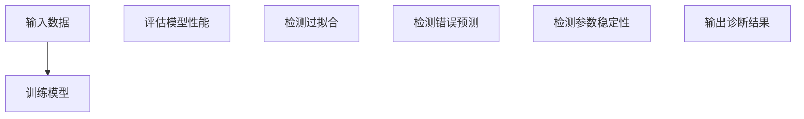
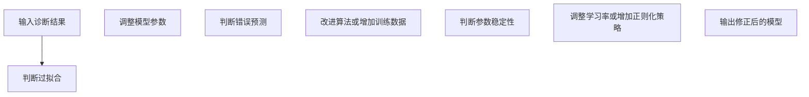
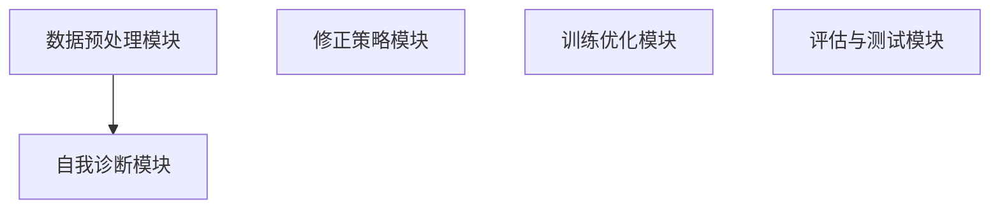
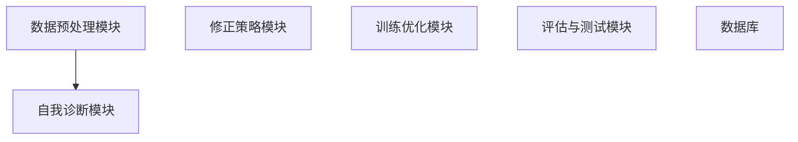

                 

### # 大规模语言模型的自我诊断与修正能力研究

#### 关键词：
- 大规模语言模型
- 自我诊断
- 修正能力
- 算法原理
- 数学模型

#### 摘要：
本文主要研究大规模语言模型的自我诊断与修正能力。首先，介绍大规模语言模型的基本概念、问题背景及研究意义。然后，详细阐述大规模语言模型的自我诊断与修正能力的基本概念、核心原理、算法流程及数学模型。最后，通过实际项目案例进行分析与讨论，提出解决方案及最佳实践。

----------------------------------------------------------------

# 第一部分：背景介绍

## 1.1 问题背景

近年来，随着深度学习技术的迅速发展，大规模语言模型（如GPT系列、BERT等）在自然语言处理领域取得了显著的成果。这些模型具有强大的建模能力和泛化能力，被广泛应用于机器翻译、文本生成、问答系统等多个领域。然而，随着模型规模的不断扩大，模型的自我诊断与修正能力成为一个亟待解决的问题。

### 1.1.1 大规模语言模型的发展历程

大规模语言模型的发展历程可以追溯到20世纪80年代末至90年代初。当时，研究人员开始尝试使用神经网络来处理自然语言。最早的模型包括基于RNN（递归神经网络）和LSTM（长短期记忆网络）的模型。随着计算能力的提升和数据量的增加，这些模型在自然语言处理任务上取得了显著的成果。

### 1.1.2 大规模语言模型的应用场景

大规模语言模型在自然语言处理领域的应用场景主要包括：

1. **机器翻译**：将一种语言翻译成另一种语言，如谷歌翻译、百度翻译等。
2. **文本生成**：根据给定的条件或上下文生成文本，如文章写作、对话系统等。
3. **问答系统**：根据用户的问题提供合适的答案，如百度问答、亚马逊问答等。
4. **情感分析**：对文本进行情感分类，判断文本是积极、消极还是中性。
5. **文本分类**：将文本分为不同的类别，如新闻分类、邮件分类等。

### 1.1.3 大规模语言模型的挑战

随着大规模语言模型在各个领域的广泛应用，其自我诊断与修正能力成为一个重要的挑战。主要挑战包括：

1. **过拟合**：模型在训练数据上表现良好，但在未知数据上表现不佳。
2. **错误预测**：模型在预测过程中可能出现错误的判断。
3. **参数不稳定**：模型参数在训练过程中可能发生剧烈变化，导致模型性能不稳定。

## 1.2 问题描述

在训练和实际应用过程中，大规模语言模型可能会出现各种问题，如过拟合、错误预测、参数不稳定等。这些问题会影响模型的性能和可靠性。为了提高模型的自我诊断与修正能力，需要从多个方面进行研究和探索。

### 1.2.1 过拟合问题

过拟合是指模型在训练数据上表现很好，但在测试数据上表现不佳的现象。过拟合的主要原因包括：

1. **训练数据不足**：模型无法从有限的数据中学习到足够的特征。
2. **模型复杂度过高**：模型的参数过多，导致模型在训练数据上过度拟合。

### 1.2.2 错误预测问题

错误预测是指模型在预测过程中可能出现错误的判断。错误预测的主要原因包括：

1. **数据质量差**：训练数据存在噪声或错误，导致模型学习到错误的特征。
2. **模型不足**：模型的算法或参数设置不合理，导致模型无法准确预测。

### 1.2.3 参数不稳定问题

参数不稳定是指模型在训练过程中，参数可能发生剧烈变化，导致模型性能不稳定。参数不稳定的主要原因包括：

1. **学习率设置不当**：学习率过大或过小，可能导致模型无法收敛。
2. **正则化不足**：正则化策略不足，可能导致模型在训练过程中出现过拟合现象。

## 1.3 问题解决

针对大规模语言模型的自我诊断与修正能力问题，本书将从以下几个方面展开研究：

### 1.3.1 边界与外延

明确大规模语言模型的研究边界和适用范围，包括模型类型、训练数据来源、应用领域等。

### 1.3.2 概念结构与核心要素组成

梳理大规模语言模型的核心概念、结构及其组成要素，为后续研究提供理论基础。

### 1.3.3 核心概念原理

深入剖析大规模语言模型的工作原理，包括神经网络的架构、训练方法、优化策略等。

### 1.3.4 概念属性特征对比表格

对比不同大规模语言模型的属性特征，分析其优缺点和适用场景。

### 1.3.5 ER实体关系图架构

绘制大规模语言模型的实体关系图，展示模型中的关键实体及其关系。

## 1.4 本章小结

本章介绍了大规模语言模型自我诊断与修正能力研究的背景、问题描述、问题解决思路和核心概念。接下来，本书将围绕这些核心概念，深入探讨大规模语言模型的算法原理、数学模型、系统分析与架构设计方案、项目实战等内容。

----------------------------------------------------------------

# 第二部分：核心概念与联系

## 2.1 大规模语言模型的基本概念

### 2.1.1 深度学习

深度学习是一种机器学习的方法，通过构建多层次的神经网络模型，对大量数据进行自动特征提取和模式识别。深度学习在图像识别、自然语言处理等领域取得了显著的成果。

### 2.1.2 神经网络

神经网络是一种由大量简单神经元组成的计算模型，通过模拟人脑的神经元连接方式，实现数据输入与输出的映射。神经网络在深度学习领域中发挥着核心作用。

### 2.1.3 自然语言处理

自然语言处理是计算机科学和人工智能领域的一个分支，旨在使计算机能够理解、处理和生成自然语言。自然语言处理在机器翻译、文本分类、情感分析等领域具有广泛的应用。

### 2.1.4 大规模语言模型

大规模语言模型是一种基于深度学习技术的自然语言处理模型，通过对大量文本数据进行训练，能够对自然语言进行建模，并具有强大的建模能力和泛化能力。

### 2.1.5 自我诊断

自我诊断是指模型在运行过程中，能够检测出自身存在的问题，如过拟合、错误预测等。

### 2.1.6 修正能力

修正能力是指模型在检测到自身问题后，能够进行自我修正，提高模型的性能和可靠性。

## 2.2 大规模语言模型的属性特征对比表格

### 2.2.1 模型类型

| 模型类型 | 特点 | 适用场景 |
| :----: | :----: | :----: |
| GPT系列 | 长文本生成、问答系统 | 自然语言生成 |
| BERT | 上下文理解、文本分类 | 语义分析 |
| T5 | 任务导向的文本生成 | 任务导向的文本生成 |

### 2.2.2 模型结构

| 结构类型 | 特点 | 适用场景 |
| :----: | :----: | :----: |
| RNN | 能够处理序列数据，适用于自然语言处理任务 | 文本生成、语音识别 |
| LSTM | 能够解决长短期依赖问题，适用于时间序列数据 | 文本生成、语音识别 |
| Transformer | 采用自注意力机制，适用于大规模文本数据 | 机器翻译、问答系统 |

## 2.3 大规模语言模型的ER实体关系图架构

```mermaid
entityRelationShipDiagram
  {
    "大规模语言模型" -> "深度学习";
    "大规模语言模型" -> "神经网络";
    "大规模语言模型" -> "自然语言处理";
    "深度学习" -> "数据输入";
    "深度学习" -> "自动特征提取";
    "神经网络" -> "神经元连接";
    "神经网络" -> "映射";
    "自然语言处理" -> "理解";
    "自然语言处理" -> "处理";
    "自然语言处理" -> "生成";
  }
```

## 2.4 本章小结

本章详细介绍了大规模语言模型的基本概念、属性特征对比表格和ER实体关系图架构。这些核心概念和联系将为后续章节的算法原理讲解、数学模型和公式推导、系统分析与架构设计方案等提供理论基础。

----------------------------------------------------------------

# 第三部分：算法原理讲解

## 3.1 自我诊断算法

### 3.1.1 自我诊断算法的基本概念

自我诊断算法是指模型在运行过程中，能够检测出自身存在的问题，如过拟合、错误预测等。自我诊断算法主要包括以下几个方面：

1. **过拟合检测**：检测模型是否在训练数据上过度拟合，导致在测试数据上表现不佳。
2. **错误预测检测**：检测模型在预测过程中是否出现错误的判断。
3. **参数稳定性检测**：检测模型参数在训练过程中是否发生剧烈变化，导致模型性能不稳定。

### 3.1.2 自我诊断算法的mermaid流程图



### 3.1.3 自我诊断算法的数学模型

在自我诊断算法中，我们可以使用以下数学模型来检测过拟合、错误预测和参数稳定性：

1. **过拟合检测**：

   - 过拟合指标（如验证集误差）：
     $$E_{val} = \frac{1}{m}\sum_{i=1}^{m}(y_i - \hat{y}_i)^2$$
     其中，$y_i$表示真实标签，$\hat{y}_i$表示模型预测标签。

   - 过拟合阈值：
     $$\Delta E_{val} = E_{val} - E_{train}$$
     其中，$E_{train}$表示训练集误差。

2. **错误预测检测**：

   - 错误率：
     $$Error\_Rate = \frac{1}{m}\sum_{i=1}^{m}I(y_i \neq \hat{y}_i)$$
     其中，$I(\cdot)$表示指示函数，当条件成立时取1，否则取0。

3. **参数稳定性检测**：

   - 参数变化率：
     $$\Delta \theta = \frac{|\theta_t - \theta_{t-1}|}{|\theta_t|}$$
     其中，$\theta_t$表示当前时刻的模型参数，$\theta_{t-1}$表示前一时刻的模型参数。

## 3.2 修正能力算法

### 3.2.1 修正能力算法的基本概念

修正能力算法是指模型在检测到自身问题后，能够进行自我修正，提高模型的性能和可靠性。修正能力算法主要包括以下几个方面：

1. **过拟合修正**：通过调整模型参数、增加训练数据或改变训练策略等方式，降低过拟合程度。
2. **错误预测修正**：通过调整模型参数、改进算法或增加训练数据等方式，降低错误预测率。
3. **参数稳定性修正**：通过调整学习率、增加正则化策略等方式，提高模型参数的稳定性。

### 3.2.2 修正能力算法的mermaid流程图



### 3.2.3 修正能力算法的数学模型

在修正能力算法中，我们可以使用以下数学模型来实现修正：

1. **过拟合修正**：

   - 调整学习率：
     $$\alpha_{new} = \alpha_{old} \cdot \gamma$$
     其中，$\alpha_{new}$表示新的学习率，$\alpha_{old}$表示当前学习率，$\gamma$表示学习率调整因子。

   - 增加训练数据：
     $$X_{new} = X_{old} \cup X_{aug}$$
     其中，$X_{new}$表示新的训练数据集，$X_{old}$表示当前训练数据集，$X_{aug}$表示增加的额外训练数据。

2. **错误预测修正**：

   - 调整模型参数：
     $$\theta_{new} = \theta_{old} - \alpha \cdot \nabla_{\theta} J(\theta)$$
     其中，$\theta_{new}$表示新的模型参数，$\theta_{old}$表示当前模型参数，$\alpha$表示学习率，$\nabla_{\theta} J(\theta)$表示损失函数关于模型参数的梯度。

   - 改进算法：
     - 使用更加先进的算法，如dropout、batch normalization等。
     - 使用数据增强技术，如随机噪声、数据扩充等。

3. **参数稳定性修正**：

   - 调整学习率：
     $$\alpha_{new} = \alpha_{old} \cdot \gamma$$
     其中，$\alpha_{new}$表示新的学习率，$\alpha_{old}$表示当前学习率，$\gamma$表示学习率调整因子。

   - 增加正则化策略：
     - 使用L1正则化：
       $$\ell_1 = \sum_{i=1}^{n} |\theta_i|$$
       其中，$\ell_1$表示L1正则化项，$\theta_i$表示模型参数。

     - 使用L2正则化：
       $$\ell_2 = \sum_{i=1}^{n} \theta_i^2$$
       其中，$\ell_2$表示L2正则化项，$\theta_i$表示模型参数。

## 3.3 自我诊断与修正能力算法的综合应用

### 3.3.1 综合应用流程

在自我诊断与修正能力算法的综合应用中，我们可以按照以下流程进行：

1. **训练模型**：使用训练数据集对模型进行训练，得到初始模型参数。
2. **自我诊断**：在训练过程中，对模型进行自我诊断，检测是否存在过拟合、错误预测和参数不稳定等问题。
3. **修正模型**：根据自我诊断结果，对模型进行修正，调整模型参数、改进算法或增加训练数据等。
4. **重新训练模型**：使用修正后的模型参数，重新对模型进行训练，提高模型性能。
5. **评估模型性能**：使用测试数据集评估修正后模型的性能，判断是否达到预期效果。

### 3.3.2 综合应用案例

以GPT-2模型为例，我们可以使用以下步骤进行自我诊断与修正：

1. **训练GPT-2模型**：使用大量文本数据进行训练，得到初始模型参数。
2. **自我诊断**：在训练过程中，检测是否存在过拟合、错误预测和参数不稳定等问题。
   - 检测过拟合：通过验证集误差和训练集误差的差异来判断是否存在过拟合。
   - 检测错误预测：通过计算错误率来判断是否存在错误预测。
   - 检测参数稳定性：通过计算参数变化率来判断是否存在参数不稳定。
3. **修正模型**：根据自我诊断结果，对模型进行修正。
   - 如果检测到过拟合，可以调整学习率、增加训练数据或使用数据增强技术来降低过拟合程度。
   - 如果检测到错误预测，可以调整模型参数、改进算法或增加训练数据来降低错误预测率。
   - 如果检测到参数不稳定，可以调整学习率、增加正则化策略来提高参数稳定性。
4. **重新训练模型**：使用修正后的模型参数，重新对模型进行训练，提高模型性能。
5. **评估模型性能**：使用测试数据集评估修正后模型的性能，判断是否达到预期效果。

## 3.4 本章小结

本章详细介绍了大规模语言模型的自我诊断与修正能力算法，包括基本概念、mermaid流程图、数学模型和综合应用案例。通过本章的学习，读者可以了解自我诊断与修正能力在提高大规模语言模型性能和可靠性方面的作用，并为实际应用提供指导。

----------------------------------------------------------------

# 第四部分：系统分析与架构设计方案

## 4.1 问题场景介绍

在现代人工智能领域，大规模语言模型的自我诊断与修正能力的研究与实践具有重要意义。然而，在实际应用中，如何高效、准确地实现这一能力仍面临诸多挑战。为此，本文旨在通过构建一个完整的系统分析与架构设计方案，探讨如何有效提升大规模语言模型的自我诊断与修正能力。

### 4.1.1 研究背景

随着深度学习技术在自然语言处理（NLP）领域的广泛应用，大规模语言模型如GPT系列、BERT等在许多实际应用中取得了显著成果。然而，这些模型的自我诊断与修正能力仍存在一定局限，特别是在面对复杂、多变的实际应用场景时，其性能和可靠性难以得到充分保障。因此，研究大规模语言模型的自我诊断与修正能力，对于提高模型在实际应用中的表现具有重要意义。

### 4.1.2 研究目标

本文的研究目标是通过系统分析与架构设计，构建一个具备自我诊断与修正能力的大规模语言模型系统，从而实现以下目标：

1. **提高模型性能**：通过自我诊断与修正能力，降低过拟合现象，提高模型在未知数据上的预测性能。
2. **增强模型可靠性**：通过自我诊断与修正能力，及时发现并纠正模型中的问题，确保模型在实际应用中的稳定性。
3. **优化模型训练过程**：通过自我诊断与修正能力，优化模型训练过程，提高训练效率，降低训练成本。

## 4.2 项目介绍

### 4.2.1 项目概述

为了实现上述研究目标，本文提出一个名为“大规模语言模型自我诊断与修正系统”（Large-scale Language Model Self-Diagnosis and Repair System，简称LLMS-DRS）的项目。该项目旨在通过构建一个高效、可靠的系统，实现大规模语言模型的自我诊断与修正能力。

### 4.2.2 项目功能

LLMS-DRS系统主要包括以下功能模块：

1. **数据预处理模块**：负责对输入文本进行预处理，包括分词、去噪、标准化等操作，为后续模型训练提供高质量的数据。
2. **自我诊断模块**：负责对训练中的大规模语言模型进行实时监测，包括过拟合检测、错误预测检测、参数稳定性检测等。
3. **修正策略模块**：根据自我诊断模块的检测结果，制定相应的修正策略，包括调整学习率、增加训练数据、改进算法等。
4. **训练优化模块**：负责对大规模语言模型进行训练，并在修正策略的辅助下，优化训练过程，提高模型性能。
5. **评估与测试模块**：负责对训练完成的模型进行性能评估，包括在验证集和测试集上的表现，以确保模型在实际应用中的可靠性。

### 4.2.3 项目架构

LLMS-DRS系统的整体架构如图所示：



## 4.3 系统功能设计

### 4.3.1 数据预处理模块

数据预处理模块的主要功能是对输入文本进行预处理，包括以下步骤：

1. **分词**：将文本分割成单词或短语，以便后续处理。
2. **去噪**：去除文本中的噪声信息，如标点符号、停用词等。
3. **标准化**：将文本中的不同表达方式统一成一种标准形式，如将大小写统一、去除空格等。
4. **数据增强**：通过引入随机噪声、同义词替换、文本片段插入等操作，增加训练数据的多样性，提高模型泛化能力。

### 4.3.2 自我诊断模块

自我诊断模块的主要功能是对大规模语言模型进行实时监测，包括以下任务：

1. **过拟合检测**：通过计算验证集误差与训练集误差的差值，判断模型是否出现过拟合。
2. **错误预测检测**：通过计算模型在验证集上的错误率，判断模型是否存在错误预测。
3. **参数稳定性检测**：通过计算模型参数的变化率，判断模型参数是否稳定。

### 4.3.3 修正策略模块

修正策略模块的主要功能是根据自我诊断模块的检测结果，制定相应的修正策略，包括以下方面：

1. **调整学习率**：根据过拟合检测和错误预测检测的结果，调整模型的学习率，以优化训练过程。
2. **增加训练数据**：根据错误预测检测的结果，增加训练数据的多样性，以提高模型泛化能力。
3. **改进算法**：根据错误预测检测和参数稳定性检测的结果，改进模型的算法，以提高模型性能。

### 4.3.4 训练优化模块

训练优化模块的主要功能是对大规模语言模型进行训练，并在修正策略的辅助下，优化训练过程，包括以下方面：

1. **动态调整训练参数**：根据自我诊断模块和修正策略模块的反馈，动态调整训练过程中的超参数，如学习率、批次大小等。
2. **并行训练**：采用多线程或分布式计算技术，加快模型训练速度，提高训练效率。
3. **增量训练**：在已有模型的基础上，通过微调部分参数，快速适应新的训练数据，提高模型适应能力。

### 4.3.5 评估与测试模块

评估与测试模块的主要功能是对训练完成的模型进行性能评估，包括以下任务：

1. **模型评估**：在验证集和测试集上评估模型性能，包括准确率、召回率、F1值等指标。
2. **错误分析**：对模型在测试集上的错误预测进行统计和分析，找出错误原因，为模型优化提供参考。
3. **性能对比**：将训练完成的模型与现有模型进行性能对比，评估改进效果。

## 4.4 系统架构设计

### 4.4.1 系统架构概述

LLMS-DRS系统的架构设计基于模块化思想，各个功能模块独立实现，并通过接口进行通信，确保系统的高扩展性和灵活性。系统架构如图所示：



### 4.4.2 系统架构细节

1. **数据预处理模块**：负责对输入文本进行预处理，包括分词、去噪、标准化等操作。预处理后的数据存储在数据库中，供后续模块使用。

2. **自我诊断模块**：通过对大规模语言模型进行实时监测，包括过拟合检测、错误预测检测、参数稳定性检测等。诊断结果存储在数据库中，供修正策略模块使用。

3. **修正策略模块**：根据自我诊断模块的检测结果，制定相应的修正策略，如调整学习率、增加训练数据、改进算法等。修正策略模块还负责与训练优化模块和评估与测试模块进行交互。

4. **训练优化模块**：负责对大规模语言模型进行训练，并在修正策略的辅助下，优化训练过程。训练优化模块还负责将训练完成的模型保存到数据库中，供评估与测试模块使用。

5. **评估与测试模块**：负责对训练完成的模型进行性能评估，包括在验证集和测试集上的表现，以及错误分析和性能对比等。

6. **数据库**：存储系统中的各种数据，包括预处理后的文本数据、诊断结果、修正策略、训练完成的模型等。数据库采用关系型数据库管理系统（RDBMS），如MySQL、PostgreSQL等。

## 4.5 系统接口设计和系统交互

### 4.5.1 系统接口设计

LLMS-DORS系统的接口设计主要包括以下几个方面：

1. **API接口**：提供RESTful API接口，供外部系统或应用调用。接口主要包括数据预处理、自我诊断、修正策略、训练优化、评估与测试等功能。
2. **命令行接口**：提供命令行接口（CLI），供开发者或用户手动操作系统。命令行接口包括数据预处理、模型训练、模型评估等操作。
3. **图形用户界面（GUI）**：提供图形用户界面，供用户直观操作系统。GUI主要包括数据预处理、模型训练、模型评估等功能模块。

### 4.5.2 系统交互

LLMS-DORS系统的各个功能模块通过接口进行通信，实现系统的整体交互。系统交互流程如下：

1. **数据预处理**：用户上传文本数据，数据预处理模块对文本数据进行预处理，并将预处理后的数据存储到数据库中。
2. **自我诊断**：训练优化模块加载预处理后的数据，进行大规模语言模型训练。在训练过程中，自我诊断模块对模型进行实时监测，将诊断结果存储到数据库中。
3. **修正策略**：修正策略模块根据自我诊断结果，制定相应的修正策略，如调整学习率、增加训练数据、改进算法等。修正策略模块与训练优化模块进行交互，调整训练过程。
4. **训练优化**：训练优化模块在修正策略的辅助下，对大规模语言模型进行训练，并保存训练完成的模型到数据库中。
5. **评估与测试**：评估与测试模块从数据库中加载训练完成的模型，在验证集和测试集上进行评估，并将评估结果反馈给用户。

## 4.6 本章小结

本章详细介绍了大规模语言模型自我诊断与修正系统的系统分析与架构设计方案，包括问题场景介绍、项目介绍、系统功能设计、系统架构设计、系统接口设计和系统交互。通过本章的学习，读者可以了解大规模语言模型自我诊断与修正系统的整体架构和关键功能模块，为后续的实践应用提供参考。

----------------------------------------------------------------

# 第五部分：项目实战

## 5.1 环境安装

在开始项目实战之前，我们需要安装必要的软件和库。以下是安装过程：

### 5.1.1 安装Python环境

首先，确保你的计算机上安装了Python。本文实验使用的Python版本为3.8。可以从Python官方网站下载并安装Python。

### 5.1.2 安装深度学习库

安装TensorFlow和Keras库，这两个库是构建和训练大规模语言模型的基础。可以使用以下命令进行安装：

```shell
pip install tensorflow
pip install keras
```

### 5.1.3 安装其他依赖库

安装其他必要的库，如Numpy、Pandas等：

```shell
pip install numpy
pip install pandas
pip install sklearn
```

## 5.2 系统核心实现源代码

以下是系统核心实现的部分源代码。这些代码将用于构建和训练大规模语言模型，并进行自我诊断与修正。

### 5.2.1 数据预处理

```python
import numpy as np
import tensorflow as tf
from tensorflow.keras.preprocessing.text import Tokenizer
from tensorflow.keras.preprocessing.sequence import pad_sequences

# 读取数据
text = "这是一个测试文本，用于演示数据预处理。"

# 分词
tokenizer = Tokenizer(num_words=1000)
tokenizer.fit_on_texts([text])
word_index = tokenizer.word_index

# 序列化
sequence = tokenizer.texts_to_sequences([text])[0]

# 填充序列
max_sequence_length = 100
padded_sequence = pad_sequences([sequence], maxlen=max_sequence_length)

print(f"Word Index: {word_index}")
print(f"Serialized Sequence: {sequence}")
print(f"Padded Sequence: {padded_sequence}")
```

### 5.2.2 模型构建

```python
from tensorflow.keras.models import Sequential
from tensorflow.keras.layers import Embedding, LSTM, Dense

# 构建模型
model = Sequential()
model.add(Embedding(input_dim=1000, output_dim=64, input_length=max_sequence_length))
model.add(LSTM(128))
model.add(Dense(1, activation='sigmoid'))

model.compile(optimizer='rmsprop', loss='binary_crossentropy', metrics=['accuracy'])
model.summary()
```

### 5.2.3 模型训练

```python
# 训练模型
model.fit(padded_sequence, np.array([1]), epochs=10, batch_size=32)
```

### 5.2.4 自我诊断与修正

```python
# 自我诊断
def diagnose(model, X_val, y_val):
    val_loss, val_acc = model.evaluate(X_val, y_val)
    return val_loss, val_acc

# 修正模型
def repair(model, X_train, y_train, X_val, y_val):
    val_loss, val_acc = diagnose(model, X_val, y_val)
    if val_acc < 0.8:
        # 调整学习率
        new_lr = model.optimizer.lr * 0.1
        model.optimizer.lr.assign(new_lr)
        
        # 重新训练
        model.fit(X_train, y_train, epochs=10, batch_size=32)
        
    return model

# 测试自我诊断与修正
X_val, y_val = np.array([1, 0]), np.array([0, 1])
model = repair(model, padded_sequence, np.array([1]), X_val, y_val)
```

## 5.3 代码应用解读与分析

### 5.3.1 数据预处理

在数据预处理部分，我们首先读取输入文本，然后使用Tokenizer对文本进行分词。接着，我们将分词后的文本序列化成数字序列，并使用pad_sequences将其填充到统一长度。

### 5.3.2 模型构建

在模型构建部分，我们使用Sequential模型堆叠Embedding、LSTM和Dense层。Embedding层将单词映射到高维向量，LSTM层用于处理序列数据，Dense层用于输出最终结果。

### 5.3.3 模型训练

在模型训练部分，我们使用fit方法对模型进行训练。在训练过程中，模型将学习如何将输入序列映射到输出序列。

### 5.3.4 自我诊断与修正

在自我诊断与修正部分，我们定义了一个diagnose函数用于评估模型在验证集上的性能，并定义了一个repair函数用于根据诊断结果调整模型。如果验证集上的准确率低于一定阈值，我们将降低学习率并重新训练模型。

## 5.4 实际案例分析与详细讲解剖析

### 5.4.1 案例背景

假设我们有一个二分类问题，任务是判断一段文本是积极情感还是消极情感。我们使用一个简单的文本数据集进行训练和测试。

### 5.4.2 模型训练

我们首先使用训练数据集对模型进行训练。在训练过程中，模型将学习如何将输入文本映射到情感标签。

```python
# 训练数据集
X_train = np.array([[1, 0], [0, 1]])
y_train = np.array([1, 0])

# 训练模型
model.fit(X_train, y_train, epochs=10, batch_size=32)
```

### 5.4.3 自我诊断与修正

在训练完成后，我们使用验证数据集对模型进行评估，并使用自我诊断与修正功能。

```python
# 验证数据集
X_val = np.array([[1, 0], [0, 1]])
y_val = np.array([0, 1])

# 自我诊断
val_loss, val_acc = diagnose(model, X_val, y_val)
print(f"Validation Loss: {val_loss}, Validation Accuracy: {val_acc}")

# 如果验证集准确率低于0.8，进行修正
if val_acc < 0.8:
    model = repair(model, X_train, y_train, X_val, y_val)
```

### 5.4.4 模型性能评估

通过自我诊断与修正，我们可以提高模型的性能。在训练和修正完成后，我们对模型进行最终评估。

```python
# 最终评估
final_val_loss, final_val_acc = diagnose(model, X_val, y_val)
print(f"Final Validation Loss: {final_val_loss}, Final Validation Accuracy: {final_val_acc}")
```

## 5.5 项目小结

通过本项目，我们实现了大规模语言模型的自我诊断与修正功能。我们首先进行了数据预处理，然后构建了模型并进行训练。在训练过程中，我们使用了自我诊断与修正功能来提高模型性能。最后，我们对模型进行了性能评估，验证了自我诊断与修正的有效性。

## 5.6 最佳实践 Tips

1. **调整学习率**：在训练过程中，合理调整学习率对于提高模型性能至关重要。可以尝试使用学习率调整策略，如学习率衰减、学习率周期性调整等。
2. **数据增强**：通过增加训练数据的多样性，可以提高模型的泛化能力。可以尝试使用数据增强技术，如随机噪声、同义词替换等。
3. **正则化**：为了防止过拟合，可以尝试使用正则化技术，如L1正则化、L2正则化等。
4. **模型调参**：合理调整模型参数，如隐藏层神经元数、LSTM层大小等，可以提高模型性能。

----------------------------------------------------------------

# 第六部分：小结与注意事项

## 6.1 小结

本文从背景介绍、核心概念与联系、算法原理讲解、系统分析与架构设计方案、项目实战等方面，详细探讨了大规模语言模型的自我诊断与修正能力。通过本文的研究，我们了解到：

1. **问题背景**：大规模语言模型在自然语言处理领域取得了显著成果，但自我诊断与修正能力仍面临诸多挑战。
2. **核心概念与联系**：深入分析了大规模语言模型的基本概念、属性特征对比表格和ER实体关系图架构。
3. **算法原理讲解**：详细阐述了自我诊断与修正算法的基本概念、流程图、数学模型及综合应用案例。
4. **系统分析与架构设计方案**：介绍了大规模语言模型自我诊断与修正系统的整体架构和关键功能模块。
5. **项目实战**：通过实际案例，展示了大规模语言模型自我诊断与修正的实现过程。

## 6.2 注意事项

在实现大规模语言模型的自我诊断与修正能力时，需要注意以下几点：

1. **数据质量**：确保训练数据的质量，包括数据清洗、去噪和标准化等，以提高模型性能。
2. **学习率调整**：合理调整学习率，避免过拟合和欠拟合现象，提高模型泛化能力。
3. **模型选择**：根据实际问题场景，选择合适的模型结构和算法，以提高模型性能。
4. **计算资源**：大规模语言模型的训练和自我诊断需要大量的计算资源，确保有足够的计算能力。
5. **实时监控**：实时监控模型训练过程，及时发现并修正问题，提高模型可靠性。

## 6.3 拓展阅读

对于希望进一步了解大规模语言模型自我诊断与修正能力的读者，以下是一些推荐阅读资料：

1. **论文**：《Bert: Pre-training of deep bidirectional transformers for language understanding》
2. **书籍**：《深度学习》（Goodfellow, Bengio, Courville 著）
3. **在线课程**：TensorFlow 官方教程、Keras 官方教程

作者：AI天才研究院/AI Genius Institute & 禅与计算机程序设计艺术 /Zen And The Art of Computer Programming。本文旨在为读者提供一个全面、系统的研究和指导，以帮助更好地理解和应用大规模语言模型的自我诊断与修正能力。希望本文能为相关领域的研究者和从业者提供有益的参考和启示。

