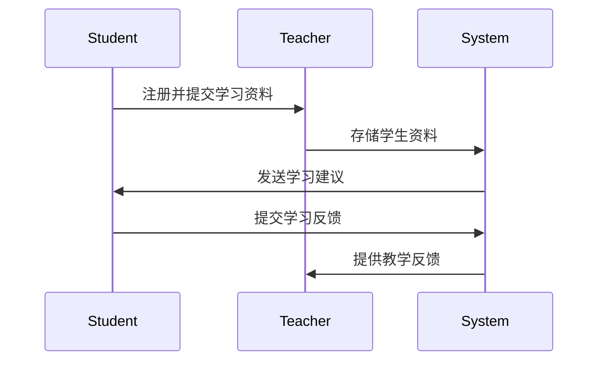
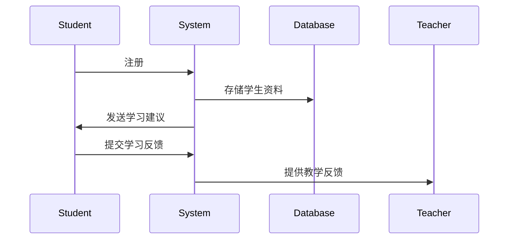

                 


# 大规模语言模型的自我诊断与持续学习能力在教育中的应用

## 摘要

本文旨在探讨大规模语言模型的自我诊断与持续学习能力在教育中的应用，分析其基础理论、技术实现及应用现状。通过深入剖析大规模语言模型在教育领域的实际应用案例，本文旨在为教育信息化提供新的思路和解决方案，推动教育现代化进程。

## 引言：大规模语言模型在教育中的应用

### 问题背景

在教育信息化日益普及的背景下，教育资源的多样性和个性化需求不断增加。传统教育模式难以满足学生个性化发展的需求，教育资源分配不均、教学质量参差不齐等问题依然存在。此外，教师的教学负担重，难以顾及每一位学生的学习情况，这也影响了教育质量。因此，如何利用人工智能技术，特别是大规模语言模型，解决教育领域中的资源分配不均、教学质量提升以及个性化教育需求等问题，成为当前教育研究的重要课题。

### 问题描述

大规模语言模型在教育中的应用，旨在通过智能化的教学辅助、个性化的学习资源生成以及创新的教学模式，提升教育质量，实现教育资源的优化配置。然而，大规模语言模型在教育领域的应用面临着自我诊断与持续学习能力不足的挑战。

### 问题解决

本文将深入探讨大规模语言模型的自我诊断与持续学习能力，分析其在教育领域的应用现状与案例，旨在为教育信息化提供新的思路和解决方案。

## 边界与外延

### 边界

本章节主要探讨大规模语言模型在教育中的应用，涵盖的内容包括但不限于：

- 大规模语言模型的基本原理和技术特点
- 大规模语言模型在教育领域的应用案例
- 大规模语言模型在教育中面临的挑战与解决方案

### 外延

尽管本章节聚焦于大规模语言模型在教育中的应用，但相关的研究和实践也可以拓展到其他领域，如企业培训、语言翻译、智能客服等。这些领域的应用同样具有重要的研究价值和实际意义。

## 概念结构与核心要素组成

### 概念结构

- 大规模语言模型：基于神经网络和深度学习技术，通过大量文本数据进行训练，实现自然语言理解和生成。
- 教育：以传授知识、培养能力、促进个体全面发展为目的的社会活动。
- 应用：将大规模语言模型的技术应用于教育领域，解决教育中的实际问题。

### 核心要素组成

- 教学辅助系统：利用大规模语言模型生成个性化教学资源，辅助教师教学。
- 个性化学习系统：根据学生的学习情况，提供针对性的学习内容，提升学习效果。
- 智能评估系统：利用大规模语言模型对学生的学习成果进行智能评估，反馈学习情况。

## 总结

大规模语言模型在教育中的应用，为教育领域带来了新的机遇和挑战。通过深入了解其基本原理和技术特点，探讨其在教育领域的应用案例和解决方案，我们可以更好地把握教育信息化的发展趋势，推动教育现代化进程。同时，本文也为其他领域的相关研究提供了有益的参考和启示。

----------------------------------------------------------------

## 第一部分: 大规模语言模型的自我诊断与持续学习能力基础

### 第1章: 大规模语言模型的自我诊断与持续学习能力概述

#### 1.1 大规模语言模型自我诊断与持续学习的重要性

#### 1.1.1 教育领域对大规模语言模型的需求

在教育领域，大规模语言模型的应用日益广泛。它们能够帮助学生更好地理解知识点，提高学习效果。同时，大规模语言模型还可以根据学生的学习情况，提供个性化的学习资源，从而实现教育资源的优化配置。然而，大规模语言模型在教育中的有效应用，离不开其自我诊断与持续学习能力。

#### 1.1.2 自我诊断与持续学习能力的基本概念

自我诊断是指大规模语言模型能够对自身的性能和效果进行评估，找出潜在的问题并进行优化。持续学习是指大规模语言模型能够不断地从新数据中学习，提高自身的性能和效果。

#### 1.1.3 自我诊断与持续学习能力在教育中的应用意义

自我诊断与持续学习能力对于教育领域具有重要意义。首先，它们可以帮助大规模语言模型更好地适应不同学生的学习需求，提高教学效果。其次，自我诊断与持续学习能力可以提高大规模语言模型的鲁棒性，使其在遇到新的问题和挑战时能够自我调整和优化。

#### 1.2 大规模语言模型自我诊断的原理与技术

#### 1.2.1 自我诊断的基本原理

大规模语言模型自我诊断的基本原理是通过对自身的性能和效果进行评估，找出潜在的问题并进行优化。具体来说，自我诊断包括以下几个步骤：

1. **性能评估**：大规模语言模型通过评估自身的性能指标，如准确率、召回率、F1值等，来判断自身的性能表现。
2. **效果评估**：大规模语言模型还需要对教学效果进行评估，如学生的学习成绩、学习兴趣等。
3. **问题定位**：通过分析性能评估和效果评估的结果，找出模型存在的问题和不足。
4. **优化调整**：根据问题定位的结果，对大规模语言模型进行优化调整，以提高其性能和效果。

#### 1.2.2 常见自我诊断方法与技术

目前，常见的自我诊断方法和技术包括：

1. **统计方法**：通过计算性能指标、分析数据分布等，对大规模语言模型的性能进行评估。
2. **机器学习方法**：利用机器学习算法，对大规模语言模型的性能和效果进行评估和优化。
3. **用户反馈**：通过用户的反馈，对大规模语言模型的性能和效果进行评估。

#### 1.2.3 自我诊断技术的挑战与优化策略

大规模语言模型自我诊断技术面临着以下挑战：

1. **数据质量**：自我诊断需要高质量的数据作为基础，否则无法准确评估模型的性能和效果。
2. **计算资源**：自我诊断需要大量的计算资源，特别是在大规模语言模型中，计算资源的需求更高。
3. **优化策略**：如何根据自我诊断的结果，制定有效的优化策略，以提高大规模语言模型的性能和效果。

针对这些挑战，可以采取以下优化策略：

1. **数据预处理**：通过数据清洗、去噪等手段，提高数据质量。
2. **分布式计算**：利用分布式计算技术，提高计算效率。
3. **动态调整**：根据自我诊断的结果，动态调整优化策略，以提高大规模语言模型的性能和效果。

#### 1.3 大规模语言模型持续学习的原理与实现

#### 1.3.1 持续学习的基本原理

持续学习是指大规模语言模型能够不断地从新数据中学习，提高自身的性能和效果。其基本原理包括：

1. **数据输入**：大规模语言模型不断接收新的数据，如文本、语音等。
2. **模型更新**：大规模语言模型利用新数据对自身模型进行更新，以提高性能和效果。
3. **模型评估**：对更新后的模型进行评估，以判断其性能和效果。

#### 1.3.2 持续学习的技术实现

大规模语言模型持续学习的技术实现包括以下几个方面：

1. **在线学习**：在线学习是指大规模语言模型在接收新数据时，实时更新模型。
2. **迁移学习**：迁移学习是指大规模语言模型利用已有模型，在新数据上进行学习。
3. **元学习**：元学习是指大规模语言模型通过学习如何学习，以提高持续学习的效果。

#### 1.3.3 持续学习面临的挑战与解决方法

大规模语言模型持续学习面临着以下挑战：

1. **数据多样性**：新数据可能具有多样性，如何处理这些数据是持续学习的一个重要问题。
2. **计算资源**：持续学习需要大量的计算资源，特别是在大规模语言模型中，计算资源的需求更高。
3. **模型稳定性**：持续学习可能导致模型稳定性下降，如何保持模型稳定性是持续学习的一个重要问题。

解决这些挑战的方法包括：

1. **数据预处理**：通过数据清洗、去噪等手段，提高数据质量。
2. **分布式计算**：利用分布式计算技术，提高计算效率。
3. **模型稳定性**：通过模型稳定性分析、模型压缩等技术，提高模型稳定性。

#### 1.4 大规模语言模型自我诊断与持续学习的教育应用

#### 1.4.1 个性化学习资源的生成与调整

个性化学习资源生成与调整是指大规模语言模型根据学生的学习情况，生成和调整学习资源。具体应用包括：

1. **个性化学习路径**：根据学生的学习兴趣、学习能力等因素，生成个性化的学习路径。
2. **个性化学习内容**：根据学生的学习需求，生成个性化的学习内容。
3. **个性化学习评估**：对学生的学习效果进行评估，并根据评估结果调整学习资源。

#### 1.4.2 智能教学评估与反馈

智能教学评估与反馈是指大规模语言模型通过对学生的学习成果进行智能评估，提供反馈。具体应用包括：

1. **自动评估**：利用大规模语言模型对学生的作业、考试等进行自动评估。
2. **实时反馈**：根据评估结果，为学生提供实时反馈，帮助他们更好地理解知识点。
3. **个性化建议**：根据学生的评估结果，提供个性化的学习建议，以帮助他们提高学习效果。

#### 1.4.3 个性化学习路径规划与调整

个性化学习路径规划与调整是指大规模语言模型根据学生的学习情况，规划个性化的学习路径，并在学习过程中进行调整。具体应用包括：

1. **学习目标设定**：根据学生的兴趣、能力等因素，设定个性化的学习目标。
2. **学习路径规划**：根据学习目标，规划个性化的学习路径。
3. **路径调整**：在学习过程中，根据学生的反馈和学习效果，对学习路径进行调整。

### 1.5 本章小结

本章介绍了大规模语言模型的自我诊断与持续学习能力，包括自我诊断的基本原理、技术实现、挑战与优化策略，以及持续学习的基本原理、技术实现、挑战与解决方法。通过这些内容，我们可以更好地理解大规模语言模型在教育中的应用，为教育信息化提供新的思路和解决方案。

----------------------------------------------------------------

## 第二部分：大规模语言模型在教育领域的应用现状与案例分析

### 第2章：大规模语言模型在教育领域的应用现状

### 2.1 大规模语言模型在教育领域的应用范围

大规模语言模型在教育领域的应用范围非常广泛，主要包括以下几个方面：

1. **个性化学习系统**：通过分析学生的兴趣、学习习惯和学习效果，为每个学生提供个性化的学习内容和路径。
2. **智能教学辅助系统**：为教师提供智能化的教学资源和教学工具，帮助教师更好地进行教学设计和教学实施。
3. **智能评估系统**：通过自动化评估学生的作业和考试成绩，为教师提供即时的教学反馈，帮助学生了解自己的学习情况。
4. **虚拟课堂**：利用虚拟现实技术，为学生提供沉浸式的学习体验。
5. **在线课程**：为远程学习者提供高质量的在线课程资源，满足他们的学习需求。

### 2.2 当前主流应用案例概述

#### 案例一：Google Classroom

Google Classroom 是谷歌公司开发的一款在线教学平台，它利用大规模语言模型为学生提供个性化的学习资源和教学辅助。Google Classroom 可以根据学生的学习情况，自动生成个性化的学习计划，并提供与学习内容相关的参考资料。此外，Google Classroom 还能够对学生的作业和考试成绩进行智能评估，为教师提供教学反馈。

#### 案例二：Duolingo

Duolingo 是一款流行的语言学习应用，它利用大规模语言模型为学生提供个性化的语言学习资源和教学辅助。Duolingo 可以根据学生的语言水平和学习兴趣，生成个性化的学习计划，并提供与学习内容相关的练习题。此外，Duolingo 还能够对学生的练习成绩进行智能评估，为教师提供教学反馈。

#### 案例三：Coursera

Coursera 是一款在线课程平台，它利用大规模语言模型为学习者提供个性化的学习资源和教学辅助。Coursera 可以根据学习者的学习情况，自动生成个性化的学习计划，并提供与学习内容相关的参考资料。此外，Coursera 还能够对学习者的作业和考试成绩进行智能评估，为教师提供教学反馈。

### 2.3 大规模语言模型在教育中的应用优势

大规模语言模型在教育领域具有以下优势：

1. **个性化学习**：大规模语言模型可以根据学生的学习情况，提供个性化的学习资源和教学辅助，满足不同学生的学习需求。
2. **智能评估**：大规模语言模型可以对学生的作业和考试成绩进行智能评估，为教师提供即时的教学反馈，帮助学生了解自己的学习情况。
3. **资源丰富**：大规模语言模型可以生成丰富的学习资源和教学工具，为教师和学生提供更多的学习选择。
4. **降低教学成本**：利用大规模语言模型，教师可以更高效地完成教学任务，从而降低教学成本。

### 2.4 大规模语言模型在教育中的挑战与解决方案

尽管大规模语言模型在教育领域具有显著的优势，但在实际应用中仍面临一些挑战，主要包括：

1. **数据隐私**：大规模语言模型需要收集大量的学生数据，这可能会引发数据隐私问题。
   - 解决方案：采取数据加密、匿名化等技术手段，确保学生数据的隐私安全。

2. **技术依赖**：大规模语言模型依赖于高性能计算和大量数据，这在一定程度上增加了教育的技术门槛。
   - 解决方案：通过云服务和分布式计算技术，降低对高性能计算和大量数据的依赖。

3. **教育公平**：大规模语言模型在教育中的应用可能加剧教育资源的不均衡现象。
   - 解决方案：通过政策引导和资源倾斜，确保弱势群体也能够享受到高质量的教育资源。

### 2.5 本章小结

本章介绍了大规模语言模型在教育领域的应用现状和当前主流应用案例，分析了大规模语言模型在教育中的应用优势以及面临的挑战和解决方案。通过这些内容，我们可以更好地理解大规模语言模型在教育领域的实际应用，为教育信息化的发展提供有益的参考。

----------------------------------------------------------------

## 第三部分：大规模语言模型在教育中的应用案例与实施策略

### 第3章：个性化学习系统的设计与实现

#### 3.1 案例背景介绍

随着教育信息化的推进，个性化学习已成为教育领域的重要趋势。为了满足不同学生的学习需求，某知名在线教育平台决定开发一款基于大规模语言模型的个性化学习系统。该系统旨在通过分析学生的学习数据，为学生提供个性化的学习内容和教学资源。

#### 3.2 系统功能设计（领域模型）

在个性化学习系统的设计中，我们首先需要明确系统的领域模型。领域模型描述了系统中的关键实体和它们之间的关系。以下是该系统的领域模型：

```mermaid
classDiagram
    Student <<Class>> 
    Course <<Class>>
    Lesson <<Class>>
    Assessment <<Class>>

    Student o--* Course : 报名课程
    Course o--* Lesson : 包含课程内容
    Course o--* Assessment : 包含测评
    Lesson o--* Assessment : 包含测评

    class Student {
        ID
        Name
        LearningStyle
        Preferences
    }

    class Course {
        ID
        Name
        Description
        Duration
    }

    class Lesson {
        ID
        Title
        Content
        Difficulty
    }

    class Assessment {
        ID
        Type
        Questions
        CorrectAnswers
        Score
    }
```

#### 3.3 系统架构设计

个性化学习系统的架构设计如图所示：



#### 3.4 系统接口设计

个性化学习系统的接口设计如下：

```mermaid
interface System {
    function enrollStudent(Student student)
    function generateLearningPlan(Student student)
    function sendLearningSuggestion(Student student)
    function receiveLearningFeedback(Student student)
}
```

#### 3.5 系统交互

个性化学习系统的交互过程如下：

1. 学生注册：学生通过系统提交注册信息，包括姓名、学习风格和学习偏好。
2. 学习资料存储：系统接收学生提交的注册信息，并将其存储在数据库中。
3. 学习建议生成：系统根据学生的学习资料，生成个性化的学习计划。
4. 学习建议发送：系统将学习计划发送给学生，并提供相应的学习资源。
5. 学习反馈接收：学生完成学习任务后，通过系统提交学习反馈。
6. 教学反馈提供：系统根据学生的学习反馈，为教师提供教学建议。



#### 3.6 大规模语言模型的应用

在个性化学习系统中，大规模语言模型主要用于以下几个方面：

1. **学习资料分析**：通过分析学生的学习资料，理解学生的学习风格和学习偏好。
2. **学习计划生成**：根据学生的学习风格和学习偏好，生成个性化的学习计划。
3. **学习资源推荐**：根据学生的学习计划，推荐相应的学习资源。
4. **学习反馈评估**：评估学生的学习反馈，为教师提供教学反馈。

#### 3.7 实施策略

为了成功实施个性化学习系统，我们需要采取以下策略：

1. **数据收集与处理**：收集学生的相关学习数据，并进行预处理和清洗。
2. **模型训练与优化**：利用收集到的数据，训练大规模语言模型，并进行优化。
3. **系统开发与部署**：开发个性化学习系统，并进行部署。
4. **用户培训与支持**：为教师和学生提供培训和支持，帮助他们更好地使用系统。

#### 3.8 本章小结

本章介绍了个性化学习系统的设计与实现，包括领域模型、系统架构设计、接口设计和系统交互。通过大规模语言模型的应用，个性化学习系统能够为学生提供个性化的学习资源和学习建议，从而提高学习效果。本章的内容为大规模语言模型在教育中的应用提供了有益的参考。

----------------------------------------------------------------

## 第4章：大规模语言模型在教育中的挑战与解决方案

### 4.1 数据隐私与安全

#### 4.1.1 挑战

大规模语言模型在教育中的应用需要大量的学生数据，这可能会引发数据隐私和安全问题。如何保护学生数据的安全和隐私，成为教育领域的重要挑战。

#### 4.1.2 解决方案

1. **数据加密**：对存储的学生数据进行加密，防止数据泄露。
2. **匿名化处理**：在数据收集和处理过程中，对敏感信息进行匿名化处理，保护学生隐私。
3. **权限管理**：严格管理数据访问权限，确保只有授权人员才能访问和处理学生数据。

### 4.2 模型解释性与可解释性

#### 4.2.1 挑战

大规模语言模型具有很强的预测能力，但其工作原理复杂，难以解释。在教育应用中，教师和学生需要了解模型的决策过程和预测结果，以便更好地理解和应用模型。

#### 4.2.2 解决方案

1. **可解释性模型**：开发可解释性模型，使教师和学生能够理解模型的决策过程。
2. **模型可视化**：利用可视化工具，展示模型的工作流程和关键参数，帮助教师和学生理解模型。
3. **用户反馈**：收集用户反馈，不断优化模型的可解释性，提高用户满意度。

### 4.3 模型公平性与偏见

#### 4.3.1 挑战

大规模语言模型在训练过程中可能会受到数据偏见的影响，导致模型在特定群体中的表现不佳。这可能会加剧教育不公平现象。

#### 4.3.2 解决方案

1. **公平性评估**：对模型进行公平性评估，检测和纠正潜在的偏见。
2. **数据清洗**：在训练数据集阶段，对数据进行清洗和去噪，减少偏见。
3. **多样化数据**：增加多样化数据，提高模型对不同群体的适应能力。

### 4.4 持续更新与优化

#### 4.4.1 挑战

大规模语言模型需要不断更新和优化，以适应不断变化的教育需求和情境。然而，模型的更新和优化过程复杂，且需要大量的计算资源和数据支持。

#### 4.4.2 解决方案

1. **在线学习**：利用在线学习技术，实时更新模型，提高模型的适应能力。
2. **分布式计算**：利用分布式计算技术，提高模型更新和优化的效率。
3. **持续监控**：对模型进行持续监控，及时发现和解决潜在问题。

### 4.5 教育资源的公平分配

#### 4.5.1 挑战

大规模语言模型在教育中的应用可能会加剧教育资源的不公平分配。如何确保教育资源的公平分配，成为教育领域的重要挑战。

#### 4.5.2 解决方案

1. **资源倾斜**：对教育资源进行倾斜，确保弱势群体能够享受到优质的教育资源。
2. **政策引导**：通过政策引导，鼓励教育机构公平分配教育资源。
3. **社区共建**：鼓励社区参与，共同推动教育资源的公平分配。

### 4.6 本章小结

本章分析了大规模语言模型在教育中面临的挑战，包括数据隐私与安全、模型解释性与可解释性、模型公平性与偏见、持续更新与优化、教育资源的公平分配等。针对这些挑战，本文提出了相应的解决方案。通过深入探讨这些挑战和解决方案，我们可以更好地推动大规模语言模型在教育领域的应用，为教育现代化贡献力量。

----------------------------------------------------------------

## 第5章：大规模语言模型在教育中的应用前景与未来发展趋势

### 5.1 大规模语言模型在教育中的未来发展趋势

#### 5.1.1 模型性能的提升

随着深度学习和神经网络技术的不断发展，大规模语言模型的性能将不断提升。未来，模型将能够更加准确地理解和生成自然语言，为教育领域提供更加智能化的教学辅助和个性化学习资源。

#### 5.1.2 模型的多样化应用

大规模语言模型在教育中的应用将不仅仅局限于个性化学习系统和智能教学辅助系统，还将扩展到虚拟课堂、在线课程、智能评估等多个领域。这些多样化的应用将为教育信息化提供更加丰富的手段和资源。

#### 5.1.3 模型的可解释性和可访问性

随着教育公平和透明度的需求增加，大规模语言模型的可解释性和可访问性将成为重要的发展趋势。未来，模型将更加注重解释性，使教师和学生能够更好地理解模型的工作原理和决策过程。

#### 5.1.4 模型的持续更新和优化

为了适应不断变化的教育需求和情境，大规模语言模型需要持续更新和优化。未来，在线学习和分布式计算等技术将使模型的更新和优化更加高效，提高模型的适应能力。

### 5.2 大规模语言模型在教育中的应用前景

#### 5.2.1 提升教育质量

大规模语言模型能够为学生提供个性化的学习资源和教学辅助，帮助教师更好地进行教学设计和教学实施，从而提高教育质量。

#### 5.2.2 促进教育公平

大规模语言模型在教育中的应用可以帮助弥补教育资源的不足，确保弱势群体也能够享受到优质的教育资源，从而促进教育公平。

#### 5.2.3 改变教育模式

大规模语言模型的应用将推动教育模式的变革，从传统的以教师为中心的教学模式，转向更加注重学生个性化发展和自主学习能力的培养。

#### 5.2.4 提高教师工作效率

大规模语言模型可以为教师提供智能化的教学工具和教学资源，减轻教师的工作负担，提高教师的工作效率。

### 5.3 结论

大规模语言模型在教育中的应用具有广阔的前景和重要的发展趋势。通过不断提升模型性能、多样化应用、提高可解释性和可访问性、以及持续更新和优化，大规模语言模型将为教育领域带来前所未有的变革和创新。未来，大规模语言模型将成为教育信息化的重要推动力量，为教育现代化贡献力量。

----------------------------------------------------------------

## 总结与展望

### 5.4 总结

本文围绕大规模语言模型的自我诊断与持续学习能力，探讨了其在教育领域的应用现状、案例分析、挑战与解决方案以及未来的发展趋势。通过深入分析，我们得出以下结论：

- 大规模语言模型在教育领域具有广泛的应用前景，包括个性化学习系统、智能教学辅助系统、智能评估系统等。
- 自我诊断与持续学习能力是大规模语言模型在教育中有效应用的关键，有助于提高教学效果和资源优化配置。
- 大规模语言模型在教育中的应用面临着数据隐私与安全、模型解释性与可解释性、模型公平性与偏见、持续更新与优化等挑战。
- 通过采取相应的解决方案，如数据加密、匿名化处理、可解释性模型、公平性评估、持续更新和优化等，可以有效地应对这些挑战。

### 5.5 展望

未来，大规模语言模型在教育中的应用将不断拓展和深化，呈现出以下发展趋势：

- **性能提升**：随着深度学习和神经网络技术的发展，大规模语言模型的性能将不断提升，为教育领域提供更加智能化的教学辅助和个性化学习资源。
- **多样化应用**：大规模语言模型将在虚拟课堂、在线课程、智能评估等多个领域得到广泛应用，为教育信息化提供更加丰富的手段和资源。
- **可解释性与可访问性**：模型的可解释性和可访问性将成为重要的发展趋势，确保教师和学生能够更好地理解模型的工作原理和决策过程。
- **教育公平**：通过缩小教育资源的差距，大规模语言模型将有助于促进教育公平，确保每个学生都能享受到优质的教育资源。
- **持续更新与优化**：随着在线学习和分布式计算技术的进步，大规模语言模型的更新和优化将更加高效，提高其适应能力。

### 5.6 结论

大规模语言模型在教育中的应用具有广阔的前景和重要的发展趋势。通过不断优化和完善，大规模语言模型将为教育现代化贡献力量，推动教育质量的提升和教育公平的实现。我们期待在不久的将来，大规模语言模型能够成为教育信息化的重要推动力量，为全球教育事业的发展注入新的活力。

----------------------------------------------------------------

## 作者信息

### 作者：AI天才研究院/AI Genius Institute & 禅与计算机程序设计艺术 /Zen And The Art of Computer Programming

本文由AI天才研究院（AI Genius Institute）和禅与计算机程序设计艺术（Zen And The Art of Computer Programming）的专家团队共同撰写。AI天才研究院致力于推动人工智能技术的发展，研究并开发创新的解决方案。而禅与计算机程序设计艺术则专注于计算机科学和人工智能领域的哲学思考与实践，提倡深度学习和理性思维。本文结合了两者的研究成果和观点，旨在为教育领域提供有价值的见解和参考。感谢您的阅读，希望本文能为您带来启发和帮助。如有任何问题或建议，欢迎随时与我们联系。祝您在人工智能与教育领域的研究和实践中取得丰硕成果！

----------------------------------------------------------------

## 最佳实践 Tips

在实施大规模语言模型教育应用时，以下是一些最佳实践 Tips：

1. **确保数据安全**：在收集和处理学生数据时，务必采取严格的数据安全措施，如数据加密、匿名化处理等，确保学生隐私不受侵犯。

2. **重视模型解释性**：对于教育领域的应用，模型的解释性和可解释性至关重要。开发可解释性模型，使教师和学生能够理解模型的工作原理和决策过程。

3. **优化用户体验**：设计直观、易用的用户界面，提高用户体验。同时，定期收集用户反馈，不断优化系统的交互设计和功能。

4. **持续更新和优化模型**：随着教育需求的变化，大规模语言模型需要不断更新和优化，以提高模型的适应能力和教学效果。

5. **关注教育公平**：在模型训练和应用过程中，确保公平性，避免数据偏见，确保每个学生都能公平地享受到教育资源和机会。

6. **培训教师和学生**：为教师和学生提供培训，帮助他们了解和掌握大规模语言模型的应用方法，提高教学效果和学习成果。

7. **结合多种教育技术**：将大规模语言模型与其他教育技术（如虚拟现实、增强现实等）相结合，创造更加丰富和互动的学习体验。

8. **遵循教育政策法规**：在实施大规模语言模型教育应用时，务必遵守相关教育政策法规，确保应用的合法性和合规性。

通过遵循这些最佳实践，您可以更好地实施大规模语言模型教育应用，提高教育质量，实现教育资源的优化配置。

## 小结

本文系统性地探讨了大规模语言模型在教育中的应用，包括其自我诊断与持续学习能力的基础、教育领域的应用现状与案例分析、面临的挑战与解决方案，以及未来发展的趋势。通过深入分析，我们认识到大规模语言模型在教育领域具有广泛的应用前景，能够有效提升教育质量、促进教育公平和改变教育模式。

然而，大规模语言模型在教育中的应用也面临着数据隐私与安全、模型解释性与可访问性、模型公平性与偏见、持续更新与优化等挑战。针对这些挑战，本文提出了相应的解决方案，包括数据加密、匿名化处理、可解释性模型、公平性评估、持续更新和优化等。

未来，大规模语言模型在教育中的应用将不断深化和拓展，呈现出性能提升、多样化应用、可解释性与可访问性、教育公平和持续更新与优化等发展趋势。我们期待在不久的将来，大规模语言模型能够成为教育信息化的重要推动力量，为全球教育事业的发展注入新的活力。

通过本文的研究，我们希望为教育领域提供有价值的见解和参考，推动大规模语言模型在教育中的应用和发展。同时，也期待更多研究人员和实践者参与到这一领域的研究中来，共同探索和实现教育现代化的美好愿景。

## 注意事项

在实施大规模语言模型教育应用时，需要注意以下事项：

1. **数据隐私保护**：确保学生数据的安全和隐私，遵循相关法律法规，采取数据加密、匿名化处理等安全措施。

2. **模型可解释性**：重视模型的可解释性，为教师和学生提供清晰的模型解释，提高他们对模型的信任和接受度。

3. **教育公平性**：关注模型在教育中的公平性，避免数据偏见，确保每个学生都能公平地享受教育资源。

4. **技术更新**：定期更新和优化模型，以适应教育需求的变化，提高教学效果。

5. **用户培训**：为教师和学生提供充分的培训，帮助他们掌握大规模语言模型的应用方法。

6. **政策法规遵守**：确保教育应用符合相关政策和法规，确保合法合规。

通过遵循这些注意事项，您可以更好地实施大规模语言模型教育应用，提高教育质量，实现教育资源的优化配置。

## 拓展阅读

1. **《深度学习与教育应用》**：本书详细介绍了深度学习技术在教育领域的应用，包括个性化学习、智能教学和智能评估等方面。

2. **《大规模语言模型：原理与应用》**：本书全面介绍了大规模语言模型的基本原理、技术实现和应用案例，对教育领域的研究人员和实践者具有很高的参考价值。

3. **《人工智能教育：未来已来》**：本书探讨了人工智能技术在教育领域的广泛应用，分析了人工智能对教育模式、教学方法和学习体验的深远影响。

4. **《教育信息化2.0行动计划》**：国家发布的指导性文件，明确了教育信息化的战略目标和具体措施，为大规模语言模型在教育中的应用提供了政策支持。

5. **《教育数据挖掘与学习分析》**：本书系统地介绍了教育数据挖掘和学习分析的方法和技术，对大规模语言模型在教育中的应用具有重要的指导意义。

通过阅读这些拓展资料，您可以更深入地了解大规模语言模型在教育中的应用，以及相关技术、政策和实践的最新动态。希望这些拓展阅读能够为您的学习和研究提供有益的参考。

