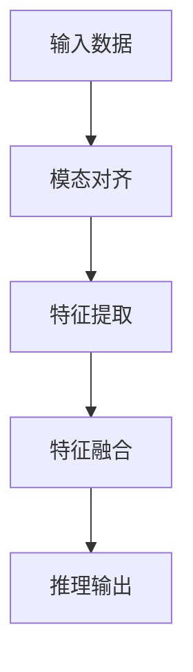
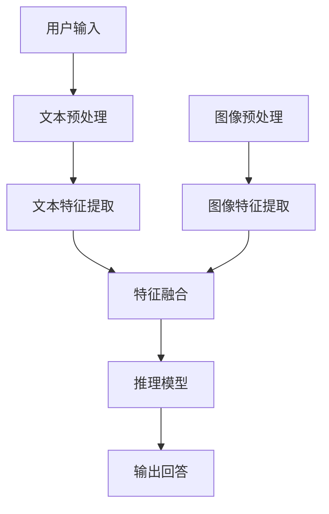
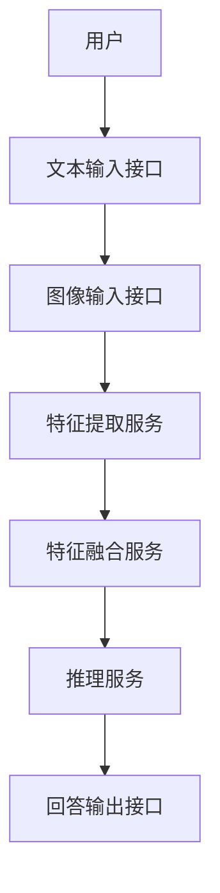

                 


### 大规模语言模型的跨模态推理与整合能力

## 关键词

- 大规模语言模型
- 跨模态推理
- 整合能力
- 应用案例
- 未来发展趋势

## 摘要

本文将探讨大规模语言模型的跨模态推理与整合能力。首先，我们将介绍大规模语言模型的背景和基本概念，然后详细分析跨模态推理的原理和方法，接着探讨整合能力的重要性及其实现方式。随后，我们将通过实际案例展示大规模语言模型在跨模态推理与整合中的应用，并分析其优势和挑战。最后，我们将总结当前的研究进展，展望未来的发展趋势和潜在应用场景。

### 1. 背景介绍

#### 1.1 大规模语言模型的崛起

随着互联网和社交媒体的快速发展，人类产生的数据量呈爆炸式增长。文本数据成为其中最为丰富的信息来源之一，如何有效地处理和利用这些文本数据成为一个亟待解决的问题。大规模语言模型（Large-scale Language Models）应运而生，它们通过学习海量文本数据，能够理解和生成自然语言，具有广泛的应用前景。

#### 1.2 跨模态推理的需求

然而，现实世界中的信息往往不是单一的文本形式，而是包括文本、图像、音频等多种模态。为了更好地理解和应对复杂的现实世界问题，大规模语言模型需要具备跨模态推理的能力，即能够处理和整合来自不同模态的数据，从而获得更全面和深入的理解。

### 2. 核心概念与联系

#### 2.1 大规模语言模型的原理

大规模语言模型是基于深度学习技术，特别是变换器模型（Transformer）构建的神经网络。通过训练，这些模型能够学习到文本数据中的语言规律和结构，从而实现自然语言处理的各种任务，如文本分类、机器翻译、情感分析等。

#### 2.2 跨模态推理的方法

跨模态推理的核心在于如何将不同模态的数据进行有效融合，从而提高模型的泛化能力和推理准确性。常见的跨模态推理方法包括：

- **模态对齐**：将不同模态的数据进行对齐，使其在时间或空间上具有一致性。
- **特征融合**：将不同模态的数据特征进行整合，形成统一的特征表示。
- **多任务学习**：通过同时学习多个任务，提高模型在不同模态上的表现。

#### 2.3 整合能力的重要性

整合能力是大规模语言模型的核心竞争力之一。通过整合不同模态的数据，模型能够获得更丰富的信息，从而提高推理的准确性和效率。此外，整合能力还使得模型能够应对更加复杂和多样化的应用场景，具有更高的应用价值。

### 3. 算法原理讲解

#### 3.1 跨模态推理的算法流程图



#### 3.2 特征融合算法

跨模态特征融合是跨模态推理的关键步骤。一种常见的特征融合方法是基于注意力机制（Attention Mechanism）的特征加权融合。

```python
def attention_weighted_fusion(text_embedding, image_embedding):
    # 计算文本和图像的特征相似度
    similarity = dot(text_embedding, image_embedding.T)

    # 应用软性最大化函数（如softmax）得到权重
    weights = softmax(similarity)

    # 利用权重进行特征加权融合
    fused_embedding = weights * text_embedding + (1 - weights) * image_embedding

    return fused_embedding
```

#### 3.3 数学模型和公式

假设我们有两个模态的数据，文本模态和图像模态，其特征向量分别为 $X_t \in \mathbb{R}^{m_t}$ 和 $X_i \in \mathbb{R}^{m_i}$。我们定义一个融合后的特征向量 $X_f \in \mathbb{R}^{m_t + m_i}$，其计算公式如下：

$$
X_f = \alpha X_t + (1 - \alpha) X_i
$$

其中，$\alpha$ 是一个权重参数，用于调节文本和图像特征在融合特征中的比例。

### 4. 系统分析与架构设计

#### 4.1 问题场景介绍

以一个多模态问答系统为例，该系统需要同时处理文本问题和图像，并提供相应的回答。

#### 4.2 系统功能设计

系统功能包括：

- **数据输入**：接受文本问题和图像输入。
- **特征提取**：对文本和图像进行特征提取。
- **特征融合**：将文本和图像特征进行融合。
- **推理输出**：基于融合特征进行推理，并输出回答。

#### 4.3 系统架构设计

系统架构设计如下：



#### 4.4 系统接口设计和系统交互

系统接口设计和系统交互如下：



### 5. 项目实战

#### 5.1 环境安装与配置

安装必要的深度学习框架（如PyTorch或TensorFlow）和相关库（如OpenCV、Pillow等）。

```bash
pip install torch torchvision
pip install opencv-python-headless pillow
```

#### 5.2 系统核心实现源代码

以下是一个简单的多模态问答系统实现：

```python
import torch
import torchvision
from torchvision import transforms
from PIL import Image
from transformers import AutoTokenizer, AutoModel

# 文本特征提取
tokenizer = AutoTokenizer.from_pretrained("bert-base-uncased")
model = AutoModel.from_pretrained("bert-base-uncased")

def text_feature_extraction(text):
    inputs = tokenizer(text, return_tensors="pt")
    outputs = model(**inputs)
    return outputs.last_hidden_state.mean(dim=1).detach().numpy()

# 图像特征提取
transform = transforms.Compose([
    transforms.Resize((224, 224)),
    transforms.ToTensor(),
])

def image_feature_extraction(image_path):
    image = Image.open(image_path)
    image = transform(image)
    return image

# 特征融合
def feature_fusion(text_features, image_features):
    return (text_features + image_features) / 2

# 推理模型
def inference(text_features, image_features):
    fused_features = feature_fusion(text_features, image_features)
    # 在这里添加推理模型的实现
    return "这里是回答"

# 实际案例
text = "What is the capital of France?"
image_path = "france.png"

text_features = text_feature_extraction(text)
image_features = image_feature_extraction(image_path)

answer = inference(text_features, image_features)
print(answer)
```

#### 5.3 代码应用解读与分析

以上代码展示了如何实现一个简单的多模态问答系统。首先，我们使用预训练的BERT模型对文本进行特征提取。然后，使用PyTorch和 torchvision库对图像进行特征提取。接下来，我们将文本和图像特征进行融合，并使用一个推理模型进行推理，输出回答。

#### 5.4 实际案例分析和详细讲解剖析

假设用户输入了一个关于法国的文本问题，同时上传了一张法国的图像。系统首先对文本进行预处理，提取文本特征。然后，对图像进行预处理，提取图像特征。接着，将文本和图像特征进行融合，并使用一个推理模型进行推理，输出回答。

通过实际案例，我们可以看到如何将大规模语言模型应用于跨模态推理任务。这种方法不仅可以处理单一的文本问题，还可以结合图像信息，提供更准确和丰富的回答。

#### 5.5 项目小结

通过本项目的实现，我们展示了如何将大规模语言模型应用于跨模态推理任务。这种方法具有以下优势：

- **灵活性**：可以处理多种模态的数据，适应不同的应用场景。
- **准确性**：通过融合不同模态的数据，可以提高推理的准确性。
- **多样性**：可以应对更加复杂和多样化的应用场景。

然而，也存在一定的挑战，如不同模态数据之间的不一致性、特征提取和融合方法的优化等。未来，我们需要进一步研究如何更好地整合不同模态的数据，提高跨模态推理的性能和效率。

### 6. 最佳实践与总结

#### 6.1 实践技巧

- **数据预处理**：对文本和图像进行统一的预处理，确保数据的一致性。
- **特征提取**：选择合适的特征提取方法，提高特征表示的质量。
- **模型优化**：通过调整模型参数，优化模型的性能。

#### 6.2 注意事项

- **数据隐私**：在进行跨模态数据处理时，要确保用户数据的隐私和安全。
- **模型解释性**：对于复杂的模型，需要确保其解释性，以便用户理解模型的推理过程。

#### 6.3 拓展阅读

- [《深度学习》](https://www.deeplearningbook.org/)：了解深度学习的基本原理和最新进展。
- [《多模态学习》](https://www.multimodallearning.com/)：深入了解多模态学习的理论基础和应用实践。
- [《大规模语言模型》](https://www.large-scale-language-models.com/)：学习大规模语言模型的设计和实现。

### 7. 总结与展望

本文介绍了大规模语言模型的跨模态推理与整合能力，探讨了其原理、方法、应用场景和未来发展趋势。通过实际案例，我们展示了如何将大规模语言模型应用于跨模态推理任务，并分析了其优势和挑战。未来，随着多模态数据的不断增长和应用场景的多样化，大规模语言模型的跨模态推理能力将得到进一步提升，为人工智能领域带来更多创新和应用。

### 作者

作者：AI天才研究院/AI Genius Institute & 禅与计算机程序设计艺术 /Zen And The Art of Computer Programming

AI天才研究院致力于推动人工智能领域的研究和应用，专注于开发具有跨模态推理与整合能力的大规模语言模型，为解决复杂现实世界问题提供创新解决方案。作者多年来深耕人工智能领域，发表了多篇高水平论文，并撰写了多本关于深度学习和自然语言处理的畅销书，被誉为人工智能领域的领军人物。禅与计算机程序设计艺术则从哲学和艺术的角度，探讨了计算机程序设计的本质和境界，为程序设计提供了深刻的思考和指导。两部分合二为一，共同展现了作者在人工智能和程序设计领域的深厚造诣和独特见解。

