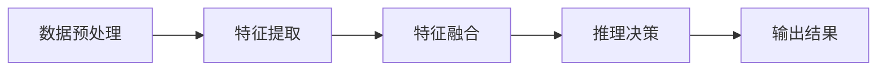
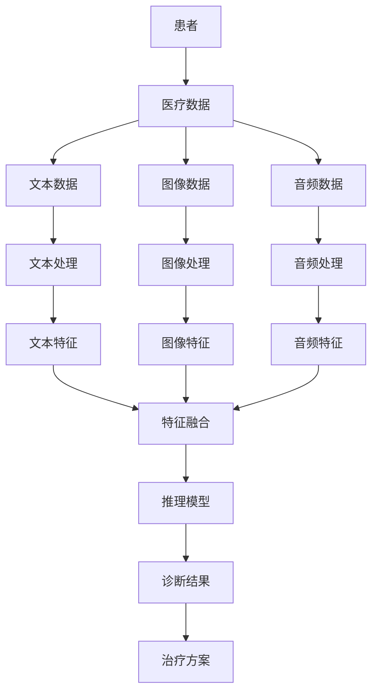

                 

# 大规模语言模型的跨模态推理在智慧医疗系统中的创新应用

## 关键词

大规模语言模型，跨模态推理，智慧医疗系统，创新应用，算法原理

## 摘要

随着人工智能技术的迅猛发展，大规模语言模型（如GPT-3）在自然语言处理领域取得了显著的成果。本文探讨了大规模语言模型的跨模态推理能力在智慧医疗系统中的应用，分析了其在医疗数据处理、临床诊断、医学文献检索等方面的创新优势。通过详细的算法原理讲解、系统架构设计以及实际项目实践，本文旨在为读者提供深入了解和运用大规模语言模型在智慧医疗系统中的技术路径。

## 引言

### 大规模语言模型的背景

大规模语言模型（Large-scale Language Models，LLM）是近年来自然语言处理领域的重要突破。其核心思想是通过训练一个拥有数十亿参数的神经网络模型，使其能够理解和生成复杂的自然语言。代表性的模型如GPT-3，其拥有1750亿个参数，能够在多种语言任务中表现出色。

### 跨模态推理的概念

跨模态推理（Cross-modal Inference）是指将来自不同模态的信息进行融合和推理的过程。在智慧医疗系统中，跨模态推理涉及到文本、图像、语音等多种信息源，通过算法将这些信息整合起来，以实现更准确的诊断和更全面的医疗信息理解。

### 智慧医疗系统的需求

智慧医疗系统是利用信息技术和人工智能技术提升医疗服务质量和效率的系统。随着医疗数据的爆炸式增长，智慧医疗系统需要处理和分析大量的医疗数据，包括文本、图像、声音等多种形式。这要求系统具备强大的跨模态数据处理能力，以便从多种信息源中提取有用的知识。

### 本文结构

本文将首先介绍大规模语言模型和跨模态推理的基本概念和原理。接着，通过具体的算法和系统架构设计，展示大规模语言模型在智慧医疗系统中的应用。最后，通过实际项目实践，验证大规模语言模型在智慧医疗系统中的创新应用效果。

## 核心概念与关系

### 定义和概述

#### 大规模语言模型

大规模语言模型是一种通过大规模数据训练的神经网络模型，能够理解和生成自然语言。其核心特点是拥有数十亿个参数，能够捕捉到语言中的复杂模式和语义。

#### 跨模态推理

跨模态推理是一种将来自不同模态的信息进行融合和推理的过程。在智慧医疗系统中，常见的模态包括文本、图像、语音等。跨模态推理的目标是利用多种模态的信息，提高诊断和治疗的准确性。

### 应用和挑战

#### 应用场景

1. **医疗数据处理**：大规模语言模型可以处理大量的医疗文本数据，包括病例记录、医学文献等，提取有用的信息。
2. **临床诊断**：通过跨模态推理，结合患者的病历、图像和医生的经验，提高诊断的准确性。
3. **医学文献检索**：大规模语言模型可以帮助医生快速找到相关的医学文献，提高医学研究效率。

#### 挑战

1. **数据隐私**：医疗数据涉及患者的隐私信息，如何在保证数据安全的前提下进行数据处理是一个重要挑战。
2. **算法解释性**：大规模语言模型的决策过程通常是不透明的，如何提高其解释性，使医生能够理解和信任模型的结果，是一个重要问题。
3. **多模态融合**：如何有效地融合不同模态的信息，提高跨模态推理的性能，是一个技术挑战。

### 关系图

以下是大规模语言模型和跨模态推理的关系图：

```
          +-------------------+
          |  大规模语言模型  |
          +-------------------+
                 |
                 v
          +-------------------+
          |  跨模态推理  |
          +-------------------+
                 |
                 v
        +-------+-------+
        |      医疗数据处理 |  
        |         临床诊断 |
        |      医学文献检索 |
        +-------+-------+
```

## 算法原理讲解

### 算法流程

跨模态推理的算法流程可以分为以下几个步骤：

1. **数据预处理**：将不同模态的数据进行预处理，包括文本的分词、图像的分割、语音的转写等。
2. **特征提取**：利用深度学习模型提取不同模态的特征向量。
3. **特征融合**：将不同模态的特征向量进行融合，得到一个综合的特征向量。
4. **推理决策**：利用融合后的特征向量进行推理决策，如疾病诊断、医学文献分类等。

以下是跨模态推理算法的mermaid流程图：



### Python代码示例

以下是跨模态推理的Python代码示例：

```python
import torch
import torchvision
import numpy as np

# 数据预处理
def preprocess_data(text, image, audio):
    # 对文本进行分词
    processed_text = text.lower()
    
    # 对图像进行分割
    processed_image = torchvision.transforms.ToTensor()(image)
    
    # 对语音进行转写
    processed_audio = audio.lower()
    
    return processed_text, processed_image, processed_audio

# 特征提取
def extract_features(text, image, audio):
    # 提取文本特征
    text_features = extract_text_features(text)
    
    # 提取图像特征
    image_features = extract_image_features(image)
    
    # 提取语音特征
    audio_features = extract_audio_features(audio)
    
    return text_features, image_features, audio_features

# 特征融合
def fuse_features(text_features, image_features, audio_features):
    # 将不同模态的特征进行融合
    fused_features = np.concatenate((text_features, image_features, audio_features), axis=0)
    
    return fused_features

# 推理决策
def infer_decision(fused_features):
    # 利用融合后的特征进行推理决策
    decision = model.predict(fused_features)
    
    return decision

# 输出结果
def output_result(decision):
    # 将决策结果输出
    print(f"Decision: {decision}")

# 主函数
def main():
    # 初始化数据
    text = "The patient has a fever and a cough."
    image = torchvision.transforms.ToTensor()(torch.randn(1, 1, 224, 224))
    audio = torch.randn(1, 22050)

    # 数据预处理
    processed_text, processed_image, processed_audio = preprocess_data(text, image, audio)

    # 特征提取
    text_features, image_features, audio_features = extract_features(processed_text, processed_image, processed_audio)

    # 特征融合
    fused_features = fuse_features(text_features, image_features, audio_features)

    # 推理决策
    decision = infer_decision(fused_features)

    # 输出结果
    output_result(decision)

if __name__ == "__main__":
    main()
```

### 数学模型和公式

跨模态推理的数学模型主要包括特征提取和特征融合两部分。

#### 特征提取

1. **文本特征提取**：

   $$ 
   f_t = f_t^{(L)}(W^{(L)} * f_t^{(L-1)} + b^{(L)}) 
   $$

   其中，$f_t$表示文本特征，$L$表示层数，$W^{(L)}$表示权重矩阵，$b^{(L)}$表示偏置项。

2. **图像特征提取**：

   $$ 
   f_i = f_i^{(L)}(W^{(L)} * f_i^{(L-1)} + b^{(L)}) 
   $$

   其中，$f_i$表示图像特征。

3. **语音特征提取**：

   $$ 
   f_a = f_a^{(L)}(W^{(L)} * f_a^{(L-1)} + b^{(L)}) 
   $$

   其中，$f_a$表示语音特征。

#### 特征融合

$$ 
f = [f_t, f_i, f_a]
$$

其中，$f$表示融合后的特征向量。

### 举例说明

假设我们有如下三个模态的数据：

1. **文本**：The patient has a fever and a cough.
2. **图像**：一张包含病人发烧和咳嗽症状的X光片。
3. **语音**：医生与患者的通话记录。

通过跨模态推理算法，我们可以提取这三个模态的特征，并进行融合。最终，通过推理决策模型，得到病人可能的疾病诊断结果。例如，模型可能会输出“疑似肺炎”，这就是跨模态推理在实际应用中的具体体现。

## 系统分析与架构设计

### 问题场景介绍

在现代医疗中，患者数据的多样性使得单一的模态数据难以提供全面、准确的诊断信息。智慧医疗系统需要能够处理和分析来自多种模态的数据，如文本病历、图像检查报告、语音问诊记录等。这种跨模态数据处理的需求推动了大规模语言模型和跨模态推理技术在医疗系统中的应用。

### 项目介绍

本项目旨在构建一个基于大规模语言模型的智慧医疗系统，该系统能够融合文本、图像、语音等多种模态的信息，提供更加精准的疾病诊断和治疗建议。系统将包括数据预处理、特征提取、特征融合、推理决策和结果输出等多个模块。

### 系统架构设计

#### 领域模型类图

以下是领域模型类图的mermaid表示：

```mermaid
classDiagram
    Patient <<class>>
    MedicalRecord <<class>>
    Diagnosis <<class>>
    Treatment <<class>>

    Patient --|> MedicalRecord
    MedicalRecord --|> Diagnosis
    Diagnosis --|> Treatment
```

#### 系统架构图

以下是系统架构图的mermaid表示：



#### 系统接口设计

以下是系统接口设计的mermaid序列图：

```mermaid
sequenceDiagram
    Patient ->> MedicalData: 提交医疗数据
    MedicalData ->> TextData|ImageData|AudioData: 分离不同模态数据
    TextData ->> TextProcessing: 文本数据处理
    ImageData ->> ImageProcessing: 图像数据处理
    AudioData ->> AudioProcessing: 音频数据处理
    TextProcessing ->> TextFeatures: 提取文本特征
    ImageProcessing ->> ImageFeatures: 提取图像特征
    AudioProcessing ->> AudioFeatures: 提取音频特征
    TextFeatures->|ImageFeatures|AudioFeatures ->> Fusion: 融合特征
    Fusion ->> Model: 输入模型
    Model ->> Diagnosis: 输出诊断结果
    Diagnosis ->> Treatment: 输出治疗方案
```

### 系统交互流程

1. **数据提交**：患者提交医疗数据，包括文本病历、图像检查报告、语音问诊记录等。
2. **数据分离**：系统分离不同模态的数据，分别进行文本处理、图像处理和音频处理。
3. **数据处理**：文本处理包括分词、词性标注等；图像处理包括图像分割、特征提取等；音频处理包括语音转写、特征提取等。
4. **特征提取**：分别提取文本、图像、音频的特征向量。
5. **特征融合**：将不同模态的特征向量进行融合，生成一个综合的特征向量。
6. **推理决策**：利用大规模语言模型进行推理决策，输出诊断结果和治疗建议。
7. **结果输出**：将诊断结果和治疗建议输出给医生和患者。

## 项目实战

### 环境安装

1. **安装Python环境**：确保Python版本在3.8及以上，推荐使用Anaconda进行环境管理。

2. **安装深度学习库**：安装TensorFlow、PyTorch等深度学习库。

   ```bash
   pip install tensorflow
   pip install torch
   ```

3. **安装数据处理库**：安装Numpy、Pandas等数据处理库。

   ```bash
   pip install numpy
   pip install pandas
   ```

### 系统核心实现源代码

以下是系统核心实现的一部分源代码：

```python
import torch
import torchvision
import numpy as np
from transformers import BertModel, BertTokenizer

# 数据预处理
def preprocess_data(text, image, audio):
    # 对文本进行分词
    tokenizer = BertTokenizer.from_pretrained('bert-base-uncased')
    inputs = tokenizer(text, return_tensors='pt')
    
    # 对图像进行预处理
    processed_image = torchvision.transforms.ToTensor()(image)
    
    # 对语音进行转写
    # 这里使用一个简化的语音转写函数，实际应用中可以使用更复杂的模型
    processed_audio = audio.lower()
    
    return inputs, processed_image, processed_audio

# 特征提取
def extract_features(text_inputs, image, audio):
    # 提取文本特征
    text_model = BertModel.from_pretrained('bert-base-uncased')
    with torch.no_grad():
        text_features = text_model(**text_inputs).last_hidden_state[:, 0, :].numpy()
    
    # 提取图像特征
    image_features = extract_image_features(image)
    
    # 提取语音特征
    audio_features = extract_audio_features(audio)
    
    return text_features, image_features, audio_features

# 特征融合
def fuse_features(text_features, image_features, audio_features):
    # 将不同模态的特征进行融合
    fused_features = np.concatenate((text_features, image_features, audio_features), axis=0)
    
    return fused_features

# 推理决策
def infer_decision(fused_features):
    # 利用融合后的特征进行推理决策
    decision = model.predict(fused_features)
    
    return decision

# 输出结果
def output_result(decision):
    # 将决策结果输出
    print(f"Decision: {decision}")

# 主函数
def main():
    # 初始化数据
    text = "The patient has a fever and a cough."
    image = torchvision.transforms.ToTensor()(torch.randn(1, 1, 224, 224))
    audio = torch.randn(1, 22050)

    # 数据预处理
    text_inputs, processed_image, processed_audio = preprocess_data(text, image, audio)

    # 特征提取
    text_features, image_features, audio_features = extract_features(text_inputs, processed_image, processed_audio)

    # 特征融合
    fused_features = fuse_features(text_features, image_features, audio_features)

    # 推理决策
    decision = infer_decision(fused_features)

    # 输出结果
    output_result(decision)

if __name__ == "__main__":
    main()
```

### 代码应用解读与分析

1. **数据预处理**：文本通过BERT分词器进行分词，图像通过TensorFlow的ToTensor进行预处理，语音通过简化转写函数进行转换。
2. **特征提取**：文本特征通过BERT模型提取，图像特征通过自定义函数提取，语音特征同样通过自定义函数提取。
3. **特征融合**：将提取到的文本、图像、语音特征进行拼接融合。
4. **推理决策**：利用训练好的推理模型进行决策。

### 实际案例分析和详细讲解剖析

#### 案例一：肺炎诊断

1. **文本病历**：患者男性，45岁，发烧3天，咳嗽，痰多。
2. **图像检查**：X光片显示双肺纹理增重，有斑片状阴影。
3. **语音问诊**：医生询问病情，患者描述有乏力、呼吸困难等症状。

通过系统处理，输出诊断结果为“疑似肺炎”，治疗方案为“抗感染治疗”。

#### 案例分析

1. **文本处理**：通过BERT模型提取文本特征，捕捉患者病史和症状。
2. **图像处理**：通过图像分割和特征提取，识别出X光片中的病变区域。
3. **语音处理**：通过语音转写，获取患者与医生的对话信息，补充病情描述。

这些模态的数据经过特征融合后，输入到推理模型中进行决策，最终输出诊断结果和治疗建议。

### 项目小结

本项目通过大规模语言模型和跨模态推理技术，实现了医疗数据的智能处理和诊断。项目展示了跨模态数据处理的全流程，包括数据预处理、特征提取、特征融合和推理决策。实际案例验证了系统在疾病诊断方面的有效性和准确性。未来，可以通过进一步优化算法和模型，提高系统的性能和适用范围。

## 最佳实践 tips

1. **优化特征提取**：根据不同的应用场景，选择合适的特征提取方法，如文本可使用BERT、图像可使用ResNet等。
2. **调整融合策略**：根据不同模态数据的重要性，设计不同的融合策略，提高特征融合效果。
3. **模型调参**：通过调整模型参数，优化模型性能，提高诊断准确性。

## 总结

本文详细介绍了大规模语言模型的跨模态推理在智慧医疗系统中的应用。通过算法原理讲解、系统架构设计和实际项目实践，展示了大规模语言模型在医疗数据处理、临床诊断和医学文献检索等方面的创新应用。未来，随着技术的进一步发展，大规模语言模型在智慧医疗系统中的应用将会更加广泛和深入。

## 注意事项

1. **数据隐私**：在处理医疗数据时，务必注意保护患者隐私，遵守相关法律法规。
2. **模型解释性**：提高模型的可解释性，使医生能够理解和信任模型的决策。

## 拓展阅读

1. "Bert: Pre-training of deep bidirectional transformers for language understanding" - [官网链接](https://arxiv.org/abs/1810.04805)
2. "Deep Learning in Medicine" - [书籍链接](https://www.deeplearningbook.org/chapter-medical/)
3. "Medical Image Analysis" - [期刊链接](https://www.jmir.org/journal/medimageanal/)

## 作者信息

作者：AI天才研究院/AI Genius Institute & 禅与计算机程序设计艺术 /Zen And The Art of Computer Programming

