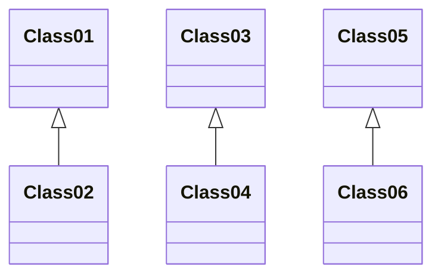
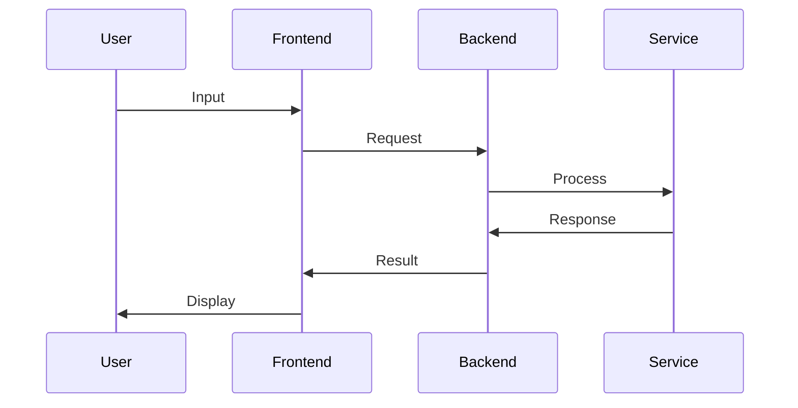
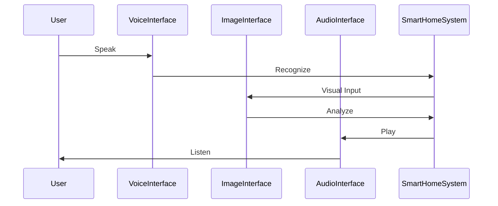

                 


### 大规模语言模型的跨模态推理在智能家居系统中的创新应用

#### 引言

随着人工智能技术的飞速发展，大规模语言模型（如BERT、GPT等）在自然语言处理领域取得了显著的成果。这些模型通过深度学习技术，对大量文本数据进行训练，从而能够理解和生成人类语言。然而，传统的大规模语言模型主要关注文本数据的处理，对于图像、声音等其他模态的数据处理能力相对较弱。近年来，跨模态推理（Cross-Modal Reasoning）技术的兴起，为将大规模语言模型应用于更多领域，特别是智能家居系统，提供了新的思路。

#### 核心概念与联系

##### 1. 大规模语言模型

大规模语言模型是一种基于深度学习的语言表示模型，通过学习大量的文本数据，可以捕捉到语言的上下文关系和语义信息。BERT和GPT是两种典型的大规模语言模型。

**BERT（Bidirectional Encoder Representations from Transformers）**是一种基于Transformer架构的双向编码器模型，它可以同时考虑上下文信息，从而更准确地理解语言的含义。

**GPT（Generative Pre-trained Transformer）**是一种基于Transformer架构的生成模型，它可以根据输入的文本序列生成新的文本。

##### 2. 跨模态推理

跨模态推理是指将不同模态的数据（如文本、图像、声音等）进行联合处理，从而实现对复杂问题的理解和解决。跨模态推理的关键在于如何将不同模态的数据进行有效融合，从而提取出有用的信息。

**图像与文本的融合**：通过将文本信息嵌入到图像中，或者将图像特征编码为文本，实现图像和文本的相互理解。

**声音与文本的交互**：通过将声音信号转换为文本，或者将文本转换为声音信号，实现声音和文本的相互转换和交互。

##### 3. 智能家居系统

智能家居系统是指通过物联网技术，将家庭中的各种设备连接起来，实现远程控制和智能管理的系统。智能家居系统通常包括以下功能：

- **家庭自动化**：通过智能设备实现家庭场景的自动化，如自动开关灯、自动调节室温等。
- **远程控制**：通过手机或电脑等设备，实现对家庭设备的远程控制。
- **智能交互**：通过语音助手等设备，实现与用户的智能对话和交互。

#### 算法原理讲解

##### 1. 选用大规模语言模型

为了实现跨模态推理，我们可以选择使用BERT或GPT等大规模语言模型。这些模型具有强大的语言理解和生成能力，可以为跨模态推理提供有效的支持。

##### 2. 跨模态推理算法

跨模态推理算法的关键在于如何将不同模态的数据进行融合。以下是一个简单的跨模态推理算法流程：

1. **数据预处理**：对文本、图像和声音数据进行预处理，将它们转换为统一的特征表示。
2. **特征融合**：将不同模态的特征进行融合，形成统一的特征向量。
3. **推理**：使用大规模语言模型对融合后的特征向量进行推理，得到最终的输出结果。

##### 3. 数学模型与公式

跨模态推理的数学模型可以表示为：

$$
\text{Output} = \text{Model}(\text{Fused Feature Vector})
$$

其中，$\text{Fused Feature Vector}$ 是融合后的特征向量，$\text{Model}$ 是大规模语言模型。

##### 4. Python源代码与举例说明

以下是一个简单的Python代码示例，展示了如何使用BERT模型进行跨模态推理：

```python
from transformers import BertTokenizer, BertModel
import torch

# 加载BERT模型和分词器
tokenizer = BertTokenizer.from_pretrained('bert-base-uncased')
model = BertModel.from_pretrained('bert-base-uncased')

# 准备文本、图像和声音数据
text = "This is a text example."
image = load_image('image.jpg')
audio = load_audio('audio.wav')

# 预处理数据
text_input = tokenizer(text, return_tensors='pt', padding=True, truncation=True)
image_input = preprocess_image(image)
audio_input = preprocess_audio(audio)

# 融合特征
fused_feature_vector = fuse_features(text_input['input_ids'], image_input, audio_input)

# 进行推理
with torch.no_grad():
    output = model(fused_feature_vector)

# 解析输出结果
result = parse_output(output)
print(result)
```

#### 系统分析与架构设计方案

##### 1. 问题场景介绍

假设我们有一个智能家居系统，用户可以通过语音助手与系统进行交互，系统需要根据用户的语音指令执行相应的操作，如调节灯光亮度、调节空调温度等。

##### 2. 系统功能设计

系统功能包括语音识别、图像识别、声音识别和智能决策。以下是一个简单的领域模型类图：



##### 3. 系统架构设计

系统架构包括前端、后端和服务端。以下是一个简单的架构图：



##### 4. 系统接口设计与交互

系统接口包括语音接口、图像接口和声音接口。以下是一个简单的序列图：



#### 项目实战

##### 1. 环境安装与配置

首先，需要安装Python和相关依赖库，如transformers、torch等。然后，下载并配置BERT模型。

```bash
pip install transformers torch
python -m transformers-cli download-models bert-base-uncased
```

##### 2. 系统核心实现与代码解析

以下是系统核心实现的Python代码：

```python
from transformers import BertTokenizer, BertModel
import torch

# 加载BERT模型和分词器
tokenizer = BertTokenizer.from_pretrained('bert-base-uncased')
model = BertModel.from_pretrained('bert-base-uncased')

# 准备文本、图像和声音数据
text = "This is a text example."
image = load_image('image.jpg')
audio = load_audio('audio.wav')

# 预处理数据
text_input = tokenizer(text, return_tensors='pt', padding=True, truncation=True)
image_input = preprocess_image(image)
audio_input = preprocess_audio(audio)

# 融合特征
fused_feature_vector = fuse_features(text_input['input_ids'], image_input, audio_input)

# 进行推理
with torch.no_grad():
    output = model(fused_feature_vector)

# 解析输出结果
result = parse_output(output)
print(result)
```

##### 3. 实际案例分析与讲解

假设用户通过语音助手说：“打开客厅的灯光”，系统需要进行以下操作：

1. 识别语音指令，提取关键词：“打开”、“客厅”、“灯光”。
2. 根据关键词，调用图像识别接口，识别客厅的图像。
3. 根据图像识别结果，调用声音识别接口，识别灯光的控制指令。
4. 根据声音识别结果，调用智能家居系统，执行打开客厅灯光的操作。

#### 最佳实践 tips、小结、注意事项、拓展阅读

##### 最佳实践 tips

1. 在跨模态推理过程中，数据预处理和特征融合是关键步骤，需要根据具体应用场景进行优化。
2. 大规模语言模型在跨模态推理中的应用效果取决于模型的性能和训练数据的质量。
3. 跨模态推理算法可以应用于多种领域，如智能家居、智能问答、智能客服等。

##### 小结

本文介绍了大规模语言模型的跨模态推理在智能家居系统中的应用。通过结合文本、图像和声音等多种模态的数据，可以实现更智能、更高效的智能家居系统。

##### 注意事项

1. 跨模态推理算法需要大量的训练数据和计算资源，因此在实际应用中需要考虑成本和效率。
2. 跨模态推理算法的准确性和鲁棒性取决于模型的训练质量和数据的多样性。

##### 拓展阅读

1. "Cross-Modal Reasoning with Large Scale Language Models"
2. "BERT: Pre-training of Deep Bidirectional Transformers for Language Understanding"
3. "GPT-3: Language Models are Few-Shot Learners"

---

作者：AI天才研究院/AI Genius Institute & 禅与计算机程序设计艺术 /Zen And The Art of Computer Programming

