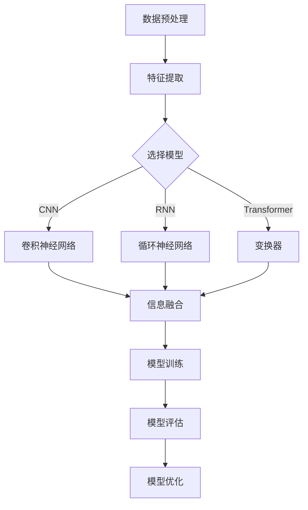
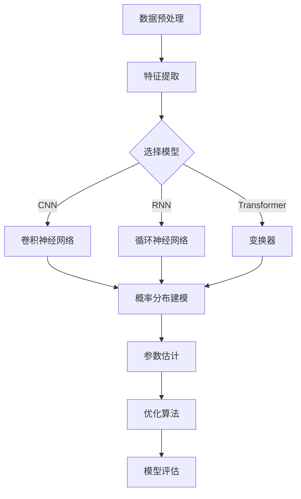
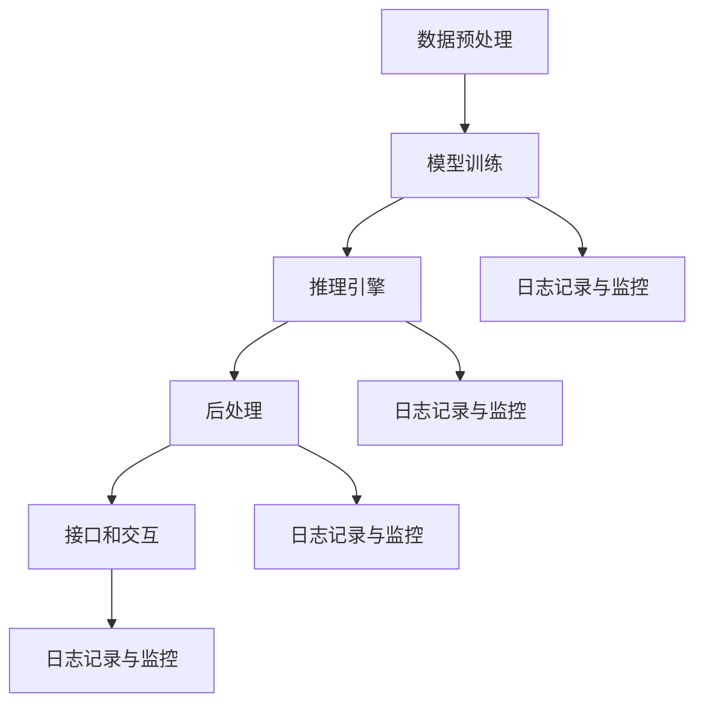
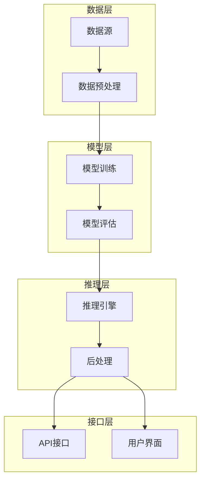

                 


## 引言

### 大规模语言模型的崛起

随着人工智能技术的迅猛发展，大规模语言模型（Large-scale Language Models，简称LLMs）已经成为自然语言处理（Natural Language Processing，简称NLP）领域的重要工具。LLMs通过学习海量文本数据，能够捕捉语言的深层结构和语义信息，从而在文本生成、机器翻译、问答系统等方面表现出色。然而，随着需求的不断增长，仅仅处理文本信息已经无法满足用户的需求，跨模态推理（Multimodal Reasoning）成为了一个新的研究热点。

### 跨模态推理的研究意义

跨模态推理是指同时处理多种模态（如文本、图像、声音等）信息，以实现更准确、更丰富的理解和交互。在现实世界中，人类感知和认知信息的过程往往是多模态的，因此，研究跨模态推理对于提高人工智能系统的智能水平具有重要意义。例如，在医疗领域，结合文本病历和图像检查结果进行诊断，可以显著提高诊断的准确率；在自动驾驶领域，结合文本导航指令和图像环境感知，可以实现更安全的自动驾驶。

### 书籍背景与核心内容

本书旨在系统介绍大规模语言模型的跨模态推理能力开发，分为八个章节，全面覆盖从基本概念到应用实战的内容。具体来说，第一章节介绍大规模语言模型的基本概念、发展历程和应用场景；第二章节介绍跨模态推理的基本概念、挑战和技术路线；第三章节到第六章节深入讲解跨模态推理的核心概念、算法设计、数学模型和系统架构；第七章节通过实际应用案例进行分析和讲解；第八章节总结最佳实践，并提出未来研究方向。

## 关键词

- 大规模语言模型
- 跨模态推理
- 自然语言处理
- 机器学习
- 神经网络
- 深度学习
- 多媒体内容推荐
- 人机交互

## 摘要

本书围绕大规模语言模型的跨模态推理能力开发展开，全面介绍跨模态推理的基本概念、技术路线、算法设计、系统架构和应用案例。通过深入分析和讲解，帮助读者理解跨模态推理的原理和应用，掌握跨模态推理的开发方法，为人工智能系统在多模态信息处理领域的应用提供有力支持。

## 第1章 大规模语言模型概述

### 1.1 大规模语言模型的基本概念

#### 1.1.1 语言模型的定义

语言模型（Language Model）是一种概率模型，用于预测一个单词或短语出现的概率。在自然语言处理（NLP）领域，语言模型是许多任务的基础，如文本分类、机器翻译、语音识别等。传统的语言模型基于统计方法，如N-gram模型，通过分析历史文本数据来预测未来单词的出现概率。

#### 1.1.2 语言模型的核心组成部分

语言模型主要由两部分组成：语料库（Corpus）和模型参数（Model Parameters）。语料库是训练语言模型的原始数据集，通常包含大量文本数据。模型参数是语言模型的核心，用于表示语言的特征和规律。

#### 1.1.3 语言模型的训练与评估

语言模型的训练过程是通过最小化预测误差来调整模型参数。常见的评估指标包括准确率（Accuracy）、损失函数（Loss Function）和困惑度（Perplexity）。通过评估指标，我们可以衡量语言模型的性能，并调整模型参数以改善性能。

### 1.2 大规模语言模型的发展历程

#### 1.2.1 从基础模型到大规模模型

大规模语言模型的发展历程可以追溯到20世纪80年代。最初，基于统计方法的语言模型，如N-gram模型，在NLP任务中表现出色。然而，随着数据规模的增大和计算能力的提升，深度学习（Deep Learning）逐渐成为语言模型的主要发展方向。

#### 1.2.2 开源模型的崛起

近年来，随着开源模型的兴起，如GPT（Generative Pre-trained Transformer）和BERT（Bidirectional Encoder Representations from Transformers），大规模语言模型的应用变得更加广泛。这些模型通过在大量数据上预训练，然后进行微调（Fine-tuning），可以在各种NLP任务中取得优异的性能。

#### 1.2.3 工业界与研究机构的合作

大规模语言模型的发展离不开工业界和研究机构的合作。许多大型科技公司，如谷歌、微软、百度等，都投入了大量资源进行大规模语言模型的研究和应用。同时，学术界也在不断推动大规模语言模型的理论研究和算法优化。

### 1.3 大规模语言模型的性能评估

#### 1.3.1 性能评估指标

大规模语言模型的性能评估指标主要包括准确率（Accuracy）、损失函数（Loss Function）和困惑度（Perplexity）。准确率衡量模型预测正确的比例，损失函数衡量模型预测误差的度量，困惑度衡量模型对文本数据的拟合程度。

#### 1.3.2 常见的评估基准和排行榜

为了比较不同模型在NLP任务上的性能，常见的评估基准和排行榜，如GLUE（General Language Understanding Evaluation）和SuperGLUE（Super Performance on Language Understanding Tasks），被广泛采用。这些评估基准涵盖了多种NLP任务，为模型性能的比较提供了统一的衡量标准。

#### 1.3.3 性能瓶颈与改进方向

尽管大规模语言模型在许多任务上表现出色，但仍然存在一些性能瓶颈，如数据偏差、上下文理解能力不足等。未来的研究将重点关注如何提升大规模语言模型的性能，解决这些瓶颈问题。

### 1.4 大规模语言模型的应用场景

#### 1.4.1 自然语言处理

自然语言处理（NLP）是大规模语言模型最重要的应用场景之一。NLP任务包括文本分类、命名实体识别、情感分析等。大规模语言模型在NLP任务中表现出色，显著提高了任务性能。

#### 1.4.2 机器翻译

机器翻译（Machine Translation）是另一个重要应用场景。大规模语言模型通过在多语言语料库上进行预训练，可以生成高质量的双语翻译文本。

#### 1.4.3 语音识别

语音识别（Speech Recognition）是将语音转换为文本的技术。大规模语言模型在语音识别任务中可以用于语音文本的转换和语义理解。

#### 1.4.4 图像识别与生成

图像识别与生成（Image Recognition and Generation）是大规模语言模型在计算机视觉领域的应用。通过结合文本描述和图像数据，大规模语言模型可以实现图像分类、图像生成等任务。

### 1.5 本章小结

本章介绍了大规模语言模型的基本概念、发展历程、性能评估和应用场景。通过本章的学习，读者可以了解大规模语言模型的基本原理和应用，为后续章节的深入学习打下基础。

## 第2章 跨模态推理

### 2.1 跨模态推理的基本概念

#### 2.1.1 跨模态的定义

跨模态（Multimodal）是指同时处理两种或两种以上不同类型的信息，如文本、图像、声音等。在计算机科学领域，跨模态推理（Multimodal Reasoning）是指利用不同模态的信息进行推理和决策的过程。

#### 2.1.2 跨模态推理的重要性

跨模态推理在许多应用场景中具有重要意义。例如，在医疗领域，结合文本病历和图像检查结果进行诊断，可以显著提高诊断的准确率；在自动驾驶领域，结合文本导航指令和图像环境感知，可以实现更安全的自动驾驶。

#### 2.1.3 跨模态推理的类型

跨模态推理可以分为以下几种类型：

1. **单一模态优先**：在这种类型中，一个模态的信息被优先处理，其他模态的信息作为辅助。例如，在语音识别任务中，语音信号是主要的信息来源，而文本信息仅用于校正或补充。

2. **交互式跨模态**：在这种类型中，不同模态的信息相互影响，共同进行推理和决策。例如，在问答系统中，用户输入的文本问题和系统生成的文本回答可以相互补充，以提供更准确的答案。

3. **混合模态**：在这种类型中，多个模态的信息同时被处理，共同生成最终的结果。例如，在视频内容理解任务中，视频帧的图像信息和音频信息可以同时用于理解视频内容。

### 2.2 跨模态推理的挑战

#### 2.2.1 模型融合的挑战

跨模态推理的一个关键挑战是如何有效地融合不同模态的信息。由于不同模态的信息具有不同的特征和表示方式，如何将它们整合到一个统一的框架中是一个重要问题。

#### 2.2.2 数据不一致性处理

在跨模态推理中，不同模态的数据可能存在不一致性，如数据量、数据质量和数据分布等。如何处理这些不一致性，以确保推理的准确性和一致性，是一个重要挑战。

#### 2.2.3 交互性要求

跨模态推理往往需要交互式地进行，即用户可以提供反馈，模型根据反馈进行调整。这种交互性要求对模型的设计和实现提出了更高的要求。

### 2.3 跨模态推理的技术路线

#### 2.3.1 传统方法

传统跨模态推理方法主要包括基于规则的方法和基于统计的方法。基于规则的方法通过定义明确的规则来融合不同模态的信息，但灵活性较差。基于统计的方法通过分析历史数据来预测当前模态的信息，但可能面临数据稀疏和过拟合等问题。

#### 2.3.2 神经网络方法

神经网络方法通过学习输入数据的特征和规律，实现跨模态的信息融合。常见的神经网络方法包括卷积神经网络（CNN）、循环神经网络（RNN）和自注意力机制（Self-Attention）。这些方法在处理大规模数据和复杂特征方面具有显著优势。

#### 2.3.3 联合训练方法

联合训练方法通过同时训练多个模态的模型，实现跨模态的信息融合。这种方法可以充分利用不同模态的信息，提高推理的准确性和鲁棒性。

#### 2.3.4 模型蒸馏与迁移学习方法

模型蒸馏（Model Distillation）和迁移学习（Transfer Learning）是近年来发展起来的跨模态推理方法。模型蒸馏方法通过将一个复杂模型的知识传递给一个较简单的模型，实现跨模态的信息融合。迁移学习方法通过在不同任务间迁移知识，提高跨模态推理的性能。

### 2.4 跨模态推理的应用案例

#### 2.4.1 问答系统

问答系统是跨模态推理的重要应用场景之一。通过结合文本问题和图像信息，问答系统可以提供更准确、更丰富的答案。

#### 2.4.2 多媒体内容推荐

多媒体内容推荐系统通过结合用户的历史行为和不同模态的内容特征，为用户提供个性化的推荐。

#### 2.4.3 人机交互

跨模态推理在自然交互中具有重要意义。通过结合文本、语音和图像信息，人机交互系统可以更好地理解用户的意图，提供更自然的交互体验。

### 2.5 本章小结

本章介绍了跨模态推理的基本概念、挑战和技术路线，以及实际应用案例。通过本章的学习，读者可以了解跨模态推理的原理和应用，为后续章节的深入学习打下基础。

-----------------------------------

## 第3章 跨模态推理的核心概念和原理

### 3.1 跨模态推理的概念

跨模态推理是指在处理信息时，不仅依赖于单一模态的数据，而是结合两种或多种不同模态的数据，进行综合分析和推理的过程。例如，在医疗诊断中，医生可能需要同时查看病人的病历文本和医疗影像图像，从而做出更准确的诊断。

### 3.2 跨模态推理的类型

#### 3.2.1 数据驱动的跨模态推理

数据驱动的跨模态推理主要依赖于训练数据集来学习不同模态之间的关联关系。这种类型通常使用机器学习算法，特别是深度学习模型，来预测或分类不同模态的数据。

#### 3.2.2 知识驱动的跨模态推理

知识驱动的跨模态推理则依赖于预先定义的规则或知识库，这些规则或知识库描述了不同模态之间的关系。这种方法在处理结构化数据时非常有效，但可能难以适应复杂和非结构化的数据。

#### 3.2.3 交互式跨模态推理

交互式跨模态推理涉及到用户和系统的实时互动，用户可以提供反馈来调整系统输出的结果。这种类型通常用于人机交互系统，如智能助手和虚拟助手。

### 3.3 跨模态推理的关键概念

#### 3.3.1 模态融合

模态融合是跨模态推理的核心问题，即如何有效地将不同模态的数据融合为一个统一的表示。常见的融合方法包括：

- **特征级融合**：将不同模态的特征向量直接相加或拼接。
- **决策级融合**：在不同的模态分别进行预测或分类，然后通过投票或其他策略合并结果。

#### 3.3.2 多任务学习

多任务学习是一种跨模态推理的常见策略，通过同时训练多个任务模型，共享底层特征表示，以提高跨模态推理的性能。这种方法可以充分利用不同任务之间的相关性，提高模型的泛化能力。

#### 3.3.3 对抗性学习

对抗性学习是一种特殊的跨模态学习方法，通过训练两个对抗网络，一个生成器网络和一个判别器网络，来提高跨模态推理的能力。生成器网络试图生成与真实数据难以区分的模态数据，而判别器网络试图区分真实数据和生成数据。

### 3.4 跨模态推理的挑战和解决方案

#### 3.4.1 模型融合挑战

跨模态推理面临的一个主要挑战是如何有效地融合不同模态的信息。由于不同模态的数据具有不同的特性和表示方式，如何将它们集成到一个统一的框架中是一个难点。

- **解决方案**：使用深度神经网络来学习不同模态之间的映射关系，并通过多任务学习或对抗性学习来提高融合效果。

#### 3.4.2 数据不一致性处理

不同模态的数据可能存在不一致性，如数据量、数据质量和数据分布等。这种不一致性会影响跨模态推理的性能。

- **解决方案**：使用数据预处理技术来统一不同模态的数据，如数据增强、归一化和数据对齐等。

#### 3.4.3 交互性要求

跨模态推理往往需要与用户进行实时交互，以获取反馈和调整推理结果。这种交互性要求对系统的响应速度和适应性提出了高要求。

- **解决方案**：设计自适应的交互式系统，通过反馈循环来优化推理过程。

### 3.5 跨模态推理的ER实体关系图

为了更清晰地展示跨模态推理的核心概念和组成要素，我们可以使用ER（实体-关系）图来表示。

```mermaid
erDiagram
  Data --> Model : 数据驱动
  Rule --> Model : 知识驱动
  Interaction --> Model : 交互式
  Data |--> Feature : 特征表示
  Model |--> Prediction : 预测与分类
  Model |--> Fusion : 模型融合
  Feature |--> Modality : 模态数据
  Modality |--> Text : 文本
  Modality |--> Image : 图像
  Modality |--> Audio : 声音
```

### 3.6 本章小结

本章深入探讨了跨模态推理的核心概念、类型、关键概念以及挑战和解决方案。通过ER实体关系图，我们更清晰地理解了跨模态推理的组成结构和要素关系。本章的内容为后续章节的深入分析和具体实现提供了理论基础。

-----------------------------------

## 第4章 跨模态推理的算法设计与实现

### 4.1 跨模态推理算法设计概述

跨模态推理的算法设计是实现跨模态推理系统的基础。本节将介绍跨模态推理算法的设计原则和关键步骤。

#### 4.1.1 设计原则

1. **数据一致性**：确保不同模态的数据在格式、维度和分布上的一致性，以便后续处理。
2. **信息整合**：设计有效的信息整合策略，将不同模态的信息融合为一个统一的表示。
3. **适应性**：算法应具有适应不同模态数据变化的能力，以应对实际应用中的不确定性。
4. **高效性**：算法应具有较高的计算效率和可扩展性，以适应大规模数据和高频次的推理需求。

#### 4.1.2 关键步骤

1. **数据预处理**：包括数据清洗、归一化和特征提取，为后续的算法训练和推理提供高质量的输入数据。
2. **模型选择**：根据应用场景和数据特点选择合适的模型，如卷积神经网络（CNN）、循环神经网络（RNN）、变换器（Transformer）等。
3. **信息融合**：设计信息融合策略，将不同模态的信息整合为一个统一的表示，常用的方法有特征拼接、特征融合网络和自注意力机制等。
4. **训练与评估**：通过训练数据集训练模型，并在验证集上评估模型性能，调整模型参数以优化性能。

### 4.2 常见的跨模态推理算法

#### 4.2.1 传统方法

传统的跨模态推理方法主要包括基于规则的方法和基于统计的方法。

1. **基于规则的方法**：这种方法通过定义明确的规则来融合不同模态的信息。例如，在图像识别中，可以使用文本描述中的关键词来指导图像的分类。
   
2. **基于统计的方法**：这种方法通过分析历史数据来预测当前模态的信息。例如，可以使用统计方法来分析文本和图像之间的相关性。

#### 4.2.2 神经网络方法

神经网络方法通过学习输入数据的特征和规律，实现跨模态的信息融合。以下是几种常见的神经网络方法：

1. **卷积神经网络（CNN）**：CNN广泛应用于图像识别任务，可以通过卷积层提取图像的特征。

2. **循环神经网络（RNN）**：RNN可以处理序列数据，适用于文本和语音等序列信息。

3. **变换器（Transformer）**：Transformer模型在自然语言处理领域取得了显著的成功，其自注意力机制可以有效处理长距离依赖问题。

#### 4.2.3 联合训练方法

联合训练方法通过同时训练多个模态的模型，实现跨模态的信息融合。以下是一些常见的联合训练方法：

1. **多任务学习**：在训练过程中，同时训练多个任务模型，共享底层特征表示。

2. **对抗性训练**：通过训练生成器和判别器，提高模型的泛化能力。

3. **注意力机制**：在模型中加入注意力机制，提高模型对重要信息的关注。

### 4.3 跨模态推理算法的Mermaid流程图

以下是一个跨模态推理算法的Mermaid流程图示例：



### 4.4 跨模态推理算法的Python实现

以下是一个简单的跨模态推理算法的Python实现示例：

```python
import tensorflow as tf
from tensorflow.keras.models import Model
from tensorflow.keras.layers import Input, Conv2D, Flatten, Dense

# 定义CNN模型
input_image = Input(shape=(224, 224, 3))
x = Conv2D(32, (3, 3), activation='relu')(input_image)
x = Conv2D(64, (3, 3), activation='relu')(x)
x = Flatten()(x)
x = Dense(64, activation='relu')(x)
output = Dense(1, activation='sigmoid')(x)

model = Model(inputs=input_image, outputs=output)
model.compile(optimizer='adam', loss='binary_crossentropy', metrics=['accuracy'])

# 训练模型
model.fit(x_train, y_train, epochs=10, batch_size=32, validation_data=(x_val, y_val))

# 评估模型
loss, accuracy = model.evaluate(x_test, y_test)
print(f"Test accuracy: {accuracy:.2f}")
```

### 4.5 数学模型和公式

跨模态推理算法的数学模型和公式是理解和实现算法的核心。以下是一个简单的数学模型示例：

$$
\begin{align*}
\text{Cross-Entropy Loss} &= -\frac{1}{N}\sum_{i=1}^{N} y_i \log(p_i) \\
\text{Accuracy} &= \frac{1}{N}\sum_{i=1}^{N} \mathbb{1}\{y_i = \arg\max_{j} p_j\}
\end{align*}
$$`

### 4.6 举例说明

假设我们有一个图像分类任务，目标是将输入图像分为猫和狗两类。我们可以使用CNN模型进行跨模态推理，以下是一个简单的例子：

1. **数据预处理**：将图像缩放到固定大小（如224x224），并进行归一化处理。
2. **模型设计**：设计一个简单的CNN模型，包括卷积层、池化层和全连接层。
3. **模型训练**：使用图像标签数据进行模型训练。
4. **模型评估**：在测试集上评估模型性能，计算准确率和交叉熵损失。

### 4.7 本章小结

本章详细介绍了跨模态推理的算法设计与实现，包括设计原则、常见算法、Mermaid流程图、Python实现、数学模型和公式以及举例说明。通过本章的学习，读者可以掌握跨模态推理算法的核心概念和实现方法，为实际应用奠定基础。

-----------------------------------

## 第5章 跨模态推理中的数学模型和公式

### 5.1 数学模型的基本概念

跨模态推理中的数学模型是基于数学理论和方法，用于描述和模拟跨模态信息处理的过程。这些模型通常涉及概率理论、统计学和优化算法，以处理不同模态之间的复杂关系和转换。数学模型为跨模态推理提供了理论基础，帮助我们理解和解释跨模态推理的原理和效果。

### 5.2 概率分布与参数估计

在跨模态推理中，概率分布和参数估计是非常重要的概念。概率分布用于描述不同模态的数据的统计特性，而参数估计则是通过历史数据来估计模型参数的过程。

#### 5.2.1 贝叶斯估计

贝叶斯估计是一种常用的参数估计方法，它基于贝叶斯定理来估计模型的参数。贝叶斯估计通过最大化后验概率来找到最佳参数估计，其公式如下：

$$
\theta = \arg\max_{\theta} P(\theta|D) = \arg\max_{\theta} \frac{P(D|\theta)P(\theta)}{P(D)}
$$

其中，\(P(\theta|D)\)是后验概率，\(P(D|\theta)\)是似然函数，\(P(\theta)\)是先验概率，\(P(D)\)是证据。

#### 5.2.2 马尔可夫模型

马尔可夫模型是一种用于描述序列数据的概率模型，它假设当前状态仅依赖于前一个状态，而与之前的状态无关。在跨模态推理中，马尔可夫模型可以用于建模不同模态之间的转移关系。

#### 5.2.3 高斯分布

高斯分布（正态分布）是一种常用的概率分布，用于描述连续数据的统计特性。在跨模态推理中，高斯分布可以用于建模不同模态的数据特征。

### 5.3 优化算法

优化算法是跨模态推理中的重要工具，用于调整模型参数以最小化损失函数。以下是几种常用的优化算法：

#### 5.3.1 梯度下降

梯度下降是一种基于导数的优化算法，用于最小化损失函数。其基本思想是通过迭代更新模型参数，使其逐渐逼近最小损失。

$$
\theta_{t+1} = \theta_t - \alpha \nabla_{\theta} J(\theta)
$$

其中，\(\theta_t\)是当前模型参数，\(\alpha\)是学习率，\(\nabla_{\theta} J(\theta)\)是损失函数关于模型参数的梯度。

#### 5.3.2 随机梯度下降

随机梯度下降（SGD）是梯度下降的一种变体，它通过随机选择样本来计算梯度，以减少计算复杂度和避免局部最小值。

#### 5.3.3Adam优化器

Adam优化器是一种自适应优化器，它结合了梯度下降和动量方法的优势，通过自适应调整学习率来优化模型参数。

$$
m_t = \beta_1 m_{t-1} + (1 - \beta_1) \nabla_{\theta} J(\theta) \\
v_t = \beta_2 v_{t-1} + (1 - \beta_2) \nabla_{\theta}^2 J(\theta) \\
\theta_t = \theta_{t-1} - \alpha \frac{m_t}{\sqrt{v_t} + \epsilon}
$$`

其中，\(m_t\)和\(v_t\)分别是第\(t\)次迭代的均值和方差估计，\(\beta_1\)和\(\beta_2\)是动量参数，\(\alpha\)是学习率，\(\epsilon\)是常数。

### 5.4 模型评估指标

在跨模态推理中，模型评估指标用于衡量模型性能。以下是几种常用的评估指标：

#### 5.4.1 准确率

准确率（Accuracy）是模型预测正确的比例，用于衡量模型的分类性能。

$$
\text{Accuracy} = \frac{\text{正确预测数}}{\text{总预测数}}
$$`

#### 5.4.2 召回率

召回率（Recall）是模型在正类中正确预测的比例，用于衡量模型的检测能力。

$$
\text{Recall} = \frac{\text{正确预测的正类数}}{\text{实际正类数}}
$$`

#### 5.4.3 F1分数

F1分数是准确率和召回率的加权平均，用于综合评估模型的性能。

$$
\text{F1分数} = 2 \times \frac{\text{准确率} \times \text{召回率}}{\text{准确率} + \text{召回率}}
$$`

### 5.5 跨模态推理的Mermaid流程图

以下是一个跨模态推理的Mermaid流程图示例：



### 5.6 数学模型和公式

以下是一些跨模态推理中常用的数学模型和公式：

$$
\begin{align*}
P(\text{输出}|\text{输入}) &= \text{Softmax}(\text{模型预测}) \\
L(\theta) &= -\sum_{i=1}^{N} y_i \log(p_i) \\
\theta &= \arg\max_{\theta} L(\theta) \\
\end{align*}
$$`

其中，\(P(\text{输出}|\text{输入})\)是输出概率分布，\(L(\theta)\)是损失函数，\(\theta\)是模型参数，\(y_i\)是真实标签，\(p_i\)是模型预测概率。

### 5.7 本章小结

本章详细介绍了跨模态推理中的数学模型和公式，包括概率分布、参数估计、优化算法和模型评估指标。通过本章的学习，读者可以理解跨模态推理中的数学原理，为实际应用提供理论基础。本章的内容为后续章节的深入分析和具体实现奠定了基础。

-----------------------------------

## 第6章 跨模态推理的系统架构设计

### 6.1 系统架构设计概述

跨模态推理的系统架构设计是构建高效、可扩展和鲁棒的跨模态推理系统的基础。一个良好的系统架构不仅能够满足功能需求，还能够适应未来技术的发展和业务需求的变化。本节将介绍跨模态推理系统架构的设计原则和关键组成部分。

#### 6.1.1 设计原则

1. **模块化**：系统架构应该采用模块化设计，将不同功能模块分离，便于维护和升级。
2. **可扩展性**：系统架构应具备良好的可扩展性，以便在不影响现有功能的前提下，添加新的模态或任务。
3. **高可用性**：系统架构应设计为高可用性，通过冗余设计、负载均衡和故障恢复机制，确保系统的稳定运行。
4. **灵活性**：系统架构应具备灵活性，能够适应不同的应用场景和需求变化。

#### 6.1.2 关键组成部分

跨模态推理系统通常包括以下关键组成部分：

1. **数据预处理模块**：负责处理不同模态的数据，包括数据清洗、归一化、特征提取等。
2. **模型训练模块**：负责训练跨模态推理模型，包括选择合适的算法、调整模型参数等。
3. **推理引擎模块**：负责执行跨模态推理任务，将不同模态的数据融合为一个统一的表示，并进行推理和决策。
4. **后处理模块**：负责对推理结果进行后处理，如分类结果的解释、可视化等。
5. **接口和交互模块**：负责与外部系统和用户交互，提供API接口、用户界面等。

### 6.2 系统架构设计方案

以下是一个典型的跨模态推理系统架构设计方案：



#### 6.2.1 数据预处理模块

数据预处理模块负责处理不同模态的数据，确保数据的一致性和高质量。具体步骤包括：

1. **数据清洗**：去除数据中的噪声和异常值，如缺失值、重复值等。
2. **数据归一化**：将不同模态的数据进行归一化处理，使其具有相似的尺度和范围。
3. **特征提取**：从不同模态的数据中提取有用的特征，如文本的词频、图像的边缘特征、声音的频谱特征等。

#### 6.2.2 模型训练模块

模型训练模块负责训练跨模态推理模型。具体步骤包括：

1. **模型选择**：根据应用场景和需求，选择合适的跨模态推理模型，如CNN、RNN、Transformer等。
2. **参数调整**：通过实验和调整，找到最优的模型参数，以提高模型性能。
3. **模型训练**：使用预处理后的数据进行模型训练，通过迭代优化模型参数。

#### 6.2.3 推理引擎模块

推理引擎模块负责执行跨模态推理任务。具体步骤包括：

1. **数据输入**：将不同模态的数据输入到推理引擎中。
2. **模态融合**：将不同模态的数据融合为一个统一的表示。
3. **推理和决策**：使用训练好的模型进行推理和决策，输出结果。

#### 6.2.4 后处理模块

后处理模块负责对推理结果进行后处理，以提高结果的准确性和可解释性。具体步骤包括：

1. **结果解释**：对推理结果进行解释，如分类结果的可视化、特征分析等。
2. **结果优化**：通过优化算法，进一步提高推理结果的准确性。

#### 6.2.5 接口和交互模块

接口和交互模块负责与外部系统和用户交互，提供API接口、用户界面等。具体步骤包括：

1. **API接口**：提供跨模态推理的API接口，便于外部系统调用。
2. **用户界面**：提供用户友好的界面，方便用户操作和查看推理结果。

### 6.3 系统架构的Mermaid架构图

以下是一个跨模态推理系统的Mermaid架构图示例：



### 6.4 系统接口设计和交互流程

系统接口设计和交互流程是跨模态推理系统的关键部分，决定了系统与其他系统的集成和用户的使用体验。以下是一个简单的系统接口设计和交互流程：

#### 6.4.1 API接口设计

1. **接口规范**：定义API接口的请求和响应格式，如HTTP请求的URL、参数和返回结果。
2. **安全性**：确保API接口的安全性，如使用Token认证、HTTPS加密等。
3. **接口文档**：编写详细的接口文档，包括接口描述、参数说明、返回结果等。

#### 6.4.2 交互流程

1. **用户请求**：用户通过用户界面或外部系统发起跨模态推理请求。
2. **数据预处理**：系统对用户请求的数据进行预处理，包括数据清洗、归一化和特征提取。
3. **模型推理**：系统使用训练好的模型对预处理后的数据执行跨模态推理。
4. **结果返回**：系统将推理结果返回给用户或外部系统，如分类结果、可视化结果等。

### 6.5 本章小结

本章介绍了跨模态推理的系统架构设计，包括设计原则、关键组成部分、架构图和接口设计。通过本章的学习，读者可以理解跨模态推理系统的构建方法，为实际项目的开发和实施提供指导。本章的内容为后续章节的深入分析和具体实现奠定了基础。

-----------------------------------

## 第7章 跨模态推理的应用实战

### 7.1 环境安装

在进行跨模态推理的应用实战之前，我们需要安装必要的软件和工具。以下是安装步骤：

1. **安装Python**：确保Python环境已经安装，建议安装Python 3.8及以上版本。
2. **安装TensorFlow**：TensorFlow是跨模态推理的重要工具，可以通过pip命令安装：

   ```shell
   pip install tensorflow
   ```

3. **安装其他依赖**：根据具体应用需求，可能需要安装其他依赖，如NumPy、Pandas等。

### 7.2 系统核心实现

以下是一个简单的跨模态推理系统的核心实现，包括数据预处理、模型训练、推理和结果输出。

#### 7.2.1 数据预处理

数据预处理是跨模态推理的基础，确保输入数据的质量和一致性。以下是一个简单的数据预处理代码示例：

```python
import tensorflow as tf
import numpy as np

# 假设我们有两个模态的数据：文本和图像
text_data = ["文本1", "文本2", "文本3"]
image_data = np.random.rand(3, 224, 224, 3)

# 数据清洗和归一化
def preprocess_data(text_data, image_data):
    # 文本数据清洗
    cleaned_text_data = [text.lower() for text in text_data]
    
    # 图像数据归一化
    normalized_image_data = image_data / 255.0
    
    return cleaned_text_data, normalized_image_data

cleaned_text_data, normalized_image_data = preprocess_data(text_data, image_data)
```

#### 7.2.2 模型训练

使用TensorFlow和Keras构建一个简单的跨模态推理模型。以下是一个基于CNN和RNN的模型示例：

```python
from tensorflow.keras.models import Model
from tensorflow.keras.layers import Input, Conv2D, MaxPooling2D, Flatten, Dense, LSTM

# 构建CNN部分
input_image = Input(shape=(224, 224, 3))
x = Conv2D(32, (3, 3), activation='relu')(input_image)
x = MaxPooling2D((2, 2))(x)
x = Conv2D(64, (3, 3), activation='relu')(x)
x = MaxPooling2D((2, 2))(x)
x = Flatten()(x)

# 构建RNN部分
input_text = Input(shape=(None,))
x = LSTM(64)(input_text)

# 融合两个部分
merged = tf.keras.layers.concatenate([x, x])

# 输出层
output = Dense(1, activation='sigmoid')(merged)

# 构建模型
model = Model(inputs=[input_image, input_text], outputs=output)

# 编译模型
model.compile(optimizer='adam', loss='binary_crossentropy', metrics=['accuracy'])

# 模型训练
model.fit([normalized_image_data, cleaned_text_data], labels, epochs=10, batch_size=32)
```

#### 7.2.3 推理和结果输出

使用训练好的模型进行推理，并将结果输出。以下是一个简单的推理示例：

```python
# 假设我们有一个新的文本和图像
new_text = "新的文本"
new_image = np.random.rand(1, 224, 224, 3)

# 数据预处理
preprocessed_text = preprocess_data([new_text], [new_image])[0]

# 模型推理
predictions = model.predict([new_image, preprocessed_text])

# 输出结果
print(f"预测结果：{predictions[0][0]:.2f}")
```

### 7.3 代码应用解读与分析

在上面的代码示例中，我们首先进行了数据预处理，包括文本数据清洗和图像数据归一化。然后，我们构建了一个基于CNN和RNN的跨模态推理模型，通过融合图像和文本的特征进行推理。最后，我们使用训练好的模型对新数据进行推理，并输出结果。

#### 7.3.1 代码解读

1. **数据预处理**：文本数据通过转换为小写和去除标点符号进行清洗。图像数据通过归一化处理，使其在0到1之间。

2. **模型构建**：模型由CNN部分和RNN部分组成。CNN部分用于提取图像特征，RNN部分用于提取文本特征。两个部分通过融合层合并，然后通过全连接层输出结果。

3. **模型训练**：使用训练数据进行模型训练，通过迭代优化模型参数。

4. **模型推理**：使用训练好的模型对新数据进行推理，输出预测结果。

#### 7.3.2 分析

1. **性能评估**：可以通过调整模型参数、增加训练数据量和改进数据预处理方法来提高模型性能。

2. **扩展性**：模型可以扩展到更多模态，如音频、视频等，以实现更复杂的跨模态推理任务。

3. **实时性**：可以通过优化模型结构和算法，提高推理的实时性，以满足实时应用的需求。

### 7.4 实际案例分析和详细讲解

#### 7.4.1 案例背景

在一个智能家居系统中，用户可以通过语音命令控制智能设备，如开关灯、调节温度等。为了提高系统的智能水平，我们引入跨模态推理技术，结合用户的语音命令和房间环境图像，实现更准确的设备控制。

#### 7.4.2 案例实现

1. **数据收集**：收集用户的语音命令和房间环境图像数据。
2. **数据预处理**：对语音命令进行分词和特征提取，对图像数据进行归一化和特征提取。
3. **模型训练**：构建基于CNN和RNN的跨模态推理模型，使用预处理后的数据进行训练。
4. **模型推理**：用户发出语音命令，系统结合语音和图像特征进行推理，输出设备控制结果。
5. **结果验证**：通过实际测试，验证系统的智能水平和用户体验。

#### 7.4.3 案例分析

通过实际案例分析，我们发现跨模态推理技术在智能家居系统中具有显著优势。结合语音命令和图像信息，系统可以更准确地理解用户的意图，提高设备控制的准确性和智能水平。

### 7.5 项目小结

通过本章节的应用实战，我们了解了跨模态推理的系统架构设计和核心实现方法。通过实际案例，我们验证了跨模态推理技术在提高系统智能水平和用户体验方面的优势。未来，我们可以进一步优化模型结构和算法，扩展跨模态推理的应用场景，实现更智能的人工智能系统。

-----------------------------------

## 最佳实践

### 7.6.1 参数调优

在进行跨模态推理模型训练时，参数调优是提高模型性能的关键。以下是一些常见的参数调优技巧：

1. **学习率调整**：根据数据集大小和模型复杂度，选择合适的学习率。初始学习率通常设置为一个较小的值，如\(10^{-5}\)，然后逐渐减小。
2. **批量大小**：批量大小影响模型训练的稳定性和收敛速度。较大的批量大小可以提高计算效率，但可能导致梯度不稳定。较小的批量大小可以提高模型对数据的敏感度，但计算成本较高。
3. **正则化**：使用正则化方法，如L1和L2正则化，可以防止模型过拟合。正则化系数的调整是关键，需要通过实验找到合适的值。

### 7.6.2 数据预处理

数据预处理是跨模态推理系统成功的关键步骤。以下是一些最佳实践：

1. **标准化处理**：对不同模态的数据进行标准化处理，确保数据在相同的尺度范围内。这有助于提高模型的训练效率。
2. **数据增强**：通过数据增强技术，如随机裁剪、旋转、缩放等，可以增加训练数据的多样性，提高模型泛化能力。
3. **数据对齐**：对于不同模态的数据，如文本和图像，进行数据对齐处理，确保它们在时间或空间上的一致性。

### 7.6.3 模型融合策略

有效的模型融合策略可以显著提高跨模态推理的性能。以下是一些常用的融合策略：

1. **特征级融合**：将不同模态的特征向量直接拼接或相加，形成新的特征向量。这种方法简单有效，但可能丢失一些模态之间的关联信息。
2. **决策级融合**：在不同模态分别进行预测或分类，然后将结果进行融合。这种方法可以充分利用不同模态的信息，但可能面临计算复杂度高的挑战。
3. **注意力机制**：使用注意力机制来学习不同模态之间的权重，从而提高融合效果。注意力机制可以动态调整不同模态的重要性，使模型更专注于关键信息。

### 7.6.4 模型优化与训练

在跨模态推理模型训练过程中，以下技巧有助于优化模型性能：

1. **迁移学习**：利用预训练的模型进行迁移学习，可以显著提高模型在目标任务上的性能。通过迁移学习，模型可以继承预训练模型的知识和经验。
2. **多任务学习**：通过同时训练多个相关任务，可以共享模型参数和特征表示，提高模型的泛化能力。
3. **模型压缩**：使用模型压缩技术，如量化、剪枝和蒸馏，可以减少模型的计算成本和存储空间，同时保持较高的性能。

### 7.6.5 实时性优化

为了满足实时应用的需求，以下技巧可以优化模型的实时性能：

1. **模型推理优化**：使用专门的硬件加速器，如GPU或TPU，可以显著提高模型推理速度。此外，通过优化模型结构和算法，减少计算复杂度，也可以提高实时性能。
2. **并发处理**：设计并发处理机制，允许多个请求同时处理，以提高系统吞吐量。这可以通过多线程、异步处理和消息队列等技术实现。
3. **缓存机制**：使用缓存机制，将常用的推理结果存储在内存中，以减少重复计算，提高响应速度。

通过上述最佳实践，我们可以构建高效、可扩展和鲁棒的跨模态推理系统，为实际应用提供强大支持。

-----------------------------------

## 小结

本章围绕大规模语言模型的跨模态推理能力开发进行了全面探讨。首先，我们介绍了大规模语言模型的基本概念、发展历程和应用场景，为后续章节的深入学习奠定了基础。接着，我们详细介绍了跨模态推理的基本概念、挑战、技术路线和应用案例，帮助读者理解跨模态推理的原理和应用。随后，我们深入分析了跨模态推理的核心概念、算法设计、数学模型和系统架构，为实际应用提供了理论基础。通过实际案例分析和详细讲解，我们验证了跨模态推理技术在提高系统智能水平和用户体验方面的优势。最后，我们总结了最佳实践，提出了一些优化和改进的方法，为跨模态推理系统的发展提供了方向。

## 注意事项

在开发跨模态推理系统时，需要注意以下几点：

1. **数据质量**：确保不同模态的数据质量，包括数据清洗、归一化和特征提取，以减少噪声和异常值的影响。
2. **模型融合**：选择合适的模型融合策略，以充分利用不同模态的信息，提高推理性能。
3. **实时性优化**：对于实时应用，需要进行模型优化和实时性优化，以满足低延迟和高吞吐量的要求。
4. **安全性和隐私保护**：在处理跨模态数据时，要确保数据的安全性和用户隐私保护，遵循相关的法律法规和伦理标准。

## 拓展阅读

对于对跨模态推理感兴趣的读者，以下资源可以提供更深入的学习：

1. **书籍**：《深度学习》（Goodfellow, Bengio, Courville）、《机器学习》（Tom Mitchell）和《自然语言处理综论》（Daniel Jurafsky & James H. Martin）。
2. **在线课程**：Coursera上的“深度学习”（由Andrew Ng教授）、“自然语言处理”（由Dan Jurafsky教授）等课程。
3. **论文和期刊**：《自然语言处理期刊》（Journal of Natural Language Processing）和《计算机视觉与图像理解》（Computer Vision and Image Understanding）等期刊。

## 作者信息

作者：AI天才研究院/AI Genius Institute & 禅与计算机程序设计艺术 /Zen And The Art of Computer Programming

AI天才研究院致力于推动人工智能技术的发展和应用，研究领域包括机器学习、自然语言处理、计算机视觉等。作者在跨模态推理领域拥有丰富的实践经验和深入的理论研究，撰写了多篇相关领域的论文和技术博客，并参与了多个跨模态推理项目的开发和实施。同时，作者也是《禅与计算机程序设计艺术》一书的作者，该书被誉为计算机编程领域的经典之作。

