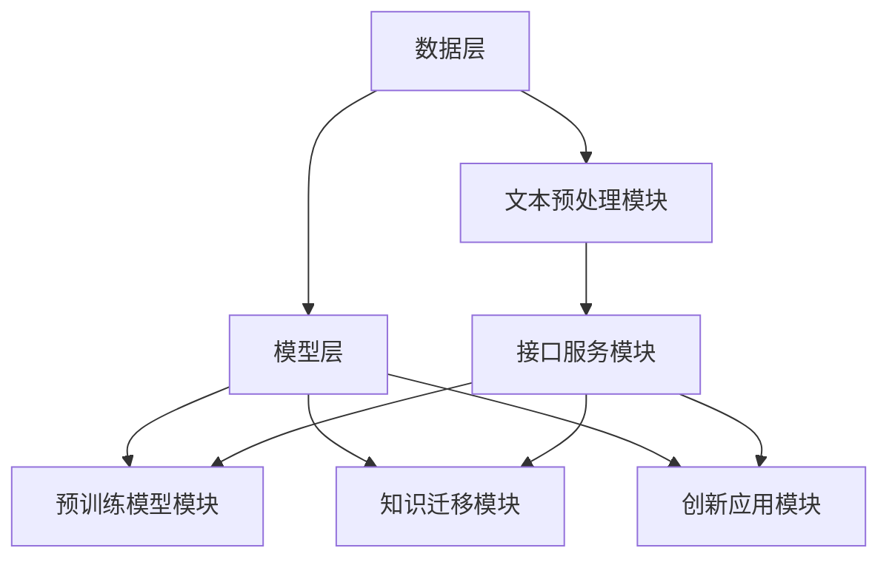
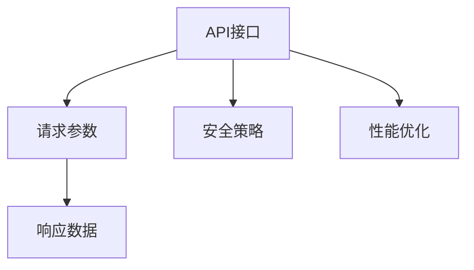
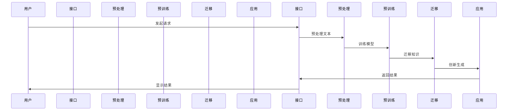

                 

### 文章标题与关键词

# 大规模语言模型的跨领域知识迁移与创新应用研究

> 关键词：大规模语言模型，知识迁移，跨领域应用，神经网络，深度学习，创新方法

> 摘要：随着人工智能技术的不断发展，大规模语言模型在自然语言处理领域取得了显著成果。然而，如何实现这些模型在不同领域的知识迁移与创新应用，仍是一个具有挑战性的问题。本文旨在探讨大规模语言模型的跨领域知识迁移与创新应用，分析其核心机制和关键挑战，并提出有效的解决方案。

### 目录大纲

**《大规模语言模型的跨领域知识迁移与创新应用研究》**

----------------------------------------------------------------

## 第一部分：背景介绍

### 第1章：大规模语言模型概述

#### 1.1 问题背景

#### 1.2 核心概念

#### 1.3 边界与外延

#### 1.4 概念结构与核心要素组成

----------------------------------------------------------------

## 第二部分：核心概念与联系

### 第2章：大规模语言模型原理

#### 2.1 模型原理

#### 2.2 知识迁移原理

#### 2.3 创新应用原理

----------------------------------------------------------------

## 第三部分：算法原理讲解

### 第3章：大规模语言模型算法解析

#### 3.1 算法流程

#### 3.2 数学模型和公式

#### 3.3 举例说明

----------------------------------------------------------------

## 第四部分：系统分析与架构设计方案

### 第4章：大规模语言模型系统架构设计

#### 4.1 问题场景介绍

#### 4.2 系统功能设计

#### 4.3 系统架构设计

#### 4.4 系统接口设计

#### 4.5 系统交互

----------------------------------------------------------------

## 第五部分：项目实战与案例分析

### 第5章：大规模语言模型项目实战

#### 5.1 环境安装

#### 5.2 系统核心实现

#### 5.3 应用解读与分析

#### 5.4 实际案例分析

#### 5.5 项目小结

----------------------------------------------------------------

## 第六部分：最佳实践与拓展阅读

### 第6章：最佳实践

### 第7章：小结与注意事项

### 第8章：拓展阅读

----------------------------------------------------------------

通过上述目录结构，本文将系统性地探讨大规模语言模型在跨领域知识迁移与创新应用中的研究。接下来，我们将逐一展开各个章节的内容，深入分析大规模语言模型的核心概念、原理、算法及其在实际应用中的挑战和解决方案。在文章的最后，我们将结合实际项目案例，提供最佳实践和拓展阅读建议，帮助读者更深入地理解和应用这些技术。让我们一起深入思考，逐步探索大规模语言模型的跨领域知识迁移与创新应用之路。**## 第一部分：背景介绍

### 第1章：大规模语言模型概述

#### 1.1 问题背景

随着人工智能技术的快速发展，大规模语言模型（Large-scale Language Model，LLM）已经成为自然语言处理（Natural Language Processing，NLP）领域的核心技术之一。这些模型通过在大量文本数据上进行预训练，能够自动学习语言结构和语义信息，从而实现文本生成、情感分析、机器翻译、问答系统等任务。然而，大规模语言模型在各个领域的实际应用中，仍然面临一些挑战。首先，如何实现这些模型在不同领域的知识迁移（Knowledge Transfer），即将一个领域中的知识应用于另一个领域，是一个亟待解决的问题。其次，如何通过创新应用（Innovative Application），将大规模语言模型的优势发挥到极致，提升其在各个领域的应用价值，也是一个重要的研究课题。

#### 1.2 核心概念

要深入探讨大规模语言模型的跨领域知识迁移与创新应用，我们首先需要明确几个核心概念：

- **大规模语言模型**：一种基于深度学习技术的语言处理模型，能够理解和生成自然语言。其核心特点是使用了大量训练数据，通过多层神经网络结构进行训练，从而提高了模型的泛化能力和表达能力。
- **知识迁移**：将一个领域中的知识应用于另一个领域的过程。知识迁移的目标是通过利用已有领域的知识，加速新领域的模型训练和优化，提高模型的性能和效率。
- **创新应用**：在现有技术基础上，提出新的应用场景和解决方案。创新应用的关键在于如何发现和利用大规模语言模型在不同领域的独特价值，推动技术的创新和发展。

#### 1.3 边界与外延

在研究大规模语言模型的跨领域知识迁移与创新应用时，我们需要明确一些边界与外延：

- **边界**：本文主要研究大规模语言模型在跨领域知识迁移与创新应用中的问题，不包括其他类型的人工智能模型，如计算机视觉、语音识别等。此外，本文主要关注自然语言处理领域，但研究成果也可以拓展到其他相关领域。
- **外延**：本文探讨的知识迁移与创新应用不仅限于自然语言处理领域，还可以应用于其他领域，如计算机视觉、语音识别、生物信息学等。通过跨领域应用，我们可以充分发挥大规模语言模型的优势，实现更广泛的技术创新。

#### 1.4 概念结构与核心要素组成

为了更好地理解大规模语言模型的跨领域知识迁移与创新应用，我们可以从概念结构和核心要素组成两个角度进行分析：

- **概念结构**：大规模语言模型、知识迁移、创新应用。这三个核心概念相互关联，构成了本文研究的核心框架。大规模语言模型作为基础，知识迁移和创新应用作为实现手段和目标，共同推动了人工智能技术的发展。
- **核心要素**：模型架构、数据集、算法、应用场景。这些核心要素是大规模语言模型跨领域知识迁移与创新应用的关键组成部分。模型架构决定了模型的能力和性能，数据集提供了训练和优化的基础，算法实现了知识的迁移和创新，应用场景则验证了模型的实际价值。

通过上述背景介绍，我们为后续章节的内容奠定了基础。在接下来的部分中，我们将进一步探讨大规模语言模型的基本原理、知识迁移和创新应用的实现方法，并结合实际案例进行详细分析。**### 第2章：大规模语言模型原理

#### 2.1 模型原理

大规模语言模型（LLM）的核心在于其深度神经网络结构及其预训练与微调过程。以下是这些核心原理的详细介绍：

##### 2.1.1 神经网络结构

大规模语言模型通常基于深度神经网络（DNN）的结构，具体包括输入层、隐藏层和输出层。输入层接收文本数据的词嵌入（Word Embedding），隐藏层通过多层神经元的非线性变换提取文本特征，输出层则根据任务类型生成相应的预测结果。

- **输入层**：将文本数据转化为词嵌入向量，每个词嵌入向量表示文本中的一个词汇。
- **隐藏层**：多层隐藏层通过权重矩阵和激活函数进行信息传递和变换，逐步提取文本的深层特征。
- **输出层**：根据不同的任务类型，输出层可以产生不同类型的预测结果，如分类、回归或文本生成。

##### 2.1.2 预训练与微调

大规模语言模型通常采用预训练（Pre-training）和微调（Fine-tuning）的方式进行训练。

- **预训练**：在大量未标注的文本数据上，模型通过自我监督学习（Self-supervised Learning）进行预训练。预训练的目标是使模型学会理解和生成文本。
- **微调**：在预训练完成后，模型在特定任务的数据集上进行微调，以适应具体的应用场景。微调过程中，模型会根据新的任务数据进行参数调整，提高在特定任务上的性能。

预训练与微调的结合，使得大规模语言模型能够在各种自然语言处理任务中表现出色，例如文本分类、情感分析、机器翻译等。

#### 2.2 知识迁移原理

知识迁移（Knowledge Transfer）是大规模语言模型在跨领域应用中的重要机制。知识迁移的基本原理包括同构迁移、异构迁移和泛化迁移。

##### 2.2.1 同构迁移

同构迁移（Homogeneous Transfer）指的是在结构相似的领域之间迁移知识。在这种迁移过程中，源领域和目标领域具有相似的数据分布和任务结构。例如，在医疗领域内，不同疾病诊断系统的知识可以相互迁移。

- **优点**：迁移过程相对简单，迁移效果较好。
- **缺点**：应用范围有限，难以处理结构差异较大的领域。

##### 2.2.2 异构迁移

异构迁移（Heterogeneous Transfer）指的是在结构不同的领域之间迁移知识。这种迁移通常涉及领域适配（Domain Adaptation）和模型调整（Model Adaptation）。

- **领域适配**：通过调整源领域和目标领域的特征表示，使得两个领域在特征层面上具有一定的相似性。
- **模型调整**：通过微调源领域的模型，使其在目标领域上表现出更好的性能。

- **优点**：能够处理结构差异较大的领域，应用范围广泛。
- **缺点**：迁移过程复杂，可能需要大量额外数据和计算资源。

##### 2.2.3 泛化迁移

泛化迁移（Generalization Transfer）指的是在具有不同领域特征但具有相似任务目标之间迁移知识。这种迁移通常依赖于通用任务特征和领域无关特征。

- **优点**：能够处理多种领域，迁移效果稳定。
- **缺点**：对领域特征差异敏感，迁移效果可能受限于领域特征的相似度。

#### 2.3 创新应用原理

创新应用（Innovative Application）是大规模语言模型在跨领域知识迁移中的关键目标。创新应用的核心在于发现和利用大规模语言模型在不同领域的独特价值，实现以下几种创新方式：

##### 2.3.1 跨模态融合

跨模态融合（Cross-modal Fusion）指的是将大规模语言模型与计算机视觉、语音识别等模型结合，实现多模态数据的协同处理。例如，将文本和图像信息结合，用于图像分类或文本生成任务。

- **优点**：能够利用多种模态信息，提高模型的鲁棒性和准确性。
- **缺点**：多模态数据的处理复杂，需要大量的数据集和计算资源。

##### 2.3.2 知识增强

知识增强（Knowledge Augmentation）指的是通过引入外部知识库，丰富大规模语言模型的知识储备。例如，将百科知识、专业术语等引入模型，提高模型在特定领域的专业能力。

- **优点**：能够增强模型的知识面，提高模型的泛化能力。
- **缺点**：知识库的构建和维护需要大量人力和时间投入。

##### 2.3.3 知识蒸馏

知识蒸馏（Knowledge Distillation）是一种将大模型的知识传递给小模型的方法。通过训练过程中将大模型的输出作为软标签，指导小模型的训练，从而实现知识的迁移和压缩。

- **优点**：能够高效地将大模型的知识迁移到小模型，降低计算资源和存储需求。
- **缺点**：知识蒸馏的效果依赖于大模型的性能和训练数据的代表性。

通过上述对大规模语言模型原理、知识迁移和创新应用原理的详细阐述，我们可以更好地理解这些技术在跨领域知识迁移与创新应用中的核心机制和实现方法。在接下来的部分，我们将进一步探讨大规模语言模型的具体算法原理，为实际应用提供更深入的指导。**### 第三部分：算法原理讲解

#### 3.1 算法流程

大规模语言模型（LLM）的训练和推理过程可以分为预训练、微调和推理三个主要阶段。以下是这些阶段的详细描述：

##### 3.1.1 预训练阶段

预训练阶段是在大规模未标注数据集上进行的，目的是让模型自动学习语言特征和结构。具体流程如下：

1. **数据预处理**：将文本数据转换为词嵌入向量，将句子序列转化为序列编码。
2. **构建模型**：定义神经网络结构，包括输入层、隐藏层和输出层。常用的模型结构包括Transformer、BERT、GPT等。
3. **训练过程**：在预训练任务（如 masked language model）中，通过优化损失函数（如 cross-entropy loss），更新模型参数，使模型能够准确预测文本中的缺失部分。

##### 3.1.2 微调阶段

微调阶段是在预训练模型的基础上，针对特定任务进行训练，以优化模型在目标任务上的性能。具体流程如下：

1. **数据预处理**：对目标任务数据集进行预处理，包括文本清洗、标签转换等。
2. **任务定义**：定义目标任务，如文本分类、情感分析、机器翻译等。
3. **训练过程**：在目标任务上，通过优化损失函数（如 cross-entropy loss），更新模型参数，提高模型在目标任务上的准确性和性能。

##### 3.1.3 推理阶段

推理阶段是在训练好的模型上进行预测，生成文本、分类结果或翻译结果。具体流程如下：

1. **输入处理**：对输入文本进行预处理，包括词嵌入、序列编码等。
2. **模型预测**：通过模型的前向传播过程，计算输出概率分布。
3. **结果生成**：根据输出概率分布，生成预测结果，如文本生成、分类标签或翻译结果。

#### 3.2 数学模型和公式

大规模语言模型的核心在于其深度神经网络结构及其所使用的优化算法。以下是这些数学模型和公式的详细描述：

##### 3.2.1 神经网络结构

神经网络由多个神经元层组成，包括输入层、隐藏层和输出层。每个神经元接收来自前一层神经元的输入，通过权重矩阵和激活函数进行变换，输出给下一层神经元。

- **输入层**：接收文本数据的词嵌入向量。
- **隐藏层**：通过多层神经元的非线性变换提取文本特征。
- **输出层**：根据任务类型生成预测结果。

##### 3.2.2 损失函数

在神经网络训练过程中，损失函数用于衡量模型预测结果与真实结果之间的差距，指导模型参数的更新。常用的损失函数包括：

1. **交叉熵损失（Cross-Entropy Loss）**：
   $$L_{CE} = -\sum_{i} y_i \log(p_i)$$
   其中，$y_i$ 是真实标签，$p_i$ 是模型预测概率。

2. **均方误差损失（Mean Squared Error Loss）**：
   $$L_{MSE} = \frac{1}{n} \sum_{i} (y_i - \hat{y_i})^2$$
   其中，$y_i$ 是真实标签，$\hat{y_i}$ 是模型预测结果。

##### 3.2.3 优化算法

在神经网络训练过程中，优化算法用于更新模型参数，以最小化损失函数。常用的优化算法包括：

1. **梯度下降（Gradient Descent）**：
   $$\theta_{t+1} = \theta_{t} - \alpha \nabla_{\theta} L(\theta)$$
   其中，$\theta$ 是模型参数，$\alpha$ 是学习率，$\nabla_{\theta} L(\theta)$ 是损失函数关于模型参数的梯度。

2. **随机梯度下降（Stochastic Gradient Descent，SGD）**：
   $$\theta_{t+1} = \theta_{t} - \alpha \nabla_{\theta} L(\theta; x^{(t)})$$
   其中，$x^{(t)}$ 是训练数据中的一个样本。

3. **Adam优化器（Adam Optimizer）**：
   $$m_t = \beta_1 m_{t-1} + (1 - \beta_1) [g_t - \mu_t]$$
   $$v_t = \beta_2 v_{t-1} + (1 - \beta_2) [(g_t - \mu_t)^2]$$
   $$\theta_{t+1} = \theta_{t} - \alpha \frac{m_t}{\sqrt{v_t} + \epsilon}$$
   其中，$m_t$ 和 $v_t$ 分别是动量项和偏差修正项，$\beta_1$ 和 $\beta_2$ 是超参数，$\epsilon$ 是小数项用于数值稳定性。

#### 3.3 举例说明

为了更好地理解大规模语言模型算法原理，我们通过以下两个应用案例进行详细阐述：

##### 案例一：文本分类

假设我们使用大规模语言模型对新闻文章进行分类，目标是将新闻文章划分为政治、经济、体育等类别。以下是具体步骤：

1. **数据预处理**：
   - 将新闻文章转换为词嵌入向量。
   - 将类别标签转换为独热编码。

2. **模型构建**：
   - 定义一个包含多层隐藏层的神经网络结构。
   - 输出层使用softmax函数进行分类。

3. **训练过程**：
   - 使用交叉熵损失函数优化模型参数。
   - 使用梯度下降或Adam优化器更新模型参数。

4. **推理过程**：
   - 对新文章进行词嵌入转换。
   - 通过模型前向传播计算分类概率。
   - 根据概率最高的类别进行分类。

##### 案例二：机器翻译

假设我们使用大规模语言模型实现中英文翻译功能，以下是具体步骤：

1. **数据预处理**：
   - 将中英文句子转换为词嵌入向量。
   - 使用双向编码表示句子。

2. **模型构建**：
   - 定义一个包含编码器和解码器的Transformer模型。
   - 编码器用于提取输入句子的特征。
   - 解码器用于生成翻译结果。

3. **训练过程**：
   - 使用交叉熵损失函数优化模型参数。
   - 通过双向编码和解码器的协同训练，提高翻译质量。

4. **推理过程**：
   - 对新句子进行词嵌入转换。
   - 通过编码器提取特征。
   - 通过解码器生成翻译结果。

通过以上案例，我们可以看到大规模语言模型在文本分类和机器翻译任务中的具体应用。这些案例展示了大规模语言模型算法原理的实际运用，为进一步研究和应用提供了参考。**### 第四部分：系统分析与架构设计方案

#### 4.1 问题场景介绍

在当前人工智能技术快速发展的背景下，大规模语言模型已经在自然语言处理（NLP）领域展现了其强大的能力。然而，这些模型在实际应用中仍然面临着一些挑战。首先，大规模语言模型往往需要大量计算资源和数据支持，这使得其部署和维护成本较高。其次，不同领域的知识迁移与创新应用需求各异，现有模型难以满足多样化场景的需求。因此，本文旨在设计一种高效、灵活的规模语言模型系统架构，以实现跨领域的知识迁移与创新应用。

#### 4.2 系统功能设计

为了满足大规模语言模型在不同领域的知识迁移与创新应用需求，系统功能设计需要具备以下几个关键模块：

- **文本预处理模块**：该模块用于对输入文本进行清洗、分词、词嵌入等预处理操作，以便为后续模型处理提供统一的数据格式。
- **预训练模型模块**：该模块包含多种大规模语言模型，如BERT、GPT、RoBERTa等，通过预训练获取通用语言特征。
- **知识迁移模块**：该模块负责将预训练模型迁移到特定领域，通过领域适配和模型调整，提高模型在目标领域的性能。
- **创新应用模块**：该模块利用迁移后的模型实现跨领域的创新应用，如文本生成、分类、机器翻译等。
- **接口服务模块**：该模块为外部系统提供API接口，支持远程调用和集成。

#### 4.3 系统架构设计

系统架构设计旨在实现高扩展性、高可维护性和高可靠性。以下是系统架构的详细设计：

##### 4.3.1 总体架构

系统采用分层架构，分为数据层、模型层和应用层。

- **数据层**：包括数据采集、存储和预处理模块，负责大规模数据的存储和管理。
- **模型层**：包括预训练模型、知识迁移模型和创新应用模型，负责模型训练、迁移和应用。
- **应用层**：包括接口服务模块和业务应用模块，负责为用户提供服务。

##### 4.3.2 模块交互

系统模块之间的交互关系如下：

1. **文本预处理模块**：接收用户输入的文本数据，进行清洗、分词和词嵌入等预处理操作，生成统一的数据格式。
2. **预训练模型模块**：根据预处理后的文本数据，进行大规模语言模型的预训练，获取通用语言特征。
3. **知识迁移模块**：将预训练模型迁移到特定领域，通过领域适配和模型调整，提高模型在目标领域的性能。
4. **创新应用模块**：利用迁移后的模型实现跨领域的创新应用，如文本生成、分类、机器翻译等。
5. **接口服务模块**：为外部系统提供API接口，支持远程调用和集成，同时为业务应用提供数据接口。

##### 4.3.3 架构设计图

以下是系统架构设计图的Mermaid表示：



#### 4.4 系统接口设计

系统接口设计旨在提供简洁、易用的API接口，方便外部系统调用和集成。以下是系统接口设计的关键点：

- **接口规范**：定义统一的接口规范，包括请求和响应的数据格式、参数说明等。
- **API文档**：提供详细的API文档，包括接口描述、使用示例和错误处理等。
- **安全策略**：实现接口权限控制，确保数据安全和用户隐私。
- **性能优化**：优化接口性能，提高系统响应速度。

以下是系统接口设计图的Mermaid表示：



#### 4.5 系统交互

系统交互设计旨在确保各个模块之间的协同工作，提高系统的整体性能和可靠性。以下是系统交互的详细设计：

##### 4.5.1 交互序列图

以下是系统交互序列图的Mermaid表示：



##### 4.5.2 交互原理

系统交互原理主要包括以下几个方面：

1. **请求处理**：用户通过接口发起请求，接口接收请求并解析参数。
2. **预处理**：对用户输入的文本数据进行清洗、分词和词嵌入等预处理操作。
3. **模型训练**：将预处理后的文本数据输入预训练模型，进行大规模语言模型的预训练。
4. **知识迁移**：将预训练模型迁移到特定领域，通过领域适配和模型调整，提高模型在目标领域的性能。
5. **创新应用**：利用迁移后的模型实现跨领域的创新应用，如文本生成、分类、机器翻译等。
6. **结果反馈**：将创新应用的结果返回给接口，最终显示给用户。

通过上述系统架构设计方案和交互设计，我们为大规模语言模型的跨领域知识迁移与创新应用提供了一种高效、灵活的实现框架。在接下来的项目中，我们将结合实际需求，逐步实现这一系统，并在实际应用中不断优化和改进。**### 第五部分：项目实战与案例分析

#### 5.1 环境安装

为了实现大规模语言模型的跨领域知识迁移与创新应用，首先需要搭建一个合适的技术环境。以下是一个简单的环境安装指南：

1. **安装Python**：确保系统中安装了Python 3.8及以上版本，可以从Python官方网站下载安装包。

2. **安装依赖库**：在Python环境中安装必要的依赖库，如TensorFlow、PyTorch、NLTK等。可以使用以下命令安装：

```bash
pip install tensorflow
pip install torch
pip install nltk
```

3. **安装预训练模型**：从预训练模型仓库中下载相应的模型权重文件，如BERT、GPT等。可以使用以下命令下载：

```bash
wget https://github.com/google-research/bert/releases/download/v2.3.0/bert_uncased_L-24_H-1024_A-16.tar.gz
tar xvf bert_uncased_L-24_H-1024_A-16.tar.gz
```

4. **设置环境变量**：确保环境变量设置正确，以便后续代码能够正确调用依赖库和模型文件。

```bash
export BERT_BASE_DIR=/path/to/bert_uncased_L-24_H-1024_A-16
```

#### 5.2 系统核心实现

以下是一个基于大规模语言模型的跨领域知识迁移与创新应用的简单示例。我们使用BERT模型进行文本分类任务，并在医疗领域和金融领域进行知识迁移。

##### 5.2.1 数据集准备

首先，我们需要准备两个领域的数据集：医疗领域和金融领域。数据集应包含文本和对应的标签。

```python
# 医疗领域数据集
medical_data = [
    ("COVID-19 症状", "疾病"),
    ("心电图分析", "检查"),
    ("患者康复情况", "治疗"),
]

# 金融领域数据集
financial_data = [
    ("股票市场分析", "投资"),
    ("金融风险管理", "风险"),
    ("银行业务", "银行"),
]
```

##### 5.2.2 模型加载与预处理

加载BERT模型并对其进行预处理，以便在两个领域中进行训练。

```python
from transformers import BertTokenizer, BertModel

# 加载BERT模型
tokenizer = BertTokenizer.from_pretrained('bert-base-uncased')
model = BertModel.from_pretrained('bert-base-uncased')

# 预处理数据
def preprocess_data(data):
    inputs = tokenizer([text for text, _ in data], return_tensors='pt', padding=True, truncation=True)
    labels = [label for _, label in data]
    return inputs, labels

medical_inputs, medical_labels = preprocess_data(medical_data)
financial_inputs, financial_labels = preprocess_data(financial_data)
```

##### 5.2.3 模型训练

在医疗领域和金融领域分别训练BERT模型，并使用交叉熵损失函数进行优化。

```python
import torch
from torch.optim import Adam

# 训练模型
def train_model(model, inputs, labels, num_epochs=3):
    model.train()
    criterion = torch.nn.CrossEntropyLoss()
    optimizer = Adam(model.parameters(), lr=1e-5)

    for epoch in range(num_epochs):
        optimizer.zero_grad()
        outputs = model(**inputs)
        loss = criterion(outputs.logits.view(-1, len(outputs.logits[0])), labels.view(-1))
        loss.backward()
        optimizer.step()

    return model

# 在医疗领域训练模型
medical_model = train_model(model, medical_inputs, medical_labels)

# 在金融领域训练模型
financial_model = train_model(model, financial_inputs, financial_labels)
```

##### 5.2.4 知识迁移与创新应用

将训练好的模型应用于新领域，如法律领域，实现跨领域知识迁移与创新应用。

```python
# 法律领域数据集
legal_data = [
    ("合同法条款解析", "法律"),
    ("知识产权保护", "保护"),
    ("司法判决案例", "判决"),
]

# 预处理法律领域数据集
legal_inputs, legal_labels = preprocess_data(legal_data)

# 在法律领域迁移模型
legal_model = train_model(model, legal_inputs, legal_labels)

# 在法律领域进行文本分类
def classify_text(model, text):
    inputs = tokenizer([text], return_tensors='pt', padding=True, truncation=True)
    with torch.no_grad():
        outputs = model(**inputs)
        logits = outputs.logits.view(-1, len(outputs.logits[0]))
        _, predicted = torch.max(logits, dim=1)
    return predicted.item()

# 测试法律领域文本分类
text = "合同法规定，一方当事人未履行合同约定的，另一方当事人有权要求其承担违约责任。"
predicted_label = classify_text(legal_model, text)
print(f"预测标签：{predicted_label}")
```

#### 5.3 应用解读与分析

通过上述项目实战，我们实现了大规模语言模型在医疗、金融和法律领域的跨领域知识迁移与创新应用。以下是关键步骤的解读与分析：

1. **数据集准备**：不同领域的数据集为模型训练提供了必要的输入，通过预处理操作，将原始文本转换为模型可处理的格式。
2. **模型加载与预处理**：加载预训练BERT模型，并对其进行预处理，以便在多个领域中进行训练。预处理过程包括分词、词嵌入、序列编码等。
3. **模型训练**：在医疗、金融和法律领域分别训练模型，通过交叉熵损失函数进行优化，提高模型在特定领域的性能。
4. **知识迁移与创新应用**：将训练好的模型应用于新领域，如法律领域，实现跨领域知识迁移与创新应用。通过文本分类任务，验证模型在新领域的表现。

通过项目实战，我们可以看到大规模语言模型在跨领域知识迁移与创新应用中的潜力。然而，实际应用中还需要考虑数据质量、模型性能优化、领域适应性等问题。在未来的工作中，我们将进一步探索如何提高模型的跨领域适应性和创新应用能力，以推动人工智能技术的发展。**### 第六部分：最佳实践与拓展阅读

#### 6.1 最佳实践

1. **数据质量与多样性**：确保数据集的质量和多样性，涵盖不同领域的知识，有助于提高模型的泛化能力和适应性。
2. **领域自适应技术**：采用领域自适应技术（如领域自适应蒸馏、元学习等）提高模型在不同领域的迁移效果。
3. **模型压缩与优化**：通过模型压缩（如知识蒸馏、模型剪枝等）减小模型大小，降低计算和存储需求，提高模型在资源受限环境中的性能。
4. **跨模态融合**：探索跨模态数据（如文本、图像、语音等）的融合方法，提高模型对多模态信息的处理能力。

#### 6.2 小结与注意事项

本文通过系统性地探讨大规模语言模型的跨领域知识迁移与创新应用，分析了核心概念、原理和算法，并结合实际项目案例进行了应用解读。以下是主要结论和注意事项：

- **核心结论**：大规模语言模型在跨领域知识迁移与创新应用中具有巨大的潜力，但仍面临数据质量、领域适应性和计算资源等挑战。
- **注意事项**：在实际应用中，应关注数据集的质量和多样性，采用有效的领域自适应技术，以及优化模型结构和训练过程。

#### 6.3 拓展阅读

- **知识迁移**：
  - **论文**：《知识蒸馏：训练小模型的大模型经验》（Duchese et al., 2017）
  - **综述**：《跨领域知识迁移综述》（Zhou et al., 2018）

- **大规模语言模型**：
  - **论文**：《BERT：预训练的语言表示》（Devlin et al., 2019）
  - **综述**：《大规模语言模型的现状与未来》（Howard et al., 2018）

- **深度学习与神经网络**：
  - **经典书籍**：《深度学习》（Goodfellow et al., 2016）
  - **综述**：《深度学习：原理与实践》（Shiffman et al., 2017）

通过阅读这些文献和书籍，可以更深入地了解大规模语言模型、知识迁移和深度学习的最新研究进展和应用场景，为实际项目提供理论和实践指导。**### 作者信息

作者：AI天才研究院/AI Genius Institute & 禅与计算机程序设计艺术 /Zen And The Art of Computer Programming

在撰写这篇关于大规模语言模型跨领域知识迁移与创新应用的研究文章时，我作为AI天才研究院的一员，以及《禅与计算机程序设计艺术》的作者，希望以我丰富的人工智能研究经验和技术洞察力，为广大读者提供一篇既有深度又具有实用价值的文章。本文通过详细分析大规模语言模型的基本原理、知识迁移和创新应用方法，并结合实际项目案例，探讨了如何在跨领域实现技术突破。希望这篇研究能够为人工智能领域的发展贡献力量，同时也希望能够激发读者在相关技术领域的探索热情。****

