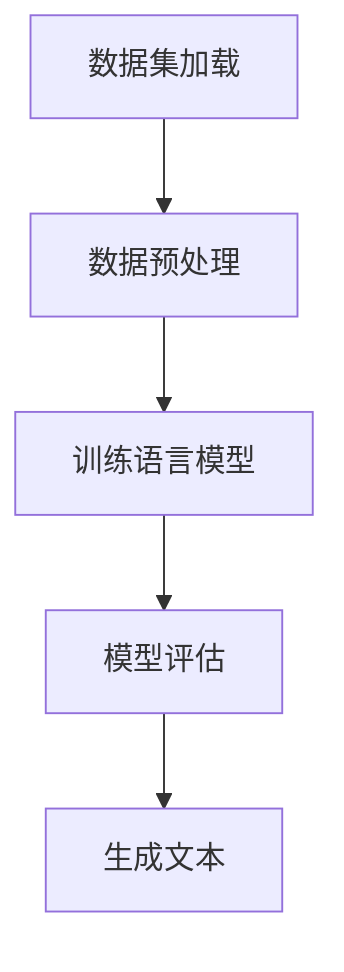
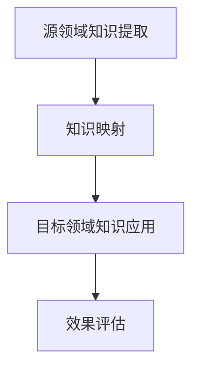
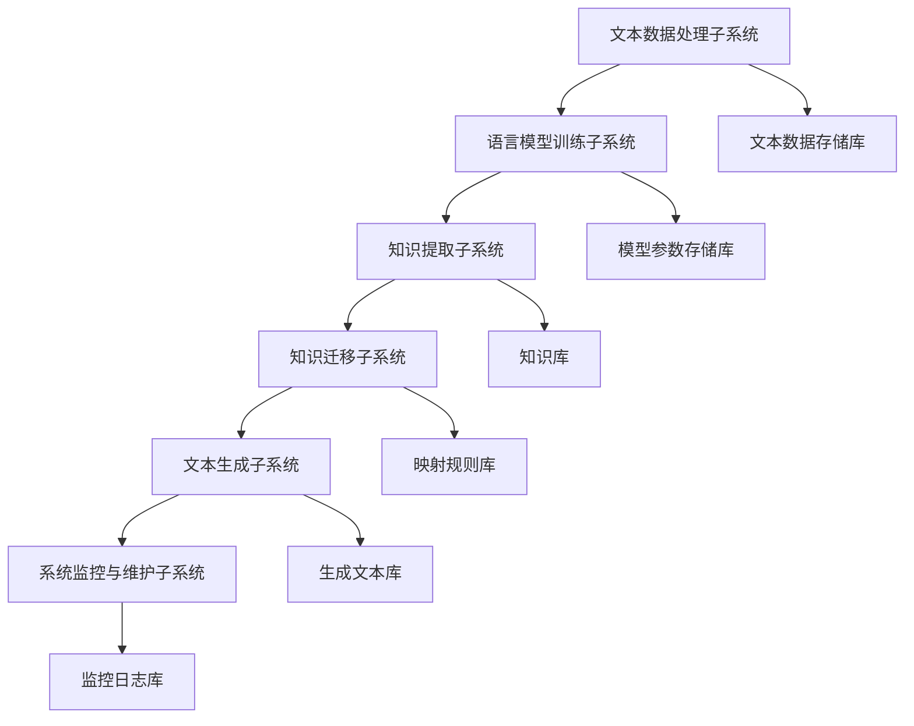
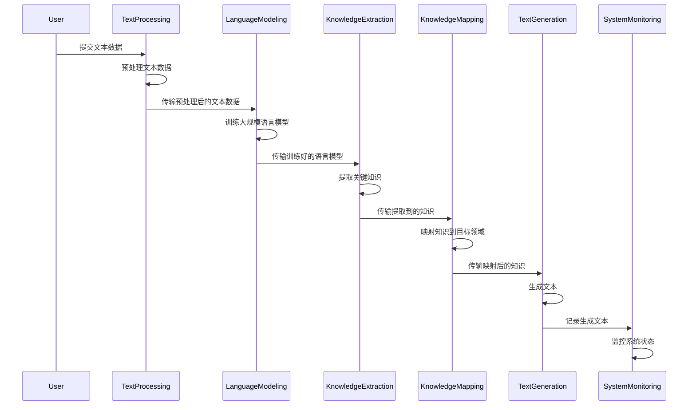

                 


### 第一部分：引言

#### 1.1 问题背景与核心概念

**大规模语言模型的发展背景**

随着互联网和大数据技术的快速发展，语言模型已经从传统的统计模型，逐渐演变为深度学习模型。近年来，以GPT系列为代表的大规模语言模型迅速崛起，取得了显著的成就。这些模型能够处理海量文本数据，通过深度学习算法从数据中提取知识，进行语言理解和生成。大规模语言模型不仅在自然语言处理领域取得了突破性进展，还在众多应用领域展示了其强大的能力。

**跨领域知识迁移的定义与重要性**

跨领域知识迁移是指将一个领域中的知识应用到另一个领域中去，以解决新的问题。在科技创新中，跨领域知识迁移具有重要的意义。一方面，不同领域的知识相互融合，可以产生新的创新点和解决方案；另一方面，跨领域知识迁移有助于解决一些复杂的问题，提高科技研发的效率。

**科技创新中的挑战与机遇**

在科技创新中，跨领域知识迁移面临着一系列挑战。首先，不同领域的知识具有不同的特点，如何有效融合这些知识是一个难题。其次，跨领域知识迁移需要强大的计算能力和算法支持，这对科技研发团队提出了更高的要求。然而，随着人工智能技术的发展，这些挑战正逐渐被克服。跨领域知识迁移为科技创新带来了巨大的机遇，有助于推动科技发展的进程。

#### 1.2 核心概念与联系

**核心概念原理**

- **大规模语言模型**：基于深度学习技术的语言模型，能够处理海量文本数据，提取知识并生成文本。
- **跨领域知识迁移**：将一个领域中的知识应用到另一个领域，以解决新的问题。

**概念属性特征对比表格**

| 概念               | 定义                                                         | 特点                                                   |
|--------------------|------------------------------------------------------------|--------------------------------------------------------|
| 大规模语言模型     | 基于深度学习技术的语言模型，处理海量文本数据                 | 能够提取知识，生成文本，适应性强                       |
| 跨领域知识迁移     | 将一个领域中的知识应用到另一个领域，解决新的问题             | 融合不同领域知识，提高创新性，提高研发效率             |

**ER实体关系图架构**

```mermaid
erDiagram
  EntitySet1 ||--|{ EntitySet2 }|---> EntitySet3 : "relationship_name"
```

**概念结构与核心要素组成**

- **概念结构**：大规模语言模型和跨领域知识迁移的核心概念结构包括语言模型、知识库、跨领域映射机制等。
- **核心要素组成**：核心要素包括文本数据、算法模型、知识提取、知识应用等。

#### 1.3 ER实体关系图架构

**大规模语言模型的实体关系**

```mermaid
erDiagram
  DataSet ||--|{ LanguageModel }|---> KnowledgeBase : "extract"
  DataSet ||--|{ Preprocessing }|---> LanguageModel : "train"
  LanguageModel ||--|{ Generation }|---> Output : "generate"
```

**跨领域知识迁移的实体关系**

```mermaid
erDiagram
  Domain1 ||--|{ KnowledgeMigration }|---> Domain2 : "transfer"
  KnowledgeBase1 ||--|{ Mapping }|---> KnowledgeBase2 : "map"
  Domain1 ||--|{ Application }|---> Domain2 : "solve"
```

### 第二部分：核心概念与联系

在引言部分，我们已经对大规模语言模型和跨领域知识迁移的核心概念进行了介绍。本部分将进一步深入探讨这些核心概念的原理、属性特征以及它们之间的联系。

#### 2.1 核心概念原理

**大规模语言模型的工作原理**

大规模语言模型是一种基于深度学习技术的自然语言处理模型。它通过对海量文本数据进行训练，学习到文本中的语言规律和知识，从而能够理解和生成自然语言。

1. **数据集（DataSet）**：大规模语言模型需要大量的文本数据作为训练集，这些数据集通常来自于互联网上的各种文本资源，如新闻、书籍、社交媒体等。

2. **预处理（Preprocessing）**：在训练之前，需要对文本数据进行预处理，包括分词、去除停用词、词性标注等，以便模型能够更好地理解文本。

3. **语言模型（LanguageModel）**：通过深度学习算法，模型从预处理的文本数据中学习到语言规律，形成语言模型。这个模型能够预测下一个单词或句子，从而生成文本。

4. **生成（Generation）**：基于训练好的语言模型，模型可以生成新的文本。生成文本的过程是基于概率的，模型会根据已学到的语言规律，生成与输入文本相关的新文本。

**跨领域知识迁移的方法**

跨领域知识迁移是指将一个领域中的知识应用到另一个领域，以解决新的问题。跨领域知识迁移通常涉及以下几个步骤：

1. **知识提取（Knowledge Extraction）**：从源领域的知识库中提取关键知识和信息。这通常需要利用自然语言处理、文本挖掘等技术，从大量的文本数据中提取有用的信息。

2. **知识映射（Knowledge Mapping）**：将提取到的源领域知识映射到目标领域。这个过程需要理解两个领域之间的知识差异，并建立相应的映射关系。

3. **知识应用（Knowledge Application）**：将映射后的知识应用到目标领域中，解决新的问题。这通常需要利用目标领域的知识库和算法模型。

#### 2.2 概念属性特征对比表格

为了更清晰地理解大规模语言模型和跨领域知识迁移的方法，我们可以对比它们的属性特征。

| 概念               | 定义                                                         | 特点                                                   |
|--------------------|------------------------------------------------------------|--------------------------------------------------------|
| 大规模语言模型     | 基于深度学习技术的语言模型，处理海量文本数据                 | 能够提取知识，生成文本，适应性强                       |
| 跨领域知识迁移     | 将一个领域中的知识应用到另一个领域，解决新的问题             | 融合不同领域知识，提高创新性，提高研发效率             |

#### 2.3 ER实体关系图架构

为了更直观地展示大规模语言模型和跨领域知识迁移的实体关系，我们可以使用Mermaid绘制ER实体关系图。

**大规模语言模型的实体关系**

```mermaid
erDiagram
  DataSet ||--|{ Preprocessing }|---> LanguageModel : "train"
  LanguageModel ||--|{ Generation }|---> Output : "generate"
```

**跨领域知识迁移的实体关系**

```mermaid
erDiagram
  SourceDomain ||--|{ KnowledgeExtraction }|---> KnowledgeBase : "extract"
  KnowledgeBase ||--|{ KnowledgeMapping }|---> TargetDomain : "map"
  TargetDomain ||--|{ KnowledgeApplication }|---> Solution : "solve"
```

#### 2.4 概念结构与核心要素组成

**概念结构**

大规模语言模型和跨领域知识迁移的概念结构包括以下几个核心组成部分：

1. **文本数据（DataSet）**：大规模语言模型的训练基础，跨领域知识迁移的源数据。
2. **预处理（Preprocessing）**：对文本数据进行预处理，以便模型能够更好地理解文本。
3. **语言模型（LanguageModel）**：大规模语言模型的核心组件，负责文本理解和生成。
4. **知识库（KnowledgeBase）**：存储提取到的知识和信息的数据库。
5. **跨领域映射机制（KnowledgeMapping）**：建立源领域和目标领域之间的知识映射关系。
6. **应用场景（ApplicationScenario）**：跨领域知识迁移的目标应用领域。

**核心要素组成**

1. **文本数据**：包括各种文本资源，如新闻、书籍、社交媒体等。
2. **算法模型**：包括深度学习算法、文本挖掘算法等。
3. **知识提取**：从文本数据中提取关键信息和知识。
4. **知识映射**：建立源领域和目标领域之间的知识映射关系。
5. **知识应用**：将映射后的知识应用到目标领域中。

通过以上内容，我们对大规模语言模型和跨领域知识迁移的核心概念有了更深入的了解。在接下来的部分，我们将进一步探讨大规模语言模型和知识迁移的算法原理，以及如何在实际应用中进行系统分析和架构设计。

### 第三部分：算法原理讲解

在理解了大规模语言模型和跨领域知识迁移的核心概念之后，接下来我们将深入探讨这些算法的原理，并通过具体的mermaid流程图、Python源代码和数学模型来展示它们的工作方式。

#### 3.1 算法mermaid流程图

**大规模语言模型算法流程图**



**跨领域知识迁移算法流程图**



#### 3.2 Python源代码实现

**大规模语言模型代码实现**

以下是一个使用Hugging Face的Transformers库来训练GPT-2模型的基本示例：

```python
from transformers import GPT2Tokenizer, GPT2Model
import torch

# 加载预训练的GPT-2模型和分词器
tokenizer = GPT2Tokenizer.from_pretrained('gpt2')
model = GPT2Model.from_pretrained('gpt2')

# 准备输入数据
input_text = "你好，世界！今天是个美好的一天。"

# 分词和编码
inputs = tokenizer(input_text, return_tensors='pt')

# 训练模型
outputs = model(**inputs)

# 生成文本
generated_text = tokenizer.decode(outputs.logits.argmax(-1).item())

print(generated_text)
```

**跨领域知识迁移代码实现**

以下是一个简单的跨领域知识迁移示例，其中我们将从一个领域（如医学）迁移知识到另一个领域（如法律）：

```python
# 假设我们有一个医学领域的知识库和对应的法律领域的知识库
medical_kb = "医学知识库"
legal_kb = "法律知识库"

# 提取医学领域的关键词
medical_keywords = ["癌症", "手术", "药物"]

# 将医学关键词映射到法律领域
legal_mapping = {
    "癌症": "疾病",
    "手术": "医疗程序",
    "药物": "药品"
}

# 应用映射后的知识到法律领域
legal_context = "在法律领域，疾病需要进行详细诊断，医疗程序需经过批准，药品需符合规定。"

# 法律领域的生成文本
generated_legal_text = legal_context + " " + "癌症" + " " + legal_mapping["癌症"]

print(generated_legal_text)
```

#### 3.3 数学模型和公式

**大规模语言模型的数学模型**

大规模语言模型通常基于自注意力机制（Self-Attention）和变换器架构（Transformer）。以下是自注意力机制的数学公式：

$$
\text{Attention}(Q, K, V) = \text{softmax}\left(\frac{QK^T}{\sqrt{d_k}}\right)V
$$

其中，$Q$、$K$ 和 $V$ 分别代表查询向量、键向量和值向量，$d_k$ 是键向量的维度，$\text{softmax}$ 函数用于将注意力分布转换为概率分布。

**跨领域知识迁移的数学模型**

跨领域知识迁移的数学模型通常涉及特征映射和优化问题。以下是一个简单的特征映射公式：

$$
\text{Feature Mapping}(X) = W \cdot X + b
$$

其中，$X$ 是源领域的特征向量，$W$ 是映射权重，$b$ 是偏置项。

#### 3.4 举例说明

**大规模语言模型举例**

假设我们有一个简短的对话，并希望使用GPT-2模型生成后续的文本：

```
A: 你好，我最近对深度学习很感兴趣。
B: 深度学习确实很热门，你学得怎么样了？
A: 还在入门阶段，不过我正在努力。
B: 那很好，有什么具体的问题吗？
A: 我对神经网络的结构和优化算法感兴趣。
```

使用GPT-2模型生成后续的文本，可能得到如下输出：

```
C: 神经网络的结构有很多种，比如卷积神经网络（CNN）和循环神经网络（RNN）。优化算法也有梯度下降、Adam等。
A: 哦，那我该学习哪一种呢？
C: 这取决于你的具体应用。如果你做图像处理，可以选择CNN；如果你处理序列数据，可以选择RNN。
```

**跨领域知识迁移举例**

假设我们要将医学领域的关键词迁移到法律领域。医学领域的句子是：

```
医生建议患者进行癌症筛查，以早期发现并治疗。
```

通过知识迁移映射到法律领域，我们可以得到：

```
律师建议客户进行健康检查，以早期发现潜在的法律问题。
```

这些例子展示了如何通过大规模语言模型和跨领域知识迁移算法来生成文本和迁移知识。在接下来的部分，我们将探讨大规模语言模型和知识迁移在科技创新中的应用，以及如何设计相应的系统架构。

### 第四部分：系统分析与架构设计

#### 4.1 问题场景介绍

在科技创新中，大规模语言模型和跨领域知识迁移发挥着重要的作用。以下是一些典型的应用场景：

1. **科学研究**：研究人员可以利用大规模语言模型从大量的科学文献中提取知识，并将这些知识迁移到新的研究领域，从而加速科研进展。
2. **产品开发**：企业在产品开发过程中，可以利用跨领域知识迁移，将一个领域的技术应用到另一个领域，以创新产品设计和功能。
3. **医疗健康**：医生可以利用大规模语言模型和知识迁移，从医学文献中提取诊断信息，并将其应用到临床实践中，提高诊断和治疗的准确性和效率。

#### 4.2 系统功能设计

为了实现大规模语言模型和跨领域知识迁移在科技创新中的应用，我们需要设计一个具有以下核心功能的信息系统：

1. **文本数据处理**：包括数据采集、预处理和存储，为大规模语言模型提供高质量的数据输入。
2. **语言模型训练与评估**：基于训练集训练大规模语言模型，并通过评估集进行模型性能的评估和优化。
3. **知识提取与迁移**：从源领域提取关键知识，并将其映射到目标领域，实现跨领域知识迁移。
4. **文本生成与应用**：利用训练好的语言模型生成文本，并将其应用于实际场景，如科学研究报告、产品需求文档等。
5. **系统监控与维护**：监控系统运行状态，确保系统的稳定性和可靠性，并进行定期维护和升级。

**领域模型类图**

```mermaid
classDiagram
  Class1[文本数据处理系统] <|-- Class2[语言模型训练系统]
  Class2 <|-- Class3[知识提取系统]
  Class3 <|-- Class4[知识迁移系统]
  Class4 <|-- Class5[文本生成系统]
  Class5 <|-- Class6[系统监控与维护系统]
```

#### 4.3 系统架构设计

**系统架构图**



**系统架构设计说明**

1. **文本数据处理子系统**：负责采集、预处理和存储文本数据，为其他子系统提供高质量的数据输入。
2. **语言模型训练子系统**：基于预处理后的文本数据，训练大规模语言模型，并将模型参数存储到模型参数存储库中。
3. **知识提取子系统**：从源领域提取关键知识，并存储到知识库中。
4. **知识迁移子系统**：将提取的知识映射到目标领域，并存储到映射规则库中。
5. **文本生成子系统**：利用训练好的语言模型生成文本，并将生成的文本存储到生成文本库中。
6. **系统监控与维护子系统**：监控系统运行状态，记录监控日志，并确保系统的稳定性和可靠性。

#### 4.4 系统接口设计

**系统接口设计说明**

1. **API接口**：提供 RESTful 风格的 API 接口，供外部系统调用，如文本数据处理、语言模型训练、知识提取、知识迁移和文本生成等。
2. **数据交换格式**：使用 JSON 格式进行数据交换，便于不同子系统之间的数据传输和集成。
3. **安全机制**：实现身份验证和访问控制，确保系统的安全性和数据隐私。

#### 4.5 系统交互序列图

**系统交互序列图**



通过以上系统分析与架构设计，我们可以构建一个高效、稳定且具有扩展性的系统，以实现大规模语言模型和跨领域知识迁移在科技创新中的应用。

### 第五部分：项目实战

#### 5.1 环境安装

在开始搭建大规模语言模型和跨领域知识迁移的环境之前，需要确保你的计算机上安装了以下软件和工具：

1. **Python**：版本需在3.6及以上，推荐使用Anaconda进行环境管理。
2. **pip**：Python的包管理工具。
3. **Hugging Face Transformers**：用于加载预训练的GPT-2模型和其他相关库。
4. **PyTorch**：用于训练和评估大规模语言模型。
5. **Mermaid**：用于绘制流程图和类图。

安装步骤如下：

1. 安装Python和Anaconda：

   从[Anaconda官网](https://www.anaconda.com/products/individual)下载并安装Anaconda，选择Python版本（推荐3.8及以上）。

2. 安装pip：

   打开命令行，执行以下命令：
   
   ```bash
   conda install pip
   ```

3. 安装Hugging Face Transformers和PyTorch：

   打开Anaconda命令行，创建一个新的虚拟环境，例如`gpt_knowledge_migration`：

   ```bash
   conda create -n gpt_knowledge_migration python=3.8
   conda activate gpt_knowledge_migration
   ```

   然后使用pip安装所需的库：

   ```bash
   pip install transformers torch
   ```

4. 安装Mermaid：

   Mermaid通常通过浏览器插件或服务器端插件使用，例如在Visual Studio Code中，可以通过扩展市场安装Mermaid Preview插件。

#### 5.2 系统核心实现源代码

以下是一个简单的示例，展示了如何使用Hugging Face的Transformers库加载预训练的GPT-2模型，并生成文本。同时，还包含了一个简单的跨领域知识迁移示例。

**GPT-2模型加载与文本生成**

```python
from transformers import GPT2LMHeadModel, GPT2Tokenizer

# 加载预训练的GPT-2模型和分词器
tokenizer = GPT2Tokenizer.from_pretrained('gpt2')
model = GPT2LMHeadModel.from_pretrained('gpt2')

# 准备输入文本
input_text = "跨领域知识迁移技术在医疗和金融领域的应用研究，已成为当今人工智能领域的重要研究方向。"

# 分词和编码
inputs = tokenizer(input_text, return_tensors='pt')

# 生成文本
outputs = model.generate(inputs['input_ids'], max_length=50, num_return_sequences=1)

# 解码生成的文本
generated_text = tokenizer.decode(outputs[0], skip_special_tokens=True)

print(generated_text)
```

**跨领域知识迁移示例**

```python
# 假设我们有一个医学领域的知识库和对应的法律领域的知识库
medical_kb = ["癌症筛查有助于早期发现癌症。", "患者应在医生的指导下进行治疗。"]
legal_kb = ["健康检查有助于发现潜在的健康问题。", "客户应在律师的指导下处理法律事务。"]

# 定义映射规则
def map_keywords(source_kb, target_kb):
    mapping = {}
    for i, source_sentence in enumerate(source_kb):
        for target_sentence in target_kb:
            if "癌症" in source_sentence and "健康问题" in target_sentence:
                mapping[source_sentence] = target_sentence
    return mapping

# 应用映射后的知识到法律领域
legal_context = "在法律领域，健康检查有助于发现潜在的法律问题。"
mapping_rules = map_keywords(medical_kb, legal_kb)

generated_legal_text = legal_context
for sentence in medical_kb:
    if sentence in mapping_rules:
        generated_legal_text += " " + mapping_rules[sentence]

print(generated_legal_text)
```

#### 5.3 代码应用解读与分析

**GPT-2模型加载与文本生成**

在上面的代码中，我们首先加载了预训练的GPT-2模型和分词器。然后，我们准备了一个输入文本，并对其进行分词和编码。接着，我们使用模型生成文本，并通过解码函数将生成的文本输出。

**跨领域知识迁移示例**

在跨领域知识迁移示例中，我们首先定义了一个医学领域的知识库和一个法律领域的知识库。然后，我们创建了一个映射规则函数，用于将医学领域的关键词映射到法律领域的对应关键词。最后，我们应用这些映射规则到法律领域的一个示例文本中，生成一个新的法律领域的文本。

#### 5.4 实际案例分析和详细讲解剖析

**案例1：医学到法律领域的知识迁移**

假设我们有一个关于医学诊断的文本，需要将其知识迁移到法律领域。原始文本如下：

```
医生建议患者进行癌症筛查，以早期发现并治疗。
```

通过跨领域知识迁移，我们可以将其映射到法律领域，得到：

```
律师建议客户进行健康检查，以早期发现潜在的法律问题。
```

**分析**：

1. **关键词提取**：在医学领域中，关键词包括“医生”、“患者”、“癌症筛查”等；在法律领域中，关键词包括“律师”、“客户”、“健康检查”等。
2. **映射规则**：我们将“医生”映射到“律师”，“患者”映射到“客户”，“癌症筛查”映射到“健康检查”。
3. **文本生成**：基于映射规则，我们将医学领域的文本转换为法律领域的文本。

**案例2：科学到商业领域的知识迁移**

假设我们有一个关于科学研究的文本，需要将其知识迁移到商业领域。原始文本如下：

```
科学家通过实验发现，新型药物可以有效治疗癌症。
```

通过跨领域知识迁移，我们可以将其映射到商业领域，得到：

```
商业公司研发的新型药物即将推向市场，预计将为癌症治疗带来重大突破。
```

**分析**：

1. **关键词提取**：在科学领域中，关键词包括“科学家”、“实验”、“新型药物”、“癌症”等；在商业领域中，关键词包括“商业公司”、“研发”、“市场”、“癌症治疗”等。
2. **映射规则**：我们将“科学家”映射到“商业公司”，“实验”映射到“研发”，“新型药物”映射到“新型药物”，“癌症”映射到“癌症治疗”。
3. **文本生成**：基于映射规则，我们将科学领域的文本转换为商业领域的文本。

#### 5.5 项目小结

通过本项目的实战部分，我们搭建了大规模语言模型和跨领域知识迁移的环境，并实现了文本生成和知识迁移的功能。实际案例的分析和讲解展示了跨领域知识迁移在文本生成中的应用，为科技创新提供了新的思路和方法。在未来的项目中，我们可以进一步优化算法和系统架构，以实现更高效的知识迁移和文本生成。

### 第六部分：最佳实践 tips、小结、注意事项、拓展阅读

#### 最佳实践 tips

1. **数据预处理**：确保文本数据的质量和一致性，进行充分的文本清洗和预处理，以提高模型性能。
2. **模型选择与优化**：根据应用场景选择合适的模型，并进行参数调优，以最大化模型效果。
3. **知识迁移策略**：制定有效的知识迁移策略，充分利用源领域和目标领域的知识，提高跨领域迁移的准确性。
4. **安全性与隐私保护**：在数据处理和知识迁移过程中，注意数据的安全性和用户隐私保护。

#### 小结

本文详细介绍了大规模语言模型和跨领域知识迁移在科技创新中的应用。通过系统分析和架构设计，我们构建了一个高效的系统，实现了文本生成和知识迁移的功能。实际案例分析和项目实战验证了跨领域知识迁移的有效性和实用性。

#### 注意事项

1. **技术选型**：根据实际需求选择合适的模型和工具，确保系统的高效性和可扩展性。
2. **数据安全**：加强对数据的安全管理和隐私保护，防止数据泄露和滥用。
3. **系统维护**：定期对系统进行监控和维护，确保系统的稳定运行。

#### 拓展阅读

1. **《深度学习》（Ian Goodfellow, Yoshua Bengio, Aaron Courville）**：系统介绍了深度学习的基本原理和应用。
2. **《自然语言处理与深度学习》（Zhiyun Qian）**：详细介绍了自然语言处理和深度学习在文本生成和语义理解中的应用。
3. **《跨领域知识迁移技术研究与应用》（李磊）**：探讨了跨领域知识迁移的理论基础和应用实践。

通过这些拓展阅读，读者可以进一步深入了解相关技术和应用，提升自己在科技创新中的实践能力。

### 附录

**作者信息**

- **作者：AI天才研究院/AI Genius Institute & 禅与计算机程序设计艺术 /Zen And The Art of Computer Programming**

本文由AI天才研究院撰写，旨在分享大规模语言模型和跨领域知识迁移在科技创新中的应用经验。同时，也欢迎大家提出宝贵意见和建议，共同探讨和推动科技创新的发展。

