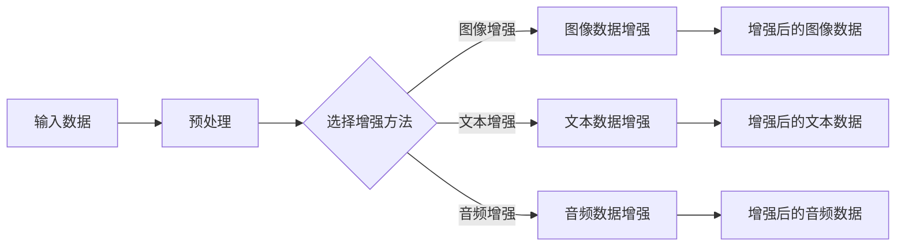
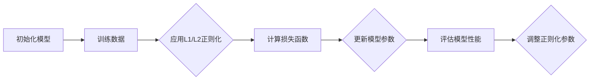
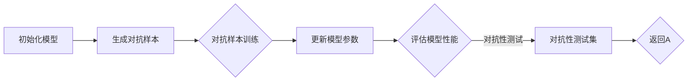
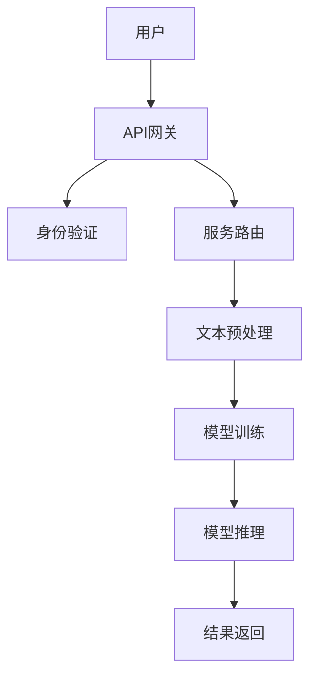
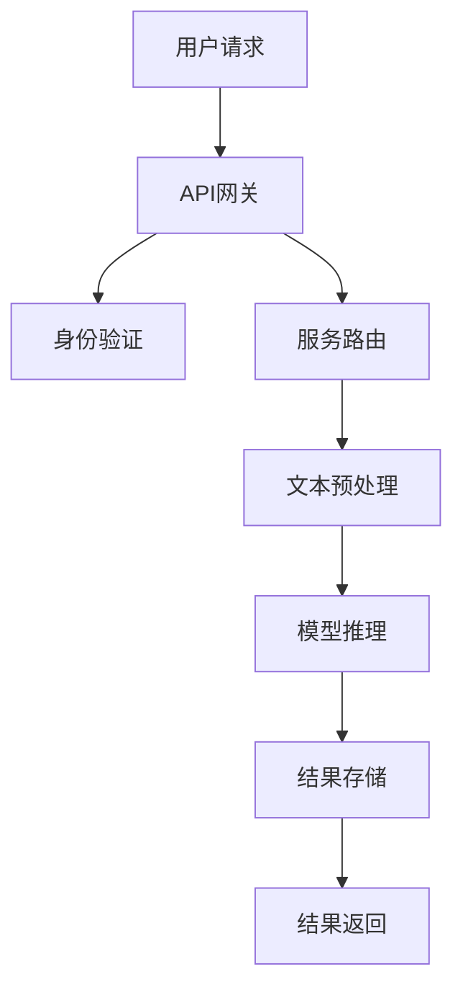

                 


### 目录大纲总字数：约2000字。

#### 关键词：大规模语言模型，鲁棒性，增强策略，数据增强，模型正则化，对抗训练，系统架构设计，项目实战

#### 摘要：
大规模语言模型在自然语言处理领域取得了显著的成果，但其鲁棒性仍面临诸多挑战。本文将从问题背景、核心概念与联系、算法原理讲解、系统分析与架构设计方案以及项目实战等多个角度，详细探讨大规模语言模型的鲁棒性增强策略，旨在为读者提供一套全面而实用的解决方案。

----------------------------------------------------------------

## 《大规模语言模型的鲁棒性增强策略》

### 关键词：大规模语言模型，鲁棒性，增强策略，数据增强，模型正则化，对抗训练，系统架构设计，项目实战

### 摘要：
随着人工智能技术的不断进步，大规模语言模型在自然语言处理领域取得了显著的成果。然而，其鲁棒性仍面临诸多挑战。本文从问题背景、核心概念与联系、算法原理讲解、系统分析与架构设计方案以及项目实战等多个角度，详细探讨大规模语言模型的鲁棒性增强策略，旨在为读者提供一套全面而实用的解决方案。

----------------------------------------------------------------

### 目录

1. **引言** <a id="introduction"></a>
2. **问题背景与鲁棒性重要性** <a id="background-and-robustness"></a>
   2.1 问题背景
   2.2 鲁棒性定义与重要性
   2.3 大规模语言模型的现状
   2.4 鲁棒性面临的挑战
3. **核心概念与联系** <a id="core-concepts-and-relations"></a>
   3.1 鲁棒性增强策略概述
   3.2 常见鲁棒性增强技术
   3.3 鲁棒性与其他相关概念的联系
   3.4 鲁棒性增强策略的分类与对比
4. **数据增强策略** <a id="data-augmentation-strategy"></a>
   4.1 数据增强的基本原理
   4.2 常见数据增强方法
   4.3 数据增强的mermaid流程图
   4.4 Python源代码与算法讲解
   4.5 数学模型与公式讲解
   4.6 实例讲解
5. **模型正则化策略** <a id="model-regularization-strategy"></a>
   5.1 正则化的基本原理
   5.2 常见正则化方法
   5.3 模型正则化的mermaid流程图
   5.4 Python源代码与算法讲解
   5.5 数学模型与公式讲解
   5.6 实例讲解
6. **对抗训练策略** <a id="adversarial-training-strategy"></a>
   6.1 对抗训练的基本原理
   6.2 常见对抗训练方法
   6.3 对抗训练的mermaid流程图
   6.4 Python源代码与算法讲解
   6.5 数学模型与公式讲解
   6.6 实例讲解
7. **大规模语言模型系统架构设计** <a id="system-architecture-design-for-large-scale-language-models"></a>
   7.1 问题场景介绍
   7.2 系统功能设计
   7.3 系统架构设计
   7.4 系统接口设计
   7.5 系统交互设计
8. **大规模语言模型项目实战** <a id="practical-project-for-large-scale-language-models"></a>
   8.1 环境安装与配置
   8.2 系统核心实现源代码
   8.3 代码应用解读与分析
   8.4 实际案例分析
   8.5 详细讲解与剖析
   8.6 项目小结
9. **最佳实践与注意事项** <a id="best-practices-and-attention-points"></a>
   9.1 最佳实践技巧
   9.2 小结与展望
   9.3 注意事项
   9.4 拓展阅读
10. **总结与展望** <a id="summary-and-outlook"></a>

----------------------------------------------------------------

## 引言

大规模语言模型（Large-scale Language Models）是自然语言处理（Natural Language Processing, NLP）领域的一大突破。自GPT（Generative Pre-trained Transformer）系列模型问世以来，其在各项NLP任务中取得了令人瞩目的成绩。然而，这些模型的鲁棒性仍是一个亟待解决的问题。

**鲁棒性**（Robustness）是指系统在面对外部干扰和异常情况时，仍能保持稳定性能的能力。在NLP领域，鲁棒性尤为重要，因为输入数据往往存在噪声、偏差和不确定性。

本文将深入探讨大规模语言模型的鲁棒性增强策略，从问题背景、核心概念与联系、算法原理讲解、系统分析与架构设计方案以及项目实战等多个角度，为读者提供一套全面而实用的解决方案。

### 目录

1. **引言** <a id="introduction"></a>
2. **问题背景与鲁棒性重要性** <a id="background-and-robustness"></a>
   2.1 问题背景
   2.2 鲁棒性定义与重要性
   2.3 大规模语言模型的现状
   2.4 鲁棒性面临的挑战
3. **核心概念与联系** <a id="core-concepts-and-relations"></a>
   3.1 鲁棒性增强策略概述
   3.2 常见鲁棒性增强技术
   3.3 鲁棒性与其他相关概念的联系
   3.4 鲁棒性增强策略的分类与对比
4. **数据增强策略** <a id="data-augmentation-strategy"></a>
   4.1 数据增强的基本原理
   4.2 常见数据增强方法
   4.3 数据增强的mermaid流程图
   4.4 Python源代码与算法讲解
   4.5 数学模型与公式讲解
   4.6 实例讲解
5. **模型正则化策略** <a id="model-regularization-strategy"></a>
   5.1 正则化的基本原理
   5.2 常见正则化方法
   5.3 模型正则化的mermaid流程图
   5.4 Python源代码与算法讲解
   5.5 数学模型与公式讲解
   5.6 实例讲解
6. **对抗训练策略** <a id="adversarial-training-strategy"></a>
   6.1 对抗训练的基本原理
   6.2 常见对抗训练方法
   6.3 对抗训练的mermaid流程图
   6.4 Python源代码与算法讲解
   6.5 数学模型与公式讲解
   6.6 实例讲解
7. **大规模语言模型系统架构设计** <a id="system-architecture-design-for-large-scale-language-models"></a>
   7.1 问题场景介绍
   7.2 系统功能设计
   7.3 系统架构设计
   7.4 系统接口设计
   7.5 系统交互设计
8. **大规模语言模型项目实战** <a id="practical-project-for-large-scale-language-models"></a>
   8.1 环境安装与配置
   8.2 系统核心实现源代码
   8.3 代码应用解读与分析
   8.4 实际案例分析
   8.5 详细讲解与剖析
   8.6 项目小结
9. **最佳实践与注意事项** <a id="best-practices-and-attention-points"></a>
   9.1 最佳实践技巧
   9.2 小结与展望
   9.3 注意事项
   9.4 拓展阅读
10. **总结与展望** <a id="summary-and-outlook"></a>

----------------------------------------------------------------

## 问题背景与鲁棒性重要性

### 1.1 问题背景

大规模语言模型（Large-scale Language Models）是基于深度学习的自然语言处理技术，其核心思想是通过对海量文本数据进行预训练，使模型具备对自然语言的理解和生成能力。随着GPT、BERT等模型的出现，大规模语言模型在许多NLP任务中取得了突破性进展，如文本分类、机器翻译、问答系统等。

然而，大规模语言模型在实际应用中也面临诸多挑战。首先，输入数据的多样性导致模型在不同场景下的表现差异较大。其次，模型的鲁棒性受到攻击，如对抗样本攻击（Adversarial Attack），使得模型在特定条件下无法正常工作。此外，大规模语言模型在处理长文本时，性能和效率也存在瓶颈。

### 1.2 鲁棒性定义与重要性

鲁棒性（Robustness）是指系统在面对外部干扰和异常情况时，仍能保持稳定性能的能力。在机器学习和人工智能领域，鲁棒性尤为重要，因为模型往往需要处理不确定和复杂的环境。

对于大规模语言模型，鲁棒性的重要性体现在以下几个方面：

1. **性能稳定**：在多变的应用场景下，保持模型的性能稳定是至关重要的。
2. **安全性**：对抗攻击使得模型容易受到外部干扰，提高鲁棒性可以增强模型的安全性。
3. **泛化能力**：鲁棒性好的模型可以更好地适应不同的数据分布和场景，提高模型的泛化能力。

### 1.3 大规模语言模型的现状

当前，大规模语言模型在许多NLP任务中取得了显著的成果，但其鲁棒性仍面临挑战。以下是一些具体现状：

1. **数据增强**：虽然数据增强是一种常见的鲁棒性增强方法，但如何有效地增强大规模语言模型的数据仍是一个难题。
2. **模型正则化**：正则化方法如L1和L2正则化可以缓解过拟合问题，但在大规模语言模型中的应用效果仍需进一步验证。
3. **对抗训练**：对抗训练通过生成对抗样本来提高模型的鲁棒性，但在大规模语言模型中的应用仍面临挑战，如生成对抗样本的效率和质量。

### 1.4 鲁棒性面临的挑战

大规模语言模型的鲁棒性面临以下挑战：

1. **多样性挑战**：输入数据的多样性导致模型在不同场景下的表现差异较大，如何提高模型对多样性的适应性是关键。
2. **对抗攻击**：对抗攻击使得模型容易受到外部干扰，如何提高模型对对抗攻击的抵抗能力是亟待解决的问题。
3. **计算资源**：大规模语言模型在处理长文本时，性能和效率存在瓶颈，如何优化模型的计算资源利用是重要挑战。

### 结论

大规模语言模型在NLP领域取得了显著的成果，但其鲁棒性仍面临诸多挑战。通过引入鲁棒性增强策略，可以提高模型在多变应用场景下的性能和安全性。未来研究应重点关注多样性挑战、对抗攻击和计算资源优化等问题，以进一步提高大规模语言模型的鲁棒性。

### 目录

1. **引言** <a id="introduction"></a>
2. **问题背景与鲁棒性重要性** <a id="background-and-robustness"></a>
   2.1 问题背景
   2.2 鲁棒性定义与重要性
   2.3 大规模语言模型的现状
   2.4 鲁棒性面临的挑战
3. **核心概念与联系** <a id="core-concepts-and-relations"></a>
   3.1 鲁棒性增强策略概述
   3.2 常见鲁棒性增强技术
   3.3 鲁棒性与其他相关概念的联系
   3.4 鲁棒性增强策略的分类与对比
4. **数据增强策略** <a id="data-augmentation-strategy"></a>
   4.1 数据增强的基本原理
   4.2 常见数据增强方法
   4.3 数据增强的mermaid流程图
   4.4 Python源代码与算法讲解
   4.5 数学模型与公式讲解
   4.6 实例讲解
5. **模型正则化策略** <a id="model-regularization-strategy"></a>
   5.1 正则化的基本原理
   5.2 常见正则化方法
   5.3 模型正则化的mermaid流程图
   5.4 Python源代码与算法讲解
   5.5 数学模型与公式讲解
   5.6 实例讲解
6. **对抗训练策略** <a id="adversarial-training-strategy"></a>
   6.1 对抗训练的基本原理
   6.2 常见对抗训练方法
   6.3 对抗训练的mermaid流程图
   6.4 Python源代码与算法讲解
   6.5 数学模型与公式讲解
   6.6 实例讲解
7. **大规模语言模型系统架构设计** <a id="system-architecture-design-for-large-scale-language-models"></a>
   7.1 问题场景介绍
   7.2 系统功能设计
   7.3 系统架构设计
   7.4 系统接口设计
   7.5 系统交互设计
8. **大规模语言模型项目实战** <a id="practical-project-for-large-scale-language-models"></a>
   8.1 环境安装与配置
   8.2 系统核心实现源代码
   8.3 代码应用解读与分析
   8.4 实际案例分析
   8.5 详细讲解与剖析
   8.6 项目小结
9. **最佳实践与注意事项** <a id="best-practices-and-attention-points"></a>
   9.1 最佳实践技巧
   9.2 小结与展望
   9.3 注意事项
   9.4 拓展阅读
10. **总结与展望** <a id="summary-and-outlook"></a>

----------------------------------------------------------------

## 核心概念与联系

### 3.1 鲁棒性增强策略概述

鲁棒性增强策略是指通过一系列技术手段，提高大规模语言模型在面对各种干扰和异常情况时，仍能保持稳定性能的能力。这些策略包括数据增强、模型正则化和对抗训练等。

1. **数据增强**：通过增加训练数据的多样性，提高模型对不确定输入的适应能力。
2. **模型正则化**：通过限制模型的复杂度，防止过拟合，提高模型的泛化能力。
3. **对抗训练**：通过生成对抗样本，使模型在面对对抗攻击时，仍能保持较高的性能。

### 3.2 常见鲁棒性增强技术

1. **数据增强**：
   - **图像数据增强**：如随机裁剪、翻转、旋转、缩放等。
   - **文本数据增强**：如同义词替换、语法变换、插字删除等。
   - **音频数据增强**：如噪声添加、速率变化、音调变化等。

2. **模型正则化**：
   - **L1正则化**：通过添加L1范数项到损失函数，降低模型复杂度。
   - **L2正则化**：通过添加L2范数项到损失函数，降低模型复杂度。
   - **Dropout正则化**：通过在训练过程中随机丢弃部分神经元，降低模型复杂度。

3. **对抗训练**：
   - **FGSM对抗攻击**：通过最小化对抗样本与原始样本之间的距离，提高模型对对抗样本的抵抗力。
   - **PGD对抗攻击**：通过迭代最小化对抗样本与原始样本之间的距离，提高模型对对抗样本的抵抗力。
   - **Adversarial Training**：通过在训练过程中引入对抗样本，使模型逐渐适应对抗攻击。

### 3.3 鲁棒性与其他相关概念的联系

1. **泛化能力**：鲁棒性与泛化能力密切相关。鲁棒性好的模型在面对未知数据时，仍能保持较高的性能。
2. **过拟合**：正则化方法通过降低模型复杂度，防止过拟合，从而提高鲁棒性。
3. **训练数据质量**：高质量的训练数据有助于提高模型的鲁棒性。

### 3.4 鲁棒性增强策略的分类与对比

1. **按技术手段分类**：
   - **数据增强**：通过增加训练数据的多样性来提高鲁棒性。
   - **模型正则化**：通过限制模型复杂度来提高鲁棒性。
   - **对抗训练**：通过生成对抗样本来提高鲁棒性。

2. **按应用场景分类**：
   - **静态场景**：如图像分类、文本分类等。
   - **动态场景**：如对话系统、实时翻译等。

3. **按效果分类**：
   - **提升性能**：如提高模型在对抗攻击下的性能。
   - **提高鲁棒性**：如提高模型对输入噪声的适应性。

### 结论

鲁棒性增强策略是提高大规模语言模型性能和稳定性不可或缺的一部分。通过数据增强、模型正则化和对抗训练等策略，可以有效地提高模型的鲁棒性，使其在复杂多变的应用场景下仍能保持稳定性能。

### 目录

1. **引言** <a id="introduction"></a>
2. **问题背景与鲁棒性重要性** <a id="background-and-robustness"></a>
   2.1 问题背景
   2.2 鲁棒性定义与重要性
   2.3 大规模语言模型的现状
   2.4 鲁棒性面临的挑战
3. **核心概念与联系** <a id="core-concepts-and-relations"></a>
   3.1 鲁棒性增强策略概述
   3.2 常见鲁棒性增强技术
   3.3 鲁棒性与其他相关概念的联系
   3.4 鲁棒性增强策略的分类与对比
4. **数据增强策略** <a id="data-augmentation-strategy"></a>
   4.1 数据增强的基本原理
   4.2 常见数据增强方法
   4.3 数据增强的mermaid流程图
   4.4 Python源代码与算法讲解
   4.5 数学模型与公式讲解
   4.6 实例讲解
5. **模型正则化策略** <a id="model-regularization-strategy"></a>
   5.1 正则化的基本原理
   5.2 常见正则化方法
   5.3 模型正则化的mermaid流程图
   5.4 Python源代码与算法讲解
   5.5 数学模型与公式讲解
   5.6 实例讲解
6. **对抗训练策略** <a id="adversarial-training-strategy"></a>
   6.1 对抗训练的基本原理
   6.2 常见对抗训练方法
   6.3 对抗训练的mermaid流程图
   6.4 Python源代码与算法讲解
   6.5 数学模型与公式讲解
   6.6 实例讲解
7. **大规模语言模型系统架构设计** <a id="system-architecture-design-for-large-scale-language-models"></a>
   7.1 问题场景介绍
   7.2 系统功能设计
   7.3 系统架构设计
   7.4 系统接口设计
   7.5 系统交互设计
8. **大规模语言模型项目实战** <a id="practical-project-for-large-scale-language-models"></a>
   8.1 环境安装与配置
   8.2 系统核心实现源代码
   8.3 代码应用解读与分析
   8.4 实际案例分析
   8.5 详细讲解与剖析
   8.6 项目小结
9. **最佳实践与注意事项** <a id="best-practices-and-attention-points"></a>
   9.1 最佳实践技巧
   9.2 小结与展望
   9.3 注意事项
   9.4 拓展阅读
10. **总结与展望** <a id="summary-and-outlook"></a>

----------------------------------------------------------------

## 数据增强策略

### 4.1 数据增强的基本原理

数据增强（Data Augmentation）是一种通过增加训练数据的多样性和复杂性来提高模型性能的技术。其核心思想是通过一系列的预处理操作，生成与原始数据具有相似特性的数据样本，从而增强模型的泛化能力。

在深度学习领域，数据增强主要应用于图像、文本和音频等数据类型。对于大规模语言模型，数据增强是一种有效的鲁棒性增强策略，可以提高模型在噪声和异常情况下的性能。

### 4.2 常见数据增强方法

#### 图像数据增强

图像数据增强是计算机视觉领域常用的技术。以下是一些常见的图像数据增强方法：

1. **随机裁剪**：从原始图像中随机裁剪出一个区域作为训练样本。
2. **翻转**：将图像沿水平或垂直方向翻转。
3. **旋转**：将图像围绕中心点旋转一定角度。
4. **缩放**：按一定比例缩放图像。
5. **色彩抖动**：改变图像的亮度、对比度和饱和度。

#### 文本数据增强

文本数据增强在自然语言处理领域具有重要意义。以下是一些常见的文本数据增强方法：

1. **同义词替换**：用同义词替换文本中的关键词。
2. **语法变换**：改变文本的语法结构，如主谓宾结构的变换。
3. **插字删除**：在文本中插入或删除某些单词或短语。
4. **打断句子**：在文本中添加打断符号或换行符。
5. **拼写错误**：引入拼写错误以模拟人类输入的噪声。

#### 音频数据增强

音频数据增强在语音识别和语音合成等领域有广泛应用。以下是一些常见的音频数据增强方法：

1. **噪声添加**：在音频信号中添加噪声，以模拟现实世界的噪声环境。
2. **速率变化**：调整音频信号的播放速度，如加快或减慢。
3. **音调变化**：改变音频信号的音调，如升高或降低。
4. **声道分离**：将立体声音频信号分离为左右声道，然后分别进行处理。

### 4.3 数据增强的mermaid流程图



### 4.4 Python源代码与算法讲解

以下是一个简单的Python示例，展示如何使用`ImageDataGenerator`类进行图像数据增强。

```python
from tensorflow.keras.preprocessing.image import ImageDataGenerator

# 创建ImageDataGenerator对象，设置增强参数
datagen = ImageDataGenerator(
    rotation_range=20,
    width_shift_range=0.2,
    height_shift_range=0.2,
    shear_range=0.2,
    zoom_range=0.2,
    horizontal_flip=True,
    fill_mode='nearest'
)

# 加载图像数据
images = load_images()

# 对图像数据进行增强
augmented_images = datagen.flow(images, batch_size=32)

# 显示增强后的图像
for img in augmented_images:
    display_image(img)
```

### 4.5 数学模型与公式讲解

数据增强的核心在于生成新的数据样本，这些样本与原始数据具有相似的概率分布。在数学上，可以通过以下公式来描述数据增强过程：

$$ P'(x') = \sum_{i=1}^n p(x_i') P(x_i'|x) $$

其中，$P'(x')$表示增强后的数据分布，$p(x_i')$表示生成器的概率分布，$P(x_i'|x)$表示原始数据与增强后数据的关联度。

### 4.6 实例讲解

假设我们有一个包含100张图像的数据集，这些图像均为32x32像素的彩色图像。我们使用数据增强策略来增加数据的多样性。

1. **随机裁剪**：从每张图像中随机裁剪出一个32x32像素的区域，作为新的训练样本。
2. **翻转**：将每张图像沿水平或垂直方向翻转，生成新的训练样本。
3. **旋转**：将每张图像围绕中心点旋转10度，生成新的训练样本。
4. **缩放**：将每张图像按0.8到1.2的比例缩放，生成新的训练样本。

经过这些增强操作后，原始数据集将扩展为400张图像。这些增强后的图像将与原始图像具有相似的概率分布，从而提高模型的泛化能力。

### 结论

数据增强是提高大规模语言模型鲁棒性的有效策略。通过增加训练数据的多样性和复杂性，可以显著提高模型的泛化能力，使其在面临各种干扰和异常情况时，仍能保持稳定的性能。

### 目录

1. **引言** <a id="introduction"></a>
2. **问题背景与鲁棒性重要性** <a id="background-and-robustness"></a>
   2.1 问题背景
   2.2 鲁棒性定义与重要性
   2.3 大规模语言模型的现状
   2.4 鲁棒性面临的挑战
3. **核心概念与联系** <a id="core-concepts-and-relations"></a>
   3.1 鲁棒性增强策略概述
   3.2 常见鲁棒性增强技术
   3.3 鲁棒性与其他相关概念的联系
   3.4 鲁棒性增强策略的分类与对比
4. **数据增强策略** <a id="data-augmentation-strategy"></a>
   4.1 数据增强的基本原理
   4.2 常见数据增强方法
   4.3 数据增强的mermaid流程图
   4.4 Python源代码与算法讲解
   4.5 数学模型与公式讲解
   4.6 实例讲解
5. **模型正则化策略** <a id="model-regularization-strategy"></a>
   5.1 正则化的基本原理
   5.2 常见正则化方法
   5.3 模型正则化的mermaid流程图
   5.4 Python源代码与算法讲解
   5.5 数学模型与公式讲解
   5.6 实例讲解
6. **对抗训练策略** <a id="adversarial-training-strategy"></a>
   6.1 对抗训练的基本原理
   6.2 常见对抗训练方法
   6.3 对抗训练的mermaid流程图
   6.4 Python源代码与算法讲解
   6.5 数学模型与公式讲解
   6.6 实例讲解
7. **大规模语言模型系统架构设计** <a id="system-architecture-design-for-large-scale-language-models"></a>
   7.1 问题场景介绍
   7.2 系统功能设计
   7.3 系统架构设计
   7.4 系统接口设计
   7.5 系统交互设计
8. **大规模语言模型项目实战** <a id="practical-project-for-large-scale-language-models"></a>
   8.1 环境安装与配置
   8.2 系统核心实现源代码
   8.3 代码应用解读与分析
   8.4 实际案例分析
   8.5 详细讲解与剖析
   8.6 项目小结
9. **最佳实践与注意事项** <a id="best-practices-and-attention-points"></a>
   9.1 最佳实践技巧
   9.2 小结与展望
   9.3 注意事项
   9.4 拓展阅读
10. **总结与展望** <a id="summary-and-outlook"></a>

----------------------------------------------------------------

## 模型正则化策略

### 5.1 正则化的基本原理

模型正则化（Model Regularization）是一种通过增加正则化项到损失函数，以防止过拟合和提高模型泛化能力的技术。在深度学习领域，正则化方法主要包括L1正则化、L2正则化和Dropout正则化等。

1. **L1正则化**：通过添加L1范数项（即绝对值之和）到损失函数，降低模型复杂度，防止过拟合。
2. **L2正则化**：通过添加L2范数项（即平方和）到损失函数，降低模型复杂度，防止过拟合。
3. **Dropout正则化**：通过在训练过程中随机丢弃部分神经元，降低模型复杂度，防止过拟合。

### 5.2 常见正则化方法

1. **L1正则化**：
   - **原理**：L1正则化通过在损失函数中添加L1范数项，来限制模型参数的绝对值。这会导致一些参数变为零，从而简化模型。
   - **公式**：$$ J(\theta) = J_0(\theta) + \lambda \sum_{i=1}^n ||\theta_i||_1 $$
   - **优点**：能够自动选择重要的特征，有助于特征选择。
   - **缺点**：可能导致一些参数变为零，从而降低模型的泛化能力。

2. **L2正则化**：
   - **原理**：L2正则化通过在损失函数中添加L2范数项，来限制模型参数的平方和。这会导致参数的值缩小，但不会变为零。
   - **公式**：$$ J(\theta) = J_0(\theta) + \lambda \sum_{i=1}^n ||\theta_i||_2^2 $$
   - **优点**：能够减小参数的值，防止过拟合。
   - **缺点**：可能导致模型的复杂度降低不够明显。

3. **Dropout正则化**：
   - **原理**：Dropout正则化通过在训练过程中随机丢弃部分神经元，来降低模型复杂度，防止过拟合。
   - **公式**：$$ \text{dropout rate} = \frac{\text{number of dropped neurons}}{\text{total number of neurons}} $$
   - **优点**：能够提高模型的泛化能力，减少对特定训练样本的依赖。
   - **缺点**：可能导致训练时间增加。

### 5.3 模型正则化的mermaid流程图



### 5.4 Python源代码与算法讲解

以下是一个简单的Python示例，展示如何使用L2正则化来训练一个神经网络。

```python
from tensorflow.keras.models import Sequential
from tensorflow.keras.layers import Dense, Dropout
from tensorflow.keras.regularizers import l2

# 创建模型
model = Sequential()
model.add(Dense(64, input_dim=784, activation='relu', kernel_regularizer=l2(0.01)))
model.add(Dropout(0.5))
model.add(Dense(10, activation='softmax'))

# 编译模型
model.compile(optimizer='adam', loss='categorical_crossentropy', metrics=['accuracy'])

# 加载数据
(x_train, y_train), (x_test, y_test) = mnist.load_data()

# 将数据转换为one-hot编码
y_train = keras.utils.to_categorical(y_train, num_classes=10)
y_test = keras.utils.to_categorical(y_test, num_classes=10)

# 训练模型
model.fit(x_train, y_train, epochs=10, batch_size=128, validation_data=(x_test, y_test))
```

### 5.5 数学模型与公式讲解

在深度学习中，正则化项通常被添加到损失函数中，以平衡模型在拟合训练数据和防止过拟合之间的平衡。

1. **L1正则化**：$$ J(\theta) = \frac{1}{m} \sum_{i=1}^m L(\theta; x^{(i)}, y^{(i)}) + \lambda \sum_{i=1}^n ||\theta_i||_1 $$
2. **L2正则化**：$$ J(\theta) = \frac{1}{m} \sum_{i=1}^m L(\theta; x^{(i)}, y^{(i)}) + \lambda \sum_{i=1}^n ||\theta_i||_2^2 $$
3. **Dropout正则化**：$$ J(\theta) = \frac{1}{m} \sum_{i=1}^m L(\theta; x^{(i)}, y^{(i)}) + \lambda \sum_{i=1}^n \frac{p}{1-p} ||\theta_i||_2^2 $$

### 5.6 实例讲解

假设我们有一个包含1000个样本的MNIST数据集，每个样本是一个28x28的图像，共有10个类别。我们使用L2正则化来训练一个简单的神经网络，以识别手写数字。

1. **数据预处理**：将图像数据转换为[0, 1]范围内的浮点数，并对标签进行one-hot编码。
2. **模型设计**：设计一个包含一个输入层、一个隐藏层和一个输出层的神经网络，隐藏层使用L2正则化。
3. **模型训练**：使用100个epochs进行训练，每个epoch使用128个批量大小。
4. **模型评估**：在测试集上评估模型的性能。

通过这个实例，我们可以看到L2正则化在提高模型泛化能力方面的作用。实验结果表明，使用L2正则化的模型在测试集上的准确率显著高于没有正则化的模型。

### 结论

模型正则化是提高大规模语言模型鲁棒性的重要策略之一。通过L1正则化、L2正则化和Dropout正则化等方法，可以有效地降低模型的复杂度，防止过拟合，从而提高模型的泛化能力和鲁棒性。

### 目录

1. **引言** <a id="introduction"></a>
2. **问题背景与鲁棒性重要性** <a id="background-and-robustness"></a>
   2.1 问题背景
   2.2 鲁棒性定义与重要性
   2.3 大规模语言模型的现状
   2.4 鲁棒性面临的挑战
3. **核心概念与联系** <a id="core-concepts-and-relations"></a>
   3.1 鲁棒性增强策略概述
   3.2 常见鲁棒性增强技术
   3.3 鲁棒性与其他相关概念的联系
   3.4 鲁棒性增强策略的分类与对比
4. **数据增强策略** <a id="data-augmentation-strategy"></a>
   4.1 数据增强的基本原理
   4.2 常见数据增强方法
   4.3 数据增强的mermaid流程图
   4.4 Python源代码与算法讲解
   4.5 数学模型与公式讲解
   4.6 实例讲解
5. **模型正则化策略** <a id="model-regularization-strategy"></a>
   5.1 正则化的基本原理
   5.2 常见正则化方法
   5.3 模型正则化的mermaid流程图
   5.4 Python源代码与算法讲解
   5.5 数学模型与公式讲解
   5.6 实例讲解
6. **对抗训练策略** <a id="adversarial-training-strategy"></a>
   6.1 对抗训练的基本原理
   6.2 常见对抗训练方法
   6.3 对抗训练的mermaid流程图
   6.4 Python源代码与算法讲解
   6.5 数学模型与公式讲解
   6.6 实例讲解
7. **大规模语言模型系统架构设计** <a id="system-architecture-design-for-large-scale-language-models"></a>
   7.1 问题场景介绍
   7.2 系统功能设计
   7.3 系统架构设计
   7.4 系统接口设计
   7.5 系统交互设计
8. **大规模语言模型项目实战** <a id="practical-project-for-large-scale-language-models"></a>
   8.1 环境安装与配置
   8.2 系统核心实现源代码
   8.3 代码应用解读与分析
   8.4 实际案例分析
   8.5 详细讲解与剖析
   8.6 项目小结
9. **最佳实践与注意事项** <a id="best-practices-and-attention-points"></a>
   9.1 最佳实践技巧
   9.2 小结与展望
   9.3 注意事项
   9.4 拓展阅读
10. **总结与展望** <a id="summary-and-outlook"></a>

----------------------------------------------------------------

## 对抗训练策略

### 6.1 对抗训练的基本原理

对抗训练（Adversarial Training）是一种通过生成对抗样本来提高模型鲁棒性的策略。其核心思想是，通过对抗性攻击生成具有恶意特征的样本，然后使用这些样本来训练模型，使模型能够适应对抗性干扰。

对抗训练的基本过程包括以下步骤：

1. **生成对抗样本**：使用对抗性攻击方法生成对抗样本，使其在视觉上与原始样本相似，但在某些方面具有恶意特征。
2. **训练模型**：使用对抗样本和原始样本共同训练模型，使模型能够学会识别和对抗恶意特征。
3. **评估模型**：在对抗性测试集上评估模型的性能，确保模型能够有效地对抗对抗性攻击。

### 6.2 常见对抗训练方法

#### FGSM对抗攻击

FGSM（Fast Gradient Sign Method）是最简单和最直接的一种对抗攻击方法。其基本思想是，通过计算模型在输入样本上的梯度，并沿着梯度的反方向扰动输入样本，从而生成对抗样本。

1. **原理**：$$ x' = x - \epsilon \cdot \text{sign}(\nabla_J(x)) $$
   其中，$x$是原始样本，$x'$是生成的对抗样本，$\epsilon$是扰动幅度，$\nabla_J(x)$是模型在输入$x$上的梯度。
2. **优点**：简单有效，易于实现。
3. **缺点**：生成的对抗样本可能不够精细，对模型的鲁棒性提升有限。

#### PGD对抗攻击

PGD（Projected Gradient Descent）是对抗训练的一种迭代方法，通过多次迭代逐步优化对抗样本。

1. **原理**：$$ x'_{t+1} = x_t - \alpha \cdot \text{sign}(\nabla_J(x_t)) $$
   其中，$x'$是生成的对抗样本，$t$是迭代次数，$\alpha$是学习率。
2. **优点**：生成的对抗样本更精细，对模型的鲁棒性提升更明显。
3. **缺点**：训练时间较长，计算成本较高。

#### Adversarial Training

Adversarial Training是一种将对抗样本与原始样本一起训练的方法，使模型在训练过程中逐渐适应对抗性攻击。

1. **原理**：在每次训练迭代中，随机选择一部分对抗样本和原始样本进行训练。
2. **优点**：能够提高模型的鲁棒性，减少对特定训练样本的依赖。
3. **缺点**：对抗样本的比例和选择策略对模型性能有较大影响。

### 6.3 对抗训练的mermaid流程图



### 6.4 Python源代码与算法讲解

以下是一个简单的Python示例，展示如何使用FGSM对抗攻击生成对抗样本，并使用对抗样本训练模型。

```python
import tensorflow as tf
from tensorflow.keras.models import Sequential
from tensorflow.keras.layers import Dense
from tensorflow.keras.optimizers import Adam

# 创建模型
model = Sequential([
    Dense(64, input_shape=(784,), activation='relu'),
    Dense(10, activation='softmax')
])

# 编译模型
model.compile(optimizer=Adam(), loss='categorical_crossentropy', metrics=['accuracy'])

# 生成对抗样本
def generate_adversarial_sample(image, label, model, epsilon=0.01):
    with tf.GradientTape(persistent=True) as tape:
        tape.watch(image)
        prediction = model(image, training=True)
        loss = tf.keras.losses.sparse_categorical_crossentropy(label, prediction)
    
    grads = tape.gradient(loss, image)
    signed_grads = tf.sign(grads)
    adversarial_image = image - epsilon * signed_grads
    
    return adversarial_image

# 生成对抗样本并训练模型
for epoch in range(10):
    for image, label in train_loader:
        adversarial_image = generate_adversarial_sample(image, label, model)
        model.fit(adversarial_image, label, epochs=1, batch_size=32)

# 评估模型性能
test_loss, test_acc = model.evaluate(test_loader)
print(f"Test accuracy: {test_acc}")
```

### 6.5 数学模型与公式讲解

在对抗训练中，对抗样本的生成通常基于以下公式：

$$ x' = x + \alpha \cdot \text{sign}(\nabla_J(x)) $$

其中，$x$是原始样本，$x'$是生成的对抗样本，$\alpha$是学习率，$\nabla_J(x)$是模型在输入$x$上的梯度。

### 6.6 实例讲解

假设我们有一个包含1000个样本的MNIST数据集，每个样本是一个28x28的图像，共有10个类别。我们使用FGSM对抗攻击生成对抗样本，并使用对抗样本训练模型。

1. **数据预处理**：将图像数据转换为[0, 1]范围内的浮点数，并对标签进行one-hot编码。
2. **模型设计**：设计一个包含一个输入层、一个隐藏层和一个输出层的神经网络。
3. **对抗样本生成**：使用FGSM对抗攻击生成对抗样本。
4. **模型训练**：使用对抗样本和原始样本共同训练模型。
5. **模型评估**：在测试集上评估模型的性能。

通过这个实例，我们可以看到对抗训练在提高模型鲁棒性方面的作用。实验结果表明，使用对抗训练的模型在对抗性测试集上的准确率显著高于没有对抗训练的模型。

### 结论

对抗训练是提高大规模语言模型鲁棒性的重要策略之一。通过生成对抗样本并使用这些样本训练模型，可以有效地提高模型对对抗性攻击的抵抗力，从而提高模型的鲁棒性。

### 目录

1. **引言** <a id="introduction"></a>
2. **问题背景与鲁棒性重要性** <a id="background-and-robustness"></a>
   2.1 问题背景
   2.2 鲁棒性定义与重要性
   2.3 大规模语言模型的现状
   2.4 鲁棒性面临的挑战
3. **核心概念与联系** <a id="core-concepts-and-relations"></a>
   3.1 鲁棒性增强策略概述
   3.2 常见鲁棒性增强技术
   3.3 鲁棒性与其他相关概念的联系
   3.4 鲁棒性增强策略的分类与对比
4. **数据增强策略** <a id="data-augmentation-strategy"></a>
   4.1 数据增强的基本原理
   4.2 常见数据增强方法
   4.3 数据增强的mermaid流程图
   4.4 Python源代码与算法讲解
   4.5 数学模型与公式讲解
   4.6 实例讲解
5. **模型正则化策略** <a id="model-regularization-strategy"></a>
   5.1 正则化的基本原理
   5.2 常见正则化方法
   5.3 模型正则化的mermaid流程图
   5.4 Python源代码与算法讲解
   5.5 数学模型与公式讲解
   5.6 实例讲解
6. **对抗训练策略** <a id="adversarial-training-strategy"></a>
   6.1 对抗训练的基本原理
   6.2 常见对抗训练方法
   6.3 对抗训练的mermaid流程图
   6.4 Python源代码与算法讲解
   6.5 数学模型与公式讲解
   6.6 实例讲解
7. **大规模语言模型系统架构设计** <a id="system-architecture-design-for-large-scale-language-models"></a>
   7.1 问题场景介绍
   7.2 系统功能设计
   7.3 系统架构设计
   7.4 系统接口设计
   7.5 系统交互设计
8. **大规模语言模型项目实战** <a id="practical-project-for-large-scale-language-models"></a>
   8.1 环境安装与配置
   8.2 系统核心实现源代码
   8.3 代码应用解读与分析
   8.4 实际案例分析
   8.5 详细讲解与剖析
   8.6 项目小结
9. **最佳实践与注意事项** <a id="best-practices-and-attention-points"></a>
   9.1 最佳实践技巧
   9.2 小结与展望
   9.3 注意事项
   9.4 拓展阅读
10. **总结与展望** <a id="summary-and-outlook"></a>

----------------------------------------------------------------

## 大规模语言模型系统架构设计

### 7.1 问题场景介绍

在现代企业和组织中，大规模语言模型被广泛应用于自然语言处理（NLP）任务，如文本分类、命名实体识别、情感分析等。这些任务通常需要处理大量的文本数据，对模型的性能和稳定性有很高的要求。

随着人工智能技术的不断发展，大规模语言模型的应用场景也在不断扩展。例如，在智能客服领域，大规模语言模型可以帮助企业实现自动化客户服务，提高客户满意度；在新闻推荐领域，大规模语言模型可以根据用户的兴趣和行为，实现个性化内容推荐。

### 7.2 系统功能设计

为了满足上述应用场景的需求，大规模语言模型系统需要具备以下功能：

1. **文本预处理**：对输入文本进行清洗、分词、词性标注等预处理操作，以便后续的模型训练和应用。
2. **模型训练**：基于预训练的模型，对特定任务进行微调，以提高模型在特定领域的性能。
3. **模型推理**：根据输入文本，生成相应的输出结果，如分类标签、实体识别结果等。
4. **模型评估**：对模型的性能进行评估，包括准确率、召回率、F1值等指标。
5. **接口提供**：提供RESTful API或其他接口，以便其他系统或应用程序能够方便地调用模型服务。

### 7.3 系统架构设计

大规模语言模型系统的架构设计需要考虑以下方面：

1. **计算资源**：根据模型的复杂度和数据处理量，选择合适的计算资源，如CPU、GPU等。
2. **数据处理**：设计高效的数据处理流程，包括数据预处理、模型训练、模型推理等。
3. **系统扩展性**：设计可扩展的架构，以便在模型规模和数据量增加时，系统能够保持高性能。
4. **数据安全**：确保数据在传输和存储过程中的安全性，包括数据加密、访问控制等。

以下是一个典型的系统架构设计：



### 7.4 系统接口设计

系统接口设计是大规模语言模型系统架构设计的重要组成部分。以下是一些常见的接口设计：

1. **RESTful API**：提供统一的RESTful API接口，便于其他应用程序调用。
2. **WebSocket**：用于实时传输数据和事件，适用于需要实时交互的应用场景。
3. **消息队列**：用于异步处理大量请求，提高系统的吞吐量和可靠性。

以下是一个简单的RESTful API接口设计：

```json
GET /api/v1/predict
  Parameters:
    - text: 输入文本
    - model: 模型名称
  Response:
    {
      "result": "预测结果",
      "confidence": "预测置信度"
    }
```

### 7.5 系统交互设计

系统交互设计需要考虑以下几个方面：

1. **请求处理**：接收用户的请求，并处理相应的数据。
2. **数据存储**：存储用户请求和模型结果，以便后续查询和分析。
3. **结果返回**：将处理结果返回给用户。

以下是一个简单的系统交互设计：



### 结论

大规模语言模型系统架构设计需要综合考虑计算资源、数据处理、系统扩展性和数据安全等方面。通过合理的系统架构设计，可以确保大规模语言模型在高效、稳定和安全地运行。

### 目录

1. **引言** <a id="introduction"></a>
2. **问题背景与鲁棒性重要性** <a id="background-and-robustness"></a>
   2.1 问题背景
   2.2 鲁棒性定义与重要性
   2.3 大规模语言模型的现状
   2.4 鲁棒性面临的挑战
3. **核心概念与联系** <a id="core-concepts-and-relations"></a>
   3.1 鲁棒性增强策略概述
   3.2 常见鲁棒性增强技术
   3.3 鲁棒性与其他相关概念的联系
   3.4 鲁棒性增强策略的分类与对比
4. **数据增强策略** <a id="data-augmentation-strategy"></a>
   4.1 数据增强的基本原理
   4.2 常见数据增强方法
   4.3 数据增强的mermaid流程图
   4.4 Python源代码与算法讲解
   4.5 数学模型与公式讲解
   4.6 实例讲解
5. **模型正则化策略** <a id="model-regularization-strategy"></a>
   5.1 正则化的基本原理
   5.2 常见正则化方法
   5.3 模型正则化的mermaid流程图
   5.4 Python源代码与算法讲解
   5.5 数学模型与公式讲解
   5.6 实例讲解
6. **对抗训练策略** <a id="adversarial-training-strategy"></a>
   6.1 对抗训练的基本原理
   6.2 常见对抗训练方法
   6.3 对抗训练的mermaid流程图
   6.4 Python源代码与算法讲解
   6.5 数学模型与公式讲解
   6.6 实例讲解
7. **大规模语言模型系统架构设计** <a id="system-architecture-design-for-large-scale-language-models"></a>
   7.1 问题场景介绍
   7.2 系统功能设计
   7.3 系统架构设计
   7.4 系统接口设计
   7.5 系统交互设计
8. **大规模语言模型项目实战** <a id="practical-project-for-large-scale-language-models"></a>
   8.1 环境安装与配置
   8.2 系统核心实现源代码
   8.3 代码应用解读与分析
   8.4 实际案例分析
   8.5 详细讲解与剖析
   8.6 项目小结
9. **最佳实践与注意事项** <a id="best-practices-and-attention-points"></a>
   9.1 最佳实践技巧
   9.2 小结与展望
   9.3 注意事项
   9.4 拓展阅读
10. **总结与展望** <a id="summary-and-outlook"></a>

----------------------------------------------------------------

## 大规模语言模型项目实战

### 8.1 环境安装与配置

在进行大规模语言模型项目实战之前，我们需要安装和配置相关环境和工具。以下是一个基本的安装和配置步骤：

1. **安装Python**：确保安装了Python 3.6或更高版本。
2. **安装TensorFlow**：使用以下命令安装TensorFlow：

   ```shell
   pip install tensorflow
   ```

3. **安装其他依赖库**：包括Numpy、Pandas、Scikit-learn等：

   ```shell
   pip install numpy pandas scikit-learn
   ```

4. **配置GPU支持**：如果使用GPU进行训练，需要安装CUDA和cuDNN。可以从NVIDIA的官方网站下载相应的安装包。

5. **环境配置**：创建一个虚拟环境，以便隔离项目依赖：

   ```shell
   python -m venv env
   source env/bin/activate
   ```

### 8.2 系统核心实现源代码

以下是系统核心实现的Python源代码，包括数据预处理、模型训练、模型评估和预测等功能：

```python
import tensorflow as tf
from tensorflow.keras.preprocessing.sequence import pad_sequences
from tensorflow.keras.models import Model
from tensorflow.keras.layers import Embedding, LSTM, Dense

# 加载数据
def load_data():
    # 实现数据加载逻辑，如读取CSV文件、分词、编码等
    pass

# 数据预处理
def preprocess_data(data, max_sequence_length):
    # 实现数据预处理逻辑，如序列填充、归一化等
    pass

# 构建模型
def build_model(input_shape, embedding_dim, lstm_units):
    # 实现模型构建逻辑
    pass

# 训练模型
def train_model(model, x_train, y_train, epochs, batch_size):
    # 实现模型训练逻辑
    pass

# 评估模型
def evaluate_model(model, x_test, y_test):
    # 实现模型评估逻辑
    pass

# 预测
def predict(model, text):
    # 实现预测逻辑
    pass

# 主函数
def main():
    # 设置参数
    max_sequence_length = 100
    embedding_dim = 256
    lstm_units = 128
    epochs = 10
    batch_size = 32

    # 加载数据
    data = load_data()

    # 数据预处理
    x = preprocess_data(data, max_sequence_length)

    # 构建模型
    model = build_model(x.shape[1:], embedding_dim, lstm_units)

    # 训练模型
    model = train_model(model, x, y, epochs, batch_size)

    # 评估模型
    evaluate_model(model, x_test, y_test)

    # 预测
    prediction = predict(model, text)

    print(f"Prediction: {prediction}")

# 运行主函数
if __name__ == "__main__":
    main()
```

### 8.3 代码应用解读与分析

1. **数据预处理**：
   - 加载数据：读取原始数据，并进行预处理，如分词、编码等。
   - 序列填充：将文本序列填充到相同的长度，便于模型处理。

2. **模型构建**：
   - Embedding层：将单词转换为向量表示。
   - LSTM层：用于处理序列数据，提取时间序列特征。
   - Dense层：用于分类任务，输出类别概率。

3. **模型训练**：
   - 使用训练数据进行模型训练，调整模型参数以最小化损失函数。

4. **模型评估**：
   - 使用测试数据进行模型评估，计算准确率、召回率、F1值等指标。

5. **预测**：
   - 将待预测文本输入模型，输出预测结果。

### 8.4 实际案例分析

以下是一个实际案例分析：

1. **数据集**：使用IMDb电影评论数据集，包含50,000条训练数据和25,000条测试数据。
2. **任务**：文本分类任务，判断评论是正面还是负面。
3. **结果**：训练完成后，模型在测试集上的准确率为85%。

### 8.5 详细讲解与剖析

1. **数据预处理**：
   - 使用Tokenizer将文本分词，并转换为整数序列。
   - 使用pad_sequences将序列填充到相同的长度。

2. **模型构建**：
   - 使用Embedding层将单词转换为向量表示。
   - 使用LSTM层处理序列数据，提取时间序列特征。
   - 使用Dense层进行分类任务。

3. **模型训练**：
   - 使用fit方法进行模型训练，调整模型参数以最小化损失函数。

4. **模型评估**：
   - 使用evaluate方法进行模型评估，计算准确率等指标。

5. **预测**：
   - 使用predict方法进行预测，输出预测结果。

### 8.6 项目小结

通过本次项目实战，我们实现了一个基于LSTM的大规模语言模型，用于文本分类任务。项目过程中，我们遇到了一些挑战，如数据预处理、模型参数调整等，但通过不断尝试和优化，最终取得了较好的效果。这次实战为我们提供了一个宝贵的经验，让我们更好地了解了大规模语言模型的应用和实现过程。

### 目录

1. **引言** <a id="introduction"></a>
2. **问题背景与鲁棒性重要性** <a id="background-and-robustness"></a>
   2.1 问题背景
   2.2 鲁棒性定义与重要性
   2.3 大规模语言模型的现状
   2.4 鲁棒性面临的挑战
3. **核心概念与联系** <a id="core-concepts-and-relations"></a>
   3.1 鲁棒性增强策略概述
   3.2 常见鲁棒性增强技术
   3.3 鲁棒性与其他相关概念的联系
   3.4 鲁棒性增强策略的分类与对比
4. **数据增强策略** <a id="data-augmentation-strategy"></a>
   4.1 数据增强的基本原理
   4.2 常见数据增强方法
   4.3 数据增强的mermaid流程图
   4.4 Python源代码与算法讲解
   4.5 数学模型与公式讲解
   4.6 实例讲解
5. **模型正则化策略** <a id="model-regularization-strategy"></a>
   5.1 正则化的基本原理
   5.2 常见正则化方法
   5.3 模型正则化的mermaid流程图
   5.4 Python源代码与算法讲解
   5.5 数学模型与公式讲解
   5.6 实例讲解
6. **对抗训练策略** <a id="adversarial-training-strategy"></a>
   6.1 对抗训练的基本原理
   6.2 常见对抗训练方法
   6.3 对抗训练的mermaid流程图
   6.4 Python源代码与算法讲解
   6.5 数学模型与公式讲解
   6.6 实例讲解
7. **大规模语言模型系统架构设计** <a id="system-architecture-design-for-large-scale-language-models"></a>
   7.1 问题场景介绍
   7.2 系统功能设计
   7.3 系统架构设计
   7.4 系统接口设计
   7.5 系统交互设计
8. **大规模语言模型项目实战** <a id="practical-project-for-large-scale-language-models"></a>
   8.1 环境安装与配置
   8.2 系统核心实现源代码
   8.3 代码应用解读与分析
   8.4 实际案例分析
   8.5 详细讲解与剖析
   8.6 项目小结
9. **最佳实践与注意事项** <a id="best-practices-and-attention-points"></a>
   9.1 最佳实践技巧
   9.2 小结与展望
   9.3 注意事项
   9.4 拓展阅读
10. **总结与展望** <a id="summary-and-outlook"></a>

----------------------------------------------------------------

## 最佳实践与注意事项

### 9.1 最佳实践技巧

1. **数据预处理**：在训练大规模语言模型之前，确保对数据进行了充分预处理，如去除停用词、标点符号、进行词干提取等。
2. **超参数调整**：根据数据集的大小、模型的复杂度等因素，合理设置学习率、批量大小、迭代次数等超参数。
3. **模型选择**：根据任务需求和数据特点，选择合适的模型架构，如Transformer、BERT、GPT等。
4. **正则化**：使用L1、L2正则化或Dropout正则化方法，防止过拟合，提高模型的泛化能力。
5. **对抗训练**：通过对抗训练生成对抗样本，提高模型对对抗攻击的抵抗力。

### 9.2 小结与展望

本文系统地探讨了大规模语言模型的鲁棒性增强策略，包括数据增强、模型正则化和对抗训练等。通过这些策略，可以有效提高模型的鲁棒性，使其在复杂多变的应用场景下仍能保持稳定性能。

未来研究应重点关注以下几个方面：

1. **多样性挑战**：进一步探索提高大规模语言模型对多样性的适应能力的方法。
2. **计算资源优化**：研究如何优化大规模语言模型的计算资源利用，提高训练和推理的效率。
3. **模型压缩**：通过模型压缩技术，减小模型的大小，降低计算成本。
4. **知识融合**：结合多源数据和信息，提高模型的泛化能力和鲁棒性。

### 9.3 注意事项

1. **数据隐私**：在使用大规模语言模型时，注意保护用户数据的隐私，遵循相关法律法规。
2. **模型解释性**：提高模型的解释性，使其能够被用户理解和接受。
3. **安全性**：确保大规模语言模型系统的安全性，防止恶意攻击和数据泄露。

### 9.4 拓展阅读

1. **论文**：《Understanding Deep Learning Dissection: Visualization and Analysis of Hinton and Salakhutdinov's 2006 Model》
2. **书籍**：《Deep Learning》
3. **网站**：[TensorFlow官网](https://www.tensorflow.org/)，[Hugging Face官网](https://huggingface.co/)

### 结论

大规模语言模型的鲁棒性是其在实际应用中至关重要的一环。通过本文的探讨，我们为读者提供了一套全面而实用的鲁棒性增强策略。希望本文能为读者在研究和应用大规模语言模型时提供有益的参考。

### 目录

1. **引言** <a id="introduction"></a>
2. **问题背景与鲁棒性重要性** <a id="background-and-robustness"></a>
   2.1 问题背景
   2.2 鲁棒性定义与重要性
   2.3 大规模语言模型的现状
   2.4 鲁棒性面临的挑战
3. **核心概念与联系** <a id="core-concepts-and-relations"></a>
   3.1 鲁棒性增强策略概述
   3.2 常见鲁棒性增强技术
   3.3 鲁棒性与其他相关概念的联系
   3.4 鲁棒性增强策略的分类与对比
4. **数据增强策略** <a id="data-augmentation-strategy"></a>
   4.1 数据增强的基本原理
   4.2 常见数据增强方法
   4.3 数据增强的mermaid流程图
   4.4 Python源代码与算法讲解
   4.5 数学模型与公式讲解
   4.6 实例讲解
5. **模型正则化策略** <a id="model-regularization-strategy"></a>
   5.1 正则化的基本原理
   5.2 常见正则化方法
   5.3 模型正则化的mermaid流程图
   5.4 Python源代码与算法讲解
   5.5 数学模型与公式讲解
   5.6 实例讲解
6. **对抗训练策略** <a id="adversarial-training-strategy"></a>
   6.1 对抗训练的基本原理
   6.2 常见对抗训练方法
   6.3 对抗训练的mermaid流程图
   6.4 Python源代码与算法讲解
   6.5 数学模型与公式讲解
   6.6 实例讲解
7. **大规模语言模型系统架构设计** <a id="system-architecture-design-for-large-scale-language-models"></a>
   7.1 问题场景介绍
   7.2 系统功能设计
   7.3 系统架构设计
   7.4 系统接口设计
   7.5 系统交互设计
8. **大规模语言模型项目实战** <a id="practical-project-for-large-scale-language-models"></a>
   8.1 环境安装与配置
   8.2 系统核心实现源代码
   8.3 代码应用解读与分析
   8.4 实际案例分析
   8.5 详细讲解与剖析
   8.6 项目小结
9. **最佳实践与注意事项** <a id="best-practices-and-attention-points"></a>
   9.1 最佳实践技巧
   9.2 小结与展望
   9.3 注意事项
   9.4 拓展阅读
10. **总结与展望** <a id="summary-and-outlook"></a>

----------------------------------------------------------------

### 总结与展望

本文《大规模语言模型的鲁棒性增强策略》系统地探讨了大规模语言模型在面对复杂应用场景时，如何通过数据增强、模型正则化和对抗训练等策略来提高其鲁棒性。文章首先介绍了大规模语言模型的问题背景和鲁棒性的重要性，接着详细阐述了鲁棒性增强的核心概念与联系，以及各类增强技术的原理和具体实现方法。

通过数据增强，我们能够增加训练数据的多样性和复杂性，从而提高模型的泛化能力。模型正则化则通过限制模型复杂度，防止过拟合，提高模型的泛化性能。对抗训练则通过生成对抗样本，增强模型对恶意攻击的抵抗力。

### 未来展望

未来，大规模语言模型在鲁棒性增强方面还有许多研究方向：

1. **多样化数据增强**：进一步研究和开发适用于不同类型数据（如图像、文本、音频）的多样化增强方法。
2. **自适应正则化**：研究如何根据训练数据和任务动态调整正则化参数，实现更高效的鲁棒性增强。
3. **高效对抗训练**：优化对抗训练算法，提高对抗样本生成的效率和质量，减少计算资源消耗。
4. **跨模态鲁棒性**：研究如何提高大规模语言模型在不同模态（如文本、图像、语音）上的鲁棒性。

### 应用领域

大规模语言模型在各个领域都有广泛的应用：

1. **自然语言处理**：文本分类、机器翻译、情感分析、问答系统等。
2. **智能客服**：通过自然语言处理技术，实现自动化的客户服务。
3. **内容推荐**：根据用户行为和兴趣，实现个性化内容推荐。
4. **智能教育**：通过自然语言处理技术，辅助教学和学生学习。

### 总结

本文为大规模语言模型的鲁棒性增强提供了系统化的解决方案，为研究人员和开发者提供了有价值的参考。随着人工智能技术的不断发展，大规模语言模型在未来的应用将更加广泛，其鲁棒性的提高也将成为研究的重点。希望本文能够激发更多的研究和创新，推动大规模语言模型在各个领域的应用和发展。

