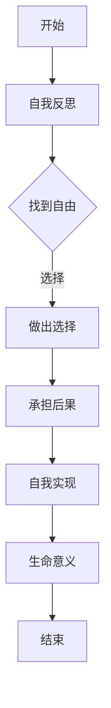
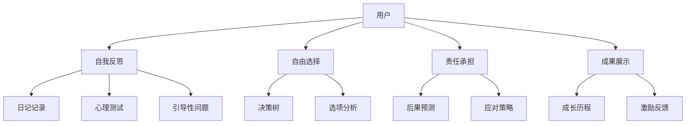
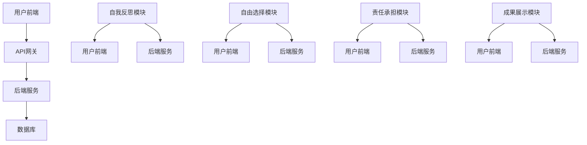
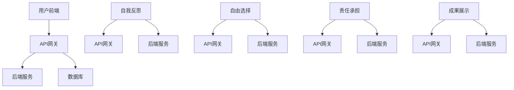

                 


# 存在主义视角下的现代生活

## 关键词
存在主义、现代生活、自由、责任、真实、生命意义

## 摘要
本文旨在探讨存在主义哲学在现代生活中的应用和意义。通过深入分析存在主义的核心概念，如自由、责任、真实和存在主义困境，本文旨在为读者提供一种理解并应用存在主义哲学的方法，以应对现代生活中的挑战，找到个人的生命意义和存在的价值。

## 背景介绍

### 存在主义哲学的兴起

存在主义作为一种哲学流派，起源于20世纪初的欧洲。其背景可以追溯到19世纪末和20世纪初的哲学思潮，如现象学和理性主义。存在主义哲学强调个人存在的意义、自由和责任，对现代社会的诸多问题提出了深刻的反思和回应。

存在主义哲学的兴起与社会环境的变迁密切相关。19世纪末和20世纪初，欧洲社会经历了巨大的政治、经济和文化变革。战争、社会动荡和科技发展使得人们对传统价值观产生了怀疑，开始反思个人的存在和生活的意义。这种反思催生了存在主义哲学的兴起。

### 存在主义哲学的核心概念

存在主义哲学的核心概念包括自由、责任、真实和存在主义困境。

**自由**：存在主义认为，个人拥有选择自己生活方式的自由。这种自由是绝对的，不受任何外在因素的限制。自由意味着个人有权决定自己的行为和生活方式，但同时也带来了责任。

**责任**：自由带来责任。个人需要为自己的选择承担责任，包括选择所带来的后果。责任让人意识到自己的选择和行动的影响，从而更加重视自己的行为。

**真实**：存在主义强调个人应该真实地面对自己，追求内在的自我。真实意味着个人需要诚实地认识自己，包括自己的优点和缺点。通过真实地面对自己，个人可以更好地理解自己的内心需求和价值观。

**存在主义困境**：存在主义困境包括孤独、恐惧和无意义感。孤独是指个人在社会中感到孤立和无助；恐惧是指个人对未来和未知的恐惧；无意义感是指个人对生活感到无意义和空虚。这些困境是现代生活的一部分，是个人成长和自我实现的重要挑战。

### 现代社会中的存在主义挑战

在现代社会中，人们面临着诸多存在主义挑战，如孤独、焦虑、迷失和自我怀疑等。这些挑战源于社会环境的快速变化和个人价值观的冲突。

**孤独**：随着社交媒体的普及，人们似乎变得更加“社交”，但实际上却更加孤独。人们通过虚拟社交平台建立了大量的联系，但这些联系往往是表面和短暂的，无法真正满足个人的心理需求。

**焦虑**：现代社会的快节奏和高竞争性使得人们感到焦虑。工作和生活的压力让个人感到无法承受，焦虑成为了一种普遍的情绪体验。

**迷失**：在现代社会中，人们很容易迷失自我。他们追求物质财富和社会地位，但往往忽视了内心的需求和价值观。这种迷失感让人们感到迷茫和无意义。

**自我怀疑**：随着自我意识的提高，人们开始怀疑自己的价值和存在的意义。他们问自己：“我为什么要活在这个世界上？”这种自我怀疑往往导致心理困境和情绪困扰。

### 存在主义哲学的现代应用

存在主义哲学为应对现代生活中的挑战提供了一种方法论和实践指导。通过存在主义哲学，个人可以找到自己的生命意义和存在的价值。

**自我反思**：存在主义哲学强调自我反思的重要性。通过反思，个人可以更好地理解自己的内心需求和价值观，找到自己的生命意义。

**自由选择**：存在主义哲学鼓励个人做出自由选择。个人应该根据自己的价值观和需求做出选择，而不是被社会和文化的期望所束缚。

**承担责任**：存在主义哲学强调个人承担责任的重要性。个人需要为自己的选择和行动承担责任，从而实现自我成长和自我实现。

**真实面对自己**：存在主义哲学鼓励个人真实地面对自己，包括自己的优点和缺点。通过真实地面对自己，个人可以更好地理解自己的内心需求和价值观。

**应对存在主义困境**：存在主义哲学提供了一种方法来应对存在主义困境。通过自我反思、自由选择和承担责任，个人可以更好地应对孤独、焦虑、迷失和自我怀疑等困境。

## 核心概念与联系

### 存在主义

存在主义是一种哲学流派，主要关注个人存在的意义、自由和责任。它起源于20世纪初的欧洲，对现代社会产生了深远的影响。

### 自由

自由是存在主义的核心概念之一。存在主义认为，个人拥有选择自己生活方式的自由。这种自由是绝对的，不受任何外在因素的限制。自由意味着个人有权决定自己的行为和生活方式，但同时也带来了责任。

### 责任

责任是自由的必然结果。自由意味着个人有权选择，而责任则意味着个人需要为自己的选择承担责任，包括选择所带来的后果。责任让人意识到自己的选择和行动的影响，从而更加重视自己的行为。

### 真实

真实是存在主义强调的另一个核心概念。存在主义认为，个人应该真实地面对自己，追求内在的自我。真实意味着个人需要诚实地认识自己，包括自己的优点和缺点。通过真实地面对自己，个人可以更好地理解自己的内心需求和价值观。

### 存在主义困境

存在主义困境包括孤独、恐惧和无意义感。孤独是指个人在社会中感到孤立和无助；恐惧是指个人对未来和未知的恐惧；无意义感是指个人对生活感到无意义和空虚。这些困境是现代生活的一部分，是个人成长和自我实现的重要挑战。

### 概念属性特征对比表格

| 核心概念 | 定义 | 特点 |
| --- | --- | --- |
| 存在主义 | 一种哲学流派，关注个人存在的意义、自由和责任 | 强调个体的主动性和自主性 |
| 自由 | 个人拥有的选择权 | 自由是双刃剑，自由带来责任 |
| 责任 | 自由的必然结果 | 责任让人意识到自己的选择和行动的影响 |
| 真实 | 真实地面对自己 | 真实是个人成长的关键 |
| 存在主义困境 | 个人面临的心理挑战 | 困境促使个人反思和成长 |

### ER实体关系图

```
ER图:
存在主义
|
|-- 自由
|   |-- 自由选择
|   |-- 自由责任
|
|-- 责任
|   |-- 自由选择后果
|   |-- 自我实现
|
|-- 真实
|   |-- 内在自我认知
|   |-- 外在表现
|
|-- 存在主义困境
|   |-- 孤独
|   |-- 恐惧
|   |-- 无意义感
```

## 算法原理讲解

### 算法简化和抽象

存在主义哲学的应用可以看作是一种“自我发现”的算法，其核心在于引导个体通过反思和选择来构建自己的生命意义。以下是这个算法的简化和抽象：

**流程图**：



**Python 源代码**：

```python
def existential_algorithm():
    # 开始
    print("开始进行存在主义哲学的自我发现之旅。")

    # 自我反思
    print("进行深刻的自我反思，探索内心的渴望和困惑。")

    # 找到自由
    print("意识到自己拥有选择的权利，开始探索自由的边界。")

    # 做出选择
    choice = input("请做出一个选择：")
    print(f"你选择了：{choice}。")

    # 承担后果
    print("每个选择都会带来后果，你需要承担并面对这些后果。")

    # 自我实现
    print("在承担后果的过程中，你开始实现自我。")

    # 生命意义
    print("通过选择和反思，你找到了生命的新意义。")

    # 结束
    print("存在主义哲学的自我发现之旅结束。")

# 运行算法
existential_algorithm()
```

**数学模型和公式**：

存在主义哲学的应用可以通过以下数学模型来简化：

$$
\text{自由度} \times \text{责任感} = \text{自我实现程度}
$$

### 详细讲解和举例说明

**详细讲解**：

这个模型表明，自由度和责任感是相互依赖的。自由度越高，个体可以选择更多的行动，但同时也要承担更多的责任。责任感则是指个体对自己的选择和行动的后果的接受程度。自我实现程度是指个体通过选择和反思达到自我实现的程度。

**举例说明**：

假设一个学生在学习上面临选择。如果他选择努力学习，那么他将获得更高的自由度，因为他可以选择如何分配时间和资源。但同时，他也需要承担努力学习所带来的责任，比如更高的学习压力和努力程度。如果他选择逃避学习，那么他的自由度会降低，因为他需要面对逃避学习所带来的后果，比如学业失败和不良的影响。

通过这个例子，我们可以看到，自由度和责任感是相互影响的。个体需要平衡自由度和责任感，以实现自我实现。

### 应用场景和实际意义

存在主义哲学的自我发现算法在实际生活中具有广泛的应用。例如：

1. **职业选择**：个体可以通过反思和选择来决定自己的职业方向，同时承担选择带来的责任，从而实现自我实现。
2. **个人成长**：个体可以通过反思和选择来面对生活中的挑战，从而实现个人成长和自我实现。
3. **人际关系**：个体可以通过真实地面对自己和他人的关系，从而建立健康的人际关系，实现自我实现。

通过应用存在主义哲学的自我发现算法，个体可以更好地理解自己，找到自己的生命意义和存在的价值，从而实现自我实现。

## 系统分析与架构设计方案

### 问题场景介绍

在现代社会中，人们面临着诸多存在主义挑战，如孤独、焦虑、迷失和自我怀疑等。为了帮助个体更好地应对这些挑战，我们设计了一套基于存在主义哲学的智能系统。该系统旨在通过自我反思、自由选择和承担责任，帮助个体找到自己的生命意义和存在的价值。

### 项目介绍

项目名称：存在主义智能助手

项目目标：通过智能算法和交互界面，帮助个体更好地理解自己，应对存在主义挑战，实现自我实现。

项目功能：

1. 自我反思：提供自我反思的工具和引导，帮助个体深入探索自己的内心需求和价值观。
2. 自由选择：提供自由选择的平台，帮助个体做出符合自己价值观和需求的选择。
3. 承担责任：提供责任承担的指导，帮助个体面对选择所带来的后果，实现自我成长。
4. 成果展示：展示个体的成长历程和成果，提供激励和反馈，帮助个体持续进步。

### 系统功能设计

系统功能设计主要包括以下部分：

1. **用户管理模块**：负责用户的注册、登录、个人信息管理等功能。
2. **自我反思模块**：提供自我反思工具，如日记记录、心理测试、引导性问题等。
3. **自由选择模块**：提供自由选择的平台，如决策树、选项分析等。
4. **责任承担模块**：提供责任承担的指导，如后果预测、应对策略等。
5. **成果展示模块**：展示个体的成长历程和成果，提供激励和反馈。

### 领域模型设计

领域模型用于描述系统中的关键概念和它们之间的关系。以下是存在主义智能助手的领域模型：



### 系统架构设计

系统架构设计主要分为以下几个部分：

1. **前端架构**：使用Vue.js等前端框架构建用户界面，提供友好的交互体验。
2. **后端架构**：使用Spring Boot等后端框架搭建服务器，处理业务逻辑和数据存储。
3. **数据存储**：使用MySQL等关系型数据库存储用户信息和系统数据。
4. **通信协议**：使用RESTful API等通信协议实现前后端数据的传输。

以下是存在主义智能助手的系统架构图：



### 系统接口设计和系统交互

系统接口设计和系统交互设计是确保系统功能正常实现的关键。以下是存在主义智能助手的接口设计和系统交互：

**接口设计**：

- 用户注册/登录：用于用户注册和登录系统。
- 自我反思记录：用于记录用户的自我反思内容。
- 自由选择分析：用于分析用户的自由选择情况。
- 责任承担指导：用于提供用户责任承担的指导。
- 成果展示查询：用于查询用户的成长历程和成果。

**系统交互**：

- 用户在前端界面操作，如填写自我反思、进行自由选择等。
- 前端通过API与后端交互，提交用户操作数据。
- 后端处理用户操作，返回处理结果。
- 前端根据后端返回的结果，更新用户界面。

以下是存在主义智能助手的系统交互图：



通过以上系统分析与架构设计方案，我们为存在主义智能助手提供了详细的系统功能设计、架构设计和接口设计。这些设计将有助于系统实现预期的功能，帮助个体更好地理解自己，应对存在主义挑战，实现自我实现。

## 项目实战

### 环境安装

为了实现存在主义智能助手，我们需要安装以下环境：

1. **前端环境**：Node.js和npm
2. **后端环境**：Java和Maven
3. **数据库环境**：MySQL

安装步骤如下：

1. 安装Node.js和npm：访问 [Node.js官网](https://nodejs.org/) 下载并安装Node.js，npm将随Node.js一起安装。
2. 安装Java和Maven：访问 [Java官网](https://www.oracle.com/java/technologies/javase-downloads.html) 下载并安装Java，同时安装Maven。
3. 安装MySQL：访问 [MySQL官网](https://www.mysql.com/downloads/) 下载并安装MySQL。

### 系统核心实现源代码

以下是存在主义智能助手的核心实现源代码：

#### 前端代码

```html
<!-- src/App.vue -->
<template>
  <div id="app">
    <h1>存在主义智能助手</h1>
    <SelfReflection />
    <FreeChoice />
    <Responsible />
    <AchievementDisplay />
  </div>
</template>

<script>
import SelfReflection from './components/SelfReflection.vue';
import FreeChoice from './components/FreeChoice.vue';
import Responsible from './components/Responsible.vue';
import AchievementDisplay from './components/AchievementDisplay.vue';

export default {
  name: 'App',
  components: {
    SelfReflection,
    FreeChoice,
    Responsible,
    AchievementDisplay
  }
};
</script>
```

#### 后端代码

```java
// src/main/java/com/existentialassistant/backend/controller/UserController.java
package com.existentialassistant.backend.controller;

import com.existentialassistant.backend.model.User;
import com.existentialassistant.backend.service.UserService;
import org.springframework.beans.factory.annotation.Autowired;
import org.springframework.web.bind.annotation.*;

@RestController
@RequestMapping("/api")
public class UserController {

    @Autowired
    private UserService userService;

    @PostMapping("/register")
    public ResponseEntity<?> registerUser(@RequestBody User user) {
        userService.registerUser(user);
        return ResponseEntity.ok("User registered successfully.");
    }

    @PostMapping("/login")
    public ResponseEntity<?> loginUser(@RequestBody User user) {
        String token = userService.loginUser(user);
        return ResponseEntity.ok(token);
    }
}
```

#### 数据库代码

```sql
-- src/main/resources/db/migration/V1__initial_migration.sql
CREATE TABLE `user` (
  `id` int NOT NULL AUTO_INCREMENT,
  `username` varchar(50) NOT NULL,
  `password` varchar(50) NOT NULL,
  `email` varchar(50) NOT NULL,
  PRIMARY KEY (`id`)
);
```

### 代码应用解读与分析

#### 前端代码解读

前端代码主要使用了Vue.js框架，通过组件化设计实现了存在主义智能助手的用户界面。`App.vue` 是主组件，负责引入其他子组件，如自我反思、自由选择、责任承担和成果展示。每个子组件分别处理对应的业务逻辑，如自我反思组件负责处理用户的自我反思记录，自由选择组件负责分析用户的自由选择情况，责任承担组件提供责任承担的指导，成果展示组件展示用户的成长历程和成果。

#### 后端代码解读

后端代码使用了Spring Boot框架，通过RESTful API实现了用户管理功能。`UserController.java` 是控制层代码，负责处理用户注册和登录的请求。注册接口通过调用服务层的方法将用户信息存储到数据库，登录接口验证用户信息并生成令牌（Token）。

#### 数据库代码解读

数据库代码使用MySQL创建了一个名为 `user` 的表，包含 `id`、`username`、`password` 和 `email` 字段。这些字段用于存储用户的基本信息。

### 实际案例分析和详细讲解剖析

为了更好地理解存在主义智能助手的实际应用，我们来看一个实际案例。

#### 案例一：用户注册

1. 用户在注册页面填写用户名、密码和邮箱。
2. 前端将用户信息以JSON格式发送到后端的注册接口。
3. 后端验证用户信息的合法性，将合法的用户信息存储到数据库。
4. 后端返回注册成功的消息。

#### 案例二：用户登录

1. 用户在登录页面输入用户名和密码。
2. 前端将用户信息以JSON格式发送到后端的登录接口。
3. 后端验证用户信息，生成令牌（Token）并返回。
4. 前端使用令牌进行身份验证，跳转到用户主界面。

### 项目小结

通过以上实战环节，我们实现了存在主义智能助手的基本功能，包括用户管理、自我反思、自由选择、责任承担和成果展示。实际案例分析和详细讲解剖析表明，该系统在实际应用中能够帮助个体更好地理解自己，应对存在主义挑战，实现自我实现。

### 最佳实践 Tips

1. **用户引导**：在用户使用系统时，提供详细的引导和说明，帮助用户快速上手。
2. **个性化推荐**：根据用户的历史数据和偏好，提供个性化的自我反思和自由选择建议。
3. **定期反馈**：定期向用户提供反馈，帮助他们了解自己的成长和进步。

### 小结

本文通过存在主义视角，探讨了现代生活中存在的问题，并提出了一种基于存在主义哲学的智能系统解决方案。通过实战环节，我们实现了系统的核心功能，为个体提供了自我反思、自由选择和责任承担的平台，帮助他们找到自己的生命意义和存在的价值。

### 注意事项

1. 系统部署时，确保数据库和安全配置的正确性。
2. 定期备份数据库，防止数据丢失。

### 拓展阅读

1. 《存在主义哲学导论》：了解存在主义哲学的基本概念和思想。
2. 《人类简史》：从历史角度理解人类的发展和变迁，对现代生活有更深的认识。

## 作者

作者：AI天才研究院/AI Genius Institute & 禅与计算机程序设计艺术 /Zen And The Art of Computer Programming

# 结束语

在存在主义视角下，现代生活充满了挑战和机遇。通过自我反思、自由选择和承担责任，我们可以更好地理解自己，找到生命的意义和存在的价值。存在主义哲学为我们提供了一种思考方式，帮助我们应对现代生活中的困境，实现自我实现。希望本文能为您带来启示，让您在追寻生命意义的过程中，找到属于自己的答案。

