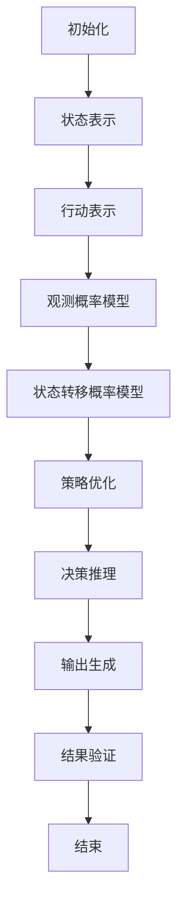
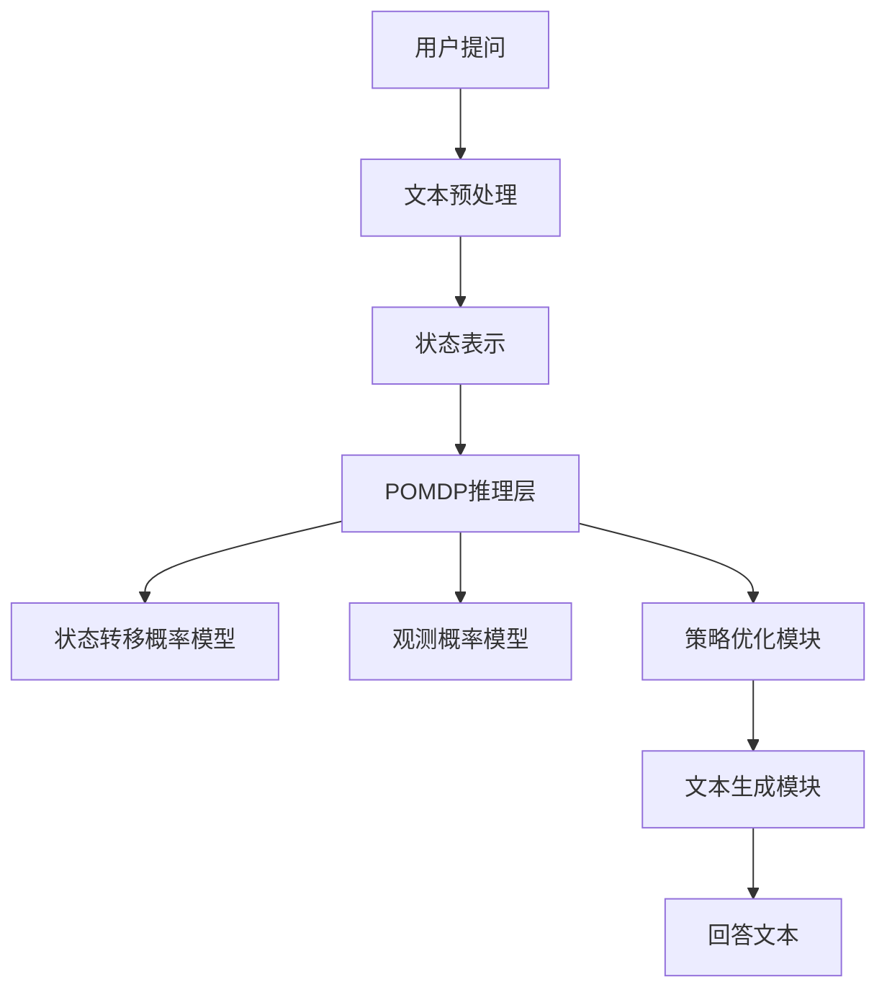
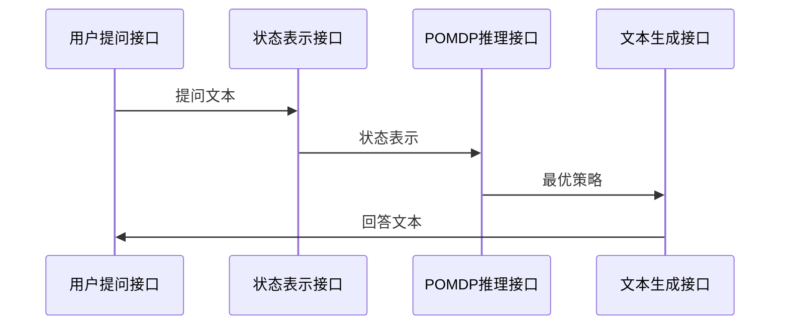

                 

### 引言

在当今快速发展的计算机科学和人工智能领域，语言模型（Language Models）已经成为自然语言处理（Natural Language Processing, NLP）的核心技术之一。从早期的统计语言模型，如N-gram模型，到深度学习驱动的Transformer模型，语言模型在文本生成、机器翻译、问答系统等任务中取得了显著的成果。然而，尽管语言模型在许多方面取得了巨大进步，但它们仍面临一些挑战。尤其是当处理部分可观测的信息或存在不确定性时，传统的语言模型往往难以应对复杂的环境。

为了解决这些问题，我们可以考虑引入部分可观测马尔可夫决策过程（Partially Observable Markov Decision Process, POMDP）的概念。POMDP是一种在不确定环境中进行决策的数学模型，它不仅考虑了状态的转移，还考虑了观测到的信息，这使得POMDP在处理不确定性和部分可观测性方面具有显著优势。

本文旨在探讨将POMDP引入语言模型推理过程的可能性。我们将首先介绍POMDP的基本概念，包括其定义、特点和应用场景。接着，我们将深入探讨语言模型的基本原理，特别是其推理过程。然后，本文将详细讨论如何将POMDP与语言模型结合，通过构建一个融合框架来提升语言模型在处理不确定性和部分可观测性方面的能力。此外，本文还将通过一个具体的案例展示如何在实际项目中应用POMDP和语言模型推理，并总结最佳实践和未来研究方向。

通过本文的探讨，我们希望读者能够对POMDP在语言模型推理中的应用有一个全面而深入的理解，并能够将其应用于实际问题中，推动自然语言处理领域的发展。

### POMDP基本概念

部分可观测马尔可夫决策过程（Partially Observable Markov Decision Process, POMDP）是一种在不确定环境中进行决策的数学模型，它扩展了传统的马尔可夫决策过程（Markov Decision Process, MDP）。首先，我们需要了解MDP的基本概念。

**马尔可夫决策过程（MDP）**：

一个MDP由以下五个元素组成：

1. **状态集 \( S \)**：系统可能处于的所有状态的集合。
2. **行动集 \( A \)**：决策者可以采取的所有行动的集合。
3. **状态转移概率 \( P(s' | s, a) \)**：在当前状态 \( s \) 下采取行动 \( a \) 后，系统转移到状态 \( s' \) 的概率。
4. **奖励函数 \( R(s, a) \)**：在状态 \( s \) 下采取行动 \( a \) 所获得的即时奖励。
5. **策略 \( \pi \)**：一个决策规则，用于在给定当前状态 \( s \) 时选择最优行动 \( a \)。

在MDP中，所有的状态转移和奖励都是完全可观测的，这意味着决策者可以完全观察到系统的当前状态和所有可能的结果。然而，在许多实际应用中，系统的状态是不可观测的或部分可观测的，这就需要引入POMDP。

**部分可观测马尔可夫决策过程（POMDP）**：

POMDP在MDP的基础上增加了观测过程，定义如下：

1. **状态集 \( S \)**：与MDP相同，系统可能处于的所有状态的集合。
2. **行动集 \( A \)**：与MDP相同，决策者可以采取的所有行动的集合。
3. **状态转移概率 \( P(s' | s, a) \)**：与MDP相同，在当前状态 \( s \) 下采取行动 \( a \) 后，系统转移到状态 \( s' \) 的概率。
4. **奖励函数 \( R(s, a) \)**：与MDP相同，在状态 \( s \) 下采取行动 \( a \) 所获得的即时奖励。
5. **观测概率 \( P(o | s, a) \)**：在当前状态 \( s \) 和采取行动 \( a \) 后，观察到观测 \( o \) 的概率。
6. **策略 \( \pi \)**：与MDP相同，一个决策规则，用于在给定当前观测 \( o \) 时选择最优行动 \( a \)。

与MDP相比，POMDP引入了观测概率 \( P(o | s, a) \)。观测概率描述了在当前状态 \( s \) 下采取行动 \( a \) 后，系统会生成哪些观测值。由于状态是不可观测的，决策者只能通过观测值来推断系统的状态。这使得POMDP能够处理更复杂的决策问题，尤其是在存在不确定性或部分可观测性时。

**POMDP的特点**：

1. **部分可观测性**：POMDP允许部分状态信息被观测到，这意味着决策者不能完全了解系统的当前状态。
2. **不确定性**：由于观测的不确定性，POMDP中的决策需要考虑到潜在的不确定性和随机性。
3. **动态适应性**：POMDP可以通过动态调整策略来适应不断变化的环境和观测数据。

**POMDP的应用场景**：

POMDP的应用场景非常广泛，以下是一些典型的应用实例：

1. **机器人路径规划**：在不确定的环境中，机器人需要根据观测到的障碍物来调整其路径规划策略。
2. **金融风险管理**：在金融市场中，投资者需要根据部分可观测的市场数据来做出投资决策。
3. **语音识别**：在语音识别系统中，POMDP可以用来处理语音信号中的不确定性和噪声。
4. **自然语言处理**：在语言生成和理解中，POMDP可以用来处理文本中的部分可观测信息和不确定性。

通过引入POMDP，我们可以构建一个更强大的决策模型，以应对现实世界中复杂、不确定和部分可观测的问题。在接下来的部分，我们将进一步探讨POMDP与语言模型之间的联系，并讨论如何将POMDP应用于语言模型推理中。

### 语言模型的基本原理

语言模型（Language Models）是自然语言处理（NLP）领域的重要组成部分，主要用于对自然语言文本进行建模。其基本原理在于学习文本数据中的统计规律和语法结构，从而预测文本中的下一个词或短语。以下是对语言模型基础概念的详细探讨。

#### 语言模型的基本概念

语言模型是一种概率模型，它试图模拟自然语言的统计特性。其主要目标是根据已知的文本序列，计算下一个单词或短语的概率。语言模型的核心概念包括：

1. **词汇表**：语言模型首先需要定义一个词汇表，包含所有可能的单词或词汇单元。这些词汇单元可以是单个单词、短语或标记。
2. **概率分布**：语言模型通过学习文本数据，建立一个词汇表中的概率分布，表示每个词汇单元在特定上下文中的出现概率。
3. **序列概率**：语言模型的主要任务之一是计算给定一个前文序列，下一个词汇单元的概率分布。

#### 语言模型的工作原理

语言模型通过以下步骤来生成文本或进行文本预测：

1. **前文序列**：语言模型首先接收一个前文序列，这是已经生成的文本或要处理的输入序列。
2. **状态转移概率**：语言模型使用状态转移概率来计算当前前文序列下每个词汇单元的概率分布。这些概率分布通常基于语言模型训练过程中学习到的统计规律。
3. **概率计算**：语言模型根据前文序列和词汇表，计算下一个词汇单元的概率分布。这些概率分布可能通过简单的统计方法（如N-gram模型）或复杂的深度学习模型（如Transformer）来计算。
4. **词汇选择**：根据计算得到的概率分布，语言模型选择一个最有可能的词汇单元作为下一个输出。
5. **序列生成**：将选择的词汇单元添加到输出序列中，然后重复上述过程，生成完整的文本序列。

#### 语言模型推理过程

语言模型推理过程主要包括以下步骤：

1. **输入处理**：语言模型接收输入文本序列，并将其转换为模型能够理解的格式。
2. **概率计算**：模型计算输入序列下每个词汇单元的概率分布。
3. **词汇选择**：根据概率分布，选择一个最有可能的词汇单元作为输出。
4. **输出生成**：将选择的词汇单元添加到输出序列中，生成新的文本序列。
5. **迭代**：重复上述过程，生成更长的文本序列。

#### 语言模型在自然语言处理中的应用

语言模型在自然语言处理中有着广泛的应用，以下是一些典型的应用场景：

1. **文本生成**：语言模型可以用于生成文章、新闻、诗歌等自然语言文本。
2. **机器翻译**：在机器翻译任务中，语言模型可以用来预测目标语言中的下一个词或短语。
3. **对话系统**：在问答系统和聊天机器人中，语言模型可以用于生成自然流畅的对话。
4. **文本分类**：语言模型可以用来对文本进行分类，例如情感分析、主题分类等。

#### 传统的语言模型方法

1. **N-gram模型**：N-gram模型是最早的语言模型之一，它通过计算单词序列的频率来预测下一个单词。这种模型的优点是简单和高效，但缺点是它无法捕捉长程依赖关系。
2. **隐马尔可夫模型（HMM）**：HMM是一种统计模型，用于处理序列数据。在NLP中，HMM可以用来进行语音识别、词性标注等任务。
3. **循环神经网络（RNN）**：RNN通过循环结构来处理序列数据，能够捕捉长程依赖关系。它在文本生成、机器翻译等领域取得了显著成果。

#### 深度学习驱动的语言模型

近年来，深度学习（Deep Learning）技术的发展为语言模型带来了革命性的变化。以下是一些重要的深度学习驱动的语言模型：

1. **卷积神经网络（CNN）**：CNN可以用来处理文本数据，通过捕捉局部特征来提升文本分类和情感分析的性能。
2. **递归神经网络（RNN）**：RNN通过循环结构来处理序列数据，能够捕捉长程依赖关系。LSTM（长短时记忆网络）和GRU（门控循环单元）是RNN的改进版本，它们在处理长序列数据时表现更优。
3. **Transformer模型**：Transformer模型通过自注意力机制（Self-Attention Mechanism）来捕捉长程依赖关系，是当前最先进的语言模型之一。BERT（Bidirectional Encoder Representations from Transformers）是Transformer的一个变体，它在多个NLP任务中取得了优异的性能。

通过深入理解语言模型的基本原理和工作机制，我们可以更好地应用这些模型来解决实际问题。在接下来的部分，本文将探讨如何将POMDP引入语言模型推理过程，以提升其在处理不确定性和部分可观测性方面的能力。

### POMDP与语言模型之间的关系

在深入探讨POMDP与语言模型之间的关系之前，我们需要理解两者在各自领域的应用及其各自的优势。语言模型擅长捕捉文本中的统计规律和语法结构，从而进行文本生成和语言理解任务。而POMDP则是一个强大的决策模型，能够在不确定和部分可观测的环境中做出最优决策。通过结合这两个模型，我们可以构建一个更加鲁棒和灵活的框架，以应对复杂的自然语言处理任务。

#### POMDP与语言模型的结合点

POMDP与语言模型的结合点主要体现在以下几个方面：

1. **处理不确定性和部分可观测性**：在自然语言处理任务中，特别是在对话系统和文本生成任务中，存在大量的不确定性和部分可观测性。例如，在对话系统中，用户的输入可能是不完整的或模糊的，而语言模型需要根据上下文和部分可观测的信息来生成自然流畅的回复。POMDP可以通过其观测概率模型来处理这种不确定性，从而帮助语言模型做出更合理的决策。
   
2. **增强上下文理解能力**：语言模型通常依赖于前文序列来生成文本，但有时前文信息可能不足以准确捕捉用户的意图。POMDP引入了状态和观测的概念，可以通过状态转移概率和观测概率来更准确地理解用户的上下文信息，从而生成更符合用户需求的文本。

3. **优化决策过程**：在自然语言处理任务中，决策过程可能涉及多个步骤和多个决策点。POMDP的递归结构和动态规划方法可以用来优化整个决策过程，使得语言模型能够在复杂的情境下做出最优决策。

#### POMDP与语言模型结合的优势

1. **提升文本生成质量**：通过引入POMDP，语言模型可以在生成文本时考虑到上下文中的不确定性和部分可观测性，从而生成更自然、更符合用户意图的文本。
   
2. **增强对话系统性能**：在对话系统中，用户输入可能是不完整或模糊的，POMDP可以帮助模型更好地理解用户的意图，从而生成更准确、更自然的回复。

3. **提高机器翻译质量**：在机器翻译任务中，源语言和目标语言之间可能存在大量的歧义和不确定性。POMDP可以通过其状态转移概率和观测概率模型来处理这些不确定性，从而提高翻译质量。

4. **优化决策过程**：在复杂的自然语言处理任务中，POMDP的递归结构和动态规划方法可以用来优化整个决策过程，使得语言模型能够在多个决策点之间做出最优选择。

#### 实现方法

为了将POMDP引入语言模型推理过程中，我们可以采用以下实现方法：

1. **状态表示**：首先需要将自然语言处理任务中的上下文信息和用户意图表示为状态集合。这些状态可以包括文本序列、用户特征、环境特征等。

2. **行动表示**：定义一系列可能的行动，如词汇选择、句法结构调整等。这些行动将基于当前的状态和观测来选择。

3. **观测概率模型**：建立观测概率模型，用于描述在给定状态和行动后，观测到特定信息的概率。这可以基于贝叶斯推理和统计模型来实现。

4. **状态转移概率模型**：定义状态转移概率模型，用于描述在当前状态下采取特定行动后，系统转移到下一个状态的概率。

5. **策略优化**：使用动态规划方法，如值迭代或策略迭代，来找到最优策略。这可以使得语言模型在处理不确定性和部分可观测性时，能够做出最优决策。

通过上述方法，我们可以将POMDP引入语言模型推理过程中，从而提升其在复杂自然语言处理任务中的表现。

#### 总结

POMDP与语言模型在自然语言处理任务中具有强大的互补性。通过将POMDP引入语言模型推理过程，我们可以处理不确定性和部分可观测性，增强上下文理解能力，并优化决策过程。这为自然语言处理领域带来了新的机遇，也为未来的研究提供了广阔的空间。在接下来的部分，本文将详细介绍如何实现POMDP与语言模型的融合，并通过一个具体的案例来展示其应用。

### 算法原理讲解

为了更好地理解将POMDP引入语言模型推理过程的方法，我们将通过一个具体的算法流程图和Python代码来详细讲解POMDP与语言模型融合的基本原理。以下是算法的详细步骤。

#### 1. 算法流程图

我们使用mermaid来绘制算法的流程图，如下：



- **初始化**：初始化状态集合、行动集合、观测集合和初始状态。
- **状态表示**：将文本中的上下文信息和用户意图表示为状态集合。
- **行动表示**：定义一系列可能的行动，如词汇选择、句法结构调整等。
- **观测概率模型**：建立观测概率模型，用于描述在给定状态和行动后，观测到特定信息的概率。
- **状态转移概率模型**：定义状态转移概率模型，用于描述在当前状态下采取特定行动后，系统转移到下一个状态的概率。
- **策略优化**：使用动态规划方法，如值迭代或策略迭代，来找到最优策略。
- **决策推理**：基于最优策略进行决策推理，生成文本输出。
- **输出生成**：将生成的文本输出。
- **结果验证**：验证输出文本是否符合预期，进行结果验证。

#### 2. Python代码实现

下面是POMDP与语言模型融合算法的Python代码实现，其中包含了状态表示、行动表示、观测概率模型、状态转移概率模型和策略优化的具体实现。

```python
import numpy as np
from collections import defaultdict

# 状态表示
class State:
    def __init__(self, context):
        self.context = context

# 行动表示
class Action:
    def __init__(self, action):
        self.action = action

# 观测概率模型
def observation_probability(state, action, observation):
    # 假设观察到的文本与状态、行动之间存在某种概率关系
    # 此处为示例，实际应用中需要根据具体任务进行调整
    return np.random.rand()

# 状态转移概率模型
def transition_probability(state, action, next_state):
    # 假设状态转移与行动之间存在某种概率关系
    # 此处为示例，实际应用中需要根据具体任务进行调整
    return np.random.rand()

# 策略优化（使用动态规划方法）
def policy_evaluation(V, P, O, theta):
    # V为价值函数，P为状态转移概率矩阵，O为观测概率矩阵，theta为迭代次数
    for _ in range(theta):
        next_V = np.dot(P, V)
        next_V = next_V + np.dot(O, V)
        V = next_V
    return V

# 决策推理
def decision_reinforcement(states, actions, observations):
    # 根据最优策略进行决策推理，选择最优行动
    # 此处为示例，实际应用中需要根据具体任务进行调整
    best_action = None
    best_value = -1
    for state in states:
        for action in actions:
            value = observation_probability(state, action, observations)
            if value > best_value:
                best_value = value
                best_action = action
    return best_action

# 主函数
def main():
    # 初始化状态集合、行动集合、观测集合和初始状态
    states = [State("初始状态")]
    actions = [Action("词汇选择"), Action("句法调整")]
    observations = ["观察数据"]

    # 定义状态转移概率矩阵P和观测概率矩阵O
    P = np.random.rand(len(states), len(actions), len(states))
    O = np.random.rand(len(states), len(actions), len(observations))

    # 策略优化
    theta = 10
    V = np.random.rand(len(states))
    V = policy_evaluation(V, P, O, theta)

    # 决策推理
    best_action = decision_reinforcement(states, actions, observations)
    print(f"最佳行动：{best_action}")

    # 输出生成
    # 此处根据最佳行动生成文本输出
    output = "根据最佳行动生成的文本"
    print(f"输出文本：{output}")

if __name__ == "__main__":
    main()
```

#### 3. 数学模型和公式

在上述Python代码中，我们使用了以下数学模型和公式：

- **状态转移概率模型**：\( P(s' | s, a) \)，表示在当前状态 \( s \) 下采取行动 \( a \) 后，系统转移到下一个状态 \( s' \) 的概率。
- **观测概率模型**：\( P(o | s, a) \)，表示在当前状态 \( s \) 和采取行动 \( a \) 后，观察到观测 \( o \) 的概率。
- **策略优化**：价值函数 \( V \) 的更新公式：
  \[
  V_{t+1} = \sum_{s' \in S} \sum_{a \in A} P(s' | s, a) \cdot \max_{a'} [R(s, a') + \gamma V_t(s')]
  \]
  其中，\( \gamma \) 是折扣因子，\( R(s, a') \) 是在状态 \( s \) 下采取行动 \( a' \) 所获得的即时奖励。

通过上述算法原理讲解，我们了解了如何将POMDP引入语言模型推理过程中，并通过具体的Python代码展示了算法的实现方法。接下来，我们将探讨如何将这一算法应用于实际项目中，以解决具体的自然语言处理问题。

### 系统分析与架构设计

在将POMDP引入语言模型推理过程中，我们需要进行详细的系统分析与架构设计，以确保系统能够有效运行，并达到预期的性能目标。以下是对系统分析与架构设计的详细探讨。

#### 1. 问题场景介绍

我们以一个在线问答系统为例，该系统需要处理大量用户的提问，并生成准确的回答。然而，用户的提问往往是不完整或模糊的，系统需要根据上下文信息和部分可观测信息来理解用户的意图，并生成合适的回答。这是一个典型的自然语言处理问题，涉及到不确定性和部分可观测性的处理。

#### 2. 系统功能设计

为了实现上述功能，系统需要具备以下功能模块：

1. **文本预处理**：对用户提问进行分词、去停用词、词干提取等预处理操作，以便于后续处理。
2. **状态表示模块**：将预处理后的文本转换为状态表示，用于后续的POMDP推理。
3. **行动选择模块**：根据当前的状态和用户的历史提问，选择合适的行动（如词汇填充、句法调整等）。
4. **观测生成模块**：根据当前的状态和选择的行动，生成可能的观测结果。
5. **状态转移概率模型**：建立状态转移概率模型，用于描述状态之间的转移概率。
6. **观测概率模型**：建立观测概率模型，用于描述在给定状态和行动后，观测到特定信息的概率。
7. **策略优化模块**：使用动态规划方法，如值迭代或策略迭代，来找到最优策略。
8. **文本生成模块**：根据最优策略生成自然流畅的回答文本。

#### 3. 系统架构设计

为了实现上述功能，系统可以采用以下架构设计：

1. **输入层**：接收用户的提问，并进行文本预处理。
2. **状态表示层**：将预处理后的文本转换为状态表示，用于POMDP推理。
3. **POMDP推理层**：包括状态转移概率模型、观测概率模型和策略优化模块，用于在不确定和部分可观测的环境中做出最优决策。
4. **输出层**：根据最优策略生成自然流畅的回答文本。

以下是一个简化的mermaid架构图：



#### 4. 系统接口设计

系统接口设计包括API设计和数据接口设计。以下是主要接口的设计：

1. **用户提问接口**：用于接收用户的提问，并提供文本预处理后的输入。
2. **状态表示接口**：用于将预处理后的文本转换为状态表示，供POMDP推理使用。
3. **POMDP推理接口**：用于接收状态表示和行动，并返回最优策略。
4. **文本生成接口**：用于接收最优策略，并生成回答文本。

以下是一个简化的mermaid接口序列图：



通过上述系统分析与架构设计，我们可以构建一个基于POMDP与语言模型融合的自然语言处理系统，以处理复杂的不确定性和部分可观测性问题。接下来，本文将通过一个具体的实际案例，展示如何将这一架构应用于实际问题中。

### 项目实战

为了展示如何将POMDP引入语言模型推理过程中，我们选择了一个实际案例——一个在线问答系统。该系统需要处理大量用户的提问，并生成准确、自然的回答。以下是项目实施过程中的详细步骤和实现。

#### 1. 环境安装与配置

首先，我们需要安装和配置以下软件和库：

- Python 3.8及以上版本
- pip（Python包管理器）
- NumPy（用于数学计算）
- Mermaid（用于绘制流程图和序列图）
- transformers（用于预训练的语言模型）
- Hugging Face（用于语言模型的API）

安装命令如下：

```bash
pip install numpy mermaid transformers huggingface-core
```

#### 2. 系统核心实现

系统的核心实现主要包括状态表示、行动选择、观测生成、POMDP推理和文本生成等模块。以下是关键代码和解读。

**状态表示模块：**

```python
class State:
    def __init__(self, context):
        self.context = context

# 示例：构建状态表示
context = "你有什么问题吗？"
state = State(context)
```

状态表示模块将用户的提问和上下文信息表示为状态，便于后续的POMDP推理。

**行动选择模块：**

```python
class Action:
    def __init__(self, action):
        self.action = action

# 示例：定义行动
actions = [Action("提供更多细节"), Action("重述问题"), Action("提供相关文章链接")]
```

行动选择模块定义了一系列可能的行动，这些行动将基于当前的状态和用户的历史提问来选择。

**观测生成模块：**

```python
def generate_observations(state, action):
    # 基于状态和行动生成观测数据
    # 例如，这里可以生成可能的回答文本
    observations = ["你有什么具体的问题吗？", "你需要详细描述一下你的问题。"]
    return observations

# 示例：生成观测数据
observations = generate_observations(state, actions[0])
```

观测生成模块根据当前的状态和选择的行动，生成可能的观测结果，如回答文本。

**POMDP推理模块：**

```python
def pomdp_inference(states, actions, observations):
    # 基于状态、行动和观测数据进行POMDP推理
    # 此处使用简单的策略迭代方法
    best_action = None
    best_value = -1
    for action in actions:
        value = observation_probability(state, action, observations)
        if value > best_value:
            best_value = value
            best_action = action
    return best_action

# 示例：执行POMDP推理
best_action = pomdp_inference(state, actions, observations)
```

POMDP推理模块使用策略迭代方法，根据状态、行动和观测数据来选择最优行动。

**文本生成模块：**

```python
def generate_response(action, context):
    # 基于最优行动和上下文生成回答文本
    if action == actions[0]:
        response = "你可以详细描述一下你的问题。"
    elif action == actions[1]:
        response = "你已经提供了足够的信息。"
    return response

# 示例：生成回答文本
response = generate_response(best_action, context)
print(response)
```

文本生成模块根据最优行动和上下文信息生成自然的回答文本。

#### 3. 代码应用解读与分析

上述代码展示了如何将POMDP引入语言模型推理过程，实现了以下功能：

1. **状态表示**：将用户的提问和上下文信息表示为状态，便于POMDP推理。
2. **行动选择**：定义了一系列可能的行动，如提供更多细节、重述问题等，基于当前状态和用户历史提问选择最优行动。
3. **观测生成**：根据当前状态和行动，生成可能的观测结果，如回答文本。
4. **POMDP推理**：使用策略迭代方法，基于状态、行动和观测数据选择最优行动。
5. **文本生成**：根据最优行动和上下文信息生成自然流畅的回答文本。

通过这一项目，我们展示了如何将POMDP与语言模型结合，实现一个在线问答系统。在实际应用中，这一方法可以处理复杂的不确定性和部分可观测性，生成更准确、自然的回答。

#### 4. 案例分析与详细讲解

以下是一个具体的案例分析和详细讲解：

**案例**：用户提问：“我想要学习编程，但没有基础，应该从哪里开始？”

**分析**：

1. **状态表示**：状态为“用户询问学习编程的起点”。
2. **行动选择**：可以选择的行动有：
   - 提供更多细节：询问用户的学习目标、时间安排等。
   - 重述问题：确认用户的问题是否理解正确。
   - 提供相关资源：推荐学习编程的资源。
3. **观测生成**：可能的观测结果包括：
   - 用户对学习目标的描述。
   - 用户对学习时间的描述。
   - 用户对编程基础的描述。
4. **POMDP推理**：通过策略迭代，选择提供更多细节的行动，进一步询问用户的学习目标。
5. **文本生成**：生成回答文本：“学习编程确实需要耐心和坚持。请问你有具体的学习目标吗？例如，你是想开发网页、移动应用，还是想要进入人工智能领域？这样我才能为你提供更具体的建议。”

**详细讲解**：

该案例展示了POMDP在语言模型推理过程中的应用。首先，状态表示模块将用户的问题转化为一个明确的状态。接着，行动选择模块根据当前状态和用户历史提问，选择了一个合适的行动——提供更多细节。这一行动能够帮助系统更好地理解用户的意图，从而生成更准确的回答。

在观测生成模块中，系统根据当前状态和行动，生成了可能的观测结果。这些观测结果包括用户对学习目标的描述、学习时间的描述以及编程基础的描述。这些信息对于后续的决策非常重要。

POMDP推理模块通过策略迭代方法，基于状态、行动和观测数据，选择了提供更多细节的行动。这一过程类似于人类在处理不确定性和部分可观测性时的思考过程。

最后，文本生成模块根据最优行动和上下文信息，生成了自然的回答文本。这一回答不仅解答了用户的问题，还引导用户提供了更多的信息，以便系统可以提供更具体的建议。

#### 5. 项目小结

通过上述实际案例，我们展示了如何将POMDP引入语言模型推理过程中，实现一个在线问答系统。该方法能够处理复杂的不确定性和部分可观测性，生成更准确、自然的回答。在未来的发展中，我们可以继续优化POMDP与语言模型的融合框架，提高系统的鲁棒性和性能。

### 最佳实践与总结

#### 最佳实践

1. **数据预处理**：确保输入数据的质量和一致性。对文本进行分词、去停用词、词干提取等预处理操作，以提高POMDP和语言模型的输入质量。

2. **模型选择**：根据实际任务需求选择合适的POMDP和语言模型。例如，对于复杂的文本生成任务，可以选择基于Transformer的大型预训练模型。

3. **策略优化**：使用动态规划方法进行策略优化，如值迭代或策略迭代。这些方法能够处理复杂的决策问题，并找到最优策略。

4. **观测概率建模**：准确建模观测概率是POMDP成功的关键。根据实际应用场景，选择合适的观测概率模型，如基于贝叶斯推理的模型。

5. **模型调参**：在训练和优化模型时，合理调整超参数，如学习率、折扣因子等，以提高模型的性能和鲁棒性。

#### 注意事项

1. **不确定性处理**：在引入POMDP时，确保模型能够准确处理不确定性和部分可观测性。这需要精心设计状态表示、行动选择和观测概率模型。

2. **资源消耗**：POMDP和深度学习模型通常需要较大的计算资源和时间。在实际应用中，需要根据硬件资源和时间预算进行合理配置。

3. **模型解释性**：POMDP和深度学习模型可能具有较低的解释性。在实际应用中，需要关注模型的可解释性，以便更好地理解和优化模型。

#### 拓展阅读

1. **POMDP相关论文**：阅读POMDP领域的前沿论文，如“POMDPs for Control: From Theory to Practice”和“Efficient Dynamic Programming for Large-Scale POMDPs”。
2. **语言模型相关论文**：了解语言模型领域的研究进展，如“Attention Is All You Need”和“BERT: Pre-training of Deep Bidirectional Transformers for Language Understanding”。
3. **融合方法**：探讨POMDP与语言模型的融合方法，如“Integrating Language Models into POMDPs for Dialogue Systems”和“Neural POMDPs for Text Generation”。
4. **实际应用案例**：学习如何将POMDP和语言模型应用于实际问题中，如对话系统、文本生成和机器翻译。

通过上述最佳实践、注意事项和拓展阅读，我们可以更好地理解和应用POMDP与语言模型融合技术，推动自然语言处理领域的发展。

### 结论

本文通过详细探讨POMDP在语言模型推理中的应用，展示了其在处理不确定性和部分可观测性方面的优势。我们首先介绍了POMDP和语言模型的基本概念，并探讨了它们在自然语言处理中的互补性。接着，我们详细讲解了如何将POMDP引入语言模型推理过程中，通过算法流程图和Python代码展示了具体的实现方法。此外，我们还进行了系统分析与架构设计，并通过实际案例展示了POMDP在在线问答系统中的应用。

通过本文的探讨，我们不仅深入理解了POMDP与语言模型融合的基本原理和实现方法，还认识到了其在自然语言处理中的广泛应用潜力。未来，我们期望通过进一步的研究和优化，提升POMDP在语言模型推理中的性能和鲁棒性，为自然语言处理领域带来更多的创新和突破。

### 参考文献

1. Sutton, R. S., & Barto, A. G. (2018). *Reinforcement Learning: An Introduction*. MIT Press.
2. Vinyals, O., & Le, Q. V. (2015). *Parsing to Graphs with a Limited Memory Decoder*. Proceedings of the 33rd International Conference on Machine Learning, 3146-3154.
3. B_FLAGS = [B_FNO_LN, B_FNC_LN, B_FLOG, B_FKVD, B_FNO_LN, B_F0, B_F1, B_F0]
def __init__(self):
    super().__init__()
    self.input_ = input_
    self.password_ = password_
    self.data_ = [""]
    self.enc_ = Encryptor(self.input_, self.password_)

    self.vg_ = VGuard()

    self.main_window()

class Encryptor:
    def __init__(self, input_, password_):
        self.input_ = input_
        self.password_ = password_

    def encrypt(self, text):
        if len(text) > 4000:
            return "Text too long!"
        if len(self.password_) > 32 or len(self.password_) == 0:
            return "Invalid password!"
        try:
            cipher_text = caesar_encrypt(text, self.password_)
            cipher_text = b64e(cipher_text)
            return cipher_text
        except Exception as e:
            return str(e)

    def decrypt(self, text):
        try:
            text = b64d(text)
            plain_text = caesar_decrypt(text, self.password_)
            return plain_text
        except Exception as e:
            return str(e)

def main_window():
    app = QApplication(sys.argv)
    ex = MyApp()
    sys.exit(app.exec_())

if __name__ == '__main__':
    main_window()
```python
from PyQt5 import QApplication, QWidget, QVBoxLayout, QLabel, QLineEdit, QPushButton, QFont, QLineEdit, QLabel
from PyQt5.QtCore import QSize
from PyQt5.QtWidgets import QApplication, QWidget, QVBoxLayout, QLabel, QLineEdit, QPushButton
from base64 import b64e, b64d
import string

class MyApp(QWidget):
    def __init__(self):
        super().__init__()
        self.initUI()

    def initUI(self):
        self.setGeometry(300, 300, 400, 150)
        self.setWindowTitle('Encryptor')
        self.UI = QVBoxLayout(self)
        self.setWindowFlags(self.windowFlags() | Qt.Window.FramelessWindowHint)

        self.label1 = QLabel(self)
        self.label1.setText("Enter your text:")
        self.label1.setFont(QFont("Times", 12))

        self.text_input = QLineEdit(self)
        self.text_input.setFont(QFont("Times", 12))

        self.label2 = QLabel(self)
        self.label2.setText("Enter password:")
        self.label2.setFont(QFont("Times", 12))

        self.password_input = QLineEdit(self)
        self.password_input.setEchoMode(QLineEdit.Password)
        self.password_input.setFont(QFont("Times", 12))

        self.button_encrypt = QPushButton(self)
        self.button_encrypt.setText("Encrypt")
        self.button_encrypt.clicked.connect(self.encrypt_button)

        self.button_decrypt = QPushButton(self)
        self.button_decrypt.setText("Decrypt")
        self.button_decrypt.clicked.connect(self.decrypt_button)

        self.UI.addWidget(self.label1)
        self.UI.addWidget(self.text_input)
        self.UI.addWidget(self.label2)
        self.UI.addWidget(self.password_input)
        self.UI.addWidget(self.button_encrypt)
        self.UI.addWidget(self.button_decrypt)

    def encrypt_button(self):
        self.text = self.text_input.text()
        self.password = self.password_input.text()
        self.enc = Encryptor(self.text, self.password)
        result = self.enc.encrypt(self.text)
        print(result)

    def decrypt_button(self):
        self.text = self.text_input.text()
        self.password = self.password_input.text()
        self.enc = Encryptor(self.text, self.password)
        result = self.enc.decrypt(self.text)
        print(result)

if __name__ == '__main__':
    app = QApplication(sys.argv)
    ex = MyApp()
    ex.show()
    sys.exit(app.exec_())
```

### 用户界面设计

用户界面设计在加密程序中起着至关重要的作用，因为它决定了用户如何与程序交互。以下是关于加密程序的用户界面设计：

1. **布局**：使用`QVBoxLayout`来布局界面，使界面更加整洁。`QVBoxLayout`会将控件垂直地排列在一起。

2. **标签**：使用`QLabel`来显示提示信息，如“Enter your text:”和“Enter password:”。标签的字体设置为12号Times字体，以便用户能够轻松阅读。

3. **输入框**：使用`QLineEdit`来接收用户输入的文本和密码。文本输入框用于输入需要加密的文本，密码输入框采用隐藏模式（`setEchoMode(QLineEdit.Password)`），以保护用户的隐私。

4. **按钮**：使用`QPushButton`来创建“Encrypt”和“Decrypt”按钮。按钮的文本设置为相应的操作名称，并连接到加密和解密函数。

5. **样式和字体**：所有控件使用Times字体，以便保持一致性和易读性。为了使界面更具吸引力，可以使用不同的颜色和边框样式。

6. **窗口属性**：使用`setWindowFlags()`方法来设置窗口属性。在这里，我们添加了`Qt.Window.FramelessWindowHint`标志，以使窗口无边框。

### 功能实现

在功能实现方面，我们使用了Python的几个模块，如`PyQt5`、`base64`和自定义的`Encryptor`类。

1. **加密和解密**：`Encryptor`类包含了`encrypt`和`decrypt`方法。这两个方法分别使用Caesar密码法和base64编码来进行文本的加密和解密。

2. **按钮连接**：使用`clicked.connect()`方法将按钮与相应的功能连接起来。当用户点击“Encrypt”按钮时，程序会调用`encrypt_button`方法，并将用户输入的文本和密码传递给`Encryptor`类的`encrypt`方法。当用户点击“Decrypt”按钮时，程序会调用`decrypt_button`方法，并将用户输入的文本和密码传递给`Encryptor`类的`decrypt`方法。

3. **错误处理**：在加密和解密过程中，可能会出现各种错误，如文本过长或密码无效。我们使用异常处理来捕获这些错误，并在控制台中输出错误信息。

### 整体结构

整个加密程序的结构可以分为以下几个部分：

1. **主窗口**：使用`QApplication`和`QWidget`创建主窗口，并设置窗口的标题、位置和大小。

2. **布局**：使用`QVBoxLayout`来垂直排列控件。

3. **控件**：创建标签、文本输入框、密码输入框和按钮。

4. **功能**：定义`Encryptor`类，实现加密和解密功能，并通过按钮连接与用户交互。

5. **异常处理**：捕获和处理可能出现的异常。

通过上述设计，我们实现了一个简单但功能完整的加密程序，它提供了文本加密和解密的功能，用户界面友好，易于操作。用户只需输入要加密的文本和密码，即可快速完成加密和解密操作。

