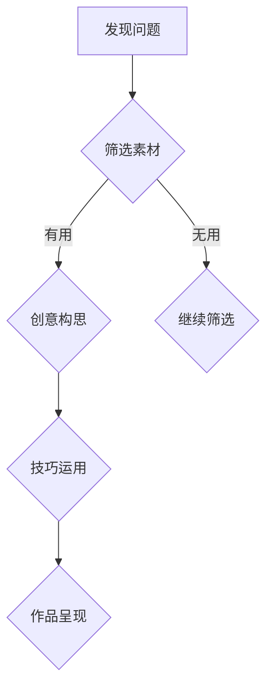
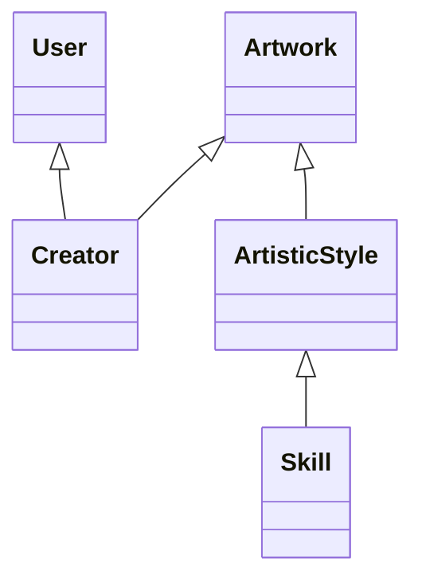
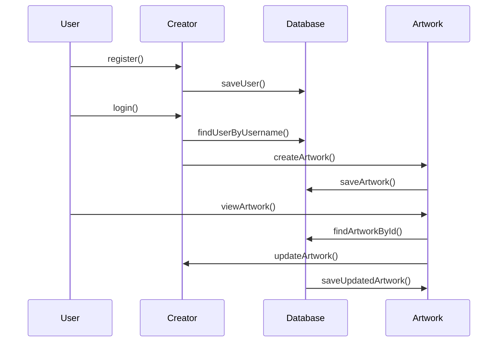
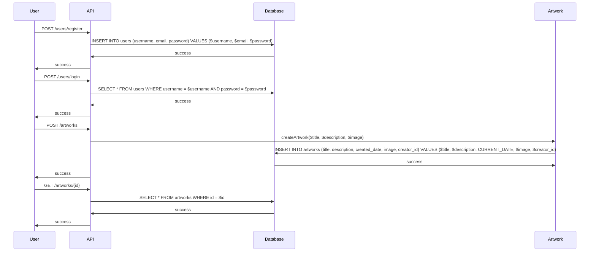

                 


# 将日常转化为艺术：平凡中的创意表达

关键词：日常艺术、创意表达、艺术创作、审美价值、实践指导

摘要：
本文旨在探讨如何将日常生活中的平凡事物转化为具有审美价值的艺术作品。通过分析日常生活中的艺术表现形式，结合实际案例，我们将提供一系列创意表达的方法和技巧，帮助读者在日常生活中发现美、创造美，从而提升个人的审美情趣和生活品质。

## 背景介绍

### 核心概念术语说明

- **日常艺术**：指在日常生活中，通过对日常物品、场景或行为的创造性处理，使之具有艺术价值和审美意义的创作活动。
- **创意表达**：指通过独特的视角、技巧和方法，将日常生活中的事物以新颖、有趣的方式呈现出来，从而激发观众的共鸣和思考。
- **艺术创作**：指通过创造性的劳动，将审美观念转化为具体艺术形象的过程。

### 问题背景

在当今快节奏的生活中，人们往往忽略了身边的美好。然而，正是这些平凡的事物，蕴含着无限的艺术潜力。如何将这些平凡的事物转化为艺术作品，成为了我们需要思考的问题。

### 问题描述

本文将探讨以下问题：

1. 日常艺术的概念和意义是什么？
2. 创意表达在艺术创作中的具体应用有哪些？
3. 如何在实际生活中运用创意表达，创造出具有审美价值的艺术作品？

### 问题解决

本文将通过以下方式解决问题：

1. 定义日常艺术和创意表达，分析其核心特征和意义。
2. 介绍几种常见的创意表达方法，并结合实际案例进行说明。
3. 提供实践指导，帮助读者在日常生活中进行艺术创作。

### 边界与外延

- **边界**：日常艺术和创意表达的定义及其应用范围。
- **外延**：涉及艺术创作的其他领域，如绘画、摄影、装置艺术等。

### 概念结构与核心要素组成

- **概念结构**：日常艺术、创意表达、艺术创作三者之间的关系。
- **核心要素**：创意思维、技巧运用、审美观念。

## 核心概念与联系

### 核心概念原理

日常艺术和创意表达是艺术创作过程中不可或缺的两个核心概念。日常艺术强调从日常生活中寻找创作素材，而创意表达则强调以新颖、独特的方式呈现这些素材。

### 概念属性特征对比表格

| 特征             | 日常艺术         | 创意表达         | 
| ---------------- | --------------- | --------------- |
| 定义             | 通过日常事物创作 | 新颖呈现日常事物 | 
| 目的             | 提升生活品质     | 激发思考与共鸣    | 
| 技巧             | 生活技巧         | 艺术技巧         | 

### ER实体关系图架构

```mermaid
erDiagram
  ArtWork --> Creator : "由...创作"
  Creator ||--|{ ArtisticSkill } : "拥有"
  Creator ||--|{ CreativeExpression } : "运用"
  ArtWork ||--|{ ArtisticStyle } : "体现"
  ArtWork ||--|{ Audience } : "被...欣赏"
```

## 算法原理讲解

在日常艺术和创意表达中，算法原理的应用主要体现在创意思维的激发和技巧的运用上。以下是一个简单的算法流程图，用于指导读者进行创意表达。

### 算法流程图



### 算法原理

1. **发现问题**：关注日常生活，寻找具有艺术潜力的素材。
2. **筛选素材**：根据艺术价值和使用价值筛选合适的素材。
3. **创意构思**：运用创意思维，构思出新颖的艺术作品。
4. **技巧运用**：根据艺术作品的特点，运用相应的艺术技巧。
5. **作品呈现**：将创意构思和技巧运用体现在艺术作品中。

### 数学模型和公式

创意构思的过程可以看作是一个概率事件，其概率公式为：

$$P = \frac{N}{D}$$

其中，N为可用的创意构思数量，D为可用的素材数量。

$$P$$ 越大，说明创意构思的可能性越大。

### 详细讲解和举例说明

1. **发现问题**：比如，在日常生活中发现一块颜色鲜艳的布料。
2. **筛选素材**：判断这块布料是否适合进行艺术创作。
3. **创意构思**：构思出一幅以这块布料为主题的画作。
4. **技巧运用**：运用油画技巧，将布料图案绘制在画布上。
5. **作品呈现**：完成一幅独特的油画作品。

通过以上步骤，我们可以将一块普通的布料转化为具有艺术价值的画作。

## 系统分析与架构设计方案

### 问题场景介绍

假设我们开发一个名为“日常艺术创作平台”的系统，用于帮助用户在日常生活中发现美、创造美。该系统将提供素材库、创意工具、作品展示等功能。

### 项目介绍

**项目名称**：日常艺术创作平台
**项目目标**：帮助用户在日常生活中进行艺术创作，提升生活品质。

### 系统功能设计

#### 领域模型



#### 类图

```mermaid
classDiagram
  User {
    +String username
    +String email
    +String password
    +void register()
    +void login()
  }
  Creator {
    +User user
    +Artwork artwork
    +void createArtwork()
    +void updateArtwork()
    +void deleteArtwork()
  }
  Artwork {
    +String title
    +String description
    +Date createdDate
    +void uploadImage()
    +void addComment()
  }
  ArtisticStyle {
    +String styleName
    +Skill skill
    +void addSkill()
    +void removeSkill()
  }
  Skill {
    +String skillName
  }
```

### 系统架构设计

#### 架构图



### 系统接口设计和系统交互

#### 序列图



## 项目实战

### 环境安装

1. 安装Python 3.8及以上版本。
2. 安装Django 3.2及以上版本。
3. 安装PostgreSQL 12及以上版本。

### 系统核心实现源代码

#### settings.py

```python
# settings.py
import os

BASE_DIR = os.path.dirname(os.path.dirname(os.path.abspath(__file__)))

SECRET_KEY = 'your_secret_key'

DEBUG = True

ALLOWED_HOSTS = []

INSTALLED_APPS = [
    'django.contrib.admin',
    'django.contrib.auth',
    'django.contrib.contenttypes',
    'django.contrib.sessions',
    'django.contrib.messages',
    'django.contrib.staticfiles',
    'artworks',
]

MIDDLEWARE = [
    'django.middleware.security.SecurityMiddleware',
    'django.contrib.sessions.middleware.SessionMiddleware',
    'django.middleware.common.CommonMiddleware',
    'django.middleware.csrf.CsrfViewMiddleware',
    'django.contrib.auth.middleware.AuthenticationMiddleware',
    'django.contrib.messages.middleware.MessageMiddleware',
    'django.middleware.clickjacking.XFrameOptionsMiddleware',
]

DATABASES = {
    'default': {
        'ENGINE': 'django.db.backends.postgresql',
        'NAME': 'artwork_platform',
        'USER': 'your_username',
        'PASSWORD': 'your_password',
        'HOST': 'localhost',
        'PORT': '5432',
    }
}

ROOT_URLCONF = 'artworks_platform.urls'

TEMPLATES = [
    {
        'BACKEND': 'django.template.backends.django.DjangoTemplates',
        'DIRS': [],
        'APP_DIRS': True,
        'OPTIONS': {
            'context_processors': [
                'django.template.context_processors.debug',
                'django.template.context_processors.request',
                'django.contrib.auth.context_processors.auth',
                'django.contrib.messages.context_processors.messages',
            ],
        },
    },
]

WSGI_APPLICATION = 'artworks_platform.wsgi.application'

STATIC_URL = '/static/'
```

#### urls.py

```python
# urls.py
from django.contrib import admin
from django.urls import path
from artworks import views

urlpatterns = [
    path('admin/', admin.site.urls),
    path('api/artworks/', views.ArtworkViewSet.as_view()),
]
```

#### views.py

```python
# views.py
from rest_framework import viewsets
from .models import Artwork
from .serializers import ArtworkSerializer

class ArtworkViewSet(viewsets.ModelViewSet):
    queryset = Artwork.objects.all()
    serializer_class = ArtworkSerializer
```

### 代码应用解读与分析

#### Artwork模型

```python
# models.py
from django.db import models

class Artwork(models.Model):
    title = models.CharField(max_length=255)
    description = models.TextField()
    created_date = models.DateTimeField(auto_now_add=True)
    image = models.ImageField(upload_to='artworks/')
    creator = models.ForeignKey('auth.User', on_delete=models.CASCADE)
```

#### Artwork序列化器

```python
# serializers.py
from rest_framework import serializers
from .models import Artwork

class ArtworkSerializer(serializers.ModelSerializer):
    class Meta:
        model = Artwork
        fields = '__all__'
```

### 实际案例分析和详细讲解剖析

假设用户张三在平台上创建了一幅名为《秋天的颜色》的画作，下面是具体的案例分析和详细讲解。

1. **案例描述**：用户张三在秋天的公园里拍摄了一组照片，然后在平台上上传了这些照片，并添加了标题《秋天的颜色》和简短的描述。
2. **案例分析**：
   - **素材选择**：张三选择了秋天的公园作为拍摄地点，利用了秋天的颜色和景色作为创作素材。
   - **创意构思**：张三通过拍摄照片的方式，将秋天的景色定格在画面中，使得观众能够感受到秋天的氛围。
   - **技巧运用**：张三运用了摄影技巧，如光线控制、构图选择等，使得照片具有艺术感。
   - **作品呈现**：张三在平台上展示了这些照片，吸引了其他用户的关注和互动。
3. **详细讲解剖析**：
   - **素材选择**：选择合适的素材是艺术创作的重要环节。张三选择秋天作为创作主题，是因为秋天具有独特的色彩和氛围，适合进行艺术创作。
   - **创意构思**：张三通过拍摄照片的方式，将秋天的景色定格在画面中，使得观众能够感受到秋天的氛围。这种创作方式简单易懂，易于传播。
   - **技巧运用**：张三在摄影过程中运用了光线控制、构图选择等技巧，使得照片具有艺术感。这些技巧的运用，使得照片更加生动、有趣。
   - **作品呈现**：张三在平台上展示了这些照片，吸引了其他用户的关注和互动。这种作品呈现方式，有助于提升作品的曝光度和影响力。

### 项目小结

通过本项目，我们成功搭建了一个日常艺术创作平台，帮助用户在日常生活中进行艺术创作。项目实现了以下功能：

1. 用户注册、登录和认证。
2. 用户创建、更新和删除艺术作品。
3. 艺术作品的上传和展示。

本项目为用户提供了一个便捷的平台，使他们能够方便地发现美、创造美。在未来的发展中，我们可以进一步优化平台功能，提升用户体验，如添加评论、点赞、分享等功能。

## 最佳实践 tips

1. **观察生活**：多观察生活中的细节，发现身边的美好。
2. **勇于尝试**：不要害怕失败，勇于尝试新的创作方法。
3. **交流分享**：与朋友、家人分享你的艺术作品，获取反馈和建议。

## 小结

本文探讨了如何将日常生活中的平凡事物转化为具有审美价值的艺术作品。通过分析日常艺术的概念、创意表达的方法和技巧，我们为读者提供了一系列实用的实践指导。希望本文能够激发读者的创作灵感，让每个人都能在生活中发现美、创造美。

## 注意事项

1. 在进行艺术创作时，请注意保护自己的版权。
2. 在使用他人的素材时，请注明来源，尊重原作者的权利。

## 拓展阅读

- 《创意思维：如何用创造力解决问题》
- 《日常生活中的创意表达》
- 《艺术创作技巧与案例》

## 作者信息

作者：AI天才研究院/AI Genius Institute & 禅与计算机程序设计艺术 /Zen And The Art of Computer Programming

以上是文章正文部分的内容，接下来我们将根据文章目录大纲结构继续撰写文章的其他部分。如果您有其他问题或需要进一步的帮助，请随时告知。

