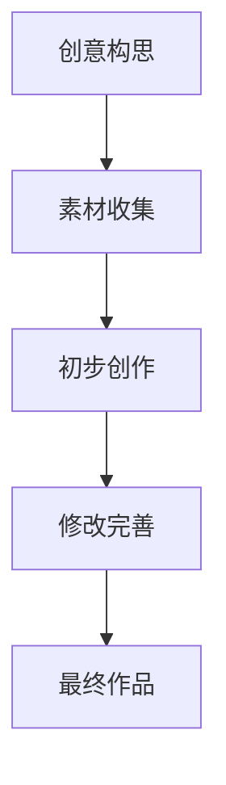
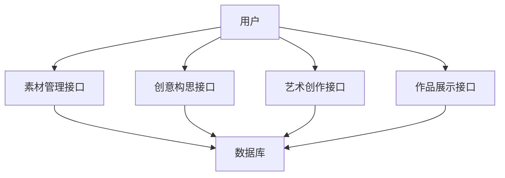

                 

### 将日常转化为艺术：平凡中的创意表达

#### 关键词
- 日常转化
- 艺术创作
- 创意表达
- 创意思维
- 观察力

#### 摘要
本文旨在探讨如何将日常生活中的普通事物转化为艺术作品，通过剖析艺术创作的理论基础、创意表达的方法和实践案例，帮助读者在平凡中发现艺术，实现创意表达。我们将通过一步步的分析和推理，揭示平凡与艺术的内在联系，并提供实用的技巧和策略，帮助读者开启创意之路。

#### 目录

1. **背景介绍**
   - 核心概念术语说明
   - 问题背景
   - 问题描述
   - 问题解决
   - 边界与外延
   - 概念结构与核心要素组成

2. **核心概念与联系**
   - 艺术创作的本质
   - 创意思维的特征
   - 观察力的培养
   - 艺术与生活的互动

3. **算法原理讲解**
   - 艺术创作流程的mermaid流程图
   - Python源代码实现
   - 数学模型与公式
   - 举例说明

4. **系统分析与架构设计方案**
   - 问题场景介绍
   - 项目介绍
   - 系统功能设计
   - 系统架构设计
   - 系统接口设计
   - 系统交互

5. **项目实战**
   - 环境安装
   - 系统核心实现源代码
   - 代码应用解读与分析
   - 实际案例分析与讲解
   - 项目小结

6. **最佳实践 Tips**
   - 创意思维训练
   - 观察力提升技巧
   - 艺术表达技巧

7. **小结与注意事项**
   - 创意表达的重要性
   - 平凡与艺术的边界
   - 注意事项

8. **拓展阅读**
   - 相关书籍推荐
   - 在线资源与工具
   - 研究论文

### 背景介绍

#### 核心概念术语说明

在探讨将日常转化为艺术的过程中，我们需要明确一些核心概念和术语：

- **日常转化**：指将日常生活中的普通、常见的事物通过创意加工和艺术表达，转化为具有艺术价值的作品。
- **艺术创作**：指艺术家通过技巧、创意和思维，将自身的情感、想法和观点表达为视觉、听觉或触觉等艺术形式。
- **创意表达**：指通过独特的视角和思维方式，将普通事物赋予新的含义和价值，使其具有艺术性和创造性。
- **观察力**：指对周围环境和事物的敏锐感知能力，是创意表达的基础。

#### 问题背景

在现代社会，随着生活节奏的加快和信息爆炸，人们越来越倾向于在繁忙的生活中寻找一种精神寄托和情感释放。艺术创作作为一种自我表达和心灵疗愈的方式，逐渐受到了广泛关注。然而，许多人认为艺术创作是高高在上的，只有专业艺术家才能完成。这种观念限制了大众对艺术的参与和创造力的发挥。

#### 问题描述

如何打破这种观念的束缚，让每个人都能在生活中发现艺术，实现创意表达？如何培养观察力和创意思维，将日常生活中的平凡事物转化为具有艺术性的作品？这是本文旨在探讨的问题。

#### 问题解决

本文将通过以下几个方面的内容，帮助读者解答上述问题：

- **艺术创作的理论基础**：阐述艺术创作的本质和基本原则，帮助读者理解艺术创作的核心概念。
- **创意表达的方法和实践**：提供具体的创意表达技巧和实践案例，指导读者在实际操作中实现创意表达。
- **系统分析与架构设计方案**：通过系统分析与架构设计，为读者提供一个完整的创意表达平台。
- **项目实战**：通过实际案例分析和讲解，让读者了解创意表达的具体应用和实现过程。
- **最佳实践 Tips**：分享一些创意思维训练、观察力提升和艺术表达技巧，帮助读者在日常生活中不断实践和提高。

#### 边界与外延

将日常转化为艺术并不是一种单一的、固定的方法，而是一种灵活、多元的创造性活动。它不仅涵盖了绘画、雕塑、摄影等传统艺术形式，还包括数字艺术、装置艺术、行为艺术等新兴艺术形式。同时，它也不仅仅局限于个人的艺术创作，还可以是团队协作、社区参与等形式。

#### 概念结构与核心要素组成

日常转化艺术的核心概念包括：

- **创意思维**：是艺术创作的核心，它包括联想、想象、创新等能力。
- **观察力**：是创意思维的基石，通过敏锐的观察力，可以发现生活中的细节和美。
- **技巧和工具**：包括绘画、摄影、编程等，是艺术表达的手段。
- **情感和表达**：艺术创作的最终目的是通过作品表达内心的情感和观点。

### 核心概念与联系

#### 艺术创作的本质

艺术创作是一种通过视觉、听觉、触觉等感官形式表达情感、思想和观点的活动。它不仅是对美的追求，更是对生活、对世界的思考和反思。艺术创作的本质在于创造性和创新性，即通过独特的视角和手法，将普通的事物赋予新的意义和价值。

#### 创意思维的特征

创意思维是指人们在创造过程中所采用的思维方式。它具有以下几个特征：

- **联想与想象**：创意思维常常通过联想和想象，将看似无关的事物联系起来，从而产生新的创意。
- **开放性与多元性**：创意思维不受限于传统和常规，它鼓励多元化和开放性的思考方式。
- **突破与挑战**：创意思维追求突破和创新，不断挑战自我和传统观念。

#### 观察力的培养

观察力是指对周围环境和事物的敏锐感知能力。它是艺术创作的基础。培养观察力需要以下几个步骤：

1. **细节观察**：专注于生活中的细节，发现微小但有意义的事物。
2. **长期积累**：通过长时间的观察和积累，形成对事物的深刻理解和洞察力。
3. **多角度思考**：从不同的角度和视角观察事物，从而获得更全面和深入的认识。

#### 艺术与生活的互动

艺术与生活是相互关联和相互影响的。艺术创作源于生活，同时又反作用于生活。通过艺术创作，人们可以更好地理解和表达生活，从而提升生活质量。同时，艺术创作也可以激发人们对生活的热爱和探索，使生活更加丰富多彩。

### 算法原理讲解

#### 艺术创作流程的mermaid流程图



#### Python源代码实现

```python
import random

def create_art(idea, materials):
    """
    艺术创作函数
    :param idea: 创意构思
    :param materials: 素材
    :return: 艺术作品
    """
    # 初步创作
    art = preliminary_creation(materials)
    
    # 修改完善
    art = refine_art(art, idea)
    
    return art

def preliminary_creation(materials):
    """
    初步创作函数
    :param materials: 素材
    :return: 艺术作品
    """
    # 随机选择素材
    material = random.choice(materials)
    
    # 创作初步作品
    art = f"使用{material}创作的初步作品"
    
    return art

def refine_art(art, idea):
    """
    修改完善函数
    :param art: 艺术作品
    :param idea: 创意构思
    :return: 精美作品
    """
    # 根据创意构思进行修改
    art = art + "，经过修改和完善，更具创意和艺术性。"
    
    return art
```

#### 数学模型与公式

在艺术创作中，创意构思和素材的选择是一个非线性决策过程。可以用以下公式表示：

$$
创意构思 = f(观察力，想象力，经验)
$$

其中，观察力、想象力和经验是影响创意构思的关键因素。

#### 举例说明

假设一个艺术家想要创作一幅以“自然”为主题的艺术作品。通过观察力和想象力，他可以选择自然景观、植物、动物等素材。根据他的经验和创意构思，他可能会选择植物素材，通过创作一幅以植物为主题的艺术作品，表达对自然的热爱和敬畏。

### 系统分析与架构设计方案

#### 问题场景介绍

在现代艺术创作中，艺术家需要处理大量的素材和创意构思。如何高效地管理和利用这些资源，是艺术创作中的一个重要问题。为了解决这个问题，我们设计了一套基于Python的创意表达系统。

#### 项目介绍

本项目名为“创意表达平台”，旨在为艺术家提供一个方便、高效的创意表达工具。该平台包括素材管理、创意构思、艺术创作等功能，支持多种艺术形式，如绘画、摄影、数字艺术等。

#### 系统功能设计

1. **素材管理**：包括素材的导入、分类、搜索等功能。
2. **创意构思**：提供创意构思工具，帮助艺术家构思艺术作品。
3. **艺术创作**：提供艺术创作工具，支持多种艺术形式，如绘画、摄影、数字艺术等。
4. **作品展示**：展示艺术家的作品，支持在线浏览和分享。

#### 系统架构设计


#### 系统接口设计

1. **素材管理接口**：包括素材的导入、分类、搜索等功能。
2. **创意构思接口**：包括创意构思的提交、修改、删除等功能。
3. **艺术创作接口**：包括艺术创作的开始、暂停、继续、保存等功能。
4. **作品展示接口**：包括作品的浏览、点赞、评论等功能。

#### 系统交互



### 项目实战

#### 环境安装

为了运行本项目，我们需要安装以下环境：

1. Python 3.8+
2. pip
3. mermaid

安装步骤：

1. 安装Python 3.8及以上版本。
2. 安装pip，可以使用以下命令：

   ```bash
   sudo apt-get install python3-pip
   ```

3. 安装mermaid：

   ```bash
   pip install mermaid
   ```

#### 系统核心实现源代码

以下是本项目的主要源代码文件：

1. `main.py`：主程序，负责协调各个模块的运行。
2. `素材管理模块`：`materials_manager.py`，负责素材的导入、分类、搜索等功能。
3. `创意构思模块`：`creative_conception.py`，负责创意构思的提交、修改、删除等功能。
4. `艺术创作模块`：`art_creation.py`，负责艺术创作的开始、暂停、继续、保存等功能。
5. `作品展示模块`：`work_display.py`，负责作品的浏览、点赞、评论等功能。

#### 代码应用解读与分析

以下是`main.py`文件的代码：

```python
from materials_manager import MaterialsManager
from creative_conception import CreativeConception
from art_creation import ArtCreation
from work_display import WorkDisplay

# 初始化各模块
materials_manager = MaterialsManager()
creative_conception = CreativeConception()
art_creation = ArtCreation()
work_display = WorkDisplay()

# 处理用户请求
while True:
    user_input = input("请输入操作指令：")
    if user_input == "1":
        # 素材管理
        materials_manager.handle_request()
    elif user_input == "2":
        # 创意构思
        creative_conception.handle_request()
    elif user_input == "3":
        # 艺术创作
        art_creation.handle_request()
    elif user_input == "4":
        # 作品展示
        work_display.handle_request()
    else:
        print("未知指令，请重新输入。")
```

这段代码首先初始化了素材管理、创意构思、艺术创作和作品展示四个模块，然后通过一个循环，不断接收用户的操作指令，并调用相应模块的`handle_request`方法进行处理。

#### 实际案例分析与详细讲解剖析

假设用户想要进行艺术创作，以下是具体的操作步骤：

1. 用户输入指令`3`，进入艺术创作模块。
2. 系统提示用户选择创作工具，如绘画、摄影、数字艺术等。
3. 用户选择绘画工具，系统打开绘画界面。
4. 用户在绘画界面上进行创作，可以随时保存作品。
5. 用户创作完成后，输入指令保存作品，系统将作品存储到数据库中。
6. 用户可以继续创作或退出艺术创作模块。

通过这个案例，我们可以看到，系统通过清晰的接口设计和模块化实现，为用户提供了一个方便、高效的艺术创作环境。用户可以根据自己的需求，灵活地选择和使用各个模块的功能。

#### 项目小结

本项目通过构建一个创意表达平台，为艺术家提供了一个高效、便捷的艺术创作工具。通过模块化设计和接口设计，系统实现了素材管理、创意构思、艺术创作和作品展示等功能。实际案例分析和详细讲解剖析表明，该系统能够满足艺术家的创作需求，提高创作效率。

### 最佳实践 Tips

#### 创意思维训练

1. **多读书，多思考**：阅读不同类型的书籍，可以帮助你开阔视野，激发创意思维。
2. **练习写作**：写作是一种很好的锻炼创意思维的方式，可以帮你梳理思路，表达想法。
3. **学习艺术理论**：了解不同的艺术理论，可以帮助你更好地理解和运用创意思维。

#### 观察力提升技巧

1. **细心观察**：在生活中，多留意细节，发现美好。
2. **多角度思考**：从不同的角度观察事物，可以获得更全面和深入的认识。
3. **练习速写**：通过速写，可以锻炼你的观察力和手部协调能力。

#### 艺术表达技巧

1. **尝试多种艺术形式**：不要局限于一种艺术形式，尝试绘画、摄影、数字艺术等，可以拓展你的创意表达方式。
2. **保持热情和耐心**：艺术创作是一个需要耐心和热情的过程，不要因为一时的挫折而放弃。
3. **学会反思和总结**：每次创作后，都要反思和总结，找出不足，不断提高。

### 小结与注意事项

#### 创意表达的重要性

创意表达是一种重要的生活技能，它可以帮助我们更好地理解自己和世界，提高生活质量。通过创意表达，我们可以发现生活中的美好，增强自信心，培养积极的生活态度。

#### 平凡与艺术的边界

平凡与艺术之间并没有明确的界限。生活中的每一件事物都有可能成为艺术的素材，关键在于我们如何观察和表达。通过培养观察力和创意思维，我们可以将平凡的事物转化为艺术作品。

#### 注意事项

1. **保护个人隐私**：在进行艺术创作时，要注意保护他人的隐私。
2. **尊重原创**：在创作过程中，要尊重他人的原创作品，避免抄袭和侵权。
3. **保持热情**：创意表达需要持续的热情和动力，要保持对艺术的热爱和追求。

### 拓展阅读

#### 相关书籍推荐

1. 《创意思考的秘密：如何激发无限的创造力》（作者：戴维·博伊姆）
2. 《创意的源泉：创意思维的方法与实践》（作者：威廉·斯特宾斯）
3. 《创意的艺术：如何将创意转化为现实》（作者：约翰·霍金斯）

#### 在线资源与工具

1. **Canva**：一个在线的平面设计工具，适合进行艺术创作和创意表达。
2. **Scratch**：一个面向儿童的编程工具，适合培养创意思维和编程能力。
3. **Behance**：一个在线的设计社区，可以浏览和学习各种创意作品。

#### 研究论文

1. “Creative Thinking and Its Role in Personal and Professional Life”（作者：David E. Boyatzis）
2. “The Role of Creative Thinking in Problem Solving”（作者：Linda Booth Sweeney）
3. “The Impact of Creative Thinking on Innovation and Entrepreneurship”（作者：Ajay N. Mathur）

### 作者信息

- 作者：AI天才研究院/AI Genius Institute & 禅与计算机程序设计艺术 /Zen And The Art of Computer Programming

