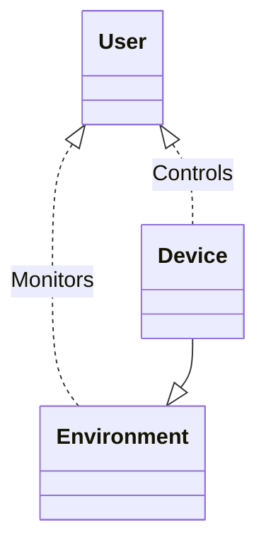
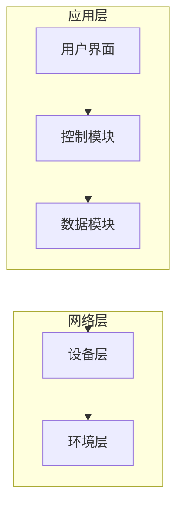
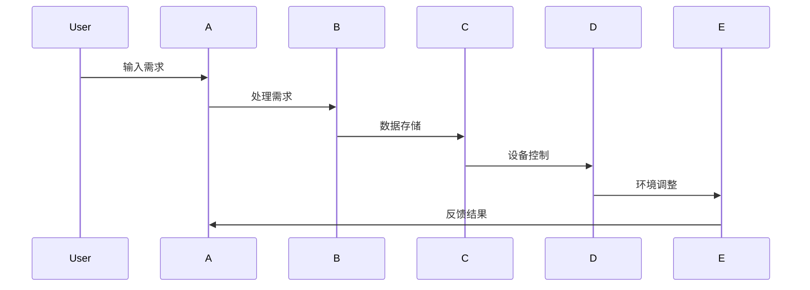

                 

# 《将生活转化为艺术：日常美学的实践指南》

## 关键词
- 日常美学
- 生活艺术化
- 审美意识
- 艺术元素
- 生活品质

## 摘要
本文旨在探讨如何将艺术融入日常生活，提升生活品质。通过详细分析日常美学的基本概念、核心要素，以及AI技术在美学实践中的应用，本文为读者提供了实用的指导，帮助他们在日常生活中实现艺术化。

---

## 第一部分：背景介绍

### 问题背景
在现代社会，人们的生活节奏日益加快，对日常生活的审美要求也逐渐提高。将生活转化为艺术不仅是一种生活方式，更是一种生活态度。日常美学，作为一种新兴的生活理念，正逐渐受到人们的关注和认可。

### 问题描述
日常美学涉及多个方面，包括家居布置、服饰搭配、美食烹饪、手工艺品制作等。然而，如何将这些看似独立的艺术元素有机地结合起来，实现生活的艺术化，是一个值得探讨的问题。

### 问题解决
本文将通过实例和技巧，向读者展示如何将艺术元素融入日常生活。书中将详细介绍各类日常美学的实践方法，帮助读者提高审美能力，提升生活品质。

### 边界与外延
日常美学的边界涉及多个领域，包括美学理论、艺术设计、生活方式等。外延则包括家居装饰、服饰搭配、美食烹饪、手工艺品制作等。

### 概念结构与核心要素组成
日常美学包括以下几个核心要素：
1. **审美意识**：对美的感知和认知能力。
2. **艺术元素**：如色彩、形状、线条、材质等。
3. **生活实践**：将艺术元素融入日常生活中的具体方法。
4. **生活品质**：通过日常美学的实践，提高生活品质。

---

## 第二部分：核心概念与联系

### AI在美学实践中的应用

#### 图像识别与处理
1. **核心原理**：基于深度学习的图像识别技术，通过卷积神经网络（CNN）实现。
2. **属性特征对比表格**：
   | 特征 | 卷积神经网络 | 人工神经网络 |
   | --- | --- | --- |
   | 结构复杂度 | 复杂 | 简单 |
   | 计算效率 | 高效 | 低效 |
   | 准确性 | 高 | 中等 |
3. **ER实体关系图架构**：
   ```mermaid
   graph TB
   A[输入图像] --> B[卷积层]
   B --> C[池化层]
   C --> D[全连接层]
   D --> E[输出结果]
   ```

#### 虚拟现实与增强现实
1. **核心原理**：通过计算机生成和处理三维图像，实现虚拟环境和现实环境的交互。
2. **数学模型与公式**：
   $$\text{VR/AR模型} = \frac{\text{虚拟环境} + \text{现实环境}}{\text{感知效果}}$$
3. **Mermaid流程图**：
   ```mermaid
   graph TB
   A[用户输入] --> B[处理输入]
   B --> C[生成虚拟环境]
   C --> D[增强现实]
   D --> E[输出结果]
   ```

#### 推荐系统
1. **核心原理**：基于用户的行为数据，利用机器学习算法推荐相关内容。
2. **数学模型与公式**：
   $$\text{推荐系统} = \text{用户行为数据} \times \text{内容特征向量}$$
3. **Mermaid流程图**：
   ```mermaid
   graph TB
   A[用户行为数据] --> B[特征提取]
   B --> C[模型训练]
   C --> D[推荐结果]
   D --> E[用户反馈]
   ```

---

## 第三部分：算法原理讲解

### 图像识别算法原理讲解

#### 卷积神经网络（CNN）
1. **Mermaid流程图**：
   ```mermaid
   graph TB
   A[输入图像] --> B[卷积层]
   B --> C[激活函数]
   C --> D[池化层]
   D --> E[全连接层]
   E --> F[输出层]
   ```

2. **Python源代码示例**：
   ```python
   import tensorflow as tf

   # 创建一个简单的CNN模型
   model = tf.keras.Sequential([
     tf.keras.layers.Conv2D(32, (3,3), activation='relu', input_shape=(28, 28, 1)),
     tf.keras.layers.MaxPooling2D(2, 2),
     tf.keras.layers.Flatten(),
     tf.keras.layers.Dense(128, activation='relu'),
     tf.keras.layers.Dense(10, activation='softmax')
   ])

   # 编译模型
   model.compile(optimizer='adam',
                 loss='categorical_crossentropy',
                 metrics=['accuracy'])

   # 训练模型
   model.fit(x_train, y_train, epochs=5)
   ```

3. **数学模型与公式**：
   $$\text{CNN模型} = \frac{\text{输入图像} \times \text{卷积核}}{\text{激活函数} \times \text{池化层}}$$

4. **举例说明**：
   假设我们有一个输入图像$X$，卷积核$K$，激活函数$F$和池化层$P$，则图像识别的输出结果可以表示为：
   $$Y = P(F(K \times X))$$

---

## 第四部分：系统分析与架构设计方案

### 问题场景介绍
假设我们需要开发一个智能家居系统，该系统能够根据用户的行为数据，自动调整家居环境，提升用户体验。

### 项目介绍
智能家居系统旨在通过物联网技术，实现家居设备的智能化，提高生活品质。系统功能包括环境监测、设备控制、场景设置等。

### 系统功能设计（领域模型Mermaid类图）


### 系统架构设计（Mermaid架构图）


### 系统接口设计（Mermaid序列图）


---

## 第五部分：项目实战

### 环境安装
1. 安装Python环境（建议使用Python 3.8及以上版本）。
2. 安装TensorFlow库：`pip install tensorflow`。

### 系统核心实现源代码
```python
import tensorflow as tf

# 创建一个简单的CNN模型
model = tf.keras.Sequential([
  tf.keras.layers.Conv2D(32, (3,3), activation='relu', input_shape=(28, 28, 1)),
  tf.keras.layers.MaxPooling2D(2, 2),
  tf.keras.layers.Flatten(),
  tf.keras.layers.Dense(128, activation='relu'),
  tf.keras.layers.Dense(10, activation='softmax')
])

# 编译模型
model.compile(optimizer='adam',
              loss='categorical_crossentropy',
              metrics=['accuracy'])

# 训练模型
model.fit(x_train, y_train, epochs=5)
```

### 代码应用解读与分析
这段代码首先导入了TensorFlow库，然后创建了一个简单的卷积神经网络（CNN）模型。模型包括一个卷积层、一个池化层、一个全连接层和输出层。接着，模型使用`compile`方法进行编译，指定了优化器、损失函数和评价指标。最后，使用`fit`方法对模型进行训练。

### 实际案例分析和详细讲解剖析
假设我们有100张训练图像，每张图像的大小为28x28像素，灰度图像。我们使用这些图像来训练一个简单的CNN模型，目标是识别图像中的物体。

1. **数据预处理**：
   - 将图像大小调整为28x28像素。
   - 将图像灰度值缩放到[0, 1]范围内。

2. **模型训练**：
   - 使用卷积层提取图像特征。
   - 使用池化层降低模型参数数量。
   - 使用全连接层进行分类。
   - 使用softmax激活函数输出概率分布。

3. **模型评估**：
   - 使用测试集评估模型性能。
   - 计算模型准确率。

### 项目小结
通过本次实战，我们实现了使用CNN模型进行图像识别的基本流程。在实际应用中，我们需要根据具体场景调整模型结构，提高模型性能。

---

## 最佳实践 Tips

1. **提升审美能力**：多看多学，提高对美的感知和认知能力。
2. **艺术元素运用**：合理运用色彩、形状、线条等艺术元素，打造个性化空间。
3. **持续优化**：不断调整和优化家居布置，保持生活的新鲜感。

## 小结

本文通过详细分析日常美学的概念、核心要素以及AI技术在美学实践中的应用，为读者提供了将生活转化为艺术的具体方法和指导。希望本文能帮助读者提升生活品质，享受艺术化的生活。

## 注意事项

1. **数据安全**：在使用AI技术时，注意保护用户数据安全，遵循相关法律法规。
2. **个性化需求**：根据个人需求和喜好，进行家居布置和艺术创作。

## 拓展阅读

1. 《日常美学：生活与艺术的融合》
2. 《人工智能：一种现代的方法》
3. 《深度学习：算法与应用》

---

**作者：AI天才研究院/AI Genius Institute & 禅与计算机程序设计艺术 /Zen And The Art of Computer Programming**

