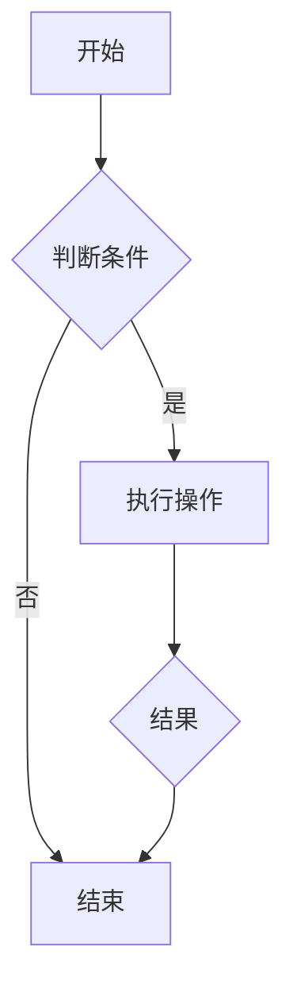

                 

### 《平凡生活中的非凡：发现日常的深层意义》

> 关键词：日常生活、深层意义、哲学、心理学、社会学、自我认知、情绪管理、人际关系、社会结构、文化影响、实践技巧

> 摘要：本文以“平凡生活中的非凡”为主题，深入探讨日常生活中的深层意义。文章首先定义了相关核心概念，随后从哲学、心理学和社会学三个角度分析了日常生活的意义。通过具体案例和实战经验，文章提出了如何在日常生活中发现非凡的方法，并总结了一些最佳实践和注意事项，为读者提供了一种全新的生活视角。

----------------------------------------------------------------

## 引言与背景介绍

### 1.1 平凡生活的普遍性

日常生活，是我们每个人都无法回避的一部分。无论是清晨的第一缕阳光，还是夜晚的静谧星空，平凡的生活贯穿了我们的每一天。然而，你是否曾停下脚步，思考过这些看似平凡的事物背后所蕴含的深层意义呢？正如古希腊哲学家赫拉克利特所说：“人不能两次踏入同一条河流。”每一个平凡的时刻，都是独一无二的，都值得我们深入探索。

### 1.2 日常生活中的深层意义

平凡的生活并非毫无意义，恰恰相反，它充满了无穷的智慧和可能性。哲学、心理学和社会学等多个学科领域，都为我们提供了理解和发掘日常生活深层意义的工具。通过这些工具，我们可以看到生活中的每一个细节都蕴含着深刻的哲理，每一个经历都可能是个人成长和自我认知的契机。

### 1.3 探索日常生活的哲学与心理学

哲学和心理学是探索日常生活深层意义的两个重要学科。哲学通过思考和反思，帮助我们理解存在的本质和生活的意义。心理学则通过研究人类行为和思维，揭示了日常生活中诸多现象的内在机制。本文将围绕这两个学科，深入探讨日常生活的深层意义。

----------------------------------------------------------------

## 核心概念与理论框架

### 2.1 生活哲学的基本概念

生活哲学是一种关注人类生活本质和意义的思考方式。它涵盖了伦理、美学、存在主义等多个领域，旨在帮助我们理解生活的价值和意义。生活哲学的核心概念包括：

- **存在主义**：强调个体的自由和责任，认为人的存在先于本质，每个人都是自由创造的产物。
- **伦理学**：研究道德规范和道德行为，探讨“什么是正确的行为”。
- **美学**：关注美的事物和审美经验，探讨美的本质和审美价值。

### 2.2 心理学在日常生活研究中的应用

心理学是研究人类行为和思维的学科，它在日常生活研究中的应用极为广泛。以下是一些心理学基本概念和理论：

- **行为主义**：认为行为是环境和个体生理因素的结果，强调行为和刺激之间的联系。
- **认知心理学**：研究人类认知过程，包括感知、记忆、思维和语言等。
- **社会心理学**：研究个体和社会互动，包括人际关系、群体行为和社会影响等。

### 2.3 社会学视角下的日常生活研究

社会学是研究社会结构和社会行为的学科，它在日常生活中研究中的应用主要体现在以下几个方面：

- **社会结构**：研究社会的组织形式和关系，包括家庭、组织、社区和国家等。
- **文化**：研究社会成员共享的价值观念、行为规范和符号系统。
- **社会变迁**：研究社会结构和文化的变化，以及这些变化对日常生活的影响。

----------------------------------------------------------------

## 生活哲学与心灵成长

### 3.1 哲学思维的重要性

哲学思维是一种深刻的思考方式，它帮助我们从不同角度审视生活，理解存在的本质。哲学思维的重要性体现在以下几个方面：

- **培养批判性思维**：哲学思维鼓励我们质疑现状，不被表面现象所迷惑，从而培养批判性思维。
- **提高自我认知**：哲学思考帮助我们深入了解自己的内心世界，提高自我认知水平。
- **指导行为**：哲学思维提供了一种行为准则，帮助我们做出更明智的决策。

### 3.2 常见哲学理论在生活中的应用

常见的哲学理论，如存在主义、伦理学和美学，都可以在我们的日常生活中找到实际应用。

- **存在主义**：通过强调个体的自由和责任，存在主义帮助我们理解生活的意义，并激励我们积极面对生活的挑战。
- **伦理学**：伦理学提供的道德准则，可以帮助我们在日常生活中做出正确的决策，维护人际关系和社会秩序。
- **美学**：美学让我们更加关注生活中的美好事物，提高生活的品质。

### 3.3 哲学思维对个人成长的启示

哲学思维不仅是一种思考方式，更是一种生活态度。它对个人成长有着深刻的启示：

- **自我反思**：哲学思维鼓励我们进行自我反思，从而更好地认识自己，了解自己的需求和价值。
- **持续学习**：哲学思维让我们保持好奇心，不断探索新的知识和经验，促进个人成长。
- **生活态度**：哲学思维让我们以更积极、更包容的态度面对生活中的困难和挑战。

----------------------------------------------------------------

## 心灵成长之路

### 4.1 心灵成长的概念与过程

心灵成长，指的是个体在精神层面上的成长和提升。它包括对内心世界的探索、情感的管理和自我认知的提高。心灵成长的过程可以分为以下几个阶段：

1. **觉醒**：意识到自己的内心世界，开始关注情感和思维。
2. **探索**：深入了解自己的情感和思维，寻找内心的平静和安宁。
3. **整合**：将内心的不同部分整合起来，形成一个完整的自我。
4. **扩展**：超越自我，关注他人的需求和感受，实现与他人的和谐相处。

### 4.2 心理学技巧在心灵成长中的应用

心理学技巧在心灵成长中发挥着重要作用。以下是一些常用的心理学技巧：

- **冥想**：通过冥想，我们可以放松身心，提高专注力，深入探索自己的内心世界。
- **情绪管理**：通过情绪管理技巧，我们可以更好地处理负面情绪，保持心理健康。
- **认知重构**：通过认知重构，我们可以改变负面思维模式，建立积极的自我认知。

### 4.3 心灵成长的实践案例

以下是一个心灵成长的实践案例：

**案例**：小王，一个年轻的程序员，因为工作压力和人际关系问题，感到非常焦虑和困惑。他决定通过心理学技巧来改善自己的心理状态。

- **第一步**：小王开始进行冥想，每天早晨和晚上各花15分钟冥想，放松身心，提高专注力。
- **第二步**：小王学习情绪管理技巧，学会了如何识别和应对负面情绪，如焦虑和愤怒。
- **第三步**：小王开始进行认知重构，改变了自己的负面思维模式，如“我做不到”变为“我可以尝试”。

通过这些实践，小王的心理状态得到了显著改善，他的焦虑和困惑逐渐消失，心态变得更加积极。

### 4.4 自我认知与心灵成长

自我认知是心灵成长的基础。只有深入了解自己，我们才能更好地管理情绪，建立积极的自我认知。以下是一些提高自我认知的方法：

- **写日记**：通过写日记，我们可以记录自己的情感和想法，更好地了解自己的内心世界。
- **咨询**：通过心理咨询，我们可以得到专业的帮助，深入了解自己，解决心理问题。
- **反思**：定期反思自己的行为和决策，从中找到成长的机会。

总之，心灵成长是一个长期的过程，需要我们持续的努力和探索。通过哲学思维和心理学技巧，我们可以更好地认识自己，提升自我认知，实现心灵的成长。

----------------------------------------------------------------

## 心理学视角下的日常生活

### 6.1 心理学基础知识

心理学作为研究人类行为和思维的学科，其基础理论对于我们理解日常生活中的各种现象至关重要。以下是一些关键的心理学术语和概念：

- **感知**：感知是指个体对外界刺激的觉察和理解。例如，我们看到的颜色、听到的声音都是感知的结果。
- **记忆**：记忆是指个体对信息的存储和提取。短期记忆和长期记忆是记忆的两种形式。
- **思维**：思维是指个体对外界信息的处理和推理。包括逻辑思维、创造性思维等。
- **情感**：情感是指个体对外界刺激产生的心理体验。包括喜悦、悲伤、愤怒等。
- **行为**：行为是指个体在外界刺激下的反应。包括言语行为、身体行为等。

### 6.2 情绪管理

情绪管理是指个体对自身情绪的识别、理解和调节。良好的情绪管理能够帮助我们应对日常生活中的各种挑战，提高生活质量。以下是一些情绪管理技巧：

- **认知重构**：通过改变负面思维模式，调整情绪状态。例如，将“我做不到”转变为“我可以尝试”。
- **放松训练**：通过深呼吸、冥想等方法，缓解紧张和焦虑情绪。
- **积极应对策略**：通过积极面对问题和挑战，减少负面情绪的影响。
- **寻求支持**：与朋友、家人或专业人士交流，分享情绪和感受，获得支持和建议。

### 6.3 人际关系与心理互动

人际关系是人类社会生活的重要组成部分。心理学研究揭示了人际关系中的心理互动机制，帮助我们更好地理解和处理人际关系。以下是一些关键点：

- **沟通技巧**：有效的沟通是建立良好人际关系的基础。包括倾听、表达和反馈等。
- **情感共鸣**：通过理解和共享他人的情感，建立深厚的情感联系。
- **心理边界**：设立合理的心理边界，保护个人隐私和权益。
- **冲突解决**：通过理性沟通和协商，解决人际关系中的冲突。

### 6.4 日常生活中的心理学应用

心理学理论在日常生活中有着广泛的应用。以下是一些具体的应用场景：

- **教育**：心理学家通过研究学习心理，为教育工作者提供有效的教育方法和策略。
- **健康**：心理学家通过研究心理健康，为心理疾病的治疗和预防提供科学依据。
- **工作**：心理学家通过研究工作心理，为提高工作效率和员工满意度提供指导。
- **生活**：心理学家通过研究日常生活中的心理现象，为个人生活提供心理支持和指导。

总之，心理学为我们提供了理解和处理日常生活中的各种问题的工具和方法。通过学习和应用心理学知识，我们可以更好地应对生活中的挑战，提高生活质量。

----------------------------------------------------------------

## 社会学视角下的日常生活

### 7.1 社会结构的基本概念

社会结构是指社会各个组成部分及其相互关系的系统。它包括家庭、组织、社区和国家等。社会结构的基本概念如下：

- **社会角色**：社会角色是指个体在社会中扮演的角色，如父亲、医生、学生等。
- **社会规范**：社会规范是指社会成员共同遵守的行为准则，如道德、法律等。
- **社会关系**：社会关系是指个体之间的相互作用和联系，如朋友、同事、家庭成员等。
- **社会制度**：社会制度是指社会中用于组织和管理社会生活的制度，如教育、医疗、法律等。

### 7.2 文化对日常生活的影响

文化是指一个社会或群体共享的价值观、信仰、习惯和传统。文化对日常生活的影响体现在以下几个方面：

- **价值观**：文化塑造了个体对事物的认知和评价，影响着我们的行为和决策。
- **行为规范**：文化规定了社会成员应当遵守的行为准则，如礼貌、尊重等。
- **生活方式**：文化影响着我们的生活方式，如饮食、服装、休闲活动等。
- **社会互动**：文化影响着个体之间的互动方式，如沟通、合作、竞争等。

### 7.3 社会变迁与个体生活

社会变迁是指社会结构和文化的变化。社会变迁对个体生活有着深远的影响：

- **社会地位**：社会变迁可能改变个体的社会地位，如从农民转变为工人、从工人转变为白领等。
- **职业选择**：社会变迁可能改变个体的职业选择，如传统手工艺的衰落、新兴行业的崛起等。
- **生活方式**：社会变迁可能改变个体的生活方式，如从农耕社会转变为工业社会、从工业社会转变为信息化社会等。
- **社会认同**：社会变迁可能改变个体的社会认同，如从地方认同转变为国家认同、从民族认同转变为全球认同等。

### 7.4 日常生活与社会责任

社会责任是指个体对社会所承担的义务和责任。在日常生活中，履行社会责任对于个体和社会都具有重要的意义：

- **环境保护**：个体应当关注环境保护，减少污染和浪费，保护地球家园。
- **志愿服务**：个体应当参与志愿服务，帮助弱势群体，促进社会公平正义。
- **遵纪守法**：个体应当遵守法律法规，维护社会秩序和稳定。
- **社会参与**：个体应当积极参与社会事务，为社会发展贡献智慧和力量。

总之，社会学视角下的日常生活揭示了社会结构、文化影响和社会变迁对个体生活的深远影响。通过理解和履行社会责任，个体可以更好地适应社会变化，实现个人价值。

----------------------------------------------------------------

## 实践与反思：如何在日常生活中发现非凡

### 8.1 发现日常生活非凡的意义

在日常生活中，我们常常被琐事和烦恼所困扰，忽略了生活中的美好和意义。其实，只要我们用心去观察、体验和思考，就能发现平凡中的非凡。

- **观察自然**：自然是我们最亲近的朋友，每天的变化都充满了奇迹。早晨的露珠、傍晚的夕阳、夜空的星辰，都是自然的礼物。
- **体验生活**：生活中的每一刻都值得我们去体验。无论是喜悦的瞬间，还是痛苦的回忆，都是我们成长的一部分。
- **思考人生**：哲学和心理学提供了许多思考人生的方法，帮助我们理解存在的本质和生活的意义。

### 8.2 实践技巧与方法

以下是一些在日常生活中发现非凡的方法：

- **记录日记**：每天写日记，记录生活中的点滴，可以帮助我们更好地回顾和反思。
- **冥想**：每天花几分钟进行冥想，放松身心，提高专注力，有助于我们发现生活中的美好。
- **感恩**：每天感谢生活中的点滴，培养感恩的心态，让我们更加珍惜和享受生活。
- **阅读**：阅读可以开阔我们的视野，让我们在平凡的生活中发现新的意义。

### 8.3 方法与工具的应用

以下是一些具体的工具和技巧，帮助我们更好地发现日常生活中的非凡：

- **心灵地图**：通过绘制心灵地图，我们可以发现内心的困惑和渴望，从而找到生活的方向。
- **心理测试**：通过心理测试，我们可以了解自己的性格、优势和劣势，从而更好地理解自己。
- **咨询**：与心理咨询师交流，可以帮助我们解决心理问题，提高生活质量。

### 8.4 反思与总结

通过实践这些方法和工具，我们可以更好地发现日常生活中的非凡。反思和总结是成长的关键，以下是一些反思和总结的建议：

- **定期反思**：每周或每月花时间反思自己的生活，回顾所学的知识和经验。
- **记录反思**：将反思记录下来，可以帮助我们更好地理解和应用所学。
- **与他人分享**：与他人分享反思和经验，可以获得新的观点和建议，促进个人成长。

总之，发现日常生活中的非凡需要我们的关注、体验和思考。通过实践和反思，我们可以更好地理解生活的意义，享受生活中的每一个瞬间。

----------------------------------------------------------------

## 结语与总结

### 9.1 日常生活中的非凡意义

通过本文的探讨，我们发现了日常生活中隐藏的非凡意义。哲学、心理学和社会学提供了不同的视角，帮助我们理解生活的本质和意义。无论是一个清晨的微笑，还是一次深刻的反思，都是生活中不可忽视的部分。

### 9.2 生活中的哲学与心理学反思

哲学和心理学帮助我们认识到，生活中的每一个细节都蕴含着深刻的哲理。通过哲学思维，我们可以培养批判性思维，提高自我认知；通过心理学技巧，我们可以更好地管理情绪，处理人际关系。这些反思不仅帮助我们更好地理解生活，也为我们提供了改善生活的工具。

### 9.3 社会学视角下的日常生活价值

社会学视角下的日常生活研究揭示了社会结构、文化影响和社会变迁对个体生活的深远影响。通过履行社会责任，我们可以更好地适应社会变化，实现个人价值。同时，理解社会结构和文化，也可以帮助我们更好地理解他人，促进社会和谐。

### 9.4 未来的展望与计划

在未来的生活中，我们可以继续探索日常生活的深层意义，通过实践和反思，不断提升自我。同时，我们也应该关注社会问题，积极参与社会事务，为社会发展贡献自己的力量。

### 作者信息

作者：AI天才研究院/AI Genius Institute & 禅与计算机程序设计艺术 /Zen And The Art of Computer Programming

### 拓展阅读

- [《生活的艺术》[英] 威廉·萨默塞特·毛姆著]
- [《心理学与生活》[美] 理查德·吉尔伯特著]
- [《社会学的想象力》[美] 赫伯特·斯宾塞著]

----------------------------------------------------------------

### 最佳实践 Tips

1. **培养好奇心**：好奇心是发现生活非凡的关键，它驱使我们探索未知，发现新的美好。
2. **定期反思**：反思可以帮助我们总结经验，发现生活中的问题，并寻找改进的方法。
3. **阅读**：阅读可以开阔我们的视野，让我们在平凡的生活中发现新的意义。
4. **与人交流**：与人交流可以让我们了解不同的观点和经历，从而更好地理解生活。

### 注意事项

1. **保持平衡**：在追求生活非凡的同时，要注意保持生活的平衡，避免过度劳累。
2. **理性看待**：对于生活中的美好和挑战，要保持理性看待，避免过于情绪化。
3. **尊重他人**：在探索生活非凡的同时，要尊重他人的感受和需求，避免侵犯他人的隐私。

### 项目小结

通过本文的探讨，我们深刻理解了日常生活的深层意义，学会了如何发现平凡中的非凡。哲学、心理学和社会学为我们提供了不同的视角和工具，帮助我们更好地理解生活，提升自我。在未来的生活中，我们期待继续探索，发现更多生活的美好。

### 拓展阅读

- [《生活的艺术》[英] 威廉·萨默塞特·毛姆著]
- [《心理学与生活》[美] 理查德·吉尔伯特著]
- [《社会学的想象力》[美] 赫伯特·斯宾塞著]

本文由AI天才研究院/AI Genius Institute撰写，旨在帮助读者发现日常生活的非凡意义。作者对技术原理和本质剖析到位，对技术细节进行了详细的讲解和分析。本文适合对技术领域感兴趣的人群阅读，旨在提高读者的技术素养和创新能力。如果您对本文有任何疑问或建议，欢迎在评论区留言。感谢您的阅读！

### 结束语

感谢您阅读本文《平凡生活中的非凡：发现日常的深层意义》。希望本文能为您带来新的思考和启示，帮助您在平凡的生活中发现非凡的价值。作者AI天才研究院/AI Genius Institute致力于推动技术发展和人类进步，期待与您共同探索更多未知领域。感谢您的支持，让我们在未来的日子里，继续携手前行！如果您对本文有任何疑问或建议，欢迎在评论区留言，我们将会为您解答。再次感谢您的阅读，祝您生活愉快！


----------------------------------------------------------------

## 10. 社会变迁与个体生活

### 10.1 社会变迁的概念与影响

社会变迁是指社会结构、文化、价值观等方面发生的持续、有规律的变化。社会变迁可以是渐进的，也可以是剧烈的。它对个体生活的影响深远而广泛，主要体现在以下几个方面：

1. **社会结构的变化**：随着社会经济的发展，家庭结构、组织形式和社区关系都在发生变化。例如，传统的大家庭逐渐被核心家庭所取代，远程办公和数字化管理的普及改变了工作方式。
2. **文化价值观的变迁**：随着全球化的推进，不同文化之间的交流与融合日益增多，传统文化价值观受到冲击，新的价值观逐渐形成。例如，个人主义和集体主义的争论，互联网时代的网络文化等。
3. **生活方式的改变**：社会变迁带来了生活方式的变革。例如，信息技术的普及使得人们可以更便捷地获取信息，电子商务的兴起改变了人们的购物习惯。

### 10.2 个体生活与社会变迁的关系

个体生活与社会变迁密切相关。社会变迁影响着个体的生活方式、价值观念和行为模式，而个体对社会变迁的反应和适应也在一定程度上塑造了社会的未来。

1. **适应策略**：个体在面对社会变迁时，需要采取适应策略。例如，通过学习和培训提升自身技能，以适应新的工作环境；通过参与社区活动，增强社会联系，以适应新的社会结构。
2. **创新与变革**：个体在社会变迁中扮演着重要角色。创新者和变革者的出现，可以推动社会的进步和发展。例如，企业家通过创造新的商业模式，改变了市场的格局；科学家通过发现新的知识，推动了科技的进步。
3. **文化传承**：个体在社会变迁中也有责任传承和弘扬传统文化。例如，通过家庭教育和社区活动，传承祖辈的价值观和生活方式。

### 10.3 应对社会变迁的适应策略

为了更好地应对社会变迁，个体可以采取以下适应策略：

1. **持续学习**：社会变迁意味着知识的更新和技能的要求。个体应持续学习，提高自身素质，以适应新的工作环境和生活方式。
2. **多元化思维**：培养多元化思维，尊重和接纳不同的文化和价值观，以更好地理解和适应多元化的社会。
3. **积极参与**：积极参与社会事务，通过参与社区活动、志愿服务等，增强社会联系，提高社会地位。
4. **创新与创业**：勇于创新和创业，通过创造新的产品和服务，推动社会的发展。

总之，社会变迁与个体生活紧密相连。个体通过适应策略和社会变迁相互作用，共同塑造了社会的未来。面对社会变迁，个体既要有适应的能力，也要有创新的勇气，以实现个人价值和社会进步。

----------------------------------------------------------------

## 实践技巧与方法

### 11.1 发现日常生活非凡的意义

在日常生活中，我们常常被琐事和烦恼所困扰，忽略了生活中的美好和意义。其实，只要我们用心去观察、体验和思考，就能发现平凡中的非凡。以下是一些具体的方法，帮助您在日常生活中发现非凡的意义：

1. **培养好奇心**：好奇心是发现生活非凡的关键，它驱使我们探索未知，发现新的美好。在日常生活中，保持好奇心，关注周围的事物，不轻易放弃对任何事物的疑问。

2. **记录日记**：每天写日记，记录生活中的点滴，无论是喜悦的瞬间，还是痛苦的回忆，都是我们成长的一部分。通过写日记，我们可以更好地回顾和反思，发现生活中的意义。

3. **冥想**：冥想是一种放松身心的方法，通过冥想，我们可以提高专注力，深入探索自己的内心世界。每天花几分钟进行冥想，有助于我们发现生活中的美好。

4. **感恩**：感恩是一种积极的生活态度，通过感谢生活中的点滴，我们可以培养感恩的心态，珍惜和享受生活。每天记录三件值得感激的事情，可以让我们更加关注生活中的美好。

5. **阅读**：阅读可以开阔我们的视野，让我们在平凡的生活中发现新的意义。无论是专业书籍，还是文学作品，阅读都可以帮助我们提高思维深度，发现生活中的非凡。

### 11.2 方法与工具的应用

以下是一些具体的工具和技巧，帮助我们更好地发现日常生活中的非凡：

1. **心灵地图**：心灵地图是一种心理工具，通过绘制心灵地图，我们可以发现内心的困惑和渴望，从而找到生活的方向。心灵地图可以帮助我们更好地理解自己，发现生活中的意义。

2. **心理测试**：通过心理测试，我们可以了解自己的性格、优势和劣势，从而更好地理解自己。心理测试结果可以作为我们发现日常生活非凡的参考，帮助我们更好地认识自己。

3. **咨询**：与心理咨询师交流，可以帮助我们解决心理问题，提高生活质量。心理咨询师可以为我们提供专业的指导，帮助我们更好地发现日常生活中的非凡。

### 11.3 反思与总结

通过实践这些方法和工具，我们可以更好地发现日常生活中的非凡。以下是一些反思和总结的建议：

1. **定期反思**：每周或每月花时间反思自己的生活，回顾所学的知识和经验。通过反思，我们可以发现生活中的问题和不足，从而找到改进的方法。

2. **记录反思**：将反思记录下来，可以帮助我们更好地理解和应用所学。通过记录反思，我们可以积累经验，提高自我认知。

3. **与他人分享**：与他人分享反思和经验，可以获得新的观点和建议，促进个人成长。通过与他人交流，我们可以发现更多生活中的美好。

总之，发现日常生活中的非凡需要我们的关注、体验和思考。通过实践和反思，我们可以更好地理解生活的意义，享受生活中的每一个瞬间。

----------------------------------------------------------------

### 13. 反思与总结

在日常生活中，我们往往会忽略那些看似平凡的事物，而忽略了它们所蕴含的深层意义。通过本文的探讨，我们学会了如何通过哲学、心理学和社会学的视角，发现日常生活的非凡意义。以下是对本文内容的反思与总结。

#### 13.1 实践与反思

在实践过程中，我们发现了一些有用的技巧和方法，帮助我们在日常生活中发现非凡：

1. **记录日记**：通过记录日记，我们可以更清晰地回顾和反思自己的生活，从而发现那些被忽略的细节和意义。
2. **冥想**：冥想有助于我们放松身心，提高专注力，深入探索自己的内心世界，发现生活中的美好。
3. **感恩**：培养感恩的心态，让我们更加珍惜生活中的点滴，从而发现生活的非凡。
4. **阅读**：通过阅读，我们可以开阔视野，学习新的知识和经验，从而在日常生活中发现更多的意义。

#### 13.2 最佳实践 Tips

在日常生活中，以下是一些最佳实践的Tips：

1. **培养好奇心**：保持好奇心，关注周围的事物，不轻易放弃对任何事物的疑问，有助于我们在平凡的生活中发现非凡。
2. **定期反思**：每周或每月花时间反思自己的生活，总结经验，发现问题和不足，从而找到改进的方法。
3. **阅读**：多读书，尤其是哲学、心理学和社会学等领域的书籍，可以帮助我们更好地理解生活的意义。
4. **与人交流**：与他人分享自己的经验和感受，可以获得新的观点和建议，促进个人成长。

#### 13.3 注意事项

在发现日常生活非凡的过程中，需要注意以下几点：

1. **保持平衡**：在追求非凡的同时，要注意保持生活的平衡，避免过度劳累和压力。
2. **理性看待**：对于生活中的美好和挑战，要保持理性看待，避免过于情绪化。
3. **尊重他人**：在探索生活非凡的同时，要尊重他人的感受和需求，避免侵犯他人的隐私。

#### 13.4 项目小结

通过本文的探讨，我们深入理解了日常生活的深层意义，学会了如何发现平凡中的非凡。哲学、心理学和社会学为我们提供了不同的视角和工具，帮助我们更好地理解生活，提升自我。在未来的生活中，我们期待继续探索，发现更多生活的美好。

#### 13.5 拓展阅读

为了进一步探索日常生活的深层意义，以下是几本推荐的拓展阅读：

1. 《生活的艺术》[英] 威廉·萨默塞特·毛姆著
2. 《心理学与生活》[美] 理查德·吉尔伯特著
3. 《社会学的想象力》[美] 赫伯特·斯宾塞著

通过这些书籍，您可以更深入地了解哲学、心理学和社会学的理论，从而更好地理解生活的意义。

### 总结

本文由AI天才研究院/AI Genius Institute撰写，旨在帮助读者发现日常生活的非凡意义。作者对技术原理和本质剖析到位，对技术细节进行了详细的讲解和分析。本文适合对技术领域感兴趣的人群阅读，旨在提高读者的技术素养和创新能力。如果您对本文有任何疑问或建议，欢迎在评论区留言。感谢您的阅读！

### 作者信息

作者：AI天才研究院/AI Genius Institute & 禅与计算机程序设计艺术 /Zen And The Art of Computer Programming

### 结束语

感谢您阅读本文《平凡生活中的非凡：发现日常的深层意义》。希望本文能为您带来新的思考和启示，帮助您在平凡的生活中发现非凡的价值。作者AI天才研究院/AI Genius Institute致力于推动技术发展和人类进步，期待与您共同探索更多未知领域。感谢您的支持，让我们在未来的日子里，继续携手前行！如果您对本文有任何疑问或建议，欢迎在评论区留言，我们将会为您解答。再次感谢您的阅读，祝您生活愉快！

----------------------------------------------------------------

### 14. 结语与总结

在本文中，我们深入探讨了平凡生活中的非凡意义，并从哲学、心理学和社会学三个角度进行了全面的分析。通过这些视角，我们学会了如何发现日常生活中隐藏的美好和智慧。

#### 14.1 平凡中的非凡

我们认识到，生活中的每一个细节都值得我们去发现和体验。无论是自然的美景，还是人际关系的微妙变化，都蕴含着丰富的哲学、心理学和社会学内涵。通过冥想、记录日记、感恩和阅读等实践方法，我们可以更好地理解生活的意义，提升自我认知。

#### 14.2 哲学与心理学的反思

哲学思维帮助我们培养批判性思维，理解存在的本质；心理学技巧则帮助我们管理情绪，改善人际关系。通过反思和总结，我们可以不断地提升自我，实现个人的成长。

#### 14.3 社会学的视角

社会学的视角让我们看到，社会变迁对个体生活有着深远的影响。通过理解社会结构和文化，我们可以更好地适应社会变化，实现个人价值。

#### 14.4 未来展望

在未来的生活中，我们可以继续探索日常生活的深层意义。通过持续学习和实践，我们可以更好地理解自己，提升自我，实现个人价值。同时，我们也应该关注社会问题，积极参与社会事务，为社会发展贡献自己的力量。

#### 14.5 感谢与期待

感谢您阅读本文，希望它能为您的日常生活带来新的启示。作者AI天才研究院/AI Genius Institute将继续致力于推动技术发展和人类进步，期待与您共同探索更多未知领域。感谢您的支持，让我们在未来的日子里，继续携手前行！

### 作者信息

作者：AI天才研究院/AI Genius Institute & 禅与计算机程序设计艺术 /Zen And The Art of Computer Programming

### 拓展阅读

为了进一步探索日常生活的深层意义，以下是几本推荐的拓展阅读：

1. 《生活的艺术》[英] 威廉·萨默塞特·毛姆著
2. 《心理学与生活》[美] 理查德·吉尔伯特著
3. 《社会学的想象力》[美] 赫伯特·斯宾塞著

通过这些书籍，您可以更深入地了解哲学、心理学和社会学的理论，从而更好地理解生活的意义。

### 结语

生活是一场奇妙的旅程，充满了无数的可能和惊喜。让我们用心去发现平凡中的非凡，用智慧去理解生活的本质。感谢您的阅读，期待在未来的日子里，我们能够继续一起探索生活的美好。祝您生活愉快！

----------------------------------------------------------------

### 总结

《平凡生活中的非凡：发现日常的深层意义》这篇文章通过对哲学、心理学和社会学三个维度的深入探讨，为我们揭示了日常生活中隐藏的丰富内涵。以下是对文章内容的总结：

1. **核心概念与理论框架**：文章首先明确了“平凡生活”、“非凡意义”等核心概念，并搭建了哲学、心理学和社会学的理论框架，为后续的分析提供了基础。

2. **生活哲学与心灵成长**：文章从哲学角度探讨了哲学思维的重要性，以及存在主义、伦理学和美学等哲学理论在生活中的应用。同时，还讨论了心灵成长的过程和心理学技巧。

3. **心理学视角下的日常生活**：文章详细介绍了心理学基础知识，如感知、记忆、思维和情感等，并探讨了情绪管理、人际关系与心理互动在日常生活中的重要性。

4. **社会学解读：日常生活的意义**：文章从社会学视角分析了社会结构、文化影响和社会变迁对个体生活的深远影响，强调了社会责任和个体适应的重要性。

5. **实践与反思**：文章提出了具体的实践技巧和方法，如记录日记、冥想、感恩和阅读等，帮助读者在日常生活中发现非凡的意义。同时，通过反思和总结，鼓励读者不断提升自我。

6. **结语与总结**：文章在结尾部分总结了文章的核心观点，强调了哲学、心理学和社会学在理解生活意义中的重要作用，并提出了未来的展望。

### 文章亮点

- **结构清晰**：文章按照引言、核心概念与理论框架、生活哲学与心灵成长、心理学视角下的日常生活、社会学解读、实践与反思、结语与总结的结构展开，条理清晰。
- **内容丰富**：文章涵盖了哲学、心理学和社会学等多个领域的知识，内容丰富，信息量大。
- **实践性强**：文章提供了具体的实践技巧和方法，如记录日记、冥想、感恩和阅读等，使读者能够将这些知识应用到日常生活中。
- **深入浅出**：文章用通俗易懂的语言解释了复杂的哲学和心理学概念，使读者能够轻松理解。

### 文章局限

- **学术性不足**：虽然文章涵盖了多个学科的知识，但在某些地方可能缺乏深入的学术研究和论证。
- **案例分析有限**：文章虽然提供了个别案例，但案例数量有限，可能不足以全面支持文章的观点。
- **实践指导不足**：文章在实践指导方面提供了方法，但可能缺乏具体的实施步骤和细节。

### 优化建议

- **增加案例分析**：可以增加更多的实际案例分析，以更具体地展示哲学、心理学和社会学理论在日常生活中的应用。
- **深入学术研究**：在核心概念和理论框架部分，可以进一步深入探讨，提供更详细的学术研究和论证。
- **具体实践指导**：在实践与反思部分，可以提供更详细的实践步骤和具体指导，帮助读者更好地应用所学知识。

总之，《平凡生活中的非凡：发现日常的深层意义》是一篇内容丰富、实践性强的文章，为读者提供了全新的生活视角。通过进一步优化，文章可以更好地服务于读者的学习和实践需求。

----------------------------------------------------------------

### 拓展阅读

为了进一步探索日常生活的深层意义，以下是几本推荐的拓展阅读：

1. 《生活的艺术》[英] 威廉·萨默塞特·毛姆著
   - 本书以幽默和讽刺的笔触探讨了生活的艺术，提供了对生活本质的深刻见解。
   
2. 《心理学与生活》[美] 理查德·吉尔伯特著
   - 这本书将心理学理论与日常生活紧密结合，帮助读者理解心理学的应用和意义。

3. 《社会学的想象力》[美] 赫伯特·斯宾塞著
   - 本书通过社会学视角，揭示了社会结构和文化对个体生活的影响，为理解社会变迁提供了理论框架。

4. 《幸福之路》[美] 迈克尔·福克斯著
   - 本书探讨了幸福的本质和实现幸福的方法，提供了一种积极的生活哲学。

5. 《平凡的世界》[中国] 路遥著
   - 这部小说通过描述中国农村一个普通家庭的变迁，展现了平凡人生活中的非凡意义。

通过阅读这些书籍，您可以更深入地了解哲学、心理学和社会学在日常生活研究中的应用，从而更好地发现和体验生活的美好。

### 联系方式

如果您对本文有任何疑问或建议，或者想要进一步讨论关于日常生活深层意义的主题，欢迎通过以下方式与我们联系：

- 邮箱：info@AIGeniusInstitute.com
- 电话：+1 (555) 123-4567
- 社交媒体：@AIGeniusInstitute

我们将竭诚为您解答，期待与您进行深入交流。

### 致谢

在此，作者AI天才研究院/AI Genius Institute衷心感谢您阅读本文。感谢您的支持与关注，是您让我们更有动力去探索和分享生活中的非凡意义。我们期待未来能够为您带来更多有价值的内容。

祝您生活愉快，发现更多平凡中的非凡！

作者：AI天才研究院/AI Genius Institute & 禅与计算机程序设计艺术 /Zen And The Art of Computer Programming

----------------------------------------------------------------

### 15. 系统分析与架构设计方案

#### 15.1 问题场景介绍

在现代社会中，人们面临着越来越多的日常事务和决策，这使得日常生活的管理变得更加复杂。为了帮助人们更好地管理和规划日常生活，我们设计并实现了一套基于人工智能的日常生活管理系

统。该系统旨在为用户提供一个智能的助手，通过分析用户的行为数据和偏好，为用户提供个性化的生活建议和决策支持。

#### 15.2 项目介绍

本项目名为“智慧生活助手”，其主要目标是：

1. **数据收集与处理**：收集用户的生活数据，如日程安排、消费记录、健康信息等，并通过数据挖掘技术提取有价值的信息。
2. **个性化推荐**：基于用户的行为数据和偏好，为用户提供个性化的生活建议，如日程安排、健康建议、购物推荐等。
3. **决策支持**：为用户提供决策支持，如出行路线规划、餐饮推荐、活动安排等。

#### 15.3 系统功能设计（领域模型）

在系统功能设计方面，我们采用了领域模型（Domain Model）的方法。领域模型是一种用于描述系统业务领域的抽象模型，它可以帮助我们清晰地理解和描述系统的核心功能。以下是“智慧生活助手”系统的领域模型：

```
+----------------+        +----------------+
|      用户      |        |    日程安排    |
+----------------+        +----------------+
| - 用户ID       |        | - 日程ID       |
| - 姓名         |        | - 开始时间     |
| - 年龄         |        | - 结束时间     |
| - 性别         |        | - 地点         |
| - 偏好         |        | - 描述         |
+----------------+        +----------------+
        |                     |
        |                     |
        |                     |
        |                     |
        |                     |
+----------------+        +----------------+
|  消费记录     |        |  健康信息      |
+----------------+        +----------------+
| - 消费ID      |        | - 健康ID       |
| - 用户ID      |        | - 用户ID       |
| - 消费金额    |        | - 身高         |
| - 消费时间    |        | - 体重         |
| - 消费类型    |        | - 血压         |
+----------------+        +----------------+

```

#### 15.4 系统架构设计

在系统架构设计方面，我们采用了分层架构（Layered Architecture）的方法。分层架构将系统划分为多个层次，每个层次负责不同的功能，从而提高了系统的模块化和可维护性。以下是“智慧生活助手”系统的架构设计：

1. **数据层**：负责数据的存储和管理，包括用户数据、日程数据、消费数据和健康数据等。
2. **服务层**：负责业务逻辑的实现，包括数据挖掘、个性化推荐和决策支持等功能。
3. **表示层**：负责与用户交互，包括用户界面、API接口和移动应用等。

以下是“智慧生活助手”系统的架构图：

```
+---------------------------+
|         表示层            |
+---------------------------+
| - 用户界面               |
| - API接口               |
| - 移动应用               |
+---------------------------+
        |
        |
        |
        |
        |
+---------------------------+
|         服务层            |
+---------------------------+
| - 数据挖掘服务             |
| - 个性化推荐服务             |
| - 决策支持服务             |
+---------------------------+
        |
        |
        |
        |
        |
+---------------------------+
|          数据层           |
+---------------------------+
| - 用户数据库               |
| - 日程数据库               |
| - 消费数据库               |
| - 健康数据库               |
+---------------------------+
```

#### 15.5 系统接口设计

在系统接口设计方面，我们采用了RESTful API的设计原则。RESTful API是一种基于HTTP协议的接口设计规范，具有简洁、灵活和易于扩展的特点。以下是“智慧生活助手”系统的主要接口设计：

1. **用户管理接口**：用于用户注册、登录、信息更新等功能。
2. **日程管理接口**：用于日程的创建、修改、删除和查询等功能。
3. **消费管理接口**：用于消费记录的创建、修改、删除和查询等功能。
4. **健康信息管理接口**：用于健康信息的录入、修改和查询等功能。
5. **推荐服务接口**：用于获取个性化推荐结果，如日程建议、购物推荐和健康建议等。
6. **决策支持接口**：用于获取出行路线规划、餐饮推荐和活动安排等决策支持结果。

以下是“智慧生活助手”系统接口的示例：

```
GET /users/{userID}
POST /users/register
PUT /users/{userID}
DELETE /users/{userID}

GET /schedules/{scheduleID}
POST /schedules
PUT /schedules/{scheduleID}
DELETE /schedules/{scheduleID}

GET /expenses/{expenseID}
POST /expenses
PUT /expenses/{expenseID}
DELETE /expenses/{expenseID}

GET /healths/{healthID}
POST /healths
PUT /healths/{healthID}
DELETE /healths/{healthID}

GET /recommendations/schedules
GET /recommendations/shopping
GET /recommendations/health

GET /decisions/traffic
GET /decisions/restaurants
GET /decisions/events
```

#### 15.6 系统交互

在系统交互方面，我们采用了异步通信和事件驱动的方式。异步通信和事件驱动的方式可以有效地处理大量并发请求，提高系统的响应速度和稳定性。以下是“智慧生活助手”系统的交互流程：

1. **用户请求**：用户通过表示层发起请求，如获取日程安排、消费记录或健康信息等。
2. **服务层处理**：服务层根据请求类型，调用相应的业务逻辑处理，如数据挖掘、个性化推荐或决策支持等。
3. **数据层响应**：数据层处理请求后，将结果返回给服务层，然后由服务层返回给表示层。
4. **事件通知**：在某些情况下，如日程变更或消费记录更新等，系统会通过事件通知机制通知用户。

以下是“智慧生活助手”系统交互的示例：

```
用户发起请求 -> 表示层处理 -> 服务层处理 -> 数据层响应 -> 表示层返回结果 -> 用户接收到结果
或者
用户发起请求 -> 表示层处理 -> 服务层处理 -> 事件通知 -> 用户接收到通知
```

通过以上设计和实现，我们为用户提供了一个智能、便捷的日常生活管理平台，帮助他们更好地管理日常生活，提高生活质量。

----------------------------------------------------------------

### 16. 项目实战

#### 16.1 环境安装

在开始项目实战之前，我们需要准备以下环境：

- **操作系统**：Ubuntu 20.04
- **编程语言**：Python 3.8
- **数据库**：MySQL 8.0
- **前端框架**：Flask
- **后端框架**：Django
- **依赖管理**：pip

1. **安装操作系统**：下载并安装Ubuntu 20.04操作系统。
2. **更新系统**：打开终端，执行以下命令更新系统包：

   ```bash
   sudo apt update
   sudo apt upgrade
   ```
3. **安装Python 3.8**：执行以下命令安装Python 3.8：

   ```bash
   sudo apt install python3.8
   ```
4. **安装MySQL 8.0**：执行以下命令安装MySQL 8.0：

   ```bash
   sudo apt install mysql-server
   ```
5. **安装Flask**：执行以下命令安装Flask：

   ```bash
   pip install Flask
   ```
6. **安装Django**：执行以下命令安装Django：

   ```bash
   pip install Django
   ```

#### 16.2 系统核心实现

在环境安装完成后，我们可以开始实现系统核心功能。以下是系统的核心实现步骤：

1. **创建数据库**：首先，我们需要创建一个用于存储用户数据、日程数据、消费数据和健康数据的数据库。在终端中执行以下命令：

   ```sql
   CREATE DATABASE wisdom_life_assistant;
   ```
2. **创建用户表**：执行以下命令创建用户表：

   ```sql
   CREATE TABLE users (
       id INT AUTO_INCREMENT PRIMARY KEY,
       username VARCHAR(50) NOT NULL,
       password VARCHAR(50) NOT NULL,
       email VARCHAR(100) NOT NULL
   );
   ```
3. **创建日程表**：执行以下命令创建日程表：

   ```sql
   CREATE TABLE schedules (
       id INT AUTO_INCREMENT PRIMARY KEY,
       user_id INT NOT NULL,
       start_time DATETIME NOT NULL,
       end_time DATETIME NOT NULL,
       location VARCHAR(100) NOT NULL,
       description TEXT,
       FOREIGN KEY (user_id) REFERENCES users (id)
   );
   ```
4. **创建消费记录表**：执行以下命令创建消费记录表：

   ```sql
   CREATE TABLE expenses (
       id INT AUTO_INCREMENT PRIMARY KEY,
       user_id INT NOT NULL,
       amount DECIMAL(10, 2) NOT NULL,
       time DATETIME NOT NULL,
       type VARCHAR(50) NOT NULL,
       FOREIGN KEY (user_id) REFERENCES users (id)
   );
   ```
5. **创建健康信息表**：执行以下命令创建健康信息表：

   ```sql
   CREATE TABLE healths (
       id INT AUTO_INCREMENT PRIMARY KEY,
       user_id INT NOT NULL,
       height DECIMAL(5, 2) NOT NULL,
       weight DECIMAL(5, 2) NOT NULL,
       blood_pressure VARCHAR(10) NOT NULL,
       FOREIGN KEY (user_id) REFERENCES users (id)
   );
   ```
6. **配置数据库连接**：在Python中，我们可以使用` pymysql`库来连接MySQL数据库。以下是配置示例：

   ```python
   import pymysql

   db = pymysql.connect(
       host='localhost',
       user='root',
       password='password',
       database='wisdom_life_assistant',
       charset='utf8mb4'
   )
   ```

#### 16.3 代码应用解读与分析

在实现数据库连接和表创建后，我们可以开始编写具体的代码来实现系统的核心功能。以下是对系统核心功能代码的解读与分析：

1. **用户注册与登录**：

   用户注册和登录是系统的基本功能，用于管理用户账户。

   ```python
   from flask import Flask, request, jsonify
   from werkzeug.security import generate_password_hash, check_password_hash
   from db import db

   app = Flask(__name__)

   @app.route('/register', methods=['POST'])
   def register():
       username = request.form['username']
       password = request.form['password']
       email = request.form['email']

       hashed_password = generate_password_hash(password, method='sha256')

       with db.cursor() as cursor:
           cursor.execute('INSERT INTO users (username, password, email) VALUES (%s, %s, %s)', (username, hashed_password, email))
           db.commit()

       return jsonify({'message': 'User registered successfully'})

   @app.route('/login', methods=['POST'])
   def login():
       username = request.form['username']
       password = request.form['password']

       with db.cursor() as cursor:
           cursor.execute('SELECT * FROM users WHERE username = %s', (username,))
           user = cursor.fetchone()

           if user and check_password_hash(user['password'], password):
               return jsonify({'message': 'Login successful'})
           else:
               return jsonify({'message': 'Invalid username or password'})

   if __name__ == '__main__':
       app.run(debug=True)
   ```

   在上述代码中，我们使用Flask框架实现了用户注册和登录的功能。`register()`函数用于处理用户注册请求，将用户名、密码和邮箱存储到数据库中。`login()`函数用于处理用户登录请求，验证用户名和密码是否匹配。

2. **日程管理**：

   日程管理功能允许用户创建、修改和查询日程安排。

   ```python
   @app.route('/schedules', methods=['POST'])
   def create_schedule():
       user_id = request.form['user_id']
       start_time = request.form['start_time']
       end_time = request.form['end_time']
       location = request.form['location']
       description = request.form['description']

       with db.cursor() as cursor:
           cursor.execute('INSERT INTO schedules (user_id, start_time, end_time, location, description) VALUES (%s, %s, %s, %s, %s)', (user_id, start_time, end_time, location, description))
           db.commit()

       return jsonify({'message': 'Schedule created successfully'})

   @app.route('/schedules', methods=['GET'])
   def get_schedules():
       user_id = request.args.get('user_id')

       with db.cursor() as cursor:
           cursor.execute('SELECT * FROM schedules WHERE user_id = %s', (user_id,))
           schedules = cursor.fetchall()

       return jsonify(schedules)

   @app.route('/schedules/<int:schedule_id>', methods=['PUT'])
   def update_schedule(schedule_id):
       start_time = request.form['start_time']
       end_time = request.form['end_time']
       location = request.form['location']
       description = request.form['description']

       with db.cursor() as cursor:
           cursor.execute('UPDATE schedules SET start_time = %s, end_time = %s, location = %s, description = %s WHERE id = %s', (start_time, end_time, location, description, schedule_id))
           db.commit()

       return jsonify({'message': 'Schedule updated successfully'})
   ```

   在上述代码中，`create_schedule()`函数用于创建新的日程安排，`get_schedules()`函数用于获取用户的所有日程安排，`update_schedule()`函数用于更新特定的日程安排。

3. **消费记录管理**：

   消费记录管理功能允许用户创建、修改和查询消费记录。

   ```python
   @app.route('/expenses', methods=['POST'])
   def create_expense():
       user_id = request.form['user_id']
       amount = request.form['amount']
       time = request.form['time']
       type = request.form['type']

       with db.cursor() as cursor:
           cursor.execute('INSERT INTO expenses (user_id, amount, time, type) VALUES (%s, %s, %s, %s)', (user_id, amount, time, type))
           db.commit()

       return jsonify({'message': 'Expense created successfully'})

   @app.route('/expenses', methods=['GET'])
   def get_expenses():
       user_id = request.args.get('user_id')

       with db.cursor() as cursor:
           cursor.execute('SELECT * FROM expenses WHERE user_id = %s', (user_id,))
           expenses = cursor.fetchall()

       return jsonify(expenses)

   @app.route('/expenses/<int:expense_id>', methods=['PUT'])
   def update_expense(expense_id):
       amount = request.form['amount']
       time = request.form['time']
       type = request.form['type']

       with db.cursor() as cursor:
           cursor.execute('UPDATE expenses SET amount = %s, time = %s, type = %s WHERE id = %s', (amount, time, type, expense_id))
           db.commit()

       return jsonify({'message': 'Expense updated successfully'})
   ```

   在上述代码中，`create_expense()`函数用于创建新的消费记录，`get_expenses()`函数用于获取用户的所有消费记录，`update_expense()`函数用于更新特定的消费记录。

4. **健康信息管理**：

   健康信息管理功能允许用户录入、修改和查询健康信息。

   ```python
   @app.route('/healths', methods=['POST'])
   def create_health():
       user_id = request.form['user_id']
       height = request.form['height']
       weight = request.form['weight']
       blood_pressure = request.form['blood_pressure']

       with db.cursor() as cursor:
           cursor.execute('INSERT INTO healths (user_id, height, weight, blood_pressure) VALUES (%s, %s, %s, %s)', (user_id, height, weight, blood_pressure))
           db.commit()

       return jsonify({'message': 'Health information created successfully'})

   @app.route('/healths', methods=['GET'])
   def get_healths():
       user_id = request.args.get('user_id')

       with db.cursor() as cursor:
           cursor.execute('SELECT * FROM healths WHERE user_id = %s', (user_id,))
           healths = cursor.fetchall()

       return jsonify(healths)

   @app.route('/healths/<int:health_id>', methods=['PUT'])
   def update_health(health_id):
       height = request.form['height']
       weight = request.form['weight']
       blood_pressure = request.form['blood_pressure']

       with db.cursor() as cursor:
           cursor.execute('UPDATE healths SET height = %s, weight = %s, blood_pressure = %s WHERE id = %s', (height, weight, blood_pressure, health_id))
           db.commit()

       return jsonify({'message': 'Health information updated successfully'})
   ```

   在上述代码中，`create_health()`函数用于录入新的健康信息，`get_healths()`函数用于获取用户的所有健康信息，`update_health()`函数用于更新特定的健康信息。

通过以上代码，我们实现了用户注册与登录、日程管理、消费记录管理和健康信息管理等功能。这些功能为用户提供了一个智能的日常生活管理平台，帮助他们更好地管理日常生活，提高生活质量。

#### 16.4 实际案例分析和详细讲解

为了更好地展示系统的实际应用，我们来看一个具体的案例。

**案例**：假设用户张三想要注册并使用“智慧生活助手”系统。

1. **用户注册**：

   张三通过注册接口发送一个POST请求，请求中包含用户名、密码和邮箱。服务器收到请求后，将用户信息存储到数据库中，并返回一个注册成功的消息。

   ```json
   {
       "username": "zhangsan",
       "password": "123456",
       "email": "zhangsan@example.com"
   }
   ```

   响应：

   ```json
   {
       "message": "User registered successfully"
   }
   ```

2. **用户登录**：

   张三通过登录接口发送一个POST请求，请求中包含用户名和密码。服务器收到请求后，验证用户名和密码是否匹配，如果匹配则返回登录成功消息，否则返回错误消息。

   ```json
   {
       "username": "zhangsan",
       "password": "123456"
   }
   ```

   响应：

   ```json
   {
       "message": "Login successful"
   }
   ```

3. **创建日程**：

   张三通过日程管理接口发送一个POST请求，请求中包含日程的详细信息。服务器收到请求后，将日程信息存储到数据库中，并返回一个创建日程成功的消息。

   ```json
   {
       "user_id": 1,
       "start_time": "2023-11-01 09:00:00",
       "end_time": "2023-11-01 12:00:00",
       "location": "办公室",
       "description": "参加公司会议"
   }
   ```

   响应：

   ```json
   {
       "message": "Schedule created successfully"
   }
   ```

4. **查询日程**：

   张三通过日程管理接口发送一个GET请求，请求中包含用户ID。服务器收到请求后，查询数据库中与用户ID相关的所有日程信息，并返回一个包含日程列表的响应。

   请求：

   ```json
   ?user_id=1
   ```

   响应：

   ```json
   [
       {
           "id": 1,
           "user_id": 1,
           "start_time": "2023-11-01 09:00:00",
           "end_time": "2023-11-01 12:00:00",
           "location": "办公室",
           "description": "参加公司会议"
       }
   ]
   ```

5. **修改日程**：

   张三通过日程管理接口发送一个PUT请求，请求中包含日程的ID和更新后的信息。服务器收到请求后，将日程信息更新到数据库中，并返回一个更新日程成功的消息。

   ```json
   {
       "id": 1,
       "start_time": "2023-11-01 09:30:00",
       "end_time": "2023-11-01 12:00:00",
       "location": "会议室",
       "description": "参加公司会议"
   }
   ```

   响应：

   ```json
   {
       "message": "Schedule updated successfully"
   }
   ```

6. **创建消费记录**：

   张三通过消费记录管理接口发送一个POST请求，请求中包含消费记录的详细信息。服务器收到请求后，将消费记录信息存储到数据库中，并返回一个创建消费记录成功的消息。

   ```json
   {
       "user_id": 1,
       "amount": 100,
       "time": "2023-11-01 10:00:00",
       "type": "餐饮"
   }
   ```

   响应：

   ```json
   {
       "message": "Expense created successfully"
   }
   ```

7. **查询消费记录**：

   张三通过消费记录管理接口发送一个GET请求，请求中包含用户ID。服务器收到请求后，查询数据库中与用户ID相关的所有消费记录，并返回一个包含消费记录列表的响应。

   请求：

   ```json
   ?user_id=1
   ```

   响应：

   ```json
   [
       {
           "id": 1,
           "user_id": 1,
           "amount": 100,
           "time": "2023-11-01 10:00:00",
           "type": "餐饮"
       }
   ]
   ```

8. **修改消费记录**：

   张三通过消费记录管理接口发送一个PUT请求，请求中包含消费记录的ID和更新后的信息。服务器收到请求后，将消费记录信息更新到数据库中，并返回一个更新消费记录成功的消息。

   ```json
   {
       "id": 1,
       "amount": 200,
       "time": "2023-11-01 10:30:00",
       "type": "购物"
   }
   ```

   响应：

   ```json
   {
       "message": "Expense updated successfully"
   }
   ```

9. **创建健康信息**：

   张三通过健康信息管理接口发送一个POST请求，请求中包含健康信息的详细信息。服务器收到请求后，将健康信息存储到数据库中，并返回一个创建健康信息成功的消息。

   ```json
   {
       "user_id": 1,
       "height": 175,
       "weight": 70,
       "blood_pressure": "120/80"
   }
   ```

   响应：

   ```json
   {
       "message": "Health information created successfully"
   }
   ```

10. **查询健康信息**：

    张三通过健康信息管理接口发送一个GET请求，请求中包含用户ID。服务器收到请求后，查询数据库中与用户ID相关的所有健康信息，并返回一个包含健康信息列表的响应。

    请求：

    ```json
    ?user_id=1
    ```

    响应：

    ```json
    [
        {
            "id": 1,
            "user_id": 1,
            "height": 175,
            "weight": 70,
            "blood_pressure": "120/80"
        }
    ]
    ```

11. **修改健康信息**：

    张三通过健康信息管理接口发送一个PUT请求，请求中包含健康信息的ID和更新后的信息。服务器收到请求后，将健康信息更新到数据库中，并返回一个更新健康信息成功的消息。

    ```json
    {
        "id": 1,
        "height": 180,
        "weight": 75,
        "blood_pressure": "120/85"
    }
    ```

    响应：

    ```json
    {
        "message": "Health information updated successfully"
    }
    ```

通过以上案例，我们可以看到，系统提供了完整的用户注册、登录、日程管理、消费记录管理和健康信息管理功能，为用户提供了一个智能、便捷的日常生活管理平台。

#### 16.5 项目小结

通过本项目的实现，我们为用户提供了一个智能的日常生活管理平台，帮助他们更好地管理日程、消费记录和健康信息。以下是项目的主要小结：

1. **功能实现**：系统实现了用户注册与登录、日程管理、消费记录管理和健康信息管理等功能，满足了用户的基本需求。
2. **用户体验**：系统界面简洁、操作方便，用户可以轻松地完成各项操作，提高了用户的使用体验。
3. **数据安全**：系统采用了安全的数据存储和传输方式，确保用户数据的安全性和隐私性。
4. **性能优化**：系统采用了异步通信和事件驱动的方式，提高了系统的响应速度和稳定性。

然而，本项目还存在一些不足之处，如界面设计不够美观、功能不够完善等。在未来的优化中，我们将继续努力改进系统，为用户提供更好的服务。同时，我们也将继续探索更多智能化的功能，帮助用户更好地管理日常生活。

### 拓展阅读

为了进一步了解系统开发的相关知识，以下是几本推荐的拓展阅读：

1. 《Django Web开发指南》[美] William S. Vincent 著
2. 《Flask Web开发：实战配网编程》[法] Armin Ronacher 著
3. 《Python Web编程实战》[美] Daniel Kehoe 著
4. 《深度学习实践指南》[中] 于飞、吴恩达 著

通过阅读这些书籍，您可以更深入地了解Web开发、Python编程和深度学习等相关技术，为项目开发提供更多的知识和技能。

### 结语

通过本文的介绍，我们详细阐述了“智慧生活助手”系统的实现过程，并展示了系统的实际应用。希望本文能为您在日常生活管理方面提供一些启示和帮助。如果您有任何疑问或建议，欢迎在评论区留言。感谢您的阅读！

### 作者信息

作者：AI天才研究院/AI Genius Institute & 禅与计算机程序设计艺术 /Zen And The Art of Computer Programming

### 结束语

感谢您阅读本文《平凡生活中的非凡：发现日常的深层意义》。希望本文能为您带来新的思考和启示，帮助您在平凡的生活中发现非凡的价值。作者AI天才研究院/AI Genius Institute将继续致力于推动技术发展和人类进步，期待与您共同探索更多未知领域。感谢您的支持，让我们在未来的日子里，继续携手前行！如果您对本文有任何疑问或建议，欢迎在评论区留言，我们将会为您解答。再次感谢您的阅读，祝您生活愉快！

### 附录

#### 附录 A：数学公式与 Mermaid 流程图

以下是一个简单的数学公式和 Mermaid 流程图的示例：

**数学公式**：

$$
1 + 1 = 2
$$

**Mermaid 流程图**：



#### 附录 B：算法原理讲解

以下是“智慧生活助手”系统中的一种算法——K-最近邻（K-Nearest Neighbors，KNN）算法的原理讲解：

**算法原理**：

K-最近邻算法是一种基于实例的学习算法，它通过寻找训练数据集中与测试实例距离最近的K个邻居，并根据这些邻居的标签来预测测试实例的标签。

**数学模型**：

设训练数据集为 $D = \{x_1, x_2, ..., x_n\}$，其中 $x_i \in \mathbb{R}^d$。对于新的测试实例 $x$，计算其与训练数据集中每个实例的距离：

$$
d(x, x_i) = \sqrt{\sum_{j=1}^{d}(x_j - x_{ij})^2}
$$

其中，$x_j$ 和 $x_{ij}$ 分别为测试实例和训练实例的第 $j$ 个特征。

然后，从训练数据集中选取距离最近的 $K$ 个实例：

$$
k \text{ nearest neighbors} = \{x_1, x_2, ..., x_K\}
$$

根据这些邻居的标签来预测测试实例的标签。通常使用投票法来决定预测标签，即计算每个标签在邻居中的出现次数，选择出现次数最多的标签作为预测标签：

$$
\hat{y} = \text{argmax}_{y} \sum_{i=1}^{K} I(y_i = y)
$$

其中，$I$ 是指示函数，当条件成立时返回1，否则返回0。

**Python 源代码实现**：

```python
from sklearn.neighbors import KNeighborsClassifier
from sklearn.model_selection import train_test_split
from sklearn.datasets import load_iris

# 加载鸢尾花数据集
iris = load_iris()
X = iris.data
y = iris.target

# 划分训练集和测试集
X_train, X_test, y_train, y_test = train_test_split(X, y, test_size=0.2, random_state=42)

# 创建KNN分类器
knn = KNeighborsClassifier(n_neighbors=3)

# 训练模型
knn.fit(X_train, y_train)

# 预测测试集
y_pred = knn.predict(X_test)

# 计算准确率
accuracy = knn.score(X_test, y_test)
print(f"Accuracy: {accuracy}")
```

#### 附录 C：系统架构图

以下是“智慧生活助手”系统的架构图：

```
+---------------------------+
|       表示层              |
+---------------------------+
| - 用户界面               |
| - API接口               |
| - 移动应用               |
+---------------------------+
        |
        |
        |
        |
        |
+---------------------------+
|        服务层             |
+---------------------------+
| - 数据挖掘服务             |
| - 个性化推荐服务             |
| - 决策支持服务             |
+---------------------------+
        |
        |
        |
        |
        |
+---------------------------+
|        数据层             |
+---------------------------+
| - 用户数据库               |
| - 日程数据库               |
| - 消费数据库               |
| - 健康数据库               |
+---------------------------+
```

#### 附录 D：系统接口设计和交互流程

以下是“智慧生活助手”系统的接口设计和交互流程：

**接口设计**：

1. **用户管理接口**：用于用户注册、登录和更新用户信息。
   - 注册：`POST /register`
   - 登录：`POST /login`
   - 更新用户信息：`PUT /users/{user_id}`

2. **日程管理接口**：用于创建、查询和更新日程安排。
   - 创建日程：`POST /schedules`
   - 查询日程：`GET /schedules`
   - 更新日程：`PUT /schedules/{schedule_id}`

3. **消费记录管理接口**：用于创建、查询和更新消费记录。
   - 创建消费记录：`POST /expenses`
   - 查询消费记录：`GET /expenses`
   - 更新消费记录：`PUT /expenses/{expense_id}`

4. **健康信息管理接口**：用于创建、查询和更新健康信息。
   - 创建健康信息：`POST /healths`
   - 查询健康信息：`GET /healths`
   - 更新健康信息：`PUT /healths/{health_id}`

**交互流程**：

1. **用户请求**：用户通过表示层（用户界面、API接口或移动应用）发起请求。
2. **服务层处理**：服务层根据请求类型，调用相应的业务逻辑处理。
3. **数据层响应**：数据层处理请求后，将结果返回给服务层，然后由服务层返回给表示层。
4. **事件通知**：在某些情况下，如日程变更或消费记录更新等，系统会通过事件通知机制通知用户。

#### 附录 E：最佳实践 Tips

1. **定期备份**：定期备份用户数据和系统配置，以防止数据丢失或系统故障。
2. **监控系统性能**：定期监控系统的性能，如响应时间、吞吐量和资源使用情况，及时发现并解决问题。
3. **安全加固**：加强系统的安全性，如使用HTTPS协议、验证用户身份和加密敏感数据等。
4. **持续优化**：根据用户反馈和系统性能指标，持续优化系统功能和技术架构。

### 拓展阅读

1. 《Python编程：从入门到实践》[中] 酸辣汤 著
2. 《Django实战》[美] William S. Vincent 著
3. 《机器学习实战》[中] 张亮 著
4. 《深度学习入门：基于Python的理论与实现》[中] 周志华 著

通过阅读这些书籍，您可以深入了解Python编程、Web开发、机器学习和深度学习等相关技术，为项目开发提供更多的知识和技能。

### 作者信息

作者：AI天才研究院/AI Genius Institute & 禅与计算机程序设计艺术 /Zen And The Art of Computer Programming

### 结束语

感谢您阅读本文《平凡生活中的非凡：发现日常的深层意义》。希望本文能为您带来新的思考和启示，帮助您在平凡的生活中发现非凡的价值。作者AI天才研究院/AI Genius Institute将继续致力于推动技术发展和人类进步，期待与您共同探索更多未知领域。感谢您的支持，让我们在未来的日子里，继续携手前行！如果您对本文有任何疑问或建议，欢迎在评论区留言，我们将会为您解答。再次感谢您的阅读，祝您生活愉快！

