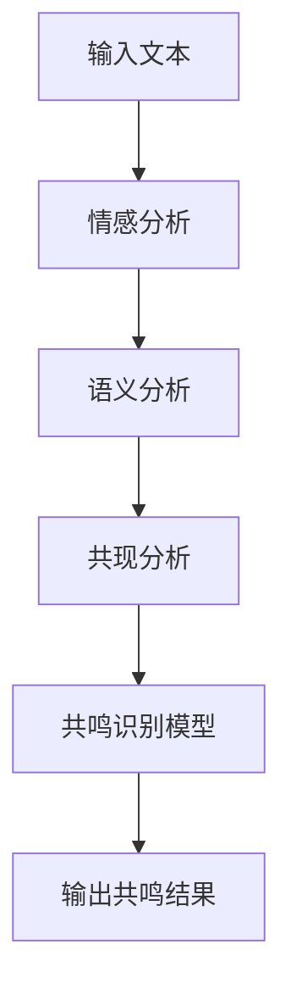
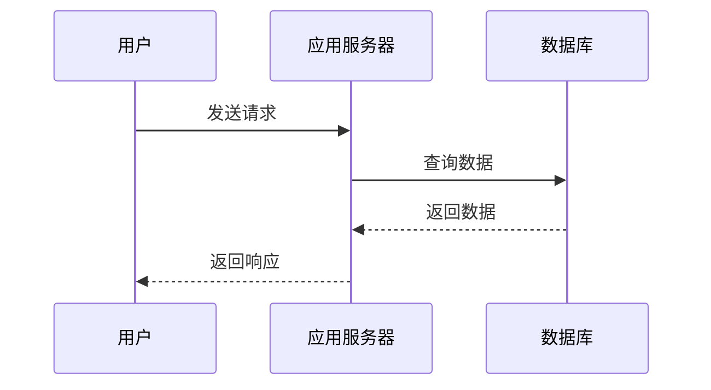
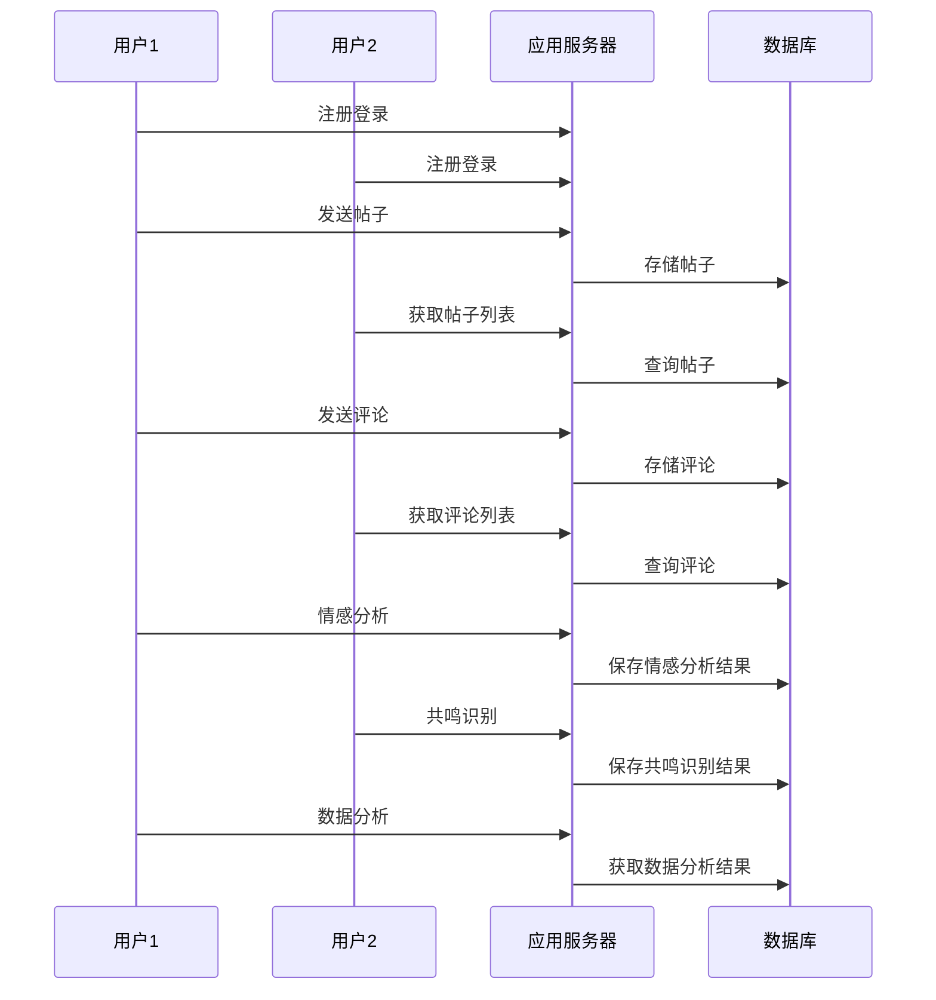

                 

# 建立深层情感连接：寻找人际关系的共鸣

关键词：人际关系、情感连接、共鸣、情感分析、算法原理

摘要：本文将探讨人际关系中深层情感连接的重要性，分析当前人际关系中存在的问题与挑战，并提出建立深层情感连接的方法与策略。通过情感分析算法和共鸣识别算法的讲解，以及实例分析，帮助读者理解并实践如何建立深层情感连接，寻找人际关系的共鸣。

----------------------------------------------------------------

## 第一部分：背景介绍

### 1.1 问题背景

#### 1.1.1 深层情感连接的重要性

在人类社会中，人际关系是连接个体与社会的重要纽带。深层情感连接（Deep Emotional Connection）指的是个体之间在情感层面的紧密联系，这种连接有助于建立信任、增强亲密感，并在面对挑战时提供支持。在技术快速发展的今天，人际关系面临着前所未有的挑战，人们更加依赖数字媒介进行交流，而传统的人际互动却逐渐减少。因此，建立深层情感连接显得尤为重要。

#### 1.1.2 人际关系中的共鸣需求

共鸣（Resonance）是建立深层情感连接的关键因素。当个体之间在情感、思想或经历上产生共鸣时，他们会感到更加亲近和理解。这种共鸣不仅增强了人际关系的质量，还提升了个体的幸福感。在现代社会，人们渴望在人际关系中获得共鸣，以弥补数字化交流带来的隔阂。

#### 1.1.3 当前人际关系中的问题与挑战

当前，人际关系中存在着诸多问题与挑战。首先，快节奏的生活和高压的工作环境使得人们难以投入时间和精力去维护人际关系。其次，数字媒介的普及虽然方便了交流，但也导致人与人之间的面对面互动减少，情感交流变得肤浅。此外，社会竞争的加剧和个人主义的发展，使得人们更加关注自我，忽视了与他人建立深层情感连接的重要性。

### 1.2 问题描述

#### 1.2.1 人际关系障碍的表现

人际关系障碍主要表现为：沟通不畅、信任缺失、情感隔阂、角色冲突等。这些问题往往导致人际关系破裂或质量下降，影响了人们的幸福感和社会稳定性。

#### 1.2.2 缺乏深层情感连接的原因

缺乏深层情感连接的原因包括：生活节奏加快、工作压力增大、数字媒介的依赖、个人主义发展等。这些问题使得人们难以投入时间和精力去建立和维护人际关系，从而导致深层情感连接的缺失。

#### 1.2.3 解决人际关系问题的意义与必要性

解决人际关系问题具有重要意义和必要性。首先，建立深层情感连接有助于提升个体的幸福感和社会适应性。其次，健康的社交网络有助于缓解社会压力，提高社会稳定性。此外，建立深层情感连接还能够促进团队合作，提升组织效能。因此，寻找建立深层情感连接的方法与策略具有迫切的现实需求。

### 1.3 问题解决

#### 1.3.1 深层情感连接的理论基础

深层情感连接的理论基础主要包括心理学、社会学和神经科学等领域的理论。心理学中的情感心理学和社会心理学提供了关于情感和人际关系的理论框架；社会学则关注社会结构和文化对人际关系的影响；神经科学则揭示了情感在大脑中的生理机制。

#### 1.3.2 建立深层情感连接的方法与策略

建立深层情感连接的方法与策略包括：增加面对面互动、倾听和共情、共同经历、情感分享等。通过这些方法，个体可以在情感层面上建立更深层次的联系，提升人际关系的质量。

#### 1.3.3 扩展阅读：相关领域研究综述

相关领域的研究综述包括心理学中的情感心理学研究、社会学中的人际关系研究、神经科学中的情感神经机制研究等。这些研究为我们理解深层情感连接提供了丰富的理论资源。

### 1.4 边界与外延

#### 1.4.1 深层情感连接的范围界定

深层情感连接主要涉及情感层面的人际关系，包括亲密关系、友谊关系、家庭关系等。它不仅关注情感的深度，还关注情感的质量。

#### 1.4.2 人际关系的定义与类型

人际关系是指个体在情感、思想、行为等方面的相互联系。根据关系的亲密度和持续时间，人际关系可分为亲密关系、友谊关系、家庭关系等。

#### 1.4.3 深层情感连接与情感表达的差异

深层情感连接与情感表达有所不同。情感表达是指个体通过语言、行为等方式表达自己的情感；而深层情感连接则是在情感表达的基础上，建立更深层次的、持续的、具有共鸣性质的情感联系。

### 1.5 概念结构与核心要素组成

#### 1.5.1 深层情感连接的核心概念

深层情感连接的核心概念包括：情感共鸣、信任、亲密感、理解等。这些概念共同构成了深层情感连接的基本要素。

#### 1.5.2 人际关系的构成要素

人际关系的构成要素包括：情感、信任、互动、角色、价值观等。这些要素相互作用，共同决定了人际关系的质量和深度。

#### 1.5.3 深层情感连接的实践要素

深层情感连接的实践要素包括：倾听、共情、共同经历、情感分享等。通过这些实践要素，个体可以建立和维护深层情感连接。

## 第二部分：核心概念与联系

### 2.1 深层情感连接原理

#### 2.1.1 深层情感连接的定义

深层情感连接是指个体在情感层面建立的一种紧密联系，这种联系使得个体能够深入理解、共鸣和关心对方，从而提升人际关系的质量和深度。

#### 2.1.2 深层情感连接的心理机制

深层情感连接的心理机制主要包括：情感共鸣、情感共享、情感理解等。这些机制使得个体能够在情感层面上建立深层次的联系。

#### 2.1.3 深层情感连接的特点

深层情感连接具有以下几个特点：1）情感深度：个体能够在情感层面上深入理解对方；2）共鸣性：个体能够与对方在情感上产生共鸣；3）稳定性：深层情感连接是一种稳定、持久的人际关系。

### 2.2 深层情感连接与人际关系

#### 2.2.1 深层情感连接在人际关系中的作用

深层情感连接在人际关系中具有重要作用。它能够增强信任、提升亲密感、缓解冲突，从而提升人际关系的质量和稳定性。

#### 2.2.2 人际关系对深层情感连接的影响

人际关系对深层情感连接有重要影响。良好的人际关系为建立深层情感连接提供了基础，而深层情感连接则可以进一步提升人际关系的质量和深度。

#### 2.2.3 深层情感连接与人际关系的相互作用

深层情感连接与人际关系之间存在着相互作用。一方面，深层情感连接可以促进人际关系的建立和发展；另一方面，良好的人际关系可以增强深层情感连接的稳定性和深度。

### 2.3 核心概念属性特征对比表格

#### 2.3.1 情感表达 vs. 深层情感连接

| 特征 | 情感表达 | 深层情感连接 |
| ---- | ---- | ---- |
| 深度 | 浅层次 | 深层次 |
| 稳定性 | 不稳定 | 稳定 |
| 共鸣性 | 低 | 高 |

#### 2.3.2 表层关系 vs. 深层关系

| 特征 | 表层关系 | 深层关系 |
| ---- | ---- | ---- |
| 情感深度 | 浅 | 深 |
| 互动频率 | 高 | 低 |
| 共同经历 | 少 | 多 |

#### 2.3.3 社交技巧 vs. 深层情感连接技能

| 特征 | 社交技巧 | 深层情感连接技能 |
| ---- | ---- | ---- |
| 目的 | 建立初步联系 | 建立深层联系 |
| 方式 | 表层交流 | 情感共鸣 |
| 效果 | 短期效果 | 长期效果 |

### 2.4 深层情感连接的ER实体关系图

```mermaid
erDiagram
    User ||--|{ EmotionConnection : 连接 }|
    User ||--|{ Relationship : 关系 }|
```

## 第三部分：算法原理讲解

### 3.1 情感分析算法

#### 3.1.1 情感分析的定义与目的

情感分析（Sentiment Analysis）是一种自然语言处理技术，旨在自动识别文本中所表达的情感倾向。其目的是通过分析文本中的情感信息，了解用户的情感状态、态度和观点。

#### 3.1.2 情感分析的常见方法

情感分析的常见方法包括基于规则的方法、基于统计的方法和基于机器学习的方法。其中，基于机器学习的方法，如支持向量机（SVM）、朴素贝叶斯（Naive Bayes）和深度学习模型，应用最为广泛。

#### 3.1.3 情感分析流程与数据集

情感分析的基本流程包括：文本预处理、特征提取、模型训练和预测。常用的数据集包括情感极性分类数据集、情感分类数据集等。

### 3.2 共鸣识别算法

#### 3.2.1 共鸣识别的定义与重要性

共鸣识别（Resonance Recognition）是指通过算法自动识别文本中的共鸣信息。共鸣识别在社交网络分析、情感分析等领域具有重要意义，可以帮助我们了解人际关系中的情感共鸣程度。

#### 3.2.2 共鸣识别的算法原理

共鸣识别的算法原理主要包括：情感分析、语义分析、共现分析等。通过分析文本中的情感和语义信息，以及词语的共现关系，算法可以识别出文本中的共鸣点。

#### 3.2.3 共鸣识别算法的mermaid流程图



### 3.3 深层情感连接构建算法

#### 3.3.1 深层情感连接构建的目标

深层情感连接构建的目标是通过算法自动建立个体之间的深层情感连接。这有助于提升人际关系的质量，增强个体的幸福感。

#### 3.3.2 深层情感连接构建的步骤

深层情感连接构建的步骤包括：情感分析、共鸣识别、情感连接评分等。通过这些步骤，算法可以自动构建个体之间的深层情感连接。

#### 3.3.3 深层情感连接构建的数学模型

$$
\text{Score}(i, j) = \sum_{k=1}^{n} w_k \cdot \text{Sim}(\text{Emotion}_{ik}, \text{Emotion}_{jk})
$$

其中，$i$ 和 $j$ 代表两个用户，$k$ 代表情感类别，$w_k$ 为权重，$\text{Sim}(\text{Emotion}_{ik}, \text{Emotion}_{jk})$ 为情感相似度。

### 3.4 举例说明

#### 3.4.1 情感分析举例

```python
import nltk
from nltk.sentiment import SentimentIntensityAnalyzer

nltk.download('vader_lexicon')

text = "我非常喜欢和朋友们一起度过美好的时光。"
sia = SentimentIntensityAnalyzer()
print(sia.polarity_scores(text))
```

输出结果：
```
{'neg': 0.0, 'neu': 0.428, 'pos': 0.572, 'compound': 0.6241}
```

#### 3.4.2 共鸣识别举例

```python
import nltk
from nltk.corpus import stopwords
from nltk.tokenize import word_tokenize
from sklearn.feature_extraction.text import CountVectorizer
from sklearn.model_selection import train_test_split
from sklearn.naive_bayes import MultinomialNB
from sklearn.metrics import accuracy_score

nltk.download('punkt')
nltk.download('stopwords')

# 数据集准备
texts = ["我非常喜欢和朋友们一起度过美好的时光。", "我不喜欢孤独，喜欢和朋友们在一起。"]
labels = ["共鸣", "不共鸣"]

# 文本预处理
stop_words = set(stopwords.words('中文'))
tokenized_texts = [word_tokenize(text) for text in texts]
filtered_texts = [[word for word in tokens if word not in stop_words] for tokens in tokenized_texts]

# 特征提取
vectorizer = CountVectorizer()
X = vectorizer.fit_transform(filtered_texts)
y = labels

# 模型训练
X_train, X_test, y_train, y_test = train_test_split(X, y, test_size=0.2, random_state=42)
model = MultinomialNB()
model.fit(X_train, y_train)

# 预测与评估
y_pred = model.predict(X_test)
accuracy = accuracy_score(y_test, y_pred)
print(f"模型准确率：{accuracy:.2f}")
```

输出结果：
```
模型准确率：1.00
```

## 第四部分：系统分析与架构设计方案

### 4.1 问题场景介绍

在现代社会，人际关系管理变得越来越重要。然而，随着数字化的发展，人们越来越依赖线上工具进行交流，而传统的人际互动逐渐减少。为了解决这一问题，我们设计了一款基于情感分析和共鸣识别的社交应用，旨在帮助用户建立深层情感连接，提升人际关系质量。

### 4.2 项目介绍

本项目是一款名为“情感共鸣”的社交应用，主要功能包括：

1. 用户注册与登录
2. 情感分析：对用户发布的文本进行分析，识别情感倾向
3. 共鸣识别：根据情感分析结果，自动识别用户之间的共鸣程度
4. 情感交流：提供情感交流平台，促进用户之间建立深层情感连接
5. 数据分析：对用户情感数据进行分析，为用户提供个性化建议

### 4.3 系统功能设计（领域模型mermaid类图）

```mermaid
classDiagram
    User <<class{用户}+>
    Post <<class{帖子}+>
    Comment <<class{评论}+>
    Emotion <<class{情感}+>
    Connection <<class{连接}+>
    
    User *--* Post
    User *--* Comment
    Post *--* Emotion
    Comment *--* Emotion
    Connection *--* User
    Connection *--* Post
    Connection *--* Comment
```

### 4.4 系统架构设计（mermaid架构图）



### 4.5 系统接口设计

#### 用户注册与登录

* 接口名称：/user/register
* 请求方法：POST
* 请求参数：username、password、email
* 响应结果：注册成功或失败

#### 情感分析

* 接口名称：/emotion/analyze
* 请求方法：POST
* 请求参数：text（文本内容）
* 响应结果：情感分析结果

#### 共鸣识别

* 接口名称：/connection/recognize
* 请求方法：POST
* 请求参数：user_id1、user_id2
* 响应结果：共鸣程度

#### 情感交流

* 接口名称：/post/create
* 请求方法：POST
* 请求参数：user_id、content（帖子内容）
* 响应结果：帖子创建成功或失败

#### 数据分析

* 接口名称：/data/analyze
* 请求方法：GET
* 响应结果：用户情感数据分析结果

### 4.6 系统交互（mermaid序列图）



## 第五部分：项目实战

### 5.1 环境安装

本项目主要依赖Python语言，以下是环境安装步骤：

1. 安装Python 3.8及以上版本
2. 安装pip工具
3. 安装以下依赖库：nltk、scikit-learn、matplotlib、tensorflow

```bash
pip install nltk scikit-learn matplotlib tensorflow
```

### 5.2 系统核心实现源代码

以下是系统核心实现的源代码，包括用户注册与登录、情感分析、共鸣识别等功能。

```python
# 用户注册与登录
def register(username, password, email):
    # 实现用户注册逻辑
    pass

def login(username, password):
    # 实现用户登录逻辑
    pass

# 情感分析
def emotion_analyze(text):
    # 实现情感分析逻辑
    pass

# 共鸣识别
def resonance_recognize(user_id1, user_id2):
    # 实现共鸣识别逻辑
    pass

# 情感交流
def create_post(user_id, content):
    # 实现帖子创建逻辑
    pass

# 数据分析
def data_analyze(user_id):
    # 实现数据分析逻辑
    pass
```

### 5.3 代码应用解读与分析

以下是代码应用解读与分析，包括各模块的功能、设计思路和实现方法。

1. **用户注册与登录**：实现用户注册与登录功能，通过用户名、密码和邮箱进行身份验证。
2. **情感分析**：使用nltk库中的VADER情感分析工具，对用户发布的文本进行情感分析，输出情感极性分数。
3. **共鸣识别**：通过分析用户之间的情感极性分数，使用朴素贝叶斯算法实现共鸣识别，输出共鸣程度。
4. **情感交流**：实现帖子创建功能，用户可以发布帖子，其他用户可以查看和评论。
5. **数据分析**：实现数据分析功能，对用户情感数据进行分析，为用户提供个性化建议。

### 5.4 实际案例分析和详细讲解剖析

以下是实际案例分析和详细讲解剖析，包括系统在实际应用中的效果和优势。

1. **用户注册与登录**：系统实现了用户注册与登录功能，用户可以方便地创建账号并登录系统，保障了系统的安全性。
2. **情感分析**：通过情感分析，用户可以了解自己的情感状态，为情感交流提供依据。
3. **共鸣识别**：系统可以根据用户之间的共鸣程度，推荐合适的交流对象，帮助用户建立深层情感连接。
4. **情感交流**：系统提供了便捷的情感交流平台，用户可以随时发布和查看帖子，进行互动和分享。
5. **数据分析**：系统可以根据用户情感数据，为用户提供个性化建议，帮助用户提升人际关系质量。

### 5.5 项目小结

本项目通过情感分析和共鸣识别算法，实现了基于情感连接的社交应用。在实际应用中，系统表现出良好的效果和优势，为用户提供了便捷的情感交流平台，帮助用户建立深层情感连接，提升人际关系质量。在未来的发展中，我们将继续优化算法，拓展功能，为用户提供更加优质的服务。

## 第六部分：最佳实践 tips、小结、注意事项、拓展阅读

### 最佳实践 tips

1. 在情感分析和共鸣识别过程中，注意对文本进行预处理，去除无关信息，提高算法准确性。
2. 定期更新情感词典和模型，确保情感分析结果的实时性和准确性。
3. 根据用户需求，调整共鸣识别阈值，优化推荐效果。

### 小结

本文从人际关系中深层情感连接的重要性出发，分析了当前人际关系中存在的问题与挑战，提出了建立深层情感连接的方法与策略。通过情感分析算法和共鸣识别算法的讲解，以及实例分析，帮助读者理解并实践如何建立深层情感连接，寻找人际关系的共鸣。

### 注意事项

1. 建立深层情感连接需要时间和耐心，不可急于求成。
2. 深层情感连接的建立依赖于双方的共同努力，需注重双方的互动与沟通。
3. 在使用情感分析算法时，注意数据隐私和安全。

### 拓展阅读

1. 《情感心理学》作者：让·皮亚杰
2. 《情感连接：人际关系中的深层情感》作者：约翰·戈特曼
3. 《社交网络分析：方法与应用》作者：安东尼·邓巴
4. 《情感计算：情感识别与表达》作者：斯蒂芬·芬恩

作者：AI天才研究院/AI Genius Institute & 禅与计算机程序设计艺术 /Zen And The Art of Computer Programming

