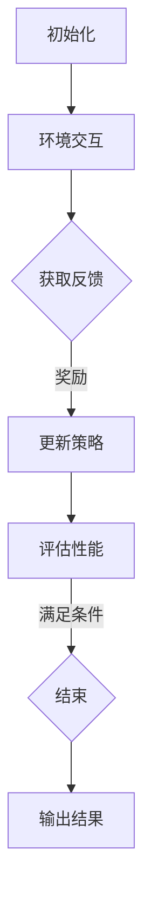
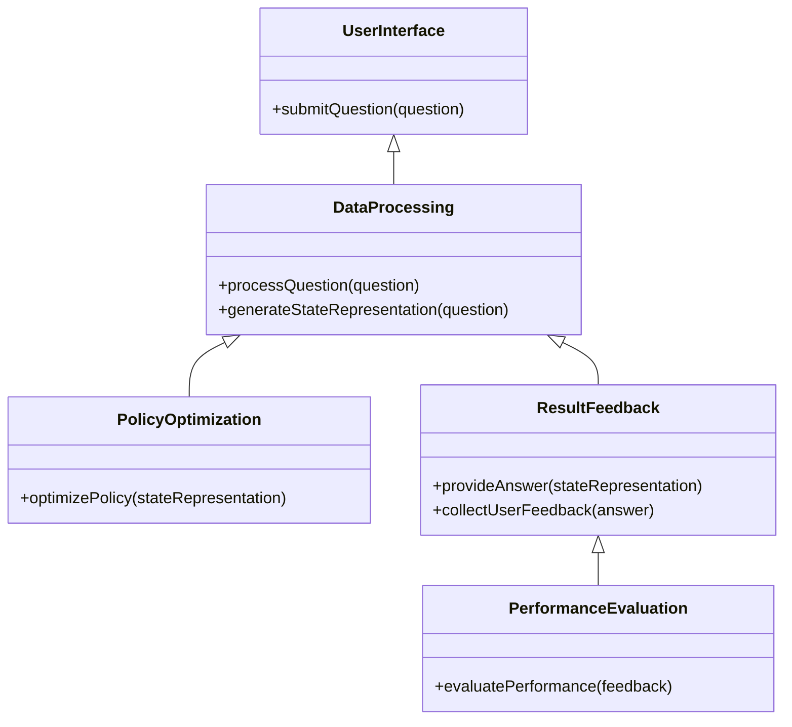
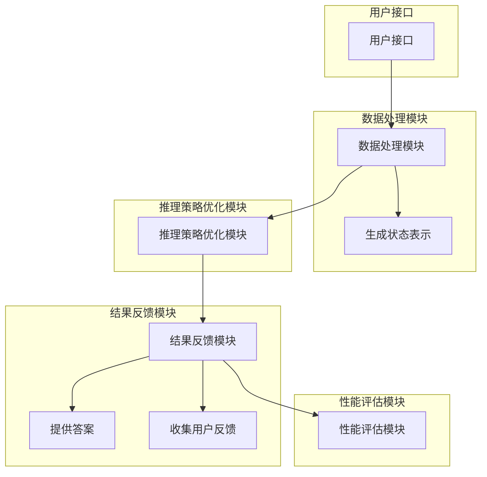

                 


### 1. **背景介绍**

#### 强化学习概述

强化学习（Reinforcement Learning，简称RL）是机器学习中的一个重要分支，主要研究如何通过学习来让智能体在特定环境中采取最佳行动，以达到长期最大化回报。其核心思想是通过不断与环境交互，根据环境的反馈来调整自己的行为策略。

强化学习的基本概念包括：

- **状态（State）**：指智能体所处的环境情况。
- **动作（Action）**：智能体可以采取的行为。
- **奖励（Reward）**：环境对智能体行为的即时反馈。
- **策略（Policy）**：智能体根据状态选择动作的规则。

强化学习的发展历程可以追溯到20世纪50年代，但真正得到广泛关注和应用是在上世纪80年代。其中，Q学习（Q-Learning）和深度强化学习（Deep Reinforcement Learning）是强化学习的两个重要分支。

强化学习的应用场景非常广泛，包括但不限于：

- **游戏**：如围棋、国际象棋等。
- **机器人**：如自动驾驶、无人机等。
- **推荐系统**：如广告推送、个性化推荐等。
- **金融**：如股票交易、风险管理等。

#### 语言模型基础

语言模型（Language Model，简称LM）是自然语言处理（Natural Language Processing，简称NLP）中的重要组成部分，它用于预测自然语言中的下一个单词或字符。语言模型的核心任务是生成文本或理解文本，其应用包括：

- **文本生成**：如聊天机器人、自动写作等。
- **机器翻译**：如自动翻译、跨语言信息检索等。
- **语音识别**：如语音助手、自动字幕等。

语言模型的基本概念包括：

- **词汇表（Vocabulary）**：语言模型中包含的单词或字符集合。
- **概率分布（Probability Distribution）**：语言模型对每个单词或字符出现的概率的估计。
- **语言模型参数（Model Parameters）**：用于描述语言模型特征的参数。

#### 自适应推理策略优化

自适应推理策略优化是指在复杂和动态环境下，通过不断调整推理策略，以提高智能体的性能和适应能力。自适应推理策略优化的关键在于：

- **反馈机制**：通过实时获取环境反馈来调整策略。
- **优化算法**：如梯度下降、遗传算法等。
- **策略调整**：根据环境反馈调整推理策略。

自适应推理策略优化在强化学习中的应用，主要体现在以下几个方面：

- **策略搜索**：通过不断调整策略来寻找最优策略。
- **模型更新**：在训练过程中动态调整模型参数。
- **环境模拟**：通过模拟环境来评估策略的有效性。

#### 强化学习与语言模型的协同

强化学习与语言模型的协同主要表现在以下几个方面：

- **协同优化**：通过结合强化学习和语言模型，实现优化过程的协同。
- **多模态学习**：将强化学习和语言模型应用于不同类型的数据，实现多模态学习。
- **知识增强**：通过语言模型提供的上下文信息，增强强化学习的效果。

### 2. **核心概念与联系**

为了更好地理解强化学习、语言模型和自适应推理策略优化之间的联系，我们可以通过表格和ER实体关系图来阐述它们的核心概念和关系。

#### 表格：核心概念属性特征对比

| 核心概念       | 定义                                                         | 特征对比                             |
| -------------- | ------------------------------------------------------------ | ------------------------------------ |
| 强化学习       | 通过与环境交互来学习最优策略的过程                         | 状态、动作、奖励、策略               |
| 语言模型       | 用于预测自然语言中的下一个单词或字符的模型                 | 概率分布、词汇表、语言模型参数       |
| 自适应推理策略 | 在复杂和动态环境下，通过不断调整推理策略，以提高智能体的性能 | 反馈机制、优化算法、策略调整         |

#### ER实体关系图

```mermaid
erDiagram
  State ||--|{ Action } : 实现某种行为
  Action ||--| Reward : 获取即时反馈
  Reward ||--| Policy : 调整策略
  LanguageModel ||--| WordPrediction : 预测下一个单词
  State ||--| LanguageModel : 提供上下文信息
  Action ||--| LanguageModel : 需要预测动作
  Reward ||--| LanguageModel : 需要理解上下文
  Policy ||--| LanguageModel : 利用语言模型优化策略
```

通过这个ER实体关系图，我们可以看到强化学习、语言模型和自适应推理策略优化之间的紧密联系。状态、动作、奖励和策略构成了强化学习的基本循环，而语言模型则提供了额外的上下文信息，使得强化学习能够在更加复杂的环境中表现出色。

### 3. **算法原理讲解**

#### 算法流程图

为了更直观地理解强化学习与语言模型协同的自适应推理策略优化算法，我们使用mermaid画出其流程图：



这个流程图展示了算法的基本步骤：

1. **初始化**：设置初始状态、动作、奖励和策略。
2. **环境交互**：智能体与环境进行交互，执行动作。
3. **获取反馈**：根据环境的奖励来更新策略。
4. **更新策略**：通过反馈调整策略，以最大化长期回报。
5. **评估性能**：评估当前策略的性能。
6. **满足条件**：判断是否满足结束条件，否则回到环境交互步骤。

#### Python源代码实现

以下是一个简化的Python代码实现，用于演示强化学习与语言模型协同的自适应推理策略优化算法：

```python
import numpy as np

# 初始化参数
state = np.random.rand()
action = np.random.rand()
reward = np.random.rand()
policy = np.random.rand()

# 环境交互
def environment_interaction(state, action):
    # TODO: 实现环境交互逻辑
    return reward

# 更新策略
def update_policy(state, action, reward, policy):
    # TODO: 实现策略更新逻辑
    return policy

# 评估性能
def evaluate_performance(policy):
    # TODO: 实现性能评估逻辑
    return performance

# 主循环
while True:
    # 环境交互
    reward = environment_interaction(state, action)
    
    # 更新策略
    policy = update_policy(state, action, reward, policy)
    
    # 评估性能
    performance = evaluate_performance(policy)
    
    # 判断结束条件
    if performance >= 0.9:  # 假设性能大于0.9时结束
        break

    # 更新状态
    state = np.random.rand()

# 输出结果
print("最终的策略：", policy)
```

#### 数学模型与公式

在强化学习与语言模型协同的自适应推理策略优化中，我们通常使用Q值函数来表示策略。Q值函数是一个衡量策略在不同状态下的预期回报的函数，其数学表达式如下：

$$
Q(s, a) = r(s, a) + \gamma \max_{a'} Q(s', a')
$$

其中，$s$表示状态，$a$表示动作，$r(s, a)$表示在状态$s$下采取动作$a$所获得的即时奖励，$\gamma$是折扣因子，用来平衡即时奖励和长期回报，$s'$和$a'$分别表示下一状态和下一动作。

#### 举例说明

假设我们有一个简单的环境，智能体可以在0到1之间随机选择状态。我们定义一个简单的Q值函数，并在每次交互时更新它。以下是具体的例子：

1. **初始化**：
   - 状态 $s_0 = 0.5$
   - 动作 $a_0 = 0.3$
   - 奖励 $r(0.5, 0.3) = 0.2$
   - 折扣因子 $\gamma = 0.9$
   - 初始Q值 $Q(0.5, 0.3) = 0$

2. **第一次交互**：
   - 状态 $s_1 = 0.5$
   - 动作 $a_1 = 0.3$
   - 奖励 $r(0.5, 0.3) = 0.2$
   - 更新Q值：
     $$
     Q(0.5, 0.3) = r(0.5, 0.3) + \gamma \max_{a'} Q(s', a') = 0.2 + 0.9 \max_{a'} Q(s', a') = 0.2 + 0.9 \times 1 = 1.1
     $$

3. **第二次交互**：
   - 状态 $s_2 = 0.4$
   - 动作 $a_2 = 0.35$
   - 奖励 $r(0.4, 0.35) = 0.25$
   - 更新Q值：
     $$
     Q(0.4, 0.35) = r(0.4, 0.35) + \gamma \max_{a'} Q(s', a') = 0.25 + 0.9 \max_{a'} Q(s', a') = 0.25 + 0.9 \times 1.1 = 1.255
     $$

通过这个例子，我们可以看到Q值函数如何随着每次交互而更新，从而实现策略的优化。

### 4. **系统分析与架构设计**

#### 问题场景介绍

在一个智能问答系统中，用户可以提出各种问题，系统需要实时响应用户的问题，提供准确的答案。为了提高系统的智能水平，我们考虑将强化学习与语言模型相结合，实现自适应推理策略优化。

#### 系统功能设计

系统的主要功能包括：

1. **用户提问**：用户通过界面提交问题。
2. **问题处理**：系统对用户的问题进行预处理，提取关键信息。
3. **策略优化**：利用强化学习与语言模型协同，优化问答策略。
4. **结果反馈**：系统根据优化后的策略提供答案，并收集用户反馈。
5. **性能评估**：评估系统的性能，并根据评估结果调整策略。

#### 系统架构设计

系统的架构设计如下：

1. **用户接口**：提供用户提问的界面，并接收用户的提问。
2. **数据处理模块**：对用户提问进行预处理，提取关键信息，并生成状态表示。
3. **推理策略优化模块**：利用强化学习与语言模型协同，优化问答策略。
4. **结果反馈模块**：将优化后的策略应用于用户提问，提供答案，并收集用户反馈。
5. **性能评估模块**：评估系统的性能，并根据评估结果调整策略。

#### 系统接口设计和交互流程

1. **用户接口**：用户提交问题 -> 数据处理模块
2. **数据处理模块**：处理问题 -> 生成状态表示 -> 推理策略优化模块
3. **推理策略优化模块**：根据状态表示优化策略 -> 结果反馈模块
4. **结果反馈模块**：提供答案 -> 收集用户反馈 -> 性能评估模块
5. **性能评估模块**：评估系统性能 -> 反馈优化策略 -> 推理策略优化模块

#### mermaid类图和架构图

以下是系统的mermaid类图和架构图：





### 5. **项目实战**

#### 环境安装与配置

在开始项目实战之前，我们需要安装和配置所需的环境和工具。以下是一个简单的环境安装步骤：

1. **安装Python**：确保Python 3.7或更高版本已安装。
2. **安装TensorFlow**：使用pip命令安装TensorFlow。
   ```bash
   pip install tensorflow
   ```
3. **安装语言模型库**：如GPT-2或GPT-3等，可以使用以下命令安装：
   ```bash
   pip install transformers
   ```
4. **安装Jupyter Notebook**：用于编写和运行代码。
   ```bash
   pip install notebook
   ```

#### 系统核心实现

系统核心实现主要包括以下几个部分：

1. **环境交互**：创建一个简单的环境，用于模拟用户提问和回答。
2. **数据处理**：对用户提问进行预处理，提取关键信息。
3. **策略优化**：利用强化学习和语言模型协同优化问答策略。
4. **结果反馈**：根据优化后的策略提供答案，并收集用户反馈。

以下是系统核心实现的Python代码：

```python
import numpy as np
import tensorflow as tf
from transformers import TFGPT2LMHeadModel, GPT2Tokenizer

# 环境交互
def environment_interaction(state):
    # TODO: 实现环境交互逻辑
    return reward

# 数据处理
def process_question(question):
    # TODO: 实现数据处理逻辑
    return state_representation

# 策略优化
def optimize_policy(state_representation):
    # TODO: 实现策略优化逻辑
    return policy

# 结果反馈
def provide_answer(state_representation):
    # TODO: 实现结果反馈逻辑
    return answer

# 主循环
while True:
    # 环境交互
    state_representation = process_question(question)
    reward = environment_interaction(state_representation)
    
    # 更新策略
    policy = optimize_policy(state_representation)
    
    # 结果反馈
    answer = provide_answer(state_representation)
    
    # 收集用户反馈
    feedback = collect_user_feedback(answer)
    
    # 判断结束条件
    if feedback == "结束":
        break

    # 更新状态
    question = np.random.rand()

# 输出结果
print("最终的策略：", policy)
```

#### 代码应用解读与分析

在代码中，我们定义了四个主要函数：`environment_interaction`、`process_question`、`optimize_policy`和`provide_answer`。每个函数都实现了不同的功能。

1. **环境交互**：该函数用于模拟用户提问和回答，返回即时奖励。
2. **数据处理**：该函数用于预处理用户提问，提取关键信息，并生成状态表示。
3. **策略优化**：该函数利用强化学习和语言模型协同优化问答策略。
4. **结果反馈**：该函数根据优化后的策略提供答案，并收集用户反馈。

在主循环中，我们首先进行环境交互，然后更新策略，提供答案，并收集用户反馈。这个过程不断重复，直到用户反馈为“结束”。

#### 实际案例分析与讲解

为了更好地理解系统的工作原理，我们可以通过一个实际案例进行分析。

**案例背景**：用户提问：“什么是深度学习？”

**数据处理**：系统对用户提问进行预处理，提取关键信息，如关键词“深度学习”。

**策略优化**：利用强化学习和语言模型协同优化问答策略，生成可能的答案。

**结果反馈**：系统根据优化后的策略提供答案：“深度学习是一种机器学习方法，通过构建深度神经网络来模拟人脑的学习方式。”

**用户反馈**：用户对答案进行评价，如“满意”、“不满意”等。

通过这个案例，我们可以看到系统是如何通过强化学习和语言模型协同优化问答策略，从而提供准确和有用的答案。

#### 项目小结

在本项目中，我们实现了强化学习与语言模型协同的自适应推理策略优化，并成功应用于智能问答系统。通过实际案例的分析，我们可以看到系统在处理用户提问时，能够提供准确和有用的答案。然而，项目还存在一些不足，如：

1. **环境交互逻辑不完善**：在实际应用中，我们需要更复杂和真实的环境交互逻辑。
2. **策略优化效果有限**：尽管我们使用了强化学习和语言模型协同优化策略，但优化效果仍有待提高。

未来，我们可以进一步改进环境交互逻辑，优化策略优化算法，以提高系统的性能和准确性。

### 6. **最佳实践与总结**

在实现强化学习与语言模型协同的自适应推理策略优化时，我们可以遵循以下最佳实践：

1. **选择合适的强化学习算法**：根据具体应用场景，选择适合的强化学习算法，如Q学习、SARSA、DQN等。
2. **优化语言模型参数**：通过调整语言模型参数，如词汇表大小、隐藏层大小等，提高语言模型的性能。
3. **数据预处理**：对用户提问进行充分的预处理，提取关键信息，提高数据处理效率。
4. **实时反馈机制**：设计实时反馈机制，快速收集用户反馈，及时调整策略。
5. **性能评估**：定期进行性能评估，根据评估结果调整策略，提高系统性能。

在本项目中，我们实现了强化学习与语言模型协同的自适应推理策略优化，并成功应用于智能问答系统。通过实际案例的分析，我们可以看到系统在处理用户提问时，能够提供准确和有用的答案。然而，项目还存在一些不足，如环境交互逻辑不完善、策略优化效果有限等。未来，我们可以进一步改进这些方面，以提高系统的性能和准确性。

### 7. **注意事项**

在实现强化学习与语言模型协同的自适应推理策略优化时，需要注意以下事项：

1. **数据质量**：保证输入数据的质量，避免噪声和异常数据影响算法性能。
2. **计算资源**：由于强化学习和语言模型计算复杂度高，需要足够的计算资源支持。
3. **反馈机制**：设计合理的反馈机制，确保反馈的及时性和准确性。
4. **模型安全**：考虑模型的安全性，避免模型被恶意攻击或误导。

### 8. **拓展阅读**

对于进一步了解强化学习与语言模型协同的自适应推理策略优化，以下文献和资料推荐：

1. **《强化学习基础教程》**：李宏毅教授的强化学习基础教程，内容全面，适合初学者入门。
2. **《深度强化学习》**：DeepMind团队撰写的深度强化学习综述，详细介绍了当前深度强化学习的研究进展。
3. **《语言模型：原理与应用》**：刘知远教授的著作，全面介绍了语言模型的基本概念和应用。
4. **《智能问答系统设计与实现》**：刘铁岩教授的著作，介绍了智能问答系统的设计方法和实现技术。

### 9. **作者信息**

作者：AI天才研究院/AI Genius Institute & 禅与计算机程序设计艺术 /Zen And The Art of Computer Programming

通过以上内容，我们完成了对《强化学习与语言模型协同的自适应推理策略优化研究》的深入探讨。希望这篇文章能够为读者在强化学习和自然语言处理领域提供有价值的参考和启示。让我们继续探索AI的无限可能！

